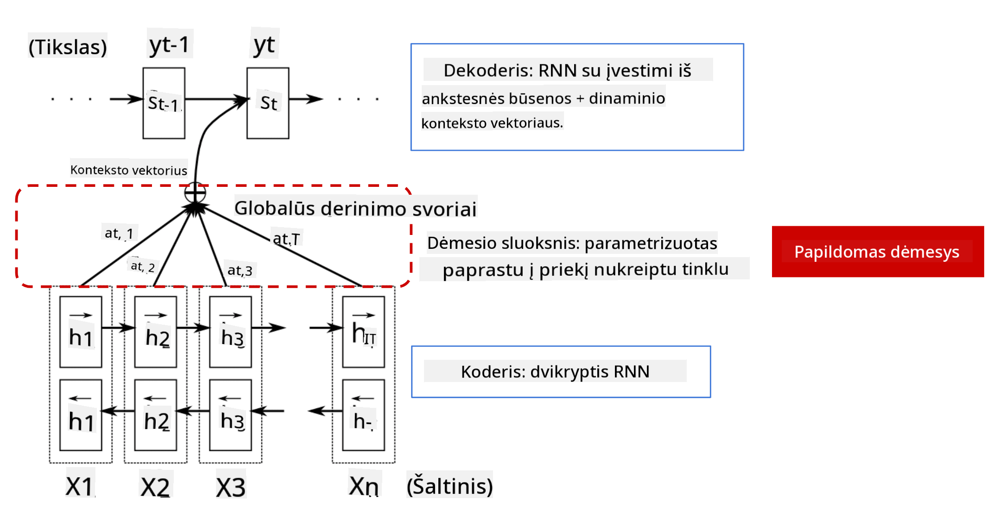

<!--
CO_OP_TRANSLATOR_METADATA:
{
  "original_hash": "7e617f0b8de85a43957a853aba09bfeb",
  "translation_date": "2025-08-31T17:57:20+00:00",
  "source_file": "lessons/5-NLP/18-Transformers/README.md",
  "language_code": "lt"
}
-->
# Dėmesio mechanizmai ir transformatoriai

## [Prieš paskaitą skirtas testas](https://red-field-0a6ddfd03.1.azurestaticapps.net/quiz/118)

Vienas svarbiausių NLP (natūralios kalbos apdorojimo) srities uždavinių yra **mašininis vertimas**, esminė užduotis, kurią atlieka tokie įrankiai kaip „Google Translate“. Šioje dalyje mes sutelksime dėmesį į mašininį vertimą arba, plačiau kalbant, į bet kokią *sekos į seką* užduotį (dar vadinamą **sakinių transformacija**).

Naudojant RNN, sekos į seką užduotis įgyvendinama dviem rekursiniais tinklais: vienas tinklas, vadinamas **koduotoju** (encoder), suspaudžia įvesties seką į paslėptą būseną, o kitas tinklas, vadinamas **dekoderiu** (decoder), išskleidžia šią paslėptą būseną į išverstą rezultatą. Tačiau šis metodas turi keletą problemų:

* Galutinė koduotojo tinklo būsena sunkiai prisimena sakinio pradžią, todėl modelis prastai veikia su ilgais sakiniais.
* Visi žodžiai sekoje turi vienodą įtaką rezultatui. Tačiau realybėje tam tikri žodžiai įvesties sekoje dažnai turi didesnę įtaką išvesties sekai nei kiti.

**Dėmesio mechanizmai** suteikia galimybę įvertinti kiekvieno įvesties vektoriaus kontekstinę įtaką kiekvienai RNN išvesties prognozei. Tai įgyvendinama sukuriant trumpesnius ryšius tarp tarpinių įvesties RNN būsenų ir išvesties RNN būsenų. Tokiu būdu, generuojant išvesties simbolį yt, atsižvelgiama į visas įvesties paslėptas būsenas hi, su skirtingais svorio koeficientais αt,i.

> Koduotojo-dekoderio modelis su papildomu dėmesio mechanizmu iš [Bahdanau et al., 2015](https://arxiv.org/pdf/1409.0473.pdf), cituota iš [šio tinklaraščio įrašo](https://lilianweng.github.io/lil-log/2018/06/24/attention-attention.html)

Dėmesio matrica {αi,j} atspindėtų, kokiu mastu tam tikri įvesties žodžiai dalyvauja generuojant tam tikrą žodį išvesties sekoje. Žemiau pateiktas tokios matricos pavyzdys:

> Paveikslas iš [Bahdanau et al., 2015](https://arxiv.org/pdf/1409.0473.pdf) (3 pav.)

Dėmesio mechanizmai yra atsakingi už daugelį dabartinių ar beveik dabartinių NLP pasiekimų. Tačiau dėmesio pridėjimas žymiai padidina modelio parametrų skaičių, o tai sukėlė mastelio problemas su RNN. Vienas pagrindinių RNN mastelio apribojimų yra tas, kad modelių rekursinis pobūdis apsunkina mokymo partijų apdorojimą ir lygiagretinimą. RNN kiekvienas sekos elementas turi būti apdorojamas nuosekliai, todėl lygiagretinimas tampa sudėtingas.

> Paveikslas iš [Google tinklaraščio](https://research.googleblog.com/2016/09/a-neural-network-for-machine.html)

Dėmesio mechanizmų pritaikymas kartu su šiuo apribojimu paskatino sukurti dabartinius pažangiausius transformatorių modelius, tokius kaip BERT ir Open-GPT3.

## Transformatorių modeliai

Viena pagrindinių transformatorių idėjų yra išvengti RNN sekos pobūdžio ir sukurti modelį, kuris būtų lygiagretinamas mokymo metu. Tai pasiekiama įgyvendinant dvi idėjas:

* pozicinį kodavimą
* savidėmesio mechanizmą, skirtą modeliuoti šablonus vietoj RNN (arba CNN) (todėl straipsnis, pristatantis transformatorius, vadinasi *[Attention is all you need](https://arxiv.org/abs/1706.03762)*)

### Pozicinis kodavimas/įterpimas

Pozicinio kodavimo idėja yra tokia:  
1. Naudojant RNN, žodžių santykinė pozicija yra atspindima žingsnių skaičiumi, todėl jos nereikia aiškiai nurodyti.  
2. Tačiau perėjus prie dėmesio mechanizmų, reikia žinoti žodžių santykines pozicijas sekoje.  
3. Norint gauti pozicinį kodavimą, prie žodžių sekos pridedame jų pozicijų seką (pvz., skaičius 0, 1, ...).  
4. Tada poziciją sumaišome su žodžio įterpimo vektoriumi. Norėdami transformuoti poziciją (sveikąjį skaičių) į vektorių, galime naudoti skirtingus metodus:

* Mokomąjį įterpimą, panašų į žodžių įterpimą. Šį metodą čia ir nagrinėjame. Taikome įterpimo sluoksnius tiek žodžiams, tiek jų pozicijoms, gauname vienodo dydžio įterpimo vektorius, kuriuos tada sudedame.
* Fiksuotą pozicijos kodavimo funkciją, kaip siūloma originaliame straipsnyje.

> Vaizdas autoriaus

Rezultatas, kurį gauname su poziciniu įterpimu, apima tiek originalų žodį, tiek jo poziciją sekoje.

### Daugiafunkcinis savidėmesys

Toliau reikia užfiksuoti tam tikrus šablonus sekoje. Tam transformatoriai naudoja **savidėmesio** mechanizmą, kuris iš esmės yra dėmesys, taikomas tai pačiai sekai kaip įvestis ir išvestis. Taikant savidėmesį, galime atsižvelgti į **kontekstą** sakinyje ir pamatyti, kurie žodžiai yra tarpusavyje susiję. Pavyzdžiui, tai leidžia pamatyti, į ką nurodo įvardžiai, tokie kaip *jis*, ir taip pat atsižvelgti į kontekstą:

> Vaizdas iš [Google tinklaraščio](https://research.googleblog.com/2017/08/transformer-novel-neural-network.html)

Transformatoriuose naudojame **daugiafunkcinį dėmesį**, kad tinklas galėtų užfiksuoti kelis skirtingus priklausomybių tipus, pvz., ilgalaikius ir trumpalaikius žodžių ryšius, koreferencijas ir kt.

[TensorFlow užrašų knygelė](TransformersTF.ipynb) pateikia daugiau detalių apie transformatorių sluoksnių įgyvendinimą.

### Koduotojo-dekoderio dėmesys

Transformatoriuose dėmesys naudojamas dviejose vietose:

* Norint užfiksuoti šablonus įvesties tekste naudojant savidėmesį.
* Norint atlikti sekos vertimą – tai yra dėmesio sluoksnis tarp koduotojo ir dekoderio.

Koduotojo-dekoderio dėmesys yra labai panašus į dėmesio mechanizmą, naudojamą RNN, kaip aprašyta šios dalies pradžioje. Ši animuota diagrama paaiškina koduotojo-dekoderio dėmesio vaidmenį.

Kadangi kiekviena įvesties pozicija nepriklausomai susiejama su kiekviena išvesties pozicija, transformatoriai gali geriau lygiagretinti nei RNN, o tai leidžia kurti daug didesnius ir išraiškingesnius kalbos modelius. Kiekviena dėmesio galvutė gali būti naudojama mokytis skirtingų žodžių santykių, kurie pagerina NLP užduočių rezultatus.

## BERT

**BERT** (Bidirectional Encoder Representations from Transformers) yra labai didelis daugiasluoksnis transformatorių tinklas su 12 sluoksnių *BERT-base* versijoje ir 24 sluoksniais *BERT-large* versijoje. Modelis pirmiausia iš anksto apmokomas naudojant didelį tekstų korpusą (Vikipedija + knygos) taikant nesupervizuotą mokymą (prognozuojant užmaskuotus žodžius sakinyje). Per išankstinį mokymą modelis įgyja reikšmingą kalbos supratimą, kurį vėliau galima pritaikyti kitose duomenų rinkiniuose naudojant smulkųjį derinimą. Šis procesas vadinamas **perkėlimo mokymusi**.

> Vaizdo [šaltinis](http://jalammar.github.io/illustrated-bert/)

## ✍️ Pratimai: Transformatoriai

Tęskite mokymąsi šiose užrašų knygelėse:

* [Transformatoriai PyTorch](TransformersPyTorch.ipynb)
* [Transformatoriai TensorFlow](TransformersTF.ipynb)

## Išvada

Šioje pamokoje sužinojote apie transformatorius ir dėmesio mechanizmus – visus esminius NLP įrankių rinkinio elementus. Yra daugybė transformatorių architektūrų variantų, įskaitant BERT, DistilBERT, BigBird, OpenGPT3 ir daugiau, kuriuos galima smulkiai derinti. [HuggingFace paketas](https://github.com/huggingface/) suteikia galimybę treniruoti daugelį šių architektūrų tiek su PyTorch, tiek su TensorFlow.

## 🚀 Iššūkis

## [Po paskaitos skirtas testas](https://red-field-0a6ddfd03.1.azurestaticapps.net/quiz/218)

## Peržiūra ir savarankiškas mokymasis

* [Tinklaraščio įrašas](https://mchromiak.github.io/articles/2017/Sep/12/Transformer-Attention-is-all-you-need/), paaiškinantis klasikinį [Attention is all you need](https://arxiv.org/abs/1706.03762) straipsnį apie transformatorius.
* [Tinklaraščių serija](https://towardsdatascience.com/transformers-explained-visually-part-1-overview-of-functionality-95a6dd460452) apie transformatorius, išsamiai paaiškinanti architektūrą.

## [Užduotis](assignment.md)

---

**Atsakomybės apribojimas**:  
Šis dokumentas buvo išverstas naudojant AI vertimo paslaugą [Co-op Translator](https://github.com/Azure/co-op-translator). Nors siekiame tikslumo, prašome atkreipti dėmesį, kad automatiniai vertimai gali turėti klaidų ar netikslumų. Originalus dokumentas jo gimtąja kalba turėtų būti laikomas autoritetingu šaltiniu. Kritinei informacijai rekomenduojama naudoti profesionalų žmogaus vertimą. Mes neprisiimame atsakomybės už nesusipratimus ar klaidingus interpretavimus, atsiradusius dėl šio vertimo naudojimo.