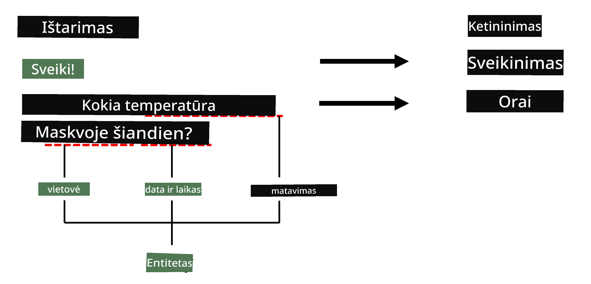

# Pavadinimų atpažinimas

Iki šiol daugiausia dėmesio skyrėme vienai NLP užduočiai – klasifikacijai. Tačiau yra ir kitų NLP užduočių, kurias galima atlikti naudojant neuroninius tinklus. Viena iš tokių užduočių yra **[Pavadinimų atpažinimas](https://wikipedia.org/wiki/Named-entity_recognition)** (NER), kuris susijęs su specifinių objektų atpažinimu tekste, tokių kaip vietovės, asmenų vardai, datos ir laiko intervalai, cheminės formulės ir pan.

## [Prieš paskaitos testas](https://ff-quizzes.netlify.app/en/ai/quiz/37)

## NER naudojimo pavyzdys

Tarkime, norite sukurti natūralios kalbos pokalbių robotą, panašų į Amazon Alexa ar Google Assistant. Išmanūs pokalbių robotai veikia taip, kad *supranta*, ko vartotojas nori, atlikdami teksto klasifikaciją pagal įvestą sakinį. Šios klasifikacijos rezultatas yra vadinamas **intencija**, kuri nurodo, ką pokalbių robotas turėtų atlikti.

> Vaizdas sukurtas autoriaus

Tačiau vartotojas gali pateikti tam tikrus parametrus kaip frazės dalį. Pavyzdžiui, prašydamas informacijos apie orą, jis gali nurodyti vietą ar datą. Robotui reikia suprasti šiuos objektus ir užpildyti parametrų laukus prieš atliekant veiksmą. Būtent čia praverčia NER.

> ✅ Kitas pavyzdys galėtų būti [mokslinių medicininių straipsnių analizė](https://soshnikov.com/science/analyzing-medical-papers-with-azure-and-text-analytics-for-health/). Vienas iš pagrindinių dalykų, kuriuos reikia surasti, yra specifiniai medicininiai terminai, tokie kaip ligos ir medicininės medžiagos. Nors nedidelį ligų skaičių galima išgauti naudojant paprastą paiešką, sudėtingesni objektai, tokie kaip cheminiai junginiai ir vaistų pavadinimai, reikalauja sudėtingesnio požiūrio.

## NER kaip žodžių klasifikacija

NER modeliai iš esmės yra **žodžių klasifikacijos modeliai**, nes kiekvienam įvesties žodžiui reikia nuspręsti, ar jis priklauso objektui, ir jei taip – kokiai objektų klasei.

Apsvarstykime šį straipsnio pavadinimą:

**Trikuspidinio vožtuvo regurgitacija** ir **ličio karbonato** **toksikacija** naujagimiui.

Objektai čia yra:

* Trikuspidinio vožtuvo regurgitacija yra liga (`DIS`)
* Litio karbonatas yra cheminė medžiaga (`CHEM`)
* Toksikacija taip pat yra liga (`DIS`)

Atkreipkite dėmesį, kad vienas objektas gali apimti kelis žodžius. Ir, kaip šiuo atveju, reikia atskirti du iš eilės einančius objektus. Todėl dažnai naudojamos dvi klasės kiekvienam objektui – viena nurodo pirmąjį objekto žodį (dažnai naudojamas `B-` prefiksas, reiškiantis **p**radžią), o kita – objekto tęsinį (`I-`, reiškiantis **v**idinius žodžius). Taip pat naudojame `O` klasę, kad pažymėtume visus **k**itus žodžius. Toks žodžių žymėjimas vadinamas [BIO žymėjimu](https://en.wikipedia.org/wiki/Inside%E2%80%93outside%E2%80%93beginning_(tagging)) (arba IOB). Pažymėjus, mūsų pavadinimas atrodys taip:

Žodis | Žyma
------|-----
Trikuspidinio | B-DIS
vožtuvo | I-DIS
regurgitacija | I-DIS
ir | O
litio | B-CHEM
karbonato | I-CHEM
toksikacija | B-DIS
naujagimiui | O
. | O

Kadangi reikia sukurti vienas prie vieno atitikimą tarp žodžių ir klasių, galime treniruoti tinkamą **daugelio prie daugelio** neuroninio tinklo modelį pagal šį paveikslą:

> *Vaizdas iš [šio tinklaraščio įrašo](http://karpathy.github.io/2015/05/21/rnn-effectiveness/) autoriaus [Andrejaus Karpathy](http://karpathy.github.io/). NER žodžių klasifikacijos modeliai atitinka dešiniausią tinklo architektūrą šiame paveikslėlyje.*

## NER modelių mokymas

Kadangi NER modelis iš esmės yra žodžių klasifikacijos modelis, šiai užduočiai galime naudoti RNN, su kuriais jau esame susipažinę. Šiuo atveju kiekvienas pasikartojančio tinklo blokas grąžins žodžio ID. Šiame pavyzdiniame užrašų knygelėje parodyta, kaip treniruoti LSTM žodžių klasifikacijai.

## ✍️ Pavyzdiniai užrašų knygelės: NER

Tęskite mokymąsi šioje užrašų knygelėje:

* [NER su TensorFlow](NER-TF.ipynb)

## Išvada

NER modelis yra **žodžių klasifikacijos modelis**, tai reiškia, kad jis gali būti naudojamas žodžių klasifikacijai. Tai labai dažna NLP užduotis, padedanti atpažinti specifinius objektus tekste, įskaitant vietas, vardus, datas ir daugiau.

## 🚀 Iššūkis

Atlikite žemiau pateiktą užduotį, kad išmokytumėte medicininių terminų atpažinimo modelį, o vėliau išbandykite jį su kitu duomenų rinkiniu.

## [Po paskaitos testas](https://ff-quizzes.netlify.app/en/ai/quiz/38)

## Apžvalga ir savarankiškas mokymasis

Perskaitykite tinklaraštį [Nepagrįstas pasikartojančių neuroninių tinklų efektyvumas](http://karpathy.github.io/2015/05/21/rnn-effectiveness/) ir sekite tolesnio skaitymo skyrių šiame straipsnyje, kad pagilintumėte savo žinias.

## [Užduotis](lab/README.md)

Šios pamokos užduotyje turėsite išmokyti medicininių objektų atpažinimo modelį. Galite pradėti nuo LSTM modelio mokymo, kaip aprašyta šioje pamokoje, ir pereiti prie BERT transformatoriaus modelio. Perskaitykite [instrukcijas](lab/README.md), kad sužinotumėte visas detales.

---

