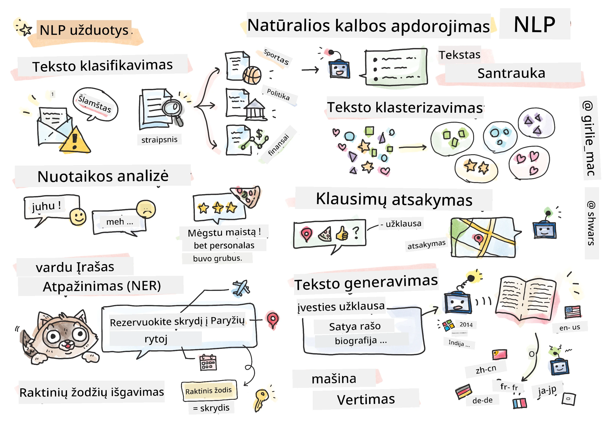

# Natūralios kalbos apdorojimas



Šiame skyriuje mes sutelksime dėmesį į neuroninių tinklų naudojimą užduotims, susijusioms su **natūralios kalbos apdorojimu (NLP)**. Yra daugybė NLP problemų, kurias norime, kad kompiuteriai galėtų išspręsti:

* **Teksto klasifikavimas** yra tipiška klasifikavimo problema, susijusi su teksto sekų analizavimu. Pavyzdžiai apima el. laiškų klasifikavimą kaip šlamštą ar ne šlamštą arba straipsnių kategorijų nustatymą, pvz., sportas, verslas, politika ir kt. Taip pat, kuriant pokalbių robotus, dažnai reikia suprasti, ką vartotojas norėjo pasakyti – šiuo atveju susiduriame su **ketinimų klasifikavimu**. Ketinimų klasifikavime dažnai reikia dirbti su daugybe kategorijų.
* **Nuotaikos analizė** yra tipiška regresijos problema, kurioje reikia priskirti skaičių (nuotaiką), atitinkantį, kiek teigiamas/neigiamas yra sakinio prasmė. Pažangesnė nuotaikos analizės versija yra **nuotaikos analizė pagal aspektus** (ABSA), kur nuotaika priskiriama ne visam sakiniui, o skirtingoms jo dalims (aspektams), pvz., *Šiame restorane man patiko virtuvė, bet atmosfera buvo siaubinga*.
* **Pavadintų objektų atpažinimas** (NER) reiškia problemą, kai reikia išgauti tam tikrus objektus iš teksto. Pavyzdžiui, frazėje *Man reikia skristi į Paryžių rytoj* žodis *rytoj* reiškia DATĄ, o *Paryžius* yra VIETA.  
* **Raktinių žodžių išgavimas** yra panašus į NER, tačiau reikia automatiškai išgauti žodžius, svarbius sakinio prasmei, be išankstinio mokymo konkretiems objektų tipams.
* **Teksto grupavimas** gali būti naudingas, kai norime sugrupuoti panašius sakinius, pavyzdžiui, panašius prašymus techninės pagalbos pokalbiuose.
* **Klausimų atsakymas** reiškia modelio gebėjimą atsakyti į konkretų klausimą. Modelis gauna teksto ištrauką ir klausimą kaip įvestį, o jam reikia pateikti vietą tekste, kur yra atsakymas į klausimą (arba kartais sugeneruoti atsakymo tekstą).
* **Teksto generavimas** yra modelio gebėjimas generuoti naują tekstą. Tai galima laikyti klasifikavimo užduotimi, kurioje prognozuojamas kitas raidė/žodis pagal tam tikrą *teksto užuominą*. Pažangūs teksto generavimo modeliai, tokie kaip GPT-3, gali spręsti kitas NLP užduotis, pvz., klasifikavimą, naudojant techniką, vadinamą [užuominų programavimu](https://towardsdatascience.com/software-3-0-how-prompting-will-change-the-rules-of-the-game-a982fbfe1e0) arba [užuominų inžinerija](https://medium.com/swlh/openai-gpt-3-and-prompt-engineering-dcdc2c5fcd29).
* **Teksto santrauka** yra technika, kai norime, kad kompiuteris "perskaitytų" ilgą tekstą ir apibendrintų jį keliomis sakiniais.
* **Mašininis vertimas** gali būti laikomas teksto supratimo viena kalba ir teksto generavimo kita kalba deriniu.

Iš pradžių dauguma NLP užduočių buvo sprendžiamos naudojant tradicinius metodus, tokius kaip gramatikos. Pavyzdžiui, mašininiame vertime buvo naudojami analizatoriai, kad pradinė frazė būtų paversta sintaksės medžiu, tada buvo išgaunamos aukštesnio lygio semantinės struktūros, kad būtų atspindėta sakinio prasmė, ir remiantis šia prasme bei tikslinės kalbos gramatika buvo generuojamas rezultatas. Šiandien daugelis NLP užduočių efektyviau sprendžiamos naudojant neuroninius tinklus.

> Daugelis klasikinių NLP metodų yra įgyvendinti [Natural Language Processing Toolkit (NLTK)](https://www.nltk.org) Python bibliotekoje. Internete yra puiki [NLTK knyga](https://www.nltk.org/book/), kurioje aptariama, kaip skirtingos NLP užduotys gali būti sprendžiamos naudojant NLTK.

Mūsų kurse mes daugiausia dėmesio skirsime neuroninių tinklų naudojimui NLP, o NLTK naudosime, kai to reikės.

Mes jau išmokome naudoti neuroninius tinklus darbui su lenteliniais duomenimis ir vaizdais. Pagrindinis skirtumas tarp šių duomenų tipų ir teksto yra tas, kad tekstas yra kintamo ilgio seka, o vaizdų atveju įvesties dydis yra žinomas iš anksto. Nors konvoliuciniai tinklai gali išgauti šablonus iš įvesties duomenų, šablonai tekste yra sudėtingesni. Pvz., neigimas gali būti atskirtas nuo subjekto daugybe žodžių (pvz., *Man nepatinka apelsinai* vs. *Man nepatinka tie dideli spalvingi skanūs apelsinai*), ir tai vis tiek turėtų būti interpretuojama kaip vienas šablonas. Todėl, norint apdoroti kalbą, reikia įvesti naujus neuroninių tinklų tipus, tokius kaip *rekurentiniai tinklai* ir *transformeriai*.

## Bibliotekų įdiegimas

Jei naudojate vietinę Python instaliaciją šiam kursui vykdyti, jums gali prireikti įdiegti visas reikalingas NLP bibliotekas naudojant šias komandas:

**PyTorch**
```bash
pip install -r requirements-torch.txt
```
**TensorFlow**
```bash
pip install -r requirements-tf.txt
```

> NLP su TensorFlow galite išbandyti [Microsoft Learn](https://docs.microsoft.com/learn/modules/intro-natural-language-processing-tensorflow/?WT.mc_id=academic-77998-cacaste)

## GPU Įspėjimas

Šiame skyriuje kai kuriuose pavyzdžiuose mes treniruosime gana didelius modelius.
* **Naudokite kompiuterį su GPU**: Patartina vykdyti savo užrašų knygeles kompiuteryje su GPU, kad sumažintumėte laukimo laiką dirbant su dideliais modeliais.
* **GPU atminties apribojimai**: Naudojant GPU gali kilti situacijų, kai pritrūksta GPU atminties, ypač treniruojant didelius modelius.
* **GPU atminties naudojimas**: GPU atminties kiekis, sunaudojamas treniruotės metu, priklauso nuo įvairių veiksnių, įskaitant mini paketų dydį.
* **Mažinkite mini paketų dydį**: Jei susiduriate su GPU atminties problemomis, apsvarstykite galimybę sumažinti mini paketų dydį savo kode kaip galimą sprendimą.
* **TensorFlow GPU atminties išlaisvinimas**: Senesnės TensorFlow versijos gali neteisingai išlaisvinti GPU atmintį, kai treniruojami keli modeliai viename Python branduolyje. Norėdami efektyviai valdyti GPU atminties naudojimą, galite sukonfigūruoti TensorFlow, kad GPU atmintis būtų paskirstoma tik tada, kai to reikia.
* **Kodo įtraukimas**: Norėdami nustatyti TensorFlow, kad GPU atmintis būtų paskirstoma tik tada, kai to reikia, įtraukite šį kodą į savo užrašų knygeles:

```python
physical_devices = tf.config.list_physical_devices('GPU') 
if len(physical_devices)>0:
    tf.config.experimental.set_memory_growth(physical_devices[0], True) 
```

Jei jus domina NLP mokymasis iš klasikinės ML perspektyvos, apsilankykite [šiame pamokų rinkinyje](https://github.com/microsoft/ML-For-Beginners/tree/main/6-NLP).

## Šiame skyriuje
Šiame skyriuje mes išmoksime:

* [Teksto atvaizdavimas kaip tensoriai](13-TextRep/README.md)
* [Žodžių įterpimai](14-Emdeddings/README.md)
* [Kalbos modeliavimas](15-LanguageModeling/README.md)
* [Rekurentiniai neuroniniai tinklai](16-RNN/README.md)
* [Generatyviniai tinklai](17-GenerativeNetworks/README.md)
* [Transformeriai](18-Transformers/README.md)

---

**Atsakomybės apribojimas**:  
Šis dokumentas buvo išverstas naudojant AI vertimo paslaugą [Co-op Translator](https://github.com/Azure/co-op-translator). Nors siekiame tikslumo, prašome atkreipti dėmesį, kad automatiniai vertimai gali turėti klaidų ar netikslumų. Originalus dokumentas jo gimtąja kalba turėtų būti laikomas autoritetingu šaltiniu. Kritinei informacijai rekomenduojama naudoti profesionalų žmogaus vertimą. Mes neprisiimame atsakomybės už nesusipratimus ar klaidingus interpretavimus, atsiradusius dėl šio vertimo naudojimo.