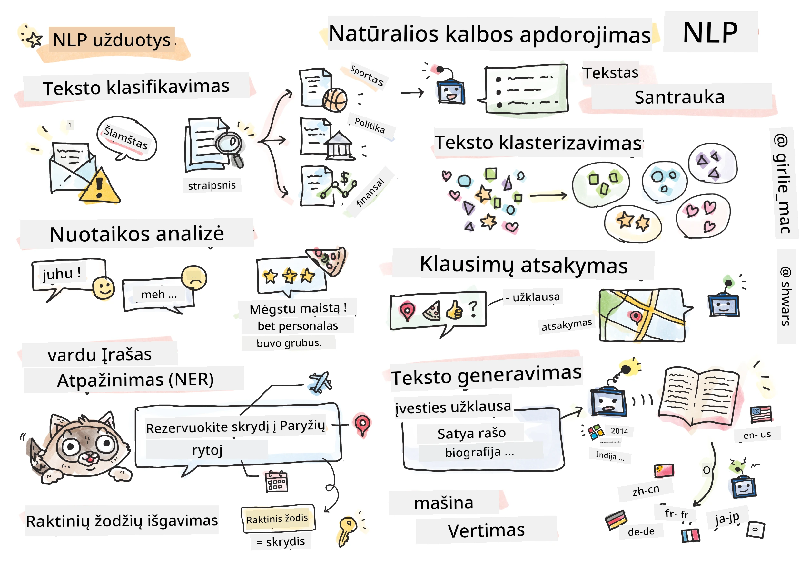

# Natūralios kalbos apdorojimas



Šioje dalyje mes susitelksime į neuroninių tinklų naudojimą užduotims, susijusioms su **natūralios kalbos apdorojimu (NLP)**. Yra daug NLP problemų, kurias norime, kad kompiuteriai galėtų spręsti:

* **Teksto klasifikacija** yra tipinė klasifikacijos problema, susijusi su tekstinių sekų klasifikavimu. Pavyzdžiai apima el. laiškų žymėjimą kaip šlamštas ir ne šlamštas, ar straipsnių kategorijavimą į sportą, verslą, politiką ir pan. Taip pat, kuriant pokalbių robotus, dažnai reikia suprasti, ką vartotojas norėjo pasakyti – tokiu atveju mes sprendžiame **ketinimų klasifikavimo** užduotį. Dažnai ketinimų klasifikacijoje tenka dirbti su daugeliu kategorijų.
* **Nuotaikos analizė** yra tipinė regresijos užduotis, kur reikia priskirti skaičių (nuotaiką), atitinkančią, kiek teigiama ar neigiama sakinio reikšmė. Išplėstinė nuotaikos analizės versija yra **aspektinė nuotaikos analizė** (ABSA), kur nuotaika priskiriama ne visam sakiniui, o skirtingoms jo dalims (aspektams), pvz. *Šiame restorane man patiko virtuvė, bet atmosfera buvo baisi*.
* **Vardinių vienetų atpažinimas** (NER) reiškia problemą iš teksto išskirti tam tikrus vienetus. Pavyzdžiui, turime suprasti, kad frazėje *Man reikia rytoj nuskristi į Paryžių* žodis *rytoj* reiškia DATĄ, o *Paryžius* yra VIETA.  
* **Raktinių žodžių išskyrimas** yra panašus į NER, tačiau reikia automatiškai išskirti svarbius žodžius sakinio reikšmei be išankstinio apmokymo pagal konkrečius vienetų tipus.
* **Teksto grupavimas** gali būti naudingas, kai norime suskirstyti panašius sakinius į grupes, pavyzdžiui, panašius užklausimus techninės pagalbos pokalbiuose.
* **Klausimų atsakymas** reiškia modelio gebėjimą atsakyti į konkretų klausimą. Modelis gauna teksto ištrauką ir klausimą kaip įvestį ir turi pateikti vietą tekste, kur randamas atsakymas (arba kartais sugeneruoti atsakymo tekstą).
* **Teksto generavimas** yra modelio gebėjimas kurti naują tekstą. Tai galima laikyti klasifikacijos užduotimi, kuri pagal tam tikrą *teksto užuominą* prognozuoja kitą raidę/žodį. Pažangūs teksto generavimo modeliai, tokie kaip GPT-3, gali spręsti kitas NLP užduotis, tokias kaip klasifikacija, naudodami vadinamąją [užuominos programavimą](https://towardsdatascience.com/software-3-0-how-prompting-will-change-the-rules-of-the-game-a982fbfe1e0) ar [užuominos inžineriją](https://medium.com/swlh/openai-gpt-3-and-prompt-engineering-dcdc2c5fcd29)
* **Teksto santrauka** yra technika, kai norime, kad kompiuteris „perskaitytų“ ilgą tekstą ir apibendrintų jį keliomis sakiniais.
* **Mašinų vertimas** gali būti laikomas teksto supratimo vienoje kalboje ir teksto generavimo kitoje kalboje deriniu.

Iš pradžių daugumą NLP užduočių spręsdavo tradiciniais metodais, tokiais kaip gramatikos taisyklės. Pavyzdžiui, mašininiame vertime naudoti analizatoriai (parseriai), kurie pradines sakinių struktūras paversdavo sintaksinėmis medžio struktūromis, tuomet išgavus aukštesnio lygio semantines struktūras atstovauti sakinio prasmę, ir remiantis šia prasme bei tikslinės kalbos gramatika sugeneruoti rezultatą. Šiandien daug NLP užduočių efektyviau sprendžiama naudojant neuroninius tinklus.

> Daugelis klasikinių NLP metodų yra įgyvendinti [Natural Language Processing Toolkit (NLTK)](https://www.nltk.org) Python bibliotekoje. Yra puiki [NLTK Knyga](https://www.nltk.org/book/), prieinama internete, kurioje aptariama, kaip skirtingas NLP užduotis galima spręsti naudojant NLTK.

Mūsų kurse daugiausia dėmesio skirsime neuroniniams tinklams NLP srityje ir naudosime NLTK, kai to reikės.

Jau esame išmokę naudoti neuroninius tinklus darbui su lenteliniu duomenimis ir vaizdais. Pagrindinis skirtumas tarp tokių duomenų ir teksto yra tas, kad tekstas yra kintamo ilgio seka, o įvesties dydis vaizdų atveju yra iš anksto žinomas. Nors konvoliuciniai tinklai gali išgauti modelius iš įvesties duomenų, teksto modeliai yra sudėtingesni. Pvz., neigimo žodžiai gali būti atskirti nuo veiksnio žodžio daugybe žodžių (pvz., *Man nepatinka apelsinai* ir *Man nepatinka tie dideli spalvingi skanūs apelsinai*), tačiau tai vis tiek turėtų būti interpretuojama kaip vienas modelis. Todėl kalbos apdorojimui reikia naudoti naujas neuroninių tinklų rūšis, tokias kaip *rekursiniai tinklai* ir *transformeriai*.

## Bibliotekų įdiegimas

Jei naudojate vietinę Python instaliaciją šiam kursui vykdyti, jums gali prireikti įdiegti visas reikalingas NLP bibliotekas naudodami šias komandas:

**PyTorch atveju**
```bash
pip install -r requirements-pytorch.txt
```
**TensorFlow atveju**
```bash
pip install -r requirements-tf.txt
```

> NLP su TensorFlow galite išbandyti [Microsoft Learn](https://docs.microsoft.com/learn/modules/intro-natural-language-processing-tensorflow/?WT.mc_id=academic-77998-cacaste)

## Įspėjimas dėl GPU

Šioje dalyje kai kuriuose pavyzdžiuose mokysime gana didelius modelius.
* **Naudokite kompiuterį su GPU**: patartina paleisti savo užrašų knygutes (notebook) kompiuteryje su GPU, kad sumažintumėte laukimo laiką dirbant su dideliais modeliais.
* **GPU atminties apribojimai**: dirbant su GPU gali atsirasti atvejų, kai pritrūksta GPU atminties, ypač treniruojant didelius modelius.
* **GPU atminties naudojimas**: GPU atminties sunaudojimas treniruočių metu priklauso nuo daugelio veiksnių, įskaitant mini paketo dydį.
* **Sumažinkite mini paketo dydį**: jei kyla GPU atminties problemų, apsvarstykite mini paketo dydžio sumažinimą savo kode kaip galimą sprendimą.
* **TensorFlow GPU atminties išlaisvinimas**: senesnės TensorFlow versijos gali neteisingai išlaisvinti GPU atmintį treniruojant kelis modelius viename Python branduolyje. Norint efektyviai valdyti GPU atminties naudojimą, galite sukonfigūruoti TensorFlow taip, kad GPU atmintis būtų rezervuojama tik būtiniausiais atvejais.
* **Kodo įtraukimas**: norint, kad TensorFlow GPU atmintį pritrauktų tik augant poreikiui, įtraukite šį kodą į savo užrašų knygutes:

```python
physical_devices = tf.config.list_physical_devices('GPU') 
if len(physical_devices)>0:
    tf.config.experimental.set_memory_growth(physical_devices[0], True) 
```

Jei jus domina NLP mokymasis iš klasikinio ML požiūrio, apsilankykite [šiame pamokų rinkinyje](https://github.com/microsoft/ML-For-Beginners/tree/main/6-NLP)

## Šioje dalyje
Šioje dalyje mes sužinosime apie:

* [Teksto vaizdavimą tensoriais](13-TextRep/README.md)
* [Žodžių įterpimus](14-Embeddings/README.md)
* [Kalbos modeliavimą](15-LanguageModeling/README.md)
* [Rekursinius neuroninius tinklus](16-RNN/README.md)
* [Generatyvinius tinklus](17-GenerativeNetworks/README.md)
* [Transformerius](18-Transformers/README.md)

---

<!-- CO-OP TRANSLATOR DISCLAIMER START -->
**Atsakomybės apribojimas**:
Šis dokumentas buvo išverstas naudojant dirbtinio intelekto vertimo paslaugą [Co-op Translator](https://github.com/Azure/co-op-translator). Nors siekiame tikslumo, prašome atkreipti dėmesį, kad automatiniai vertimai gali turėti klaidų ar netikslumų. Originalus dokumentas jo gimtąja kalba laikomas autoritetingu šaltiniu. Svarbiai informacijai rekomenduojama naudoti profesionalų žmogiškąjį vertimą. Mes neatsakome už jokius nesusipratimus ar neteisingą interpretaciją, kilusią naudojantis šiuo vertimu.
<!-- CO-OP TRANSLATOR DISCLAIMER END -->