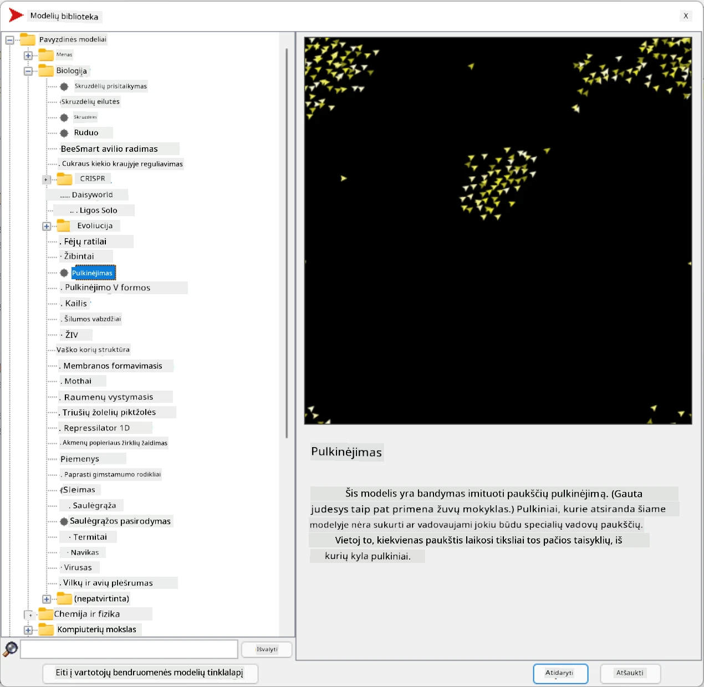
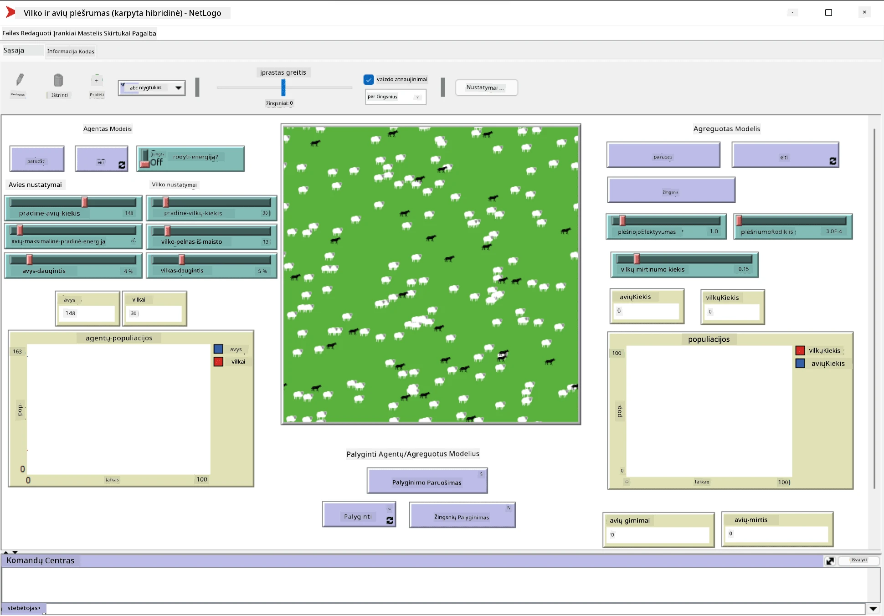

# Daugiagentės sistemos

Vienas iš galimų būdų pasiekti intelektą yra vadinamasis **emergentinis** (arba **sinerginis**) požiūris, kuris remiasi faktu, kad daugelio palyginti paprastų agentų bendras elgesys gali sukurti sudėtingesnį (arba intelektualesnį) visos sistemos elgesį. Teoriškai tai grindžiama [kolektyvinio intelekto](https://en.wikipedia.org/wiki/Collective_intelligence), [emergentizmo](https://en.wikipedia.org/wiki/Global_brain) ir [evoliucinės kibernetikos](https://en.wikipedia.org/wiki/Global_brain) principais, kurie teigia, kad aukštesnio lygio sistemos įgyja tam tikrą pridėtinę vertę, kai tinkamai sujungiamos iš žemesnio lygio sistemų (*metasistemos perėjimo principas*).

## [Prieš paskaitą vykdomas testas](https://ff-quizzes.netlify.app/en/ai/quiz/45)

Daugiagenčių sistemų kryptis dirbtinio intelekto srityje atsirado 1990-aisiais, reaguojant į interneto ir paskirstytų sistemų augimą. Vienas iš klasikinių dirbtinio intelekto vadovėlių, [Artificial Intelligence: A Modern Approach](https://en.wikipedia.org/wiki/Artificial_Intelligence:_A_Modern_Approach), nagrinėja klasikinio dirbtinio intelekto požiūrį iš daugiagenčių sistemų perspektyvos.

Daugiagenčių požiūrio centre yra **agentas** – subjektas, kuris gyvena tam tikroje **aplinkoje**, kurią jis gali suvokti ir veikti. Tai labai plati apibrėžtis, ir agentai gali būti skirstomi į daugybę tipų ir klasifikacijų:

* Pagal gebėjimą mąstyti:
   - **Reaktyvūs** agentai paprastai turi paprastą užklausos-atsako tipo elgesį
   - **Apgalvoti** agentai naudoja tam tikrą loginį mąstymą ir/arba planavimo gebėjimus
* Pagal vietą, kurioje vykdomas agento kodas:
   - **Stacionarūs** agentai veikia dedikuotame tinklo mazge
   - **Mobilūs** agentai gali perkelti savo kodą tarp tinklo mazgų
* Pagal elgesį:
   - **Pasyvūs agentai** neturi specifinių tikslų. Tokie agentai gali reaguoti į išorinius dirgiklius, bet patys veiksmų neinicijuoja.
   - **Aktyvūs agentai** turi tam tikrus tikslus, kurių siekia
   - **Kognityviniai agentai** įtraukia sudėtingą planavimą ir mąstymą

Daugiagentės sistemos šiandien naudojamos įvairiose srityse:

* Žaidimuose daugelis ne žaidėjo personažų naudoja tam tikrą dirbtinį intelektą ir gali būti laikomi intelektualiais agentais
* Vaizdo gamyboje sudėtingų 3D scenų, kuriose dalyvauja minios, atvaizdavimas paprastai atliekamas naudojant daugiagenčių simuliaciją
* Sistemų modeliavime daugiagentės sistemos naudojamos sudėtingo modelio elgesiui simuliuoti. Pavyzdžiui, daugiagentės sistemos buvo sėkmingai naudojamos COVID-19 ligos plitimui visame pasaulyje prognozuoti. Panašus požiūris gali būti naudojamas miesto eismui modeliuoti ir stebėti, kaip jis reaguoja į eismo taisyklių pokyčius.
* Sudėtingose automatizavimo sistemose kiekvienas įrenginys gali veikti kaip nepriklausomas agentas, todėl visa sistema tampa mažiau monolitinė ir atsparesnė.

Mes nesigilinsime į daugiagenčių sistemų detales, bet apsvarstysime vieną **daugiagenčių modeliavimą**.

## NetLogo

[NetLogo](https://ccl.northwestern.edu/netlogo/) yra daugiagenčių modeliavimo aplinka, pagrįsta modifikuota [Logo](https://en.wikipedia.org/wiki/Logo_(programming_language)) programavimo kalba. Ši kalba buvo sukurta mokyti vaikus programavimo koncepcijų, ir ji leidžia valdyti agentą, vadinamą **vėžliuku**, kuris gali judėti, palikdamas pėdsaką. Tai leidžia kurti sudėtingas geometrines figūras, kurios yra labai vizualus būdas suprasti agento elgesį.

NetLogo aplinkoje galime sukurti daug vėžliukų naudodami komandą `create-turtles`. Tada galime nurodyti visiems vėžliukams atlikti tam tikrus veiksmus (pvz., žemiau pateiktame pavyzdyje – pajudėti 10 taškų į priekį):

```
create-turtles 10
ask turtles [
  forward 10
]
```

Žinoma, nėra įdomu, kai visi vėžliukai daro tą patį, todėl galime `ask` tam tikras vėžliukų grupes, pvz., esančias tam tikro taško aplinkoje. Taip pat galime sukurti skirtingų *veislių* vėžliukus naudodami komandą `breed [cats cat]`. Čia `cat` yra veislės pavadinimas, ir reikia nurodyti tiek vienaskaitos, tiek daugiskaitos formą, nes skirtingos komandos naudoja skirtingas formas aiškumo dėlei.

> ✅ Mes nesimokysime pačios NetLogo kalbos – jei norite sužinoti daugiau, galite apsilankyti puikiame [Pradedančiųjų interaktyviame NetLogo žodyne](https://ccl.northwestern.edu/netlogo/bind/).

Galite [atsisiųsti](https://ccl.northwestern.edu/netlogo/download.shtml) ir įdiegti NetLogo, kad išbandytumėte.

### Modelių biblioteka

Puikus dalykas apie NetLogo yra tai, kad ji turi veikiančių modelių biblioteką, kurią galite išbandyti. Eikite į **File &rightarrow; Models Library**, ir turėsite daugybę modelių kategorijų, iš kurių galite rinktis.



> Dmitry Soshnikov modelių bibliotekos ekrano kopija

Galite atidaryti vieną iš modelių, pavyzdžiui, **Biology &rightarrow; Flocking**.

### Pagrindiniai principai

Atidarius modelį, būsite nukreipti į pagrindinį NetLogo ekraną. Čia pateikiamas pavyzdinis modelis, aprašantis vilkų ir avių populiaciją, turint ribotus išteklius (žolę).



> Dmitry Soshnikov ekrano kopija

Šiame ekrane galite matyti:

* **Sąsajos** skyrių, kuriame yra:
  - Pagrindinis laukas, kuriame gyvena visi agentai
  - Skirtingi valdikliai: mygtukai, slankikliai ir kt.
  - Grafikai, kuriuos galite naudoti simuliacijos parametrams rodyti
* **Kodo** skirtuką, kuriame yra redaktorius, kuriame galite rašyti NetLogo programą

Daugeliu atvejų sąsajoje bus **Setup** mygtukas, kuris inicijuoja simuliacijos būseną, ir **Go** mygtukas, kuris pradeda vykdymą. Šie mygtukai valdomi atitinkamais kodų tvarkytojais, kurie atrodo taip:

```
to go [
...
]
```

NetLogo pasaulis susideda iš šių objektų:

* **Agentai** (vėžliukai), kurie gali judėti po lauką ir atlikti veiksmus. Agentus galite valdyti naudodami `ask turtles [...]` sintaksę, o kodas skliaustuose vykdomas visų agentų *vėžliuko režimu*.
* **Lopinėliai** yra kvadratinės lauko sritys, kuriose gyvena agentai. Galite kreiptis į visus agentus, esančius tame pačiame lopinėlyje, arba galite keisti lopinėlio spalvas ir kitas savybes. Taip pat galite `ask patches` atlikti veiksmus.
* **Stebėtojas** yra unikalus agentas, kuris valdo pasaulį. Visi mygtukų tvarkytojai vykdomi *stebėtojo režimu*.

> ✅ Daugiagenčių aplinkos grožis yra tas, kad kodas, vykdomas vėžliuko režimu arba lopinėlio režimu, vykdomas tuo pačiu metu visų agentų lygiagrečiai. Taigi, parašę nedaug kodo ir užprogramavę individualaus agento elgesį, galite sukurti sudėtingą visos simuliacijos sistemos elgesį.

### Flocking

Kaip daugiagenčio elgesio pavyzdį, apsvarstykime **[Flocking](https://en.wikipedia.org/wiki/Flocking_(behavior))**. Flocking yra sudėtingas modelis, labai panašus į tai, kaip paukščių pulkai skrenda. Stebėdami jų skrydį galite pagalvoti, kad jie laikosi tam tikro kolektyvinio algoritmo arba turi tam tikrą *kolektyvinį intelektą*. Tačiau šis sudėtingas elgesys atsiranda, kai kiekvienas individualus agentas (šiuo atveju – *paukštis*) stebi kitus agentus, esančius netoliese, ir laikosi trijų paprastų taisyklių:

* **Lygiavimas** – jis nukreipia save pagal vidutinę kaimyninių agentų kryptį
* **Sanglauda** – jis stengiasi nukreipti save pagal vidutinę kaimynų poziciją (*tolimojo diapazono trauka*)
* **Atsiskyrimas** – kai per daug priartėja prie kitų paukščių, jis stengiasi atsitraukti (*trumpojo diapazono atstūmimas*)

Galite paleisti flocking pavyzdį ir stebėti elgesį. Taip pat galite reguliuoti parametrus, tokius kaip *atsiskyrimo laipsnis* arba *matymo diapazonas*, kuris apibrėžia, kaip toli kiekvienas paukštis gali matyti. Atkreipkite dėmesį, kad jei sumažinsite matymo diapazoną iki 0, visi paukščiai taps akli, ir flocking sustos. Jei sumažinsite atsiskyrimą iki 0, visi paukščiai susiburs į tiesią liniją.

> ✅ Pereikite į **Kodo** skirtuką ir pažiūrėkite, kur trys flocking taisyklės (lygiavimas, sanglauda ir atsiskyrimas) yra įgyvendintos kode. Atkreipkite dėmesį, kaip mes kreipiamės tik į tuos agentus, kurie yra matomi.

### Kiti modeliai, kuriuos verta pamatyti

Yra keletas kitų įdomių modelių, kuriuos galite eksperimentuoti:

* **Art &rightarrow; Fireworks** rodo, kaip fejerverkas gali būti laikomas individualių ugnies srautų kolektyviniu elgesiu
* **Social Science &rightarrow; Traffic Basic** ir **Social Science &rightarrow; Traffic Grid** rodo miesto eismo modelį 1D ir 2D tinkle su arba be šviesoforų. Kiekvienas automobilis simuliacijoje laikosi šių taisyklių:
   - Jei erdvė priešais jį tuščia – pagreitėja (iki tam tikro maksimalaus greičio)
   - Jei mato kliūtį priešais – stabdo (ir galite reguliuoti, kaip toli vairuotojas gali matyti)
* **Social Science &rightarrow; Party** rodo, kaip žmonės grupuojasi kokteilių vakarėlio metu. Galite rasti parametrų derinį, kuris lemia greičiausią grupės laimės padidėjimą.

Kaip matote iš šių pavyzdžių, daugiagentės simuliacijos gali būti labai naudingas būdas suprasti sudėtingos sistemos, sudarytos iš individų, kurie laikosi tos pačios ar panašios logikos, elgesį. Tai taip pat gali būti naudojama virtualių agentų, tokių kaip [NPCs](https://en.wikipedia.org/wiki/NPC) kompiuteriniuose žaidimuose ar agentų 3D animuotose pasauliuose, valdymui.

## Apgalvoti agentai

Aukščiau aprašyti agentai yra labai paprasti, reaguojantys į aplinkos pokyčius naudodami tam tikrą algoritmą. Tokie agentai yra **reaktyvūs agentai**. Tačiau kartais agentai gali mąstyti ir planuoti savo veiksmus, tokiu atveju jie vadinami **apgalvotais**.

Tipinis pavyzdys būtų asmeninis agentas, kuris gauna žmogaus instrukciją užsakyti atostogų kelionę. Tarkime, kad internete gyvena daugybė agentų, kurie gali jam padėti. Jis turėtų susisiekti su kitais agentais, kad sužinotų, kokie skrydžiai yra prieinami, kokios yra viešbučių kainos skirtingomis datomis, ir bandyti derėtis dėl geriausios kainos. Kai atostogų planas bus baigtas ir patvirtintas savininko, jis gali tęsti užsakymą.

Tam, kad tai atliktų, agentai turi **bendrauti**. Sėkmingam bendravimui jiems reikia:

* Tam tikrų **standartinių kalbų žinių mainams**, tokių kaip [Knowledge Interchange Format](https://en.wikipedia.org/wiki/Knowledge_Interchange_Format) (KIF) ir [Knowledge Query and Manipulation Language](https://en.wikipedia.org/wiki/Knowledge_Query_and_Manipulation_Language) (KQML). Šios kalbos sukurtos remiantis [kalbos aktų teorija](https://en.wikipedia.org/wiki/Speech_act).
* Šios kalbos taip pat turėtų apimti tam tikrus **derybų protokolus**, pagrįstus skirtingais **aukcionų tipais**.
* **Bendros ontologijos**, kad galėtų remtis tais pačiais konceptais, žinodami jų semantiką
* Būdo **atrasti**, ką skirtingi agentai gali atlikti, taip pat pagrįsto tam tikra ontologija

Apgalvoti agentai yra daug sudėtingesni nei reaktyvūs, nes jie ne tik reaguoja į aplinkos pokyčius, bet ir turi gebėti *inicijuoti* veiksmus. Viena iš siūlomų apgalvotų agentų architektūrų yra vadinamoji Tikėjimo-Noro-Ketinimo (BDI) agento architektūra:

* **Tikėjimai** sudaro žinių rinkinį apie agento aplinką. Tai gali būti struktūrizuota kaip žinių bazė arba taisyklių rinkinys, kurį agentas gali taikyti konkrečioje aplinkos situacijoje.
* **Norai** apibrėžia, ką agentas nori atlikti, t. y. jo tikslus. Pavyzdžiui, aukščiau minėto asmeninio asistento agento tikslas yra užsakyti kelionę, o viešbučio agento tikslas yra maksimaliai padidinti pelną.
* **Ketinimai** yra konkretūs veiksmai, kuriuos agentas planuoja atlikti, kad pasiektų savo tikslus. Veiksmai paprastai keičia aplinką ir sukelia bendravimą su kitais agentais.

Yra keletas platformų, skirtų daugiagenčių sistemų kūrimui, tokių kaip [JADE](https://jade.tilab.com/). [Šiame straipsnyje](https://arxiv.org/ftp/arxiv/papers/2007/2007.08961.pdf) pateikiama daugiagenčių platformų apžvalga kartu su trumpa daugiagenčių sistemų istorija ir jų skirtingais naudojimo scenarijais.

## Išvada

Daugiagentės sistemos gali būti labai įvairios ir naudojamos daugybėje skirtingų sričių. 
Jos visos linkusios sutelkti dėmesį į paprastesnį individualaus agento elgesį, o sudėtingesnis visos sistemos elgesys pasiekiamas dėl **sinerginio efekto**.

## 🚀 Iššūkis

Pritaikykite šią pamoką realiame pasaulyje ir pabandykite sukurti daugiagentės sistemos koncepciją, kuri galėtų išspręsti problemą. Pavyzdžiui, ką daugiagentė sistema turėtų atlikti, kad optimizuotų mokyklinio autobuso maršrutą? Kaip ji galėtų veikti kepykloje?

## [Po paskaitos vykdomas testas](https://ff-quizzes.netlify.app/en/ai/quiz/46)

## Apžvalga ir savarankiškas mokymasis

Išn

---

