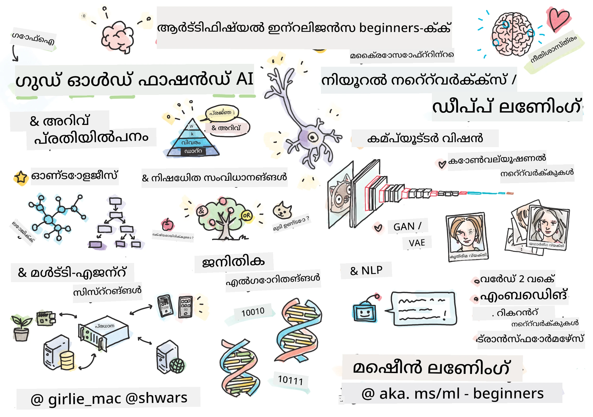

[](https://github.com/microsoft/AI-For-Beginners/blob/main/LICENSE)
[](https://GitHub.com/microsoft/AI-For-Beginners/graphs/contributors/)
[](https://GitHub.com/microsoft/AI-For-Beginners/issues/)
[](https://GitHub.com/microsoft/AI-For-Beginners/pulls/)
[](http://makeapullrequest.com)

[](https://GitHub.com/microsoft/AI-For-Beginners/watchers/)
[](https://GitHub.com/microsoft/AI-For-Beginners/network/)
[](https://GitHub.com/microsoft/AI-For-Beginners/stargazers/)
[](https://mybinder.org/v2/gh/microsoft/ai-for-beginners/HEAD)
[](https://gitter.im/Microsoft/ai-for-beginners?utm_source=badge&utm_medium=badge&utm_campaign=pr-badge)

[](https://discord.gg/nTYy5BXMWG)

# ന്യൂകരുതലിന്റെ പരിചയം - ഒരു പാഠ്യപദ്ധതി

||
|:---:|
| ന്യൂകരുതൽ ഫോർ ബിഗിനേഴ്സ് - _സ്കെച്ച്നോട്ട് [@girlie_mac](https://twitter.com/girlie_mac) എന്നതിലൂടെ_ |

**ന്യൂകരുതലിന്റെ (Artificial Intelligence)** ലോകം 12 ആഴ്ചകൾ, 24 പാഠങ്ങൾ ഉള്ള പാഠ്യപദ്ധതിയുമായി പരിശോധിക്കുക!  ഇതിൽ പ്രായോഗിക പാഠങ്ങൾ, ചോദ്യാവലികൾ, ലബുകൾ ഉൾപ്പെടുത്തിയിരിക്കുന്നു. ഈ പാഠ്യപദ്ധതി തുടക്കക്കാർക്ക് അനുയോജ്യമായതാണും TensorFlow, PyTorch പോലെയുള്ള ഉപകരണങ്ങളെയും AI-യിലെ നയതന്ത്രങ്ങളെയും ഉൾക്കൊള്ളുന്നു.


### 🌐 ബഹുഭാഷാ പിന്തുണ

#### ഗിറ്റ്‌ഹബ് ആക്ഷൻ വഴി പിന്തുണ ( സ്വയം പ്രവർത്തിക്കുന്നതും എപ്പോഴും പുതുക്കുന്നതും)

<!-- CO-OP TRANSLATOR LANGUAGES TABLE START -->
[Arabic](../ar/README.md) | [Bengali](../bn/README.md) | [Bulgarian](../bg/README.md) | [Burmese (Myanmar)](../my/README.md) | [Chinese (Simplified)](../zh-CN/README.md) | [Chinese (Traditional, Hong Kong)](../zh-HK/README.md) | [Chinese (Traditional, Macau)](../zh-MO/README.md) | [Chinese (Traditional, Taiwan)](../zh-TW/README.md) | [Croatian](../hr/README.md) | [Czech](../cs/README.md) | [Danish](../da/README.md) | [Dutch](../nl/README.md) | [Estonian](../et/README.md) | [Finnish](../fi/README.md) | [French](../fr/README.md) | [German](../de/README.md) | [Greek](../el/README.md) | [Hebrew](../he/README.md) | [Hindi](../hi/README.md) | [Hungarian](../hu/README.md) | [Indonesian](../id/README.md) | [Italian](../it/README.md) | [Japanese](../ja/README.md) | [Kannada](../kn/README.md) | [Korean](../ko/README.md) | [Lithuanian](../lt/README.md) | [Malay](../ms/README.md) | [Malayalam](./README.md) | [Marathi](../mr/README.md) | [Nepali](../ne/README.md) | [Nigerian Pidgin](../pcm/README.md) | [Norwegian](../no/README.md) | [Persian (Farsi)](../fa/README.md) | [Polish](../pl/README.md) | [Portuguese (Brazil)](../pt-BR/README.md) | [Portuguese (Portugal)](../pt-PT/README.md) | [Punjabi (Gurmukhi)](../pa/README.md) | [Romanian](../ro/README.md) | [Russian](../ru/README.md) | [Serbian (Cyrillic)](../sr/README.md) | [Slovak](../sk/README.md) | [Slovenian](../sl/README.md) | [Spanish](../es/README.md) | [Swahili](../sw/README.md) | [Swedish](../sv/README.md) | [Tagalog (Filipino)](../tl/README.md) | [Tamil](../ta/README.md) | [Telugu](../te/README.md) | [Thai](../th/README.md) | [Turkish](../tr/README.md) | [Ukrainian](../uk/README.md) | [Urdu](../ur/README.md) | [Vietnamese](../vi/README.md)

> **പ്രാദേശികമായി ക്ലോൺ ചെയ്യാനാഗ്രഹമുണ്ടോ?**

> ഈ റിപ്പോസിടറിയിൽ 50+ ഭാഷാ വിവർത്തനങ്ങൾ ഉൾപ്പെടുത്തിയതാണ്, ഇത് ഡൗൺലോഡ് വലിപ്പം വളരെ വർദ്ധിപ്പിക്കുന്നു. വിവർത്തനങ്ങൾ ഇല്ലാതെ ക്ലോൺ ചെയ്യാൻ sparse checkout ഉപയോഗിക്കാം:
> ```bash
> git clone --filter=blob:none --sparse https://github.com/microsoft/AI-For-Beginners.git
> cd AI-For-Beginners
> git sparse-checkout set --no-cone '/*' '!translations' '!translated_images'
> ```
> ഇത് കോഴ്സ് പൂർത്തിയാക്കാൻ ആവശ്യമായ എല്ലാ വസ്തുക്കളും വളരെ വേഗത്തിൽ ഡൗൺലോഡ് ചെയ്യാൻ നിങ്ങളെ സഹായിക്കും.
<!-- CO-OP TRANSLATOR LANGUAGES TABLE END -->

**കൂടുതൽ വിവർത്തന ഭാഷകൾ സപ്പോർട്ട് ചെയ്യാൻ ആഗ്രഹിക്കുന്നുവെങ്കിൽ അവ ഇവിടെ ലിസ്റ്റ് ചെയ്തിരിക്കുന്നു [here](https://github.com/Azure/co-op-translator/blob/main/getting_started/supported-languages.md)**

## കമ്മ്യൂണിറ്റിയിൽ ചേരൂ
[](https://discord.gg/nTYy5BXMWG)

## നിങ്ങൾ പഠിക്കാൻ പോകുന്നത്

**[കോഴ്സിന്റെ മൈൻഡ് മാപ്പ്](http://soshnikov.com/courses/ai-for-beginners/mindmap.html)**

ഈ പാഠ്യപദ്ധതിയിൽ നിങ്ങൾ പഠിക്കാൻ പോകുന്നത്:

* വ്യത്യസ്ത കൃത്രിമ ബുദ്ധിമുട്ട് സമീപനങ്ങൾ, "നല്ല പഴയ" പ്രാതിനിധ്യരീതിയായ **Knowledge Representation** നും കാരണം കണ്ടെത്തലും ഉൾപ്പെടുന്നു ([GOFAI](https://en.wikipedia.org/wiki/Symbolic_artificial_intelligence)).
* ആധുനിക AI-യുടെ മദ്ധ്യത്തിൽ നിന്നുള്ള **Neural Networks** ഉം **Deep Learning** ഉം. പണിമുടക്കുകൾ നോക്കിക്കാണാൻ ഞങ്ങൾ ഈ പ്രധാന വിഷയങ്ങളുടെ ആശയങ്ങൾ രണ്ട് പേരിൽ കൊണ്ട് പ്രയോഗിച്ചിരിക്കുന്നു - [TensorFlow](http://Tensorflow.org)  ഉം [PyTorch](http://pytorch.org)  ഉം.
* ചിത്രങ്ങൾക്കും ടെക്സ്റ്റിനും വേണ്ടി പ്രവർത്തിക്കുന്ന **Neural Architectures**. പുതിയ ഇറങ്ങാഴ്ചകൾ ഉൾപ്പെടുത്തുന്നുണ്ടെങ്കിലും ഏറ്റവും പുതിയ നിലവാരത്തിൽ കുറവ് ഉണ്ടാകാം.
* കുറെയധികം പ്രചാരത്തിലുള്ള പുതിയ AI സമീപനങ്ങൾ, ഉദാഹരണത്തിന് **Genetic Algorithms** ഉം **Multi-Agent Systems** ഉം.

ഈ പാഠ്യപദ്ധതിയിൽ ഉൾപ്പെടുത്താത്ത വിഷയങ്ങൾ:

> [ഈ കോഴ്സിനായുള്ള എല്ലാ അധിക സാമഗ്രികളും ഞങ്ങളുടെ Microsoft Learn ശേഖരത്തിൽ കാണുക](https://learn.microsoft.com/en-us/collections/7w28iy2xrqzdj0?WT.mc_id=academic-77998-bethanycheum)

* **AI ബിസിനസിൽ** ഉപയോഗിക്കുന്ന ബിസിനസ് കേസുകൾ. ഈ വീഡിയോ കോഴ്സ് അല്ലെങ്കിൽ [Introduction to AI for business users](https://docs.microsoft.com/learn/paths/introduction-ai-for-business-users/?WT.mc_id=academic-77998-bethanycheum) എന്ന പഠന പാത മൈക്രോസോഫ്റ്റ് ലേണിൽ കാണാം, അല്ലെങ്കിൽ [AI Business School](https://www.microsoft.com/ai/ai-business-school/?WT.mc_id=academic-77998-bethanycheum), [INSEAD](https://www.insead.edu/) സംയുക്തമായി വികസിപ്പിച്ചതു.
* **പരമ്പരാഗത മെഷീൻ ലേണിംഗ്**, ഇത് നന്നായി പ്രതിപാദിക്കുന്നതാണ് ഞങ്ങളുടെ [Machine Learning for Beginners Curriculum](http://github.com/Microsoft/ML-for-Beginners)ൽ.
* **[Cognitive Services](https://azure.microsoft.com/services/cognitive-services/?WT.mc_id=academic-77998-bethanycheum)** ഉപയോഗിച്ച് നിർമ്മിച്ച പ്രായോഗിക AI പ്രയോഗങ്ങൾ. ഇതിനായി ഞങ്ങൾ ശുപാർശ ചെയ്യുന്നത് മൈക്രോസോഫ്റ്റ് ലേണിൽ നിന്നുള്ള [ദൃശ്യപരമായ](https://docs.microsoft.com/learn/paths/create-computer-vision-solutions-azure-cognitive-services/?WT.mc_id=academic-77998-bethanycheum), [സ്വാഭാവികഭാഷാ പ്രോസസിങ്](https://docs.microsoft.com/learn/paths/explore-natural-language-processing/?WT.mc_id=academic-77998-bethanycheum), **[Azure OpenAI സേവനത്തോടെ ജനന AI](https://learn.microsoft.com/en-us/training/paths/develop-ai-solutions-azure-openai/?WT.mc_id=academic-77998-bethanycheum)** എന്നിവയുടെ മODULEളുകൾ പ്രാരംഭമാക്കുക.
* പ്രത്യേക ML **ക്ലൗഡ് ഫ്രെയിംവർക്ക്**കൾ, ഉദാഹരണത്തിന് [Azure Machine Learning](https://azure.microsoft.com/services/machine-learning/?WT.mc_id=academic-77998-bethanycheum), [Microsoft Fabric](https://learn.microsoft.com/en-us/training/paths/get-started-fabric/?WT.mc_id=academic-77998-bethanycheum), അല്ലെങ്കിൽ [Azure Databricks](https://docs.microsoft.com/learn/paths/data-engineer-azure-databricks?WT.mc_id=academic-77998-bethanycheum). ഇതിന് [Build and operate machine learning solutions with Azure Machine Learning](https://docs.microsoft.com/learn/paths/build-ai-solutions-with-azure-ml-service/?WT.mc_id=academic-77998-bethanycheum)  ഒപ്പം [Build and Operate Machine Learning Solutions with Azure Databricks](https://docs.microsoft.com/learn/paths/build-operate-machine-learning-solutions-azure-databricks/?WT.mc_id=academic-77998-bethanycheum) പഠന പാതകൾ ഉപയോഗിക്കുക.
* **സംവാദ AI**യും **ചാറ്റ് ബോട്ടുകൾ**ഉം. ഇതിന് പ്രത്യേകം [Create conversational AI solutions](https://docs.microsoft.com/learn/paths/create-conversational-ai-solutions/?WT.mc_id=academic-77998-bethanycheum) എന്ന പഠന പാതയുണ്ട്, കൂടുതൽ വിശദമായി [ഈ ബ്ലോഗ് പോസ്റ്റ്](https://soshnikov.com/azure/hello-bot-conversational-ai-on-microsoft-platform/) കാണുക.
* ഡീപ്പ് ലേണിങ്ങിന്റെ പിന്നിലെ **ഗണിതശാസ്ത്രം**. ഇതിന് ഞങ്ങൾ ശുപാർശ ചെയ്യുന്നത് Ian Goodfellow, Yoshua Bengio, Aaron Courville എഴുതിയ [Deep Learning](https://www.amazon.com/Deep-Learning-Adaptive-Computation-Machine/dp/0262035618) എന്ന പുസ്തകം; ഇത് ഓൺലൈൻ [https://www.deeplearningbook.org/](https://www.deeplearningbook.org/) ൽ ലഭ്യമാണ്.

_ക്ലൗഡിലുളള AI_ വിഷയങ്ങളിൽ സുഗമമായ പരിചയത്തിന് [Get started with artificial intelligence on Azure](https://docs.microsoft.com/learn/paths/get-started-with-artificial-intelligence-on-azure/?WT.mc_id=academic-77998-bethanycheum) പഠന പാത സ്വീകരിക്കുക.

# ഉള്ളടക്കം

|     |                                                                 പാഠം ലിങ്ക്                                                                  |                                           PyTorch/Keras/TensorFlow                                          | ലാബ്                                                            |
| :-: | :------------------------------------------------------------------------------------------------------------------------------------------: | :---------------------------------------------------------------------------------------------: | ------------------------------------------------------------------------------ |
| 0  |                                 [കോഴ്സ് സജ്ജീകരണം](./lessons/0-course-setup/setup.md)                                 |                      [നിങ്ങളുടെ ഡെവലപ്മെന്റ് പരിസ്ഥിതി സജ്ജീകരിക്കുക](./lessons/0-course-setup/how-to-run.md)                       |   |
| I  |               [**AI-യിലെ പരിചയം**](./lessons/1-Intro/README.md)      | | |
| 01  |       [AI-യുടെ പരിചയംയും ചരിത്രവും](./lessons/1-Intro/README.md)       |           -                            | -  |
| II |              **പ്രതീകാത്മക പുതുമ**              |
| 02  |       [Knowledge Representation and Expert Systems](./lessons/2-Symbolic/README.md)       |            [Expert Systems](./lessons/2-Symbolic/Animals.ipynb) /  [Ontology](./lessons/2-Symbolic/FamilyOntology.ipynb) /[Concept Graph](./lessons/2-Symbolic/MSConceptGraph.ipynb)                             |  |
| III |                        [**ന്യൂറൽ നെറ്റ്‌വർക്കുകളിലേക്ക് പരിചയം**](./lessons/3-NeuralNetworks/README.md) |||
| 03  |                [പേഴ്സെപ്ട്രോൺ](./lessons/3-NeuralNetworks/03-Perceptron/README.md)                 |                       [നോട്ട്ബുക്ക്](./lessons/3-NeuralNetworks/03-Perceptron/Perceptron.ipynb)                      | [ലാബ്](./lessons/3-NeuralNetworks/03-Perceptron/lab/README.md) |
| 04  |                   [മൾടി-ലേയറഡ് പേഴ്സെപ്ട്രോൺയും സ്വന്തം ഫ്രെയിംവർക്ക് സൃഷ്ടിക്കലും](./lessons/3-NeuralNetworks/04-OwnFramework/README.md)                   |        [നോട്ട്ബുക്ക്](./lessons/3-NeuralNetworks/04-OwnFramework/OwnFramework.ipynb)        | [ലാബ്](./lessons/3-NeuralNetworks/04-OwnFramework/lab/README.md) |
| 05  |            [ഫ്രെയിംവർകുകൾക്ക് പരിചയം (PyTorch/TensorFlow) ഒപ്പം ഓവർഫിറ്റിംഗ്](./lessons/3-NeuralNetworks/05-Frameworks/README.md)             |           [PyTorch](./lessons/3-NeuralNetworks/05-Frameworks/IntroPyTorch.ipynb) / [Keras](./lessons/3-NeuralNetworks/05-Frameworks/IntroKeras.ipynb) / [TensorFlow](./lessons/3-NeuralNetworks/05-Frameworks/IntroKerasTF.ipynb)             | [ലാബ്](./lessons/3-NeuralNetworks/05-Frameworks/lab/README.md) |
| IV  |            [**കമ്പ്യൂട്ടർ വിസൻ**](./lessons/4-ComputerVision/README.md)             | [PyTorch](https://docs.microsoft.com/learn/modules/intro-computer-vision-pytorch/?WT.mc_id=academic-77998-cacaste) / [TensorFlow](https://docs.microsoft.com/learn/modules/intro-computer-vision-TensorFlow/?WT.mc_id=academic-77998-cacaste)| [മൈക്രോസോഫ്റ്റ് അസ്യൂറിൽ കമ്പ്യൂട്ടർ വിസൻ ആഴ്ചിലാഴൂ](https://learn.microsoft.com/en-us/collections/7w28iy2xrqzdj0?WT.mc_id=academic-77998-bethanycheum) |
| 06  |            [കമ്പ്യൂട്ടർ വിസനിലേക്ക് പരിചയം. ഒപൺസിവി](./lessons/4-ComputerVision/06-IntroCV/README.md)             |           [നോട്ട്ബുക്ക്](./lessons/4-ComputerVision/06-IntroCV/OpenCV.ipynb)         | [ലാബ്](./lessons/4-ComputerVision/06-IntroCV/lab/README.md) |
| 07  |            [കോൺവൊളൂഷണൽ ന്യൂറൽ നെറ്റ്വർക്കുകൾ](./lessons/4-ComputerVision/07-ConvNets/README.md) &  [CNN ആർക്കിടെക്ചറുകൾ](./lessons/4-ComputerVision/07-ConvNets/CNN_Architectures.md)             |           [PyTorch](./lessons/4-ComputerVision/07-ConvNets/ConvNetsPyTorch.ipynb) /[TensorFlow](./lessons/4-ComputerVision/07-ConvNets/ConvNetsTF.ipynb)             | [ലാബ്](./lessons/4-ComputerVision/07-ConvNets/lab/README.md) |
| 08  |            [പ്രീ-ട്രെയിൻഡ് നെറ്റ്‌വർക്കുകളും ട്രാൻസ്ഫർ ലേണിംഗും](./lessons/4-ComputerVision/08-TransferLearning/README.md) and [ട്രെയിനിംഗ് ട്രിക്കുകൾ](./lessons/4-ComputerVision/08-TransferLearning/TrainingTricks.md)             |           [PyTorch](./lessons/4-ComputerVision/08-TransferLearning/TransferLearningPyTorch.ipynb) / [TensorFlow](./lessons/3-NeuralNetworks/05-Frameworks/IntroKerasTF.ipynb)             | [ലാബ്](./lessons/4-ComputerVision/08-TransferLearning/lab/README.md) |
| 09  |            [ഓട്ടോഎൻകോഡേഴ്സ് және VAEs](./lessons/4-ComputerVision/09-Autoencoders/README.md)             |           [PyTorch](./lessons/4-ComputerVision/09-Autoencoders/AutoEncodersPyTorch.ipynb) / [TensorFlow](./lessons/4-ComputerVision/09-Autoencoders/AutoencodersTF.ipynb)             |  |
| 10  |            [ജനറേറ്റീവ് എഡ്വേഴ്സറിയൽ നെറ്റ്‌വർക്കുകൾ & ആർട്ടിസ്റ്റിക് സ്റ്റൈൽ ട്രാൻസ്ഫർ](./lessons/4-ComputerVision/10-GANs/README.md)             |           [PyTorch](./lessons/4-ComputerVision/10-GANs/GANPyTorch.ipynb) / [TensorFlow](./lessons/4-ComputerVision/10-GANs/GANTF.ipynb)             |  |
| 11  |            [ഓബ്ജക്റ്റ് ഡിറ്റക്ഷൻ](./lessons/4-ComputerVision/11-ObjectDetection/README.md)             |         [TensorFlow](./lessons/4-ComputerVision/11-ObjectDetection/ObjectDetection.ipynb)             | [ലാബ്](./lessons/4-ComputerVision/11-ObjectDetection/lab/README.md) |
| 12  |            [സെമാന്റിക്ക് സെഗ്മെന്റേഷൻ. U-നെറ്റ്](./lessons/4-ComputerVision/12-Segmentation/README.md)             |           [PyTorch](./lessons/4-ComputerVision/12-Segmentation/SemanticSegmentationPytorch.ipynb) / [TensorFlow](./lessons/4-ComputerVision/12-Segmentation/SemanticSegmentationTF.ipynb)             |  |
| V  |            [**നാച്ചുറൽ ലാംഗ്വേജ് പ്രോസസ്സിംഗ്**](./lessons/5-NLP/README.md)             | [PyTorch](https://docs.microsoft.com/learn/modules/intro-natural-language-processing-pytorch/?WT.mc_id=academic-77998-cacaste) /[TensorFlow](https://docs.microsoft.com/learn/modules/intro-natural-language-processing-TensorFlow/?WT.mc_id=academic-77998-cacaste) | [മൈക്രോസോഫ്റ്റ് അസ്യൂറിൽ നാച്ചുറൽ ലാംഗ്വേജ് പ്രോസസ്സിംഗ് പരീക്ഷിക്കുക](https://learn.microsoft.com/en-us/collections/7w28iy2xrqzdj0?WT.mc_id=academic-77998-bethanycheum)|
| 13  |            [ടെക്സ്റ്റ് പ്രതിനിധാനം. ബോ/ടി.എഫ്-ഐ.ഡി.എഫ്](./lessons/5-NLP/13-TextRep/README.md)             |           [PyTorch](https://github.com/microsoft/AI-For-Beginners/blob/main/lessons/5-NLP/13-TextRep/TextRepresentationPyTorch.ipynb) / [TensorFlow](https://github.com/microsoft/AI-For-Beginners/blob/main/lessons/5-NLP/13-TextRep/TextRepresentationTF.ipynb)             | |
| 14  |            [സെമാന്റിക് വേഡ് എംബെഡിങ്ങുകൾ. വേഡ്2വെക്, ഗ്ലോവ്](./lessons/5-NLP/14-Embeddings/README.md)             |           [PyTorch](https://github.com/microsoft/AI-For-Beginners/blob/main/lessons/5-NLP/14-Embeddings/EmbeddingsPyTorch.ipynb) / [TensorFlow](https://github.com/microsoft/AI-For-Beginners/blob/main/lessons/5-NLP/14-Embeddings/EmbeddingsTF.ipynb)             |  |
| 15  |            [ഭാഷാ മോഡലിംഗ്. നിങ്ങളുടെ സ്വന്തം എംബെഡിങ്ങുകൾ പരിശീലനം](./lessons/5-NLP/15-LanguageModeling/README.md)             |           [PyTorch](https://github.com/microsoft/AI-For-Beginners/blob/main/lessons/5-NLP/15-LanguageModeling/CBoW-PyTorch.ipynb) / [TensorFlow](https://github.com/microsoft/AI-For-Beginners/blob/main/lessons/5-NLP/15-LanguageModeling/CBoW-TF.ipynb)             | [ലാബ്](./lessons/5-NLP/15-LanguageModeling/lab/README.md) |
| 16  |            [റികറന്റ് ന്യൂറൽ നെറ്റ്‌വർക്കുകൾ](./lessons/5-NLP/16-RNN/README.md)             |           [PyTorch](https://github.com/microsoft/AI-For-Beginners/blob/main/lessons/5-NLP/16-RNN/RNNPyTorch.ipynb) / [TensorFlow](https://github.com/microsoft/AI-For-Beginners/blob/main/lessons/5-NLP/16-RNN/RNNTF.ipynb)             |  |
| 17  |            [ജനറേറ്റീവ് റികറന്റ് നെറ്റ്‌വർക്കുകൾ](./lessons/5-NLP/17-GenerativeNetworks/README.md)             |           [PyTorch](https://github.com/microsoft/AI-For-Beginners/blob/main/lessons/5-NLP/17-GenerativeNetworks/GenerativePyTorch.ipynb) / [TensorFlow](https://github.com/microsoft/AI-For-Beginners/blob/main/lessons/5-NLP/17-GenerativeNetworks/GenerativeTF.ipynb)             | [ലാബ്](./lessons/5-NLP/17-GenerativeNetworks/lab/README.md) |
| 18  |            [ട്രാൻസ്ഫോർമേഴ്‌സ്. BERT.](./lessons/5-NLP/18-Transformers/README.md)             |           [PyTorch](https://github.com/microsoft/AI-For-Beginners/blob/main/lessons/5-NLP/18-Transformers/TransformersPyTorch.ipynb) /[TensorFlow](https://github.com/microsoft/AI-For-Beginners/blob/main/lessons/5-NLP/18-Transformers/TransformersTF.ipynb)             |  |
| 19  |            [നെയിമ്ഡ് എന്റിറ്റി റികഗ്നിഷൻ](./lessons/5-NLP/19-NER/README.md)             |           [TensorFlow](https://microsoft.github.io/AI-For-Beginners/lessons/5-NLP/19-NER/NER-TF.ipynb)             | [ലാബ്](./lessons/5-NLP/19-NER/lab/README.md) |
| 20  |            [ലാർജ് ലാംഗ്വേജ് മോഡലുകൾ, പ്രോംപ്റ്റ് പ്രോഗ്രാമിംഗ്, ഫ്യു-ഷോട്ട് ടാസ്കുകൾ](./lessons/5-NLP/20-LangModels/README.md)             |           [PyTorch](https://microsoft.github.io/AI-For-Beginners/lessons/5-NLP/20-LangModels/GPT-PyTorch.ipynb) | |
| VI |            **മറ്റ് AI സാങ്കേതിക വിദ്യകൾ** || |
| 21  |            [ജനറ്റിക് ആൽഗോറിതങ്ങൾ](./lessons/6-Other/21-GeneticAlgorithms/README.md)             |           [നോട്ട്ബുക്ക്](./lessons/6-Other/21-GeneticAlgorithms/Genetic.ipynb) | |
| 22  |            [ഡീപ് റീൻഫോഴ്സ്‌മെന്റ് ലേണിംഗ്](./lessons/6-Other/22-DeepRL/README.md)             |           [PyTorch](./lessons/6-Other/22-DeepRL/CartPole-RL-PyTorch.ipynb) /[TensorFlow](./lessons/6-Other/22-DeepRL/CartPole-RL-TF.ipynb)             | [ലാബ്](./lessons/6-Other/22-DeepRL/lab/README.md) |
| 23  |            [മൾട്ടി-എജന്റ് സിസ്റ്റംസ്](./lessons/6-Other/23-MultiagentSystems/README.md)             |  | |
| VII |            **AI നൈതികത** | | |
| 24  |            [AI നൈതികതയും ഉത്തരവാദിത്വമുള്ള AI യും](./lessons/7-Ethics/README.md)             |           [Microsoft Learn: ഉത്തരവാദിത്വമുള്ള AI സിദ്ധാന്തങ്ങൾ](https://docs.microsoft.com/learn/paths/responsible-ai-business-principles/?WT.mc_id=academic-77998-cacaste) | |
| IX  |            **എക്സ്ട്രാസ്** | | |
| 25  |            [മൾട്ടി-മോഡൽ നെറ്റ്‌വർക്കുകൾ, CLIP, VQGAN](./lessons/X-Extras/X1-MultiModal/README.md)             |           [നോട്ട്ബുക്ക്](./lessons/X-Extras/X1-MultiModal/Clip.ipynb)    | |

## ഓരോ പാഠത്തിനും ഉൾപ്പെടുന്നു

* മുൻകuron പഠന സാമഗ്രി
* നിർവഹിക്കാവുന്ന ജൂപ്പിറ്റർ നോട്ട്ബുക്കുകൾ, സാധാരണയായി ഫ്രെയിംവർക്ക് (**PyTorch** അല്ലെങ്കിൽ **TensorFlow**) নির্দിഷ്ടമാണ്. നിർവഹിക്കാവുന്ന നോട്ട്ബുക്ക് പല തിയേറ്റിക്കൽ സാമഗ്രികളും ഉൾക്കൊള്ളുന്നു, അതിനാൽ വിഷയവും മനസ്സിലാക്കാൻ കുറഞ്ഞത് ഒരു വേർഷൻ (PyTorch അല്ലെങ്കിൽ TensorFlow) നോട്ട്ബുക്ക് പരിശോധിക്കണം.
* ചില വിഷയങ്ങൾക്ക് ലഭ്യമായ **ലാബുകൾ**, നിങ്ങൾ പഠിച്ച സാമഗ്രികൾ ഒരു പ്രത്യേക പ്രശ്നത്തിൽ പരീക്ഷിക്കുക എന്ന അവസരം നൽകുന്നു.
* ചില സെക്ഷനുകളിൽ ബന്ധപ്പെട്ട വിഷയങ്ങൾ കൈവരിക്കുന്ന [**MS Learn**](https://learn.microsoft.com/en-us/collections/7w28iy2xrqzdj0?WT.mc_id=academic-77998-bethanycheum) മൾഡ്യൂളുകൾക്കും ലിങ്കുകളുണ്ട്.

## തുടങ്ങുന്നത്

### 🎯 AI-യിൽ പുതിയവർക്കു! ഇവിടെ തുടക്കം!

നിങ്ങൾ AI-യിൽ പൂർണ്ണമായും പുതിയവരാണ് എങ്കിൽ, ഹസ്തപരിണാമപരമായ ഉദാഹരണങ്ങൾ തൽക്ഷണം അറിയാൻ, ഞങ്ങളുടെ [**തുടരാനിടയായ സുഹൃത്തുക്കളായ ഉദാഹരണങ്ങൾ**](./examples/README.md) കാണുക! ഇവയിൽ ഉൾപ്പെടുന്നു:

- 🌟 **ഹലോ AI ലോകം** - നിങ്ങളുടെ ആദ്യ AI പ്രോഗ്രാമാണ് (പാറ്റേണ്റെ തിരിച്ചറിവ്)
- 🧠 **സിമ്പിൾ ന്യൂറൽ നെറ്റ്‌വർക്കുകൾ** - ഒരു ന്യൂറൽ നെറ്റ്വർക്ക് പൂർണ്ണമായി നിർമ്മിക്കുക
- 🖼️ **ചിത്രവര്‍ഗ്ഗീകരണം** - വിശദമായ കമന്റുകളോടെ ചിത്രങ്ങള്‍ വര്‍ഗ്ഗീകരിക്കുക
- 💬 **പാഠ്യഭാവം** - പോസിറ്റീവ്/നെഗറ്റീവ് പാഠ്യം വിശകലനം ചെയ്യുക

AI ആശയങ്ങള്‍ പൂര്‍ണ്ണ പാഠ്യപദ്ധതിയില്‍ മുന്‍കൂട്ടി മനസിലാക്കാന്‍ സഹായിക്കാന്‍ ഈ ഉദാഹരണങ്ങള്‍ രൂപകല്‍പ്പന ചെയ്തിരിക്കുന്നു.

### 📚 പൂര്‍ണ്ണ പാഠ്യപദ്ധതി ക്രമീകരണം

- നിങ്ങളുടെ വികസന പരിസ്ഥിതി ക്രമീകരിക്കാന്‍ സഹായിക്കുന്നതിനായി ഞങ്ങള്‍ ഒരു [ക്രമീകരണ പാഠം](./lessons/0-course-setup/setup.md) സൃഷ്ടിച്ചിട്ടുണ്ട്. - അദ്ധ്യാപകര്‍ക്കായി ഞങ്ങള്‍ ഒരു [പാഠ്യപദ്ധതി ക്രമീകരണ പാഠം](./lessons/0-course-setup/for-teachers.md) вам തയ്യാറാക്കിയിട്ടുണ്ട്!
- എങ്ങനെ [VSCode അല്ലെങ്കില്‍ Codespace-ല്‍ കോഡ് ഓടിക്കാം](./lessons/0-course-setup/how-to-run.md)

ഈ ഘട്ടങ്ങള്‍ പിന്തുടരുക:

റിപ്പോസിറ്ററി ഫോര്‍ക്ക് ചെയ്യുക: ഈ പേജിന്റെ മുകളില്‍ വലത് കോണിലുള്ള "Fork" ബട്ടണില്‍ ക്ലിക്ക് ചെയ്യുക.

റിപ്പോസിറ്ററി ക്ലോണ്‍ ചെയ്യുക: `git clone https://github.com/microsoft/AI-For-Beginners.git`

പിന്നീട് എളുപ്പത്തില്‍ കണ്ടെത്താന്‍ ഈ റിപോയ്ക്ക് സ്റ്റാര്‍ (🌟) നല്‍കാന്‍ മറക്കരുത്.

## മറ്റ് പഠിതാക്കളെ കാണൂ

ഈ കോഴ്‌സ് ചെയ്യುತ್ತಿರುವ മറ്റ് പഠിതാക്കളുമായി കൂടിക്കാഴ്ച്ച നടത്താനും, നെറ്റ്‍വര്‍ക്കിങ് ചെയ്യാനും സഹായം തേടാനും ഞങ്ങളുടെ [അധികൃത AI Discord സര്‍വര്](https://aka.ms/genai-discord?WT.mc_id=academic-105485-bethanycheum) സന്ദര്‍ശിക്കൂ.

നിര്‍മ്മിക്കുന്നതിനിടെ ഉല്‍പ്പന്ന പ്രതികരണമോ ചോദ്യങ്ങളോ ഉണ്ടെങ്കില്‍ ഞങ്ങളുടെ [Azure AI Foundry Developer Forum](https://aka.ms/foundry/forum) സന്ദര്‍ശിക്കുക.

## ക്വിസുകള്‍

> **ക്വിസുകള്‍ സംബന്ധിച്ച ഒരു കുറിപ്പ്**: എല്ലാ ക്വിസുകളും etc\quiz-app എന്ന quiz-app ഡയറക്ടറിയില്‍ ഉണ്ടാകുന്നതും [ഓണ്‍ലൈനിലും ഇവിടെ](https://ff-quizzes.netlify.app/) ലഭ്യമാണ്. ക്വിസ് ആപ്പ് പാഠങ്ങളില്‍ നിന്ന് ലിങ്ക് ചെയ്യുന്നുണ്ട്, ഇത് ലോക്കലി ഓടിക്കാനും Azure-ല്‍ ഡിപ്ലോയ്ചെയ്യാനും കഴിയും; `quiz-app` ഫോള്‍ഡറിലെ നിര്‍ദ്ദേശങ്ങള്‍ പിന്തുടരുക. ഇവ ലളിതമായി ലൊക്കലൈസ് ചെയ്യുന്നു.

## സഹായം ആവശ്യമുണ്ട്

നിങ്ങള്‍ക്ക് വാക്ക് പിശകുകള്‍ അല്ലെങ്കില്‍ കോഡ് പിശകുകള്‍ കണ്ടുപിടിച്ചുവെങ്കില്‍ ഒരു ഇഷ്യു ഉയര്‍ത്തുക അല്ലെങ്കില്‍ പുൾ അഭ്യർത്ഥന സൃഷ്ടിക്കുക.

## പ്രത്യേക നന്ദി

* **✍️ പ്രാഥമിക രചയിതാവ്:** [Dmitry Soshnikov](http://soshnikov.com), PhD  
* **🔥 എഡിറ്റര്‍:** [Jen Looper](https://twitter.com/jenlooper), PhD  
* **🎨 സ്കെച്ച്നോട്ട് ചിത്രകാരന്‍:** [Tomomi Imura](https://twitter.com/girlie_mac)  
* **✅ ക്വിസ് സ്രഷ്ടാവ്:** [Lateefah Bello](https://github.com/CinnamonXI), [MLSA](https://studentambassadors.microsoft.com/)  
* **🙏 പ്രധാന സംഭാവനക്കാര്‍:** [Evgenii Pishchik](https://github.com/Pe4enIks)  

## മറ്റു പാഠ്യപദ്ധതികള്‍

നമ്മുടെ ടീം മറ്റ് പാഠ്യപദ്ധതികളും സൃഷ്ടിക്കുന്നു! പരിശോധിക്കുക:

<!-- CO-OP TRANSLATOR OTHER COURSES START -->
### LangChain
[](https://aka.ms/langchain4j-for-beginners)
[](https://aka.ms/langchainjs-for-beginners?WT.mc_id=m365-94501-dwahlin)
[](https://github.com/microsoft/langchain-for-beginners?WT.mc_id=m365-94501-dwahlin)
---

### Azure / Edge / MCP / Agents
[](https://github.com/microsoft/AZD-for-beginners?WT.mc_id=academic-105485-koreyst)
[](https://github.com/microsoft/edgeai-for-beginners?WT.mc_id=academic-105485-koreyst)
[](https://github.com/microsoft/mcp-for-beginners?WT.mc_id=academic-105485-koreyst)
[](https://github.com/microsoft/ai-agents-for-beginners?WT.mc_id=academic-105485-koreyst)

---
 
### Generative AI Series
[](https://github.com/microsoft/generative-ai-for-beginners?WT.mc_id=academic-105485-koreyst)
[-9333EA?style=for-the-badge&labelColor=E5E7EB&color=9333EA)](https://github.com/microsoft/Generative-AI-for-beginners-dotnet?WT.mc_id=academic-105485-koreyst)
[-C084FC?style=for-the-badge&labelColor=E5E7EB&color=C084FC)](https://github.com/microsoft/generative-ai-for-beginners-java?WT.mc_id=academic-105485-koreyst)
[-E879F9?style=for-the-badge&labelColor=E5E7EB&color=E879F9)](https://github.com/microsoft/generative-ai-with-javascript?WT.mc_id=academic-105485-koreyst)

---
 
### Core Learning
[](https://aka.ms/ml-beginners?WT.mc_id=academic-105485-koreyst)
[](https://aka.ms/datascience-beginners?WT.mc_id=academic-105485-koreyst)
[](https://aka.ms/ai-beginners?WT.mc_id=academic-105485-koreyst)
[](https://github.com/microsoft/Security-101?WT.mc_id=academic-96948-sayoung)
[](https://aka.ms/webdev-beginners?WT.mc_id=academic-105485-koreyst)
[](https://aka.ms/iot-beginners?WT.mc_id=academic-105485-koreyst)
[](https://github.com/microsoft/xr-development-for-beginners?WT.mc_id=academic-105485-koreyst)

---
 
### Copilot Series
[](https://aka.ms/GitHubCopilotAI?WT.mc_id=academic-105485-koreyst)
[](https://github.com/microsoft/mastering-github-copilot-for-dotnet-csharp-developers?WT.mc_id=academic-105485-koreyst)
[](https://github.com/microsoft/CopilotAdventures?WT.mc_id=academic-105485-koreyst)
<!-- CO-OP TRANSLATOR OTHER COURSES END -->

## സഹായം നേടുക

നിങ്ങൾ കുടുങ്ങുകയോ AI ആപ്ലിക്കേഷനുകൾ നിർമ്മിക്കാൻ എന്തെങ്കിലും ചോദ്യം ഉണ്ടായിരിക്കുകയോ ചെയ്താൽ MCP-യെക്കുറിച്ചുള്ള സംവാദങ്ങളിൽ കൂട്ടുകാർക്കും പരിചയസമ്പന്നരായ ഡെവലപ്പർമാർക്കും കൂടെ ചേരൂ. ചോദ്യങ്ങൾ സ്വാഗതപരമാണ്, അറിവ് സ്വതന്ത്രമായി പങ്കുവെക്കപ്പെടുന്ന ഒരു സഹായകരമായ സമൂഹമാണ് ഇത്.

[](https://discord.gg/nTYy5BXMWG)

നിര്‍മ്മിക്കുന്നതിനിടെ ഉല്‍പ്പന്ന പ്രതികരണങ്ങള്‍ അല്ലെങ്കില്‍ പിശകുകള്‍ ഉണ്ടെങ്കില്‍ സന്ദര്‍ശിക്കുക:

[](https://aka.ms/foundry/forum)

---

<!-- CO-OP TRANSLATOR DISCLAIMER START -->
**അനുമതി**:  
ഈ രേഖ AI അനുഭവ വിവർത്തന സേവനം [Co-op Translator](https://github.com/Azure/co-op-translator) ഉപയോഗിച്ച് വിവർത്തനം ചെയ്തതാണ്. നമ്മൾ കാര്യക്ഷമതയ്ക്കായി ശ്രമിക്കുന്നുവെങ്കിലും, സ്വയംകൃത വ്യാഖ്യാനങ്ങളിൽ പിഴവുകൾ അല്ലെങ്കിൽ തെറ്റായ വിവരങ്ങൾ ഉണ്ടാകാമെന്ന് ശ്രദ്ധിക്കുക. മാതൃഭാഷയിലുള്ള യഥാർത്ഥ പത്രം അധികാരപരമായ സ്രോതസായി കണക്കാക്കണം. നിർണ്ണായകമായ വിവരങ്ങൾക്ക്, പ്രൊഫഷണൽ മനുഷ്യാവിവർത്തനം ശുപാർശ ചെയ്യുന്നു. ഈ വിവർത്തനത്തിന് ഉപയോഗിക്കുമ്പോൾ സംഭവിക്കുന്ന അർത്ഥവിലക്കുന്ന പാരാജയങ്ങൾയ്‌ക്കോ തെറ്റായ വ്യാഖ്യാനങ്ങൾക്ക് ഞങ്ങൾ ഉത്തരവാദിത്വം വഹിക്കുന്നില്ല.
<!-- CO-OP TRANSLATOR DISCLAIMER END -->