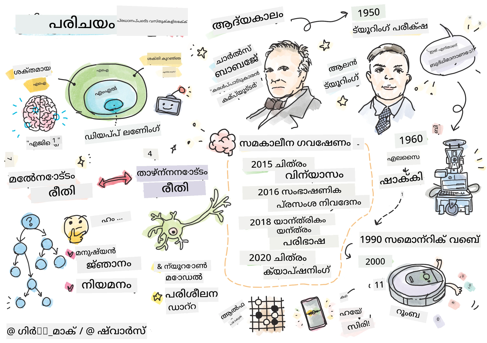
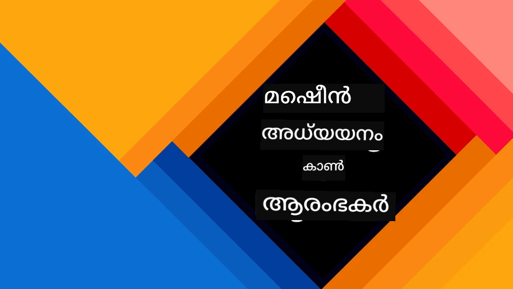
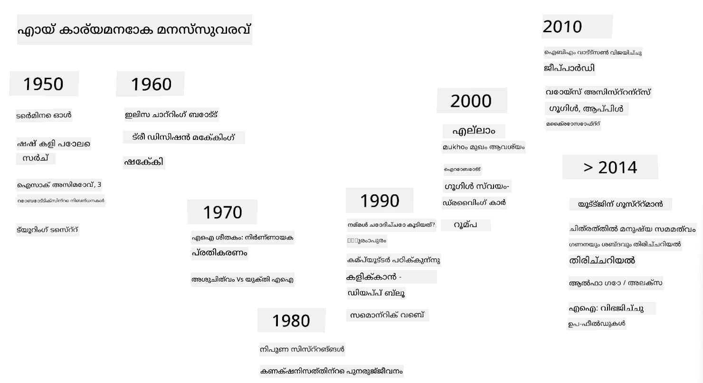

# എഐയുടെ പരിചയം

> സ്കെച്ച്നോട്ട്: [ടോമോമി ഇമുര](https://twitter.com/girlie_mac)

## [പഠനത്തിന് മുമ്പുള്ള ക്വിസ്](https://ff-quizzes.netlify.app/en/ai/quiz/1)

**കൃത്രിമ ബുദ്ധിമുട്ട്** എന്നത് ഒരു രസകരമായ ശാസ്ത്രീയ ശാഖയാണ്, ഇത് കമ്പ്യൂട്ടറുകൾക്ക് ബുദ്ധിമുട്ടുള്ള പെരുമാറ്റം കാണിക്കാൻ എങ്ങനെ കഴിയും എന്ന് പഠിക്കുന്നു, ഉദാഹരണത്തിന് മനുഷ്യർക്ക് നന്നായി ചെയ്യാൻ കഴിയുന്ന കാര്യങ്ങൾ ചെയ്യുക.

ആദ്യമായി, കമ്പ്യൂട്ടറുകൾ [ചാൾസ് ബാബേജ്](https://en.wikipedia.org/wiki/Charles_Babbage) നിർമിച്ചത് സംഖ്യകളിൽ നിശ്ചിത ക്രമത്തിൽ പ്രവർത്തിക്കുന്നതിനായി - ഒരു ആൽഗോരിതം. 19-ാം നൂറ്റാണ്ടിൽ നിർദ്ദേശിച്ച ആദ്യ മാതൃകയേക്കാൾ ആധുനിക കമ്പ്യൂട്ടറുകൾ വളരെ മുന്നേറ്റം നേടിയിട്ടുണ്ടെങ്കിലും, അവ ഇപ്പോഴും നിയന്ത്രിത കണക്കുകൂട്ടലുകൾ പിന്തുടരുന്നു. അതിനാൽ, ലക്ഷ്യം നേടാൻ വേണ്ട കൃത്യമായ നടപടികൾ അറിയുകയാണെങ്കിൽ, കമ്പ്യൂട്ടറിനെ പ്രോഗ്രാം ചെയ്യാൻ കഴിയും.

> ഫോട്ടോ: [വിക്കി സോഷ്നിക്കോവ](http://twitter.com/vickievalerie)

> ✅ ഒരു വ്യക്തിയുടെ ഫോട്ടോയിൽ നിന്നു അവരുടെ പ്രായം നിർവചിക്കുന്നത് വ്യക്തമായി പ്രോഗ്രാം ചെയ്യാൻ കഴിയാത്ത ഒരു ജോലി ആണ്, കാരണം നമ്മൾ അത് ചെയ്യുമ്പോൾ തലയിൽ ഒരു സംഖ്യ എങ്ങനെ വരുന്നു എന്ന് നമുക്ക് അറിയില്ല.

---

എങ്കിലും, ചില ജോലികൾ നമുക്ക് വ്യക്തമായി എങ്ങനെ പരിഹരിക്കാമെന്ന് അറിയില്ല. ഒരു വ്യക്തിയുടെ ഫോട്ടോയിൽ നിന്നു പ്രായം നിർണയിക്കുന്നത് പരിഗണിക്കൂ. നാം പല പ്രായത്തിലുള്ള ആളുകളുടെ ഉദാഹരണങ്ങൾ കണ്ടിട്ടുണ്ടാകുന്നതിനാൽ നാം അത് പഠിച്ചിരിക്കുന്നു, പക്ഷേ നാം എങ്ങനെ ചെയ്യുന്നു എന്ന് വ്യക്തമായി വിശദീകരിക്കാൻ കഴിയില്ല, അല്ലെങ്കിൽ കമ്പ്യൂട്ടറിനെ പ്രോഗ്രാം ചെയ്യാനും കഴിയില്ല. ഇത് തന്നെ **കൃത്രിമ ബുദ്ധിമുട്ട്** (AI) യുടെ താൽപര്യമുള്ള ജോലികളാണ്.

✅ നിങ്ങൾക്ക് കമ്പ്യൂട്ടറിന് നൽകാൻ കഴിയുന്ന, AI ഉപയോഗിച്ച് സഹായം ലഭിക്കുന്ന ചില ജോലികൾ എന്തെല്ലാമാണെന്ന് ചിന്തിക്കുക. ധനകാര്യ, മെഡിസിൻ, കലകൾ തുടങ്ങിയ മേഖലകളിൽ ഇന്ന് AI എങ്ങനെ സഹായിക്കുന്നു?

## ദുർബല AI vs. ശക്തമായ AI

ദുർബല AI | ശക്തമായ AI
---------------------------------------|-------------------------------------
ദുർബല AI എന്നത് ഒരു പ്രത്യേക ജോലി അല്ലെങ്കിൽ കുറച്ച് ജോലികൾക്കായി രൂപകൽപ്പന ചെയ്തും പരിശീലിപ്പിച്ചും ഉള്ള AI സിസ്റ്റങ്ങളെയാണ് സൂചിപ്പിക്കുന്നത്.|ശക്തമായ AI, അല്ലെങ്കിൽ കൃത്രിമ പൊതുബുദ്ധി (AGI), മനുഷ്യനിലവാരമുള്ള ബുദ്ധിമുട്ടും മനസ്സിലാക്കലും ഉള്ള AI സിസ്റ്റങ്ങളെയാണ് സൂചിപ്പിക്കുന്നത്.
ഈ AI സിസ്റ്റങ്ങൾ സാധാരണ ബുദ്ധിമുട്ടുള്ളവയല്ല; അവർ നിർവചിച്ച ജോലിയിൽ മികച്ച പ്രകടനം കാണിക്കുന്നു, പക്ഷേ യഥാർത്ഥ മനസ്സിലാക്കലോ ബോധമോ ഇല്ല.|ഈ AI സിസ്റ്റങ്ങൾക്ക് മനുഷ്യൻ ചെയ്യാൻ കഴിയുന്ന ഏതൊരു ബുദ്ധിമുട്ടുള്ള ജോലിയും ചെയ്യാനുള്ള കഴിവും, വ്യത്യസ്ത മേഖലകളിൽ അനുയോജ്യമായും പ്രവർത്തിക്കാനുള്ള കഴിവും, ബോധമോ സ്വയം ബോധമോ ഉള്ള രൂപവും ഉണ്ട്.
ദുർബല AIയുടെ ഉദാഹരണങ്ങൾ സിരി, അലക്സ പോലുള്ള വിർച്വൽ അസിസ്റ്റന്റുകൾ, സ്ട്രീമിംഗ് സേവനങ്ങളിൽ ഉപയോഗിക്കുന്ന ശുപാർശ ആൽഗോരിതങ്ങൾ, പ്രത്യേക ഉപഭോക്തൃ സേവന ജോലികൾക്കായി രൂപകൽപ്പന ചെയ്ത ചാറ്റ്ബോട്ടുകൾ എന്നിവയാണ്.|ശക്തമായ AI നേടുക AI ഗവേഷണത്തിന്റെ ദീർഘകാല ലക്ഷ്യമാണ്, ഇത് ബുദ്ധിമുട്ട്, പഠനം, മനസ്സിലാക്കൽ, വ്യത്യസ്ത ജോലികളിലും സാഹചര്യങ്ങളിലും അനുയോജ്യമായും പ്രവർത്തിക്കാൻ കഴിയുന്ന AI സിസ്റ്റങ്ങൾ വികസിപ്പിക്കേണ്ടതാണ്.
ദുർബല AI വളരെ പ്രത്യേകതയുള്ളതാണ്, മനുഷ്യനുപോലെ ബുദ്ധിമുട്ടുള്ള കഴിവുകളും പൊതുവായ പ്രശ്നപരിഹാര ശേഷികളും ഇല്ല.|ശക്തമായ AI ഇപ്പോൾ സിദ്ധാന്തപരമായ ആശയമാണ്, ഇതുവരെ യാതൊരു AI സിസ്റ്റവും ഈ തലത്തിലെ പൊതുവായ ബുദ്ധിമുട്ട് കൈവരിച്ചിട്ടില്ല.

കൂടുതൽ വിവരങ്ങൾക്ക് **[കൃത്രിമ പൊതുബുദ്ധി](https://en.wikipedia.org/wiki/Artificial_general_intelligence)** (AGI) കാണുക.

## ബുദ്ധിമുട്ടിന്റെ നിർവചനവും ട്യൂറിംഗ് ടെസ്റ്റും

**[ബുദ്ധിമുട്ട്](https://en.wikipedia.org/wiki/Intelligence)** എന്ന പദം ഉപയോഗിക്കുമ്പോൾ ഒരു പ്രശ്നം ഉണ്ട്, അതായത് ഈ പദത്തിന് വ്യക്തമായ നിർവചനമില്ല. ബുദ്ധിമുട്ട് **അബ്സ്ട്രാക്ട് ചിന്തന**യുമായി ബന്ധപ്പെട്ടു എന്ന് പറയാം, അല്ലെങ്കിൽ **സ്വയം ബോധം**യുമായി ബന്ധപ്പെട്ടു എന്ന് പറയാം, പക്ഷേ നാം അതിനെ ശരിയായി നിർവചിക്കാൻ കഴിയുന്നില്ല.

> [ഫോട്ടോ](https://unsplash.com/photos/75715CVEJhI) - [ആംബർ കിപ്പ്](https://unsplash.com/@sadmax) Unsplash-ൽ നിന്നു

*ബുദ്ധിമുട്ട്* എന്ന പദത്തിന്റെ അനിശ്ചിതത്വം കാണാൻ, "ഒരു പൂച്ച ബുദ്ധിമുട്ടുള്ളതാണോ?" എന്ന ചോദ്യം ഉത്തരം പറയാൻ ശ്രമിക്കുക. വ്യത്യസ്ത ആളുകൾക്ക് വ്യത്യസ്ത ഉത്തരങ്ങൾ ഉണ്ടാകും, കാരണം ഈ വാദം ശരിയാണെന്ന് തെളിയിക്കാൻ സർവത്ര അംഗീകരിക്കപ്പെട്ട ഒരു പരീക്ഷണം ഇല്ല. നിങ്ങൾക്ക് ഉണ്ടെന്ന് തോന്നിയാൽ - നിങ്ങളുടെ പൂച്ചയെ IQ ടെസ്റ്റിൽ പരീക്ഷിച്ച് നോക്കൂ...

✅ നിങ്ങൾ ബുദ്ധിമുട്ട് എങ്ങനെ നിർവചിക്കുന്നു എന്ന് ഒരു നിമിഷം ചിന്തിക്കുക. ഒരു കോഴി ഒരു മസിലിൽ നിന്ന് ഭക്ഷണം കണ്ടെത്താൻ കഴിവുള്ളതാണെങ്കിൽ അത് ബുദ്ധിമുട്ടുള്ളതാണോ? ഒരു കുട്ടി ബുദ്ധിമുട്ടുള്ളതാണോ?

---

AGIയെക്കുറിച്ച് സംസാരിക്കുമ്പോൾ, നാം യഥാർത്ഥ ബുദ്ധിമുട്ടുള്ള ഒരു സിസ്റ്റം സൃഷ്ടിച്ചിട്ടുണ്ടോ എന്ന് അറിയാൻ ഒരു മാർഗ്ഗം വേണം. [ആലൻ ട്യൂറിംഗ്](https://en.wikipedia.org/wiki/Alan_Turing) നിർദ്ദേശിച്ച ഒരു മാർഗ്ഗം **[ട്യൂറിംഗ് ടെസ്റ്റ്](https://en.wikipedia.org/wiki/Turing_test)** ആണ്, ഇത് ബുദ്ധിമുട്ടിന്റെ ഒരു നിർവചനമായി പ്രവർത്തിക്കുന്നു. ഈ ടെസ്റ്റ് ഒരു സിസ്റ്റം യഥാർത്ഥ ബുദ്ധിമുട്ടുള്ള ഒരു മനുഷ്യനുമായി താരതമ്യം ചെയ്യുന്നു, കാരണം യാതൊരു സ്വയം പ്രവർത്തിക്കുന്ന താരതമ്യവും കമ്പ്യൂട്ടർ പ്രോഗ്രാമിലൂടെ മറികടക്കാൻ കഴിയുന്നതുകൊണ്ട്, മനുഷ്യ ചോദ്യംചെയ്യുന്നവനെ ഉപയോഗിക്കുന്നു. അതിനാൽ, ഒരു മനുഷ്യൻ ടെക്സ്റ്റ് അടിസ്ഥാനത്തിലുള്ള സംഭാഷണത്തിൽ യഥാർത്ഥ മനുഷ്യനെയും കമ്പ്യൂട്ടർ സിസ്റ്റത്തിനെയും വേർതിരിക്കാൻ കഴിയുന്നില്ലെങ്കിൽ, ആ സിസ്റ്റം ബുദ്ധിമുട്ടുള്ളതായാണ് കണക്കാക്കുന്നത്.

> 2014-ൽ സെന്റ് പീറ്റേഴ്സ്ബർഗിൽ വികസിപ്പിച്ചെടുത്ത [Eugene Goostman](https://en.wikipedia.org/wiki/Eugene_Goostman) എന്ന ചാറ്റ്ബോട്ട് ട്യൂറിംഗ് ടെസ്റ്റ് കടന്നുപോകാൻ അടുത്തെത്തി. ഇത് 13 വയസ്സുള്ള യുക്രെയ്നിയൻ ബാലനായി മുന്നറിയിപ്പ് നൽകി, അതുകൊണ്ട് അറിവിന്റെ കുറവും ചില വാചക വ്യത്യാസങ്ങളും വിശദീകരിക്കാമെന്ന് പറഞ്ഞു. 5 മിനിറ്റ് സംഭാഷണത്തിന് ശേഷം 30% ജഡ്ജുമാർക്ക് ഇത് മനുഷ്യനാണെന്ന് വിശ്വസിപ്പിച്ചു, ട്യൂറിംഗ് 2000-ൽ യന്ത്രം ഇത് കടന്നുപോകുമെന്ന് കരുതിയിരുന്നു. എന്നാൽ, ഇത് ബുദ്ധിമുട്ടുള്ള സിസ്റ്റം സൃഷ്ടിച്ചതായി അല്ല, അല്ലെങ്കിൽ കമ്പ്യൂട്ടർ സിസ്റ്റം മനുഷ്യ ചോദ്യംചെയ്യുന്നവനെ മായ്ച്ചുവെന്ന് അല്ല - സിസ്റ്റം മനുഷ്യരെ മായ്ച്ചില്ല, മറിച്ച് ബോട്ട് സൃഷ്ടിച്ചവർ മായ്ച്ചു!

✅ നിങ്ങൾ ഒരിക്കൽ ചാറ്റ്ബോട്ട് നിങ്ങളെ മനുഷ്യനുമായി സംസാരിക്കുന്നതായി തെറ്റിദ്ധരിപ്പിച്ചിട്ടുണ്ടോ? അത് നിങ്ങളെ എങ്ങനെ വിശ്വസിപ്പിച്ചു?

## എഐയിലേക്കുള്ള വ്യത്യസ്ത സമീപനങ്ങൾ

കമ്പ്യൂട്ടർ മനുഷ്യനുപോലെ പെരുമാറണമെങ്കിൽ, നമ്മുടെ ചിന്തന രീതിയെ കമ്പ്യൂട്ടറിനുള്ളിൽ മോഡൽ ചെയ്യണം. അതിനാൽ, മനുഷ്യനെ ബുദ്ധിമുട്ടുള്ളവനാക്കുന്നത് എന്താണെന്ന് മനസ്സിലാക്കണം.

> യന്ത്രത്തിൽ ബുദ്ധിമുട്ട് പ്രോഗ്രാം ചെയ്യാൻ, നമ്മുടെ തീരുമാനമെടുക്കൽ പ്രക്രിയകൾ എങ്ങനെ പ്രവർത്തിക്കുന്നു എന്ന് മനസ്സിലാക്കണം. നിങ്ങൾ സ്വയം നിരീക്ഷണം ചെയ്താൽ, ചില പ്രക്രിയകൾ ബോധപൂർവ്വം അല്ലാതെ നടക്കുന്നു - ഉദാഹരണത്തിന്, ഒരു പൂച്ചയെ നായയെന്ന് തിരിച്ചറിയാൻ ചിന്തിക്കേണ്ടതില്ല - എന്നാൽ ചിലത് ചിന്തനയോടെ നടക്കുന്നു.

ഈ പ്രശ്നത്തിന് രണ്ട് സമീപനങ്ങൾ ഉണ്ട്:

ടോപ്പ്-ഡൗൺ സമീപനം (സിംബോളിക് റീസണിംഗ്) | ബോട്ടം-അപ്പ് സമീപനം (ന്യൂറൽ നെറ്റ്വർക്കുകൾ)
---------------------------------------|-------------------------------------
ടോപ്പ്-ഡൗൺ സമീപനം ഒരു വ്യക്തി പ്രശ്നം പരിഹരിക്കാൻ എങ്ങനെ ചിന്തിക്കുന്നു എന്ന് മോഡൽ ചെയ്യുന്നു. ഇത് മനുഷ്യനിൽ നിന്നുള്ള **ജ്ഞാനം** എടുക്കുകയും, അത് കമ്പ്യൂട്ടർ വായിക്കാൻ കഴിയുന്ന രൂപത്തിൽ പ്രതിനിധാനം ചെയ്യുകയും ചെയ്യുന്നു. കൂടാതെ, കമ്പ്യൂട്ടറിനുള്ളിൽ **റീസണിംഗ്** മോഡൽ ചെയ്യാനുള്ള മാർഗ്ഗം വികസിപ്പിക്കണം. | ബോട്ടം-അപ്പ് സമീപനം മനുഷ്യ മസ്തിഷ്‌കത്തിന്റെ ഘടന മോഡൽ ചെയ്യുന്നു, അതിൽ അനേകം ലളിതമായ ഘടകങ്ങൾ **ന്യൂറോണുകൾ** എന്നറിയപ്പെടുന്നു. ഓരോ ന്യൂറോണും അതിന്റെ ഇൻപുട്ടുകളുടെ ഭാരിത ശരാശരിയായി പ്രവർത്തിക്കുന്നു, **പരിശീലന ഡാറ്റ** നൽകി ന്യൂറോണുകളുടെ നെറ്റ്വർക്ക് പ്രയോജനപ്രദമായ പ്രശ്നങ്ങൾ പരിഹരിക്കാൻ പരിശീലിപ്പിക്കാം.

മറ്റു ചില സമീപനങ്ങളും ഉണ്ട്:

* **എമർജന്റ്**, **സിനർജറ്റിക്** അല്ലെങ്കിൽ **മൾട്ടി-ഏജന്റ് സമീപനം** അനേകം ലളിതമായ ഏജന്റുകളുടെ ഇടപെടലിലൂടെ സങ്കീർണ്ണമായ ബുദ്ധിമുട്ടുള്ള പെരുമാറ്റം ലഭിക്കാമെന്ന് അടിസ്ഥാനമാക്കുന്നു. [വികാസ സൈബർനെറ്റിക്സ്](https://en.wikipedia.org/wiki/Global_brain#Evolutionary_cybernetics) പ്രകാരം, ബുദ്ധിമുട്ട് *മറ്റു ലളിതമായ, പ്രതികരണപരമായ പെരുമാറ്റങ്ങളിൽ നിന്നു* *മീറ്റാസിസ്റ്റം ട്രാൻസിഷൻ* പ്രക്രിയയിൽ *ഉത്ഭവിക്കാം*.

* **വികാസ സമീപനം** അല്ലെങ്കിൽ **ജനിതക ആൽഗോരിതം** വികാസത്തിന്റെ സിദ്ധാന്തങ്ങളെ അടിസ്ഥാനമാക്കിയുള്ള ഒരു മെച്ചപ്പെടുത്തൽ പ്രക്രിയയാണ്.

ഈ സമീപനങ്ങൾ കോഴ്സിൽ പിന്നീട് പരിഗണിക്കും, ഇപ്പോൾ നാം രണ്ട് പ്രധാന ദിശകളിൽ ശ്രദ്ധ കേന്ദ്രീകരിക്കും: ടോപ്പ്-ഡൗൺ, ബോട്ടം-അപ്പ്.

### ടോപ്പ്-ഡൗൺ സമീപനം

**ടോപ്പ്-ഡൗൺ സമീപനത്തിൽ**, നാം നമ്മുടെ ചിന്തന രീതിയെ മോഡൽ ചെയ്യാൻ ശ്രമിക്കുന്നു. നാം ചിന്തിക്കുമ്പോൾ നമ്മുടെ ചിന്തകൾ പിന്തുടരാൻ കഴിയുന്നതിനാൽ, ഈ പ്രക്രിയ ഫോർമലൈസ് ചെയ്ത് കമ്പ്യൂട്ടറിനുള്ളിൽ പ്രോഗ്രാം ചെയ്യാം. ഇതാണ് **സിംബോളിക് റീസണിംഗ്**.

മനുഷ്യർക്ക് ചില നിയമങ്ങൾ മനസ്സിൽ ഉണ്ടാകാം, അവ അവരുടെ തീരുമാനമെടുക്കൽ പ്രക്രിയകൾ നയിക്കുന്നു. ഉദാഹരണത്തിന്, ഒരു ഡോക്ടർ രോഗിയെ പരിശോധന ചെയ്യുമ്പോൾ, അവൻ/അവൾക്ക് പനി ഉണ്ടെന്ന് മനസ്സിലാകാം, അതിനാൽ ശരീരത്തിൽ ചില അണുബാധകൾ ഉണ്ടാകാം. ഒരു വലിയ നിയമസമൂഹം ഒരു പ്രത്യേക പ്രശ്നത്തിൽ പ്രയോഗിച്ച് ഡോക്ടർ അന്തിമ രോഗനിർണയം കണ്ടെത്താൻ കഴിയും.

ഈ സമീപനം **ജ്ഞാന പ്രതിനിധാനം**ക്കും **റീസണിംഗിനും** ആശ്രയിച്ചിരിക്കുന്നു. മനുഷ്യ വിദഗ്ധനിൽ നിന്നുള്ള ജ്ഞാനം എടുക്കുന്നത് ഏറ്റവും ബുദ്ധിമുട്ടുള്ള ഭാഗമായിരിക്കാം, കാരണം പലപ്പോഴും ഡോക്ടർ എന്തുകൊണ്ട് ഒരു പ്രത്യേക രോഗനിർണയം വരുത്തുന്നു എന്ന് വ്യക്തമായി അറിയില്ല. ചിലപ്പോൾ പരിഹാരം അവന്റെ തലയിൽ തന്നെ വ്യക്തമായി വരുന്നു. ചില ജോലികൾ, ഉദാഹരണത്തിന് ഒരു വ്യക്തിയുടെ ഫോട്ടോയിൽ നിന്നു പ്രായം നിർണയിക്കൽ, ജ്ഞാന നിയന്ത്രണത്തിലേക്ക് കുറയ്ക്കാനാകില്ല.

### ബോട്ടം-അപ്പ് സമീപനം

മറ്റുവഴി, നാം നമ്മുടെ മസ്തിഷ്‌കത്തിലെ ഏറ്റവും ലളിത ഘടകമായ ന്യൂറോണിനെ മോഡൽ ചെയ്യാം. കമ്പ്യൂട്ടറിനുള്ളിൽ **കൃത്രിമ ന്യൂറൽ നെറ്റ്വർക്ക്** നിർമ്മിച്ച്, ഉദാഹരണങ്ങൾ നൽകി പ്രശ്നങ്ങൾ പരിഹരിക്കാൻ പഠിപ്പിക്കാം. ഇത് ഒരു കുഞ്ഞ് തന്റെ ചുറ്റുപാടുകളെ കുറിച്ച് നിരീക്ഷണങ്ങൾ നടത്തി പഠിക്കുന്ന രീതിയോട് സമാനമാണ്.

✅ കുഞ്ഞുങ്ങൾ എങ്ങനെ പഠിക്കുന്നു എന്ന് കുറച്ച് ഗവേഷണം ചെയ്യുക. കുഞ്ഞിന്റെ മസ്തിഷ്‌കത്തിലെ അടിസ്ഥാന ഘടകങ്ങൾ എന്തെല്ലാമാണ്?

> | ML എന്ത്?         |      |
> |--------------|-----------|
> | കൃത്രിമ ബുദ്ധിമുട്ടിന്റെ ഭാഗമായും, ഡാറ്റയുടെ അടിസ്ഥാനത്തിൽ പ്രശ്നം പരിഹരിക്കാൻ കമ്പ്യൂട്ടർ പഠിക്കുന്നതിനെ **മെഷീൻ ലേണിംഗ്** എന്ന് വിളിക്കുന്നു. ഈ കോഴ്സിൽ ക്ലാസിക്കൽ മെഷീൻ ലേണിംഗ് പരിഗണിക്കില്ല - നിങ്ങൾക്ക് വേറെ [Machine Learning for Beginners](http://aka.ms/ml-beginners) പാഠ്യപദ്ധതി കാണാം. |       |

## എഐയുടെ ഒരു സംക്ഷിപ്ത ചരിത്രം

കൃത്രിമ ബുദ്ധിമുട്ട് 20-ാം നൂറ്റാണ്ടിന്റെ മധ്യത്തിൽ ഒരു ശാഖയായി ആരംഭിച്ചു. ആദ്യം, സിംബോളിക് റീസണിംഗ് പ്രചാരത്തിലായിരുന്നു, ഇത് ചില പ്രധാന വിജയങ്ങൾക്കു വഴിതെളിച്ചു, ഉദാഹരണത്തിന് വിദഗ്ധ സിസ്റ്റങ്ങൾ – ചില പരിമിത പ്രശ്ന മേഖലകളിൽ വിദഗ്ധൻപോലെ പ്രവർത്തിക്കുന്ന കമ്പ്യൂട്ടർ പ്രോഗ്രാമുകൾ. എന്നാൽ, ഈ സമീപനം വലിയ തോതിൽ വ്യാപിപ്പിക്കാൻ കഴിയില്ലെന്ന് ഉടൻ മനസ്സിലായി. വിദഗ്ധനിൽ നിന്നുള്ള ജ്ഞാനം എടുക്കുകയും, അത് കമ്പ്യൂട്ടറിലേക്കു പ്രതിനിധാനം ചെയ്യുകയും, ആ ജ്ഞാനശേഖരം കൃത്യമായി നിലനിർത്തുകയും ചെയ്യുന്നത് വളരെ സങ്കീർണ്ണവും ചെലവേറിയതുമായ ജോലി ആയിരുന്നു. ഇതാണ് 1970-കളിലെ [AI വിന്റർ](https://en.wikipedia.org/wiki/AI_winter) ന്റെ കാരണമായത്.

> ചിത്രം: [ഡ്മിത്രി സോഷ്നിക്കോവ്](http://soshnikov.com)

കാലക്രമേണ, കംപ്യൂട്ടിംഗ് വിഭവങ്ങൾ വിലകുറഞ്ഞതായി, കൂടുതൽ ഡാറ്റ ലഭ്യമായി, അതിനാൽ ന്യൂറൽ നെറ്റ്വർക്ക് സമീപനങ്ങൾ മനുഷ്യരെ മത്സരിപ്പിക്കുന്നതിൽ മികച്ച പ്രകടനം കാണിച്ചു, ഉദാഹരണത്തിന് കമ്പ്യൂട്ടർ ദൃശ്യവും ശബ്ദ മനസ്സിലാക്കലും. കഴിഞ്ഞ ദശകത്തിൽ, കൃത്രിമ ബുദ്ധിമുട്ട് എന്ന പദം പ്രധാനമായും ന്യൂറൽ നെറ്റ്വർക്കുകളുടെ പദവിയായി ഉപയോഗിക്കപ്പെടുന്നു, കാരണം കേട്ടുവരുന്ന AI വിജയങ്ങൾ അവയിൽ അധിഷ്ഠിതമാണ്.

ചതുരശ്രം കളിക്കുന്ന കമ്പ്യൂട്ടർ പ്രോഗ്രാം സൃഷ്ടിക്കുമ്പോൾ സമീപനങ്ങൾ എങ്ങനെ മാറിയെന്ന് കാണാം:

* ആദ്യം, ചെസ്സ് പ്രോഗ്രാമുകൾ തിരച്ചിൽ അടിസ്ഥാനമാക്കിയായിരുന്നു – ഒരു പ്രോഗ്രാം എതിരാളിയുടെ സാധ്യതയുള്ള നീക്കങ്ങൾ കണക്കാക്കി, കുറച്ച് നീക്കങ്ങൾക്കുള്ളിൽ ലഭ്യമായ മികച്ച സ്ഥാനം കണ്ടെത്തി ഏറ്റവും നല്ല നീക്കം തിരഞ്ഞെടുക്കുന്നു. ഇതു [ആൽഫാ-ബീറ്റ പ്രൂണിംഗ്](https://en.wikipedia.org/wiki/Alpha%E2%80%93beta_pruning) ആൽഗോരിതം വികസിപ്പിക്കാൻ വഴിതെളിച്ചു.
* തിരച്ചിൽ തന്ത്രങ്ങൾ കളിയുടെ അവസാനം നല്ലതാണ്, കാരണം തിരച്ചിൽ സ്ഥലം കുറവാണ്. എന്നാൽ കളിയുടെ തുടക്കത്തിൽ തിരച്ചിൽ സ്ഥലം വലുതാണ്, ആൽഗോരിതം മനുഷ്യ കളിക്കാരുടെ നിലവിലുള്ള മത്സരങ്ങളിൽ നിന്നു പഠിച്ച് മെച്ചപ്പെടുത്താം. പിന്നീട് പരീക്ഷണങ്ങൾ [കേസ്-ബേസ്‌ഡ് റീസണിംഗ്](https://en.wikipedia.org/wiki/Case-based_reasoning) ഉപയോഗിച്ചു, പ്രോഗ്രാം നിലവിലെ സ്ഥിതിക്ക് സമാനമായ കേസുകൾ ജ്ഞാനശേഖരത്തിൽ തിരഞ്ഞെടുത്തു.
* മനുഷ്യരെ തോൽപ്പിക്കുന്ന ആധുനിക പ്രോഗ്രാമുകൾ ന്യൂറൽ നെറ്റ്വർക്കുകളും [റീ ഇൻഫോഴ്‌സ്‌മെന്റ് ലേണിംഗ്](https://en.wikipedia.org/wiki/Reinforcement_learning) ഉം അടിസ്ഥാനമാക്കിയതാണ്, ഇവ സ്വയം നേരിട്ട് കളിച്ച് പിഴവുകളിൽ നിന്നു പഠിക്കുന്നു – മനുഷ്യർ ചെസ്സ് പഠിക്കുമ്പോൾ ചെയ്യുന്ന പോലെ. എന്നാൽ കമ്പ്യൂട്ടർ വളരെ കുറച്ച് സമയത്ത് കൂടുതൽ കളികൾ കളിക്കാനാകുന്നതിനാൽ വേഗത്തിൽ പഠിക്കുന്നു.

✅ AI കളിച്ച മറ്റു ഗെയിമുകൾ കുറിച്ച് കുറച്ച് ഗവേഷണം ചെയ്യുക.

അങ്ങനെ, “സംഭാഷണ പ്രോഗ്രാമുകൾ” (ട്യൂറിംഗ് ടെസ്റ്റ് കടക്കാൻ കഴിയുന്നവ) സൃഷ്ടിക്കാനുള്ള സമീപനവും എങ്ങനെ മാറിയെന്ന് കാണാം:

* ആദ്യം
> ചിത്രം: Dmitry Soshnikov, [ഫോട്ടോ](https://unsplash.com/photos/r8LmVbUKgns) [Marina Abrosimova](https://unsplash.com/@abrosimova_marina_foto) യുടെ, Unsplash

## പുതിയ AI ഗവേഷണം

2010-ൽ വലിയ പൊതു ഡാറ്റാസെറ്റുകൾ ലഭ്യമാകാൻ തുടങ്ങിയപ്പോൾ, ന്യൂറൽ നെറ്റ്‌വർക്ക് ഗവേഷണത്തിൽ വലിയ വളർച്ച ആരംഭിച്ചു. ഏകദേശം 14 മില്യൺ അനോട്ടേറ്റഡ് ചിത്രങ്ങൾ അടങ്ങിയ [ImageNet](https://en.wikipedia.org/wiki/ImageNet) എന്ന വലിയ ചിത്രശേഖരം, [ImageNet Large Scale Visual Recognition Challenge](https://image-net.org/challenges/LSVRC/) എന്ന മത്സരം ജനിപ്പിച്ചു.

> ചിത്രം: [Dmitry Soshnikov](http://soshnikov.com)

2012-ൽ, [Convolutional Neural Networks](../4-ComputerVision/07-ConvNets/README.md) ആദ്യമായി ചിത്രവർഗ്ഗീകരണത്തിൽ ഉപയോഗിച്ചു, ഇതോടെ വർഗ്ഗീകരണ പിശകുകൾ (ഏകദേശം 30% മുതൽ 16.4% വരെ) ഗണ്യമായി കുറഞ്ഞു. 2015-ൽ, Microsoft Research-ന്റെ ResNet ആർക്കിടെക്ചർ [മനുഷ്യനിലവാരമുള്ള കൃത്യത കൈവരിച്ചു](https://doi.org/10.1109/ICCV.2015.123).

അതിനുശേഷം, ന്യൂറൽ നെറ്റ്‌വർക്ക് പല ജോലികളിലും വളരെ വിജയകരമായ പ്രകടനം കാഴ്ചവെച്ചു:

---

വർഷം | മനുഷ്യനിലവാരം കൈവരിച്ചത്
-----|--------
2015 | [ചിത്രവർഗ്ഗീകരണം](https://doi.org/10.1109/ICCV.2015.123)
2016 | [സംവാദാത്മക ശബ്ദ തിരിച്ചറിയൽ](https://arxiv.org/abs/1610.05256)
2018 | [സ്വയംകൃത യന്ത്രഭാഷാന്തരം](https://arxiv.org/abs/1803.05567) (ചൈനീസ്-ഇംഗ്ലീഷ്)
2020 | [ചിത്ര വിവരണം](https://arxiv.org/abs/2009.13682)

കഴിഞ്ഞ കുറേ വർഷങ്ങളായി, BERT, GPT-3 പോലുള്ള വലിയ ഭാഷാ മോഡലുകളുമായി വലിയ വിജയങ്ങൾ കണ്ടു. ഇതിന് പ്രധാന കാരണം, പൊതുവായ ടെക്സ്റ്റ് ഡാറ്റ ലഭ്യമാകുന്നതാണ്, ഇത് മോഡലുകൾക്ക് ടെക്സ്റ്റുകളുടെ ഘടനയും അർത്ഥവും പിടികൂടാൻ, പൊതുവായ ടെക്സ്റ്റ് ശേഖരങ്ങളിൽ പ്രീ-ട്രെയിൻ ചെയ്യാനും, പിന്നീട് പ്രത്യേക ജോലികൾക്കായി മോഡലുകൾ പ്രത്യേകിപ്പിക്കാനും സഹായിക്കുന്നു. ഈ കോഴ്സിൽ പിന്നീട് [Natural Language Processing](../5-NLP/README.md) കുറിച്ച് കൂടുതൽ പഠിക്കും.

## 🚀 ചലഞ്ച്

ഇന്റർനെറ്റിൽ ഒരു യാത്ര നടത്തുക, നിങ്ങളുടെ അഭിപ്രായത്തിൽ AI ഏറ്റവും ഫലപ്രദമായി ഉപയോഗിക്കുന്നിടം കണ്ടെത്തുക. അത് ഒരു മാപ്പിംഗ് ആപ്പിൽ ആണോ, ശബ്ദം-ടെക്സ്റ്റ് സേവനത്തിലോ, അല്ലെങ്കിൽ ഒരു വീഡിയോ ഗെയിമിലോ? ആ സിസ്റ്റം എങ്ങനെ നിർമ്മിച്ചതെന്ന് ഗവേഷണം ചെയ്യുക.

## [പോസ്റ്റ്-ലെക്ചർ ക്വിസ്](https://ff-quizzes.netlify.app/en/ai/quiz/2)

## അവലോകനം & സ്വയം പഠനം

AI, ML ചരിത്രം [ഈ പാഠം](https://github.com/microsoft/ML-For-Beginners/tree/main/1-Introduction/2-history-of-ML) വായിച്ച് അവലോകനം ചെയ്യുക. ആ പാഠത്തിന്റെ മുകളിൽ ഉള്ള സ്കെച്ച്നോട്ടിൽ നിന്നോ ഇതിൽ നിന്നോ ഒരു ഘടകം എടുത്ത് അതിന്റെ സാംസ്കാരിക പശ്ചാത്തലം മനസ്സിലാക്കാൻ കൂടുതൽ ഗവേഷണം നടത്തുക.

**അസൈൻമെന്റ്**: [ഗെയിം ജാം](assignment.md)

---

<!-- CO-OP TRANSLATOR DISCLAIMER START -->
**അസൂയാ**:  
ഈ രേഖ AI വിവർത്തന സേവനം [Co-op Translator](https://github.com/Azure/co-op-translator) ഉപയോഗിച്ച് വിവർത്തനം ചെയ്തതാണ്. നാം കൃത്യതയ്ക്ക് ശ്രമിച്ചിട്ടുണ്ടെങ്കിലും, സ്വയം പ്രവർത്തിക്കുന്ന വിവർത്തനങ്ങളിൽ പിശകുകൾ അല്ലെങ്കിൽ തെറ്റുകൾ ഉണ്ടാകാമെന്ന് ദയവായി ശ്രദ്ധിക്കുക. അതിന്റെ മാതൃഭാഷയിലുള്ള യഥാർത്ഥ രേഖയാണ് പ്രാമാണികമായ ഉറവിടം എന്ന് പരിഗണിക്കേണ്ടതാണ്. നിർണായകമായ വിവരങ്ങൾക്ക്, പ്രൊഫഷണൽ മനുഷ്യ വിവർത്തനം ശുപാർശ ചെയ്യപ്പെടുന്നു. ഈ വിവർത്തനം ഉപയോഗിക്കുന്നതിൽ നിന്നുണ്ടാകുന്ന ഏതെങ്കിലും തെറ്റിദ്ധാരണകൾക്കോ തെറ്റായ വ്യാഖ്യാനങ്ങൾക്കോ ഞങ്ങൾ ഉത്തരവാദികളല്ല.
<!-- CO-OP TRANSLATOR DISCLAIMER END -->