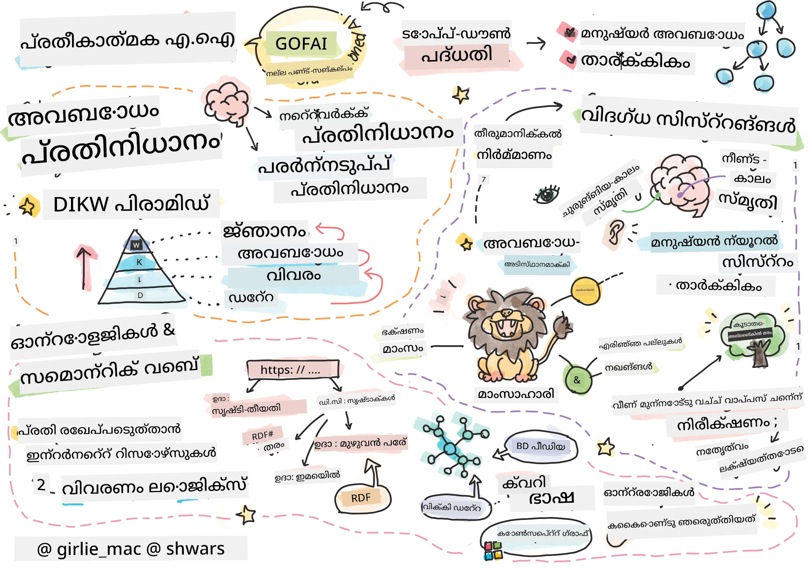
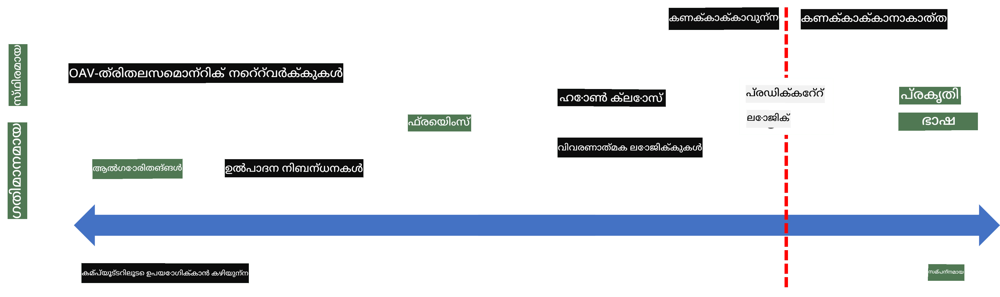
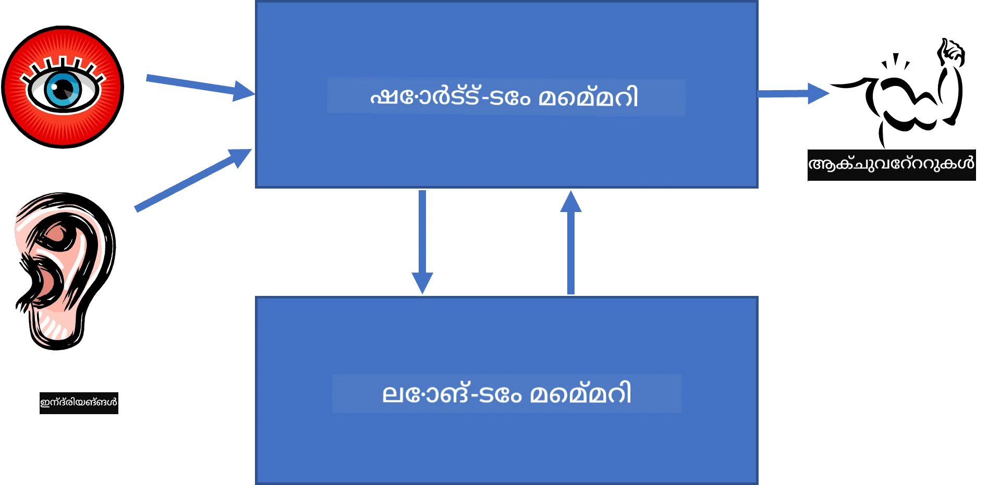
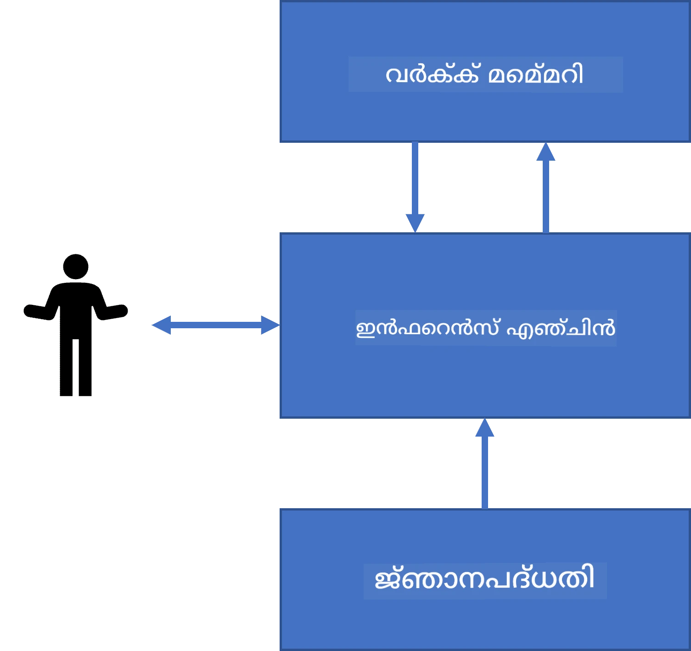
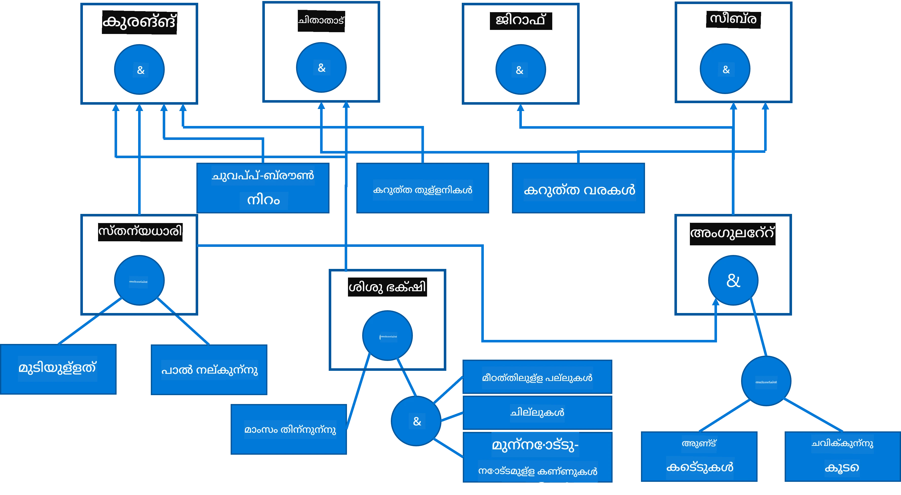
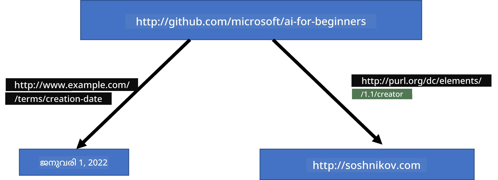
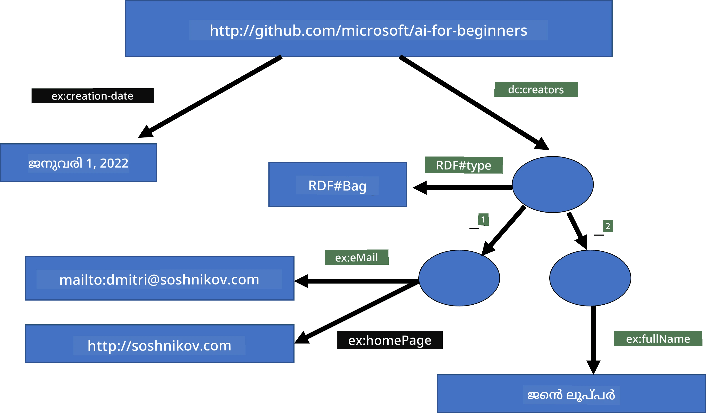
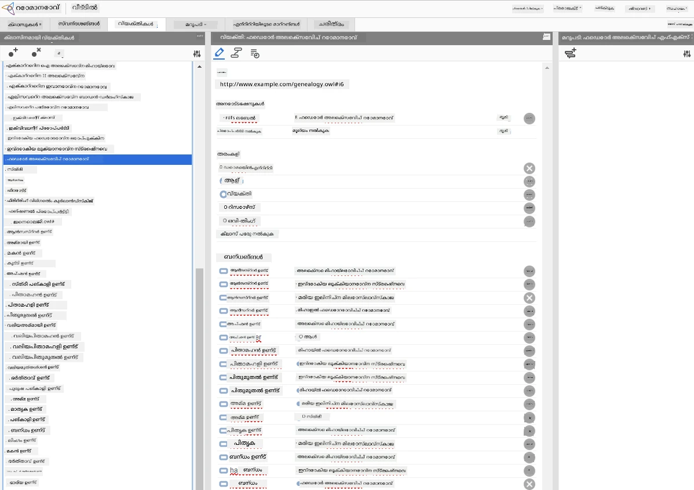

# അറിവ് പ്രതിനിധാനവും വിദഗ്ധ സിസ്റ്റങ്ങളുമെന്താണ്



> സ്കെച്ച്നോട്ട് [തൊമോമി ഇമുര](https://twitter.com/girlie_mac) ഇൽ നിന്നുള്ളത്

കൃത്രിമ ബുദ്ധിമുട്ടിന്റെ അഭ്യർത്ഥന മനുഷ്യർ ചെയ്യുന്ന പോലെ ലോകത്തെ മനസിലാക്കാനുള്ള അറിവിന്റെ തിരച്ചിലിലാണ്. പക്ഷേ ഇത് എങ്ങനെ നടത്താം?

## [പ്രാക-തലച്ചറവിചാരം](https://ff-quizzes.netlify.app/en/ai/quiz/3)

AIയുടെ പ്രാഥമിക കാലഘട്ടത്തിൽ, ബുദ്ധിമുട്ടുള്ള സിസ്റ്റങ്ങൾ സൃഷ്ടിക്കുന്നതിനുള്ള ഉയര്‍ന്ന തലത്തിലുളള സമീപനം (മുൻപത്തെ പാഠത്തിൽ ചർച്ച ചെയ്തു) പ്രചാരത്തിലുണ്ടായിരുന്നു. ആശയം മനുഷ്യരില് നിന്നുള്ള അറിവ് യന്ത്രം വായിക്കാൻ കഴിയുന്ന ഫോമാറ്റിലാക്കുകയും തുടർന്ന് ആ തുകെല്ലാം സ്വയംപ്രവർത്തിക്കുന്ന രീതിയിൽ പ്രശ്നങ്ങൾ പരിഹരിയ്ക്കാനായി ഉപയോഗപ്പെടുത്തുകയുമായിരുന്നു. ഈ സമീപനം രണ്ട് വലിയ ആശയങ്ങളെ അടിസ്ഥാനമാക്കിയായിരുന്നു:

* അറിവ് പ്രതിനിധാനം
* തർക്കം

## അറിവ് പ്രതിനിധാനം

ക്രമാബദ്ധമായ AIയിലെ പ്രധാന ആശയങ്ങളിൽ ഒന്നാണ് **അറിവ്**. അറിവിനെ *വിവരം* അല്ലെങ്കിൽ *ഡേറ്റ* എന്നതിൽ നിന്നും വ്യത്യാസപ്പെടുത്തുന്നത് പ്രധാനമാണ്. ഉദാഹരണത്തിന്, പുസ്തകങ്ങൾ അറിവ് അടങ്ങിയിരിക്കുന്നുവെന്ന് പറയാവുന്നതാണ്, കാരണം പുസ്തകങ്ങൾ പഠിച്ച് നാം വിദഗ്ധരാകാൻ കഴിയും. എങ്കിലും, പുസ്തകങ്ങൾ അടിസ്ഥാനത്തിൽ ഉള്ളത് *ഡേറ്റ* ആണ്, പുസ്തകങ്ങൾ വായിച്ച് ഈ ഡേറ്റ നമ്മുടെ ലോക മോഡലിലേക്ക് സംയോജിപ്പിക്കുമ്പോൾ അത് അറിവാകും.

> ✅ **അറിവ്** എന്നത് നമ്മുടെ തലയിൽ അടങ്ങിയിരിക്കുന്നതും ലോകത്തെ നമ്മുടെ മനസ്സിലാക്കലിനെ പ്രതിനിധാനം ചെയ്യുന്നതുമായ ഒരു വസ്തുവാണ്. അത് ഒരു സജീവമായ **പഠന** പ്രക്രിയയിലൂടെ നേടപ്പെടുന്നു, അതിൽ നാം സ്വീകരിക്കുന്ന വിവരങ്ങൾ നമ്മുടെ സജീവ ലോക മോഡലിലേക്ക് ചേർക്കുന്നു.

അപരിചിതമായി, അറിവിനെ കർശനമായി നിർവചിക്കാറില്ല, പക്ഷേ ഇതിനെ മറ്റു ബന്ധപ്പെട്ട ആശയങ്ങളുമായി [DIKW പിറമിഡ്](https://en.wikipedia.org/wiki/DIKW_pyramid) ഉപയോഗിച്ച് പൊരുത്തപ്പെടുത്തുന്നു. ഇതിൽ താഴെ പറയുന്ന ആശയങ്ങൾ ഉൾപ്പെടുന്നു:

* **ഡേറ്റ** എഴുതി സൂക്ഷിച്ചിരിക്കുന്ന അക്ഷരം അല്ലെങ്കിൽ ശബ്ദം പോലുള്ള ഭൗതിക മീഡിയയിൽ പ്രതിനിധീകരിക്കപ്പെട്ടിട്ടുള്ളതാണു. ഡേറ്റ മനുഷ്യരിൽ നിന്ന് സ്വതന്ത്രമാണ്, അത് ആളുകൾ തമ്മിൽ കൈമാറ്റം ചെയ്യാം.
* **വിവരം** ഡേറ്റയെ നമ്മുടെ തലയിൽ ഇങ്ങനെ വ്യാഖ്യാനിക്കുന്നു. ഉദാഹരണത്തിന്, *കംപ്യൂട്ടർ* എന്ന വാക്ക് കേട്ടാൽ അതെന്താണെന്നു കുറച്ച് അറിവുണ്ടാവും.
* **അറിവ്** വിവരങ്ങൾ നമ്മുടെ ലോക മോഡലിൽ ചേർക്കപ്പെടുന്നു. ഉദാഹരണത്തിന്, ഒരു കമ്പ്യൂട്ടർ എന്താണെന്ന് പഠിക്കുന്നതിനെ തുടർന്ന് അതെങ്ങനെ പ്രവർത്തിക്കുന്നുവെന്നു, അതിനുള്ള ചെലവ് എത്രയാണെന്നും അതിവ്യത്യാസം ചെയ്യാം. പരസ്പര ബന്ധമുള്ള ആശയങ്ങളുടെ ഈ ശൃംഖല നമ്മുടെ അറിവ് രൂപീകരിക്കുന്നു.
* **ബുദ്ധി** നമ്മുടെ ലോകം മനസിലാക്കലിന്റെ മറ്റൊരു തലമാണ്, അത് *മെറ്റാ അറിവ്* പ്രതിനിധാനം ചെയ്യുന്നു, ഉദാഹരണത്തിന് അറിവ് എപ്പോൾ എങ്ങനെ ഉപയോഗിക്കണമെന്നു ഒരു ധാരണ.


*ചിത്രം [വിക്കിപീഡിയ](https://commons.wikimedia.org/w/index.php?curid=37705247) നു നിന്നും, Longlivetheux - സ്വന്തം ജോലി, CC BY-SA 4.0*

അങ്ങനെ, **അറിയിപ്പ് പ്രതിനിധാനം** എന്ന പ്രശ്നം ഒരു കംപ്യൂട്ടറിൽ അറിവ് ഡേറ്റ രൂപത്തിൽ പ്രതിനിധീകരിക്കാൻ ഏതെങ്കിലും കാര്യക്ഷമമായ മാർഗം കണ്ടെത്തുക എന്നതാണ്, അത് സ്വയം പ്രവർത്തിക്കാവുന്നതാകുന്ന വിധം. ഇത് ഒരു സ്പെക്ട്രം ആയി കാണാം:



> ചിത്രത്തിന്റെ ഉടമ [Dmitry Soshnikov](http://soshnikov.com)

* ഇടത്തരം, കംപ്യൂട്ടറുകൾക്ക് കാര്യക്ഷമമായി ഉപയോഗിക്കാവുന്ന വളരെ ലളിതമായ അറിവ് പ്രതിനിധാനങ്ങളുണ്ട്. ഏറ്റവും ലളിതമായത് ആൽഗോറിതമാറ്റിയതാണ്, അതിൽ അറിവ് ഒരു കമ്പ്യൂട്ടർ പ്രോഗ്രാമിൽ പ്രതിനിധീകരിക്കുന്നു. എന്നാൽ ഇത് ഏറ്റവും നല്ല രീതിയല്ല, കാരണം ഇത് ചാലകമല്ല. നമ്മുടെ തലയിൽ ഉള്ള അറിവ് പലപ്പോഴും ആൽഗോറിതമാറ്റിയല്ല.
* വലത്തരം പ്രകൃതി ടെക്സ്റ്റ് പോലുള്ള പ്രതിനിധാനങ്ങൾ ഉണ്ട്. അതാണ് ഏറ്റവും ശക്തിയുള്ളത്, പക്ഷേ സ്വതന്ത്ര തർക്കത്തിന് ഉപയോഗിക്കാനാകില്ല.

> ✅ നിങ്ങൾ തലയിൽ അറിവ് എങ്ങനെ പ്രതിനിധീകരിക്കുന്നു, അതിനെ കുറിച്ചുള്ള കുറിപ്പുകളിലേയ്ക്ക് എങ്ങനെ മാറ്റുന്നു എന്നത് കുറച്ച് കൂടി ആലോചിക്കൂ. മെമ്മറിയിലുണ്ടാക്കാൻ നിങ്ങൾക്ക് സുഖമുള്ള ഒരു പ്രത്യേക ഫോർമാറ്റ് ഉണ്ടോ?

## കംപ്യൂട്ടർ അറിവ് പ്രതിനിധാനങ്ങളെ വർഗ്ഗീകരിക്കൽ

നാം വിവിധ കംപ്യൂട്ടർ അറിവ് പ്രതിനിധാന രീതികളെ താഴെ പറയുന്ന വിഭാഗങ്ങളിൽ വർഗ്ഗീകരിക്കാം:

* **നെറ്റ്‌വർക്കുകൾ** നമ്മുടെ തലയിൽ ബന്ധമുള്ള ആശയങ്ങളടങ്ങിയ ഒരു നെറ്റ്‌വർക്ക് ഉണ്ടെന്നതിനെ അടിസ്ഥാനമാക്കിയതാണ്. നാം അതെ നെറ്റ്‌വർക്ക് ഒരു കമ്പ്യൂട്ടറിനുള്ളിൽ ഗ്രാഫ് രൂപത്തിൽ പുനരുദ്ഘാടനം ചെയ്യാമെന്ന് ശ്രമിക്കും - ഇതാണ് so-called **സെമാന്റിക് നെറ്റ്‌വർക്ക്**.

1. **ഒബ്ജക്റ്റ്-അട്രിബ്യൂട്ട്-വാല്യൂ ട്രിപ്പ്ലെറ്റുകൾ** അല്ലെങ്കിൽ **അട്രിബ്യൂട്ട്-വാല്യൂ ജോഡി**കൾ. ഒരു ഗ്രാഫ് കമ്പ്യൂട്ടറിനുള്ളിൽ നോഡുകൾക്കും അടൂർഗहरुलाई കൂടാതെ പ്രതിനിധീകരിക്കാവുന്നതായതിനാൽ, ഒരുപാട് ഒബ്ജക്റ്റുകൾ, അട്രിബ്യൂട്ടുകൾ, മായ വാല്യൂകൾ അടങ്ങിയ ട്രിപ്പ്ലെറ്റുകൾ പട്ടികയെന്ന രൂപത്തിൽ സെമാന്റിക് നെറ്റ്‌വർക്ക് പ്രതിനിധീകരിക്കാം. ഉദാഹരണത്തിന് താഴെ പറയുന്ന ട്രിപ്പ്ലെറ്റുകൾ പ്രോഗ്രാമിങ് ഭാഷകളെക്കുറിച്ച് നിർമ്മിക്കുന്നു:

Object | Attribute | Value  
-------|-----------|------  
Python | is | Untyped-Language  
Python | invented-by | Guido van Rossum  
Python | block-syntax | indentation  
Untyped-Language | doesn't have | type definitions  

> ✅ ട്രിപ്പ്ലെറ്റുകൾ വേറെ അറിവിന്റെ തരം പ്രതിനിധീകരിക്കാൻ എങ്ങനെ ഉപയോഗിക്കാമെന്ന് ചിന്തിക്കൂ.

2. **വിഭജനാത്മക പ്രതിനിധാനങ്ങൾ** നമ്മൾ തലയിൽ ഒബ്ജക്റ്റുകളുടെ ക്രമീകരണം നിർമ്മിക്കുന്നതിനെ ഊന്നിക്കാണിക്കുന്നു. ഉദാഹരണത്തിന്, കാനറി ഒരു പക്ഷിയാണ് എന്നറിയാം, എല്ലാ പക്ഷികളും ചില്ലുകളുള്ളവയാണ്. കൂടാതെ കാനറിയുടെ സാധാരണ നിറം, പറക്കാനുള്ള വേഗത എന്നിവയുടെ ദൃഷ്ടിരേഖയുണ്ട്.

   - **ഫ്രെയിം പ്രതിനിധാനം** ഓരോ വസ്തുവിനെയും സമ്മതമായ എല്ലാ വസ്തുക്കളുടെ ക്ലാസുകളെയും **ഫ്രെയിം** ആയി പ്രതിനിധീകരിക്കുന്നു, അത് **സ്ലോട്ടുകൾ** ഉൾക്കൊള്ളുന്നു. സ്ലോട്ടുകൾക്ക് സാധാരണ മൂല്യങ്ങൾ, മൂല്യ നിയന്ത്രണങ്ങൾ, അല്ലെങ്കിൽ മൂല്യങ്ങൾ ലഭിക്കുന്നതിന് വിളിക്കാവുന്ന സേവ് ചെയ്ത പ്രക്രിയകൾ ഉണ്ടാകും. എല്ലാ ഫ്രെയിംകളും ഒരു ഓബ്‌ജക്ട്-ഓറിയന്റഡ് പ്രോഗ്രാമിങ് ഭാഷകളിലുള്ള ഓബ്‌ജക്ട് ഹയറാർക്കി പോലെയുള്ള ഒരു ക്രമീകരണം ഉണ്ടാക്കുന്നു.
   - **സന്നിവേശങ്ങൾ** സമയം പുനർനിർവചിക്കാവുന്ന സങ്കീർണ്ണമായ അവസ്ഥകളെ പ്രതിനിധീകരിക്കുന്ന പ്രത്യേക തരം ഫ്രെയിമുകളാണ്.

**Python**

Slot | Value | Default value | Interval |  
-----|-------|---------------|----------|  
Name | Python | | |  
Is-A | Untyped-Language | | |  
Variable Case | | CamelCase | |  
Program Length | | | 5-5000 lines |  
Block Syntax | Indent | | |  

3. **പ്രോസീജറൽ പ്രതിനിധാനങ്ങൾ** ഒരു നിശ്ചിത നിബന്ധന സംഭവിക്കുമ്പോൾ പ്രവർത്തിക്കാൻ കഴിയുന്ന പ്രവർത്തികളുടെ പട്ടികയായി അറിവ് പ്രതിനിധീകരിക്കുന്നു.
   - പ്രൊഡക്ഷൻ പരിധികൾ if-then പ്രസ്താവനകൾ ആണ്, ഇത് നാം നിഗമനങ്ങൾ വരുത്താൻ സഹായിക്കുന്നു. ഉദാഹരണത്തിന്, ഒരു ഡോക്ടറിന് ഒരു നിയമം ഉണ്ടാകാം: **IF** ഒരാളിന് ഉയർന്ന പനി അല്ലെങ്കിൽ രക്തപരീക്ഷയിൽ C-പ്രോട്ടീൻ ഉയർന്ന നിലവാരമുള്ളത് കാണുമ്പോൾ **THEN** അവനു ഒരു പുകഴ്‌ലീലമായ ആശങ്ക ഉണ്ടാകുമെന്നു. ഒരു നിബന്ധന തന്നെ സംഭവിക്കുമ്പോളെ നാം പുകഴ്‌ലി സംബന്ധിച്ച നിഗമനമുണ്ടാക്കുകയും തർക്കത്തിൽ അത് ഉപയോഗപ്പെടുത്തുകയും ചെയ്യാം.
   - ആൽഗോറിതമുകൾ പ്രോസീജറൽ പ്രതിനിധാനങ്ങളുടെ മറ്റൊരു രൂപമായിരിക്കും പരിഗണിക്കപ്പെടുക, എന്നാൽ അവ അറിവ് അടിസ്ഥാന സിസ്റ്റങ്ങളിൽ നേരിട്ട് ഉപയോഗിക്കാറില്ല.

4. **ലജിക്** ആദ്യം അറിസ്റ്റോട്ടിൽ പ്രതിപാദിച്ചതു സ്വതന്ത്ര മനുഷ്യ അറിവ് പ്രതിനിധാന മാർഗമായിരുന്നു.
   - പ്രസ്താവന ലജിക് ഗണിത ശാസ്ത്ര സിദ്ധാന്തമായി വളരെ സമൃദ്ധമാണ്, അതിനാൽ അത് കംപ്യൂട്ട ബോധ്യമായിരിക്കാനാവില്ല, അതിനാൽ ഏതാനും ഉപസമൂഹം സാധാരണയായി ഉപയോഗിക്കപ്പെടുന്നു, ഉദാഹരണത്തിന് Prolog- ൽ ഉപയോഗിക്കുന്ന ഹോർൺ ക്ലോസുകൾ.
   - വിവരണാത്മക ലജിക് ഒരു ലജിക്കൽ സിസ്റ്റങ്ങളുടെ കുടുംബമാണ്, അത് ഹയർആർക്കികളായ വസ്തുക്കളെ പ്രതിനിധീകരിക്കുകയും തെറ്റായ അറിവ് പ്രതിനിധാനങ്ങളിൽ നിരത്തിയും ഉപയോഗിക്കുന്നു, ഉദാഹരണത്തിന് *സെമാന്റിക് വെബ്*.

## വിദഗ്ധ സിസ്റ്റങ്ങൾ

ചിഹ്നാത്മക AIയുടെ പ്രാരംഭ വിജയം ഇതു പോലെ വിളിപ്പെടുന്ന **വിദഗ്ധ സിസ്റ്റങ്ങൾ** ആയിരുന്നു - ഒരു പരിധിയുളള പ്രശ്ന മേഖലയിൽ വിദഗ്ധന്റെ പ്രഭവമായി പ്രവർത്തിക്കാൻ രൂപകൽപ്പന ചെയ്ത കമ്പ്യൂട്ടർ സിസ്റ്റങ്ങൾ. അവ മനുഷ്യ വിദഗ്ധരിൽ നിന്നു പിടിച്ചെടുത്ത **അറിവ് ആധാരം** അടിസ്ഥാനമാക്കിയായിരുന്നു, കൂടാതെ അവയിൽ ഒരു **നിഗമന എഞ്ചിൻ** ഉണ്ടായിരുന്നു, അത് അതിന്റെ മേൽ ചില തർക്കം നിർവഹിച്ചിരുന്നു.

 |   
---------------------------------------------|------------------------------------------------  
മനുഷ്യ ന്യൂറൽ സിസ്റ്റത്തിന്റെ ലളിതപ്പെടുത്തപ്പെട്ട ഘടന | അറിവ് അടിസ്ഥാന സിസ്റ്റത്തിന്റെ ഘടന  

വിദഗ്ധ സിസ്റ്റുകൾ മനുഷ്യൻ്റെ തർക്ക സംവിധാനം പോലെ നിർമ്മിക്കപ്പെട്ടിരിക്കുന്നു, അതിൽ **ക്ഷണിക ഓർമ്മ**യും **ദീർഘകാല ഓർമ്മ**യും ഉണ്ട്. അതുപോലെ, അറിവ് അടിസ്ഥാന സിസ്റ്റുകളിൽ താഴെ പറയുന്ന ഘടകങ്ങൾ വേർതിരിക്കാം:

* **പ്രശ്ന ഓർമ്മ**: ഇപ്പോൾ പരിഹരിക്കപ്പെടുന്ന പ്രശ്നത്തെക്കുറിച്ച് അറിവ് അടങ്ങിയിരിക്കുന്നു, ഉദാഹരണത്തിന് ഒരു രോഗിയുടെ температур, രക്തസമ്മർദ്ദം, അവനു പുകഴ്‌ലി ഉണ്ടോ ഇല്ലയോ സാധിച്ചിരിക്കുന്നു, തുടങ്ങിയവ. ഈ അറിവ് **സ്ഥിര അറിവ്** എന്നും വിളിക്കുന്നു, കാരണം ഇത് പ്രശ്നത്തെക്കുറിച്ചുള്ള ഇപ്പോഴുള്ള ചിത്രമാണ് - അതായത് *പ്രശ്ന സ്ഥിതി*.
* **അറിവ് ആധാരം**: ഒരു പ്രശ്ന മേഖലയിലെ ദീർഘകാല അറിവ് പ്രതിനിധീകരിക്കുന്നു. ഇത് മനുഷ്യ വിദഗ്ധരിൽ നിന്നു കൈ കൊണ്ട് പിടിച്ചെടുക്കുകയും, സംവാദം നടത്തുമ്പോൾ മാറ്റമില്ലാതെ നിലനിർത്തുകയും ചെയ്യുന്നു. ഒരു പ്രശ്ന നിലയിലുനിന്ന് മറ്റൊന്നിലേക്കു പോകാൻ സഹായിക്കുന്നതിനാൽ ഇത് **പ്രവർത്തന അറിവ്** എന്നും വിളിക്കുന്നു.
* **നിഗമന എഞ്ചിൻ**: പ്രശ്ന സ്ഥിതി സ്പെയ്സിൽ തിരച്ചിൽ ചെയ്യുന്ന മുഴുവൻ പ്രക്രിയയെയും ഏകോപിപ്പിക്കുന്നു, ആവശ്യത്തിന 用户 (ഉപയോക്താവ്) നിന്നു ചോദ്യങ്ങൾ ചോദിക്കുന്നു. ഓരോ നിലയിൽ പ്രയോഗിക്കാനുള്ള ശരിയായ നിയമങ്ങൾ കണ്ടെത്തുന്നതും ഇതിന്റെ ഉത്തരവാദിത്വമാണ്.

ഉദാഹരണമായി, ഒരു സസ്തനിയെ അതിന്റെ ഭൗതിക ഗുണങ്ങളുടെ അടിസ്ഥാനത്തിൽ തിരിച്ചറിയാനുള്ള വിദഗ്ധ സിസ്റ്റം പരിഗണിക്കാം:



> ചിത്രം [Dmitry Soshnikov](http://soshnikov.com)

ഈ ചിത്രത്തെ **AND-OR വൃക്ഷം** എന്ന് വിളിക്കുന്നു, ഇത് പ്രൊഡക്ഷൻ നിയമങ്ങളുടെ ഗ്രാഫിക്കൽ പ്രതിനിധാനമാണ്. ഒരു വിദഗ്ധന്റെ അറിവ് പിടിച്ചെടുക്കുന്നത് ആരംഭത്തിൽ വൃക്ഷം വരയ്ക്കുന്നത് ഉപകാരപ്രദമാണ്. കമ്പ്യൂട്ടറിനുള്ളിൽ അറിവ് പ്രതിനിധീകരിക്കാൻ നയങ്ങൾ ഉപയോഗിക്കുന്നത് ഏറെ സൗകര്യപ്രദമാണ്:

```
IF the animal eats meat
OR (animal has sharp teeth
    AND animal has claws
    AND animal has forward-looking eyes
) 
THEN the animal is a carnivore
```
  
നിങ്ങൾ ശ്രദ്ധിക്കാം, ഓരോ നിയമത്തിൻറെ ഓർത്താടിവശം ലംഘനം നമ്മുടെ *object-attribute-value* (OAV) ട്രിപ്പ്ലെറ്റുകളായി കാണുക. **വർക്ക് മെമ്മറി** പ്രശ്നം ഇപ്പോൾ പരിഹരിക്കുന്ന OAV ട്രിപ്പ്ലെറ്റുകളുടെ സജ്ജീകരണമാണ്. ഒരു **നയ എഞ്ചിൻ** നിലവിലുള്ള നിബന്ധന സംതൃപ്തമാകുന്ന നിയമങ്ങൾ തേടി അവ പ്രയോഗിച്ച്, പുതിയ ഒരു ട്രിപ്പ്ലെറ്റ് വർക്ക് മെമ്മറിയിൽ ചേർക്കുന്നു.

> ✅ നിങ്ങൾക്ക് ഇഷ്ടമുള്ള വിഷയമനുസരിച്ച് സ്വന്തം AND-OR വൃക്ഷം എഴുതൂ!

### മുന്നോട്ട് നിഗമനവും പിന്നോട്ട് നിഗമനവും

മുകളിൽ വിവരണം നൽകിയ പ്രക്രിയ **മുന്നോട്ട് നിഗമനം** എന്നാണ് വിളിക്കുന്നത്. ഇത് പ്രവർത്തന ഓർമ്മയിൽ ലഭ്യമായ പ്രാഥമിക ഡേറ്റ ഉപയോഗിച്ച് ആരംഭിക്കുകയും താഴെ പറയുന്ന തർക്ക ചക്രം നടപ്പിലാക്കുകയും ചെയ്യുന്നു:

1. ടാർഗറ്റ് അട്രിബ്യൂട്ട് പ്രവർത്തന ഓർമ്മയിൽ ഉണ്ടെങ്കിൽ - നിർത്തുക, ഫലം നൽകി
2. നിലവിൽ സംതൃപ്തിയുള്ള നിബന്ധനയായ എല്ലാ നയങ്ങളും തിരയുക - **കവിളയം സെറ്റ്** നേടുക
3. **കഴിഞ്ഞാൽ സമാധാനത്തിലേയ്ക്ക്** - ഈ ഘട്ടത്തിൽ നടപ്പിലാക്കാനുള്ള ഒരു നിയമം തിരഞ്ഞെടുക്കുക. വ്യത്യസ്ത സമാധാന രീതി ഉണ്ടാകാം:
   - അറിവ് ആധാരത്തിലെ ആദ്യ പ്രയോഗ സാധ്യമായ നിയമം തിരഞ്ഞെടുക്കുക
   - രാന്റം ഒരു നിയമം തിരഞ്ഞെടുക്കുക
   - *കൂടുതൽ പ്രത്യേക* നിയമം തിരഞ്ഞെടുക്കുക, അഥവാ LHS ൽ കൂടുതൽ നിബന്ധനകൾക്ക് പൂരിപ്പിച്ച നിയമം
4. തിരഞ്ഞെടുക്കപ്പെട്ട നിയമം പ്രയോഗിച്ച് പുതിയ അറിവ് പ്രശ്ന നിലയിൽ ഉൾപ്പെടുത്തുക
5. ഘട്ടം 1-ൽ നിന്ന് ആവർത്തിക്കുക

എങ്കിലും, ചില സാഹചര്യങ്ങളിൽ നാം ഒരു ശൂന്യ അറിവിൽ നിന്നും തുടക്കം കുറിച്ച് ചോദ്യങ്ങൾ ചോദിച്ച് നാമിത് സിദ്ധാന്തത്തിലെത്താൻ ആഗ്രഹിക്കാം. ഉദാഹരണത്തിന്, മെഡിക്കൽ ഡയഗ്നോസിസിൽ, സാധാരണയായി രോഗം പരിശോധിക്കുന്നതിന് മുമ്പ് എല്ലാ പരിശോധനകളും നടത്താറില്ല. അതിനു പകരം സ്ഥിരമായ തീരുമാനമെടുക്കാൻ ആവശ്യമായപ്പോൾ മാത്രമേ പരിശോധനം നടത്തൂ.

ഈ പ്രക്രിയ **പിന്നോട്ട് നിഗമനം** എന്നറിയപ്പെടുന്നു. ഇത് **ലക്ഷ്യം** (goal) എന്ന സിദ്ധാന്തം കൊണ്ട് നിയന്ത്രിക്കപ്പെടുന്നു - നാം കണ്ടെത്താൻ ലക്ഷ്യമിടുന്ന അട്രിബ്യൂട്ട് മൂല്യം:

1. ലക്ഷ്യത്തിന് മൂല്യം നൽകുന്ന എല്ലാ നിയമങ്ങളും തിരഞ്ഞെടുത്തുക (RHS ൽ ലക്ഷ്യമായ അട്രിബ്യൂട്ട് ഉള്ളവ) - ഒരു കവിളയം സെറ്റ്
1. ഈ അട്രിബ്യൂട്ടിനായി നിയമങ്ങൾ ഇല്ലെങ്കിൽ, അല്ലെങ്കിൽ ഉപയോക്താവിൽ നിന്നു മൂല്യം ചോദിക്കണം എന്ന നിയമമുണ്ടെങ്കിൽ - അത് ചോദിക്കുക, അല്ലെങ്കിൽ:
1. സമാധാന രീതി ഉപയോഗിച്ച് ഒരു *ഹിപോതസിസ്* ആയിരിക്കണം എന്ന നിയമം തിരഞ്ഞെടുക്കുക - ഞങ്ങൾ അത് തെളിയിക്കാൻ ശ്രമിക്കും
1. നിയമത്തിന്റെ LHS യിലുള്ള എല്ലാ അട്രിബ്യൂട്ടുകൾക്കും ലക്ഷ്യമെന്ന നിലയിൽ കൂട recursively ഈ പ്രക്രിയ ആവർത്തിക്കുക
1. ഏത് സമയത്തും പരാജയം സംഭവിച്ചാൽ - ഘട്ടം 3 ൽ മറ്റൊരു നിയമം തിരഞ്ഞെടുക്കുക

> ✅ ഏത് സാഹചര്യങ്ങളിൽ മുന്നോട്ട് നിഗമനം കൂടുതൽ അനുയോജ്യമാണ്? പിന്നോട്ട് നിഗമനം എങ്ങനെയാണ്?

### വിദഗ്ധ സിസ്റ്റങ്ങൾ നടപ്പിലാക്കൽ

വിദഗ്ധ സിസ്റ്റങ്ങൾ വിവിധ ഉപകരണങ്ങൾ ഉപയോഗിച്ച് നടപ്പിലാക്കാം:

* ഏതെങ്കിലും ഉയർന്ന തലത്തിലുള്ള പ്രോഗ്രാമിംഗ് ഭാഷയിൽ നേരിട്ട് പ്രോഗ്രാം ചെയ്യുക. ഇത് ഏറ്റവും നല്ല ആശയം അല്ല, കാരണം അറിവ് അടിസ്ഥാന സിസ്റ്റത്തിന്റെ പ്രധാന ഗുണം അറിവും നിഗമനവും വേർതിരിച്ചിരിക്കുന്നത് എന്നതാണ്, പ്രശ്ന മേഖലയുടെ വിദഗ്ധൻ നിഗമന പ്രക്രിയ വിശദീകരണം അറിഞ്ഞിരിക്കാതെ പോലും നയങ്ങൾ എഴുതാനുള്ള കഴിവ് മലയാളാവശ്യമാണ്.
* **വിദഗ്ധ സിസ്റ്റം ഷെൽ** ഉപയോഗിച്ച്, അത് അറിവ് പ്രതിനിധാന ഭാഷ ഉപയോഗിച്ച് അറിവ് നൽകാൻ പ്രത്യേകമായി രൂപകൽപ്പന ചെയ്ത ഒരു സിസ്റ്റമാണ്.

## ✍️ പ്രവൃത്തി: സസ്തനികളുടെ നിഗമനം

മുൻകൂറും പിന്നെയും നിഗമന വിദഗ്ധ സിസ്റ്റം നടപ്പിലാക്കലിന് ഉദാഹരണമായി [Animals.ipynb](https://github.com/microsoft/AI-For-Beginners/blob/main/lessons/2-Symbolic/Animals.ipynb) കാണുക.

> **കുറിപ്പ്**: ഈ ഉദാഹരണം താരതമ്യേന ലളിതമായതാണ്, ഒരു വിദഗ്ധ സിസ്റ്റം എങ്ങനെയാണ് എന്ന ആശയം മാത്രം നൽകുന്നു. നിങ്ങൾ ഇത്തരമൊരു സിസ്റ്റം സൃഷ്ടിക്കാൻ തുടങ്ങിയാൽ, ഏകദേശം 200+ നയങ്ങൾ ലഭിച്ചതോടെ മാത്രം സിസ്റ്റത്തിൽ നിന്നു ചില *ബുദ്ധിമുട്ടുള്ള* പെരുമാറ്റം കാണാൻ കഴിയും. ഇതുവരെ, നയങ്ങൾ മനസ്സിലാക്കുക ബുദ്ധിമുട്ടുള്ളതിനാൽ, ചിലപ്പോൾ സിസ്റ്റം ചില തീരുമാനങ്ങൾ എങ്ങനെ നടത്തിയതാണെന്ന് ആലോചിക്കാൻ തുടങ്ങും. പക്ഷേ അറിവ്-അടിസ്ഥാന സിസ്റ്റങ്ങളുടെ പ്രധാന പ്രത്യേകത അതാണ്, നിങ്ങൾക്ക് എപ്പോഴും *എങ്ങനെ* ഏതെങ്കിലും തീരുമാനം എടുത്തുവെന്ന് വിശദീകരിക്കാൻ കഴിയുന്നത്.

## ഓന്റോളജികൾ കൂടാതെ സെമാന്റ്റിക് വെബ്

20-ആം നൂറ്റാണ്ടിന്റെ അവസാനം, അറിവ് പ്രതിനിധാന ഉപയോഗിച്ച് ഇന്റർനെറ്റ് വിഭവങ്ങളിൽ അടയാളമിടാനുള്ള ഒരു ഇനിഷ്യേറ്റീവ് ഉണ്ടായി, അതിനാൽ വളരെ പ്രത്യേകമായ ക്വേറിയുകൾക്കായി സാമഗ്രികൾ കണ്ടെത്താനാകും. ഈ പ്രക്രിയ **സെമാന്റിക് വെബ്** എന്ന് വിളിച്ചു, അത് താഴെ പറയുന്ന ആശയങ്ങളെ ആശ്രയിച്ചിരുന്നു:

- **[വിവരണാത്മക ലജിക്](https://en.wikipedia.org/wiki/Description_logic)** (DL) അടിസ്ഥാനമാക്കിയുള്ള പ്രത്യേക അറിവ് പ്രതിനിധാന ശൈലി. ഇത് ഫ്രെയിം അറിവ് പ്രതിനിധാനവുമായി സമാനമാണ്, കാരണം അതിൽ വസ്തുക്കളുടെ ഒരു ക്രമങ്ങൾ സ്ഥാപിക്കുന്നു, അനുകൂലവും ഔദ്യോഗിക ലജിക്കൽ ആത്മബ്രാഹ്മണവും നിഗമനവും ഉണ്ട്. DL തലമുറകൾ ഉണ്ട്, അവ പ്രകടകതയും ആൽഗോറിതമാറ്റിയുടെ സങ്കീര്‍ണ്ണതയും തമ്മിലുള്ള ബാലൻസ് നിലനിര്‍ത്തുന്നു.
- വേർതിരിച്ച അറിവ് പ്രതിനിധാനം, എല്ലാ ആശയങ്ങൾ ഗ്ലോബൽ URI തിരിച്ചറിയൽ മുഖേന പ്രതിനിധീകരിക്കുന്നത്, അതിനാൽ ഇന്റർനെറ്റിൽ വ്യാപിച്ചിരിക്കുന്ന അറിവ് ക്രമീകരണങ്ങൾ സൃഷ്ടിക്കാൻ സാധിക്കും.
- അറിവ് വിവരണത്തിനായുള്ള XML-ആധാരമായ ഭാഷാ കുടുംബം: RDF (Resource Description Framework), RDFS (RDF Schema), OWL (Ontology Web Language).

സെമാന്റിക് വെബിലെ ഒരു മുഖ്യ ആശയം **ഓണ്ടോളജി** എന്ന ആശയമാണ്. അത് ചില ഔപചാരിക അറിവ് പ്രതിനിധാനം ഉപയോഗിച്ച് ഒരു പ്രശ്ന മേഖലയിലെ വ്യക്തമായ സ്പെസിഫിക്കേഷനെയാണ് സൂചിപ്പിക്കുന്നത്. ഏറ്റവും സിമ്പിളായ ഓണ്ടോളജി ഒരു പ്രശ്ന മേഖലയിലെ വസ്തുക്കളുടെ ഹൈറാർക്കി ആയിരിക്കാം, പക്ഷേ കൂടുതൽ സങ്കീര്‍ണ്ണമായ ഓണ്ടോളജികൾ ഇൻഫെറൻസ് үшін ഉപയോഗിക്കാവുന്ന നിയമങ്ങൾ ഉൾക്കൊള്ളും.

സെമാന്റിക് വെബിൽ, എല്ലാ പ്രതിനിധാനങ്ങളും ട്രിപ്പ്ലറ്റുകളിൽ അടിസ്ഥാനമാക്കപ്പെടുന്നു. ഓരോ വസ്തുവും ഓരോ ബന്ധവും യുണീ കമായ URI-കളാൽ തിരിച്ചറിയപ്പെടുന്നു. ഉദാഹരണത്തിന്, ഈ AI പാഠ്യപദ്ധതി Dmitry Soshnikov 2022 ജനുവരി 1-ന് വികസിപ്പിച്ചിരിക്കുന്നു എന്ന് പറയാൻ, ഉപയോഗിക്കാവുന്ന ട്രിപ്പ്ലറ്റുകൾ ഇതാണ്:



```
http://github.com/microsoft/ai-for-beginners http://www.example.com/terms/creation-date “Jan 1, 2022”
http://github.com/microsoft/ai-for-beginners http://purl.org/dc/elements/1.1/creator http://soshnikov.com
```

> ✅ ഇവിടെ `http://www.example.com/terms/creation-date` ഉം  `http://purl.org/dc/elements/1.1/creator` ഉം *creator* ഉം *creation date* ഉം എന്ന ആശയങ്ങൾ വ്യക്തമാക്കാനായി അറിവിന്‍റെയും സർവവ്യാപകമായി അംഗീകരിക്കപ്പെട്ട URI-കളാണ്.

കൂടുതൽ സങ്കീർണമായ ഏറ്റവും, സ്രഷ്ടാക്കളുടെയും പട്ടികക്ക് നിർവചിക്കാൻ RDF-ൽ നിർവചിച്ച ചില ഡാറ്റാ ഘടനകൾ ഉപയോഗിക്കാം.



> മുകളിലുള്ള ചാർട്ടുകൾ [Dmitry Soshnikov](http://soshnikov.com) നിർമിച്ചവയാണ്

സെമാന്റിക് വെബ് നിർമ്മാണത്തിന്റെ പുരോഗതി തിരയൽ എഞ്ചിനുകളും സ്വാഭാവിക ഭാഷ പ്രോസസ്സിംഗ് സാങ്കേതിക വിദ്യകളും വിജയിച്ചതുകൊണ്ട് കുറച്ചുകൂടി മന്ദഗതിയിലായി. അവ മൂലം ടെക്സ്റ്റിൽ നിന്ന് ഘടിത ഡാറ്റ ഇറക്കിയെടുക്കാൻ സാധിക്കുക. എന്നാൽ ചില മേഖലയ്ക്ക് ഓണ്ടോളജികളും അറിവ് ആധാരങ്ങളും നിലനിര്‍ത്തുന്നതിന് കാലംകലാപം ഉണ്ട്. ശ്രദ്ധിക്കേണ്ട ചില പ്രോജക്‌ടുകൾ:

* [WikiData](https://wikidata.org/) വിക്കിപീഡിയയ്ക്കൊപ്പം ബന്ധപ്പെടുന്ന യാന്ത്രികമായി വായിക്കാൻ കഴിയുന്ന അറിവ് ആധാരങ്ങളുടെ ശേഖരം ആണ്. വിക്കിപീഡിയയിലെ *InfoBoxes* (വിക്കിപീഡിയ പേജുകളിലെ ഘടിത ഉള്ളടക്ക ഹിന്ദുകള്)യിൽ നിന്നാണ് കൂടുതൽ ഡാറ്റ ശേഖരിക്കുന്നത്. Semantc Web നുള്ള പ്രത്യേക ക്വറി ഭാഷ SPARQL ഉപയോഗിച്ച് നിങ്ങൾക്ക് [query](https://query.wikidata.org/) ചെയ്യാം. മനുഷ്യരിൽ ഏറ്റവും ജനപ്രിയമായ കണ്ണിന്റെ നിറം കാണിക്കുന്ന ഒരു മാദ്ധ്യമ ക്വറി ഇതാ:

```sparql
#defaultView:BubbleChart
SELECT ?eyeColorLabel (COUNT(?human) AS ?count)
WHERE
{
  ?human wdt:P31 wd:Q5.       # human instance-of homo sapiens
  ?human wdt:P1340 ?eyeColor. # human eye-color ?eyeColor
  SERVICE wikibase:label { bd:serviceParam wikibase:language "en". }
}
GROUP BY ?eyeColorLabel
```

* [DBpedia](https://www.dbpedia.org/) WikiData അതിന്റെ സമാനമായ ഒരു ശ്രമമാണ്.

> ✅ നിങ്ങളുടെ സ്വന്തം ഓണ്ടോളജികൾ നിർമ്മിക്കാനും നിലവിലുള്ളവ തുറക്കാനും വേണ്ടിയുള്ള പ്രയോഗത്തിന്, [Protégé](https://protege.stanford.edu/) എന്ന മികച്ച ദൃശ്യ ഓണ്ടോളജി എഡിറ്റർ ഉണ്ട്. അത് ഡൗൺലോഡ് ചെയ്ത് ഉപയോഗിക്കാം, അല്ലെങ്കിൽ ഓൺലൈനിൽ ഉപയോഗിക്കാം.



*Web Protégé എഡിറ്റർ റോമാനോവ് കുടുംബ ഓണ്ടോളജിയുമായി തുറന്നിരിക്കുന്നു. Dmitry Soshnikov ന്റെ സ്ക്രീൻഷോട്ട്*

## ✍️ പരിശീലനം: കുടുംബ ഓണ്ടോളജി

കുടുംബ ബന്ധങ്ങളെക്കുറിച്ച് നിരൂപണം നടത്താനുള്ള സെമാന്റിക് വെബ് സാങ്കേതിക വിദ്യകൾ ഉപയോഗിക്കുന്ന ഒരു ഉദാഹരണം കാണാൻ [FamilyOntology.ipynb](https://github.com/Ezana135/AI-For-Beginners/blob/main/lessons/2-Symbolic/FamilyOntology.ipynb) കാണുക. ഒരു പൊതുവായ GEDCOM ഫോർമാറ്റിൽ പ്രതിനിധീകരിച്ച കുടുംബച്ചെടി, കുടുംബ ബന്ധങ്ങളുടെ ഓണ്ടോളജി ഉപയോഗിച്ച് നിശ്ചിത വ്യക്തികളുടെ കുടുംബബന്ധങ്ങളുടെ ഗ്രാഫ് നിർമ്മിക്കും.

## Microsoft Concept Graph

ഏകദേശം എല്ലാവിധ അവസ്ഥകളിലും, ഓണ്ടോളജികൾ കൈവശപ്പെടത്ത് നിർമിക്കപ്പെടുന്നു. എങ്കിലും, ഘടിതമല്ലാത്ത ഡാറ്റയിൽ നിന്ന്, ഉദാഹരണത്തിന് സ്വാഭാവിക ഭാഷ അതിലറിയലുകളിൽ നിന്ന് ഓണ്ടോളജികൾ **ഖനനം** ചെയ്യുക എന്നത് സാധ്യമാണ്.

അങ്ങേ, മൈക്രോസോഫ്റ്റ് റിസർച്ചിന്റെ ഒരു ശ്രമം [Microsoft Concept Graph](https://blogs.microsoft.com/ai/microsoft-researchers-release-graph-that-helps-machines-conceptualize/?WT.mc_id=academic-77998-cacaste) എന്ന പദാര്‍ത്ഥമായി സഫലമായി.

ഇത് `is-a` അവകാശത്തിനടിയിൽ കൂട്ടത്തിലുള്ള ഘടനയിൽ ഉള്ള സങ്കീർണതകളുടെ വലിയ ശേഖരം ആണ്. "Microsoft എന്താണ്?" എന്നുചോദിക്കുന്നപോൾ, "ഒരു കമ്പനി സാധ്യതാ 0.87 ഉം ബ്രാൻഡ് സാധ്യതാ 0.75 ഉം ഉള്ളതോള്ളാണ്" എന്ന് ഉത്തരമെത്തിക്കാൻ ഇത് സഹായിക്കുന്നു.

ആഗ്രഹിക്കുന്നവർക്ക് ഇത് REST API ആയി ലഭ്യവുമാണ്, അല്ലെങ്കിൽ എല്ലാ ഘടകങ്ങളുടെയും പ്രണാൾ ലിസ്റ്റ് ചെയ്യുന്ന വലിയ ഡൗൺലോഡു ചെയ്യാവുന്ന ടെക്സ്റ്റ് ഫയലായി ലഭ്യവുമാണ്.

## ✍️ പരിശീലനം: ഒരു ആശയഗ്രാഫ്

മൈക്രോസോഫ്റ്റ് ആശയഗ്രാഫ് ഉപയോഗിച്ച് എത്രകൂടുതൽ പത്രകാര്യങ്ങൾ വർഗ്ഗീകരണങ്ങളായി കൂട്ടിച്ചേർക്കാനാകും എന്ന് അറിയാൻ [MSConceptGraph.ipynb](https://github.com/microsoft/AI-For-Beginners/blob/main/lessons/2-Symbolic/MSConceptGraph.ipynb) നോട്ട് ബുക്ക് പരീക്ഷിക്കുക.

## സമാപനം

ഇന്നത്തെ AI *Machine Learning* അല്ലെങ്കിൽ *Neural Networks* ന്റെ പര്യായവാക്യം എന്ന രൂപത്തിൽ സാധാരണ കരുതപ്പെടുന്നു. എന്നാൽ, ഒരു മനുഷ്യനും വ്യക്തമായ നിരൂപണംപ്രകടിപ്പിക്കുന്നു, അതൊരു വിഷയം ഇപ്പോൾ neural networks കൈകാര്യം ചെയ്യുന്നില്ല. യഥാർത്ഥ ലോക പ്രോജക്റ്റുകളിൽ വ്യക്തമായ നിരൂപണം വിശദീകരണങ്ങൾ ആവശ്യമായ ജോലികൾക്കോ, അല്ലെങ്കിൽ സിസ്റ്റത്തിന്റെ പെരുമാറ്റം നിയന്ത്രിതമായി മാറ്റാൻ കഴിവുള്ളവയായി ഇനിയും ഉപയോഗിക്കുന്നു.

## 🚀 വെല്ലുവിളി

ഈ പാഠത്തിന്റെ ബന്ധപ്പെടുത്തി നൽകിയ കുടുംബ ഓണ്ടോളജി നോട്ട്‌ബുക്കിൽ, മറ്റ് കുടുംബബന്ധങ്ങൾ പരീക്ഷിക്കാനുള്ള അവസരം ഉണ്ട്. കുടുംബച്ചെടിയിൽ ആളുകൾക്കിടയിലുള്ള പുതിയ ബന്ധങ്ങൾ കണ്ടെത്താൻ ശ്രമിക്കുക.

## [ബോദ്ധികാനന്തര ക്വിസ്](https://ff-quizzes.netlify.app/en/ai/quiz/4)

## അവലോകനം & സ്വയം പഠനം

മനുഷ്യർ അറിവ് അളക്കാനും കോഡിഫൈ ചെയ്യാനും ശ്രമിച്ച മേഖലകൾ കണ്ടെത്താൻ ഇന്റർനെറ്റിൽ ചില റിസർച്ച്‌ ചെയ്യുക. ബ്ലൂംസ് ടാക്സോണോമി പരിശോധിക്കുക, മനുഷ്യർ അവരുടെ ലോകത്തെ എങ്ങനെ മനസിലാക്കി എന്ന് പഠിക്കാൻ ചരിത്രത്തിലേക്ക് തിരിച്ചു പോവുക. ലിന്നേയിസിന്റെ ജീവജാലങ്ങളുടേയും ടാക്സോണോമി സൃഷ്ടിക്കുന്ന പ്രവർത്തനം അന്വേഷിക്കുക, കൂടാതെ ഡിമിത്രി മെൻഡലീവിന്റെ രാസഘടകങ്ങളുടെ വർഗ്ഗീകരണവും വിശദീകരണവും സൃഷ്ടിച്ചതിന്റെ രീതികൾക്കു ശ്രദ്ധിക്കുക. മറ്റേതെങ്കിലും രസകരമായ ഉദാഹരണങ്ങൾ നിങ്ങൾ കണ്ടെത്താമോ?

**അസൈൻമെന്റ്**: [ഒരു ഓണ്ടോളജി നിർമ്മിക്കുക](assignment.md)

---

<!-- CO-OP TRANSLATOR DISCLAIMER START -->
**അസൂയവ്**:  
ഈ പ്രമാണം AI ഭാഷാന്തര സേവനം [കോ-ഓപ് ട്രാൻസ്‌ലേറ്റർ](https://github.com/Azure/co-op-translator) ഉപയോഗിച്ച് വിവർത്തനം ചെയ്തതാണ്. ഞങ്ങൾശുദ്ധമായ വിവർത്തനത്തിനായി ശ്രമിക്കുന്നെങ്കിലും, ഓട്ടോമേറ്റഡ് വിവർത്തനങ്ങളിൽ പിഴവുകൾ അല്ലെങ്കിൽ ആയാസങ്ങൾ ഉണ്ടായേക്കാമെന്ന് ദയവായി മനസിലാക്കുക. യഥാർത്ഥ പ്രമാണം സ്വന്തം സ്വഭാവഭാഷയിൽ ആണ് ഔദ്യോഗിക ഉറവിടം എന്നതിന് പരിഗണിക്കപ്പെടേണ്ടത്. പ്രധാനപ്പെട്ട വിവരങ്ങൾക്ക് പ്രൊഫഷണൽ മനുഷ്യ വിവർത്തനം നിർദ്ദേശിക്കുന്നു. ഈ വിവർത്തനം ഉപയോഗിക്കുന്നതിൽ നിന്നുണ്ടാകാവുന്ന തർക്കങ്ങളും തെറ്റിദ്ധാരണകളും സംബന്ധിച്ച് ഞങ്ങൾ ഉത്തരവാദിത്വം സ്വീകരിക്കുന്നില്ല.
<!-- CO-OP TRANSLATOR DISCLAIMER END -->