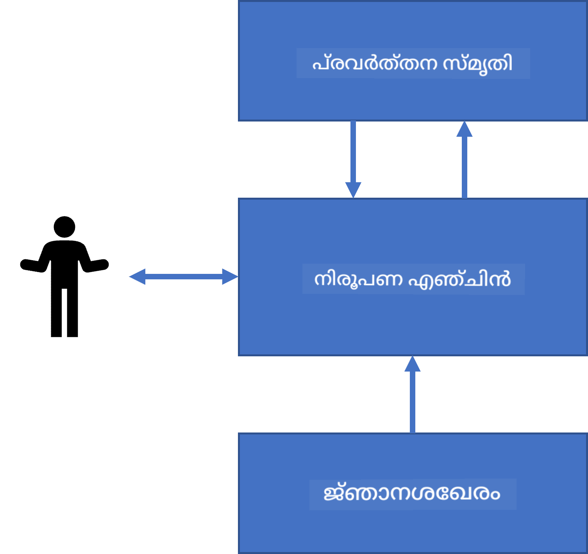

<!--
CO_OP_TRANSLATOR_METADATA:
{
  "original_hash": "7d097f7fda9166ead615e4c34552381b",
  "translation_date": "2025-11-25T21:01:12+00:00",
  "source_file": "lessons/2-Symbolic/README.md",
  "language_code": "ml"
}
-->
# അറിവ് പ്രതിനിധാനം ചെയ്യലും വിദഗ്ധ സിസ്റ്റങ്ങളും


> സ്കെച്ച്നോട്ട്: [Tomomi Imura](https://twitter.com/girlie_mac)

കൃത്രിമ ബുദ്ധിമുട്ടിന്റെ തിരച്ചിൽ മനുഷ്യർ പോലെ ലോകത്തെ മനസ്സിലാക്കാനുള്ള അറിവ് കണ്ടെത്തലിലാണ്. എന്നാൽ ഇത് എങ്ങനെ ചെയ്യാം?

## [പ്രീ-ലെക്ചർ ക്വിസ്](https://ff-quizzes.netlify.app/en/ai/quiz/3)

AIയുടെ ആദ്യകാലങ്ങളിൽ, ബുദ്ധിമുട്ടുള്ള സിസ്റ്റങ്ങൾ സൃഷ്ടിക്കുന്നതിന് മുകളിൽ നിന്ന് താഴേക്ക് സമീപനം (മുൻപത്തെ പാഠത്തിൽ ചർച്ച ചെയ്തത്) പ്രചാരത്തിലായിരുന്നു. ആളുകളിൽ നിന്നുള്ള അറിവ് യന്ത്രം വായിക്കാൻ കഴിയുന്ന രൂപത്തിലേക്ക് മാറ്റി, അത് ഉപയോഗിച്ച് പ്രശ്നങ്ങൾ സ്വയം പരിഹരിക്കാമെന്ന് കരുതിയിരുന്നു. ഈ സമീപനം രണ്ട് വലിയ ആശയങ്ങളിലായിരുന്നു അടിസ്ഥാനമാക്കിയിരിക്കുന്നത്:

* അറിവ് പ്രതിനിധാനം
* തർക്കം (റീസണിംഗ്)

## അറിവ് പ്രതിനിധാനം

സിംബോളിക് AIയിൽ പ്രധാന ആശയങ്ങളിൽ ഒന്നാണ് **അറിവ്**. അറിവും *വിവരവും* അല്ലെങ്കിൽ *ഡാറ്റയും* തമ്മിൽ വ്യത്യാസം മനസ്സിലാക്കുന്നത് പ്രധാനമാണ്. ഉദാഹരണത്തിന്, പുസ്തകങ്ങളിൽ അറിവുണ്ടെന്ന് പറയാം, കാരണം പുസ്തകങ്ങൾ പഠിച്ച് വിദഗ്ധനാകാം. എന്നാൽ പുസ്തകങ്ങളിൽ ഉള്ളത് യഥാർത്ഥത്തിൽ *ഡാറ്റ* ആണ്, പുസ്തകങ്ങൾ വായിച്ച് ഈ ഡാറ്റ നമ്മുടെ ലോക മോഡലിൽ ചേർത്താൽ അത് അറിവായി മാറും.

> ✅ **അറിവ്** എന്നത് നമ്മുടെ തലയിൽ ഉള്ളതും ലോകത്തെ മനസ്സിലാക്കലിന്റെ പ്രതിനിധാനവുമാണ്. ഇത് ഒരു സജീവമായ **പഠന** പ്രക്രിയയിലൂടെ ലഭിക്കുന്നു, നമ്മൾ സ്വീകരിക്കുന്ന വിവരങ്ങൾ നമ്മുടെ സജീവ ലോക മോഡലിൽ ചേർക്കുന്നു.

അറിവ് കൃത്യമായി നിർവചിക്കാറില്ല, പക്ഷേ [DIKW പിരമിഡ്](https://en.wikipedia.org/wiki/DIKW_pyramid) ഉപയോഗിച്ച് ബന്ധപ്പെട്ട ആശയങ്ങളുമായി പൊരുത്തപ്പെടുത്തുന്നു. ഇതിൽ ഉൾപ്പെടുന്ന ആശയങ്ങൾ:

* **ഡാറ്റ**: എഴുതിയ എഴുത്തോ സംസാരിച്ച വാക്കുകളോ പോലുള്ള ഭൗതിക മാധ്യമങ്ങളിൽ പ്രതിനിധാനം ചെയ്യപ്പെടുന്ന ഒന്നാണ്. ഡാറ്റ മനുഷ്യരിൽ സ്വതന്ത്രമായി നിലനിൽക്കുന്നു, ആളുകൾക്കിടയിൽ കൈമാറാം.
* **വിവരം**: ഡാറ്റയെ നമ്മുടെ തലയിൽ എങ്ങനെ വ്യാഖ്യാനിക്കുന്നു എന്നതാണ്. ഉദാഹരണത്തിന്, *കമ്പ്യൂട്ടർ* എന്ന വാക്ക് കേട്ടാൽ അതിന്റെ അർത്ഥം മനസ്സിലാക്കുന്നു.
* **അറിവ്**: വിവരങ്ങൾ നമ്മുടെ ലോക മോഡലിൽ ചേർക്കപ്പെടുന്നത്. ഉദാഹരണത്തിന്, കമ്പ്യൂട്ടർ എന്താണെന്ന് പഠിച്ചാൽ, അത് എങ്ങനെ പ്രവർത്തിക്കുന്നു, വില എത്രയാണ്, എന്തിന് ഉപയോഗിക്കാം തുടങ്ങിയ ആശയങ്ങൾ ഉണ്ടാകുന്നു. ഈ ബന്ധമുള്ള ആശയങ്ങളുടെ ശൃംഖലയാണ് അറിവ്.
* **ബുദ്ധി**: ലോകത്തെ മനസ്സിലാക്കലിന്റെ ഒരു ഉയർന്ന തലമാണ്, ഇത് *മെറ്റാ-അറിവ്* പ്രതിനിധാനം ചെയ്യുന്നു, ഉദാ: അറിവ് എപ്പോൾ എങ്ങനെ ഉപയോഗിക്കണം എന്ന ധാരണ.


*ചിത്രം [വിക്കിപീഡിയയിൽ നിന്ന്](https://commons.wikimedia.org/w/index.php?curid=37705247), Longlivetheux - സ്വന്തം കൃതി, CC BY-SA 4.0*

അതിനാൽ, **അറിവ് പ്രതിനിധാനം** എന്ന പ്രശ്നം കമ്പ്യൂട്ടറിനുള്ളിൽ അറിവ് ഡാറ്റ രൂപത്തിൽ പ്രതിനിധാനം ചെയ്ത് അത് സ്വയം ഉപയോഗിക്കാൻ കഴിയുന്ന വിധം കണ്ടെത്തലാണ്. ഇത് ഒരു സ്പെക്ട്രം ആയി കാണാം:


> ചിത്രം: [Dmitry Soshnikov](http://soshnikov.com)

* ഇടത്തുവശത്ത്, കമ്പ്യൂട്ടറുകൾക്ക് ഫലപ്രദമായി ഉപയോഗിക്കാവുന്ന വളരെ ലളിതമായ അറിവ് പ്രതിനിധാനങ്ങൾ ഉണ്ട്. ഏറ്റവും ലളിതമായത് ആൽഗോരിതമിക് ആണ്, അറിവ് കമ്പ്യൂട്ടർ പ്രോഗ്രാമായി പ്രതിനിധാനം ചെയ്യപ്പെടുന്നു. എന്നാൽ ഇത് ഏറ്റവും നല്ല മാർഗം അല്ല, കാരണം ഇത് ഫ്ലെക്സിബിൾ അല്ല. നമ്മുടെ തലയിൽ ഉള്ള അറിവ് പലപ്പോഴും ആൽഗോരിതമിക് അല്ല.
* വലത്തുവശത്ത്, പ്രകൃതിദത്ത എഴുത്ത് പോലുള്ള പ്രതിനിധാനങ്ങൾ ഉണ്ട്. ഇത് ഏറ്റവും ശക്തമാണ്, പക്ഷേ സ്വയം തർക്കത്തിന് ഉപയോഗിക്കാനാകില്ല.

> ✅ ഒരു നിമിഷം ചിന്തിക്കുക, നിങ്ങൾ തലയിൽ അറിവ് എങ്ങനെ പ്രതിനിധാനം ചെയ്യുന്നു, അത് കുറിപ്പുകളായി മാറ്റുമ്പോൾ retention-നായി ഏത് ഫോർമാറ്റ് നിങ്ങൾക്ക് നല്ലതാണ്?

## കമ്പ്യൂട്ടർ അറിവ് പ്രതിനിധാനങ്ങൾ വർഗ്ഗീകരിക്കൽ

വിവിധ കമ്പ്യൂട്ടർ അറിവ് പ്രതിനിധാന രീതികൾ താഴെപ്പറയുന്ന വിഭാഗങ്ങളിലായി വേർതിരിക്കാം:

* **നെറ്റ്‌വർക്ക് പ്രതിനിധാനങ്ങൾ**: നമ്മുടെ തലയിൽ ബന്ധമുള്ള ആശയങ്ങളുടെ ഒരു നെറ്റ്‌വർക്ക് ഉണ്ടെന്നതിൽ അടിസ്ഥാനമാക്കിയുള്ളത്. അതേ നെറ്റ്‌വർക്ക് കമ്പ്യൂട്ടറിനുള്ളിൽ ഗ്രാഫ് രൂപത്തിൽ പുനരുണ്ടാക്കാം - ഇതാണ് **സെമാന്റിക് നെറ്റ്‌വർക്ക്**.

1. **ഓബ്ജക്റ്റ്-അട്രിബ്യൂട്ട്-വാല്യു ട്രിപ്പ്ലറ്റുകൾ** അല്ലെങ്കിൽ **അട്രിബ്യൂട്ട്-വാല്യു ജോഡികൾ**. ഒരു ഗ്രാഫ് കമ്പ്യൂട്ടറിനുള്ളിൽ നോഡുകളും എഡ്ജുകളും ഉള്ള പട്ടികയായി പ്രതിനിധാനം ചെയ്യാവുന്നതുകൊണ്ട്, സെമാന്റിക് നെറ്റ്‌വർക്ക് ട്രിപ്പ്ലറ്റുകളുടെ പട്ടികയായി പ്രതിനിധാനം ചെയ്യാം, അതിൽ ഓബ്ജക്റ്റുകൾ, ആട്രിബ്യൂട്ടുകൾ, മൂല്യങ്ങൾ ഉൾപ്പെടും. ഉദാഹരണത്തിന്, പ്രോഗ്രാമിംഗ് ഭാഷകളെക്കുറിച്ച് താഴെപ്പറയുന്ന ട്രിപ്പ്ലറ്റുകൾ ഉണ്ടാക്കാം:

Object | Attribute | Value
-------|-----------|------
Python | is | Untyped-Language
Python | invented-by | Guido van Rossum
Python | block-syntax | indentation
Untyped-Language | doesn't have | type definitions

> ✅ ട്രിപ്പ്ലറ്റുകൾ മറ്റ് അറിവ് തരങ്ങൾ പ്രതിനിധാനം ചെയ്യാൻ എങ്ങനെ ഉപയോഗിക്കാമെന്ന് ചിന്തിക്കുക.

2. **ഹയർആർക്കിക്കൽ പ്രതിനിധാനങ്ങൾ**: നമ്മൾ തലയിൽ സാധാരണയായി ഒരു ഓബ്ജക്റ്റുകളുടെ ഹയർആർക്കി സൃഷ്ടിക്കുന്നതിൽ ഊന്നൽ നൽകുന്നു. ഉദാഹരണത്തിന്, കാനറി ഒരു പക്ഷിയാണ് എന്ന് അറിയാം, എല്ലാ പക്ഷികൾക്കും ചിറകുകൾ ഉണ്ടെന്ന് അറിയാം. കാനറിയുടെ നിറം സാധാരണയായി എന്താണെന്ന്, പറക്കാനുള്ള വേഗത എന്താണെന്ന് അറിയാം.

   - **ഫ്രെയിം പ്രതിനിധാനം**: ഓരോ ഓബ്ജക്റ്റിനെയും അല്ലെങ്കിൽ ഓബ്ജക്റ്റുകളുടെ ക്ലാസിനെയും **ഫ്രെയിം** ആയി പ്രതിനിധാനം ചെയ്യുന്നു, അതിൽ **സ്ലോട്ടുകൾ** ഉണ്ട്. സ്ലോട്ടുകൾക്ക് സാധാരണ മൂല്യങ്ങൾ, മൂല്യ നിയന്ത്രണങ്ങൾ, അല്ലെങ്കിൽ മൂല്യം ലഭിക്കാൻ വിളിക്കാവുന്ന പ്രോസീജറുകൾ ഉണ്ടാകാം. എല്ലാ ഫ്രെയിമുകളും ഒരു ഹയർആർക്കി രൂപത്തിൽ ഒറ്റപ്പെട്ടിരിക്കുന്നു, ഒബ്ജക്റ്റ്-ഓറിയന്റഡ് പ്രോഗ്രാമിംഗ് ഭാഷകളിലെ ഓബ്ജക്റ്റ് ഹയർആർക്കിയെപ്പോലെ.
   - **സിനാരിയോകൾ**: സമയക്രമത്തിൽ വികസിക്കാവുന്ന സങ്കീർണ്ണ സാഹചര്യങ്ങൾ പ്രതിനിധാനം ചെയ്യുന്ന പ്രത്യേക തരത്തിലുള്ള ഫ്രെയിമുകൾ.

**Python**

Slot | Value | Default value | Interval |
-----|-------|---------------|----------|
Name | Python | | |
Is-A | Untyped-Language | | |
Variable Case | | CamelCase | |
Program Length | | | 5-5000 lines |
Block Syntax | Indent | | |

3. **പ്രൊസീജറൽ പ്രതിനിധാനങ്ങൾ**: ഒരു നിബന്ധന സംഭവിക്കുമ്പോൾ നടപ്പിലാക്കാവുന്ന പ്രവർത്തനങ്ങളുടെ പട്ടികയായി അറിവ് പ്രതിനിധാനം ചെയ്യുന്നു.
   - പ്രൊഡക്ഷൻ റൂൾസ് if-then പ്രസ്താവനകളാണ്, നമുക്ക് നിഗമനങ്ങൾ വരുത്താൻ സഹായിക്കുന്നു. ഉദാഹരണത്തിന്, ഒരു ഡോക്ടർക്ക് ഒരു നിയമം ഉണ്ടാകാം: **IF** രോഗിക്ക് ഉയർന്ന പനി **OR** രക്തപരിശോധനയിൽ C-റിയാക്ടീവ് പ്രോട്ടീൻ ഉയർന്നാൽ **THEN** അവന്‍ അണുബാധയുണ്ട്. നിബന്ധനകളിൽ ഒന്നും കണ്ടാൽ, അണുബാധയെക്കുറിച്ച് നിഗമനം വരുത്താം, പിന്നീട് അത് തർക്കത്തിൽ ഉപയോഗിക്കാം.
   - ആൽഗോരിതങ്ങൾ മറ്റൊരു പ്രൊസീജറൽ പ്രതിനിധാന രൂപമാണ്, പക്ഷേ അറിവ് അടിസ്ഥാനമാക്കിയ സിസ്റ്റങ്ങളിൽ നേരിട്ട് ഉപയോഗിക്കാറില്ല.

4. **ലോജിക്**: ആദ്യം അറിസ്റ്റോട്ടിൽസ് മനുഷ്യരുടെ സർവത്ര അറിവ് പ്രതിനിധാനം ചെയ്യാനുള്ള മാർഗമായി നിർദ്ദേശിച്ചു.
   - പ്രെഡിക്കേറ്റ് ലോജിക് ഗണിത ശാസ്ത്ര സിദ്ധാന്തമായി വളരെ സമ്പന്നമാണ്, അതിനാൽ സാധാരണയായി പ്രൊലോഗിൽ ഉപയോഗിക്കുന്ന ഹോൺ ക്ലോസുകൾ പോലുള്ള ഒരു ഉപസമൂഹം ഉപയോഗിക്കുന്നു.
   - ഡിസ്ക്രിപ്റ്റീവ് ലോജിക് ഒരു ലോജിക്കൽ സിസ്റ്റങ്ങളുടെ കുടുംബമാണ്, ഇത് ഓബ്ജക്റ്റുകളുടെ ഹയർആർക്കി പ്രതിനിധാനം ചെയ്യാനും reasoning ചെയ്യാനും ഉപയോഗിക്കുന്നു, സെമാന്റിക് വെബ് പോലുള്ള വിതരണ അറിവ് പ്രതിനിധാനങ്ങൾക്കായി.

## വിദഗ്ധ സിസ്റ്റങ്ങൾ

സിംബോളിക് AIയുടെ ആദ്യ വിജയങ്ങളിൽ ഒന്നായിരുന്നു **വിദഗ്ധ സിസ്റ്റങ്ങൾ** - ചില പരിമിത പ്രശ്ന മേഖലകളിൽ വിദഗ്ധനായി പ്രവർത്തിക്കാൻ രൂപകൽപ്പന ചെയ്ത കമ്പ്യൂട്ടർ സിസ്റ്റങ്ങൾ. ഇവ മനുഷ്യ വിദഗ്ധരിൽ നിന്നുള്ള **അറിവ് ബേസ്** ഉപയോഗിച്ച് നിർമ്മിക്കപ്പെട്ടിരുന്നു, അതിന്മേൽ പ്രവർത്തിക്കുന്ന **ഇൻഫറൻസ് എഞ്ചിൻ** ഉണ്ടായിരുന്നു.

 | 
---------------------------------------------|------------------------------------------------
മനുഷ്യ നാഡീകുഴപ്പത്തിന്റെ ലളിതമായ ഘടന | അറിവ് അടിസ്ഥാനമാക്കിയ സിസ്റ്റത്തിന്റെ ഘടന

വിദഗ്ധ സിസ്റ്റങ്ങൾ മനുഷ്യന്റെ തർക്ക സംവിധാനത്തെപ്പോലെ നിർമ്മിച്ചിരിക്കുന്നു, അതിൽ **ഷോർട്ട്-ടേം മെമ്മറി**യും **ലോങ്-ടേം മെമ്മറി**യും ഉണ്ട്. അതുപോലെ, അറിവ് അടിസ്ഥാനമാക്കിയ സിസ്റ്റങ്ങളിൽ താഴെപ്പറയുന്ന ഘടകങ്ങൾ വേർതിരിക്കാം:

* **പ്രശ്ന മെമ്മറി**: ഇപ്പോൾ പരിഹരിക്കപ്പെടുന്ന പ്രശ്നത്തെക്കുറിച്ചുള്ള അറിവ് അടങ്ങിയിരിക്കുന്നു, ഉദാ: രോഗിയുടെ താപനില, രക്തസമ്മർദ്ദം, അണുബാധയുണ്ടോ എന്നത്. ഈ അറിവ് **സ്ഥിര അറിവ്** എന്നും വിളിക്കുന്നു, കാരണം ഇത് പ്രശ്നത്തെക്കുറിച്ചുള്ള ഒരു സ്നാപ്ഷോട്ട് ആണ് - *പ്രശ്നാവസ്ഥ*.
* **അറിവ് ബേസ്**: പ്രശ്ന മേഖലയിൽ ദീർഘകാല അറിവ് പ്രതിനിധാനം ചെയ്യുന്നു. മനുഷ്യ വിദഗ്ധരിൽ നിന്നു കൈമാറിയതാണ്, കൂടാതെ ഇത് കൺസൾട്ടേഷനുകൾക്കിടയിൽ മാറാറില്ല. ഇത് പ്രശ്നാവസ്ഥകളിൽ നിന്ന് മറ്റൊന്നിലേക്ക് നാവിഗേറ്റ് ചെയ്യാൻ സഹായിക്കുന്നതിനാൽ **ഡൈനാമിക് അറിവ്** എന്നും വിളിക്കുന്നു.
* **ഇൻഫറൻസ് എഞ്ചിൻ**: പ്രശ്നാവസ്ഥാ സ്പേസിൽ തിരച്ചിൽ നടത്തുന്നതും, ആവശ്യമായപ്പോൾ ഉപയോക്താവിനോട് ചോദ്യങ്ങൾ ചോദിക്കുന്നതും, ഓരോ അവസ്ഥയ്ക്കും അനുയോജ്യമായ നിയമങ്ങൾ കണ്ടെത്തുന്നതും നിയന്ത്രിക്കുന്നു.

ഉദാഹരണമായി, ഒരു ജീവിയെ അതിന്റെ ശാരീരിക സവിശേഷതകളുടെ അടിസ്ഥാനത്തിൽ തിരിച്ചറിയുന്ന വിദഗ്ധ സിസ്റ്റം പരിഗണിക്കാം:


> ചിത്രം: [Dmitry Soshnikov](http://soshnikov.com)

ഈ ചിത്രത്തെ **AND-OR ട്രീ** എന്ന് വിളിക്കുന്നു, ഇത് പ്രൊഡക്ഷൻ റൂളുകളുടെ ഗ്രാഫിക്കൽ പ്രതിനിധാനമാണ്. വിദഗ്ധരിൽ നിന്നുള്ള അറിവ് എടുക്കുമ്പോൾ ട്രീ വരയ്ക്കുന്നത് സഹായകരമാണ്. കമ്പ്യൂട്ടറിനുള്ളിൽ അറിവ് പ്രതിനിധാനം ചെയ്യാൻ നിയമങ്ങൾ ഉപയോഗിക്കുന്നത് കൂടുതൽ സൗകര്യപ്രദമാണ്:

```
IF the animal eats meat
OR (animal has sharp teeth
    AND animal has claws
    AND animal has forward-looking eyes
) 
THEN the animal is a carnivore
```

നിങ്ങൾ ശ്രദ്ധിക്കാം, നിയമത്തിന്റെ ഇടത് ഭാഗത്തുള്ള ഓരോ നിബന്ധനയും പ്രവർത്തനവും അടിസ്ഥാനപരമായി ഓബ്ജക്റ്റ്-അട്രിബ്യൂട്ട്-വാല്യു (OAV) ട്രിപ്പ്ലറ്റുകളാണ്. **വർക്കിംഗ് മെമ്മറി** നിലവിൽ പരിഹരിക്കപ്പെടുന്ന പ്രശ്നവുമായി ബന്ധപ്പെട്ട OAV ട്രിപ്പ്ലറ്റുകളുടെ സമാഹാരമാണ്. **റൂൾസ് എഞ്ചിൻ** നിലവിലുള്ള നിബന്ധനകൾ പൂരിപ്പിക്കുന്ന നിയമങ്ങൾ കണ്ടെത്തി അവ പ്രയോഗിച്ച് വർക്കിംഗ് മെമ്മറിയിൽ പുതിയ ട്രിപ്പ്ലറ്റുകൾ ചേർക്കുന്നു.

> ✅ നിങ്ങൾ ഇഷ്ടപ്പെടുന്ന വിഷയത്തിൽ നിങ്ങളുടെ സ്വന്തം AND-OR ട്രീ എഴുതുക!

### ഫോർവേഡ് vs. ബാക്ക്വേഡ് ഇൻഫറൻസ്

മുകളിൽ വിവരിച്ച പ്രക്രിയ **ഫോർവേഡ് ഇൻഫറൻസ്** എന്നാണ് വിളിക്കുന്നത്. ഇത് വർക്കിംഗ് മെമ്മറിയിൽ ലഭ്യമായ പ്രാരംഭ ഡാറ്റയിൽ നിന്ന് ആരംഭിച്ച് താഴെപ്പറയുന്ന തർക്ക ലൂപ്പ് നടപ്പിലാക്കുന്നു:

1. ലക്ഷ്യ ആട്രിബ്യൂട്ട് വർക്കിംഗ് മെമ്മറിയിൽ ഉണ്ടെങ്കിൽ - നിർത്തുക, ഫലം നൽകുക
2. നിലവിൽ പൂരിപ്പിച്ചിരിക്കുന്ന നിബന്ധനകൾ ഉള്ള എല്ലാ നിയമങ്ങളും കണ്ടെത്തുക - **കോൺഫ്ലിക്റ്റ് സെറ്റ്** ലഭിക്കുക
3. **കോൺഫ്ലിക്റ്റ് റെസല്യൂഷൻ** നടത്തുക - ഈ ഘട്ടത്തിൽ നടപ്പിലാക്കാനുള്ള ഒരു നിയമം തിരഞ്ഞെടുക്കുക. വിവിധ കോൺഫ്ലിക്റ്റ് റെസല്യൂഷൻ തന്ത്രങ്ങൾ ഉണ്ടാകാം:
   - അറിവ് ബേസിലെ ആദ്യ പ്രയോഗയോഗ്യമായ നിയമം തിരഞ്ഞെടുക്കുക
   - യാദൃച്ഛിക നിയമം തിരഞ്ഞെടുക്കുക
   - *കൂടുതൽ പ്രത്യേകമായ* നിയമം തിരഞ്ഞെടുക്കുക, അഥവാ LHS-ൽ ഏറ്റവും കൂടുതൽ നിബന്ധനകൾ പൂരിപ്പിക്കുന്ന നിയമം
4. തിരഞ്ഞെടുക്കപ്പെട്ട നിയമം പ്രയോഗിച്ച് പ്രശ്നാവസ്ഥയിൽ പുതിയ അറിവ് ചേർക്കുക
5. പടിയിലേയ്ക്ക് മടങ്ങി 1-ാം പടി ആവർത്തിക്കുക

എങ്കിലും, ചില സാഹചര്യങ്ങളിൽ പ്രശ്നത്തെക്കുറിച്ചുള്ള അറിവ് ശൂന്യമായിരിക്കാം, നാം ചോദ്യങ്ങൾ ചോദിച്ച് നിഗമനത്തിലേക്ക് എത്താൻ ആഗ്രഹിക്കാം. ഉദാഹരണത്തിന്, മെഡിക്കൽ ഡയഗ്നോസിസിൽ, രോഗിയെ പരിശോധിക്കുന്നതിന് മുമ്പ് എല്ലാ പരിശോധനകളും നടത്താറില്ല. തീരുമാനമെടുക്കേണ്ടപ്പോൾ മാത്രമേ പരിശോധനകൾ നടത്തൂ.

ഈ പ്രക്രിയ **ബാക്ക്വേഡ് ഇൻഫറൻസ്** ഉപയോഗിച്ച് മോഡൽ ചെയ്യാം. ഇത് **ലക്ഷ്യം** (goal) - കണ്ടെത്തേണ്ട ആട്രിബ്യൂട്ട് മൂല്യം - നയിക്കുന്നു:

1. ലക്ഷ്യത്തിന്റെ മൂല്യം നൽകുന്ന എല്ലാ നിയമങ്ങളും തിരഞ്ഞെടുക്കുക (RHS-ൽ ലക്ഷ്യം ഉള്ളവ) - കോൺഫ്ലിക്റ്റ് സെറ്റ്
2. ആ ആട്രിബ്യൂട്ടിനുള്ള നിയമങ്ങൾ ഇല്ലെങ്കിൽ, അല്ലെങ്കിൽ ഉപയോക്താവിൽ നിന്ന് മൂല്യം ചോദിക്കണമെന്ന് നിയമം ഉണ്ടെങ്കിൽ - ചോദിക്കുക, അല്ലെങ്കിൽ:
3. കോൺഫ്ലിക്റ്റ് റെസല്യൂഷൻ തന്ത്രം ഉപയോഗിച്ച് ഒരു നിയമം *ഹൈപ്പോത്തസിസ്* ആയി തിരഞ്ഞെടുക്കുക - അത് തെളിയിക്കാൻ ശ്രമിക്കും
4. നിയമത്തിന്റെ LHS-ൽ ഉള്ള എല്ലാ ആട്രിബ്യൂട്ടുകൾക്കും ഈ പ്രക്രിയ ആവർത്തിച്ച് അവ ലക്ഷ്യങ്ങളായി തെളിയിക്കാൻ ശ്രമിക്കുക
5. പ്രക്രിയ ഏതെങ്കിലും ഘട്ടത്തിൽ പരാജയപ്പെട്ടാൽ - 3-ാം പടിയിൽ മറ്റൊരു നിയമം ഉപയോഗിക്കുക

> ✅ ഏത് സാഹചര്യങ്ങളിൽ ഫോർവേഡ് ഇൻഫറൻസ് കൂടുതൽ അനുയോജ്യമാണ്? ബാക്ക്വേഡ് ഇൻഫറൻസ് എപ്പോൾ ഉപയോഗിക്കണം?

### വിദഗ്ധ സിസ്റ്റങ്ങൾ നടപ്പിലാക്കൽ

വിദഗ്ധ സിസ്റ്റങ്ങൾ വിവിധ ഉപകരണങ്ങൾ ഉപയോഗിച്ച് നടപ്പിലാക്കാം:

* ഉയർന്ന തലത്തിലുള്ള പ്രോഗ്രാമിംഗ് ഭാഷയിൽ നേരിട്ട് പ്രോഗ്രാം ചെയ്യുക. ഇത് നല്ല ആശയം അല്ല, കാരണം അറിവ് അടിസ്ഥാനമാക്കിയ സിസ്റ്റത്തിന്റെ പ്രധാന ഗുണം അറിവും ഇൻഫറൻസും വേർതിരിച്ചിരിക്കുന്നു എന്നതാണ്, പ്രശ്ന മേഖല വിദഗ്ധൻ ഇൻഫറൻസ് പ്രക്രിയയുടെ വിശദാംശങ്ങൾ അറിയാതെ നിയമങ്ങൾ എഴുതാൻ കഴിയണം.
* **വിദഗ്ധ സിസ്റ്റം ഷെൽ** ഉപയോഗിക്കുക, അതായത് അറിവ് പ്രതിനിധാന ഭാഷ ഉപയോഗിച്ച് അറിവ് ചേർക്കാൻ രൂപകൽപ്പന ചെയ്ത സിസ്റ്റം.

## ✍️ അഭ്യാസം: ജീവി ഇൻഫറൻസ്

ഫോർവേഡ്, ബാക്ക്വേഡ് ഇൻഫറൻസ് വിദഗ്ധ സിസ്റ്റം നടപ്പിലാക്കാനുള്ള ഉദാഹരണത്തിന് [Animals.ipynb](https://github.com/microsoft/AI-For-Beginners/blob/main/lessons/2-Symbolic/Animals.ipynb) കാണുക.

> **കുറിപ്പ്**: ഈ ഉദാഹരണം വളരെ ലളിതമാണ്, വിദഗ്ധ സിസ്റ്റ് എങ്ങനെ കാണപ്പെടുന്നു എന്ന ആശയം നൽകുന്നു. നിങ്ങൾ ഇത്തരമൊരു സിസ്റ്റം സൃഷ്ടിക്കുമ്പോൾ, ഏകദേശം 200+ നിയമങ്ങൾ എത്തുമ്പോഴാണ് അതിൽ നിന്നുള്ള *ബുദ്ധിമുട്ടുള്ള* പെരുമാറ്റം ശ്രദ്ധിക്കാനാകുക. ചിലപ്പോൾ നിയമങ്ങൾ വളരെ സങ്കീർണ്ണമാകുന്നു, എല്ലാം മനസ്സിലാക്കാൻ ബുദ്ധിമുട്ട് ഉണ്ടാക
- അറിവ് വിവരണത്തിനായി XML അടിസ്ഥാനമാക്കിയുള്ള ഭാഷകളുടെ ഒരു കുടുംബം: RDF (Resource Description Framework), RDFS (RDF Schema), OWL (Ontology Web Language).

സെമാന്റിക് വെബിലെ ഒരു പ്രധാന ആശയം **ഓന്റോളജി** എന്ന ആശയമാണ്. ഇത് ഒരു പ്രശ്ന മേഖലയെ ഔപചാരികമായ അറിവ് പ്രതിനിധാനം ഉപയോഗിച്ച് വ്യക്തമായി നിർവചിക്കുന്നതിനെ സൂചിപ്പിക്കുന്നു. ഏറ്റവും ലളിതമായ ഓന്റോളജി പ്രശ്ന മേഖലയിലെ വസ്തുക്കളുടെ ഒരു ഹയർആർക്കിയാകാം, എന്നാൽ കൂടുതൽ സങ്കീർണ്ണമായ ഓന്റോളജികൾ നിഗമനത്തിന് ഉപയോഗിക്കാവുന്ന നിയമങ്ങളും ഉൾക്കൊള്ളും.

സെമാന്റിക് വെബിൽ എല്ലാ പ്രതിനിധാനങ്ങളും ട്രിപ്പിളുകളിലാണ് അടിസ്ഥാനമാക്കുന്നത്. ഓരോ വസ്തുവും ഓരോ ബന്ധവും യുണീക്ക് ആയി URI ഉപയോഗിച്ച് തിരിച്ചറിയപ്പെടുന്നു. ഉദാഹരണത്തിന്, ഈ AI പാഠ്യപദ്ധതി 2022 ജനുവരി 1-ന് Dmitry Soshnikov വികസിപ്പിച്ചുവെന്ന് പറയാൻ താഴെ കാണുന്ന ട്രിപ്പിളുകൾ ഉപയോഗിക്കാം:


```
http://github.com/microsoft/ai-for-beginners http://www.example.com/terms/creation-date “Jan 13, 2007”
http://github.com/microsoft/ai-for-beginners http://purl.org/dc/elements/1.1/creator http://soshnikov.com
```

> ✅ ഇവിടെ `http://www.example.com/terms/creation-date` ഉം `http://purl.org/dc/elements/1.1/creator` ഉം *creator* (സൃഷ്ടാവ്) ഉം *creation date* (സൃഷ്ടി തീയതി) ഉം സൂചിപ്പിക്കാൻ ഉപയോഗിക്കുന്ന പ്രശസ്തവും സർവത്ര അംഗീകരിക്കപ്പെട്ട URI കളാണ്.

കൂടുതൽ സങ്കീർണ്ണമായ സാഹചര്യത്തിൽ, സൃഷ്ടാക്കളുടെ പട്ടിക നിർവചിക്കാൻ RDF ൽ നിർവചിച്ചിട്ടുള്ള ചില ഡാറ്റാ ഘടനകൾ ഉപയോഗിക്കാം.


> മുകളിൽ കാണുന്ന ചിത്രങ്ങൾ [Dmitry Soshnikov](http://soshnikov.com) യുടെതാണ്

സെമാന്റിക് വെബ് നിർമ്മാണം ചിലപ്പോൾ സെർച്ച് എഞ്ചിനുകളും സ്വാഭാവിക ഭാഷാ പ്രോസസ്സിംഗ് സാങ്കേതികവിദ്യകളും വിജയിച്ചതുകൊണ്ട് മന്ദഗതിയിലായി, അവ ടെക്സ്റ്റിൽ നിന്ന് ഘടനാപരമായ ഡാറ്റ എടുക്കാൻ സഹായിക്കുന്നു. എങ്കിലും ചില മേഖലകളിൽ ഓന്റോളജികളും അറിവ് അടിസ്ഥാനങ്ങളും പരിപാലിക്കാൻ വലിയ ശ്രമങ്ങൾ തുടരുന്നു. ശ്രദ്ധിക്കാവുന്ന ചില പ്രോജക്ടുകൾ:

* [WikiData](https://wikidata.org/) വിക്കിപീഡിയയുമായി ബന്ധപ്പെട്ട യന്ത്രം വായിക്കാൻ കഴിയുന്ന അറിവ് അടിസ്ഥാനങ്ങളുടെ ഒരു ശേഖരമാണ്. ഡാറ്റയുടെ ഭൂരിഭാഗവും വിക്കിപീഡിയയിലെ *InfoBoxes* എന്ന ഘടനാപരമായ ഉള്ളടക്കത്തിൽ നിന്നാണ് ശേഖരിക്കുന്നത്. നിങ്ങൾക്ക് SPARQL എന്ന സെമാന്റിക് വെബിനുള്ള പ്രത്യേക ക്വറി ഭാഷയിൽ [ക്വറി](https://query.wikidata.org/) ചെയ്യാം. മനുഷ്യരിൽ ഏറ്റവും ജനപ്രിയമായ കണ്ണിന്റെ നിറങ്ങൾ കാണിക്കുന്ന ഒരു ഉദാഹരണ ക്വറി ഇതാ:

```sparql
#defaultView:BubbleChart
SELECT ?eyeColorLabel (COUNT(?human) AS ?count)
WHERE
{
  ?human wdt:P31 wd:Q5.       # human instance-of homo sapiens
  ?human wdt:P1340 ?eyeColor. # human eye-color ?eyeColor
  SERVICE wikibase:label { bd:serviceParam wikibase:language "en". }
}
GROUP BY ?eyeColorLabel
```

* [DBpedia](https://www.dbpedia.org/) WikiData പോലെയുള്ള മറ്റൊരു ശ്രമമാണ്.

> ✅ നിങ്ങളുടെ സ്വന്തം ഓന്റോളജികൾ നിർമ്മിക്കാൻ, അല്ലെങ്കിൽ നിലവിലുള്ളവ തുറക്കാൻ ആഗ്രഹിക്കുന്നുവെങ്കിൽ, [Protégé](https://protege.stanford.edu/) എന്ന മികച്ച ദൃശ്യ ഓന്റോളജി എഡിറ്റർ ഉണ്ട്. ഡൗൺലോഡ് ചെയ്യുക അല്ലെങ്കിൽ ഓൺലൈനിൽ ഉപയോഗിക്കുക.


*Web Protégé എഡിറ്റർ റോമാനോവ് കുടുംബ ഓന്റോളജിയുമായി തുറന്നിരിക്കുന്ന ചിത്രം. Dmitry Soshnikov യുടെ സ്ക്രീൻഷോട്ട്*

## ✍️ അഭ്യാസം: ഒരു കുടുംബ ഓന്റോളജി

കുടുംബ ബന്ധങ്ങളെക്കുറിച്ച് നിഗമനം നടത്താൻ സെമാന്റിക് വെബ് സാങ്കേതികവിദ്യകൾ ഉപയോഗിക്കുന്ന ഒരു ഉദാഹരണത്തിന് [FamilyOntology.ipynb](https://github.com/Ezana135/AI-For-Beginners/blob/main/lessons/2-Symbolic/FamilyOntology.ipynb) കാണുക. സാധാരണ GEDCOM ഫോർമാറ്റിൽ പ്രതിനിധാനം ചെയ്ത ഒരു കുടുംബ വൃക്ഷവും കുടുംബ ബന്ധങ്ങളുടെ ഓന്റോളജിയും എടുത്ത് നൽകിയ വ്യക്തികളുടെ കുടുംബ ബന്ധങ്ങളുടെ ഗ്രാഫ് നിർമ്മിക്കും.

## Microsoft Concept Graph

പലപ്പോഴും ഓന്റോളജികൾ ശ്രദ്ധാപൂർവ്വം കൈയാൽ സൃഷ്ടിക്കപ്പെടുന്നു. എന്നാൽ, സ്വാഭാവിക ഭാഷാ ടെക്സ്റ്റുകളിൽ നിന്ന് പോലുള്ള അസംഘടിത ഡാറ്റയിൽ നിന്ന് ഓന്റോളജികൾ **മൈനിംഗ്** ചെയ്യാനും സാധിക്കും.

ഇത്തരം ഒരു ശ്രമം Microsoft Research നടത്തിയതാണ്, ഫലമായി [Microsoft Concept Graph](https://blogs.microsoft.com/ai/microsoft-researchers-release-graph-that-helps-machines-conceptualize/?WT.mc_id=academic-77998-cacaste) ലഭിച്ചു.

ഇത് `is-a` പാരമ്പര്യ ബന്ധം ഉപയോഗിച്ച് കൂട്ടിച്ചേർത്ത വലിയ എന്റിറ്റി ശേഖരമാണ്. "Microsoft എന്താണ്?" എന്ന ചോദ്യത്തിന് "ഒരു കമ്പനി 0.87 സാധ്യതയോടെ, ഒരു ബ്രാൻഡ് 0.75 സാധ്യതയോടെ" എന്നിങ്ങനെ ഉത്തരം നൽകാൻ ഇത് സഹായിക്കുന്നു.

ഗ്രാഫ് REST API ആയി ലഭ്യമാണ്, അല്ലെങ്കിൽ എല്ലാ എന്റിറ്റി ജോഡികളും പട്ടികപ്പെടുത്തിയ വലിയ ഡൗൺലോഡുചെയ്യാവുന്ന ടെക്സ്റ്റ് ഫയലായി ലഭ്യമാണ്.

## ✍️ അഭ്യാസം: ഒരു കോൺസെപ്റ്റ് ഗ്രാഫ്

Microsoft Concept Graph ഉപയോഗിച്ച് വാർത്താ ലേഖനങ്ങളെ വിവിധ വിഭാഗങ്ങളായി ഗ്രൂപ്പുചെയ്യുന്നത് എങ്ങനെ ചെയ്യാമെന്ന് കാണാൻ [MSConceptGraph.ipynb](https://github.com/microsoft/AI-For-Beginners/blob/main/lessons/2-Symbolic/MSConceptGraph.ipynb) നോട്ട്‌ബുക്ക് പരീക്ഷിക്കുക.

## സമാപനം

ഇന്നത്തെ കാലത്ത്, AI യെ സാധാരണയായി *Machine Learning* അല്ലെങ്കിൽ *Neural Networks* എന്നതിന്റെ സമാനാർത്ഥകമായി കാണുന്നു. എന്നാൽ മനുഷ്യൻ വ്യക്തമായ നിഗമനം പ്രകടിപ്പിക്കുന്നുണ്ട്, ഇത് ഇപ്പോൾ ന്യൂറൽ നെറ്റ്വർക്കുകൾ കൈകാര്യം ചെയ്യാത്ത ഒന്നാണ്. യഥാർത്ഥ ലോക പ്രോജക്ടുകളിൽ, വിശദമായ നിഗമനം വിശദീകരണങ്ങൾ ആവശ്യമായ, അല്ലെങ്കിൽ സിസ്റ്റത്തിന്റെ പെരുമാറ്റം നിയന്ത്രിതമായി മാറ്റേണ്ടതുള്ള പ്രവർത്തനങ്ങൾക്ക് ഇപ്പോഴും ഉപയോഗിക്കുന്നു.

## 🚀 വെല്ലുവിളി

ഈ പാഠവുമായി ബന്ധപ്പെട്ട കുടുംബ ഓന്റോളജി നോട്ട്‌ബുക്കിൽ, മറ്റ് കുടുംബ ബന്ധങ്ങളുമായി പരീക്ഷണം നടത്താനുള്ള അവസരം ഉണ്ട്. കുടുംബ വൃക്ഷത്തിലെ ആളുകൾക്കിടയിലെ പുതിയ ബന്ധങ്ങൾ കണ്ടെത്താൻ ശ്രമിക്കുക.

## [പാഠാനന്തര ക്വിസ്](https://ff-quizzes.netlify.app/en/ai/quiz/4)

## അവലോകനം & സ്വയം പഠനം

മനുഷ്യർ അറിവ് അളക്കാനും കോഡിഫൈ ചെയ്യാനും ശ്രമിച്ച മേഖലകൾ കണ്ടെത്താൻ ഇന്റർനെറ്റിൽ കുറച്ച് ഗവേഷണം നടത്തുക. Bloom's Taxonomy നോക്കുക, മനുഷ്യർ അവരുടെ ലോകത്തെ എങ്ങനെ മനസ്സിലാക്കാൻ ശ്രമിച്ചുവെന്ന് ചരിത്രത്തിലേക്ക് തിരിച്ചു പോകുക. ജീവജാലങ്ങളുടെ ടാക്സോണോമി സൃഷ്ടിക്കാൻ Linnaeus നടത്തിയ പ്രവർത്തനം പരിശോധിക്കുക, രാസഘടകങ്ങളെ വിവരണവും ഗ്രൂപ്പുചെയ്യലും ചെയ്യാൻ Dmitri Mendeleev എങ്ങനെ മാർഗ്ഗം കണ്ടെത്തി എന്ന് കാണുക. മറ്റേതെങ്കിലും രസകരമായ ഉദാഹരണങ്ങൾ നിങ്ങൾക്ക് കണ്ടെത്താമോ?

**അസൈൻമെന്റ്**: [ഒരു ഓന്റോളജി നിർമ്മിക്കുക](assignment.md)

---

<!-- CO-OP TRANSLATOR DISCLAIMER START -->
**അസൂയാപത്രം**:  
ഈ രേഖ AI വിവർത്തന സേവനം [Co-op Translator](https://github.com/Azure/co-op-translator) ഉപയോഗിച്ച് വിവർത്തനം ചെയ്തതാണ്. നാം കൃത്യതയ്ക്ക് ശ്രമിച്ചെങ്കിലും, സ്വയം പ്രവർത്തിക്കുന്ന വിവർത്തനങ്ങളിൽ പിശകുകൾ അല്ലെങ്കിൽ തെറ്റുകൾ ഉണ്ടാകാമെന്ന് ദയവായി ശ്രദ്ധിക്കുക. അതിന്റെ മാതൃഭാഷയിലുള്ള യഥാർത്ഥ രേഖ അധികാരപരമായ ഉറവിടമായി കണക്കാക്കണം. നിർണായക വിവരങ്ങൾക്ക്, പ്രൊഫഷണൽ മനുഷ്യ വിവർത്തനം ശുപാർശ ചെയ്യപ്പെടുന്നു. ഈ വിവർത്തനത്തിന്റെ ഉപയോഗത്തിൽ നിന്നുണ്ടാകുന്ന ഏതെങ്കിലും തെറ്റിദ്ധാരണകൾക്കോ വ്യാഖ്യാനക്കേടുകൾക്കോ ഞങ്ങൾ ഉത്തരവാദികളല്ല.
<!-- CO-OP TRANSLATOR DISCLAIMER END -->