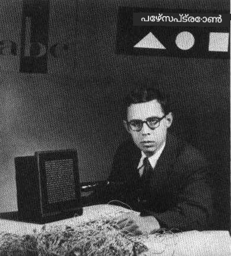
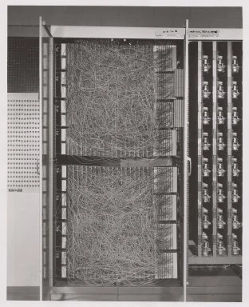
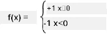

# ന്യൂറൽ നെറ്റ്വർക്കുകളിലേക്ക് പരിചയം: പേഴ്സെപ്ട്രോൺ

## [പ്രീ-ലെക്ചർ ക്വിസ്](https://ff-quizzes.netlify.app/en/ai/quiz/5)

ആധുനിക ന്യൂറൽ നെറ്റ്വർക്കിനോട് സാമ്യമുള്ള ഒന്നിനെ ആദ്യമായി നടപ്പിലാക്കാൻ ശ്രമിച്ചത് 1957-ൽ കോർണൽ എയറോണോട്ടിക്കൽ ലബോറട്ടറിയിലെ ഫ്രാങ്ക് റോസൻബ്ര്ലാറ്റ് ആണ്. ഇത് "മാർക്ക്-1" എന്ന ഹാർഡ്‌വെയർ രൂപത്തിൽ ഉണ്ടായിരുന്നു, ട്രയാംഗിളുകൾ, സ്ക്വയറുകൾ, സർക്കിളുകൾ പോലുള്ള പ്രാഥമിക ജ്യാമിതീയ ആകൃതികൾ തിരിച്ചറിയാൻ രൂപകൽപ്പന ചെയ്തിരുന്നത്.

|      |      |
|--------------|-----------|
| | |

> ചിത്രങ്ങൾ [വിക്കിപീഡിയയിൽ നിന്ന്](https://en.wikipedia.org/wiki/Perceptron)

ഒരു ഇൻപുട്ട് ചിത്രം 20x20 ഫോട്ടോസെൽ അറേ ആയി പ്രതിനിധീകരിച്ചിരുന്നു, അതിനാൽ ന്യൂറൽ നെറ്റ്വർക്കിന് 400 ഇൻപുട്ടുകളും ഒരു ബൈനറി ഔട്ട്പുട്ടും ഉണ്ടായിരുന്നു. ഒരു ലളിതമായ നെറ്റ്വർക്ക് ഒരു ന്യൂറോൺ മാത്രമായിരുന്നു, അതിനെ **threshold logic unit** എന്നും വിളിച്ചിരുന്നു. ന്യൂറൽ നെറ്റ്വർക്കിലെ വെയ്റ്റുകൾ പോട്ടൻഷ്യോമീറ്ററുകൾ പോലെ പ്രവർത്തിച്ചു, പരിശീലന ഘട്ടത്തിൽ മാനുവൽ ക്രമീകരണം ആവശ്യമായിരുന്നു.

> ✅ പോട്ടൻഷ്യോമീറ്റർ എന്നത് ഒരു സർക്യൂട്ടിന്റെ റെസിസ്റ്റൻസ് ക്രമീകരിക്കാൻ ഉപയോക്താവിന് അനുവദിക്കുന്ന ഉപകരണം ആണ്.

> ആ സമയത്ത് ന്യൂയോർക്ക് ടൈംസ് പേഴ്സെപ്ട്രോണിനെ കുറിച്ച് എഴുതിയതു: *നാവികസേന പ്രതീക്ഷിക്കുന്ന ഒരു ഇലക്ട്രോണിക് കമ്പ്യൂട്ടറിന്റെ ഭ്രൂണ രൂപം, അത് നടക്കാനും, സംസാരിക്കാനും, കാണാനും, എഴുതാനും, സ്വയം പുനരുത്പാദിപ്പിക്കാനും, അതിന്റെ നിലനിൽപ്പിനെ ബോധ്യപ്പെടുത്താനും കഴിയും.*

## പേഴ്സെപ്ട്രോൺ മോഡൽ

നമുക്ക് N ഫീച്ചറുകൾ ഉള്ള ഒരു മോഡൽ ഉണ്ടെന്ന് കരുതുക, അപ്പോൾ ഇൻപുട്ട് വെക്ടർ N വലുപ്പമുള്ള ഒരു വെക്ടർ ആയിരിക്കും. പേഴ്സെപ്ട്രോൺ ഒരു **ബൈനറി ക്ലാസിഫിക്കേഷൻ** മോഡലാണ്, അതായത് രണ്ട് ക്ലാസ്സുകളിലുള്ള ഇൻപുട്ട് ഡാറ്റ തമ്മിൽ വ്യത്യാസം കാണിക്കാൻ കഴിയും. ഓരോ ഇൻപുട്ട് വെക്ടറിനും x, നമ്മുടെ പേഴ്സെപ്ട്രോണിന്റെ ഔട്ട്പുട്ട് +1 അല്ലെങ്കിൽ -1 ആയിരിക്കും, ക്ലാസ്സിന്റെ അടിസ്ഥാനത്തിൽ. ഔട്ട്പുട്ട് താഴെ കാണുന്ന ഫോർമുല ഉപയോഗിച്ച് കണക്കാക്കും:

y(x) = f(w<sup>T</sup>x)

ഇവിടെ f ഒരു സ്റ്റെപ്പ് ആക്ടിവേഷൻ ഫംഗ്ഷനാണ്

<!-- img src="http://www.sciweavers.org/tex2img.php?eq=f%28x%29%20%3D%20%5Cbegin%7Bcases%7D%0A%20%20%20%20%20%20%20%20%20%2B1%20%26%20x%20%5Cgeq%200%20%5C%5C%0A%20%20%20%20%20%20%20%20%20-1%20%26%20x%20%3C%200%0A%20%20%20%20%20%20%20%5Cend%7Bcases%7D%20%5C%5C%0A&bc=White&fc=Black&im=jpg&fs=12&ff=arev&edit=0" align="center" border="0" alt="f(x) = \begin{cases} +1 & x \geq 0 \\ -1 & x < 0 \end{cases} \\" width="154" height="50" / -->


## പേഴ്സെപ്ട്രോൺ പരിശീലനം

പേഴ്സെപ്ട്രോൺ പരിശീലിപ്പിക്കാൻ, ഏറ്റവും കൂടുതൽ മൂല്യങ്ങൾ ശരിയായി ക്ലാസിഫൈ ചെയ്യുന്ന വെയ്റ്റ് വെക്ടർ w കണ്ടെത്തണം, അതായത് ഏറ്റവും കുറഞ്ഞ **പിശക്** ഉണ്ടാക്കുന്ന w. ഈ പിശക് E, **പേഴ്സെപ്ട്രോൺ ക്രൈറ്റീരിയൻ** പ്രകാരം താഴെപ്പറയുന്ന വിധം നിർവചിക്കുന്നു:

E(w) = -&sum;w<sup>T</sup>x<sub>i</sub>t<sub>i</sub>

ഇവിടെ:

* തകരാറുള്ള ക്ലാസിഫിക്കേഷൻ ഉണ്ടാക്കുന്ന പരിശീലന ഡാറ്റ പോയിന്റുകൾ i-കളുടെ സംഖ്യയാണ് ഈ സമാഹാരം
* x<sub>i</sub> ഇൻപുട്ട് ഡാറ്റയാണ്, t<sub>i</sub> നെഗറ്റീവ് ഉദാഹരണങ്ങൾക്ക് -1, പോസിറ്റീവ് ഉദാഹരണങ്ങൾക്ക് +1 ആണ്.

ഈ ക്രൈറ്റീരിയൻ വെയ്റ്റ് w-യുടെ ഫംഗ്ഷനായി കണക്കാക്കപ്പെടുന്നു, അതിനെ കുറയ്ക്കേണ്ടതാണ്. സാധാരണയായി **ഗ്രേഡിയന്റ് ഡിസെന്റ്** എന്ന രീതിയാണ് ഉപയോഗിക്കുന്നത്, ഇതിൽ നാം ആദ്യം ചില പ്രാരംഭ വെയ്റ്റുകൾ w<sup>(0)</sup> എടുക്കുന്നു, പിന്നീട് ഓരോ ഘട്ടത്തിലും താഴെ കാണുന്ന ഫോർമുല പ്രകാരം വെയ്റ്റുകൾ അപ്ഡേറ്റ് ചെയ്യുന്നു:

w<sup>(t+1)</sup> = w<sup>(t)</sup> - &eta;&nabla;E(w)

ഇവിടെ &eta; എന്നത് **ലേണിംഗ് റേറ്റ്** ആണ്, &nabla;E(w) E-യുടെ **ഗ്രേഡിയന്റ്** ആണ്. ഗ്രേഡിയന്റ് കണക്കാക്കിയ ശേഷം, നമുക്ക് ലഭിക്കുന്നത്:

w<sup>(t+1)</sup> = w<sup>(t)</sup> + &sum;&eta;x<sub>i</sub>t<sub>i</sub>

Python-ൽ ആൽഗോരിതം ഇങ്ങനെ കാണാം:

```python
def train(positive_examples, negative_examples, num_iterations = 100, eta = 1):

    weights = [0,0,0] # ഭാരങ്ങൾ ആരംഭിക്കുക (ഏതാണ്ട് യാദൃച്ഛികമായി :)
        
    for i in range(num_iterations):
        pos = random.choice(positive_examples)
        neg = random.choice(negative_examples)

        z = np.dot(pos, weights) # പെർസെപ്ട്രോൺ ഔട്ട്പുട്ട് കണക്കാക്കുക
        if z < 0: # പോസിറ്റീവ് ഉദാഹരണം നെഗറ്റീവായി വർഗ്ഗീകരിച്ചു
            weights = weights + eta*weights.shape

        z  = np.dot(neg, weights)
        if z >= 0: # നെഗറ്റീവ് ഉദാഹരണം പോസിറ്റീവായി വർഗ്ഗീകരിച്ചു
            weights = weights - eta*weights.shape

    return weights
```

## സംക്ഷേപം

ഈ പാഠത്തിൽ, നിങ്ങൾ പേഴ്സെപ്ട്രോൺ എന്ന ബൈനറി ക്ലാസിഫിക്കേഷൻ മോഡലിനെക്കുറിച്ച് പഠിച്ചു, കൂടാതെ വെയ്റ്റ് വെക്ടർ ഉപയോഗിച്ച് അത് എങ്ങനെ പരിശീലിപ്പിക്കാമെന്ന് മനസിലാക്കി.

## 🚀 ചലഞ്ച്

നിങ്ങൾക്ക് നിങ്ങളുടെ സ്വന്തം പേഴ്സെപ്ട്രോൺ നിർമ്മിക്കാൻ ആഗ്രഹമുണ്ടെങ്കിൽ, [Microsoft Learn-ലെ ഈ ലാബ്](https://docs.microsoft.com/en-us/azure/machine-learning/component-reference/two-class-averaged-perceptron?WT.mc_id=academic-77998-cacaste) പരീക്ഷിക്കാം, ഇത് [Azure ML ഡിസൈനർ](https://docs.microsoft.com/en-us/azure/machine-learning/concept-designer?WT.mc_id=academic-77998-cacaste) ഉപയോഗിക്കുന്നു.

## [പോസ്റ്റ്-ലെക്ചർ ക്വിസ്](https://ff-quizzes.netlify.app/en/ai/quiz/6)

## അവലോകനം & സ്വയം പഠനം

പേഴ്സെപ്ട്രോൺ ഉപയോഗിച്ച് ഒരു ലളിതമായ പ്രശ്നവും യഥാർത്ഥ ജീവിത പ്രശ്നങ്ങളും എങ്ങനെ പരിഹരിക്കാമെന്ന് കാണാനും പഠനം തുടരാനും - [Perceptron](Perceptron.ipynb) നോട്ട്‌ബുക്ക് സന്ദർശിക്കുക.

ഇതും ഒരു രസകരമായ [പേഴ്സെപ്ട്രോണുകളെക്കുറിച്ചുള്ള ലേഖനം](https://towardsdatascience.com/what-is-a-perceptron-basics-of-neural-networks-c4cfea20c590) ആണ്.

## [അസൈൻമെന്റ്](lab/README.md)

ഈ പാഠത്തിൽ, ബൈനറി ക്ലാസിഫിക്കേഷൻ ടാസ്കിനായി പേഴ്സെപ്ട്രോൺ നടപ്പിലാക്കി, രണ്ട് കൈയെഴുത്ത് അക്കങ്ങൾ തമ്മിൽ ക്ലാസിഫൈ ചെയ്യാൻ ഉപയോഗിച്ചു. ഈ ലാബിൽ, നിങ്ങൾക്ക് അക്ക ക്ലാസിഫിക്കേഷൻ പ്രശ്നം പൂർണ്ണമായി പരിഹരിക്കണം, അതായത് നൽകിയ ചിത്രത്തിന് ഏറ്റവും അനുയോജ്യമായ അക്കത്തെ കണ്ടെത്തണം.

* [നിർദ്ദേശങ്ങൾ](lab/README.md)
* [നോട്ട്‌ബുക്ക്](lab/PerceptronMultiClass.ipynb)

---

<!-- CO-OP TRANSLATOR DISCLAIMER START -->
**അസൂയാ**:  
ഈ രേഖ AI വിവർത്തന സേവനം [Co-op Translator](https://github.com/Azure/co-op-translator) ഉപയോഗിച്ച് വിവർത്തനം ചെയ്തതാണ്. നാം കൃത്യതയ്ക്ക് ശ്രമിച്ചിട്ടുണ്ടെങ്കിലും, സ്വയം പ്രവർത്തിക്കുന്ന വിവർത്തനങ്ങളിൽ പിശകുകൾ അല്ലെങ്കിൽ തെറ്റുകൾ ഉണ്ടാകാമെന്ന് ദയവായി ശ്രദ്ധിക്കുക. അതിന്റെ മാതൃഭാഷയിലുള്ള യഥാർത്ഥ രേഖ അധികാരപരമായ ഉറവിടമായി കണക്കാക്കപ്പെടണം. നിർണായക വിവരങ്ങൾക്ക്, പ്രൊഫഷണൽ മനുഷ്യ വിവർത്തനം ശുപാർശ ചെയ്യപ്പെടുന്നു. ഈ വിവർത്തനത്തിന്റെ ഉപയോഗത്തിൽ നിന്നുണ്ടാകുന്ന ഏതെങ്കിലും തെറ്റിദ്ധാരണകൾക്കോ തെറ്റായ വ്യാഖ്യാനങ്ങൾക്കോ ഞങ്ങൾ ഉത്തരവാദികളല്ല.
<!-- CO-OP TRANSLATOR DISCLAIMER END -->