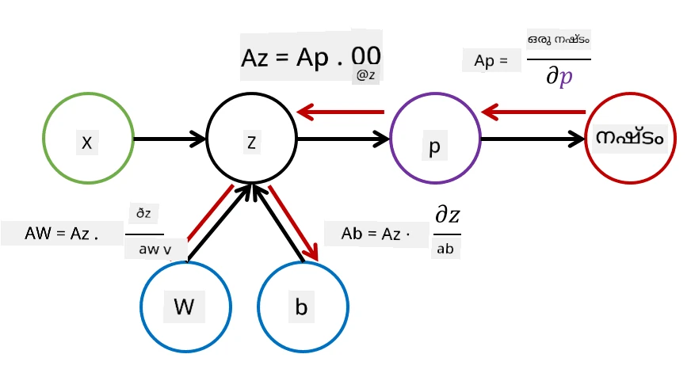

# ന്യൂറൽ നെറ്റ്വർക്കുകളിലേക്ക് പരിചയം. മൾട്ടി-ലെയർഡ് പേഴ്സെപ്ട്രോൺ

മുൻവകുപ്പിൽ, നിങ്ങൾ ഏറ്റവും ലളിതമായ ന്യൂറൽ നെറ്റ്വർക്ക് മോഡൽ - ഒറ്റ ലെയർ പേഴ്സെപ്ട്രോൺ, ഒരു ലീനിയർ രണ്ട്-ക്ലാസ് ക്ലാസിഫിക്കേഷൻ മോഡൽ - പഠിച്ചു.

ഈ വകുപ്പിൽ, നാം ഈ മോഡൽ കൂടുതൽ ഫ്ലെക്സിബിൾ ഫ്രെയിംവർക്കിലേക്ക് വികസിപ്പിക്കും, ഇത് നമുക്ക് അനുവദിക്കും:

* രണ്ട്-ക്ലാസ് കൂടാതെ **മൾട്ടി-ക്ലാസ് ക്ലാസിഫിക്കേഷൻ** നടത്താൻ
* ക്ലാസിഫിക്കേഷനോടൊപ്പം **റെഗ്രഷൻ പ്രശ്നങ്ങൾ** പരിഹരിക്കാൻ
* ലീനിയർ ആയി വേർതിരിക്കാൻ കഴിയാത്ത ക്ലാസുകൾ വേർതിരിക്കാൻ

നാം പൈത്തണിൽ നമ്മുടെ സ്വന്തം മോഡുലാർ ഫ്രെയിംവർക്ക് വികസിപ്പിക്കുകയും വ്യത്യസ്ത ന്യൂറൽ നെറ്റ്വർക്ക് ആർക്കിടെക്ചറുകൾ നിർമ്മിക്കാൻ സാധിക്കുമെന്നു കാണിക്കും.

## [പ്രീ-ലെക്ചർ ക്വിസ്](https://ff-quizzes.netlify.app/en/ai/quiz/7)

## മെഷീൻ ലേണിങ്ങിന്റെ ഫോർമലൈസേഷൻ

മെഷീൻ ലേണിങ്ങ് പ്രശ്നം ഫോർമലൈസ് ചെയ്യുന്നതിൽ നിന്ന് തുടങ്ങാം. പരിശീലന ഡാറ്റാസെറ്റ് **X** ലേബലുകളോടുകൂടി **Y** ഉണ്ടെന്ന് കരുതുക, ഏറ്റവും കൃത്യമായ പ്രവചനങ്ങൾ നടത്താൻ ഒരു മോഡൽ *f* നിർമ്മിക്കണം. പ്രവചനങ്ങളുടെ ഗുണമേന്മ **ലോസ് ഫംഗ്ഷൻ** &lagran; ഉപയോഗിച്ച് അളക്കുന്നു. താഴെ പറയുന്ന ലോസ് ഫംഗ്ഷനുകൾ സാധാരണ ഉപയോഗിക്കുന്നു:

* റെഗ്രഷൻ പ്രശ്നത്തിന്, ഒരു സംഖ്യ പ്രവചിക്കേണ്ടപ്പോൾ, **അബ്സല്യൂട്ട് എറർ** &sum;i|f(x(i))-y(i)| അല്ലെങ്കിൽ **സ്ക്വയർഡ് എറർ** &sum;i(f(x(i))-y(i))2 ഉപയോഗിക്കാം
* ക്ലാസിഫിക്കേഷനിൽ, **0-1 ലോസ്** (മൂല്യത്തിൽ മോഡലിന്റെ **അക്കുറസി** പോലെയാണ്), അല്ലെങ്കിൽ **ലോജിസ്റ്റിക് ലോസ്** ഉപയോഗിക്കുന്നു.

ഒറ്റ ലെയർ പേഴ്സെപ്ട്രോണിൽ, *f* ഫംഗ്ഷൻ ഒരു ലീനിയർ ഫംഗ്ഷനായി നിർവചിച്ചിരുന്നു: *f(x)=wx+b* (ഇവിടെ *w* ഭാര മാട്രിക്സ്, *x* ഇൻപുട്ട് ഫീച്ചറുകളുടെ വെക്ടർ, *b* ബയാസ് വെക്ടർ). വ്യത്യസ്ത ന്യൂറൽ നെറ്റ്വർക്ക് ആർക്കിടെക്ചറുകൾക്കായി ഈ ഫംഗ്ഷൻ കൂടുതൽ സങ്കീർണ്ണമായ രൂപം സ്വീകരിക്കാം.

> ക്ലാസിഫിക്കേഷനിൽ, നെറ്റ്വർക്ക് ഔട്ട്പുട്ടായി അനുയോജ്യമായ ക്ലാസുകളുടെ പ്രൊബബിലിറ്റികൾ ലഭിക്കുന്നത് ആഗ്രഹകരമാണ്. ഏതെങ്കിലും സംഖ്യകളെ പ്രൊബബിലിറ്റികളായി മാറ്റാൻ (ഉദാ: ഔട്ട്പുട്ട് നോർമലൈസ് ചെയ്യാൻ), സാധാരണ **softmax** ഫംഗ്ഷൻ &sigma; ഉപയോഗിക്കുന്നു, അതിനാൽ *f* ഫംഗ്ഷൻ *f(x)=&sigma;(wx+b)* ആകുന്നു.

മുകളിൽ *f* നിർവചിക്കുമ്പോൾ, *w*യും *b*യും ചേർന്ന് **പാരാമീറ്ററുകൾ** &theta;=⟨*w,b*⟩ എന്ന് വിളിക്കുന്നു. ഡാറ്റാസെറ്റ് ⟨**X**,**Y**⟩ നൽകിയാൽ, പാരാമീറ്ററുകളുടെ ഫംഗ്ഷനായി മുഴുവൻ ഡാറ്റാസെറ്റിലെ മൊത്തം പിശക് കണക്കാക്കാം.

> ✅ **ന്യൂറൽ നെറ്റ്വർക്ക് പരിശീലനത്തിന്റെ ലക്ഷ്യം പാരാമീറ്ററുകൾ &theta; മാറ്റി പിശക് കുറയ്ക്കുകയാണ്**

## ഗ്രേഡിയന്റ് ഡിസെന്റ് ഒപ്റ്റിമൈസേഷൻ

ഫംഗ്ഷൻ ഒപ്റ്റിമൈസേഷനിൽ പ്രശസ്തമായ ഒരു രീതി **ഗ്രേഡിയന്റ് ഡിസെന്റ്** ആണ്. ആശയം: പാരാമീറ്ററുകളെ സംബന്ധിച്ചുള്ള ലോസ് ഫംഗ്ഷന്റെ ഡെരിവേറ്റീവ് (മൾട്ടി-ഡൈമെൻഷണൽ കേസിൽ **ഗ്രേഡിയന്റ്**) കണക്കാക്കി, പിശക് കുറയുന്ന വിധത്തിൽ പാരാമീറ്ററുകൾ മാറ്റുക. ഇത് ഫോർമലൈസ് ചെയ്യാം:

* പാരാമീറ്ററുകൾ യാദൃച്ഛിക മൂല്യങ്ങളാൽ ആരംഭിക്കുക w(0), b(0)
* താഴെ പറയുന്ന ഘട്ടം പലതവണ ആവർത്തിക്കുക:
    - w(i+1) = w(i)-&eta;&part;&lagran;/&part;w
    - b(i+1) = b(i)-&eta;&part;&lagran;/&part;b

പരിശീലന സമയത്ത്, ഒപ്റ്റിമൈസേഷൻ ഘട്ടങ്ങൾ മുഴുവൻ ഡാറ്റാസെറ്റിനെ പരിഗണിച്ച് കണക്കാക്കണം (ലോസ് എല്ലാ പരിശീലന സാമ്പിളുകളുടെയും സംഖ്യയായി കണക്കാക്കപ്പെടുന്നു). എന്നാൽ യാഥാർത്ഥ്യത്തിൽ, ഡാറ്റാസെറ്റിന്റെ ചെറിയ ഭാഗങ്ങൾ **മിനിബാച്ചുകൾ** എടുത്ത്, അവയുടെ അടിസ്ഥാനത്തിൽ ഗ്രേഡിയന്റുകൾ കണക്കാക്കുന്നു. ഓരോ തവണയും ഭാഗം യാദൃച്ഛികമായി തിരഞ്ഞെടുക്കപ്പെടുന്നതിനാൽ, ഈ രീതി **സ്റ്റോക്കാസ്റ്റിക് ഗ്രേഡിയന്റ് ഡിസെന്റ്** (SGD) എന്ന് വിളിക്കുന്നു.

## മൾട്ടി-ലെയർഡ് പേഴ്സെപ്ട്രോണുകളും ബാക്ക്‌പ്രൊപ്പഗേഷൻ

ഒറ്റ ലെയർ നെറ്റ്വർക്ക്, മുകളിൽ കാണിച്ചതുപോലെ, ലീനിയർ ആയി വേർതിരിക്കാൻ കഴിയുന്ന ക്ലാസുകൾ ക്ലാസിഫൈ ചെയ്യാൻ കഴിയും. കൂടുതൽ സമൃദ്ധമായ മോഡൽ നിർമ്മിക്കാൻ, നാം നെറ്റ്വർക്ക് ലെയറുകൾ ചേർക്കാം. ഗണിതപരമായി, ഫംഗ്ഷൻ *f* കൂടുതൽ സങ്കീർണ്ണമായ രൂപം സ്വീകരിക്കുകയും പല ഘട്ടങ്ങളായി കണക്കാക്കപ്പെടുകയും ചെയ്യും:
* z1=w1x+b1
* z2=w2&alpha;(z1)+b2
* f = &sigma;(z2)

ഇവിടെ, &alpha; ഒരു **നോൺ-ലീനിയർ ആക്ടിവേഷൻ ഫംഗ്ഷൻ**, &sigma; softmax ഫംഗ്ഷൻ, പാരാമീറ്ററുകൾ &theta;=<*w1,b1,w2,b2*>.

ഗ്രേഡിയന്റ് ഡിസെന്റ് ആൽഗോരിതം അതേപോലെ തുടരും, പക്ഷേ ഗ്രേഡിയന്റുകൾ കണക്കാക്കുന്നത് കൂടുതൽ ബുദ്ധിമുട്ടുള്ളതാണ്. ചെയിൻ ഡിഫറൻഷ്യേഷൻ നിയമം ഉപയോഗിച്ച് ഡെരിവേറ്റീവുകൾ കണക്കാക്കാം:

* &part;&lagran;/&part;w2 = (&part;&lagran;/&part;&sigma;)(&part;&sigma;/&part;z2)(&part;z2/&part;w2)
* &part;&lagran;/&part;w1 = (&part;&lagran;/&part;&sigma;)(&part;&sigma;/&part;z2)(&part;z2/&part;&alpha;)(&part;&alpha;/&part;z1)(&part;z1/&part;w1)

> ✅ പാരാമീറ്ററുകളെ സംബന്ധിച്ചുള്ള ലോസ് ഫംഗ്ഷന്റെ ഡെരിവേറ്റീവുകൾ കണക്കാക്കാൻ ചെയിൻ ഡിഫറൻഷ്യേഷൻ നിയമം ഉപയോഗിക്കുന്നു.

ഈ എല്ലാ വ്യഞ്ജനങ്ങളുടെയും ഇടത്തരം ഭാഗം ഒരുപോലെയാണ്, അതിനാൽ ലോസ് ഫംഗ്ഷനിൽ നിന്ന് "പിന്നിലേക്ക്" കണക്കുകൂട്ടി ഡെരിവേറ്റീവുകൾ എളുപ്പത്തിൽ കണ്ടെത്താം. അതുകൊണ്ട് മൾട്ടി-ലെയർഡ് പേഴ്സെപ്ട്രോൺ പരിശീലന രീതി **ബാക്ക്‌പ്രൊപ്പഗേഷൻ** അല്ലെങ്കിൽ 'ബാക്ക്‌പ്രോപ്പ്' എന്ന് വിളിക്കുന്നു.

> TODO: ചിത്രം സൈറ്റേഷൻ

> ✅ ബാക്ക്‌പ്രോപ്പ് നമുക്ക് നോട്ട്ബുക്കിൽ കൂടുതൽ വിശദമായി പഠിക്കാം.

## സമാപനം

ഈ പാഠത്തിൽ, നാം നമ്മുടെ സ്വന്തം ന്യൂറൽ നെറ്റ്വർക്ക് ലൈബ്രറി നിർമ്മിച്ചു, അത് ഉപയോഗിച്ച് ലളിതമായ രണ്ട്-ഡൈമെൻഷണൽ ക്ലാസിഫിക്കേഷൻ ടാസ്ക് ചെയ്തു.

## 🚀 ചലഞ്ച്

സഹായക നോട്ട്ബുക്കിൽ, നിങ്ങൾ മൾട്ടി-ലെയർഡ് പേഴ്സെപ്ട്രോണുകൾ നിർമ്മിക്കുകയും പരിശീലിപ്പിക്കുകയും ചെയ്യാനുള്ള നിങ്ങളുടെ സ്വന്തം ഫ്രെയിംവർക്ക് നടപ്പിലാക്കും. ആധുനിക ന്യൂറൽ നെറ്റ്വർക്കുകൾ എങ്ങനെ പ്രവർത്തിക്കുന്നുവെന്ന് വിശദമായി കാണാൻ കഴിയും.

[OwnFramework](OwnFramework.ipynb) നോട്ട്ബുക്ക് തുറന്ന് അതിലൂടെ പ്രവർത്തിക്കുക.

## [പോസ്റ്റ്-ലെക്ചർ ക്വിസ്](https://ff-quizzes.netlify.app/en/ai/quiz/8)

## അവലോകനം & സ്വയം പഠനം

ബാക്ക്‌പ്രൊപ്പഗേഷൻ AI, ML-ൽ സാധാരണ ഉപയോഗിക്കുന്ന ആൽഗോരിതമാണ്, [കൂടുതൽ വിശദമായി](https://wikipedia.org/wiki/Backpropagation) പഠിക്കാൻ ഉചിതമാണ്.

## [അസൈൻമെന്റ്](lab/README.md)

ഈ ലാബിൽ, നിങ്ങൾ ഈ പാഠത്തിൽ നിർമ്മിച്ച ഫ്രെയിംവർക്ക് ഉപയോഗിച്ച് MNIST ഹാൻഡ്‌റിറ്റൻ ഡിജിറ്റ് ക്ലാസിഫിക്കേഷൻ പരിഹരിക്കണം.

* [നിർദ്ദേശങ്ങൾ](lab/README.md)
* [നോട്ട്ബുക്ക്](lab/MyFW_MNIST.ipynb)

---

<!-- CO-OP TRANSLATOR DISCLAIMER START -->
**അസൂയാ**:  
ഈ രേഖ AI വിവർത്തന സേവനം [Co-op Translator](https://github.com/Azure/co-op-translator) ഉപയോഗിച്ച് വിവർത്തനം ചെയ്തതാണ്. നാം കൃത്യതയ്ക്ക് ശ്രമിച്ചിട്ടുണ്ടെങ്കിലും, സ്വയം പ്രവർത്തിക്കുന്ന വിവർത്തനങ്ങളിൽ പിശകുകൾ അല്ലെങ്കിൽ തെറ്റുകൾ ഉണ്ടാകാമെന്ന് ദയവായി ശ്രദ്ധിക്കുക. അതിന്റെ മാതൃഭാഷയിലുള്ള യഥാർത്ഥ രേഖ അധികാരപരമായ ഉറവിടമായി കണക്കാക്കപ്പെടണം. നിർണായക വിവരങ്ങൾക്ക്, പ്രൊഫഷണൽ മനുഷ്യ വിവർത്തനം ശുപാർശ ചെയ്യപ്പെടുന്നു. ഈ വിവർത്തനം ഉപയോഗിക്കുന്നതിൽ നിന്നുണ്ടാകുന്ന ഏതെങ്കിലും തെറ്റിദ്ധാരണകൾക്കോ തെറ്റായ വ്യാഖ്യാനങ്ങൾക്കോ ഞങ്ങൾ ഉത്തരവാദികളല്ല.
<!-- CO-OP TRANSLATOR DISCLAIMER END -->