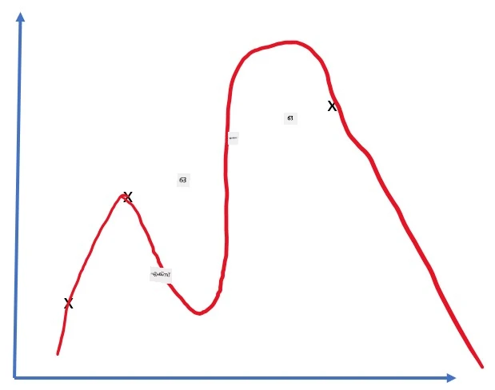
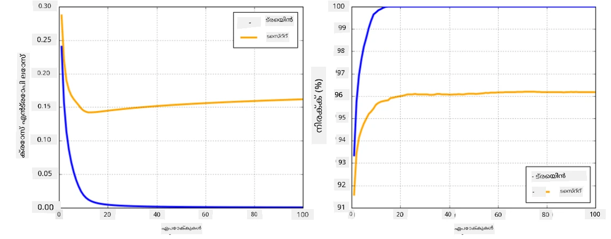

# ന്യൂറൽ നെറ്റ്‌വർക്ക് ഫ്രെയിംവർക്കുകൾ

നാം ഇതിനകം പഠിച്ചതുപോലെ, ന്യൂറൽ നെറ്റ്‌വർക്ക് ഫലപ്രദമായി പരിശീലിപ്പിക്കാൻ രണ്ട് കാര്യങ്ങൾ ചെയ്യേണ്ടതുണ്ട്:

* ടെൻസറുകളിൽ പ്രവർത്തിക്കുക, ഉദാ: ഗുണനം, കൂട്ടൽ, സിഗ്മോയിഡ് അല്ലെങ്കിൽ സോഫ്റ്റ്‌മാക്സ് പോലുള്ള ചില ഫംഗ്ഷനുകൾ കണക്കാക്കുക
* ഗ്രേഡിയന്റുകൾ കണക്കാക്കുക, ഗ്രേഡിയന്റ് ഡിസെന്റ് ഓപ്റ്റിമൈസേഷൻ നടത്താൻ

## [പ്രീ-ലെക്ചർ ക്വിസ്](https://ff-quizzes.netlify.app/en/ai/quiz/9)

`numpy` ലൈബ്രറി ആദ്യ ഭാഗം ചെയ്യാൻ കഴിയും, പക്ഷേ ഗ്രേഡിയന്റുകൾ കണക്കാക്കാൻ ഒരു സംവിധാനം വേണം. [നമ്മുടെ ഫ്രെയിംവർക്കിൽ](../04-OwnFramework/OwnFramework.ipynb) മുമ്പത്തെ സെക്ഷനിൽ വികസിപ്പിച്ചപ്പോൾ, `backward` മെത്തഡിനുള്ളിൽ എല്ലാ ഡെറിവേറ്റീവ് ഫംഗ്ഷനുകളും കൈയോടെ പ്രോഗ്രാം ചെയ്യേണ്ടി വന്നു, അത് ബാക്ക്‌പ്രൊപ്പഗേഷൻ ചെയ്യുന്നു.理想മായി, ഒരു ഫ്രെയിംവർക്ക് നമുക്ക് നിർവചിക്കാവുന്ന *ഏതെങ്കിലും പ്രകടനത്തിന്റെ* ഗ്രേഡിയന്റുകൾ കണക്കാക്കാനുള്ള അവസരം നൽകണം.

മറ്റൊരു പ്രധാന കാര്യം GPU പോലുള്ള പ്രത്യേക കംപ്യൂട്ട് യൂണിറ്റുകളിൽ കണക്കുകൾ നടത്താൻ കഴിയണം, ഉദാ: [TPU](https://en.wikipedia.org/wiki/Tensor_Processing_Unit). ഡീപ്പ് ന്യൂറൽ നെറ്റ്‌വർക്ക് പരിശീലനം *വളരെ* കണക്കുകൾ ആവശ്യപ്പെടുന്നു, അതിനാൽ GPU-കളിൽ കണക്കുകൾ പാരലലൈസ് ചെയ്യാൻ കഴിയുന്നത് വളരെ പ്രധാനമാണ്.

> ✅ 'പാരലലൈസ്' എന്ന പദം കണക്കുകൾ പല ഉപകരണങ്ങളിലായി വിതരണം ചെയ്യുക എന്നർത്ഥം.

ഇപ്പോൾ ഏറ്റവും ജനപ്രിയമായ രണ്ട് ന്യൂറൽ ഫ്രെയിംവർക്കുകൾ: [TensorFlow](http://TensorFlow.org)യും [PyTorch](https://pytorch.org/)ഉം. ഇരുവരും CPU-യിലും GPU-യിലും ടെൻസറുകളുമായി പ്രവർത്തിക്കാൻ ലോ-ലെവൽ API നൽകുന്നു. ലോ-ലെവൽ API-യുടെ മുകളിൽ, ഉയർന്ന-ലെവൽ API-കളും ഉണ്ട്, അവയാണ് [Keras](https://keras.io/)യും [PyTorch Lightning](https://pytorchlightning.ai/)യും.

ലോ-ലെവൽ API | [TensorFlow](http://TensorFlow.org) | [PyTorch](https://pytorch.org/)
--------------|-------------------------------------|--------------------------------
ഉയർന്ന-ലെവൽ API| [Keras](https://keras.io/) | [PyTorch Lightning](https://pytorchlightning.ai/)

**ലോ-ലെവൽ APIകൾ** ഇരുവിധ ഫ്രെയിംവർക്കുകളിലും **കമ്പ്യൂട്ടേഷണൽ ഗ്രാഫുകൾ** നിർമ്മിക്കാൻ അനുവദിക്കുന്നു. ഈ ഗ്രാഫ് നൽകിയ ഇൻപുട്ട് പാരാമീറ്ററുകളുമായി ഔട്ട്പുട്ട് (സാധാരണ ലോസ്സ് ഫംഗ്ഷൻ) എങ്ങനെ കണക്കാക്കാമെന്ന് നിർവചിക്കുന്നു, GPU ലഭ്യമെങ്കിൽ അവിടെ കണക്കാക്കാൻ പുഷ് ചെയ്യാം. ഈ കമ്പ്യൂട്ടേഷണൽ ഗ്രാഫ് വ്യത്യാസപ്പെടുത്താനും ഗ്രേഡിയന്റുകൾ കണക്കാക്കാനും ഫംഗ്ഷനുകൾ ഉണ്ട്, അവ മോഡൽ പാരാമീറ്ററുകൾ ഓപ്റ്റിമൈസ് ചെയ്യാൻ ഉപയോഗിക്കാം.

**ഉയർന്ന-ലെവൽ APIകൾ** ന്യൂറൽ നെറ്റ്‌വർക്ക്‌കളെ **ലെയറുകളുടെ ശ്രേണി** ആയി പരിഗണിച്ച്, പല ന്യൂറൽ നെറ്റ്‌വർക്ക് നിർമ്മാണം വളരെ എളുപ്പമാക്കുന്നു. മോഡൽ പരിശീലിപ്പിക്കാൻ സാധാരണയായി ഡാറ്റ തയ്യാറാക്കി `fit` ഫംഗ്ഷൻ വിളിക്കണം.

ഉയർന്ന-ലെവൽ API സാധാരണ ന്യൂറൽ നെറ്റ്‌വർക്ക്‌കൾ വേഗത്തിൽ നിർമ്മിക്കാൻ സഹായിക്കുന്നു, പല വിശദാംശങ്ങൾക്കായി ആശങ്കപ്പെടേണ്ടതില്ല. അതേസമയം, ലോ-ലെവൽ API പരിശീലന പ്രക്രിയയിൽ കൂടുതൽ നിയന്ത്രണം നൽകുന്നു, അതുകൊണ്ട് ഗവേഷണത്തിൽ പുതിയ ന്യൂറൽ നെറ്റ്‌വർക്ക് ആർക്കിടെക്ചറുകളുമായി പ്രവർത്തിക്കുമ്പോൾ ഇത് ഉപയോഗിക്കുന്നു.

രണ്ടു APIകളും ചേർന്ന് ഉപയോഗിക്കാമെന്ന് മനസ്സിലാക്കുന്നത് പ്രധാനമാണ്, ഉദാ: ലോ-ലെവൽ API ഉപയോഗിച്ച് നിങ്ങളുടെ സ്വന്തം ലെയർ ആർക്കിടെക്ചർ വികസിപ്പിച്ച്, അത് ഉയർന്ന-ലെവൽ API ഉപയോഗിച്ച് നിർമ്മിച്ച വലിയ നെറ്റ്‌വർക്കിൽ ഉൾപ്പെടുത്താം. അല്ലെങ്കിൽ, ഉയർന്ന-ലെവൽ API ഉപയോഗിച്ച് ലെയറുകളുടെ ശ്രേണി നിർവചിച്ച്, നിങ്ങളുടെ സ്വന്തം ലോ-ലെവൽ ട്രെയിനിംഗ് ലൂപ്പ് ഉപയോഗിച്ച് ഓപ്റ്റിമൈസേഷൻ നടത്താം. ഇരുവരും അടിസ്ഥാന ആശയങ്ങൾ പങ്കുവെക്കുന്നു, കൂടെ നല്ല രീതിയിൽ പ്രവർത്തിക്കാൻ രൂപകൽപ്പന ചെയ്തിരിക്കുന്നു.

## പഠനം

ഈ കോഴ്സിൽ, PyTorchക്കും TensorFlowക്കും വേണ്ടിയുള്ള ഉള്ളടക്കം കൂടുതലായി നൽകുന്നു. നിങ്ങൾക്ക് ഇഷ്ടമുള്ള ഫ്രെയിംവർക്ക് തിരഞ്ഞെടുക്കാം, അതിന്റെ നോട്ട്‌ബുക്കുകൾ മാത്രം പഠിക്കാം. ഏത് ഫ്രെയിംവർക്ക് തിരഞ്ഞെടുക്കണമെന്ന് ഉറപ്പില്ലെങ്കിൽ, ഇന്റർനെറ്റിൽ **PyTorch vs. TensorFlow** സംബന്ധിച്ച ചർച്ചകൾ വായിക്കുക. രണ്ടും നോക്കി മനസ്സിലാക്കാനും കഴിയും.

സാധ്യമായിടത്ത്, എളുപ്പത്തിനായി ഉയർന്ന-ലെവൽ APIകൾ ഉപയോഗിക്കും. എന്നാൽ, ന്യൂറൽ നെറ്റ്‌വർക്ക് അടിസ്ഥാനത്തിൽ എങ്ങനെ പ്രവർത്തിക്കുന്നുവെന്ന് മനസ്സിലാക്കുന്നത് പ്രധാനമാണെന്ന് ഞങ്ങൾ വിശ്വസിക്കുന്നു, അതിനാൽ തുടക്കത്തിൽ ലോ-ലെവൽ APIയും ടെൻസറുകളും ഉപയോഗിച്ച് തുടങ്ങുന്നു. എന്നാൽ വേഗത്തിൽ തുടങ്ങാൻ ആഗ്രഹിക്കുന്നവർക്ക് ഈ വിശദാംശങ്ങൾ ഒഴിവാക്കി ഉയർന്ന-ലെവൽ API നോട്ട്‌ബുക്കുകളിലേക്ക് നേരിട്ട് പോകാം.

## ✍️ അഭ്യാസങ്ങൾ: ഫ്രെയിംവർക്കുകൾ

താഴെ കൊടുത്ത നോട്ട്‌ബുക്കുകളിൽ പഠനം തുടരുക:

ലോ-ലെവൽ API | [TensorFlow+Keras നോട്ട്‌ബുക്ക്](IntroKerasTF.ipynb) | [PyTorch](IntroPyTorch.ipynb)
--------------|-------------------------------------|--------------------------------
ഉയർന്ന-ലെവൽ API| [Keras](IntroKeras.ipynb) | *PyTorch Lightning*

ഫ്രെയിംവർക്കുകൾ നന്നായി പഠിച്ച ശേഷം, ഓവർഫിറ്റിങ്ങിന്റെ ആശയം വീണ്ടും പരിശോധിക്കാം.

# ഓവർഫിറ്റിംഗ്

ഓവർഫിറ്റിംഗ് മെഷീൻ ലേണിങ്ങിൽ വളരെ പ്രധാനപ്പെട്ട ആശയമാണ്, ശരിയായി മനസ്സിലാക്കുന്നത് അത്യന്താപേക്ഷിതമാണ്!

5 പോയിന്റുകൾ (ഗ്രാഫുകളിൽ `x` ആയി പ്രതിനിധീകരിച്ചിരിക്കുന്നു) ഏകീകരിക്കുന്ന പ്രശ്നം പരിഗണിക്കൂ:

 | 
-------------------------|--------------------------
**രേഖീയ മോഡൽ, 2 പാരാമീറ്ററുകൾ** | **അരേഖീയ മോഡൽ, 7 പാരാമീറ്ററുകൾ**
പരിശീലന പിശക് = 5.3 | പരിശീലന പിശക് = 0
വാലിഡേഷൻ പിശക് = 5.1 | വാലിഡേഷൻ പിശക് = 20

* ഇടത്തരം, നല്ല നേരിയ രേഖ ഏകീകരണം കാണാം. പാരാമീറ്ററുകളുടെ എണ്ണം യോജിച്ചതിനാൽ, മോഡൽ പോയിന്റുകളുടെ വിതരണത്തിന്റെ ആശയം ശരിയായി പിടിച്ചെടുത്തു.
* വലത്തരം, മോഡൽ വളരെ ശക്തമാണ്. 5 പോയിന്റുകൾ മാത്രമുള്ളപ്പോൾ 7 പാരാമീറ്ററുള്ള മോഡൽ എല്ലാ പോയിന്റുകളും കടക്കാൻ ക്രമീകരിക്കാം, അതിനാൽ പരിശീലന പിശക് 0 ആകുന്നു. എന്നാൽ ഇത് ഡാറ്റയുടെ ശരിയായ പാറ്റേൺ മനസ്സിലാക്കാൻ തടസ്സമാകുന്നു, അതുകൊണ്ട് വാലിഡേഷൻ പിശക് വളരെ ഉയർന്നതാണ്.

മോഡലിന്റെ സമൃദ്ധിയും (പാരാമീറ്ററുകളുടെ എണ്ണം) പരിശീലന സാമ്പിളുകളുടെ എണ്ണവും ശരിയായ ബാലൻസ് കണ്ടെത്തുന്നത് വളരെ പ്രധാനമാണ്.

## ഓവർഫിറ്റിംഗ് സംഭവിക്കുന്ന കാരണങ്ങൾ

  * പരിശീലന ഡാറ്റ കുറവായിരിക്കുക
  * മോഡൽ വളരെ ശക്തമായിരിക്കുക
  * ഇൻപുട്ട് ഡാറ്റയിൽ ശബ്ദം (നോയിസ്) കൂടുതലായിരിക്കുക

## ഓവർഫിറ്റിംഗ് കണ്ടെത്താനുള്ള മാർഗങ്ങൾ

മുകളിൽ കാണിച്ച ഗ്രാഫിൽ നിന്ന്, ഓവർഫിറ്റിംഗ് വളരെ കുറഞ്ഞ പരിശീലന പിശക്, കൂടിയ വാലിഡേഷൻ പിശക് എന്നിവയാൽ കണ്ടെത്താം. സാധാരണയായി പരിശീലന സമയത്ത് പരിശീലനവും വാലിഡേഷനും പിശകുകൾ കുറയാൻ തുടങ്ങും, പിന്നീട് വാലിഡേഷൻ പിശക് കുറയുന്നത് നിർത്തി ഉയരാൻ തുടങ്ങും. ഇത് ഓവർഫിറ്റിംഗിന്റെ സൂചനയാണ്, ഈ ഘട്ടത്തിൽ പരിശീലനം നിർത്തേണ്ടതായിരിക്കും (അല്ലെങ്കിൽ മോഡലിന്റെ സ്നാപ്ഷോട്ട് എടുക്കാം).

## ഓവർഫിറ്റിംഗ് തടയാനുള്ള മാർഗങ്ങൾ

ഓവർഫിറ്റിംഗ് സംഭവിക്കുന്നതായി കാണുമ്പോൾ, താഴെ പറയുന്നവയിൽ ഒന്നോ അതിലധികമോ ചെയ്യാം:

 * പരിശീലന ഡാറ്റയുടെ അളവ് വർദ്ധിപ്പിക്കുക
 * മോഡലിന്റെ സങ്കീർണ്ണത കുറയ്ക്കുക
 * [റഗുലറൈസേഷൻ സാങ്കേതികവിദ്യ](../../4-ComputerVision/08-TransferLearning/TrainingTricks.md)കൾ ഉപയോഗിക്കുക, ഉദാ: [ഡ്രോപ്പൗട്ട്](../../4-ComputerVision/08-TransferLearning/TrainingTricks.md#Dropout), പിന്നീട് പരിഗണിക്കും.

## ഓവർഫിറ്റിംഗ്, ബയാസ്-വേറിയൻസ് ട്രേഡ്-ഓഫ്

ഓവർഫിറ്റിംഗ് സ്റ്റാറ്റിസ്റ്റിക്സിലെ ഒരു പൊതുവായ പ്രശ്നമായ [ബയാസ്-വേറിയൻസ് ട്രേഡ്-ഓഫ്](https://en.wikipedia.org/wiki/Bias%E2%80%93variance_tradeoff)യുടെ ഒരു ഉദാഹരണമാണ്. മോഡലിലെ പിശകുകളുടെ സ്രോതസ്സുകൾ പരിഗണിക്കുമ്പോൾ, രണ്ട് തരത്തിലുള്ള പിശകുകൾ കാണാം:

* **ബയാസ് പിശകുകൾ**: പരിശീലന ഡാറ്റയുടെ ബന്ധം മോഡൽ ശരിയായി പിടിച്ചെടുക്കാൻ കഴിയാത്തതിനാൽ ഉണ്ടാകുന്നു. ഇത് മോഡൽ ശക്തിയില്ലാത്തതിനാലാകാം (**അണ്ടർഫിറ്റിംഗ്**).
* **വേറിയൻസ് പിശകുകൾ**: മോഡൽ ഇൻപുട്ടിലെ ശബ്ദം പകരം അർത്ഥമുള്ള ബന്ധം പകരാൻ ശ്രമിക്കുന്നതിനാൽ ഉണ്ടാകുന്നു (**ഓവർഫിറ്റിംഗ്**).

പരിശീലന സമയത്ത്, ബയാസ് പിശക് കുറയുകയും (മോഡൽ ഡാറ്റ ഏകീകരിക്കാൻ പഠിക്കുന്നു), വേറിയൻസ് പിശക് ഉയരുകയും ചെയ്യും. ഓവർഫിറ്റിംഗ് തടയാൻ പരിശീലനം നിർത്തുന്നത് (മാനുവലായി അല്ലെങ്കിൽ റഗുലറൈസേഷൻ കൊണ്ടു) പ്രധാനമാണ്.

## സംക്ഷേപം

ഈ പാഠത്തിൽ, TensorFlow, PyTorch എന്നീ രണ്ട് ജനപ്രിയ AI ഫ്രെയിംവർക്കുകളുടെ വിവിധ APIകളുടെ വ്യത്യാസങ്ങൾ പഠിച്ചു. കൂടാതെ, വളരെ പ്രധാനപ്പെട്ട ഒരു വിഷയം, ഓവർഫിറ്റിംഗ്, മനസ്സിലാക്കി.

## 🚀 ചലഞ്ച്

സഹായക നോട്ട്‌ബുക്കുകളിൽ താഴെ 'ടാസ്കുകൾ' കാണാം; നോട്ട്‌ബുക്കുകൾ വഴി പഠനം തുടരുകയും ടാസ്കുകൾ പൂർത്തിയാക്കുകയും ചെയ്യുക.

## [പോസ്റ്റ്-ലെക്ചർ ക്വിസ്](https://ff-quizzes.netlify.app/en/ai/quiz/10)

## അവലോകനം & സ്വയം പഠനം

താഴെ പറയുന്ന വിഷയങ്ങളിൽ കുറച്ച് റിസർച്ച് ചെയ്യുക:

- TensorFlow
- PyTorch
- ഓവർഫിറ്റിംഗ്

താഴെ പറയുന്ന ചോദ്യങ്ങൾ സ്വയം ചോദിക്കുക:

- TensorFlow-നും PyTorch-നും ഇടയിലുള്ള വ്യത്യാസം എന്താണ്?
- ഓവർഫിറ്റിംഗും അണ്ടർഫിറ്റിംഗും തമ്മിലുള്ള വ്യത്യാസം എന്താണ്?

## [അസൈൻമെന്റ്](lab/README.md)

ഈ ലാബിൽ, PyTorch അല്ലെങ്കിൽ TensorFlow ഉപയോഗിച്ച് സിംഗിൾ-ലെയർ, മൾട്ടി-ലെയർ ഫുൾ-കണക്ടഡ് നെറ്റ്‌വർക്ക് ഉപയോഗിച്ച് രണ്ട് ക്ലാസിഫിക്കേഷൻ പ്രശ്നങ്ങൾ പരിഹരിക്കാൻ ആവശ്യപ്പെടുന്നു.

* [നിർദ്ദേശങ്ങൾ](lab/README.md)
* [നോട്ട്‌ബുക്ക്](lab/LabFrameworks.ipynb)

---

<!-- CO-OP TRANSLATOR DISCLAIMER START -->
**അസൂയാ**:  
ഈ രേഖ AI വിവർത്തന സേവനം [Co-op Translator](https://github.com/Azure/co-op-translator) ഉപയോഗിച്ച് വിവർത്തനം ചെയ്തതാണ്. നാം കൃത്യതയ്ക്ക് ശ്രമിച്ചിട്ടുണ്ടെങ്കിലും, സ്വയം പ്രവർത്തിക്കുന്ന വിവർത്തനങ്ങളിൽ പിശകുകൾ അല്ലെങ്കിൽ തെറ്റുകൾ ഉണ്ടാകാമെന്ന് ദയവായി ശ്രദ്ധിക്കുക. അതിന്റെ മാതൃഭാഷയിലുള്ള യഥാർത്ഥ രേഖ അധികാരപരമായ ഉറവിടമായി കണക്കാക്കപ്പെടണം. നിർണായക വിവരങ്ങൾക്ക്, പ്രൊഫഷണൽ മനുഷ്യ വിവർത്തനം ശുപാർശ ചെയ്യപ്പെടുന്നു. ഈ വിവർത്തനം ഉപയോഗിക്കുന്നതിൽ നിന്നുണ്ടാകുന്ന ഏതെങ്കിലും തെറ്റിദ്ധാരണകൾക്കോ തെറ്റായ വ്യാഖ്യാനങ്ങൾക്കോ ഞങ്ങൾ ഉത്തരവാദികളല്ല.
<!-- CO-OP TRANSLATOR DISCLAIMER END -->