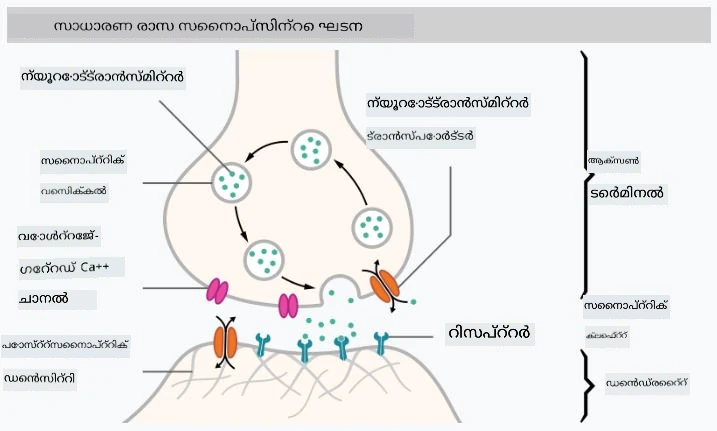
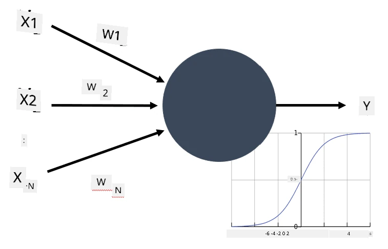
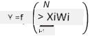

# ന്യൂറൽ നെറ്റ്വർക്കുകളിലേക്ക് പരിചയം

പരിചയത്തിൽ ചർച്ച ചെയ്തതുപോലെ, ബുദ്ധിമുട്ട് നേടാനുള്ള ഒരു മാർഗം **കമ്പ്യൂട്ടർ മോഡൽ** അല്ലെങ്കിൽ **കൃത്രിമ മസ്തിഷ്കം** പരിശീലിപ്പിക്കുകയാണ്. 20-ആം നൂറ്റാണ്ടിന്റെ മധ്യത്തിൽ നിന്ന് ഗവേഷകർ വിവിധ ഗണിത മോഡലുകൾ പരീക്ഷിച്ചു, അടുത്തിടെ ഈ ദിശ വളരെ വിജയകരമായി തെളിഞ്ഞു. മസ്തിഷ്കത്തിന്റെ ഇത്തരം ഗണിത മോഡലുകൾ **ന്യൂറൽ നെറ്റ്വർക്കുകൾ** എന്ന് വിളിക്കുന്നു.

> ചിലപ്പോൾ ന്യൂറൽ നെറ്റ്വർക്കുകൾ *കൃത്രിമ ന്യൂറൽ നെറ്റ്വർക്കുകൾ* (Artificial Neural Networks, ANNs) എന്ന് വിളിക്കുന്നത്, നാം യഥാർത്ഥ ന്യൂറോണുകളുടെ നെറ്റ്വർക്കുകൾ അല്ല, മോഡലുകൾ മാത്രമാണ് പറയുന്നത് എന്ന് സൂചിപ്പിക്കാൻ.

## മെഷീൻ ലേണിംഗ്

ന്യൂറൽ നെറ്റ്വർക്കുകൾ **മെഷീൻ ലേണിംഗ്** എന്ന വലിയ ശാസ്ത്രശാഖയുടെ ഭാഗമാണ്, ഇതിന്റെ ലക്ഷ്യം ഡാറ്റ ഉപയോഗിച്ച് പ്രശ്നങ്ങൾ പരിഹരിക്കാൻ കഴിയുന്ന കമ്പ്യൂട്ടർ മോഡലുകൾ പരിശീലിപ്പിക്കുകയാണ്. മെഷീൻ ലേണിംഗ് കൃത്രിമ ബുദ്ധിമുട്ടിന്റെ വലിയൊരു ഭാഗമാണ്, എന്നാൽ ഈ പാഠ്യപദ്ധതിയിൽ ക്ലാസിക്കൽ മെഷീൻ ലേണിംഗ് ഉൾപ്പെടുത്തിയിട്ടില്ല.

> ക്ലാസിക്കൽ മെഷീൻ ലേണിംഗ് കൂടുതൽ പഠിക്കാൻ, ഞങ്ങളുടെ പ്രത്യേക **[Machine Learning for Beginners](http://github.com/microsoft/ml-for-beginners)** പാഠ്യപദ്ധതി സന്ദർശിക്കുക.

മെഷീൻ ലേണിംഗിൽ, നമുക്ക് ചില ഉദാഹരണങ്ങളുടെ ഡാറ്റാസെറ്റ് **X** ഉണ്ട്, അതിനോടനുബന്ധിച്ച ഔട്ട്പുട്ട് മൂല്യങ്ങൾ **Y** ഉണ്ട് എന്ന് فرضിക്കുന്നു. ഉദാഹരണങ്ങൾ സാധാരണയായി N-ഡൈമെൻഷണൽ വെക്ടറുകളാണ്, അവ **ഫീച്ചറുകൾ** അടങ്ങിയിരിക്കുന്നു, ഔട്ട്പുട്ടുകൾ **ലേബലുകൾ** എന്ന് വിളിക്കുന്നു.

നാം രണ്ട് സാധാരണ മെഷീൻ ലേണിംഗ് പ്രശ്നങ്ങൾ പരിഗണിക്കും:

* **ക്ലാസിഫിക്കേഷൻ**, ഇവിടെ ഒരു ഇൻപുട്ട് വസ്തുവിനെ രണ്ട് അല്ലെങ്കിൽ അതിലധികം ക്ലാസുകളിലേക്കു വേർതിരിക്കണം.
* **റെഗ്രഷൻ**, ഇവിടെ ഓരോ ഇൻപുട്ട് സാമ്പിളിനും ഒരു സംഖ്യാനുപാതം പ്രവചിക്കണം.

> ഇൻപുട്ടുകളും ഔട്ട്പുട്ടുകളും ടെൻസറുകളായി പ്രതിനിധീകരിക്കുമ്പോൾ, ഇൻപുട്ട് ഡാറ്റാസെറ്റ് M×N വലുപ്പമുള്ള ഒരു മാട്രിക്സാണ്, ഇവിടെ M സാമ്പിളുകളുടെ എണ്ണം, N ഫീച്ചറുകളുടെ എണ്ണം. ഔട്ട്പുട്ട് ലേബലുകൾ Y M വലുപ്പമുള്ള വെക്ടറാണ്.

ഈ പാഠ്യപദ്ധതിയിൽ, നാം ന്യൂറൽ നെറ്റ്വർക്കുകൾ മാത്രമേ പരിഗണിക്കൂ.

## ഒരു ന്യൂറോണിന്റെ മോഡൽ

ജീവശാസ്ത്രത്തിൽനിന്ന്, നമ്മുടെ മസ്തിഷ്കം ന്യൂറൽ സെല്ലുകൾ (ന്യൂറോണുകൾ) കൊണ്ട് നിർമ്മിതമാണ്, ഓരോന്നിനും നിരവധി "ഇൻപുട്ടുകൾ" (ഡെൻഡ്രൈറ്റുകൾ) ഉണ്ട്, ഒറ്റ "ഔട്ട്പുട്ട്" (ആക്സൺ) ഉണ്ട്. ഡെൻഡ്രൈറ്റുകളും ആക്സണുകളും വൈദ്യുത സിഗ്നലുകൾ കൈമാറാൻ കഴിയും, അവ തമ്മിലുള്ള ബന്ധങ്ങൾ — സിനാപ്സുകൾ എന്ന് അറിയപ്പെടുന്നു — വൈദ്യുത ചാലകതയുടെ വ്യത്യസ്ത നിലകൾ കാണിക്കുന്നു, ഇത് ന്യൂറോട്രാൻസ്മിറ്ററുകൾ നിയന്ത്രിക്കുന്നു.

 | 
----|----
യഥാർത്ഥ ന്യൂറോൺ *([ചിത്രം](https://en.wikipedia.org/wiki/Synapse#/media/File:SynapseSchematic_lines.svg) വിക്കിപീഡിയയിൽ നിന്നുള്ളത്)* | കൃത്രിമ ന്യൂറോൺ *(ചിത്രം രചയിതാവ്)*

അതിനാൽ, ഒരു ന്യൂറോണിന്റെ ഏറ്റവും ലളിതമായ ഗണിത മോഡൽ X1, ..., XN എന്ന നിരവധി ഇൻപുട്ടുകളും Y എന്ന ഔട്ട്പുട്ടും, W1, ..., WN എന്ന ഭാരങ്ങൾ ഉൾക്കൊള്ളുന്നു. ഔട്ട്പുട്ട് കണക്കാക്കുന്നത്:

ഇവിടെ f ഒരു നോൺ-ലിനിയർ **ആക്ടിവേഷൻ ഫംഗ്ഷൻ** ആണ്.

> ന്യൂറോണിന്റെ പ്രാരംഭ മോഡലുകൾ 1943-ൽ വാറൻ മക്കുലോക്ക്, വാൾട്ടർ പിറ്റ്സ് എഴുതിയ ക്ലാസിക്കൽ പേപ്പർ [A logical calculus of the ideas immanent in nervous activity](https://www.cs.cmu.edu/~./epxing/Class/10715/reading/McCulloch.and.Pitts.pdf) ൽ വിവരിച്ചിട്ടുണ്ട്. ഡൊണാൾഡ് ഹെബ് തന്റെ പുസ്തകം "[The Organization of Behavior: A Neuropsychological Theory](https://books.google.com/books?id=VNetYrB8EBoC)" ൽ ആ നെറ്റ്വർക്കുകൾ എങ്ങനെ പരിശീലിപ്പിക്കാമെന്ന് നിർദ്ദേശിച്ചു.

## ഈ വിഭാഗത്തിൽ

ഈ വിഭാഗത്തിൽ നാം പഠിക്കാനിരിക്കുന്നവ:
* [പേഴ്സെപ്ട്രോൺ](03-Perceptron/README.md), രണ്ട് ക്ലാസ് ക്ലാസിഫിക്കേഷനുള്ള ആദ്യകാല ന്യൂറൽ നെറ്റ്വർക്ക് മോഡലുകളിൽ ഒന്ന്
* [മൾട്ടി-ലെയർഡ് നെറ്റ്വർക്കുകൾ](04-OwnFramework/README.md) കൂടാതെ [സ്വന്തം ഫ്രെയിംവർക്ക് നിർമ്മിക്കുന്ന വിധം](04-OwnFramework/OwnFramework.ipynb) എന്ന നോട്ട്‌ബുക്ക്
* [ന്യൂറൽ നെറ്റ്വർക്ക് ഫ്രെയിംവർക്ക്‌ಗಳು](05-Frameworks/README.md), ഇതിൽ നോട്ട്‌ബുക്കുകൾ: [PyTorch](05-Frameworks/IntroPyTorch.ipynb) & [Keras/Tensorflow](05-Frameworks/IntroKerasTF.ipynb)
* [ഓവർഫിറ്റിംഗ്](../../../../lessons/3-NeuralNetworks/05-Frameworks)

---

<!-- CO-OP TRANSLATOR DISCLAIMER START -->
**അസൂയാ**:  
ഈ രേഖ AI വിവർത്തന സേവനം [Co-op Translator](https://github.com/Azure/co-op-translator) ഉപയോഗിച്ച് വിവർത്തനം ചെയ്തതാണ്. നാം കൃത്യതയ്ക്ക് ശ്രമിച്ചിട്ടുണ്ടെങ്കിലും, സ്വയം പ്രവർത്തിക്കുന്ന വിവർത്തനങ്ങളിൽ പിശകുകൾ അല്ലെങ്കിൽ തെറ്റുകൾ ഉണ്ടാകാമെന്ന് ദയവായി ശ്രദ്ധിക്കുക. അതിന്റെ മാതൃഭാഷയിലുള്ള യഥാർത്ഥ രേഖ അധികാരപരമായ ഉറവിടമായി കണക്കാക്കപ്പെടണം. നിർണായക വിവരങ്ങൾക്ക്, പ്രൊഫഷണൽ മനുഷ്യ വിവർത്തനം ശുപാർശ ചെയ്യപ്പെടുന്നു. ഈ വിവർത്തനം ഉപയോഗിക്കുന്നതിൽ നിന്നുണ്ടാകുന്ന ഏതെങ്കിലും തെറ്റിദ്ധാരണകൾക്കോ തെറ്റായ വ്യാഖ്യാനങ്ങൾക്കോ ഞങ്ങൾ ഉത്തരവാദികളല്ല.
<!-- CO-OP TRANSLATOR DISCLAIMER END -->