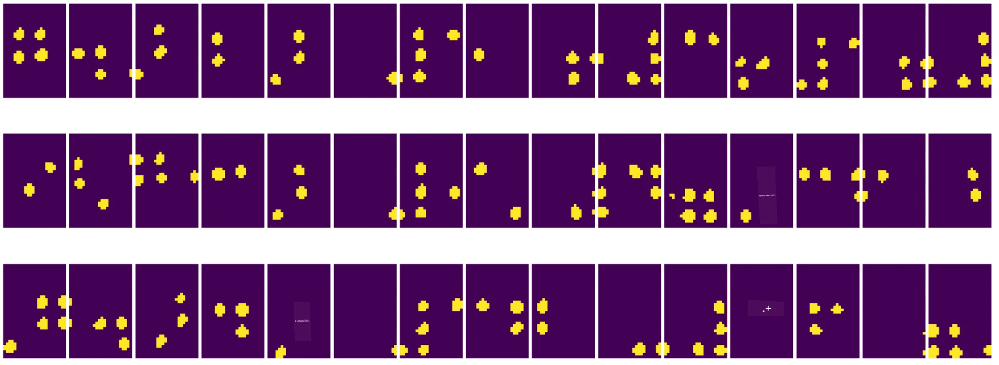
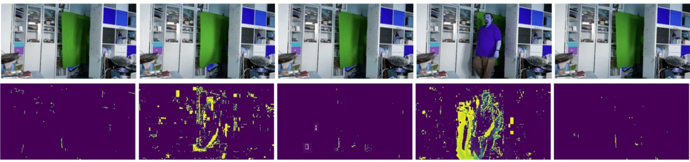

# കമ്പ്യൂട്ടർ വിഷൻ പരിചയം

[കമ്പ്യൂട്ടർ വിഷൻ](https://wikipedia.org/wiki/Computer_vision) എന്നത് ഡിജിറ്റൽ ചിത്രങ്ങളെക്കുറിച്ച് ഉയർന്ന തലത്തിലുള്ള ബോധം കമ്പ്യൂട്ടറുകൾക്ക് നൽകാനുള്ള ശാസ്ത്രശാഖയാണ്. ഇത് വളരെ വ്യാപകമായ ഒരു നിർവചനമാണ്, കാരണം *ബോധം* എന്നത് പലവിധം അർത്ഥമാക്കാം, ഉദാഹരണത്തിന് ഒരു ചിത്രത്തിൽ ഒരു വസ്തു കണ്ടെത്തൽ (**object detection**), സംഭവങ്ങൾ മനസ്സിലാക്കൽ (**event detection**), ചിത്രത്തെ വാചകത്തിൽ വിവരണം ചെയ്യൽ, അല്ലെങ്കിൽ ഒരു ദൃശ്യത്തെ 3D ആയി പുനർനിർമ്മാണം ചെയ്യൽ. മനുഷ്യ ചിത്രങ്ങളുമായി ബന്ധപ്പെട്ട പ്രത്യേക ജോലികളും ഉണ്ട്: പ്രായവും വികാരവും കണക്കാക്കൽ, മുഖം കണ്ടെത്തൽ, തിരിച്ചറിയൽ, 3D പൊസ് എസ്റ്റിമേഷൻ എന്നിവ.

## [പ്രീ-ലെക്ചർ ക്വിസ്](https://ff-quizzes.netlify.app/en/ai/quiz/11)

കമ്പ്യൂട്ടർ വിഷനിലെ ഏറ്റവും ലളിതമായ ജോലികളിൽ ഒന്നാണ് **ചിത്ര വർഗ്ഗീകരണം**.

കമ്പ്യൂട്ടർ വിഷൻ സാധാരണയായി AI-യുടെ ഒരു ശാഖയായി കണക്കാക്കപ്പെടുന്നു. ഇന്നത്തെ കാലത്ത്, കമ്പ്യൂട്ടർ വിഷൻ ജോലികളുടെ ഭൂരിഭാഗവും ന്യൂറൽ നെറ്റ്വർക്കുകൾ ഉപയോഗിച്ച് പരിഹരിക്കുന്നു. ഈ വിഭാഗത്തിൽ, കമ്പ്യൂട്ടർ വിഷനിൽ ഉപയോഗിക്കുന്ന പ്രത്യേക തരം ന്യൂറൽ നെറ്റ്വർക്കുകൾ ആയ [കോൺവല്യൂഷണൽ ന്യൂറൽ നെറ്റ്വർക്കുകൾ](../07-ConvNets/README.md) കുറിച്ച് കൂടുതൽ പഠിക്കും.

എങ്കിലും, ഒരു ചിത്രം ന്യൂറൽ നെറ്റ്വർക്കിലേക്ക് നൽകുന്നതിന് മുമ്പ്, പലപ്പോഴും ചിത്രത്തെ മെച്ചപ്പെടുത്താൻ ചില ആൽഗോരിതമിക് സാങ്കേതിക വിദ്യകൾ ഉപയോഗിക്കുന്നത് ഉചിതമാണ്.

ചിത്ര പ്രോസസ്സിംഗിനായി പല Python ലൈബ്രറികളും ലഭ്യമാണ്:

* **[imageio](https://imageio.readthedocs.io/en/stable/)** വിവിധ ചിത്ര ഫോർമാറ്റുകൾ വായിക്കാനും എഴുതാനും ഉപയോഗിക്കാം. വീഡിയോ ഫ്രെയിമുകൾ ചിത്രങ്ങളായി മാറ്റാൻ സഹായിക്കുന്ന ffmpeg-ഉം ഇത് പിന്തുണയ്ക്കുന്നു.
* **[Pillow](https://pillow.readthedocs.io/en/stable/index.html)** (PIL എന്നും അറിയപ്പെടുന്നു) കൂടുതൽ ശക്തമായ ഒരു ലൈബ്രറിയാണ്, ചിത്ര മോർഫിംഗ്, പാൽറ്റ് ക്രമീകരണങ്ങൾ തുടങ്ങിയ ചില ചിത്ര മാനിപ്പുലേഷൻ പിന്തുണയ്ക്കുന്നു.
* **[OpenCV](https://opencv.org/)** C++-ൽ എഴുതിയ ശക്തമായ ഒരു ചിത്ര പ്രോസസ്സിംഗ് ലൈബ്രറിയാണ്, ഇത് ചിത്ര പ്രോസസ്സിംഗിനുള്ള *de facto* സ്റ്റാൻഡേർഡായി മാറിയിട്ടുണ്ട്. Python ഇന്റർഫേസ് സൗകര്യപ്രദമാണ്.
* **[dlib](http://dlib.net/)** C++ ലൈബ്രറിയാണ്, ഇത് പല മെഷീൻ ലേണിംഗ് ആൽഗോരിതങ്ങൾ ഉൾക്കൊള്ളുന്നു, അതിൽ ചിലത് കമ്പ്യൂട്ടർ വിഷൻ ആൽഗോരിതങ്ങളുമാണ്. Python ഇന്റർഫേസ് ഉണ്ട്, മുഖം കണ്ടെത്തൽ, മുഖഭാഗങ്ങളുടെ ലാൻഡ്‌മാർക്ക് കണ്ടെത്തൽ പോലുള്ള സങ്കീർണ്ണ ജോലികൾക്കായി ഉപയോഗിക്കാം.

## OpenCV

[OpenCV](https://opencv.org/) ചിത്ര പ്രോസസ്സിംഗിനുള്ള *de facto* സ്റ്റാൻഡേർഡായി കണക്കാക്കപ്പെടുന്നു. ഇത് C++-ൽ നടപ്പിലാക്കിയ നിരവധി ഉപകാരപ്രദമായ ആൽഗോരിതങ്ങൾ ഉൾക്കൊള്ളുന്നു. Python-ൽ നിന്നും OpenCV വിളിക്കാം.

OpenCV പഠിക്കാൻ നല്ല ഒരു സ്ഥലം [ഈ Learn OpenCV കോഴ്സ്](https://learnopencv.com/getting-started-with-opencv/) ആണ്. നമ്മുടെ പാഠ്യപദ്ധതിയിൽ, OpenCV പഠിക്കുകയാണ് ലക്ഷ്യം അല്ല, എങ്കിലും ഇത് എപ്പോൾ എങ്ങനെ ഉപയോഗിക്കാമെന്ന് കാണിക്കുകയാണ്.

### ചിത്രങ്ങൾ ലോഡ് ചെയ്യൽ

Python-ൽ ചിത്രങ്ങൾ NumPy അറേകൾ ആയി സുഖപ്രദമായി പ്രതിനിധീകരിക്കാം. ഉദാഹരണത്തിന്, 320x200 പിക്‌സൽ വലുപ്പമുള്ള ഗ്രേസ്‌കെയിൽ ചിത്രങ്ങൾ 200x320 അറേയിൽ സൂക്ഷിക്കും, അതേ വലുപ്പമുള്ള നിറമുള്ള ചിത്രങ്ങൾക്ക് 200x320x3 (3 നിറ ചാനലുകൾക്കായി) ആകൃതി ഉണ്ടാകും. ഒരു ചിത്രം ലോഡ് ചെയ്യാൻ താഴെ കൊടുത്ത കോഡ് ഉപയോഗിക്കാം:

```python
import cv2
import matplotlib.pyplot as plt

im = cv2.imread('image.jpeg')
plt.imshow(im)
```


പരമ്പരാഗതമായി, OpenCV നിറമുള്ള ചിത്രങ്ങൾക്ക് BGR (ബ്ലൂ-ഗ്രീൻ-റെഡ്) എൻകോഡിംഗ് ഉപയോഗിക്കുന്നു, Python-ലെ മറ്റു ടൂളുകൾ ഉപയോഗിക്കുന്നത് RGB (റെഡ്-ഗ്രീൻ-ബ്ലൂ) ആണ്. ചിത്രത്തിന് ശരിയായ രൂപം ലഭിക്കാൻ, NumPy അറേയിൽ ഡൈമെൻഷനുകൾ മാറ്റി അല്ലെങ്കിൽ OpenCV ഫംഗ്ഷൻ വിളിച്ച് RGB കളർ സ്പേസിലേക്ക് മാറ്റണം:

```python
im = cv2.cvtColor(im,cv2.COLOR_BGR2RGB)
```


`cvtColor` ഫംഗ്ഷൻ ഉപയോഗിച്ച് ചിത്രത്തെ ഗ്രേസ്‌കെയിലിലേക്ക് അല്ലെങ്കിൽ HSV (ഹ്യൂ-സാച്ചുറേഷൻ-വാല്യൂ) കളർ സ്പേസിലേക്ക് മാറ്റാനും കഴിയും.

OpenCV ഉപയോഗിച്ച് വീഡിയോ ഫ്രെയിമുകൾ ഫ്രെയിം-ബൈ-ഫ്രെയിം ലോഡ് ചെയ്യാനും കഴിയും - ഉദാഹരണം [OpenCV Notebook](OpenCV.ipynb) ല്‍ കാണാം.

### ചിത്ര പ്രോസസ്സിംഗ്

ചിത്രം ന്യൂറൽ നെറ്റ്വർക്കിലേക്ക് നൽകുന്നതിന് മുമ്പ്, ചില പ്രീ-പ്രോസസ്സിംഗ് ഘട്ടങ്ങൾ പ്രയോഗിക്കാം. OpenCV പല കാര്യങ്ങളും ചെയ്യാൻ കഴിയും, ഉദാഹരണത്തിന്:

* `im = cv2.resize(im, (320,200),interpolation=cv2.INTER_LANCZOS)` ഉപയോഗിച്ച് ചിത്രത്തിന്റെ വലുപ്പം മാറ്റൽ
* `im = cv2.medianBlur(im,3)` അല്ലെങ്കിൽ `im = cv2.GaussianBlur(im, (3,3), 0)` ഉപയോഗിച്ച് ചിത്രത്തെ ബ്ലർ ചെയ്യൽ
* ചിത്രത്തിന്റെ **പ്രകാശവും കോൺട്രാസ്റ്റും** മാറ്റാൻ NumPy അറേ മാനിപ്പുലേഷനുകൾ ഉപയോഗിക്കാം, [ഈ Stackoverflow കുറിപ്പിൽ](https://stackoverflow.com/questions/39308030/how-do-i-increase-the-contrast-of-an-image-in-python-opencv) വിശദീകരിച്ചിരിക്കുന്നു.
* `cv2.threshold`/`cv2.adaptiveThreshold` ഫംഗ്ഷനുകൾ വിളിച്ച് [thresholding](https://docs.opencv.org/4.x/d7/d4d/tutorial_py_thresholding.html) പ്രയോഗിക്കാം, ഇത് പ്രകാശം അല്ലെങ്കിൽ കോൺട്രാസ്റ്റ് ക്രമീകരിക്കുന്നതിനേക്കാൾ നല്ലതായിരിക്കും.
* ചിത്രത്തിൽ വിവിധ [പരിവർത്തനങ്ങൾ](https://docs.opencv.org/4.5.5/da/d6e/tutorial_py_geometric_transformations.html) പ്രയോഗിക്കുക:
    - **[Affine transformations](https://docs.opencv.org/4.5.5/d4/d61/tutorial_warp_affine.html)** ചിത്രത്തിൽ റൊട്ടേഷൻ, വലുപ്പം മാറ്റൽ, സ്ക്യൂ ചെയ്യൽ എന്നിവ സംയോജിപ്പിക്കേണ്ടതുണ്ടെങ്കിൽ, ചിത്രത്തിലെ മൂന്ന് പോയിന്റുകളുടെ ഉറവിടവും ലക്ഷ്യസ്ഥലവും അറിയാമെങ്കിൽ ഉപകാരപ്രദമാണ്. Affine പരിവർത്തനങ്ങൾ സമാന്തരരേഖകൾ സമാന്തരമായി നിലനിർത്തും.
    - **[Perspective transformations](https://medium.com/analytics-vidhya/opencv-perspective-transformation-9edffefb2143)** ചിത്രത്തിലെ നാല് പോയിന്റുകളുടെ ഉറവിടവും ലക്ഷ്യസ്ഥലവും അറിയാമെങ്കിൽ ഉപകാരപ്രദമാണ്. ഉദാഹരണത്തിന്, ഒരു സ്മാർട്ട്ഫോൺ ക്യാമറ ഉപയോഗിച്ച് ഒരു കോണിൽ നിന്ന് ഒരു ചതുരശ്ര രേഖാമൂലം പടം എടുക്കുമ്പോൾ, രേഖാമൂലം തന്നെ ചതുരശ്ര രൂപത്തിൽ മാറ്റാൻ.
* **[optical flow](https://docs.opencv.org/4.5.5/d4/dee/tutorial_optical_flow.html)** ഉപയോഗിച്ച് ചിത്രത്തിനുള്ളിലെ ചലനം മനസ്സിലാക്കൽ.

## കമ്പ്യൂട്ടർ വിഷൻ ഉപയോഗിക്കുന്ന ഉദാഹരണങ്ങൾ

നമ്മുടെ [OpenCV Notebook](OpenCV.ipynb) ല്‍, കമ്പ്യൂട്ടർ വിഷൻ പ്രത്യേക ജോലികൾ ചെയ്യാൻ എപ്പോൾ ഉപയോഗിക്കാമെന്ന് ചില ഉദാഹരണങ്ങൾ കൊടുക്കുന്നു:

* **ബ്രെയിൽ പുസ്തകത്തിന്റെ ഫോട്ടോ പ്രീ-പ്രോസസ്സിംഗ്**. thresholding, ഫീച്ചർ കണ്ടെത്തൽ, perspective transformation, NumPy മാനിപ്പുലേഷനുകൾ ഉപയോഗിച്ച് വ്യക്തിഗത ബ്രെയിൽ ചിഹ്നങ്ങൾ വേർതിരിച്ച് പിന്നീട് ന്യൂറൽ നെറ്റ്വർക്കിൽ വർഗ്ഗീകരിക്കാൻ തയ്യാറാക്കൽ.

 |  | 
----|-----|-----

> ചിത്രം [OpenCV.ipynb](OpenCV.ipynb) നിന്നാണ്

* **ഫ്രെയിം വ്യത്യാസം ഉപയോഗിച്ച് വീഡിയോയിൽ ചലനം കണ്ടെത്തൽ**. ക്യാമറ സ്ഥിരമാണെങ്കിൽ, ക്യാമറ ഫീഡിലെ ഫ്രെയിമുകൾ തമ്മിൽ വളരെ സമാനമായിരിക്കും. ഫ്രെയിമുകൾ അറേകളായി പ്രതിനിധീകരിക്കപ്പെടുന്നതിനാൽ, രണ്ട് തുടർച്ചയായ ഫ്രെയിമുകളുടെ അറേകൾ തമ്മിൽ വ്യത്യാസം എടുത്താൽ പിക്‌സൽ വ്യത്യാസം കിട്ടും, ഇത് സ്ഥിരമായ ഫ്രെയിമുകൾക്കായി കുറവായിരിക്കും, ചിത്രത്തിൽ വലിയ ചലനം ഉണ്ടാകുമ്പോൾ ഉയരും.



> ചിത്രം [OpenCV.ipynb](OpenCV.ipynb) നിന്നാണ്

* **Optical Flow ഉപയോഗിച്ച് ചലനം കണ്ടെത്തൽ**. [Optical flow](https://docs.opencv.org/3.4/d4/dee/tutorial_optical_flow.html) വീഡിയോ ഫ്രെയിമിലെ ഓരോ പിക്‌സലും എങ്ങനെ ചലിക്കുന്നു എന്ന് മനസ്സിലാക്കാൻ സഹായിക്കുന്നു. Optical flow-ന് രണ്ട് തരം ഉണ്ട്:

   - **Dense Optical Flow** ഓരോ പിക്‌സലും എവിടെ പോകുന്നു എന്ന് കാണിക്കുന്ന വെക്ടർ ഫീൽഡ് കണക്കാക്കുന്നു
   - **Sparse Optical Flow** ചിത്രത്തിലെ ചില വ്യത്യസ്തമായ ഫീച്ചറുകൾ (ഉദാ: അരികുകൾ) എടുത്ത്, അവയുടെ ട്രാജക്ടറി ഫ്രെയിമിൽ നിന്ന് ഫ്രെയിമിലേക്ക് നിർമ്മിക്കുന്നു.


> ചിത്രം [OpenCV.ipynb](OpenCV.ipynb) നിന്നാണ്

## ✍️ ഉദാഹരണ നോട്ട്‌ബുക്കുകൾ: OpenCV [OpenCV in Action പരീക്ഷിക്കുക](OpenCV.ipynb)

[OpenCV Notebook](OpenCV.ipynb) പരിശോധിച്ച് OpenCV-യുമായി ചില പരീക്ഷണങ്ങൾ നടത്താം.

## സമാപനം

ചലനം കണ്ടെത്തൽ, വിരൽടിപ്പിന്റെ സ്ഥാനം കണ്ടെത്തൽ പോലുള്ള ചില സങ്കീർണ്ണ ജോലികൾ കമ്പ്യൂട്ടർ വിഷൻ മാത്രം ഉപയോഗിച്ച് പരിഹരിക്കാനാകും. അതിനാൽ, കമ്പ്യൂട്ടർ വിഷന്റെ അടിസ്ഥാന സാങ്കേതിക വിദ്യകൾ അറിയുകയും OpenCV പോലുള്ള ലൈബ്രറികൾ എന്തെല്ലാം ചെയ്യാൻ കഴിയുന്നുവെന്ന് മനസ്സിലാക്കുകയും ചെയ്യുന്നത് വളരെ സഹായകരമാണ്.

## 🚀 ചലഞ്ച്

AI ഷോയിൽ നിന്നുള്ള [ഈ വീഡിയോ](https://docs.microsoft.com/shows/ai-show/ai-show--2021-opencv-ai-competition--grand-prize-winners--cortic-tigers--episode-32?WT.mc_id=academic-77998-cacaste) കാണുക, Cortic Tigers പ്രോജക്ട് എങ്ങനെ കമ്പ്യൂട്ടർ വിഷൻ ജോലികൾ റോബോട്ടിലൂടെ ജനങ്ങളിലേക്ക് എത്തിക്കാൻ ബ്ലോക്ക് അടിസ്ഥാനത്തിലുള്ള പരിഹാരം നിർമ്മിച്ചുവെന്ന് പഠിക്കുക. ഈ മേഖലയിലേക്ക് പുതിയ പഠിതാക്കളെ കൊണ്ടുവരാൻ സഹായിക്കുന്ന മറ്റ് പ്രോജക്ടുകൾക്കുറിച്ച് ഗവേഷണം നടത്തുക.

## [പോസ്റ്റ്-ലെക്ചർ ക്വിസ്](https://ff-quizzes.netlify.app/en/ai/quiz/12)

## അവലോകനം & സ്വയം പഠനം

[ഈ മികച്ച ട്യൂട്ടോറിയലിൽ](https://learnopencv.com/optical-flow-in-opencv/) optical flow-യെ കുറിച്ച് കൂടുതൽ വായിക്കുക.

## [അസൈൻമെന്റ്](lab/README.md)

ഈ ലാബിൽ, ലളിതമായ ജെസ്റ്ററുകളുള്ള ഒരു വീഡിയോ എടുത്ത്, optical flow ഉപയോഗിച്ച് മുകളിൽ/താഴെ/ഇടത്തേക്ക്/വലത്തേക്ക് ചലനങ്ങൾ കണ്ടെത്തുക.


---

<!-- CO-OP TRANSLATOR DISCLAIMER START -->
**അസൂയാ**:  
ഈ രേഖ AI വിവർത്തന സേവനം [Co-op Translator](https://github.com/Azure/co-op-translator) ഉപയോഗിച്ച് വിവർത്തനം ചെയ്തതാണ്. നാം കൃത്യതയ്ക്ക് ശ്രമിച്ചിട്ടുണ്ടെങ്കിലും, സ്വയം പ്രവർത്തിക്കുന്ന വിവർത്തനങ്ങളിൽ പിശകുകൾ അല്ലെങ്കിൽ തെറ്റുകൾ ഉണ്ടാകാമെന്ന് ദയവായി ശ്രദ്ധിക്കുക. അതിന്റെ മാതൃഭാഷയിലുള്ള യഥാർത്ഥ രേഖ അധികാരപരമായ ഉറവിടമായി കണക്കാക്കപ്പെടണം. നിർണായക വിവരങ്ങൾക്ക്, പ്രൊഫഷണൽ മനുഷ്യ വിവർത്തനം ശുപാർശ ചെയ്യപ്പെടുന്നു. ഈ വിവർത്തനം ഉപയോഗിക്കുന്നതിൽ നിന്നുണ്ടാകുന്ന ഏതെങ്കിലും തെറ്റിദ്ധാരണകൾക്കോ തെറ്റായ വ്യാഖ്യാനങ്ങൾക്കോ ഞങ്ങൾ ഉത്തരവാദികളല്ല.
<!-- CO-OP TRANSLATOR DISCLAIMER END -->