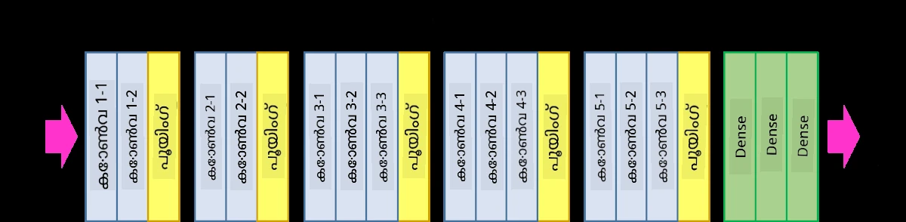
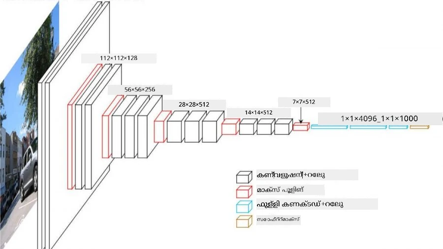
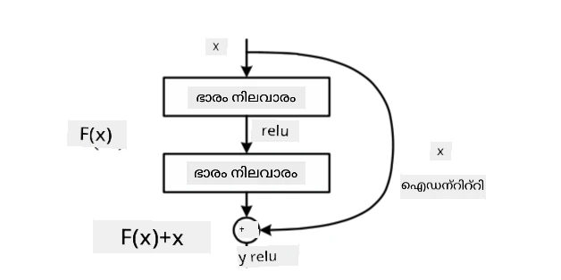
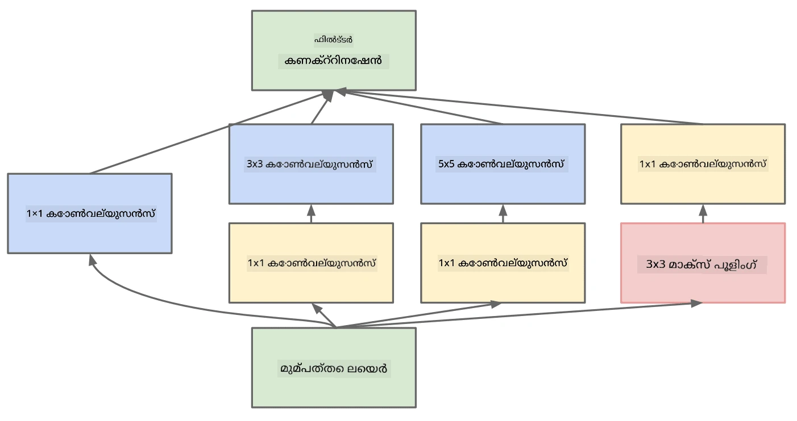

# പ്രശസ്തമായ CNN ആർക്കിടെക്ചറുകൾ

### VGG-16

VGG-16 2014-ൽ ImageNet ടോപ്പ്-5 ക്ലാസിഫിക്കേഷനിൽ 92.7% കൃത്യത നേടിയ ഒരു നെറ്റ്‌വർക്കാണ്. ഇതിന് താഴെ പറയുന്ന ലെയർ ഘടനയുണ്ട്:

നിങ്ങൾക്ക് കാണാമല്ലോ, VGG പരമ്പരാഗത പിരമിഡ് ആർക്കിടെക്ചർ പിന്തുടരുന്നു, convolution-pooling ലെയറുകളുടെ ഒരു ശ്രേണിയാണ് ഇത്.

> ചിത്രം [Researchgate](https://www.researchgate.net/figure/Vgg16-model-structure-To-get-the-VGG-NIN-model-we-replace-the-2-nd-4-th-6-th-7-th_fig2_335194493) നിന്നാണ്

### ResNet

ResNet മൈക്രോസോഫ്റ്റ് റിസർച്ച് 2015-ൽ നിർദ്ദേശിച്ച മോഡലുകളുടെ ഒരു കുടുംബമാണ്. ResNet-ന്റെ പ്രധാന ആശയം **residual blocks** ഉപയോഗിക്കുകയാണ്:

> ചിത്രം [ഈ പേപ്പർ](https://arxiv.org/pdf/1512.03385.pdf) നിന്നാണ്

ഐഡന്റിറ്റി പാസ്-ത്രൂ ഉപയോഗിക്കുന്നതിന്റെ കാരണം, ഒരു ലെയർ മുൻ ലെയറിന്റെ ഫലവും residual block-ന്റെ ഔട്ട്പുട്ടും തമ്മിലുള്ള **വ്യത്യാസം** പ്രവചിക്കാനാണ് - അതുകൊണ്ടാണ് *residual* എന്ന് പേരിട്ടിരിക്കുന്നത്. ആ ബ്ലോക്കുകൾ പരിശീലിപ്പിക്കാൻ വളരെ എളുപ്പമാണ്, കൂടാതെ നൂറുകണക്കിന് ബ്ലോക്കുകൾ ഉപയോഗിച്ച് നെറ്റ്‌വർക്ക് നിർമ്മിക്കാം (സാധാരണ വേർഷനുകൾ ResNet-52, ResNet-101, ResNet-152 എന്നിവയാണ്).

ഈ നെറ്റ്‌വർക്ക് dataset-നുസരിച്ച് അതിന്റെ സങ്കീർണ്ണത ക്രമീകരിക്കാൻ കഴിയും എന്നും നിങ്ങൾ കരുതാം. തുടക്കത്തിൽ, നെറ്റ്‌വർക്ക് പരിശീലനം ആരംഭിക്കുമ്പോൾ, വെയ്റ്റുകൾ ചെറുതായിരിക്കും, സിഗ്നലിന്റെ ഭൂരിഭാഗവും ഐഡന്റിറ്റി പാസ്-ത്രൂ ലെയറുകൾ വഴി പോകും. പരിശീലനം പുരോഗമിക്കുമ്പോൾ വെയ്റ്റുകൾ വലുതാകുകയും, നെറ്റ്‌വർക്ക് പാരാമീറ്ററുകളുടെ പ്രാധാന്യം വർദ്ധിക്കുകയും, ആവശ്യമായ പ്രകടന ശേഷി ലഭിക്കാൻ നെറ്റ്‌വർക്ക് ക്രമീകരിക്കപ്പെടുകയും ചെയ്യും.

### Google Inception

Google Inception ആർക്കിടെക്ചർ ഈ ആശയം ഒരു പടി മുന്നോട്ട് കൊണ്ടുപോകുന്നു, ഓരോ നെറ്റ്‌വർക്ക് ലെയറും പല വ്യത്യസ്ത പാതകളുടെ സംയോജനം ആയി നിർമ്മിക്കുന്നു:

> ചിത്രം [Researchgate](https://www.researchgate.net/figure/Inception-module-with-dimension-reductions-left-and-schema-for-Inception-ResNet-v1_fig2_355547454) നിന്നാണ്

ഇവിടെ, 1x1 convolution-ന്റെ പങ്ക് പ്രത്യേകിച്ച് ശ്രദ്ധിക്കണം, കാരണം ആദ്യം അത് അർത്ഥമാക്കാൻ ബുദ്ധിമുട്ടാകും. 1x1 ഫിൽട്ടർ ഉപയോഗിച്ച് ഇമേജിലൂടെ പോകേണ്ടതെന്തിന്? എന്നാൽ convolution ഫിൽട്ടറുകൾ പല ഡെപ്ത് ചാനലുകളുമായി (ആദ്യത്തേത് RGB നിറങ്ങൾ, പിന്നീട് വിവിധ ഫിൽട്ടറുകൾക്കുള്ള ചാനലുകൾ) പ്രവർത്തിക്കുന്നുവെന്ന് ഓർക്കണം, 1x1 convolution ആ ഇൻപുട്ട് ചാനലുകൾ വ്യത്യസ്ത ട്രെയിനബിൾ വെയ്റ്റുകൾ ഉപയോഗിച്ച് മിശ്രിതമാക്കാൻ ഉപയോഗിക്കുന്നു. ഇത് ചാനൽ ഡൈമെൻഷനിൽ ഡൗൺസാമ്പ്ലിംഗ് (pooling) ആയി കാണാം.

ഈ വിഷയത്തിൽ [ഒരു നല്ല ബ്ലോഗ് പോസ്റ്റ്](https://medium.com/analytics-vidhya/talented-mr-1x1-comprehensive-look-at-1x1-convolution-in-deep-learning-f6b355825578) ഉണ്ട്, കൂടാതെ [അസൽ പേപ്പർ](https://arxiv.org/pdf/1312.4400.pdf) വായിക്കാം.

### MobileNet

MobileNet മൊബൈൽ ഉപകരണങ്ങൾക്ക് അനുയോജ്യമായ, വലുപ്പം കുറച്ച മോഡലുകളുടെ ഒരു കുടുംബമാണ്. നിങ്ങൾക്ക് റിസോഴ്സുകൾ കുറവാണെങ്കിൽ, കുറച്ച് കൃത്യത ത്യജിക്കാമെങ്കിൽ ഇവ ഉപയോഗിക്കാം. ഇവയുടെ പ്രധാന ആശയം **depthwise separable convolution** ആണ്, spatial convolution-കളും 1x1 convolution-ഉം ഡെപ്ത് ചാനലുകളിൽ ചേർത്ത് convolution ഫിൽട്ടറുകൾ പ്രതിനിധാനം ചെയ്യാൻ ഇത് സഹായിക്കുന്നു. ഇതു പാരാമീറ്ററുകളുടെ എണ്ണം വളരെ കുറയ്ക്കുന്നു, നെറ്റ്‌വർക്ക് വലുപ്പം ചെറുതാക്കുകയും കുറവ് ഡാറ്റ ഉപയോഗിച്ച് പരിശീലിപ്പിക്കാൻ എളുപ്പമാക്കുകയും ചെയ്യുന്നു.

MobileNet-നെക്കുറിച്ച് [ഒരു നല്ല ബ്ലോഗ് പോസ്റ്റ്](https://medium.com/analytics-vidhya/image-classification-with-mobilenet-cc6fbb2cd470) ഇവിടെ കാണാം.

## നിഗമനം

ഈ യൂണിറ്റിൽ, നിങ്ങൾ കമ്പ്യൂട്ടർ വിഷൻ ന്യൂറൽ നെറ്റ്‌വർക്കുകളുടെ പ്രധാന ആശയം - convolutional networks - പഠിച്ചു. ചിത്ര ക്ലാസിഫിക്കേഷൻ, ഒബ്ജക്റ്റ് ഡിറ്റക്ഷൻ, ചിത്ര സൃഷ്ടി നെറ്റ്‌വർക്കുകൾ എല്ലാം CNN-കളിൽ അടിസ്ഥാനമാക്കിയുള്ളവയാണ്, കൂടുതൽ ലെയറുകളും ചില അധിക പരിശീലന തന്ത്രങ്ങളും ചേർത്ത്.

## 🚀 ചലഞ്ച്

സഹായക നോട്ട്‌ബുക്കുകളിൽ, കൂടുതൽ കൃത്യത നേടാനുള്ള കുറിപ്പുകൾ അടിക്കുറിപ്പായി നൽകിയിട്ടുണ്ട്. നിങ്ങൾക്ക് കൂടുതൽ കൃത്യത നേടാൻ കഴിയുന്നുണ്ടോ എന്ന് പരീക്ഷണങ്ങൾ നടത്തുക.

## [പോസ്റ്റ്-ലെക്ചർ ക്വിസ്](https://ff-quizzes.netlify.app/en/ai/quiz/14)

## അവലോകനം & സ്വയം പഠനം

CNN-കൾ സാധാരണയായി കമ്പ്യൂട്ടർ വിഷൻ ടാസ്കുകൾക്കാണ് ഉപയോഗിക്കുന്നത്, എന്നാൽ അവ സ്ഥിരമായ വലിപ്പത്തിലുള്ള പാറ്റേണുകൾ കണ്ടെത്താൻ പൊതുവെ നല്ലതാണ്. ഉദാഹരണത്തിന്, ശബ്ദവുമായി ബന്ധപ്പെട്ട്, ഓഡിയോ സിഗ്നലിൽ ചില പ്രത്യേക പാറ്റേണുകൾ കണ്ടെത്താൻ CNN-കൾ ഉപയോഗിക്കാം - അപ്പോൾ ഫിൽട്ടറുകൾ 1-ഡൈമെൻഷണൽ ആയിരിക്കും (ഇത്തരം CNN-നെ 1D-CNN എന്ന് വിളിക്കും). കൂടാതെ, ചിലപ്പോൾ 3D-CNN ഉപയോഗിച്ച് മൾട്ടി-ഡൈമെൻഷണൽ സ്പേസിൽ ഫീച്ചറുകൾ എടുക്കുന്നു, ഉദാഹരണത്തിന് വീഡിയോയിൽ സംഭവിക്കുന്ന ചില സംഭവങ്ങൾ - CNN സമയം അനുസരിച്ച് ഫീച്ചറുകളുടെ മാറ്റം പാറ്റേണുകൾ പിടികൂടാൻ കഴിയും. CNN-കൾ ഉപയോഗിച്ച് ചെയ്യാവുന്ന മറ്റ് ടാസ്കുകൾക്കായി അവലോകനം ചെയ്ത് സ്വയം പഠനം നടത്തുക.

## [അസൈൻമെന്റ്](lab/README.md)

ഈ ലാബിൽ, നിങ്ങൾക്ക് വ്യത്യസ്ത പൂച്ചയും നായയും ഇനങ്ങൾ ക്ലാസിഫൈ ചെയ്യേണ്ടതാണ്. ഈ ചിത്രങ്ങൾ MNIST ഡാറ്റാസെറ്റിനേക്കാൾ കൂടുതൽ സങ്കീർണ്ണവും ഉയർന്ന ഡൈമെൻഷനുകളുള്ളതും ആണ്, കൂടാതെ 10-ലധികം ക്ലാസുകൾ ഉണ്ട്.

---

<!-- CO-OP TRANSLATOR DISCLAIMER START -->
**അസൂയാ**:  
ഈ രേഖ AI വിവർത്തന സേവനം [Co-op Translator](https://github.com/Azure/co-op-translator) ഉപയോഗിച്ച് വിവർത്തനം ചെയ്തതാണ്. നാം കൃത്യതയ്ക്ക് ശ്രമിച്ചിട്ടുണ്ടെങ്കിലും, സ്വയം പ്രവർത്തിക്കുന്ന വിവർത്തനങ്ങളിൽ പിശകുകൾ അല്ലെങ്കിൽ തെറ്റുകൾ ഉണ്ടാകാമെന്ന് ദയവായി ശ്രദ്ധിക്കുക. അതിന്റെ മാതൃഭാഷയിലുള്ള യഥാർത്ഥ രേഖ അധികാരപരമായ ഉറവിടമായി കണക്കാക്കണം. നിർണായക വിവരങ്ങൾക്ക്, പ്രൊഫഷണൽ മനുഷ്യ വിവർത്തനം ശുപാർശ ചെയ്യപ്പെടുന്നു. ഈ വിവർത്തനത്തിന്റെ ഉപയോഗത്തിൽ നിന്നുണ്ടാകുന്ന ഏതെങ്കിലും തെറ്റിദ്ധാരണകൾക്കോ തെറ്റായ വ്യാഖ്യാനങ്ങൾക്കോ ഞങ്ങൾ ഉത്തരവാദികളല്ല.
<!-- CO-OP TRANSLATOR DISCLAIMER END -->