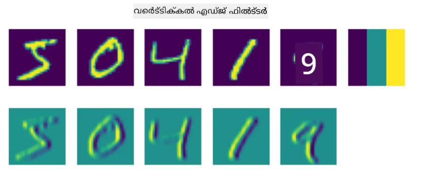
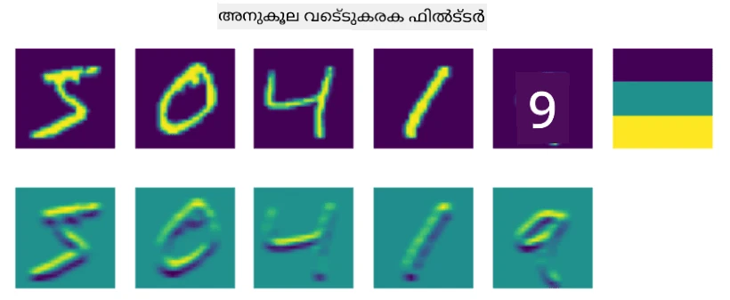
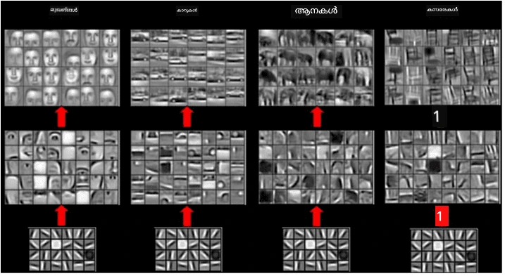

# കോൺവല്യൂഷണൽ ന്യൂറൽ നെറ്റ്വർക്കുകൾ

നാം മുമ്പ് കണ്ടതുപോലെ, ന്യൂറൽ നെറ്റ്വർക്കുകൾ ചിത്രങ്ങൾ കൈകാര്യം ചെയ്യുന്നതിൽ വളരെ നല്ലതാണ്, ഒറ്റ ലെയർ പെർസെപ്ട്രോൺ പോലും MNIST ഡാറ്റാസെറ്റിൽ നിന്നുള്ള കൈയെഴുത്ത് അക്കങ്ങൾ യുക്തിസഹമായ കൃത്യതയോടെ തിരിച്ചറിയാൻ കഴിയും. എന്നാൽ, MNIST ഡാറ്റാസെറ്റ് വളരെ പ്രത്യേകമാണ്, എല്ലാ അക്കങ്ങളും ചിത്രത്തിന്റെ മദ്ധ്യത്തിൽ സജ്ജീകരിച്ചിരിക്കുന്നു, ഇത് ജോലി എളുപ്പമാക്കുന്നു.

## [പ്രീ-ലെക്ചർ ക്വിസ്](https://ff-quizzes.netlify.app/en/ai/quiz/13)

യഥാർത്ഥ ജീവിതത്തിൽ, ചിത്രത്തിൽ ഒരു വസ്തുവിന്റെ കൃത്യമായ സ്ഥാനം എന്തായാലും അതിനെ തിരിച്ചറിയാൻ കഴിയണം. കമ്പ്യൂട്ടർ വിഷൻ സാധാരണ ക്ലാസിഫിക്കേഷനിൽ നിന്ന് വ്യത്യസ്തമാണ്, കാരണം നാം ഒരു പ്രത്യേക വസ്തു ചിത്രത്തിൽ കണ്ടെത്താൻ ശ്രമിക്കുമ്പോൾ, നാം ചിത്രത്തിൽ ചില പ്രത്യേക **പാറ്റേണുകൾ** അവയുടെ സംയോജനങ്ങളോടുകൂടി തിരയുകയാണ്. ഉദാഹരണത്തിന്, ഒരു പൂച്ചയെ കണ്ടെത്താൻ, ആദ്യം നാം ഹോരിസോണ്ടൽ ലൈനുകൾ തിരയാം, അവ തുമ്പുകൾ ആകാം, പിന്നെ തുമ്പുകളുടെ ഒരു പ്രത്യേക സംയോജനം അത് യഥാർത്ഥത്തിൽ പൂച്ചയുടെ ചിത്രം ആണെന്ന് പറയാം. സാപേക്ഷ സ്ഥാനം, ചില പാറ്റേണുകളുടെ സാന്നിധ്യം പ്രധാനമാണ്, ചിത്രത്തിലെ കൃത്യമായ സ്ഥാനം അല്ല.

പാറ്റേണുകൾ എടുക്കാൻ, നാം **കോൺവല്യൂഷണൽ ഫിൽട്ടറുകൾ** എന്ന ആശയം ഉപയോഗിക്കും. നിങ്ങൾക്ക് അറിയാമല്ലോ, ഒരു ചിത്രം 2D-മാട്രിക്സ് അല്ലെങ്കിൽ നിറത്തിന്റെ ആഴമുള്ള 3D-ടെൻസർ ആയി പ്രതിനിധീകരിക്കപ്പെടുന്നു. ഒരു ഫിൽട്ടർ പ്രയോഗിക്കുന്നത് അർത്ഥമാക്കുന്നത്, നാം ചെറിയ **ഫിൽട്ടർ കർണൽ** മാട്രിക്സ് എടുത്ത്, യഥാർത്ഥ ചിത്രത്തിലെ ഓരോ പിക്‌സലിനും സമീപമുള്ള പോയിന്റുകളുമായി ഭാരിത ശരാശരി കണക്കാക്കുകയാണ്. ഇത് ഒരു ചെറിയ വിൻഡോ മുഴുവൻ ചിത്രത്തിലൂടെ സ്ലൈഡ് ചെയ്യുന്നതുപോലെ കാണാം, ഫിൽട്ടർ കർണൽ മാട്രിക്സിലെ ഭാരങ്ങൾ അനുസരിച്ച് എല്ലാ പിക്‌സലുകളും ശരാശരി ചെയ്യുന്നു.

 | 
----|----

> ചിത്രം: Dmitry Soshnikov

ഉദാഹരണത്തിന്, 3x3 വെർട്ടിക്കൽ എഡ്ജ്, ഹോരിസോണ്ടൽ എഡ്ജ് ഫിൽട്ടറുകൾ MNIST അക്കങ്ങളിൽ പ്രയോഗിച്ചാൽ, യഥാർത്ഥ ചിത്രത്തിലെ വെർട്ടിക്കൽ, ഹോരിസോണ്ടൽ എഡ്ജുകൾ ഉള്ള സ്ഥലങ്ങളിൽ ഹൈലൈറ്റുകൾ (ഉയർന്ന മൂല്യങ്ങൾ) ലഭിക്കും. അതിനാൽ ആ രണ്ട് ഫിൽട്ടറുകൾ എഡ്ജുകൾ "തിരയാൻ" ഉപയോഗിക്കാം. അതുപോലെ, നാം മറ്റ് താഴ്ന്ന തലത്തിലുള്ള പാറ്റേണുകൾ കണ്ടെത്താൻ വ്യത്യസ്ത ഫിൽട്ടറുകൾ രൂപകൽപ്പന ചെയ്യാം:

> [Leung-Malik Filter Bank](https://www.robots.ox.ac.uk/~vgg/research/texclass/filters.html) ചിത്രം

എങ്കിലും, നാം ചില പാറ്റേണുകൾ കൈമാറി എടുക്കാൻ ഫിൽട്ടറുകൾ രൂപകൽപ്പന ചെയ്യാമെങ്കിലും, നെറ്റ്വർക്ക് സ്വയം പാറ്റേണുകൾ പഠിക്കുമെന്ന രീതിയിൽ രൂപകൽപ്പന ചെയ്യാനും കഴിയും. ഇത് CNN-ന്റെ പ്രധാന ആശയങ്ങളിൽ ഒന്നാണ്.

## CNN-ന്റെ പ്രധാന ആശയങ്ങൾ

CNN-കൾ പ്രവർത്തിക്കുന്നത് താഴെപ്പറയുന്ന പ്രധാന ആശയങ്ങളിലാണ് അടിസ്ഥാനമാക്കുന്നത്:

* കോൺവല്യൂഷണൽ ഫിൽട്ടറുകൾ പാറ്റേണുകൾ എടുക്കാൻ കഴിയും
* ഫിൽട്ടറുകൾ സ്വയം പരിശീലിക്കപ്പെടുന്ന വിധത്തിൽ നെറ്റ്വർക്ക് രൂപകൽപ്പന ചെയ്യാം
* നാം ഈ സമീപനം ഉപയോഗിച്ച് ഉയർന്ന തലത്തിലുള്ള ഫീച്ചറുകളിലും പാറ്റേണുകൾ കണ്ടെത്താം, യഥാർത്ഥ ചിത്രത്തിൽ മാത്രമല്ല. അതായത് CNN ഫീച്ചർ എക്സ്ട്രാക്ഷൻ പിക്‌സൽ സംയോജനങ്ങളിൽ നിന്നാരംഭിച്ച് ചിത്രഭാഗങ്ങളുടെ ഉയർന്ന തലത്തിലുള്ള സംയോജനങ്ങളിലേക്കുള്ള ഫീച്ചറുകളുടെ ഹയർആർക്കിയിൽ പ്രവർത്തിക്കുന്നു.

> [Hislop-Lynch](https://www.semanticscholar.org/paper/Computer-vision-based-pedestrian-trajectory-Hislop-Lynch/26e6f74853fc9bbb7487b06dc2cf095d36c9021d) എന്ന പേപ്പറിൽ നിന്നുള്ള ചിത്രം, അവരുടെ [ഗവേഷണത്തെ അടിസ്ഥാനമാക്കി](https://dl.acm.org/doi/abs/10.1145/1553374.1553453)

## ✍️ അഭ്യാസങ്ങൾ: കോൺവല്യൂഷണൽ ന്യൂറൽ നെറ്റ്വർക്കുകൾ

കോൺവല്യൂഷണൽ ന്യൂറൽ നെറ്റ്വർക്കുകൾ എങ്ങനെ പ്രവർത്തിക്കുന്നു, ഫിൽട്ടറുകൾ എങ്ങനെ പരിശീലിക്കാവുന്നതാണ് എന്നത് നോക്കാം, അനുബന്ധ നോട്ട്‌ബുക്കുകൾ വഴി:

* [കോൺവല്യൂഷണൽ ന്യൂറൽ നെറ്റ്വർക്കുകൾ - PyTorch](ConvNetsPyTorch.ipynb)
* [കോൺവല്യൂഷണൽ ന്യൂറൽ നെറ്റ്വർക്കുകൾ - TensorFlow](ConvNetsTF.ipynb)

## പിരമിഡ് ആർക്കിടെക്ചർ

ചിത്ര പ്രോസസ്സിംഗിനായി ഉപയോഗിക്കുന്ന മിക്ക CNN-കളും പിരമിഡ് ആർക്കിടെക്ചർ എന്ന രീതിയെ പിന്തുടരുന്നു. യഥാർത്ഥ ചിത്രങ്ങളിൽ പ്രയോഗിക്കുന്ന ആദ്യ കോൺവല്യൂഷണൽ ലെയർ സാധാരണയായി കുറച്ച് ഫിൽട്ടറുകൾ (8-16) ഉപയോഗിക്കുന്നു, അവ ഹോരിസോണ്ടൽ/വെർട്ടിക്കൽ ലൈനുകൾ പോലുള്ള വ്യത്യസ്ത പിക്‌സൽ സംയോജനങ്ങളെ പ്രതിനിധീകരിക്കുന്നു. അടുത്ത ലെയറിൽ, നെറ്റ്വർക്ക് സ്പേഷ്യൽ ഡൈമെൻഷൻ കുറയ്ക്കുകയും, ഫിൽട്ടറുകളുടെ എണ്ണം വർദ്ധിപ്പിക്കുകയും ചെയ്യുന്നു, ഇത് ലളിതമായ ഫീച്ചറുകളുടെ കൂടുതൽ സംയോജനങ്ങൾക്കു വഴിയൊരുക്കുന്നു. ഓരോ ലെയറിലും, അവസാന ക്ലാസിഫയറിലേക്കു നീങ്ങുമ്പോൾ, ചിത്രത്തിന്റെ സ്പേഷ്യൽ ഡൈമെൻഷൻ കുറയുകയും, ഫിൽട്ടറുകളുടെ എണ്ണം വർദ്ധിക്കുകയും ചെയ്യുന്നു.

ഉദാഹരണമായി, 2014-ൽ ImageNet ടോപ്പ്-5 ക്ലാസിഫിക്കേഷനിൽ 92.7% കൃത്യത നേടിയ VGG-16 നെറ്റ്വർക്ക് ആർക്കിടെക്ചർ നോക്കാം:

> [Researchgate](https://www.researchgate.net/figure/Vgg16-model-structure-To-get-the-VGG-NIN-model-we-replace-the-2-nd-4-th-6-th-7-th_fig2_335194493) നിന്നുള്ള ചിത്രം

## പ്രശസ്തമായ CNN ആർക്കിടെക്ചറുകൾ

[പ്രശസ്തമായ CNN ആർക്കിടെക്ചറുകൾക്കുറിച്ച് പഠനം തുടരുക](CNN_Architectures.md)

---

<!-- CO-OP TRANSLATOR DISCLAIMER START -->
**അസൂയാ**:  
ഈ രേഖ AI വിവർത്തന സേവനം [Co-op Translator](https://github.com/Azure/co-op-translator) ഉപയോഗിച്ച് വിവർത്തനം ചെയ്തതാണ്. നാം കൃത്യതയ്ക്ക് ശ്രമിച്ചെങ്കിലും, സ്വയം പ്രവർത്തിക്കുന്ന വിവർത്തനങ്ങളിൽ പിശകുകൾ അല്ലെങ്കിൽ തെറ്റുകൾ ഉണ്ടാകാമെന്ന് ദയവായി ശ്രദ്ധിക്കുക. അതിന്റെ മാതൃഭാഷയിലുള്ള യഥാർത്ഥ രേഖ അധികാരപരമായ ഉറവിടമായി കണക്കാക്കണം. നിർണായക വിവരങ്ങൾക്ക്, പ്രൊഫഷണൽ മനുഷ്യ വിവർത്തനം ശുപാർശ ചെയ്യപ്പെടുന്നു. ഈ വിവർത്തനം ഉപയോഗിക്കുന്നതിൽ നിന്നുണ്ടാകുന്ന ഏതെങ്കിലും തെറ്റിദ്ധാരണകൾക്കോ തെറ്റായ വ്യാഖ്യാനങ്ങൾക്കോ ഞങ്ങൾ ഉത്തരവാദികളല്ല.
<!-- CO-OP TRANSLATOR DISCLAIMER END -->