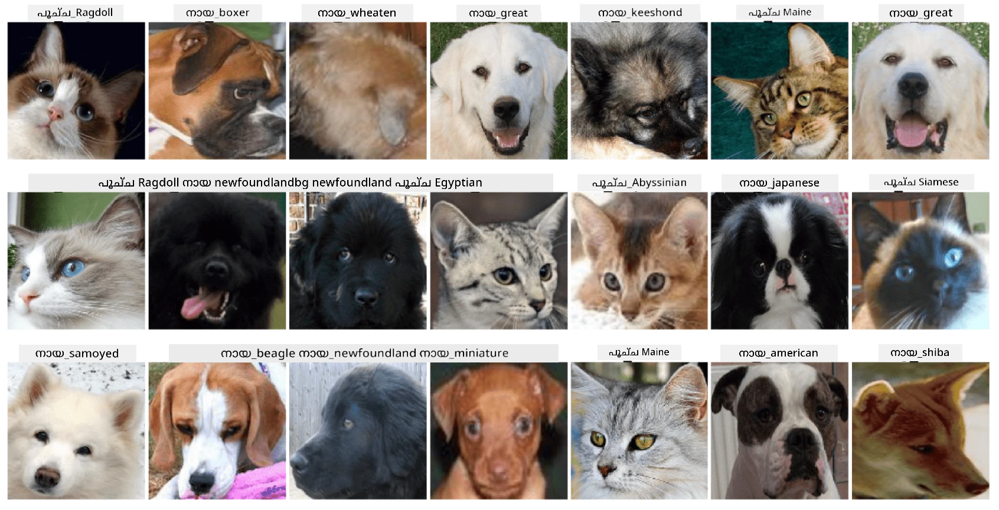

# മൃഗങ്ങളുടെ മുഖങ്ങളുടെ വർഗ്ഗീകരണം

[AI for Beginners Curriculum](https://github.com/microsoft/ai-for-beginners) ലെ ലാബ് അസൈൻമെന്റ്.

## ടാസ്‌ക്

ഒരു മൃഗശാലയ്ക്ക് എല്ലാ മൃഗങ്ങളും കാറ്റലോഗ് ചെയ്യാനുള്ള ഒരു ആപ്ലിക്കേഷൻ വികസിപ്പിക്കേണ്ടതായി നിങ്ങൾക്ക് ധരിക്കാം. അത്തരത്തിലുള്ള ഒരു ആപ്ലിക്കേഷന്റെ മികച്ച സവിശേഷതകളിലൊന്ന് ഫോട്ടോഗ്രാഫിൽ നിന്ന് സ്വയം ജാതി കണ്ടെത്തുക എന്നതാണ്. ഇത് ന്യുറൽ നെറ്റ്വർക്കുകൾ ഉപയോഗിച്ച് വിജയകരമായി ചെയ്യാം.

**Pet Faces** ഡാറ്റാസെറ്റ് ഉപയോഗിച്ച് വിവിധ പൂച്ചകളും നായകളും ജാതികൾ വർഗ്ഗീകരിക്കാൻ നിങ്ങൾ ഒരു കോൺവല്യൂഷണൽ ന്യുറൽ നെറ്റ്വർക്ക് പരിശീലിപ്പിക്കേണ്ടതാണ്.

## ഡാറ്റാസെറ്റ്

നാം ഉപയോഗിക്കുന്നത് [Oxford-IIIT Pet Dataset](https://www.robots.ox.ac.uk/~vgg/data/pets/) ആണ്, ഇതിൽ 37 വ്യത്യസ്ത നായയും പൂച്ചയും ജാതികളുടെ ചിത്രങ്ങൾ ഉൾപ്പെടുന്നു.



ഡാറ്റാസെറ്റ് ഡൗൺലോഡ് ചെയ്യാൻ, ഈ കോഡ് സ്നിപ്പെറ്റ് ഉപയോഗിക്കുക:

```python
!wget https://thor.robots.ox.ac.uk/~vgg/data/pets/images.tar.gz
!tar xfz images.tar.gz
!rm images.tar.gz
```

**കുറിപ്പ്:** Oxford-IIIT Pet Dataset ചിത്രങ്ങൾ ഫയൽനാമുകൾ പ്രകാരം ക്രമീകരിച്ചിരിക്കുന്നു (ഉദാ., `Abyssinian_1.jpg`, `Bengal_2.jpg`). ഈ നോട്ട്‌ബുക്കിൽ ഈ ചിത്രങ്ങൾ ജാതി-പ്രത്യേക സബ്‌ഡയറക്ടറികളിലേക്ക് ക്രമീകരിക്കുന്ന കോഡ് ഉൾപ്പെടുത്തിയിട്ടുണ്ട്, ഇത് വർഗ്ഗീകരണം എളുപ്പമാക്കുന്നു.

## സ്റ്റാർട്ടിംഗ് നോട്ട്‌ബുക്ക്

ലാബ് ആരംഭിക്കാൻ [PetFaces.ipynb](PetFaces.ipynb) തുറക്കുക

## പഠിപ്പുകൾ

നിങ്ങൾ ഒരു സങ്കീർണ്ണമായ ഇമേജ് വർഗ്ഗീകരണ പ്രശ്നം തുടക്കത്തിൽ നിന്ന് പരിഹരിച്ചു! ക്ലാസുകൾ വളരെ കൂടുതലായിരുന്നു, എന്നാൽ നിങ്ങൾക്ക് യുക്തിസഹമായ കൃത്യത നേടാൻ കഴിഞ്ഞു! ചില ക്ലാസുകൾ മനുഷ്യർക്കും വ്യക്തമായി വ്യത്യസ്തമല്ലാത്തതിനാൽ, ടോപ്പ്-k കൃത്യത അളക്കുന്നത് ബുദ്ധിമുട്ടുള്ള ക്ലാസുകൾ തമ്മിൽ തെറ്റിദ്ധരിക്കപ്പെടുന്നത് കുറയ്ക്കാൻ സഹായിക്കുന്നു.

---

<!-- CO-OP TRANSLATOR DISCLAIMER START -->
**അസൂയാ**:  
ഈ രേഖ AI വിവർത്തന സേവനം [Co-op Translator](https://github.com/Azure/co-op-translator) ഉപയോഗിച്ച് വിവർത്തനം ചെയ്തതാണ്. നാം കൃത്യതയ്ക്ക് ശ്രമിച്ചിട്ടുണ്ടെങ്കിലും, സ്വയം പ്രവർത്തിക്കുന്ന വിവർത്തനങ്ങളിൽ പിശകുകൾ അല്ലെങ്കിൽ തെറ്റുകൾ ഉണ്ടാകാമെന്ന് ദയവായി ശ്രദ്ധിക്കുക. അതിന്റെ മാതൃഭാഷയിലുള്ള യഥാർത്ഥ രേഖയാണ് പ്രാമാണികമായ ഉറവിടം എന്ന് പരിഗണിക്കേണ്ടതാണ്. നിർണായകമായ വിവരങ്ങൾക്ക്, പ്രൊഫഷണൽ മനുഷ്യ വിവർത്തനം ശുപാർശ ചെയ്യപ്പെടുന്നു. ഈ വിവർത്തനം ഉപയോഗിക്കുന്നതിൽ നിന്നുണ്ടാകുന്ന ഏതെങ്കിലും തെറ്റിദ്ധാരണകൾക്കോ തെറ്റായ വ്യാഖ്യാനങ്ങൾക്കോ ഞങ്ങൾ ഉത്തരവാദികളല്ല.
<!-- CO-OP TRANSLATOR DISCLAIMER END -->