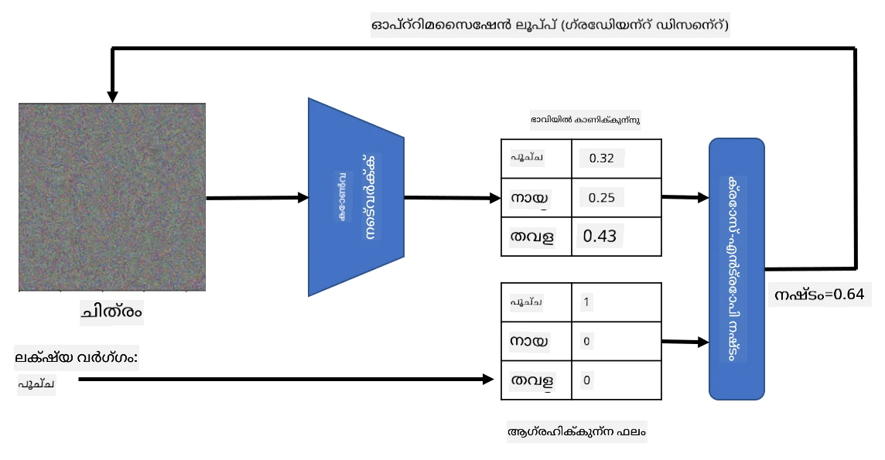

# മുൻപരിചയമുള്ള നെറ്റ്‌വർക്കുകളും ട്രാൻസ്ഫർ ലേണിംഗും

CNN-കൾ പരിശീലിപ്പിക്കാൻ വളരെ സമയം വേണ്ടിവരും, കൂടാതെ അതിനായി വലിയ ഡാറ്റ ആവശ്യമാണ്. എന്നാൽ, ഒരു നെറ്റ്‌വർക്ക് ചിത്രങ്ങളിൽ നിന്നുള്ള പാറ്റേണുകൾ എടുക്കാൻ ഉപയോഗിക്കുന്ന മികച്ച ലോ-ലെവൽ ഫിൽട്ടറുകൾ പഠിക്കുന്നതിൽ കൂടുതലായാണ് സമയം ചെലവഴിക്കുന്നത്. ഒരു സ്വാഭാവിക ചോദ്യമാണ് - ഒരു ഡാറ്റാസെറ്റിൽ പരിശീലിപ്പിച്ച ഒരു ന്യൂറൽ നെറ്റ്‌വർക്ക് ഉപയോഗിച്ച്, പൂർണ്ണ പരിശീലന പ്രക്രിയ ആവശ്യമില്ലാതെ വ്യത്യസ്ത ചിത്രങ്ങൾ വർഗ്ഗീകരിക്കാൻ അതിനെ അനുയോജ്യമായി മാറ്റാമോ?

## [പ്രീ-ലെക്ചർ ക്വിസ്](https://ff-quizzes.netlify.app/en/ai/quiz/15)

ഈ സമീപനം **ട്രാൻസ്ഫർ ലേണിംഗ്** എന്ന് വിളിക്കുന്നു, കാരണം ഒരു ന്യൂറൽ നെറ്റ്‌വർക്ക് മോഡലിൽ നിന്നുള്ള ചില അറിവ് മറ്റൊരു മോഡലിലേക്ക് മാറ്റുന്നു. ട്രാൻസ്ഫർ ലേണിംഗിൽ, സാധാരണയായി, വലിയ ചിത്ര ഡാറ്റാസെറ്റിൽ പരിശീലിപ്പിച്ച ഒരു മുൻപരിചയമുള്ള മോഡലിൽ നിന്ന് ആരംഭിക്കുന്നു, ഉദാഹരണത്തിന് **ImageNet**. ആ മോഡലുകൾ സാധാരണ ചിത്രങ്ങളിൽ നിന്നുള്ള വിവിധ ഫീച്ചറുകൾ എടുക്കുന്നതിൽ നല്ല പ്രകടനം കാണിക്കുന്നു, പലപ്പോഴും ആ ഫീച്ചറുകളുടെ മുകളിൽ ഒരു ക്ലാസിഫയർ നിർമ്മിക്കുന്നത് നല്ല ഫലം നൽകുന്നു.

> ✅ ട്രാൻസ്ഫർ ലേണിംഗ് എന്ന പദം വിദ്യാഭ്യാസം പോലുള്ള മറ്റ് അക്കാദമിക് മേഖലകളിലും കാണപ്പെടുന്നു. ഇത് ഒരു ഡൊമെയ്‌നിൽ നിന്നുള്ള അറിവ് മറ്റൊരു ഡൊമെയ്‌നിൽ പ്രയോഗിക്കുന്ന പ്രക്രിയയെ സൂചിപ്പിക്കുന്നു.

## മുൻപരിചയമുള്ള മോഡലുകൾ ഫീച്ചർ എക്സ്ട്രാക്ടറുകളായി

മുൻവകുപ്പിൽ ചർച്ച ചെയ്ത കോൺവല്യൂഷണൽ നെറ്റ്‌വർക്ക് പല ലെയറുകൾ അടങ്ങിയിരുന്നു, ഓരോ ലെയറും ചിത്രത്തിൽ നിന്നുള്ള ചില ഫീച്ചറുകൾ എടുക്കാൻ ഉദ്ദേശിച്ചിരിക്കുന്നു, താഴ്ന്ന തലത്തിലുള്ള പിക്‌സൽ കോമ്പിനേഷനുകളിൽ നിന്ന് (ഉദാഹരണത്തിന്, ഹോരിസോണ്ടൽ/വെർട്ടിക്കൽ ലൈൻ അല്ലെങ്കിൽ സ്ട്രോക്ക്) തുടങ്ങി ഉയർന്ന തലത്തിലുള്ള ഫീച്ചറുകളുടെ കോമ്പിനേഷനുകൾ വരെ, ഉദാഹരണത്തിന്, ഒരു ജ്വാലയുടെ കണ്ണ് പോലുള്ളവ. സാധാരണയും വൈവിധ്യമാർന്ന വലിയ ഡാറ്റാസെറ്റിൽ CNN പരിശീലിപ്പിച്ചാൽ, നെറ്റ്‌വർക്ക് ആ പൊതുവായ ഫീച്ചറുകൾ എടുക്കാൻ പഠിക്കും.

Keras-നും PyTorch-നും ImageNet ചിത്രങ്ങളിൽ പരിശീലിപ്പിച്ച ചില സാധാരണ ആർക്കിടെക്ചറുകൾക്കായി മുൻപരിചയമുള്ള ന്യൂറൽ നെറ്റ്‌വർക്ക് വെയ്റ്റുകൾ എളുപ്പത്തിൽ ലോഡ് ചെയ്യാനുള്ള ഫംഗ്ഷനുകൾ ഉണ്ട്. മുൻപത്തെ പാഠത്തിലെ [CNN ആർക്കിടെക്ചറുകൾ](../07-ConvNets/CNN_Architectures.md) പേജിൽ ഏറ്റവും സാധാരണ ഉപയോഗിക്കുന്നവ വിശദീകരിച്ചിരിക്കുന്നു. പ്രത്യേകിച്ച്, താഴെ പറയുന്നവയിൽ ഒന്നോ അതിലധികമോ ഉപയോഗിക്കാൻ നിങ്ങൾ ആഗ്രഹിക്കാം:

* **VGG-16/VGG-19** - സാദാരണമായ മോഡലുകൾ ആയിട്ടും നല്ല കൃത്യത നൽകുന്നു. ട്രാൻസ്ഫർ ലേണിംഗ് എങ്ങനെ പ്രവർത്തിക്കുന്നു എന്ന് കാണാൻ ആദ്യ ശ്രമമായി VGG ഉപയോഗിക്കുന്നത് നല്ല തിരഞ്ഞെടുപ്പാണ്.
* **ResNet** - 2015-ൽ Microsoft Research നിർദ്ദേശിച്ച മോഡലുകളുടെ കുടുംബം. കൂടുതൽ ലെയറുകൾ ഉള്ളതിനാൽ കൂടുതൽ റിസോഴ്‌സുകൾ ആവശ്യമാണ്.
* **MobileNet** - ചെറുതായ മോഡലുകളുടെ കുടുംബം, മൊബൈൽ ഉപകരണങ്ങൾക്ക് അനുയോജ്യം. റിസോഴ്‌സുകൾ കുറവാണെങ്കിൽ, കുറച്ച് കൃത്യത ത്യജിച്ച് ഇവ ഉപയോഗിക്കാം.

ഇവിടെ VGG-16 നെറ്റ്‌വർക്ക് ഒരു പൂച്ചയുടെ ചിത്രത്തിൽ നിന്നെടുത്ത ഫീച്ചറുകളുടെ ഉദാഹരണം കാണാം:

## പൂച്ചകളും നായകളും ഡാറ്റാസെറ്റ്

ഈ ഉദാഹരണത്തിൽ, നാം [പൂച്ചകളും നായകളും](https://www.microsoft.com/download/details.aspx?id=54765&WT.mc_id=academic-77998-cacaste) എന്ന ഡാറ്റാസെറ്റ് ഉപയോഗിക്കും, ഇത് യാഥാർത്ഥ്യ ചിത്ര വർഗ്ഗീകരണ സാഹചര്യത്തിന് വളരെ അടുത്തതാണ്.

## ✍️ അഭ്യാസം: ട്രാൻസ്ഫർ ലേണിംഗ്

ട്രാൻസ്ഫർ ലേണിംഗ് പ്രവർത്തനത്തിൽ കാണാം അനുബന്ധ നോട്ട്‌ബുക്കുകളിൽ:

* [ട്രാൻസ്ഫർ ലേണിംഗ് - PyTorch](TransferLearningPyTorch.ipynb)
* [ട്രാൻസ്ഫർ ലേണിംഗ് - TensorFlow](TransferLearningTF.ipynb)

## എതിരാളി പൂച്ചയുടെ ദൃശ്യവൽക്കരണം

മുൻപരിചയമുള്ള ന്യൂറൽ നെറ്റ്‌വർക്ക് അതിന്റെ *ബ്രെയിനിൽ* വിവിധ പാറ്റേണുകൾ ഉൾക്കൊള്ളുന്നു, അതിൽ **ആദർശ പൂച്ച** (പൂച്ച, നായ, സീബ്ര തുടങ്ങിയവയുടെ ആദർശം) എന്ന ആശയങ്ങളും ഉൾപ്പെടുന്നു. ഈ ചിത്രം **ദൃശ്യവൽക്കരിക്കുക** എന്നത് രസകരമായിരിക്കും. എന്നാൽ ഇത് എളുപ്പമല്ല, കാരണം പാറ്റേണുകൾ നെറ്റ്‌വർക്ക് വെയ്റ്റുകളിൽ വ്യാപിച്ചിരിക്കുന്നു, കൂടാതെ അവ ഒരു ഹയർആർക്കിക്കൽ ഘടനയിലും ക്രമീകരിച്ചിരിക്കുന്നു.

ഒരു സമീപനം, ഒരു യാദൃച്ഛിക ചിത്രം കൊണ്ട് ആരംഭിച്ച്, **ഗ്രേഡിയന്റ് ഡിസെന്റ് ഓപ്റ്റിമൈസേഷൻ** സാങ്കേതിക വിദ്യ ഉപയോഗിച്ച് ആ ചിത്രം അങ്ങനെ ക്രമീകരിക്കാൻ ശ്രമിക്കുക എന്നതാണ്, നെറ്റ്‌വർക്ക് അത് പൂച്ചയാണെന്ന് കരുതാൻ തുടങ്ങും വിധം.

എങ്കിലും, ഇത് ചെയ്താൽ, നമുക്ക് യാദൃച്ഛിക ശബ്ദം പോലുള്ള ഒന്നാണ് ലഭിക്കുന്നത്. കാരണം *നെറ്റ്‌വർക്ക് ഇൻപുട്ട് ചിത്രം പൂച്ചയാണെന്ന് കരുതാൻ നിരവധി മാർഗ്ഗങ്ങൾ ഉണ്ട്*, ചിലത് ദൃശ്യമായി അർത്ഥവത്തല്ലാത്തവയും. ആ ചിത്രങ്ങളിൽ പൂച്ചയ്ക്ക് സാധാരണമായ പല പാറ്റേണുകളും ഉണ്ടെങ്കിലും, അവ ദൃശ്യമായി വ്യത്യസ്തമാകാൻ യാതൊരു നിയന്ത്രണവും ഇല്ല.

ഫലം മെച്ചപ്പെടുത്താൻ, നാം നഷ്ട ഫംഗ്ഷനിൽ മറ്റൊരു പദം ചേർക്കാം, അത് **വേരിയേഷൻ ലോസ്** എന്ന് വിളിക്കുന്നു. ഇത് ചിത്രത്തിലെ സമീപമുള്ള പിക്‌സലുകൾ എത്രത്തോളം സമാനമാണെന്ന് കാണിക്കുന്ന ഒരു മെട്രിക് ആണ്. വേരിയേഷൻ ലോസ് കുറയ്ക്കുന്നത് ചിത്രം മൃദുവാക്കുകയും ശബ്ദം നീക്കം ചെയ്യുകയും ചെയ്യുന്നു - അതിലൂടെ കൂടുതൽ ദൃശ്യപരമായി ആകർഷകമായ പാറ്റേണുകൾ വെളിപ്പെടുത്തുന്നു. താഴെ "ആദർശ" ചിത്രങ്ങളുടെ ഉദാഹരണം കാണാം, പൂച്ചയും സീബ്രയും ഉയർന്ന സാധ്യതയോടെ വർഗ്ഗീകരിക്കപ്പെട്ടവ:

 | 
-----|-----
 *ആദർശ പൂച്ച* | *ആദർശ സീബ്ര*

ഇത്തരത്തിലുള്ള സമീപനം ന്യൂറൽ നെറ്റ്‌വർക്കിൽ **എതിരാളി ആക്രമണങ്ങൾ** നടത്താനും ഉപയോഗിക്കാം. ഒരു നായയെ പൂച്ചയെന്നു തോന്നിക്കാൻ നമുക്ക് ആഗ്രഹമുണ്ടെന്ന് കരുതുക. ഒരു നായയുടെ ചിത്രം, നെറ്റ്‌വർക്ക് നായയെന്നു തിരിച്ചറിയുന്ന ചിത്രം, നാം ഗ്രേഡിയന്റ് ഡിസെന്റ് ഓപ്റ്റിമൈസേഷൻ ഉപയോഗിച്ച് ചെറിയ മാറ്റങ്ങൾ വരുത്തി, നെറ്റ്‌വർക്ക് അത് പൂച്ചയെന്നു തിരിച്ചറിയാൻ തുടങ്ങും വരെ ക്രമീകരിക്കാം:

 | 
-----|-----
*നായയുടെ യഥാർത്ഥ ചിത്രം* | *പൂച്ചയെന്നു തിരിച്ചറിയപ്പെട്ട നായയുടെ ചിത്രം*

മുകളിൽ കാണിച്ച ഫലങ്ങൾ പുനരുത്പാദിപ്പിക്കാൻ കോഡ് താഴെ കാണുന്ന നോട്ട്‌ബുക്കിൽ ലഭ്യമാണ്:

* [ആദർശവും എതിരാളി പൂച്ചയും - TensorFlow](AdversarialCat_TF.ipynb)

## സംഗ്രഹം

ട്രാൻസ്ഫർ ലേണിംഗ് ഉപയോഗിച്ച്, നിങ്ങൾക്ക് ഒരു കസ്റ്റം ഒബ്ജക്റ്റ് ക്ലാസിഫിക്കേഷൻ ടാസ്കിനായി ക്ലാസിഫയർ വേഗത്തിൽ നിർമ്മിച്ച് ഉയർന്ന കൃത്യത നേടാം. ഇപ്പോൾ നാം പരിഹരിക്കുന്ന കൂടുതൽ സങ്കീർണ്ണമായ ടാസ്കുകൾക്ക് ഉയർന്ന കംപ്യൂട്ടേഷൻ ശക്തി ആവശ്യമാണ്, CPU-യിൽ എളുപ്പത്തിൽ പരിഹരിക്കാൻ കഴിയില്ല. അടുത്ത യൂണിറ്റിൽ, കുറവ് കംപ്യൂട്ടേഷൻ റിസോഴ്‌സുകൾ ഉപയോഗിച്ച് സമാന മോഡൽ പരിശീലിപ്പിക്കാൻ ഒരു ലഘുവായ ഇംപ്ലിമെന്റേഷൻ ഉപയോഗിച്ച് ശ്രമിക്കും, അതിന്റെ ഫലം കുറച്ച് താഴ്ന്ന കൃത്യത മാത്രമാണ്.

## 🚀 ചലഞ്ച്

അനുബന്ധ നോട്ട്‌ബുക്കുകളിൽ, ട്രാൻസ്ഫർ അറിവ് ഏറ്റവും നല്ലത് സമാനമായ പരിശീലന ഡാറ്റ ഉപയോഗിക്കുമ്പോഴാണെന്ന് താഴെ കുറിപ്പുകൾ ഉണ്ട് (പുതിയ ഒരു മൃഗം പോലുള്ളത്). പൂർണ്ണമായും പുതിയ തരത്തിലുള്ള ചിത്രങ്ങളുമായി പരീക്ഷണം നടത്തുക, നിങ്ങളുടെ ട്രാൻസ്ഫർ അറിവ് മോഡലുകൾ എത്രത്തോളം നല്ലതോ അല്ലയോ എന്ന് കാണാൻ.

## [പോസ്റ്റ്-ലെക്ചർ ക്വിസ്](https://ff-quizzes.netlify.app/en/ai/quiz/16)

## അവലോകനം & സ്വയം പഠനം

നിങ്ങളുടെ മോഡലുകൾ പരിശീലിപ്പിക്കുന്ന മറ്റ് ചില മാർഗ്ഗങ്ങളെക്കുറിച്ച് കൂടുതൽ അറിവ് നേടാൻ [TrainingTricks.md](TrainingTricks.md) വായിക്കുക.

## [അസൈൻമെന്റ്](lab/README.md)

ഈ ലാബിൽ, നാം യഥാർത്ഥ [Oxford-IIIT](https://www.robots.ox.ac.uk/~vgg/data/pets/) പെട്ട് ഡാറ്റാസെറ്റ് ഉപയോഗിച്ച് 35 ഇനങ്ങളുള്ള പൂച്ചകളും നായകളും ഉൾക്കൊള്ളുന്ന ഡാറ്റാസെറ്റ് ഉപയോഗിച്ച് ട്രാൻസ്ഫർ ലേണിംഗ് ക്ലാസിഫയർ നിർമ്മിക്കും.

---

<!-- CO-OP TRANSLATOR DISCLAIMER START -->
**അസൂയാ**:  
ഈ രേഖ AI വിവർത്തന സേവനം [Co-op Translator](https://github.com/Azure/co-op-translator) ഉപയോഗിച്ച് വിവർത്തനം ചെയ്തതാണ്. നാം കൃത്യതയ്ക്ക് ശ്രമിച്ചിട്ടുണ്ടെങ്കിലും, സ്വയം പ്രവർത്തിക്കുന്ന വിവർത്തനങ്ങളിൽ പിശകുകൾ അല്ലെങ്കിൽ തെറ്റുകൾ ഉണ്ടാകാമെന്ന് ദയവായി ശ്രദ്ധിക്കുക. അതിന്റെ മാതൃഭാഷയിലുള്ള യഥാർത്ഥ രേഖ അധികാരപരമായ ഉറവിടമായി കണക്കാക്കപ്പെടണം. നിർണായക വിവരങ്ങൾക്ക്, പ്രൊഫഷണൽ മനുഷ്യ വിവർത്തനം ശുപാർശ ചെയ്യപ്പെടുന്നു. ഈ വിവർത്തനം ഉപയോഗിക്കുന്നതിൽ നിന്നുണ്ടാകുന്ന ഏതെങ്കിലും തെറ്റിദ്ധാരണകൾക്കോ തെറ്റായ വ്യാഖ്യാനങ്ങൾക്കോ ഞങ്ങൾ ഉത്തരവാദികളല്ല.
<!-- CO-OP TRANSLATOR DISCLAIMER END -->