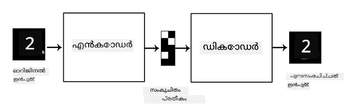
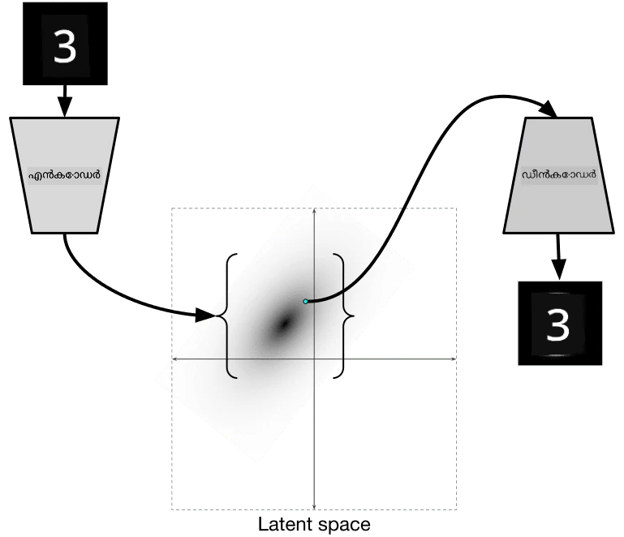

# ഓട്ടോഎൻകോഡറുകൾ

CNN-കൾ പരിശീലിപ്പിക്കുമ്പോൾ, ഒരു പ്രശ്നം നമ്മൾക്ക് വളരെ ലേബൽ ചെയ്ത ഡാറ്റ ആവശ്യമുള്ളതാണ്. ചിത്ര വർഗ്ഗീകരണത്തിന്റെ കാര്യത്തിൽ, ചിത്രങ്ങളെ വ്യത്യസ്ത ക്ലാസുകളായി വേർതിരിക്കേണ്ടതുണ്ട്, ഇത് ഒരു മാനുവൽ ശ്രമമാണ്.

## [പ്രീ-ലെക്ചർ ക്വിസ്](https://ff-quizzes.netlify.app/en/ai/quiz/17)

എങ്കിലും, നാം റോ (ലേബൽ ചെയ്യാത്ത) ഡാറ്റ ഉപയോഗിച്ച് CNN ഫീച്ചർ എക്സ്ട്രാക്ടറുകൾ പരിശീലിപ്പിക്കാൻ ആഗ്രഹിക്കാം, ഇതിനെ **സ്വയം-പരിശീലന പഠനം** (self-supervised learning) എന്ന് വിളിക്കുന്നു. ലേബലുകൾക്ക് പകരം, പരിശീലന ചിത്രങ്ങളെ നെറ്റ്‌വർക്കിന്റെ ഇൻപുട്ടും ഔട്ട്പുട്ടും ആയി ഉപയോഗിക്കും. **ഓട്ടോഎൻകോഡറിന്റെ** പ്രധാന ആശയം, ഒരു **എൻകോഡർ നെറ്റ്‌വർക്ക്** ഉപയോഗിച്ച് ഇൻപുട്ട് ചിത്രം ഒരു **ലാറ്റന്റ് സ്പേസിലേക്ക്** (സാധാരണയായി ചെറിയ വലുപ്പമുള്ള വെക്ടർ) മാറ്റുകയും, പിന്നീട് **ഡീകോഡർ നെറ്റ്‌വർക്ക്** ഉപയോഗിച്ച് ആ യഥാർത്ഥ ചിത്രം പുനഃസൃഷ്ടിക്കുകയുമാണ്.

> ✅ ഒരു [ഓട്ടോഎൻകോഡർ](https://wikipedia.org/wiki/Autoencoder) "ലേബൽ ചെയ്യാത്ത ഡാറ്റയുടെ കാര്യക്ഷമമായ കോഡിങ്ങുകൾ പഠിക്കാൻ ഉപയോഗിക്കുന്ന ഒരു തരം ആർട്ടിഫിഷ്യൽ ന്യൂറൽ നെറ്റ്‌വർക്ക് ആണ്."

യഥാർത്ഥ ചിത്രത്തിൽ നിന്നുള്ള വിവരങ്ങൾ പൂർണ്ണമായി പിടിച്ചുപറ്റി കൃത്യമായി പുനഃസൃഷ്ടിക്കാൻ ഓട്ടോഎൻകോഡർ പരിശീലിപ്പിക്കുമ്പോൾ, നെറ്റ്‌വർക്ക് ഇൻപുട്ട് ചിത്രങ്ങളുടെ അർത്ഥം പിടിച്ചുപറ്റാൻ മികച്ച **എംബെഡ്ഡിംഗ്** കണ്ടെത്താൻ ശ്രമിക്കുന്നു.

> ചിത്രം [Keras ബ്ലോഗിൽ നിന്നുള്ളത്](https://blog.keras.io/building-autoencoders-in-keras.html)

## ഓട്ടോഎൻകോഡറുകൾ ഉപയോഗിക്കുന്ന സാഹചര്യങ്ങൾ

യഥാർത്ഥ ചിത്രങ്ങൾ പുനഃസൃഷ്ടിക്കുന്നത് സ്വയം പ്രയോജനകരമല്ലാത്തതുപോലെയാണ് തോന്നിയാലും, ചില സാഹചര്യങ്ങളിൽ ഓട്ടോഎൻകോഡറുകൾ പ്രത്യേകിച്ച് പ്രയോജനകരമാണ്:

* **ദൃശ്യവൽക്കരണത്തിനായി ചിത്രങ്ങളുടെ ഡൈമെൻഷൻ കുറയ്ക്കൽ** അല്ലെങ്കിൽ **ചിത്ര എംബെഡ്ഡിംഗുകൾ പരിശീലിപ്പിക്കൽ**. സാധാരണ PCA-യേക്കാൾ ഓട്ടോഎൻകോഡറുകൾ മികച്ച ഫലങ്ങൾ നൽകുന്നു, കാരണം ഇത് ചിത്രങ്ങളുടെ സ്ഥലംപരമായ സ്വഭാവവും ഹയർആർക്കിക്കൽ ഫീച്ചറുകളും പരിഗണിക്കുന്നു.
* **ഡിനോയിസിംഗ്**, അഥവാ ചിത്രത്തിൽ നിന്നുള്ള ശബ്ദം നീക്കം ചെയ്യൽ. ശബ്ദം അനാവശ്യ വിവരങ്ങൾ ധാരാളം അടങ്ങിയതിനാൽ, ഓട്ടോഎൻകോഡർ അതെല്ലാം ചെറിയ ലാറ്റന്റ് സ്പേസിൽ ഉൾപ്പെടുത്താൻ കഴിയാതെ, ചിത്രത്തിന്റെ പ്രധാന ഭാഗം മാത്രമേ പിടിച്ചുപറ്റൂ. ഡിനോയിസർ പരിശീലിപ്പിക്കുമ്പോൾ, യഥാർത്ഥ ചിത്രങ്ങൾ ഉപയോഗിച്ച് ആരംഭിച്ച്, കൃത്രിമമായി ശബ്ദം ചേർത്ത ചിത്രങ്ങളെ ഇൻപുട്ടായി ഉപയോഗിക്കുന്നു.
* **സൂപ്പർ-റിസൊല്യൂഷൻ**, ചിത്രത്തിന്റെ റെസല്യൂഷൻ വർദ്ധിപ്പിക്കൽ. ഉയർന്ന റെസല്യൂഷൻ ചിത്രങ്ങൾ ഉപയോഗിച്ച് ആരംഭിച്ച്, കുറവുള്ള റെസല്യൂഷൻ ഉള്ള ചിത്രം ഓട്ടോഎൻകോഡറിന്റെ ഇൻപുട്ടായി ഉപയോഗിക്കുന്നു.
* **ജനറേറ്റീവ് മോഡലുകൾ**. ഓട്ടോഎൻകോഡർ പരിശീലിപ്പിച്ചതിനു ശേഷം, ഡീകോഡർ ഭാഗം റാൻഡം ലാറ്റന്റ് വെക്ടറുകളിൽ നിന്നു പുതിയ ഒബ്ജക്റ്റുകൾ സൃഷ്ടിക്കാൻ ഉപയോഗിക്കാം.

## വേരിയേഷണൽ ഓട്ടോഎൻകോഡറുകൾ (VAE)

പരമ്പരാഗത ഓട്ടോഎൻകോഡറുകൾ ഇൻപുട്ട് ഡാറ്റയുടെ ഡൈമെൻഷൻ കുറയ്ക്കുന്നു, ഇൻപുട്ട് ചിത്രങ്ങളുടെ പ്രധാന ഫീച്ചറുകൾ കണ്ടെത്തുന്നു. എന്നാൽ, ലാറ്റന്റ് വെക്ടറുകൾ പലപ്പോഴും അർത്ഥം നൽകുന്നില്ല. ഉദാഹരണത്തിന്, MNIST ഡാറ്റാസെറ്റ് എടുത്താൽ, വ്യത്യസ്ത ലാറ്റന്റ് വെക്ടറുകൾക്ക് ഏത് അക്കങ്ങൾ അനുയോജ്യമാണ് എന്ന് കണ്ടെത്തുന്നത് എളുപ്പമല്ല, കാരണം അടുത്തുള്ള ലാറ്റന്റ് വെക്ടറുകൾ ഒരേ അക്കങ്ങൾക്കു വേണ്ടിയല്ലായിരിക്കും.

മറ്റുവശത്ത്, *ജനറേറ്റീവ്* മോഡലുകൾ പരിശീലിപ്പിക്കാൻ ലാറ്റന്റ് സ്പേസ് കുറച്ച് മനസ്സിലാക്കുന്നത് നല്ലതാണ്. ഈ ആശയം നമുക്ക് **വേരിയേഷണൽ ഓട്ടോഎൻകോഡർ** (VAE) എന്നതിലേക്ക് നയിക്കുന്നു.

VAE ഒരു ഓട്ടോഎൻകോഡറാണ്, അത് ലാറ്റന്റ് പാരാമീറ്ററുകളുടെ *സांഖ്യിക വിതരണ*ം, അഥവാ **ലാറ്റന്റ് വിതരണ**ം പ്രവചിക്കാൻ പഠിക്കുന്നു. ഉദാഹരണത്തിന്, നാം ലാറ്റന്റ് വെക്ടറുകൾ സാധാരണ വിതരണത്തിൽ (normal distribution) zmean എന്ന ശരാശരി, zsigma എന്ന സ്റ്റാൻഡേർഡ് ഡിവിയേഷൻ (രണ്ടും d-ഡൈമെൻഷണൽ വെക്ടറുകൾ) ഉള്ളതായി ആഗ്രഹിക്കാം. VAE-യിലെ എൻകോഡർ ആ പാരാമീറ്ററുകൾ പ്രവചിക്കാൻ പഠിക്കുന്നു, പിന്നീട് ഡീകോഡർ ആ വിതരണത്തിൽ നിന്നുള്ള ഒരു റാൻഡം വെക്ടർ എടുത്ത് ഒബ്ജക്റ്റ് പുനഃസൃഷ്ടിക്കുന്നു.

സംക്ഷേപത്തിൽ:

 * ഇൻപുട്ട് വെക്ടറിൽ നിന്ന് `z_mean` ഉം `z_log_sigma` ഉം പ്രവചിക്കുന്നു (`z_log_sigma` സ്റ്റാൻഡേർഡ് ഡിവിയേഷന്റെ ലോഗാരിതമാണ്)
 * N(zmean, exp(zlog_sigma)) എന്ന വിതരണത്തിൽ നിന്ന് ഒരു `sample` വെക്ടർ സാമ്പിൾ ചെയ്യുന്നു
 * ഡീകോഡർ `sample` ഉപയോഗിച്ച് യഥാർത്ഥ ചിത്രം പുനഃസൃഷ്ടിക്കാൻ ശ്രമിക്കുന്നു

 

> ചിത്രം [ഈ ബ്ലോഗ് പോസ്റ്റിൽ നിന്നുള്ളത്](https://ijdykeman.github.io/ml/2016/12/21/cvae.html) - Isaak Dykeman

വേരിയേഷണൽ ഓട്ടോഎൻകോഡറുകൾ രണ്ട് ഭാഗങ്ങളുള്ള സങ്കീർണ്ണമായ ലോസ് ഫംഗ്ഷൻ ഉപയോഗിക്കുന്നു:

* **പുനഃസൃഷ്ടി ലോസ്** (Reconstruction loss) - പുനഃസൃഷ്ടിച്ച ചിത്രം ലക്ഷ്യ ചിത്രത്തിന് എത്രത്തോളം അടുത്താണെന്ന് കാണിക്കുന്ന ലോസ് ഫംഗ്ഷൻ (Mean Squared Error, MSE ആയിരിക്കാം). ഇത് സാധാരണ ഓട്ടോഎൻകോഡറുകളിലെ പോലെ തന്നെയാണ്.
* **KL ലോസ്** - ലാറ്റന്റ് വേരിയബിൾ വിതരണങ്ങൾ സാധാരണ വിതരണത്തിന് അടുത്തിരിക്കണമെന്ന് ഉറപ്പാക്കുന്നു. ഇത് [കുൾബാക്ക്-ലൈബ്ലർ വ്യത്യാസം](https://www.countbayesie.com/blog/2017/5/9/kullback-leibler-divergence-explained) എന്ന ആശയത്തെ അടിസ്ഥാനമാക്കിയുള്ളതാണ് - രണ്ട് സാംഖ്യിക വിതരണങ്ങൾ എത്രത്തോളം സമാനമാണെന്ന് അളക്കാനുള്ള മെട്രിക്.

VAE-കളുടെ പ്രധാന ഗുണം, നാം ലാറ്റന്റ് വെക്ടറുകൾ സാമ്പിൾ ചെയ്യേണ്ട വിതരണത്തെ അറിയുന്നതിനാൽ, പുതിയ ചിത്രങ്ങൾ സൃഷ്ടിക്കുന്നത് എളുപ്പമാണ്. ഉദാഹരണത്തിന്, 2D ലാറ്റന്റ് വെക്ടർ ഉപയോഗിച്ച് MNIST-ൽ VAE പരിശീലിപ്പിച്ചാൽ, ലാറ്റന്റ് വെക്ടറിന്റെ ഘടകങ്ങൾ മാറ്റി വ്യത്യസ്ത അക്കങ്ങൾ ലഭിക്കാം:

> ചിത്രം [Dmitry Soshnikov](http://soshnikov.com) എന്നവന്റെ

ലാറ്റന്റ് പാരാമീറ്റർ സ്പേസിന്റെ വ്യത്യസ്ത ഭാഗങ്ങളിൽ നിന്നുള്ള ലാറ്റന്റ് വെക്ടറുകൾ ഉപയോഗിച്ച് ചിത്രങ്ങൾ എങ്ങനെ പരസ്പരം മിശ്രിതമാകുന്നു എന്ന് ശ്രദ്ധിക്കുക. നാം ഈ സ്പേസ് 2D-ൽ ദൃശ്യവൽക്കരിക്കാനും കഴിയും:

 

> ചിത്രം [Dmitry Soshnikov](http://soshnikov.com) എന്നവന്റെ

## ✍️ അഭ്യാസങ്ങൾ: ഓട്ടോഎൻകോഡറുകൾ

ഈ അനുബന്ധ നോട്ട്‌ബുക്കുകളിൽ ഓട്ടോഎൻകോഡറുകൾ കുറിച്ച് കൂടുതൽ പഠിക്കാം:

* [TensorFlow-ൽ ഓട്ടോഎൻകോഡറുകൾ](AutoencodersTF.ipynb)
* [PyTorch-ൽ ഓട്ടോഎൻകോഡറുകൾ](AutoEncodersPyTorch.ipynb)

## ഓട്ടോഎൻകോഡറുകളുടെ ഗുണങ്ങൾ

* **ഡാറ്റാ സ്പെസിഫിക്** - അവർ പരിശീലിപ്പിച്ച ചിത്രങ്ങളുമായി മാത്രമേ നല്ല ഫലം നൽകൂ. ഉദാഹരണത്തിന്, പൂക്കൾക്കായി സൂപ്പർ-റിസൊല്യൂഷൻ നെറ്റ്‌വർക്ക് പരിശീലിപ്പിച്ചാൽ, അത് പോർട്രെയിറ്റുകളിൽ നല്ല ഫലം നൽകില്ല. കാരണം, നെറ്റ്‌വർക്ക് പരിശീലന ഡാറ്റാസെറ്റിൽ നിന്നുള്ള ഫീച്ചറുകളിൽ നിന്നുള്ള സൂക്ഷ്മ വിവരങ്ങൾ ഉപയോഗിച്ച് ഉയർന്ന റെസല്യൂഷൻ ചിത്രം സൃഷ്ടിക്കുന്നു.
* **ലോസി** - പുനഃസൃഷ്ടിച്ച ചിത്രം യഥാർത്ഥ ചിത്രത്തോട് സമാനമല്ല. നഷ്ടത്തിന്റെ സ്വഭാവം പരിശീലന സമയത്ത് ഉപയോഗിക്കുന്ന *ലോസ് ഫംഗ്ഷൻ* നിർണ്ണയിക്കുന്നു.
* **ലേബൽ ചെയ്യാത്ത ഡാറ്റയിൽ പ്രവർത്തിക്കുന്നു**

## [പോസ്റ്റ്-ലെക്ചർ ക്വിസ്](https://ff-quizzes.netlify.app/en/ai/quiz/18)

## സമാപനം

ഈ പാഠത്തിൽ, AI ശാസ്ത്രജ്ഞർക്ക് ലഭ്യമായ വിവിധ തരം ഓട്ടോഎൻകോഡറുകൾക്കുറിച്ച് പഠിച്ചു. അവ എങ്ങനെ നിർമ്മിക്കാമെന്നും, ചിത്രങ്ങൾ പുനഃസൃഷ്ടിക്കാൻ അവ എങ്ങനെ ഉപയോഗിക്കാമെന്നും മനസ്സിലാക്കി. കൂടാതെ VAE-യും അതുപയോഗിച്ച് പുതിയ ചിത്രങ്ങൾ എങ്ങനെ സൃഷ്ടിക്കാമെന്നും പഠിച്ചു.

## 🚀 ചലഞ്ച്

ഈ പാഠത്തിൽ, ചിത്രങ്ങൾക്ക് ഓട്ടോഎൻകോഡറുകൾ ഉപയോഗിക്കുന്നതിനെക്കുറിച്ച് പഠിച്ചു. പക്ഷേ, അവ സംഗീതത്തിനും ഉപയോഗിക്കാം! Magenta പ്രോജക്ടിന്റെ [MusicVAE](https://magenta.tensorflow.org/music-vae) പ്രോജക്ട് പരിശോധിക്കുക, ഇത് ഓട്ടോഎൻകോഡറുകൾ ഉപയോഗിച്ച് സംഗീതം പുനഃസൃഷ്ടിക്കാൻ പഠിക്കുന്നു. ഈ ലൈബ്രറിയുമായി ചില [പരീക്ഷണങ്ങൾ](https://colab.research.google.com/github/magenta/magenta-demos/blob/master/colab-notebooks/Multitrack_MusicVAE.ipynb) നടത്തുക, നിങ്ങൾ എന്ത് സൃഷ്ടിക്കാമെന്ന് കാണാൻ.

## [പോസ്റ്റ്-ലെക്ചർ ക്വിസ്](https://ff-quizzes.netlify.app/en/ai/quiz/16)

## അവലോകനം & സ്വയം പഠനം

റഫറൻസിനായി, ഓട്ടോഎൻകോഡറുകൾക്കുറിച്ച് കൂടുതൽ വായിക്കാം:

* [Keras-ൽ ഓട്ടോഎൻകോഡറുകൾ നിർമ്മിക്കൽ](https://blog.keras.io/building-autoencoders-in-keras.html)
* [NeuroHive-ലെ ബ്ലോഗ് പോസ്റ്റ്](https://neurohive.io/ru/osnovy-data-science/variacionnyj-avtojenkoder-vae/)
* [വേരിയേഷണൽ ഓട്ടോഎൻകോഡറുകൾ വിശദീകരണം](https://kvfrans.com/variational-autoencoders-explained/)
* [കണ്ടീഷണൽ വേരിയേഷണൽ ഓട്ടോഎൻകോഡറുകൾ](https://ijdykeman.github.io/ml/2016/12/21/cvae.html)

## അസൈൻമെന്റ്

[TensorFlow ഉപയോഗിക്കുന്ന ഈ നോട്ട്‌ബുക്കിന്റെ](AutoencodersTF.ipynb) അവസാനം, നിങ്ങൾക്ക് ഒരു 'ടാസ്‌ക്' കാണാം - അതിനെ നിങ്ങളുടെ അസൈൻമെന്റായി ഉപയോഗിക്കുക.

---

<!-- CO-OP TRANSLATOR DISCLAIMER START -->
**അസൂയാ**:  
ഈ രേഖ AI വിവർത്തന സേവനം [Co-op Translator](https://github.com/Azure/co-op-translator) ഉപയോഗിച്ച് വിവർത്തനം ചെയ്തതാണ്. നാം കൃത്യതയ്ക്ക് ശ്രമിച്ചെങ്കിലും, സ്വയം പ്രവർത്തിക്കുന്ന വിവർത്തനങ്ങളിൽ പിശകുകൾ അല്ലെങ്കിൽ തെറ്റുകൾ ഉണ്ടാകാമെന്ന് ദയവായി ശ്രദ്ധിക്കുക. അതിന്റെ മാതൃഭാഷയിലുള്ള യഥാർത്ഥ രേഖ അധികാരപരമായ ഉറവിടമായി കണക്കാക്കപ്പെടണം. നിർണായക വിവരങ്ങൾക്ക്, പ്രൊഫഷണൽ മനുഷ്യ വിവർത്തനം ശുപാർശ ചെയ്യപ്പെടുന്നു. ഈ വിവർത്തനം ഉപയോഗിക്കുന്നതിൽ നിന്നുണ്ടാകുന്ന ഏതെങ്കിലും തെറ്റിദ്ധാരണകൾക്കോ തെറ്റായ വ്യാഖ്യാനങ്ങൾക്കോ ഞങ്ങൾ ഉത്തരവാദികളല്ല.
<!-- CO-OP TRANSLATOR DISCLAIMER END -->