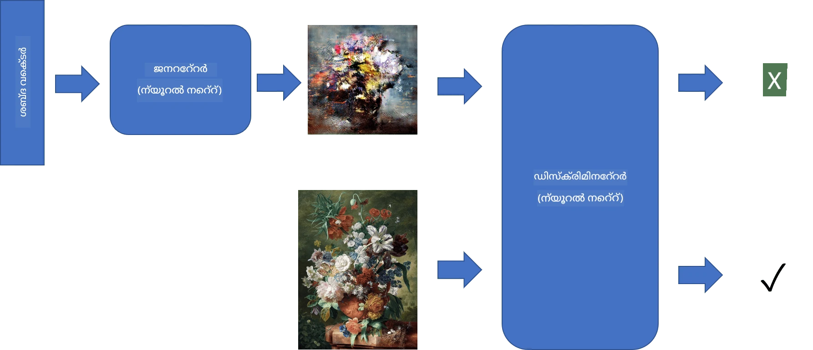
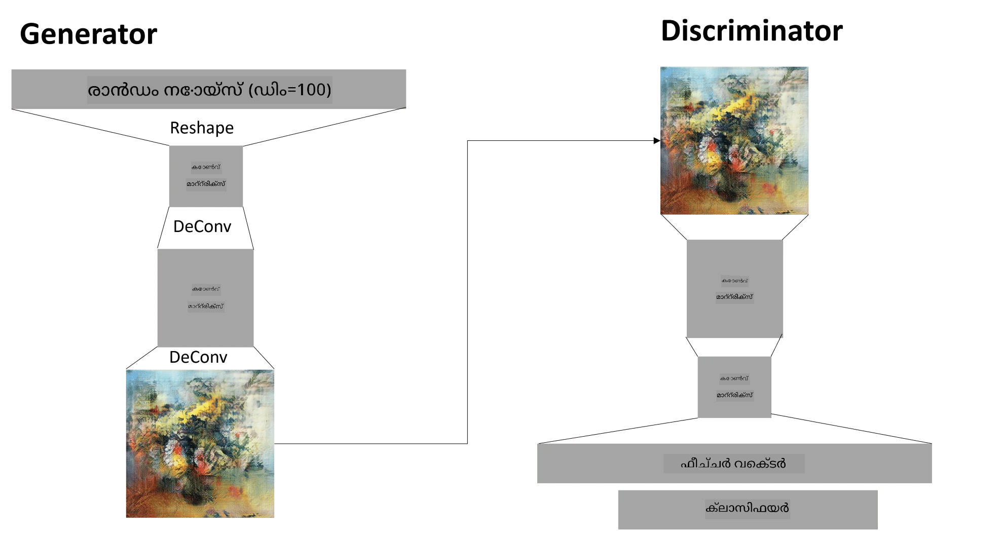

# ജനറേറ്റീവ് അഡ്വേഴ്സറിയൽ നെറ്റ്വർക്കുകൾ

മുൻവകുപ്പിൽ, നാം **ജനറേറ്റീവ് മോഡലുകൾ** എന്നതിനെക്കുറിച്ച് പഠിച്ചു: പരിശീലന ഡാറ്റാസെറ്റിലുള്ള ചിത്രങ്ങളോട് സമാനമായ പുതിയ ചിത്രങ്ങൾ സൃഷ്ടിക്കാൻ കഴിയുന്ന മോഡലുകൾ. VAE ഒരു നല്ല ഉദാഹരണമായിരുന്നു.

## [പ്രീ-ലെക്ചർ ക്വിസ്](https://ff-quizzes.netlify.app/en/ai/quiz/19)

എങ്കിലും, VAE ഉപയോഗിച്ച് യഥാർത്ഥത്തിൽ അർത്ഥവത്തായ, യുക്തിസഹമായ റെസല്യൂഷനിലുള്ള ഒരു പെയിന്റിംഗ് പോലുള്ള ഒന്നിനെ സൃഷ്ടിക്കാൻ ശ്രമിച്ചാൽ, പരിശീലനം നന്നായി സമാപിക്കാത്തതായി കാണും. ഈ ഉപയോഗത്തിനായി, പ്രത്യേകിച്ച് ജനറേറ്റീവ് മോഡലുകൾക്കായി ലക്ഷ്യമിട്ട മറ്റൊരു ആർക്കിടെക്ചർ പഠിക്കേണ്ടതാണ് - **ജനറേറ്റീവ് അഡ്വേഴ്സറിയൽ നെറ്റ്വർക്കുകൾ**, അല്ലെങ്കിൽ GANs.

GAN-ന്റെ പ്രധാന ആശയം രണ്ട് ന്യൂറൽ നെറ്റ്വർക്കുകൾ തമ്മിൽ പരസ്പരം മത്സരിച്ച് പരിശീലിക്കപ്പെടുക എന്നതാണ്:

> ചിത്രം: [Dmitry Soshnikov](http://soshnikov.com)

> ✅ ചെറിയ വാക്കുകൾ:
> * **ജനറേറ്റർ** ഒരു റാൻഡം വെക്ടർ സ്വീകരിച്ച്, ഫലമായി ചിത്രം സൃഷ്ടിക്കുന്ന നെറ്റ്വർക്കാണ്
> * **ഡിസ്ക്രിമിനേറ്റർ** ഒരു ചിത്രം സ്വീകരിച്ച് അത് യഥാർത്ഥ ചിത്രം (പരിശീലന ഡാറ്റാസെറ്റിൽ നിന്നുള്ളത്) ആണോ, ജനറേറ്റർ സൃഷ്ടിച്ചവയാണോ എന്ന് പറയേണ്ട നെറ്റ്വർക്കാണ്. ഇത് അടിസ്ഥാനപരമായി ഒരു ചിത്രം ക്ലാസിഫയർ ആണ്.

### ഡിസ്ക്രിമിനേറ്റർ

ഡിസ്ക്രിമിനേറ്ററിന്റെ ആർക്കിടെക്ചർ സാധാരണ ചിത്ര ക്ലാസിഫിക്കേഷൻ നെറ്റ്വർക്കിൽ നിന്ന് വ്യത്യസ്തമല്ല. ഏറ്റവും ലളിതമായ സാഹചര്യത്തിൽ ഇത് ഫുൾ-കണക്ടഡ് ക്ലാസിഫയർ ആയിരിക്കാം, പക്ഷേ സാധാരണയായി ഇത് [കോൺവല്യൂഷണൽ നെറ്റ്വർക്കായിരിക്കും](../07-ConvNets/README.md).

> ✅ കോൺവല്യൂഷണൽ നെറ്റ്വർക്കുകൾ അടിസ്ഥാനമാക്കിയ GAN-നെ [DCGAN](https://arxiv.org/pdf/1511.06434.pdf) എന്ന് വിളിക്കുന്നു

CNN ഡിസ്ക്രിമിനേറ്റർ താഴെപ്പറയുന്ന ലെയറുകൾ ഉൾക്കൊള്ളുന്നു: കുറയുന്ന സ്ഥലം വലുപ്പത്തോടെ നിരവധി കോൺവല്യൂഷനുകളും പൂളിംഗുകളും, തുടർന്ന് "ഫീച്ചർ വെക്ടർ" ലഭിക്കാൻ ഒരു അല്ലെങ്കിൽ കൂടുതൽ ഫുൾ-കണക്ടഡ് ലെയറുകൾ, ഒടുവിൽ ബൈനറി ക്ലാസിഫയർ.

> ✅ ഈ സാഹചര്യത്തിൽ 'പൂളിംഗ്' എന്നത് ചിത്രത്തിന്റെ വലുപ്പം കുറയ്ക്കുന്ന സാങ്കേതിക വിദ്യയാണ്. "പൂളിംഗ് ലെയറുകൾ ഒരു ലെയറിലെ ന്യൂറോൺ ക്ലസ്റ്ററുകളുടെ ഔട്ട്പുട്ടുകൾ അടുത്ത ലെയറിലെ ഒരു ന്യൂറോണായി സംയോജിപ്പിച്ച് ഡാറ്റയുടെ അളവുകൾ കുറയ്ക്കുന്നു." - [സ്രോതസ്സ്](https://wikipedia.org/wiki/Convolutional_neural_network#Pooling_layers)

### ജനറേറ്റർ

ജനറേറ്റർ കുറച്ച് കൂടുതൽ സങ്കീർണ്ണമാണ്. ഇത് ഒരു റിവേഴ്സഡ് ഡിസ്ക്രിമിനേറ്ററായി പരിഗണിക്കാം. latent വെക്ടറിൽ നിന്ന് (ഫീച്ചർ വെക്ടറിന്റെ പകരം), ആവശ്യമായ വലുപ്പത്തിലേക്ക് മാറ്റാൻ ഒരു ഫുൾ-കണക്ടഡ് ലെയർ ഉണ്ട്, തുടർന്ന് ഡീകോൺവല്യൂഷനുകളും അപ്സ്കെയ്ലിംഗും. ഇത് [ഓട്ടോഎൻകോഡർ](../09-Autoencoders/README.md)യുടെ *ഡീകോഡർ* ഭാഗത്തോട് സമാനമാണ്.

> ✅ കോൺവല്യൂഷൻ ലെയർ ചിത്രം താണ്ടുന്ന ലീനിയർ ഫിൽട്ടറായതിനാൽ, ഡീകോൺവല്യൂഷൻ അടിസ്ഥാനപരമായി കോൺവല്യൂഷനോട് സമാനമാണ്, അതേ ലെയർ ലജിക് ഉപയോഗിച്ച് നടപ്പിലാക്കാം.

> ചിത്രം: [Dmitry Soshnikov](http://soshnikov.com)

### GAN പരിശീലനം

GAN-കൾ **അഡ്വേഴ്സറിയൽ** എന്ന് വിളിക്കുന്നത് ജനറേറ്ററും ഡിസ്ക്രിമിനേറ്ററും തമ്മിൽ സ്ഥിരമായ മത്സരം ഉണ്ടാകുന്നതിനാലാണ്. ഈ മത്സരത്തിൽ, ഇരുവരും മെച്ചപ്പെടുന്നു, അതിനാൽ നെറ്റ്വർക്ക് മെച്ചപ്പെട്ട ചിത്രങ്ങൾ സൃഷ്ടിക്കാൻ പഠിക്കുന്നു.

പരിശീലനം രണ്ട് ഘട്ടങ്ങളിൽ നടക്കുന്നു:

* **ഡിസ്ക്രിമിനേറ്റർ പരിശീലനം**. ഇത് വളരെ നേരിയതാണ്: ജനറേറ്റർ ഉപയോഗിച്ച് ഒരു ബാച്ച് ചിത്രം സൃഷ്ടിച്ച് അവയ്ക്ക് 0 (കൃത്രിമ ചിത്രം) എന്ന ലേബൽ നൽകുന്നു, കൂടാതെ ഇൻപുട്ട് ഡാറ്റാസെറ്റിൽ നിന്നുള്ള യഥാർത്ഥ ചിത്രങ്ങളുടെ ബാച്ച് (ലേബൽ 1) എടുത്ത് *ഡിസ്ക്രിമിനേറ്റർ ലോസ്* ലഭിച്ച് ബാക്ക്‌പ്രൊപ്പഗേഷൻ നടത്തുന്നു.
* **ജനറേറ്റർ പരിശീലനം**. ഇത് കുറച്ച് സങ്കീർണ്ണമാണ്, കാരണം ജനറേറ്ററിന് നേരിട്ട് പ്രതീക്ഷിക്കുന്ന ഔട്ട്പുട്ട് അറിയില്ല. ജനറേറ്റർ-ഡിസ്ക്രിമിനേറ്റർ ചേർന്ന GAN നെറ്റ്വർക്ക് എടുത്ത്, റാൻഡം വെക്ടറുകൾ നൽകുകയും ഫലം 1 (യഥാർത്ഥ ചിത്രങ്ങൾക്കു സമാനമായ) ആകണമെന്ന് പ്രതീക്ഷിക്കുകയും ചെയ്യുന്നു. പിന്നീട് ഡിസ്ക്രിമിനേറ്ററിന്റെ പാരാമീറ്ററുകൾ ഫ്രീസ് ചെയ്ത് (ഈ ഘട്ടത്തിൽ അത് പരിശീലിക്കരുത്), ബാക്ക്‌പ്രൊപ്പഗേഷൻ നടത്തുന്നു.

ഈ പ്രക്രിയയിൽ, ജനറേറ്ററും ഡിസ്ക്രിമിനേറ്ററും ലോസ്സുകൾ വളരെ കുറയാതെ മാറുന്നു.理想的な状況では、両方のネットワークの性能が向上することに対応して、振動するはずです。

## ✍️ അഭ്യാസങ്ങൾ: GANs

* [TensorFlow/Keras-ൽ GAN നോട്ട്‌ബുക്ക്](GANTF.ipynb)
* [PyTorch-ൽ GAN നോട്ട്‌ബുക്ക്](GANPyTorch.ipynb)

### GAN പരിശീലനത്തിലെ പ്രശ്നങ്ങൾ

GAN-കൾ പരിശീലിപ്പിക്കാൻ പ്രത്യേകിച്ച് ബുദ്ധിമുട്ടുള്ളവയാണ്. ചില പ്രശ്നങ്ങൾ:

* **മോഡ് കോളാപ്സ്**. ഇതിന്റെ അർത്ഥം ജനറേറ്റർ ഒരു വിജയകരമായ ഒരു ചിത്രം മാത്രമാണ് സൃഷ്ടിക്കുന്നത്, പലവിധ ചിത്രങ്ങൾ അല്ല.
* **ഹൈപ്പർപാരാമീറ്ററുകളോട് സენსിറ്റിവിറ്റി**. GAN ഒരിക്കലും സമാപിക്കാത്തതായി കാണാം, പിന്നീട് ലേണിംഗ് റേറ്റ് കുറയുമ്പോൾ സമാപനം സംഭവിക്കുന്നു.
* ജനറേറ്ററും ഡിസ്ക്രിമിനേറ്ററും തമ്മിൽ **സമതുല്യത** നിലനിർത്തൽ. പലപ്പോഴും ഡിസ്ക്രിമിനേറ്റർ ലോസ് വേഗത്തിൽ 0-വരെയെത്തും, ഇത് ജനറേറ്റർക്ക് കൂടുതൽ പരിശീലനം നടത്താൻ കഴിയാതെ പോകും. ഇതിന് പരിഹാരമായി, ജനറേറ്ററിനും ഡിസ്ക്രിമിനേറ്ററിനും വ്യത്യസ്ത ലേണിംഗ് റേറ്റുകൾ നൽകാം, അല്ലെങ്കിൽ ലോസ് വളരെ കുറവായാൽ ഡിസ്ക്രിമിനേറ്റർ പരിശീലനം ഒഴിവാക്കാം.
* **ഉയർന്ന റെസല്യൂഷനിൽ** പരിശീലനം. ഓട്ടോഎൻകോഡറുകളിലെ പ്രശ്നം പോലെ, കോൺവല്യൂഷണൽ നെറ്റ്വർക്കിന്റെ അനേകം ലെയറുകൾ പുനർനിർമ്മിക്കുന്നത് ആർട്ടിഫാക്ടുകൾ ഉണ്ടാക്കുന്നു. ഇത് സാധാരണയായി **പ്രോഗ്രസീവ് ഗ്രോയിംഗ്** ഉപയോഗിച്ച് പരിഹരിക്കുന്നു, ആദ്യം കുറച്ച് ലെയറുകൾ കുറഞ്ഞ റെസല്യൂഷനിൽ പരിശീലിപ്പിച്ച്, പിന്നീട് ലെയറുകൾ "അൺബ്ലോക്ക്" ചെയ്യുകയോ ചേർക്കുകയോ ചെയ്യുന്നു. മറ്റൊരു പരിഹാരമായി ലെയറുകൾക്കിടയിൽ അധിക ബന്ധങ്ങൾ ചേർത്ത് ഒരേസമയം പല റെസല്യൂഷനുകളിലും പരിശീലനം നടത്താം - വിശദാംശങ്ങൾക്ക് ഈ [മൾട്ടി-സ്കെയിൽ ഗ്രേഡിയന്റ് GANs പേപ്പർ](https://arxiv.org/abs/1903.06048) കാണുക.

## സ്റ്റൈൽ ട്രാൻസ്ഫർ

GAN-കൾ കലാപരമായ ചിത്രങ്ങൾ സൃഷ്ടിക്കാൻ മികച്ച മാർഗമാണ്. മറ്റൊരു രസകരമായ സാങ്കേതിക വിദ്യ **സ്റ്റൈൽ ട്രാൻസ്ഫർ** ആണ്, ഇത് ഒരു **കണ്ടന്റ് ചിത്രം** എടുത്ത്, അതിനെ വ്യത്യസ്ത സ്റ്റൈലിൽ പുനരാഖ്യാനം ചെയ്യുന്നു, **സ്റ്റൈൽ ചിത്രം** നിന്നുള്ള ഫിൽട്ടറുകൾ പ്രയോഗിച്ച്.

ഇത് പ്രവർത്തിക്കുന്നത് ഇങ്ങനെ:

* നാം ഒരു റാൻഡം നോയിസ് ചിത്രം (അല്ലെങ്കിൽ കണ്ടന്റ് ചിത്രം, പക്ഷേ മനസ്സിലാക്കാൻ റാൻഡം നോയിസ് തുടങ്ങുന്നത് എളുപ്പമാണ്) ഉപയോഗിച്ച് തുടങ്ങുന്നു
* ലക്ഷ്യം ഇങ്ങനെ ഒരു ചിത്രം സൃഷ്ടിക്കുക എന്നതാണ്, അത് കണ്ടന്റ് ചിത്രത്തിനും സ്റ്റൈൽ ചിത്രത്തിനും അടുത്തതായിരിക്കും. ഇത് രണ്ട് ലോസ് ഫംഗ്ഷനുകൾ ഉപയോഗിച്ച് നിർണ്ണയിക്കും:
   - **കണ്ടന്റ് ലോസ്** നിലവിലെ ചിത്രം, കണ്ടന്റ് ചിത്രം എന്നിവയിൽ നിന്നുള്ള CNN-ൽ ചില ലെയറുകളിൽ നിന്നുള്ള ഫീച്ചറുകൾ അടിസ്ഥാനമാക്കി കണക്കാക്കുന്നു
   - **സ്റ്റൈൽ ലോസ്** നിലവിലെ ചിത്രം, സ്റ്റൈൽ ചിത്രം എന്നിവയിൽ ഗ്രാം മാട്രിസുകൾ ഉപയോഗിച്ച് ബുദ്ധിമുട്ടുള്ള രീതിയിൽ കണക്കാക്കുന്നു (കൂടുതൽ വിശദാംശങ്ങൾ [ഉദാഹരണ നോട്ട്‌ബുക്കിൽ](StyleTransfer.ipynb))
* ചിത്രം മൃദുവാക്കാനും നോയിസ് നീക്കാനും, **വേരിയേഷൻ ലോസ്** പരിചയപ്പെടുത്തുന്നു, ഇത് സമീപമുള്ള പിക്‌സലുകൾ തമ്മിലുള്ള ശരാശരി ദൂരം കണക്കാക്കുന്നു
* പ്രധാന ഓപ്റ്റിമൈസേഷൻ ലൂപ്പ് ഗ്രേഡിയന്റ് ഡിസെന്റ് (അല്ലെങ്കിൽ മറ്റേതെങ്കിലും ഓപ്റ്റിമൈസേഷൻ ആൽഗോരിതം) ഉപയോഗിച്ച് നിലവിലെ ചിത്രം ക്രമീകരിച്ച് മൊത്തം ലോസ് (മൂന്ന് ലോസുകളുടെ ഭാരിത സംയോജനം) കുറയ്ക്കുന്നു.

## ✍️ ഉദാഹരണം: [സ്റ്റൈൽ ട്രാൻസ്ഫർ](StyleTransfer.ipynb)

## [പോസ്റ്റ്-ലെക്ചർ ക്വിസ്](https://ff-quizzes.netlify.app/en/ai/quiz/20)

## സമാപനം

ഈ പാഠത്തിൽ, നിങ്ങൾ GANs-നെക്കുറിച്ച് പഠിച്ചു, അവയെ എങ്ങനെ പരിശീലിപ്പിക്കാമെന്ന് മനസ്സിലാക്കി. ഈ തരം ന്യൂറൽ നെറ്റ്വർക്കുകൾ നേരിടുന്ന പ്രത്യേക വെല്ലുവിളികളും അവ മറികടക്കാനുള്ള ചില തന്ത്രങ്ങളും നിങ്ങൾക്ക് അറിയാം.

## 🚀 ചലഞ്ച്

നിങ്ങളുടെ സ്വന്തം ചിത്രങ്ങൾ ഉപയോഗിച്ച് [സ്റ്റൈൽ ട്രാൻസ്ഫർ നോട്ട്‌ബുക്ക്](StyleTransfer.ipynb) പ്രവർത്തിപ്പിക്കുക.

## അവലോകനം & സ്വയം പഠനം

റഫറൻസിനായി, GANs-നെക്കുറിച്ച് കൂടുതൽ വായിക്കുക:

* Marco Pasini, [10 Lessons I Learned Training GANs for one Year](https://towardsdatascience.com/10-lessons-i-learned-training-generative-adversarial-networks-gans-for-a-year-c9071159628)
* [StyleGAN](https://en.wikipedia.org/wiki/StyleGAN), പരിഗണിക്കേണ്ട ഒരു *de facto* GAN ആർക്കിടെക്ചർ
* [Azure ML-ൽ GANs ഉപയോഗിച്ച് ജനറേറ്റീവ് ആർട്ട് സൃഷ്ടിക്കൽ](https://soshnikov.com/scienceart/creating-generative-art-using-gan-on-azureml/)

## അസൈൻമെന്റ്

ഈ പാഠവുമായി ബന്ധപ്പെട്ട രണ്ട് നോട്ട്‌ബുക്കുകളിൽ ഒന്നിൽ തിരിച്ച് പോയി GAN നിങ്ങളുടെ സ്വന്തം ചിത്രങ്ങളിൽ വീണ്ടും പരിശീലിപ്പിക്കുക. നിങ്ങൾ എന്ത് സൃഷ്ടിക്കാനാകും?

---

<!-- CO-OP TRANSLATOR DISCLAIMER START -->
**അസൂയാ**:  
ഈ രേഖ AI വിവർത്തന സേവനം [Co-op Translator](https://github.com/Azure/co-op-translator) ഉപയോഗിച്ച് വിവർത്തനം ചെയ്തതാണ്. നാം കൃത്യതയ്ക്ക് ശ്രമിച്ചിട്ടുണ്ടെങ്കിലും, സ്വയം പ്രവർത്തിക്കുന്ന വിവർത്തനങ്ങളിൽ പിശകുകൾ അല്ലെങ്കിൽ തെറ്റുകൾ ഉണ്ടാകാമെന്ന് ദയവായി ശ്രദ്ധിക്കുക. അതിന്റെ മാതൃഭാഷയിലുള്ള യഥാർത്ഥ രേഖയാണ് പ്രാമാണികമായ ഉറവിടം എന്ന് പരിഗണിക്കേണ്ടതാണ്. നിർണായകമായ വിവരങ്ങൾക്ക്, പ്രൊഫഷണൽ മനുഷ്യ വിവർത്തനം ശുപാർശ ചെയ്യപ്പെടുന്നു. ഈ വിവർത്തനം ഉപയോഗിക്കുന്നതിൽ നിന്നുണ്ടാകുന്ന ഏതെങ്കിലും തെറ്റിദ്ധാരണകൾക്കോ തെറ്റായ വ്യാഖ്യാനങ്ങൾക്കോ ഞങ്ങൾ ഉത്തരവാദികളല്ല.
<!-- CO-OP TRANSLATOR DISCLAIMER END -->