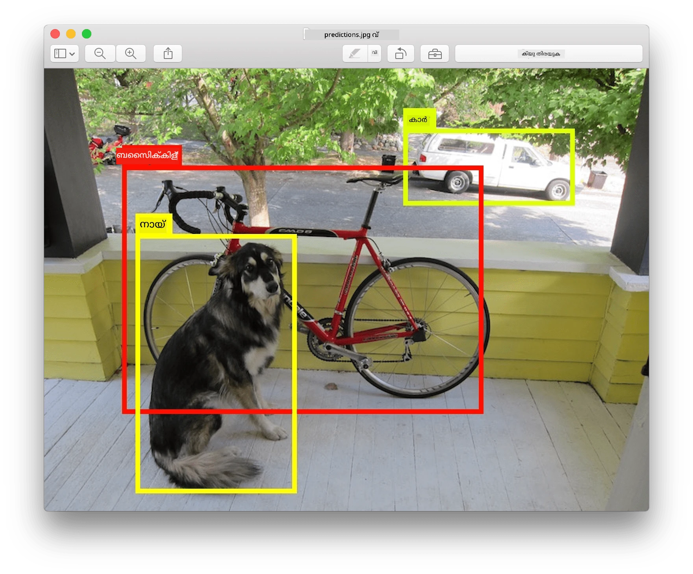
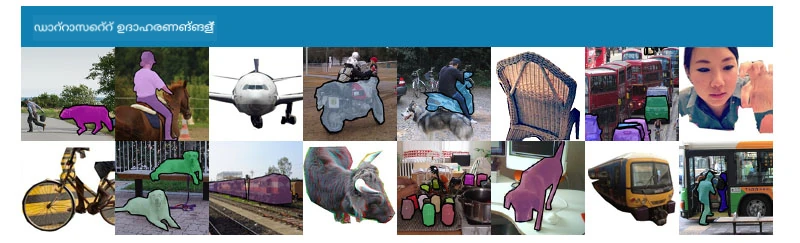
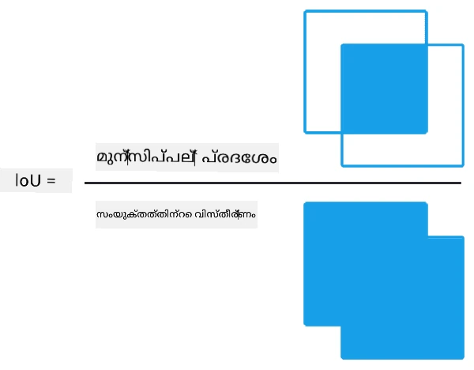
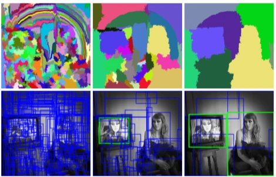
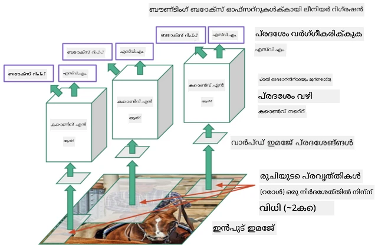
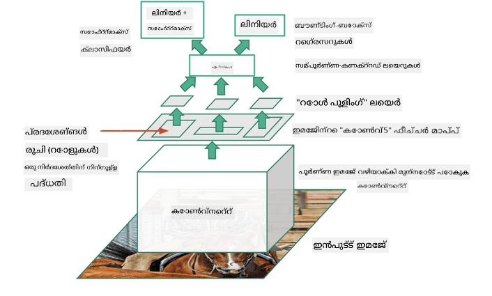
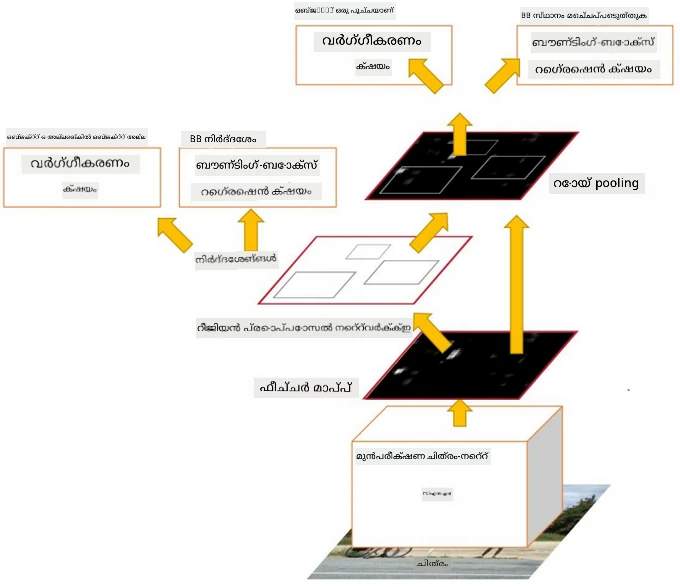
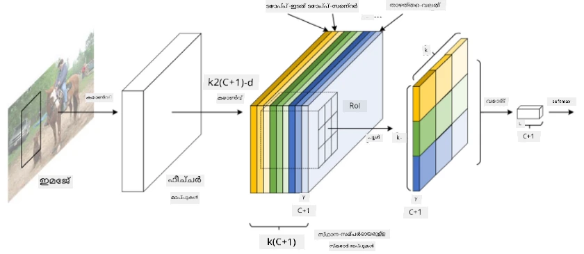
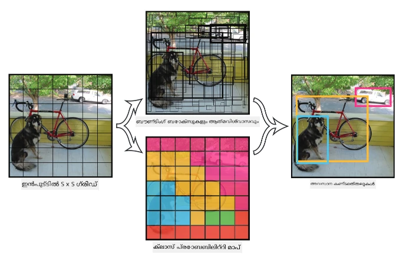

# ഒബ്ജക്റ്റ് ഡിറ്റക്ഷൻ

ഇതുവരെ കൈകാര്യം ചെയ്ത ഇമേജ് ക്ലാസിഫിക്കേഷൻ മോഡലുകൾ ഒരു ചിത്രം എടുത്ത് ഒരു വർഗ്ഗീയ ഫലം ഉത്പാദിപ്പിച്ചിരുന്നു, ഉദാഹരണത്തിന് MNIST പ്രശ്നത്തിലെ 'നമ്പർ' ക്ലാസ്. എന്നാൽ പലപ്പോഴും ഒരു ചിത്രത്തിൽ വസ്തുക്കൾ കാണപ്പെടുന്നുവെന്ന് അറിയുന്നതിൽ മാത്രമല്ല, അവയുടെ കൃത്യമായ സ്ഥാനം കണ്ടെത്താൻ ആഗ്രഹിക്കുന്നു. ഇതാണ് **ഒബ്ജക്റ്റ് ഡിറ്റക്ഷൻ** എന്നതിന്റെ പ്രധാന ലക്ഷ്യം.

## [പ്രീ-ലെക്ചർ ക്വിസ്](https://ff-quizzes.netlify.app/en/ai/quiz/21)

> ചിത്രം [YOLO v2 വെബ്‌സൈറ്റ്](https://pjreddie.com/darknet/yolov2/) നിന്നാണ്

## ഒബ്ജക്റ്റ് ഡിറ്റക്ഷനിലേക്കുള്ള ഒരു ലളിതമായ സമീപനം

ഒരു ചിത്രത്തിൽ പൂച്ച കണ്ടെത്തണമെന്ന് കരുതുമ്പോൾ, ഒബ്ജക്റ്റ് ഡിറ്റക്ഷനിലേക്കുള്ള വളരെ ലളിതമായ ഒരു സമീപനം ഇതാണ്:

1. ചിത്രത്തെ പല ടൈലുകളായി വിഭജിക്കുക
2. ഓരോ ടൈലിലും ഇമേജ് ക്ലാസിഫിക്കേഷൻ നടത്തുക
3. ഉയർന്ന ആക്ടിവേഷൻ ലഭിക്കുന്ന ടൈലുകൾ ആ വസ്തു അടങ്ങിയതായി കരുതാം

> *ചിത്രം [Exercise Notebook](ObjectDetection-TF.ipynb) നിന്നാണ്*

എങ്കിലും, ഈ സമീപനം വളരെ കൃത്യമായ ബൗണ്ടിംഗ് ബോക്സ് സ്ഥാനം കണ്ടെത്താൻ കഴിയാത്തതിനാൽ അനുയോജ്യമല്ല. കൂടുതൽ കൃത്യമായ സ്ഥാനം കണ്ടെത്താൻ, ബൗണ്ടിംഗ് ബോക്സുകളുടെ കോഓർഡിനേറ്റുകൾ പ്രവചിക്കാൻ ഒരു തരത്തിലുള്ള **റെഗ്രഷൻ** നടത്തേണ്ടതുണ്ട് - അതിനായി പ്രത്യേക ഡാറ്റാസെറ്റുകൾ ആവശ്യമാണ്.

## ഒബ്ജക്റ്റ് ഡിറ്റക്ഷനിലേക്കുള്ള റെഗ്രഷൻ

[ഈ ബ്ലോഗ് പോസ്റ്റ്](https://towardsdatascience.com/object-detection-with-neural-networks-a4e2c46b4491) ആകൃതികൾ കണ്ടെത്തുന്നതിന് ഒരു സൗമ്യമായ പരിചയം നൽകുന്നു.

## ഒബ്ജക്റ്റ് ഡിറ്റക്ഷനുള്ള ഡാറ്റാസെറ്റുകൾ

ഈ ടാസ്കിനായി നിങ്ങൾക്ക് താഴെപ്പറയുന്ന ഡാറ്റാസെറ്റുകൾ കാണാം:

* [PASCAL VOC](http://host.robots.ox.ac.uk/pascal/VOC/) - 20 ക്ലാസുകൾ
* [COCO](http://cocodataset.org/#home) - Common Objects in Context. 80 ക്ലാസുകൾ, ബൗണ്ടിംഗ് ബോക്സുകളും സെഗ്മെന്റേഷൻ മാസ്കുകളും

## ഒബ്ജക്റ്റ് ഡിറ്റക്ഷൻ മെട്രിക്‌സ്

### Intersection over Union

ഇമേജ് ക്ലാസിഫിക്കേഷനിൽ ആൽഗോരിതത്തിന്റെ പ്രകടനം എളുപ്പത്തിൽ അളക്കാമെങ്കിലും, ഒബ്ജക്റ്റ് ഡിറ്റക്ഷനിൽ ക്ലാസിന്റെ ശരിതത്വവും ബൗണ്ടിംഗ് ബോക്സിന്റെ കൃത്യതയും അളക്കേണ്ടതുണ്ട്. ഇതിന് **Intersection over Union** (IoU) ഉപയോഗിക്കുന്നു, ഇത് രണ്ട് ബോക്സുകൾ (അഥവാ രണ്ട് ഏരിയകൾ) എത്രമാത്രം ഒതുക്കപ്പെടുന്നുവെന്ന് അളക്കുന്നു.

> *ചിത്രം [ഈ മികച്ച ബ്ലോഗ് പോസ്റ്റ്](https://pyimagesearch.com/2016/11/07/intersection-over-union-iou-for-object-detection/) നിന്നാണ്*

സങ്കൽപ്പം ലളിതമാണ് - രണ്ട് ആകൃതികളുടെ മധ്യേ ഉള്ള ഒത്തുചേരുന്ന പ്രദേശത്തിന്റെ വിസ്തീർണ്ണം അവരുടെ സംയോജിത വിസ്തീർണ്ണം കൊണ്ട് വിഭജിക്കുന്നു. രണ്ട് സമാനമായ പ്രദേശങ്ങൾക്ക് IoU 1 ആകും, പൂർണ്ണമായും വേർപിരിഞ്ഞ പ്രദേശങ്ങൾക്ക് 0 ആകും. മറ്റ് സാഹചര്യങ്ങളിൽ ഇത് 0 മുതൽ 1 വരെ വ്യത്യാസപ്പെടും. സാധാരണയായി IoU ഒരു നിശ്ചിത മൂല്യത്തിന് മുകളിൽ ഉള്ള ബൗണ്ടിംഗ് ബോക്സുകൾ മാത്രം പരിഗണിക്കുന്നു.

### ശരാശരി പ്രിസിഷൻ

ഒരു ക്ലാസ് $C$ എത്രമാത്രം ശരിയായി തിരിച്ചറിയപ്പെടുന്നുവെന്ന് അളക്കാൻ **Average Precision** ഉപയോഗിക്കുന്നു, ഇത് ഇങ്ങനെ കണക്കാക്കുന്നു:

1. Precision-Recall വളവ് ഒരു ഡിറ്റക്ഷൻ ത്രെഷോൾഡ് മൂല്യത്തിന്റെ (0 മുതൽ 1 വരെ) അടിസ്ഥാനത്തിൽ കൃത്യത കാണിക്കുന്നു.
2. ത്രെഷോൾഡ് അനുസരിച്ച് ചിത്രത്തിൽ കണ്ടെത്തുന്ന വസ്തുക്കളുടെ എണ്ണം, പ്രിസിഷനും റീക്കോളും വ്യത്യാസപ്പെടും.
3. വളവ് ഇങ്ങനെ കാണപ്പെടും:

> *ചിത്രം [NeuroWorkshop](http://github.com/shwars/NeuroWorkshop) നിന്നാണ്*

ക്ലാസ് $C$ നുള്ള ശരാശരി പ്രിസിഷൻ ഈ വളവിന്റെ കീഴിലുള്ള വിസ്തീർണ്ണമാണ്. കൂടുതൽ കൃത്യമായി, Recall അക്ഷം സാധാരണയായി 10 ഭാഗങ്ങളായി വിഭജിച്ച്, ആ പോയിന്റുകളിൽ പ്രിസിഷൻ ശരാശരി എടുക്കുന്നു:

$$
AP = {1\over11}\sum_{i=0}^{10}\mbox{Precision}(\mbox{Recall}={i\over10})
$$

### APയും IoUയും

IoU ഒരു നിശ്ചിത മൂല്യത്തിന് മുകളിൽ ഉള്ള ഡിറ്റക്ഷനുകൾ മാത്രം പരിഗണിക്കും. ഉദാഹരണത്തിന്, PASCAL VOC ഡാറ്റാസെറ്റിൽ സാധാരണയായി $\mbox{IoU Threshold} = 0.5$ ആണ് ഉപയോഗിക്കുന്നത്, COCOയിൽ AP വ്യത്യസ്ത IoU ത്രെഷോൾഡുകൾക്കായി അളക്കുന്നു.

> *ചിത്രം [NeuroWorkshop](http://github.com/shwars/NeuroWorkshop) നിന്നാണ്*

### ശരാശരി ശരാശരി പ്രിസിഷൻ - mAP

ഒബ്ജക്റ്റ് ഡിറ്റക്ഷനിലെ പ്രധാന മെട്രിക് **Mean Average Precision** അല്ലെങ്കിൽ **mAP** ആണ്. ഇത് എല്ലാ വസ്തു ക്ലാസുകളിലെയും ശരാശരി പ്രിസിഷന്റെ ശരാശരിയാണ്, ചിലപ്പോൾ IoU ത്രെഷോൾഡുകൾക്കുമപ്പുറം ശരാശരി എടുക്കുന്നു. കൂടുതൽ വിശദമായി, **mAP** കണക്കാക്കുന്ന പ്രക്രിയ [ഈ ബ്ലോഗ് പോസ്റ്റ്](https://medium.com/@timothycarlen/understanding-the-map-evaluation-metric-for-object-detection-a07fe6962cf3)) ൽ വിവരിച്ചിരിക്കുന്നു, കൂടാതെ [ഇവിടെ കോഡ് സാമ്പിളുകളോടൊപ്പം](https://gist.github.com/tarlen5/008809c3decf19313de216b9208f3734) കാണാം.

## വ്യത്യസ്ത ഒബ്ജക്റ്റ് ഡിറ്റക്ഷൻ സമീപനങ്ങൾ

ഒബ്ജക്റ്റ് ഡിറ്റക്ഷൻ ആൽഗോരിതങ്ങൾ രണ്ട് പ്രധാന വിഭാഗങ്ങളിലായി വേർതിരിക്കാം:

* **Region Proposal Networks** (R-CNN, Fast R-CNN, Faster R-CNN). പ്രധാന ആശയം **Regions of Interests** (ROI) സൃഷ്ടിച്ച് അവയിൽ CNN ഓടിച്ച് പരമാവധി ആക്ടിവേഷൻ കണ്ടെത്തുക എന്നതാണ്. ലളിതമായ സമീപനത്തോട് സാമ്യമുണ്ട്, പക്ഷേ ROIകൾ കൂടുതൽ ബുദ്ധിമുട്ടുള്ള രീതിയിൽ സൃഷ്ടിക്കുന്നു. ഈ രീതികളുടെ പ്രധാന ദോഷം സ്ലോ ആയിരിക്കുക ആണ്, കാരണം ചിത്രത്തിൽ CNN ക്ലാസിഫയർ പല തവണ ഓടിക്കേണ്ടിവരും.
* **One-pass** (YOLO, SSD, RetinaNet) രീതികൾ. ഈ ആർക്കിടെക്ചറുകളിൽ ക്ലാസുകളും ROIകളും ഒരേ പാസ്സിൽ പ്രവചിക്കാൻ നെറ്റ്‌വർക്ക് രൂപകൽപ്പന ചെയ്യുന്നു.

### R-CNN: Region-Based CNN

[R-CNN](http://islab.ulsan.ac.kr/files/announcement/513/rcnn_pami.pdf) [Selective Search](http://www.huppelen.nl/publications/selectiveSearchDraft.pdf) ഉപയോഗിച്ച് ROI പ്രദേശങ്ങളുടെ ഹയർആർക്കിക്കൽ ഘടന സൃഷ്ടിക്കുന്നു, പിന്നീട് CNN ഫീച്ചർ എക്സ്ട്രാക്ടറുകളും SVM ക്ലാസിഫയറുകളും ഉപയോഗിച്ച് വസ്തു ക്ലാസ് നിർണയിക്കുന്നു, ലീനിയർ റെഗ്രഷൻ ഉപയോഗിച്ച് *ബൗണ്ടിംഗ് ബോക്സ്* കോഓർഡിനേറ്റുകൾ കണ്ടെത്തുന്നു. [അധികൃത പേപ്പർ](https://arxiv.org/pdf/1506.01497v1.pdf)

> *ചിത്രം van de Sande et al. ICCV’11*

> *ചിത്രങ്ങൾ [ഈ ബ്ലോഗ്](https://towardsdatascience.com/r-cnn-fast-r-cnn-faster-r-cnn-yolo-object-detection-algorithms-36d53571365e) നിന്നാണ്*

### F-RCNN - ഫാസ്റ്റ് R-CNN

R-CNN പോലെയാണ്, പക്ഷേ പ്രദേശങ്ങൾ കോൺവല്യൂഷൻ ലെയറുകൾ പ്രയോഗിച്ചതിന് ശേഷം നിർവചിക്കുന്നു.

> ചിത്രം [അധികൃത പേപ്പർ](https://www.cv-foundation.org/openaccess/content_iccv_2015/papers/Girshick_Fast_R-CNN_ICCV_2015_paper.pdf), [arXiv](https://arxiv.org/pdf/1504.08083.pdf), 2015

### Faster R-CNN

ഈ സമീപനത്തിന്റെ പ്രധാന ആശയം ROIകൾ പ്രവചിക്കാൻ ഒരു ന്യൂറൽ നെറ്റ്‌വർക്ക് ഉപയോഗിക്കുക എന്നതാണ് - ഇതാണ് *Region Proposal Network*. [പേപ്പർ](https://arxiv.org/pdf/1506.01497.pdf), 2016

> ചിത്രം [അധികൃത പേപ്പർ](https://arxiv.org/pdf/1506.01497.pdf)

### R-FCN: Region-Based Fully Convolutional Network

Faster R-CNN-നേക്കാൾ വേഗത്തിൽ പ്രവർത്തിക്കുന്ന ആൽഗോരിതമാണ് ഇത്. പ്രധാന ആശയം:

1. ResNet-101 ഉപയോഗിച്ച് ഫീച്ചറുകൾ എടുക്കുന്നു
2. ഫീച്ചറുകൾ **Position-Sensitive Score Map** ഉപയോഗിച്ച് പ്രോസസ്സ് ചെയ്യുന്നു. $C$ ക്ലാസുകളിലുള്ള ഓരോ വസ്തുവും $k\times k$ പ്രദേശങ്ങളായി വിഭജിച്ച്, വസ്തുവിന്റെ ഭാഗങ്ങൾ പ്രവചിക്കാൻ പരിശീലനം നൽകുന്നു.
3. $k\times k$ പ്രദേശങ്ങളിലെ ഓരോ ഭാഗത്തിനും എല്ലാ നെറ്റ്‌വർക്കുകളും വസ്തു ക്ലാസുകൾക്ക് വോട്ട് ചെയ്യുന്നു, പരമാവധി വോട്ട് ലഭിച്ച ക്ലാസ് തിരഞ്ഞെടുക്കുന്നു.

> ചിത്രം [അധികൃത പേപ്പർ](https://arxiv.org/abs/1605.06409)

### YOLO - You Only Look Once

YOLO ഒരു റിയൽടൈം ഒന്ന്-പാസ്സ് ആൽഗോരിതമാണ്. പ്രധാന ആശയം:

 * ചിത്രം $S\times S$ പ്രദേശങ്ങളായി വിഭജിക്കുന്നു
 * ഓരോ പ്രദേശത്തിനും **CNN** $n$ സാധ്യതയുള്ള വസ്തുക്കൾ, *ബൗണ്ടിംഗ് ബോക്സ്* കോഓർഡിനേറ്റുകൾ, *confidence*=*probability* * IoU പ്രവചിക്കുന്നു.

 

> ചിത്രം [അധികൃത പേപ്പർ](https://arxiv.org/abs/1506.02640)

### മറ്റ് ആൽഗോരിതങ്ങൾ

* RetinaNet: [അധികൃത പേപ്പർ](https://arxiv.org/abs/1708.02002)
   - [PyTorch ഇംപ്ലിമെന്റേഷൻ Torchvision-ൽ](https://pytorch.org/vision/stable/_modules/torchvision/models/detection/retinanet.html)
   - [Keras ഇംപ്ലിമെന്റേഷൻ](https://github.com/fizyr/keras-retinanet)
   - [RetinaNet ഉപയോഗിച്ച് ഒബ്ജക്റ്റ് ഡിറ്റക്ഷൻ](https://keras.io/examples/vision/retinanet/) Keras സാമ്പിളുകളിൽ
* SSD (Single Shot Detector): [അധികൃത പേപ്പർ](https://arxiv.org/abs/1512.02325)

## ✍️ അഭ്യാസങ്ങൾ: ഒബ്ജക്റ്റ് ഡിറ്റക്ഷൻ

താഴെപ്പറയുന്ന നോട്ട്‌ബുക്കിൽ നിങ്ങളുടെ പഠനം തുടരുക:

[ObjectDetection.ipynb](ObjectDetection.ipynb)

## സമാപനം

ഈ പാഠത്തിൽ ഒബ്ജക്റ്റ് ഡിറ്റക്ഷൻ സാധ്യമാക്കാനുള്ള വിവിധ മാർഗങ്ങൾ നിങ്ങൾക്ക് ഒരു സംക്ഷിപ്ത അവലോകനം ലഭിച്ചു!

## 🚀 ചലഞ്ച്

YOLO-യെക്കുറിച്ചുള്ള ഈ ലേഖനങ്ങളും നോട്ട്‌ബുക്കുകളും വായിച്ച് സ്വയം പരീക്ഷിച്ച് നോക്കൂ

* [YOLO വിശദീകരിക്കുന്ന നല്ല ബ്ലോഗ് പോസ്റ്റ്](https://www.analyticsvidhya.com/blog/2018/12/practical-guide-object-detection-yolo-framewor-python/)
 * [അധികൃത സൈറ്റ്](https://pjreddie.com/darknet/yolo/)
 * YOLO: [Keras ഇംപ്ലിമെന്റേഷൻ](https://github.com/experiencor/keras-yolo2), [പടി-പടി നോട്ട്‌ബുക്ക്](https://github.com/experiencor/basic-yolo-keras/blob/master/Yolo%20Step-by-Step.ipynb)
 * YOLO v2: [Keras ഇംപ്ലിമെന്റേഷൻ](https://github.com/experiencor/keras-yolo2), [പടി-പടി നോട്ട്‌ബുക്ക്](https://github.com/experiencor/keras-yolo2/blob/master/Yolo%20Step-by-Step.ipynb)

## [പോസ്റ്റ്-ലെക്ചർ ക്വിസ്](https://ff-quizzes.netlify.app/en/ai/quiz/22)

## അവലോകനം & സ്വയം പഠനം

* [ഒബ്ജക്റ്റ് ഡിറ്റക്ഷൻ](https://tjmachinelearning.com/lectures/1718/obj/) - നിഖിൽ സർദാന
* [ഒബ്ജക്റ്റ് ഡിറ്റക്ഷൻ ആൽഗോരിതങ്ങളുടെ നല്ല താരതമ്യം](https://lilianweng.github.io/lil-log/2018/12/27/object-detection-part-4.html)
* [ഒബ്ജക്റ്റ് ഡിറ്റക്ഷനുള്ള ഡീപ് ലേണിംഗ് ആൽഗോരിതങ്ങളുടെ അവലോകനം](https://medium.com/comet-app/review-of-deep-learning-algorithms-for-object-detection-c1f3d437b852)
* [അടിസ്ഥാന ഒബ്ജക്റ്റ് ഡിറ്റക്ഷൻ ആൽഗോരിതങ്ങളിലേക്കുള്ള പടി-പടി പരിചയം](https://www.analyticsvidhya.com/blog/2018/10/a-step-by-step-introduction-to-the-basic-object-detection-algorithms-part-1/)
* [Python-ൽ Faster R-CNN ഇംപ്ലിമെന്റേഷൻ ഒബ്ജക്റ്റ് ഡിറ്റക്ഷനായി](https://www.analyticsvidhya.com/blog/2018/11/implementation-faster-r-cnn-python-object-detection/)

## [അസൈൻമെന്റ്: ഒബ്ജക്റ്റ് ഡിറ്റക്ഷൻ](lab/README.md)

---

<!-- CO-OP TRANSLATOR DISCLAIMER START -->
**അസൂയാ**:  
ഈ രേഖ AI വിവർത്തന സേവനം [Co-op Translator](https://github.com/Azure/co-op-translator) ഉപയോഗിച്ച് വിവർത്തനം ചെയ്തതാണ്. നാം കൃത്യതയ്ക്ക് ശ്രമിച്ചിട്ടുണ്ടെങ്കിലും, സ്വയം പ്രവർത്തിക്കുന്ന വിവർത്തനങ്ങളിൽ പിശകുകൾ അല്ലെങ്കിൽ തെറ്റുകൾ ഉണ്ടാകാമെന്ന് ദയവായി ശ്രദ്ധിക്കുക. അതിന്റെ മാതൃഭാഷയിലുള്ള യഥാർത്ഥ രേഖയാണ് പ്രാമാണികമായ ഉറവിടം എന്ന് പരിഗണിക്കേണ്ടതാണ്. നിർണായകമായ വിവരങ്ങൾക്ക്, പ്രൊഫഷണൽ മനുഷ്യ വിവർത്തനം ശുപാർശ ചെയ്യപ്പെടുന്നു. ഈ വിവർത്തനം ഉപയോഗിക്കുന്നതിൽ നിന്നുണ്ടാകുന്ന ഏതെങ്കിലും തെറ്റിദ്ധാരണകൾക്കോ തെറ്റായ വ്യാഖ്യാനങ്ങൾക്കോ ഞങ്ങൾ ഉത്തരവാദികളല്ല.
<!-- CO-OP TRANSLATOR DISCLAIMER END -->