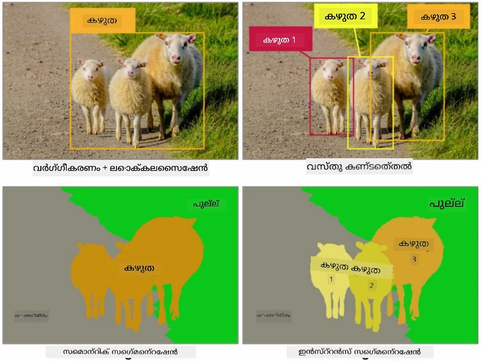
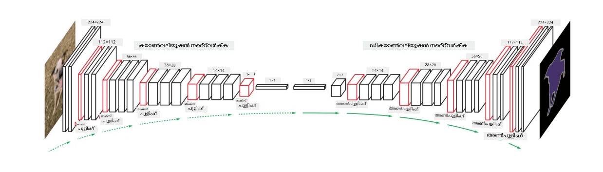
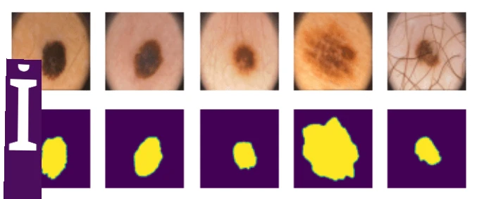

# സെഗ്മെന്റേഷൻ

നാം മുമ്പ് ഒബ്ജക്റ്റ് ഡിറ്റക്ഷൻ പഠിച്ചിരുന്നു, ഇത് ചിത്രത്തിൽ ഉള്ള വസ്തുക്കളുടെ *ബൗണ്ടിംഗ് ബോക്സുകൾ* പ്രവചിച്ച് അവ കണ്ടെത്താൻ സഹായിക്കുന്നു. എന്നാൽ ചില ജോലികൾക്ക് ബൗണ്ടിംഗ് ബോക്സുകൾ മാത്രമല്ല, കൂടുതൽ കൃത്യമായ വസ്തു സ്ഥിതിഗതികൾ ആവശ്യമുണ്ട്. ഈ ജോലിയാണ് **സെഗ്മെന്റേഷൻ** എന്ന് വിളിക്കുന്നത്.

## [പ്രീ-ലെക്ചർ ക്വിസ്](https://ff-quizzes.netlify.app/en/ai/quiz/23)

സെഗ്മെന്റേഷൻ **പിക്‌സൽ ക്ലാസിഫിക്കേഷൻ** എന്ന രീതിയിൽ കാണാം, ചിത്രത്തിലെ **ഓരോ** പിക്‌സലിനും അതിന്റെ ക്ലാസ് പ്രവചിക്കണം (*ബാക്ക്ഗ്രൗണ്ട്* ക്ലാസ്സുകളിൽ ഒന്നാണ്). പ്രധാനമായും രണ്ട് സെഗ്മെന്റേഷൻ ആൽഗോരിതങ്ങൾ ഉണ്ട്:

* **സെമാന്റിക് സെഗ്മെന്റേഷൻ** പിക്‌സലിന്റെ ക്ലാസ് മാത്രം പറയുന്നു, ഒരേ ക്ലാസ്സിലുള്ള വ്യത്യസ്ത വസ്തുക്കളെ വേർതിരിക്കില്ല
* **ഇൻസ്റ്റൻസ് സെഗ്മെന്റേഷൻ** ക്ലാസ്സുകളെ വ്യത്യസ്ത ഇൻസ്റ്റൻസുകളായി വിഭജിക്കുന്നു.

ഇൻസ്റ്റൻസ് സെഗ്മെന്റേഷനിൽ, ഈ ആടുകൾ വ്യത്യസ്ത വസ്തുക്കളാണ്, എന്നാൽ സെമാന്റിക് സെഗ്മെന്റേഷനിൽ എല്ലാ ആടുകളും ഒരേ ക്ലാസ്സായി പ്രതിനിധീകരിക്കുന്നു.

> ചിത്രം [ഈ ബ്ലോഗ് പോസ്റ്റ്](https://nirmalamurali.medium.com/image-classification-vs-semantic-segmentation-vs-instance-segmentation-625c33a08d50) നിന്നാണ്

സെഗ്മെന്റേഷനിനായി വിവിധ ന്യൂറൽ ആർക്കിടെക്ചറുകൾ ഉണ്ട്, എന്നാൽ അവയ്ക്ക് ഒരേ ഘടനയുണ്ട്. ഒരു വിധത്തിൽ, ഇത് മുമ്പ് പഠിച്ച ഓട്ടോഎൻകോഡറിനെപ്പോലെ തന്നെയാണ്, പക്ഷേ ഒറിജിനൽ ചിത്രം പിളർത്തുന്നതിന് പകരം, ഞങ്ങളുടെ ലക്ഷ്യം ഒരു **മാസ്‌ക്** പിളർത്തുകയാണ്. അതിനാൽ, ഒരു സെഗ്മെന്റേഷൻ നെറ്റ്‌വർക്ക് താഴെപ്പറയുന്ന ഭാഗങ്ങൾ ഉൾക്കൊള്ളുന്നു:

* **എൻകോഡർ** ഇൻപുട്ട് ചിത്രത്തിൽ നിന്ന് ഫീച്ചറുകൾ എടുക്കുന്നു
* **ഡികോഡർ** ആ ഫീച്ചറുകൾ **മാസ്‌ക് ചിത്രം** ആക്കുന്നു, അതിന്റെ വലിപ്പവും ചാനലുകളുടെ എണ്ണം ക്ലാസുകളുടെ എണ്ണം അനുസരിച്ചുള്ളതാണ്.

> ചിത്രം [ഈ പ്രസിദ്ധീകരണം](https://arxiv.org/pdf/2001.05566.pdf) നിന്നാണ്

സെഗ്മെന്റേഷനിൽ ഉപയോഗിക്കുന്ന ലോസ് ഫംഗ്ഷൻ പ്രത്യേകമായി പറയേണ്ടതാണ്. ക്ലാസിക്കൽ ഓട്ടോഎൻകോഡറുകൾ ഉപയോഗിക്കുമ്പോൾ, രണ്ട് ചിത്രങ്ങൾ തമ്മിലുള്ള സമാനത അളക്കാൻ മീൻ സ്ക്വയർ എറർ (MSE) ഉപയോഗിക്കാം. സെഗ്മെന്റേഷനിൽ, ലക്ഷ്യ മാസ്ക് ചിത്രത്തിലെ ഓരോ പിക്‌സലും ക്ലാസ് നമ്പർ (മൂന്നാം ഡൈമെൻഷനിൽ വൺ-ഹോട്ട് എൻകോഡിംഗ്) പ്രതിനിധീകരിക്കുന്നതിനാൽ, ക്ലാസിഫിക്കേഷനിനുള്ള പ്രത്യേക ലോസ് ഫംഗ്ഷനുകൾ ഉപയോഗിക്കണം - ക്രോസ്-എൻട്രോപി ലോസ്, എല്ലാ പിക്‌സലുകളിലെയും ശരാശരി. മാസ്ക് ബൈനറി ആണെങ്കിൽ - **ബൈനറി ക്രോസ്-എൻട്രോപി ലോസ്** (BCE) ഉപയോഗിക്കുന്നു.

> ✅ വൺ-ഹോട്ട് എൻകോഡിംഗ് എന്നത് ക്ലാസ് ലേബൽ ക്ലാസുകളുടെ എണ്ണം തുല്യമായ വക്ടറിലേക്ക് എൻകോഡ് ചെയ്യാനുള്ള ഒരു മാർഗമാണ്. ഈ സാങ്കേതികവിദ്യയെക്കുറിച്ച് കൂടുതൽ അറിയാൻ [ഈ ലേഖനം](https://datagy.io/sklearn-one-hot-encode/) കാണുക.

## മെഡിക്കൽ ഇമേജിംഗിനുള്ള സെഗ്മെന്റേഷൻ

ഈ പാഠത്തിൽ, നാം സെഗ്മെന്റേഷൻ പ്രയോഗത്തിൽ കാണും, മെഡിക്കൽ ചിത്രങ്ങളിൽ മനുഷ്യന്റെ നെവി (മോൾസ് എന്നും അറിയപ്പെടുന്നു) തിരിച്ചറിയാൻ നെറ്റ്‌വർക്ക് പരിശീലിപ്പിച്ച്. ചിത്ര സ്രോതസ്സായി <a href="https://www.fc.up.pt/addi/ph2%20database.html">PH2 ഡാറ്റാബേസ്</a> ഉപയോഗിക്കും. ഈ ഡാറ്റാസെറ്റിൽ മൂന്ന് ക്ലാസ്സുകളുള്ള 200 ചിത്രങ്ങളുണ്ട്: ടിപ്പിക്കൽ നെവി, അറ്റിപ്പിക്കൽ നെവി, മെലാനോമ. എല്ലാ ചിത്രങ്ങൾക്കും അനുബന്ധമായ **മാസ്‌ക്** ഉണ്ട്, അത് നെവി രേഖപ്പെടുത്തുന്നു.

> ✅ ഈ സാങ്കേതികവിദ്യ ഈ തരത്തിലുള്ള മെഡിക്കൽ ഇമേജിംഗിന് പ്രത്യേകിച്ച് അനുയോജ്യമാണ്, എന്നാൽ മറ്റേതെങ്കിലും യാഥാർത്ഥ്യപ്രയോഗങ്ങൾ നിങ്ങൾക്ക് കാണാമോ?

> ചിത്രം PH2 ഡാറ്റാബേസിൽ നിന്നാണ്

നാം ഒരു മോഡൽ പരിശീലിപ്പിക്കും, ഏതെങ്കിലും നെവി അതിന്റെ പശ്ചാത്തലത്തിൽ നിന്ന് സെഗ്മെന്റ് ചെയ്യാൻ.

## ✍️ അഭ്യാസങ്ങൾ: സെമാന്റിക് സെഗ്മെന്റേഷൻ

താഴെ കൊടുത്തിരിക്കുന്ന നോട്ട്‌ബുക്കുകൾ തുറന്ന് വ്യത്യസ്ത സെമാന്റിക് സെഗ്മെന്റേഷൻ ആർക്കിടെക്ചറുകൾ കുറിച്ച് കൂടുതൽ പഠിക്കാം, അവ ഉപയോഗിച്ച് പ്രാക്ടീസ് ചെയ്യാം, പ്രവർത്തനത്തിൽ കാണാം.

* [സെമാന്റിക് സെഗ്മെന്റേഷൻ പൈടോർച്ച്](SemanticSegmentationPytorch.ipynb)
* [സെമാന്റിക് സെഗ്മെന്റേഷൻ ടെൻസർഫ്ലോ](SemanticSegmentationTF.ipynb)

## [പോസ്റ്റ്-ലെക്ചർ ക്വിസ്](https://ff-quizzes.netlify.app/en/ai/quiz/24)

## സമാപനം

സെഗ്മെന്റേഷൻ ബൗണ്ടിംഗ് ബോക്സുകൾക്കപ്പുറം പോയി പിക്‌സൽ തലത്തിലുള്ള ക്ലാസിഫിക്കേഷൻ നൽകുന്ന വളരെ ശക്തമായ സാങ്കേതിക വിദ്യയാണ്. ഇത് മെഡിക്കൽ ഇമേജിംഗിൽ ഉൾപ്പെടെ പല പ്രയോഗങ്ങളിലും ഉപയോഗിക്കുന്നു.

## 🚀 ചലഞ്ച്

ബോഡി സെഗ്മെന്റേഷൻ മനുഷ്യരുടെ ചിത്രങ്ങളിൽ ചെയ്യാവുന്ന സാധാരണ ജോലികളിൽ ഒന്നാണ്. മറ്റൊരു പ്രധാന ജോലികൾ **സ്കെലറ്റൺ ഡിറ്റക്ഷൻ**യും **പോസ് ഡിറ്റക്ഷൻ**ഉം ആണ്. പോസ് ഡിറ്റക്ഷൻ എങ്ങനെ ഉപയോഗിക്കാമെന്ന് കാണാൻ [OpenPose](https://github.com/CMU-Perceptual-Computing-Lab/openpose) ലൈബ്രറി പരീക്ഷിക്കൂ.

## അവലോകനം & സ്വയം പഠനം

ഈ [വിക്കിപീഡിയ ലേഖനം](https://wikipedia.org/wiki/Image_segmentation) ഈ സാങ്കേതികവിദ്യയുടെ വിവിധ പ്രയോഗങ്ങളെക്കുറിച്ച് നല്ല അവലോകനം നൽകുന്നു. ഇൻസ്റ്റൻസ് സെഗ്മെന്റേഷൻ, പാനോപ്റ്റിക് സെഗ്മെന്റേഷൻ എന്നിവയുടെ ഉപവിഭാഗങ്ങളെക്കുറിച്ച് സ്വയം കൂടുതൽ പഠിക്കുക.

## [അസൈൻമെന്റ്](lab/README.md)

ഈ ലാബിൽ, [Segmentation Full Body MADS Dataset](https://www.kaggle.com/datasets/tapakah68/segmentation-full-body-mads-dataset) ഉപയോഗിച്ച് **മനുഷ്യ ശരീര സെഗ്മെന്റേഷൻ** പരീക്ഷിക്കൂ.

---

<!-- CO-OP TRANSLATOR DISCLAIMER START -->
**അസൂയാ**:  
ഈ രേഖ AI വിവർത്തന സേവനം [Co-op Translator](https://github.com/Azure/co-op-translator) ഉപയോഗിച്ച് വിവർത്തനം ചെയ്തതാണ്. നാം കൃത്യതയ്ക്ക് ശ്രമിച്ചിട്ടുണ്ടെങ്കിലും, യന്ത്രം ചെയ്ത വിവർത്തനങ്ങളിൽ പിശകുകൾ അല്ലെങ്കിൽ തെറ്റുകൾ ഉണ്ടാകാമെന്ന് ദയവായി ശ്രദ്ധിക്കുക. അതിന്റെ മാതൃഭാഷയിലുള്ള യഥാർത്ഥ രേഖ പ്രാമാണികമായ ഉറവിടമായി കണക്കാക്കണം. നിർണായകമായ വിവരങ്ങൾക്ക്, പ്രൊഫഷണൽ മനുഷ്യ വിവർത്തനം ശുപാർശ ചെയ്യപ്പെടുന്നു. ഈ വിവർത്തനം ഉപയോഗിക്കുന്നതിൽ നിന്നുണ്ടാകുന്ന ഏതെങ്കിലും തെറ്റിദ്ധാരണകൾക്കോ വ്യാഖ്യാനക്കേടുകൾക്കോ ഞങ്ങൾ ഉത്തരവാദികളല്ല.
<!-- CO-OP TRANSLATOR DISCLAIMER END -->