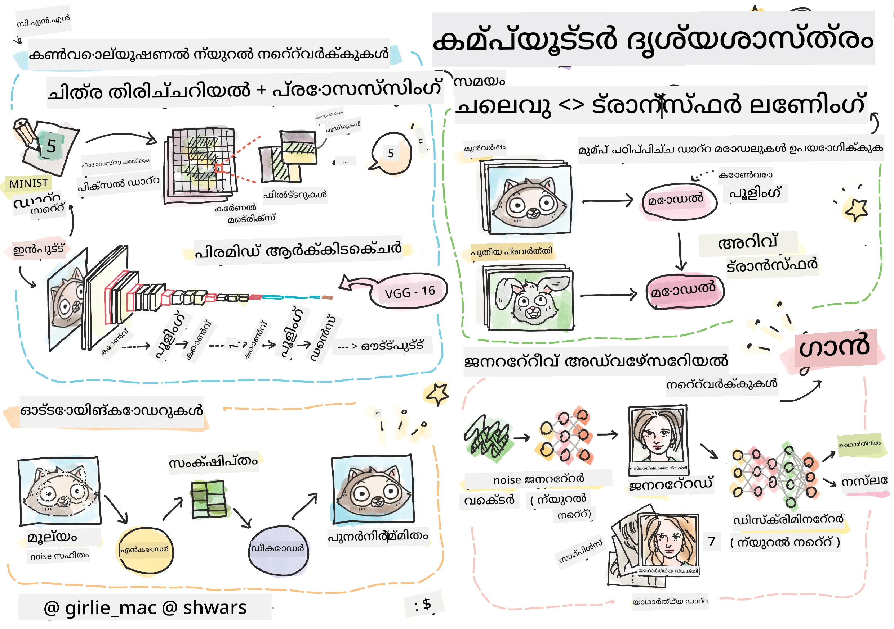

# കമ്പ്യൂട്ടർ വിഷൻ

ഈ വിഭാഗത്തിൽ നാം പഠിക്കാനിരിക്കുന്നവ:

* [കമ്പ്യൂട്ടർ വിഷനും OpenCV യും പരിചയം](06-IntroCV/README.md)
* [കോൺവല്യൂഷണൽ ന്യൂറൽ നെറ്റ്വർക്കുകൾ](07-ConvNets/README.md)
* [പ്രീ-ട്രെയിൻ ചെയ്ത നെറ്റ്വർക്കുകളും ട്രാൻസ്ഫർ ലേണിങ്ങും](08-TransferLearning/README.md) 
* [ഓട്ടോഎൻകോഡറുകൾ](09-Autoencoders/README.md)
* [ജനറേറ്റീവ് അഡ്വേഴ്സറിയൽ നെറ്റ്വർക്കുകൾ](10-GANs/README.md)
* [ഓബ്ജക്റ്റ് ഡിറ്റക്ഷൻ](11-ObjectDetection/README.md)
* [സെമാന്റിക് സെഗ്മെന്റേഷൻ](12-Segmentation/README.md)

---

<!-- CO-OP TRANSLATOR DISCLAIMER START -->
**അസൂയാ**:  
ഈ രേഖ AI വിവർത്തന സേവനം [Co-op Translator](https://github.com/Azure/co-op-translator) ഉപയോഗിച്ച് വിവർത്തനം ചെയ്തതാണ്. നാം കൃത്യതയ്ക്ക് ശ്രമിച്ചിട്ടുണ്ടെങ്കിലും, സ്വയം പ്രവർത്തിക്കുന്ന വിവർത്തനങ്ങളിൽ പിശകുകൾ അല്ലെങ്കിൽ തെറ്റുകൾ ഉണ്ടാകാമെന്ന് ദയവായി ശ്രദ്ധിക്കുക. അതിന്റെ മാതൃഭാഷയിലുള്ള യഥാർത്ഥ രേഖ അധികാരപരമായ ഉറവിടമായി കണക്കാക്കപ്പെടണം. നിർണായക വിവരങ്ങൾക്ക്, പ്രൊഫഷണൽ മനുഷ്യ വിവർത്തനം ശുപാർശ ചെയ്യപ്പെടുന്നു. ഈ വിവർത്തനത്തിന്റെ ഉപയോഗത്തിൽ നിന്നുണ്ടാകുന്ന ഏതെങ്കിലും തെറ്റിദ്ധാരണകൾക്കോ തെറ്റായ വ്യാഖ്യാനങ്ങൾക്കോ ഞങ്ങൾ ഉത്തരവാദികളല്ല.
<!-- CO-OP TRANSLATOR DISCLAIMER END -->