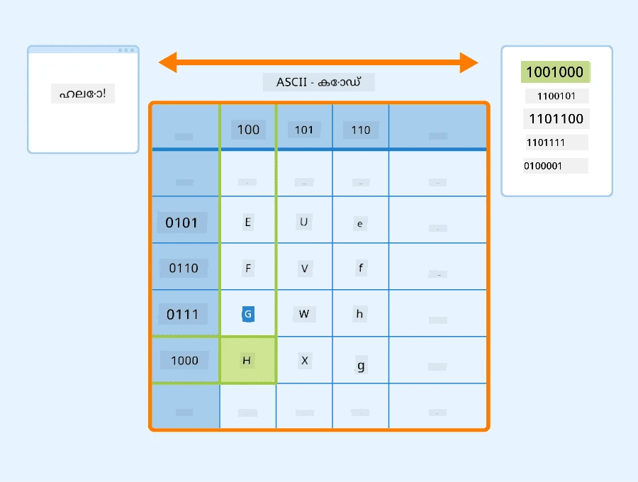
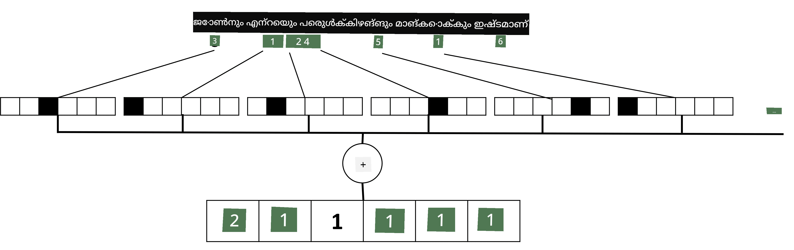

# ടെക്സ്റ്റ് ടെൻസറുകളായി പ്രതിനിധാനം ചെയ്യൽ

## [പ്രീ-ലെക്ചർ ക്വിസ്](https://ff-quizzes.netlify.app/en/ai/quiz/25)

## ടെക്സ്റ്റ് ക്ലാസിഫിക്കേഷൻ

ഈ വിഭാഗത്തിന്റെ ആദ്യഭാഗം മുഴുവൻ, നാം **ടെക്സ്റ്റ് ക്ലാസിഫിക്കേഷൻ** ടാസ്കിൽ ശ്രദ്ധ കേന്ദ്രീകരിക്കും. നാം ഉപയോഗിക്കുന്നത് [AG News](https://www.kaggle.com/amananandrai/ag-news-classification-dataset) ഡാറ്റാസെറ്റ് ആണ്, ഇതിൽ താഴെപറയുന്ന പോലുള്ള വാർത്താ ലേഖനങ്ങൾ ഉൾപ്പെടുന്നു:

* വിഭാഗം: സയൻസ്/ടെക്
* തലക്കെട്ട്: Ky. കമ്പനി പേപ്റ്റൈഡുകൾ പഠിക്കാൻ ഗ്രാന്റ് നേടി (AP)
* ഉള്ളടക്കം: AP - ലൂയിസ്വിൽ സർവകലാശാലയിലെ രാസ ശാസ്ത്ര ഗവേഷകനായ ഒരാൾ സ്ഥാപിച്ച കമ്പനി വികസിപ്പിക്കാൻ ഗ്രാന്റ് നേടി...

നമ്മുടെ ലക്ഷ്യം ടെക്സ്റ്റ് അടിസ്ഥാനമാക്കി വാർത്താ വസ്തുവിനെ ഒരു വിഭാഗത്തിലേക്ക് ക്ലാസിഫൈ ചെയ്യുക എന്നതാണ്.

## ടെക്സ്റ്റ് പ്രതിനിധാനം ചെയ്യൽ

നാചുറൽ ലാംഗ്വേജ് പ്രോസസ്സിംഗ് (NLP) ടാസ്കുകൾ ന്യൂറൽ നെറ്റ്‌വർക്കുകളിലൂടെ പരിഹരിക്കാൻ, ടെക്സ്റ്റ് ടെൻസറുകളായി പ്രതിനിധാനം ചെയ്യാനുള്ള മാർഗ്ഗം വേണം. കമ്പ്യൂട്ടറുകൾ ഇതിനകം തന്നെ ASCII അല്ലെങ്കിൽ UTF-8 പോലുള്ള എൻകോഡിങ്ങുകൾ ഉപയോഗിച്ച് സ്ക്രീനിലെ ഫോണ്ടുകളുമായി മാപ്പ് ചെയ്യുന്ന സംഖ്യകളായി ടെക്സ്റ്റ് അക്ഷരങ്ങളെ പ്രതിനിധാനം ചെയ്യുന്നു.

> [ചിത്രം സ്രോതസ്സ്](https://www.seobility.net/en/wiki/ASCII)

മനുഷ്യരായി, ഓരോ അക്ഷരവും എന്ത് **പ്രതിനിധാനം** ചെയ്യുന്നു എന്നും, എല്ലാ അക്ഷരങ്ങളും ചേർന്ന് വാക്യത്തിലെ വാക്കുകൾ എങ്ങനെ രൂപപ്പെടുന്നു എന്നും നാം മനസ്സിലാക്കുന്നു. എന്നാൽ, കമ്പ്യൂട്ടറുകൾക്ക് സ്വയം ഇത്തരത്തിലുള്ള ബോധം ഇല്ല, ന്യൂറൽ നെറ്റ്‌വർക്ക് പരിശീലന സമയത്ത് അർത്ഥം പഠിക്കേണ്ടതുണ്ട്.

അതിനാൽ, ടെക്സ്റ്റ് പ്രതിനിധാനം ചെയ്യുമ്പോൾ നാം വിവിധ സമീപനങ്ങൾ ഉപയോഗിക്കാം:

* **അക്ഷര-നില പ്രതിനിധാനം**: ഓരോ അക്ഷരത്തെയും ഒരു സംഖ്യയായി പരിഗണിച്ച് ടെക്സ്റ്റ് പ്രതിനിധാനം ചെയ്യുന്നത്. ടെക്സ്റ്റ് കോർപ്പസിൽ *C* വ്യത്യസ്ത അക്ഷരങ്ങൾ ഉണ്ടെങ്കിൽ, *Hello* എന്ന വാക്ക് 5x*C* ടെൻസറായിരിക്കും. ഓരോ അക്ഷരവും ഒന്ന്-ഹോട്ട് എൻകോഡിങ്ങിൽ ടെൻസറിന്റെ ഒരു കോളമായി പ്രതിനിധാനം ചെയ്യും.
* **വാക്ക്-നില പ്രതിനിധാനം**: ടെക്സ്റ്റിലെ എല്ലാ വാക്കുകളുടെയും **വോകാബുലറി** സൃഷ്ടിച്ച്, വാക്കുകൾ ഒന്ന്-ഹോട്ട് എൻകോഡിങ്ങിൽ പ്രതിനിധാനം ചെയ്യുന്നു. ഈ സമീപനം കുറച്ച് മെച്ചമാണ്, കാരണം ഓരോ അക്ഷരത്തിനും സ്വതന്ത്രമായി വലിയ അർത്ഥമില്ല, അതിനാൽ ഉയർന്ന തലത്തിലുള്ള സാംവേദനാത്മക ആശയങ്ങളായ വാക്കുകൾ ഉപയോഗിച്ച് ന്യൂറൽ നെറ്റ്‌വർക്കിന് ടാസ്ക് ലളിതമാക്കാം. എന്നാൽ, വാക്കുകളുടെ വലിയ നിഘണ്ടു വലുപ്പം കാരണം ഉയർന്ന-ഡൈമെൻഷണൽ സ്പാർസ് ടെൻസറുകളുമായി കൈകാര്യം ചെയ്യേണ്ടിവരും.

പ്രതിനിധാനം ഏതായാലും, ആദ്യം ടെക്സ്റ്റ് **ടോക്കണുകളുടെ** ഒരു ശ്രേണിയാക്കി മാറ്റണം, ഓരോ ടോക്കനും അക്ഷരം, വാക്ക്, അല്ലെങ്കിൽ ചിലപ്പോൾ വാക്കിന്റെ ഭാഗമായിരിക്കും. തുടർന്ന്, ടോക്കൺ ഒരു സംഖ്യയാക്കി മാറ്റുന്നു, സാധാരണയായി **വോകാബുലറി** ഉപയോഗിച്ച്, ഈ സംഖ്യ ഒന്ന്-ഹോട്ട് എൻകോഡിങ്ങിൽ ന്യൂറൽ നെറ്റ്‌വർക്കിലേക്ക് നൽകാം.

## എൻ-ഗ്രാമുകൾ

സ്വാഭാവിക ഭാഷയിൽ, വാക്കുകളുടെ കൃത്യമായ അർത്ഥം സാന്ദർഭ്യത്തിൽ മാത്രമേ നിർണയിക്കാനാകൂ. ഉദാഹരണത്തിന്, *ന്യൂറൽ നെറ്റ്‌വർക്ക്* ഉം *ഫിഷിംഗ് നെറ്റ്‌വർക്ക്* ഉം പൂർണ്ണമായും വ്യത്യസ്ത അർത്ഥങ്ങളാണ്. ഇതു പരിഗണിക്കാൻ ഒരു മാർഗ്ഗം വാക്കുകളുടെ ജോഡികളിൽ അടിസ്ഥാനമാക്കി മോഡൽ നിർമ്മിക്കുക, വാക്കു ജോഡികളെ വേറെ വോകാബുലറി ടോക്കണുകളായി കണക്കാക്കുക എന്നതാണ്. ഈ രീതിയിൽ, *I like to go fishing* എന്ന വാക്യം താഴെപറയുന്ന ടോക്കൺ ശ്രേണിയായി പ്രതിനിധാനം ചെയ്യും: *I like*, *like to*, *to go*, *go fishing*. ഈ സമീപനത്തിലെ പ്രശ്നം നിഘണ്ടു വലുപ്പം വളരെ വലുതാകുക മാത്രമല്ല, *go fishing* ഉം *go shopping* ഉം പോലുള്ള സംയോജിതങ്ങൾ വ്യത്യസ്ത ടോക്കണുകളായി പ്രതിനിധാനം ചെയ്യപ്പെടുന്നു, അവയ്ക്ക് ഒരേ ക്രിയാപദമുണ്ടെങ്കിലും സാംവേദനാത്മക സമാനത ഇല്ല.

ചിലപ്പോൾ, മൂന്ന് വാക്കുകളുടെ സംയോജിതമായ ട്രൈ-ഗ്രാമുകളും പരിഗണിക്കാം. ഈ സമീപനം സാധാരണയായി **എൻ-ഗ്രാമുകൾ** എന്ന് വിളിക്കുന്നു. കൂടാതെ, അക്ഷര-നില പ്രതിനിധാനത്തോടൊപ്പം എൻ-ഗ്രാമുകൾ ഉപയോഗിക്കുന്നത് യുക്തിയുള്ളതാണ്, അപ്പോൾ എൻ-ഗ്രാമുകൾ ഏകദേശം വ്യത്യസ്ത സ്വരഭാഗങ്ങളായി കാണാം.

## ബാഗ്-ഓഫ്-വേർഡ്സ് (BoW) & TF/IDF

ടെക്സ്റ്റ് ക്ലാസിഫിക്കേഷൻ പോലുള്ള ടാസ്കുകൾ പരിഹരിക്കുമ്പോൾ, ടെക്സ്റ്റ് ഒരു സ്ഥിരമായ വലിപ്പമുള്ള വെക്ടറായി പ്രതിനിധാനം ചെയ്യാൻ കഴിയണം, ഇത് ഫൈനൽ ഡെൻസ് ക്ലാസിഫയറിലേക്ക് ഇൻപുട്ടായി ഉപയോഗിക്കും. ഏറ്റവും ലളിതമായ മാർഗ്ഗങ്ങളിൽ ഒന്ന് എല്ലാ വ്യക്തിഗത വാക്കുകളുടെ പ്രതിനിധാനങ്ങൾ ചേർക്കലാണ്. ഓരോ വാക്കിന്റെയും ഒന്ന്-ഹോട്ട് എൻകോഡിങ്ങുകൾ ചേർത്താൽ, ഓരോ വാക്കും ടെക്സ്റ്റിൽ എത്ര തവണ വന്നുവെന്ന് കാണിക്കുന്ന ഫ്രീക്വൻസി വെക്ടർ ലഭിക്കും. ഈ ടെക്സ്റ്റ് പ്രതിനിധാനം **ബാഗ് ഓഫ് വേർഡ്സ്** (BoW) എന്ന് വിളിക്കുന്നു.

> ചിത്രകാരൻ: ലേഖകൻ

BoW അടിസ്ഥാനത്തിൽ ടെക്സ്റ്റിൽ ഏത് വാക്കുകൾ എത്രത്തോളം ഉണ്ടെന്ന് പ്രതിനിധാനം ചെയ്യുന്നു, ഇത് ടെക്സ്റ്റിന്റെ വിഷയം എന്താണെന്ന് സൂചിപ്പിക്കാൻ നല്ല മാർഗ്ഗമാണ്. ഉദാഹരണത്തിന്, രാഷ്ട്രീയ വാർത്താ ലേഖനത്തിൽ *president* (പ്രസിഡന്റ്), *country* (രാജ്യം) പോലുള്ള വാക്കുകൾ കൂടുതലായിരിക്കും, ശാസ്ത്രീയ പ്രസിദ്ധീകരണത്തിൽ *collider*, *discovered* പോലുള്ള വാക്കുകൾ കാണാം. അതിനാൽ, വാക്കുകളുടെ ആവൃത്തി പലപ്പോഴും ടെക്സ്റ്റിന്റെ ഉള്ളടക്കത്തെ സൂചിപ്പിക്കുന്നു.

BoW-യുടെ പ്രശ്നം ചില സാധാരണ വാക്കുകൾ, ഉദാഹരണത്തിന് *and*, *is* തുടങ്ങിയവ, പല ടെക്സ്റ്റുകളിലും കൂടുതലായി വരികയും, അതിനാൽ പ്രധാനപ്പെട്ട വാക്കുകൾ മറയ്ക്കപ്പെടുകയും ചെയ്യുന്നു. ഈ വാക്കുകളുടെ പ്രാധാന്യം കുറയ്ക്കാൻ, വാക്കുകൾ മുഴുവൻ ഡോക്യുമെന്റ് ശേഖരത്തിൽ എത്രത്തോളം വരുന്നു എന്നത് പരിഗണിക്കാം. ഇതാണ് TF/IDF സമീപനത്തിന്റെ മുഖ്യ ആശയം, ഇത് ഈ പാഠഭാഗത്തോടൊപ്പം നൽകിയ നോട്ട്‌ബുക്കുകളിൽ കൂടുതൽ വിശദമായി പഠിക്കാം.

എന്നാൽ, ഈ സമീപനങ്ങളിൽ ഒന്നും ടെക്സ്റ്റിന്റെ **സാംവേദനാത്മക അർത്ഥം** പൂർണ്ണമായി പരിഗണിക്കാൻ കഴിയില്ല. ഇതിന് കൂടുതൽ ശക്തമായ ന്യൂറൽ നെറ്റ്‌വർക്ക് മോഡലുകൾ ആവശ്യമുണ്ട്, അവയെക്കുറിച്ച് ഈ വിഭാഗത്തിൽ പിന്നീട് പഠിക്കും.

## ✍️ അഭ്യാസങ്ങൾ: ടെക്സ്റ്റ് പ്രതിനിധാനം

താഴെപ്പറയുന്ന നോട്ട്‌ബുക്കുകളിൽ നിങ്ങളുടെ പഠനം തുടരുക:

* [PyTorch ഉപയോഗിച്ച് ടെക്സ്റ്റ് പ്രതിനിധാനം](TextRepresentationPyTorch.ipynb)
* [TensorFlow ഉപയോഗിച്ച് ടെക്സ്റ്റ് പ്രതിനിധാനം](TextRepresentationTF.ipynb)

## സമാപനം

ഇതുവരെ, നാം വ്യത്യസ്ത വാക്കുകൾക്ക് ആവൃത്തി ഭാരങ്ങൾ ചേർക്കുന്ന സാങ്കേതിക വിദ്യകൾ പഠിച്ചു. എന്നാൽ, അവ അർത്ഥം അല്ലെങ്കിൽ ക്രമം പ്രതിനിധാനം ചെയ്യാൻ കഴിയുന്നില്ല. പ്രശസ്ത ഭാഷാശാസ്ത്രജ്ഞൻ J. R. Firth 1935-ൽ പറഞ്ഞതുപോലെ, "ഒരു വാക്കിന്റെ പൂർണ്ണ അർത്ഥം എപ്പോഴും സാന്ദർഭ്യപരമാണ്, സാന്ദർഭ്യത്തിന് പുറമേ അർത്ഥ പഠനം ഗൗരവത്തോടെ എടുക്കാനാകില്ല." നാം കോഴ്സിന്റെ പിന്നീട് ഭാഗങ്ങളിൽ ഭാഷാ മോഡലിംഗ് ഉപയോഗിച്ച് ടെക്സ്റ്റിൽ നിന്നുള്ള സാന്ദർഭ്യ വിവരങ്ങൾ എങ്ങനെ പിടിച്ചെടുക്കാമെന്ന് പഠിക്കും.

## 🚀 ചലഞ്ച്

ബാഗ്-ഓഫ്-വേർഡ്സ് ഉപയോഗിച്ച് മറ്റ് അഭ്യാസങ്ങൾ പരീക്ഷിക്കുക, വ്യത്യസ്ത ഡാറ്റ മോഡലുകളും പരീക്ഷിക്കാം. ഈ [കാഗിൾ മത്സരം](https://www.kaggle.com/competitions/word2vec-nlp-tutorial/overview/part-1-for-beginners-bag-of-words) നിങ്ങൾക്ക് പ്രചോദനമായേക്കാം.

## [പോസ്റ്റ്-ലെക്ചർ ക്വിസ്](https://ff-quizzes.netlify.app/en/ai/quiz/26)

## അവലോകനം & സ്വയം പഠനം

ടെക്സ്റ്റ് എംബെഡിംഗുകളും ബാഗ്-ഓഫ്-വേർഡ്സ് സാങ്കേതിക വിദ്യകളും പ്രാക്ടീസ് ചെയ്യാൻ [Microsoft Learn](https://docs.microsoft.com/learn/modules/intro-natural-language-processing-pytorch/?WT.mc_id=academic-77998-cacaste) സന്ദർശിക്കുക.

## [അസൈൻമെന്റ്: നോട്ട്‌ബുക്കുകൾ](assignment.md)

---

<!-- CO-OP TRANSLATOR DISCLAIMER START -->
**അസൂയാ**:  
ഈ രേഖ AI വിവർത്തന സേവനം [Co-op Translator](https://github.com/Azure/co-op-translator) ഉപയോഗിച്ച് വിവർത്തനം ചെയ്തതാണ്. നാം കൃത്യതയ്ക്ക് ശ്രമിച്ചിട്ടുണ്ടെങ്കിലും, സ്വയം പ്രവർത്തിക്കുന്ന വിവർത്തനങ്ങളിൽ പിശകുകൾ അല്ലെങ്കിൽ തെറ്റുകൾ ഉണ്ടാകാമെന്ന് ദയവായി ശ്രദ്ധിക്കുക. അതിന്റെ മാതൃഭാഷയിലുള്ള യഥാർത്ഥ രേഖ അധികാരപരമായ ഉറവിടമായി കണക്കാക്കണം. നിർണായക വിവരങ്ങൾക്ക്, പ്രൊഫഷണൽ മനുഷ്യ വിവർത്തനം ശുപാർശ ചെയ്യപ്പെടുന്നു. ഈ വിവർത്തനം ഉപയോഗിക്കുന്നതിൽ നിന്നുണ്ടാകുന്ന ഏതെങ്കിലും തെറ്റിദ്ധാരണകൾക്കോ തെറ്റായ വ്യാഖ്യാനങ്ങൾക്കോ ഞങ്ങൾ ഉത്തരവാദികളല്ല.
<!-- CO-OP TRANSLATOR DISCLAIMER END -->