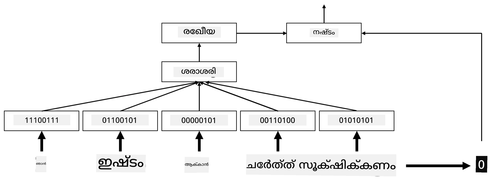
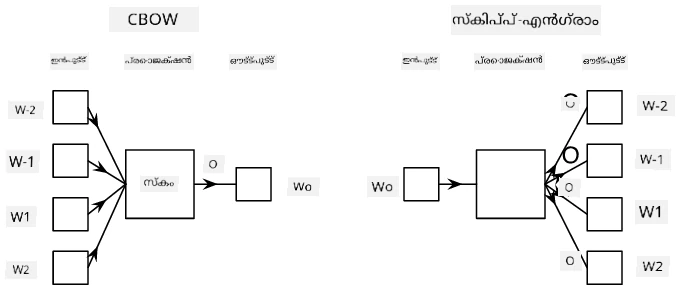

# എംബെഡിംഗുകൾ

## [പ്രീ-ലെക്ചർ ക്വിസ്](https://ff-quizzes.netlify.app/en/ai/quiz/27)

BoW അല്ലെങ്കിൽ TF/IDF അടിസ്ഥാനമാക്കിയുള്ള ക്ലാസിഫയർസ് പരിശീലിപ്പിക്കുമ്പോൾ, നാം `vocab_size` നീളമുള്ള ഉയർന്ന-ഡൈമെൻഷണൽ ബാഗ്-ഓഫ്-വേർഡ്‌സ് വെക്ടറുകളിൽ പ്രവർത്തിച്ചിരുന്നു, കൂടാതെ നാം താഴ്ന്ന-ഡൈമെൻഷണൽ പൊസിഷണൽ പ്രതിനിധാന വെക്ടറുകളിൽ നിന്ന് സ്പാർസ് വൺ-ഹോട്ട് പ്രതിനിധാനത്തിലേക്ക് വ്യക്തമായി മാറ്റം വരുത്തുകയായിരുന്നു. എന്നാൽ ഈ വൺ-ഹോട്ട് പ്രതിനിധാനം മെമ്മറി കാര്യക്ഷമമല്ല. കൂടാതെ, ഓരോ വാക്കും പരസ്പരം സ്വതന്ത്രമായി പരിഗണിക്കപ്പെടുന്നു, അതായത് വൺ-ഹോട്ട് എൻകോഡുചെയ്ത വെക്ടറുകൾ വാക്കുകൾക്കിടയിലെ സാംസാരിക സമാനതയെ പ്രകടിപ്പിക്കുന്നില്ല.

**എംബെഡിംഗ്** എന്ന ആശയം വാക്കുകളെ താഴ്ന്ന-ഡൈമെൻഷണൽ സാന്ദ്ര വെക്ടറുകളായി പ്രതിനിധീകരിക്കുകയാണ്, അവ ഏതെങ്കിലും വിധത്തിൽ വാക്കിന്റെ സാംസാരിക അർത്ഥം പ്രതിഫലിപ്പിക്കുന്നു. നാം പിന്നീട് അർത്ഥപൂർണ്ണമായ വാക്ക് എംബെഡിംഗുകൾ എങ്ങനെ നിർമ്മിക്കാമെന്ന് ചർച്ച ചെയ്യും, എന്നാൽ ഇപ്പോൾ എംബെഡിംഗുകൾ വാക്ക് വെക്ടറിന്റെ ഡൈമെൻഷൻ കുറയ്ക്കാനുള്ള ഒരു മാർഗമായി മാത്രം കരുതാം.

അതിനാൽ, എംബെഡിംഗ് ലെയർ ഒരു വാക്ക് ഇൻപുട്ടായി സ്വീകരിച്ച് നിർദ്ദിഷ്ട `embedding_size` ഉള്ള ഔട്ട്പുട്ട് വെക്ടർ ഉത്പാദിപ്പിക്കും. ഒരു അർത്ഥത്തിൽ, ഇത് `Linear` ലെയറിനോട് വളരെ സമാനമാണ്, പക്ഷേ വൺ-ഹോട്ട് എൻകോഡുചെയ്ത വെക്ടർ സ്വീകരിക്കുന്നതിന് പകരം, വാക്കിന്റെ നമ്പർ ഇൻപുട്ടായി സ്വീകരിക്കാൻ കഴിയും, ഇതിലൂടെ വലിയ വൺ-ഹോട്ട് എൻകോഡുചെയ്ത വെക്ടറുകൾ സൃഷ്ടിക്കേണ്ടതില്ല.

ക്ലാസിഫയർ നെറ്റ്വർക്കിലെ ആദ്യ ലെയറായി എംബെഡിംഗ് ലെയർ ഉപയോഗിച്ച്, നാം ബാഗ്-ഓഫ്-വേർഡിൽ നിന്ന് **എംബെഡിംഗ് ബാഗ്** മോഡലിലേക്ക് മാറാം, ഇവിടെ ആദ്യം ടെക്സ്റ്റിലെ ഓരോ വാക്കും അനുയോജ്യമായ എംബെഡിംഗിലേക്ക് മാറ്റുകയും, പിന്നീട് ആ എംബെഡിംഗുകളുടെ മേൽ `sum`, `average` അല്ലെങ്കിൽ `max` പോലുള്ള ഒരു സംഗ്രഹ ഫംഗ്ഷൻ കണക്കാക്കുകയും ചെയ്യും.

> ചിത്രം: രചയിതാവ്

## ✍️ അഭ്യാസങ്ങൾ: എംബെഡിംഗുകൾ

താഴെ കൊടുത്തിരിക്കുന്ന നോട്ട്‌ബുക്കുകളിൽ നിങ്ങളുടെ പഠനം തുടരുക:
* [PyTorch ഉപയോഗിച്ച് എംബെഡിംഗുകൾ](EmbeddingsPyTorch.ipynb)
* [TensorFlow ഉപയോഗിച്ച് എംബെഡിംഗുകൾ](EmbeddingsTF.ipynb)

## സാംസാരിക എംബെഡിംഗുകൾ: Word2Vec

എംബെഡിംഗ് ലെയർ വാക്കുകളെ വെക്ടർ പ്രതിനിധാനത്തിലേക്ക് മാപ്പ് ചെയ്യാൻ പഠിച്ചിരുന്നെങ്കിലും, ഈ പ്രതിനിധാനം അനിവാര്യമായി സാംസാരിക അർത്ഥം ധരിക്കുന്നതല്ല. സമാനമായ വാക്കുകൾ അല്ലെങ്കിൽ പദസമാനാർത്ഥികൾ തമ്മിലുള്ള വെക്ടർ ദൂരത്തിൽ (ഉദാ. യൂക്ലിഡിയൻ ദൂരം) അടുത്തുള്ള വെക്ടറുകൾ ഉണ്ടാകുന്ന വിധം ഒരു വെക്ടർ പ്രതിനിധാനം പഠിക്കാനാകും.

അതിനായി, നാം ഒരു വലിയ ടെക്സ്റ്റ് ശേഖരത്തിൽ പ്രത്യേക രീതിയിൽ എംബെഡിംഗ് മോഡൽ പ്രീ-ട്രെയിൻ ചെയ്യേണ്ടതാണ്. സാംസാരിക എംബെഡിംഗുകൾ പരിശീലിപ്പിക്കുന്ന ഒരു മാർഗം [Word2Vec](https://en.wikipedia.org/wiki/Word2vec) എന്നാണ് അറിയപ്പെടുന്നത്. ഇത് വാക്കുകളുടെ വിതരണ പ്രതിനിധാനം സൃഷ്ടിക്കാൻ ഉപയോഗിക്കുന്ന രണ്ട് പ്രധാന ആർക്കിടെക്ചറുകളെ അടിസ്ഥാനമാക്കുന്നു:

 - **Continuous bag-of-words** (CBoW) — ഈ ആർക്കിടെക്ചറിൽ, നാം മോഡലിനെ ചുറ്റുപാടിലുള്ള കോൺടെക്സ്റ്റിൽ നിന്നൊരു വാക്ക് പ്രവചിക്കാൻ പരിശീലിപ്പിക്കുന്നു. n-ഗ്രാം $(W_{-2},W_{-1},W_0,W_1,W_2)$ നൽകിയാൽ, മോഡലിന്റെ ലക്ഷ്യം $W_0$ നെ $(W_{-2},W_{-1},W_1,W_2)$ ൽ നിന്നു പ്രവചിക്കുക എന്നതാണ്.
 - **Continuous skip-gram** CBoW ന്റെ വിപരീതമാണ്. മോഡൽ നിലവിലെ വാക്ക് പ്രവചിക്കാൻ ചുറ്റുപാടിലുള്ള കോൺടെക്സ്റ്റ് വാക്കുകൾ ഉപയോഗിക്കുന്നു.

CBoW വേഗത്തിൽ പ്രവർത്തിക്കുന്നു, എന്നാൽ സ്കിപ്പ്-ഗ്രാം മന്ദഗതിയിലാണ്, പക്ഷേ അപൂർവമായ വാക്കുകൾ പ്രതിനിധീകരിക്കുന്നതിൽ മികച്ചതാണ്.

> ചിത്രം ഈ [പേപ്പറിൽ](https://arxiv.org/pdf/1301.3781.pdf) നിന്നാണ്

Word2Vec പ്രീ-ട്രെയിൻ ചെയ്ത എംബെഡിംഗുകൾ (GloVe പോലുള്ള മറ്റ് സമാന മോഡലുകളും) ന്യൂറൽ നെറ്റ്വർക്കിലെ എംബെഡിംഗ് ലെയറിന്റെ പകരമായി ഉപയോഗിക്കാം. എന്നാൽ, വാക്കുകളുടെ ശേഖരങ്ങൾ കൈകാര്യം ചെയ്യേണ്ടതുണ്ട്, കാരണം Word2Vec/GloVe പ്രീ-ട്രെയിനിംഗിന് ഉപയോഗിച്ച വാക്കുകളുടെ ശേഖരം നമ്മുടെ ടെക്സ്റ്റ് കോർപ്പസിലെ വാക്കുകളുടെ ശേഖരത്തിൽ നിന്ന് വ്യത്യസ്തമായിരിക്കാം. ഈ പ്രശ്നം എങ്ങനെ പരിഹരിക്കാമെന്ന് മുകളിൽ കൊടുത്ത നോട്ട്‌ബുക്കുകളിൽ നോക്കാം.

## കോൺടെക്സ്ച്വൽ എംബെഡിംഗുകൾ

Word2Vec പോലുള്ള പരമ്പരാഗത പ്രീ-ട്രെയിൻ ചെയ്ത എംബെഡിംഗ് പ്രതിനിധാനങ്ങളുടെ ഒരു പ്രധാന പരിമിതിയാണ് വാക്കിന്റെ അർത്ഥ വ്യത്യാസം തിരിച്ചറിയൽ പ്രശ്നം. പ്രീ-ട്രെയിൻ ചെയ്ത എംബെഡിംഗുകൾ കോൺടെക്സ്റ്റിൽ വാക്കുകളുടെ ചില അർത്ഥങ്ങൾ പിടിച്ചുപറ്റാമെങ്കിലും, ഒരു വാക്കിന്റെ എല്ലാ സാധ്യതയുള്ള അർത്ഥങ്ങളും ഒരേ എംബെഡിംഗിൽ എൻകോഡ് ചെയ്യപ്പെടുന്നു. ഇത് ഡൗൺസ്ട്രീം മോഡലുകളിൽ പ്രശ്നങ്ങൾ സൃഷ്ടിക്കാം, കാരണം 'play' പോലുള്ള പല വാക്കുകൾ ഉപയോഗിക്കുന്ന കോൺടെക്സ്റ്റ് അനുസരിച്ച് വ്യത്യസ്ത അർത്ഥങ്ങൾ ഉണ്ട്.

ഉദാഹരണത്തിന്, 'play' എന്ന വാക്ക് ഈ രണ്ട് വ്യത്യസ്ത വാചകങ്ങളിൽ വളരെ വ്യത്യസ്ത അർത്ഥം നൽകുന്നു:

- ഞാൻ തിയേറ്ററിൽ ഒരു **play** കാണാൻ പോയി.
- ജോൺ തന്റെ സുഹൃത്തുക്കളുമായി **play** ചെയ്യാൻ ആഗ്രഹിക്കുന്നു.

മുകളിൽ പറഞ്ഞ പ്രീ-ട്രെയിൻ ചെയ്ത എംബെഡിംഗുകൾ ഈ രണ്ട് അർത്ഥങ്ങളും ഒരേ എംബെഡിംഗിൽ പ്രതിനിധീകരിക്കുന്നു. ഈ പരിമിതിയെ മറികടക്കാൻ, നാം **ഭാഷാ മോഡൽ** അടിസ്ഥാനമാക്കിയുള്ള എംബെഡിംഗുകൾ നിർമ്മിക്കേണ്ടതാണ്, ഇത് വലിയ ടെക്സ്റ്റ് കോർപ്പസിൽ പരിശീലിപ്പിച്ചിരിക്കുന്നു, വാക്കുകൾ വ്യത്യസ്ത കോൺടെക്സ്റ്റുകളിൽ എങ്ങനെ ചേർക്കാമെന്ന് *അറിയുന്നു*. കോൺടെക്സ്ച്വൽ എംബെഡിംഗുകൾ ചർച്ച ചെയ്യുന്നത് ഈ ട്യൂട്ടോറിയലിന്റെ പരിധിയിൽ ഇല്ല, പക്ഷേ കോഴ്സിന്റെ പിന്നീട് ഭാഗങ്ങളിൽ ഭാഷാ മോഡലുകൾ ചർച്ച ചെയ്യുമ്പോൾ അവയെക്കുറിച്ച് വീണ്ടും വരാം.

## സമാപനം

ഈ പാഠത്തിൽ, വാക്കുകളുടെ സാംസാരിക അർത്ഥങ്ങൾ മെച്ചപ്പെടുത്താൻ TensorFlow, Pytorch എന്നിവയിൽ എംബെഡിംഗ് ലെയറുകൾ എങ്ങനെ നിർമ്മിച്ച് ഉപയോഗിക്കാമെന്ന് നിങ്ങൾ പഠിച്ചു.

## 🚀 ചലഞ്ച്

Word2Vec ചില രസകരമായ പ്രയോഗങ്ങൾക്ക് ഉപയോഗിച്ചിട്ടുണ്ട്, അതിൽ പാട്ട് വരികൾ, കവിതകൾ സൃഷ്ടിക്കൽ ഉൾപ്പെടുന്നു. [ഈ ലേഖനം](https://www.politetype.com/blog/word2vec-color-poems) നോക്കുക, ഇവിടെ രചയിതാവ് Word2Vec ഉപയോഗിച്ച് കവിത സൃഷ്ടിക്കുന്ന വിധം വിശദീകരിക്കുന്നു. [Dan Shiffmann ന്റെ ഈ വീഡിയോ](https://www.youtube.com/watch?v=LSS_bos_TPI&ab_channel=TheCodingTrain) കാണുക, ഈ സാങ്കേതിക വിദ്യയുടെ മറ്റൊരു വ്യാഖ്യാനം കണ്ടെത്താൻ. തുടർന്ന്, ഈ സാങ്കേതിക വിദ്യകൾ നിങ്ങളുടെ സ്വന്തം ടെക്സ്റ്റ് കോർപ്പസിൽ, ഉദാഹരണത്തിന് Kaggle-ൽ നിന്നുള്ളവയിൽ, പ്രയോഗിക്കാൻ ശ്രമിക്കുക.

## [പോസ്റ്റ്-ലെക്ചർ ക്വിസ്](https://ff-quizzes.netlify.app/en/ai/quiz/28)

## അവലോകനം & സ്വയം പഠനം

Word2Vec-നെക്കുറിച്ചുള്ള ഈ പേപ്പർ വായിക്കുക: [Efficient Estimation of Word Representations in Vector Space](https://arxiv.org/pdf/1301.3781.pdf)

## [അസൈൻമെന്റ്: നോട്ട്‌ബുക്കുകൾ](assignment.md)

---

<!-- CO-OP TRANSLATOR DISCLAIMER START -->
**അസൂയാ**:  
ഈ രേഖ AI വിവർത്തന സേവനം [Co-op Translator](https://github.com/Azure/co-op-translator) ഉപയോഗിച്ച് വിവർത്തനം ചെയ്തതാണ്. നാം കൃത്യതയ്ക്ക് ശ്രമിച്ചിട്ടുണ്ടെങ്കിലും, സ്വയം പ്രവർത്തിക്കുന്ന വിവർത്തനങ്ങളിൽ പിശകുകൾ അല്ലെങ്കിൽ തെറ്റുകൾ ഉണ്ടാകാമെന്ന് ദയവായി ശ്രദ്ധിക്കുക. അതിന്റെ മാതൃഭാഷയിലുള്ള യഥാർത്ഥ രേഖ അധികാരപരമായ ഉറവിടമായി കണക്കാക്കണം. നിർണായക വിവരങ്ങൾക്ക്, പ്രൊഫഷണൽ മനുഷ്യ വിവർത്തനം ശുപാർശ ചെയ്യപ്പെടുന്നു. ഈ വിവർത്തനത്തിന്റെ ഉപയോഗത്തിൽ നിന്നുണ്ടാകുന്ന ഏതെങ്കിലും തെറ്റിദ്ധാരണകൾക്കോ തെറ്റായ വ്യാഖ്യാനങ്ങൾക്കോ ഞങ്ങൾ ഉത്തരവാദികളല്ല.
<!-- CO-OP TRANSLATOR DISCLAIMER END -->