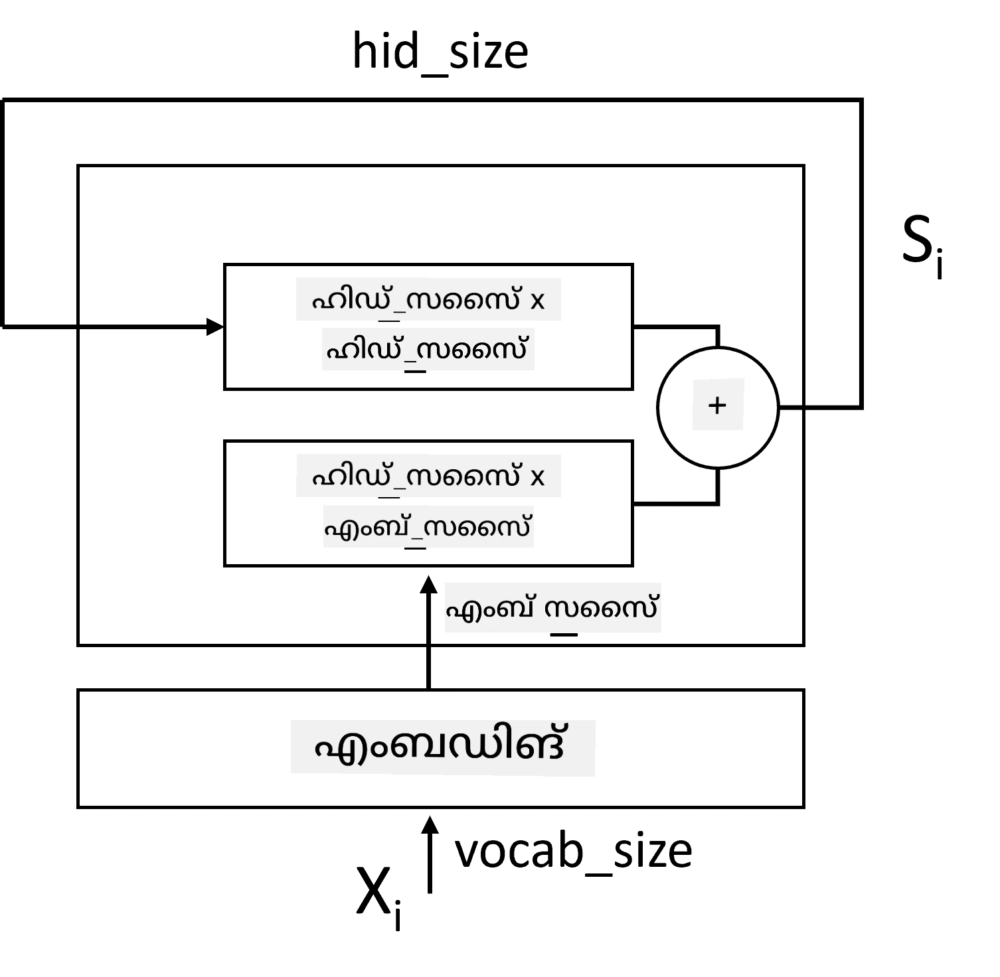

# റികറന്റ് ന്യൂറൽ നെറ്റ്വർക്കുകൾ

## [പ്രീ-ലെക്ചർ ക്വിസ്](https://ff-quizzes.netlify.app/en/ai/quiz/31)

മുൻവശങ്ങളിൽ, നാം ടെക്സ്റ്റിന്റെ സമ്പന്നമായ സീമാന്റിക് പ്രതിനിധാനങ്ങളും എംബെഡിംഗുകളുടെ മുകളിൽ ലളിതമായ ലീനിയർ ക്ലാസിഫയർ ഉപയോഗിച്ചിരിക്കുന്നു. ഈ ആർക്കിടെക്ചർ ചെയ്യുന്നത് ഒരു വാക്യത്തിലെ വാക്കുകളുടെ സംയുക്ത അർത്ഥം പിടികൂടുകയാണ്, പക്ഷേ വാക്കുകളുടെ **ക്രമം** പരിഗണിക്കുന്നില്ല, കാരണം എംബെഡിംഗുകളുടെ മുകളിൽ സംയോജനം ഓപ്പറേഷൻ ഈ വിവരങ്ങൾ യഥാർത്ഥ ടെക്സ്റ്റിൽ നിന്ന് നീക്കം ചെയ്തിരിക്കുന്നു. ഈ മോഡലുകൾ വാക്കുകളുടെ ക്രമീകരണം മോഡൽ ചെയ്യാൻ കഴിയാത്തതിനാൽ, ടെക്സ്റ്റ് ജനറേഷൻ അല്ലെങ്കിൽ ചോദ്യോത്തരങ്ങൾ പോലുള്ള കൂടുതൽ സങ്കീർണ്ണമായ അല്ലെങ്കിൽ സംശയാസ്പദമായ പ്രവർത്തനങ്ങൾ പരിഹരിക്കാൻ കഴിയില്ല.

ടെക്സ്റ്റ് സീക്വൻസിന്റെ അർത്ഥം പിടികൂടാൻ, നമുക്ക് മറ്റൊരു ന്യൂറൽ നെറ്റ്വർക്ക് ആർക്കിടെക്ചർ ഉപയോഗിക്കേണ്ടതുണ്ട്, അതാണ് **റികറന്റ് ന്യൂറൽ നെറ്റ്വർക്ക്** അല്ലെങ്കിൽ RNN. RNN-ൽ, നാം വാക്യം ഒരു സിംബോളായി ഒരു സമയം നെറ്റ്വർക്കിലൂടെ കടത്തുന്നു, നെറ്റ്വർക്ക് ചില **സ്റ്റേറ്റ്** ഉൽപ്പാദിപ്പിക്കുന്നു, അത് പിന്നീട് അടുത്ത സിംബോളിനൊപ്പം വീണ്ടും നെറ്റ്വർക്കിലേക്ക് കടത്തുന്നു.

> ചിത്രകാരൻ: ലേഖകൻ

ഇൻപുട്ട് സീക്വൻസ് ടോക്കണുകൾ X0,...,Xn നൽകിയാൽ, RNN ഒരു ന്യൂറൽ നെറ്റ്വർക്ക് ബ്ലോക്കുകളുടെ സീക്വൻസ് സൃഷ്ടിക്കുകയും, ബാക്ക്‌പ്രൊപ്പഗേഷൻ ഉപയോഗിച്ച് ഈ സീക്വൻസ് എന്റു-ടു-എൻഡ് ട്രെയിൻ ചെയ്യുകയും ചെയ്യുന്നു. ഓരോ നെറ്റ്വർക്ക് ബ്ലോക്കും (Xi,Si) എന്ന ജോഡി ഇൻപുട്ടായി സ്വീകരിച്ച് Si+1 ഉൽപ്പാദിപ്പിക്കുന്നു. അവസാന സ്റ്റേറ്റ് Sn അല്ലെങ്കിൽ (ഔട്ട്പുട്ട് Yn) ലീനിയർ ക്ലാസിഫയറിലേക്ക് പോകുന്നു ഫലം ഉൽപ്പാദിപ്പിക്കാൻ. എല്ലാ നെറ്റ്വർക്ക് ബ്ലോക്കുകളും ഒരേ വെയ്റ്റുകൾ പങ്കുവെക്കുന്നു, ഒറ്റ ബാക്ക്‌പ്രൊപ്പഗേഷൻ പാസിലൂടെ എന്റു-ടു-എൻഡ് ട്രെയിൻ ചെയ്യുന്നു.

സ്റ്റേറ്റ് വെക്ടറുകൾ S0,...,Sn നെറ്റ്വർക്കിലൂടെ കടത്തപ്പെടുന്നതിനാൽ, വാക്കുകൾ തമ്മിലുള്ള അനുക്രമ ആശ്രിതത്വങ്ങൾ പഠിക്കാൻ ഇത് കഴിയും. ഉദാഹരണത്തിന്, സീക്വൻസിൽ *not* എന്ന വാക്ക് എവിടെയെങ്കിലും വന്നാൽ, സ്റ്റേറ്റ് വെക്ടറിലെ ചില ഘടകങ്ങളെ നിഷേധിക്കാൻ പഠിക്കാം, അതിലൂടെ നിഷേധം സാദ്ധ്യമാകും.

> ✅ മുകളിൽ ചിത്രത്തിൽ എല്ലാ RNN ബ്ലോക്കുകളുടെ വെയ്റ്റുകളും പങ്കുവെക്കപ്പെടുന്നതിനാൽ, ഒരേ ചിത്രം ഒരു ബ്ലോക്കായി (വലതുവശം) പ്രതിനിധീകരിക്കാം, അതിൽ റികറന്റ് ഫീഡ്ബാക്ക് ലൂപ്പ് ഉണ്ട്, ഇത് നെറ്റ്വർക്ക് ഔട്ട്പുട്ട് സ്റ്റേറ്റ് ഇൻപുട്ടിലേക്ക് തിരികെ കടത്തുന്നു.

## RNN സെല്ലിന്റെ ഘടന

ഒരു ലളിതമായ RNN സെൽ എങ്ങനെ ക്രമീകരിച്ചിരിക്കുന്നുവെന്ന് നോക്കാം. ഇത് മുൻ സ്റ്റേറ്റ് Si-1യും നിലവിലെ സിംബോളായ Xiയും ഇൻപുട്ടായി സ്വീകരിച്ച് ഔട്ട്പുട്ട് സ്റ്റേറ്റ് Si (കഴിഞ്ഞപ്പോൾ ചിലപ്പോൾ മറ്റ് ഔട്ട്പുട്ട് Yiയും) ഉൽപ്പാദിപ്പിക്കണം.

ഒരു ലളിതമായ RNN സെലിൽ രണ്ട് വെയ്റ്റ് മാട്രിസുകൾ ഉണ്ട്: ഒന്ന് ഇൻപുട്ട് സിംബോളിനെ മാറ്റുന്നു (W എന്ന് വിളിക്കാം), മറ്റൊന്ന് ഇൻപുട്ട് സ്റ്റേറ്റ് മാറ്റുന്നു (H). ഈ സാഹചര്യത്തിൽ, നെറ്റ്വർക്ക് ഔട്ട്പുട്ട് &sigma;(W&times;Xi+H&times;Si-1+b) ആയി കണക്കാക്കുന്നു, ഇവിടെ &sigma; ആക്ടിവേഷൻ ഫംഗ്ഷനും b അധിക ബയാസും ആണ്.

> ചിത്രകാരൻ: ലേഖകൻ

പലപ്പോഴും, ഇൻപുട്ട് ടോക്കണുകൾ RNN-ലേക്ക് പ്രവേശിക്കുന്നതിന് മുമ്പ് എംബെഡിംഗ് ലെയറിലൂടെ കടക്കുന്നു, ഇത് ഡൈമെൻഷണാലിറ്റി കുറയ്ക്കാൻ സഹായിക്കുന്നു. ഈ സാഹചര്യത്തിൽ, ഇൻപുട്ട് വെക്ടറുകളുടെ ഡൈമെൻഷൻ *emb_size* ആണെങ്കിൽ, സ്റ്റേറ്റ് വെക്ടർ *hid_size* ആണെങ്കിൽ - Wയുടെ വലുപ്പം *emb_size*&times;*hid_size* ആണ്, Hയുടെ വലുപ്പം *hid_size*&times;*hid_size* ആണ്.

## ലോങ് ഷോർട്ട് ടേം മെമ്മറി (LSTM)

ക്ലാസിക്കൽ RNN-കളുടെ പ്രധാന പ്രശ്നങ്ങളിൽ ഒന്ന് **വാനിഷിംഗ് ഗ്രേഡിയന്റ്സ്** പ്രശ്നമാണ്. RNN-കൾ ഒറ്റ ബാക്ക്‌പ്രൊപ്പഗേഷൻ പാസിൽ എന്റു-ടു-എൻഡ് ട്രെയിൻ ചെയ്യപ്പെടുന്നതിനാൽ, നെറ്റ്വർക്കിന്റെ ആദ്യ ലെയറുകളിലേക്ക് പിശക് പ്രചരിപ്പിക്കാൻ ബുദ്ധിമുട്ട് ഉണ്ടാകുന്നു, അതിനാൽ ദൂരെയുള്ള ടോക്കണുകൾ തമ്മിലുള്ള ബന്ധങ്ങൾ പഠിക്കാൻ കഴിയുന്നില്ല. ഈ പ്രശ്നം ഒഴിവാക്കാൻ ഒരു മാർഗം **സ്പഷ്ടമായ സ്റ്റേറ്റ് മാനേജ്മെന്റ്** അവതരിപ്പിക്കുന്നതാണ്, അതിന് **ഗേറ്റുകൾ** ഉപയോഗിക്കുന്നു. ഇതിന്റെ രണ്ട് പ്രശസ്തമായ ആർക്കിടെക്ചറുകൾ ഉണ്ട്: **ലോങ് ഷോർട്ട് ടേം മെമ്മറി** (LSTM)യും **ഗേറ്റഡ് റീലേ യൂണിറ്റ്** (GRU)യും.

> ചിത്രം ഉറവിടം TBD

LSTM നെറ്റ്വർക്ക് RNN-നെപ്പോലെ ക്രമീകരിച്ചിരിക്കുന്നു, പക്ഷേ രണ്ട് സ്റ്റേറ്റുകൾ ലെയർ മുതൽ ലെയർ വരെ കടത്തുന്നു: യഥാർത്ഥ സ്റ്റേറ്റ് C, ഒപ്പം ഹിഡൻ വെക്ടർ H. ഓരോ യൂണിറ്റിലും, ഹിഡൻ വെക്ടർ Hi ഇൻപുട്ട് Xiയുമായി ചേർത്ത്, **ഗേറ്റുകൾ** വഴി സ്റ്റേറ്റ് C-യിൽ എന്ത് സംഭവിക്കുമെന്ന് നിയന്ത്രിക്കുന്നു. ഓരോ ഗേറ്റും സിഗ്മോയിഡ് ആക്ടിവേഷൻ ഉള്ള ഒരു ന്യൂറൽ നെറ്റ്വർക്ക് ആണ് (ഔട്ട്പുട്ട് [0,1] പരിധിയിൽ), ഇത് സ്റ്റേറ്റ് വെക്ടറുമായി ഗുണിക്കുമ്പോൾ ബിറ്റ്‌വൈസ് മാസ്ക് പോലെ കരുതാം. താഴെപ്പറയുന്ന ഗേറ്റുകൾ ഉണ്ട് (ചിത്രത്തിൽ ഇടത്തുനിന്ന് വലത്തേക്ക്):

* **ഫോർഗറ്റ് ഗേറ്റ്** ഹിഡൻ വെക്ടർ സ്വീകരിച്ച് സ്റ്റേറ്റ് C-യിലെ ഏതെല്ലാം ഘടകങ്ങൾ മറക്കണം, ഏതെല്ലാം കടത്തണം എന്ന് നിർണ്ണയിക്കുന്നു.
* **ഇൻപുട്ട് ഗേറ്റ്** ഇൻപുട്ട്, ഹിഡൻ വെക്ടറുകളിൽ നിന്നുള്ള ചില വിവരങ്ങൾ സ്റ്റേറ്റിലേക്ക് ചേർക്കുന്നു.
* **ഔട്ട്പുട്ട് ഗേറ്റ്** സ്റ്റേറ്റ് ഒരു ലീനിയർ ലെയർ വഴി *tanh* ആക്ടിവേഷൻ ഉപയോഗിച്ച് മാറ്റുന്നു, പിന്നീട് ഹിഡൻ വെക്ടർ Hi ഉപയോഗിച്ച് ചില ഘടകങ്ങൾ തിരഞ്ഞെടുക്കുന്നു, പുതിയ സ്റ്റേറ്റ് Ci+1 ഉൽപ്പാദിപ്പിക്കാൻ.

സ്റ്റേറ്റ് C-യുടെ ഘടകങ്ങൾ ചില ഫ്ലാഗുകൾ പോലെ കരുതാം, അവ ഓണോ ഓഫ് ആക്കാം. ഉദാഹരണത്തിന്, സീക്വൻസിൽ *Alice* എന്ന പേര് വന്നാൽ, അത് ഒരു സ്ത്രീ കഥാപാത്രത്തെ സൂചിപ്പിക്കുന്നതായി കരുതാം, അതിനാൽ സ്റ്റേറ്റിൽ സ്ത്രീ ലിംഗമുള്ള നാമം ഉള്ള ഫ്ലാഗ് ഉയർത്താം. പിന്നീട് *and Tom* എന്ന വാചകം വന്നാൽ, ബഹുവചന നാമം ഉള്ള ഫ്ലാഗ് ഉയർത്തും. ഇങ്ങനെ സ്റ്റേറ്റ് മാനിപ്പുലേറ്റ് ചെയ്ത് വാക്യഭാഗങ്ങളുടെ വ്യാകരണ ഗുണങ്ങൾ ട്രാക്ക് ചെയ്യാം.

> ✅ LSTM-യുടെ ആന്തരിക ഘടന മനസ്സിലാക്കാൻ മികച്ച സ്രോതസ്സ് ആണ് ക്രിസ്റ്റോഫർ ഒലാഹിന്റെ [Understanding LSTM Networks](https://colah.github.io/posts/2015-08-Understanding-LSTMs/) എന്ന ലേഖനം.

## ബൈഡയറക്ഷണൽ, മൾട്ടിലെയർ RNNകൾ

നാം ഒരു ദിശയിൽ പ്രവർത്തിക്കുന്ന റികറന്റ് നെറ്റ്വർക്കുകൾ ചർച്ച ചെയ്തു, സീക്വൻസിന്റെ തുടക്കം മുതൽ അവസാനം വരെ. ഇത് സ്വാഭാവികമാണ്, കാരണം നാം വായിക്കുമ്പോഴും സംസാരമൊഴി കേൾക്കുമ്പോഴും ഇങ്ങനെ ചെയ്യുന്നു. എന്നാൽ, പല പ്രായോഗിക സാഹചര്യങ്ങളിലും ഇൻപുട്ട് സീക്വൻസിലേക്ക് റാൻഡം ആക്സസ് ഉള്ളതിനാൽ, റികറന്റ് കംപ്യൂട്ടേഷൻ ഇരുവശത്തും നടത്തുന്നത് ഉചിതമാണ്. ഇത്തരം നെറ്റ്വർക്കുകൾ **ബൈഡയറക്ഷണൽ** RNNകൾ എന്ന് വിളിക്കുന്നു. ബൈഡയറക്ഷണൽ നെറ്റ്വർക്കിൽ, ഓരോ ദിശയ്ക്കും ഒരു ഹിഡൻ സ്റ്റേറ്റ് വെക്ടർ വേണം.

ഒരു റികറന്റ് നെറ്റ്വർക്ക്, ഒരോ ദിശയിലായാലും, സീക്വൻസിൽ ചില പാറ്റേണുകൾ പിടികൂടുകയും അവ സ്റ്റേറ്റ് വെക്ടറിലോ ഔട്ട്പുട്ടിലോ സൂക്ഷിക്കുകയും ചെയ്യുന്നു. കോൺവല്യൂഷണൽ നെറ്റ്വർക്കുകളെപ്പോലെ, നാം ആദ്യ ലെയറിന്റെ ഔട്ട്പുട്ട് അടുത്ത ലെയറിന്റെ ഇൻപുട്ടായി ഉപയോഗിച്ച് ഉയർന്ന തലത്തിലുള്ള പാറ്റേണുകൾ പിടികൂടാൻ മറ്റൊരു റികറന്റ് ലെയർ നിർമ്മിക്കാം. ഇതാണ് **മൾട്ടി-ലെയർ RNN** എന്ന ആശയം, ഇത് രണ്ട് അല്ലെങ്കിൽ കൂടുതൽ റികറന്റ് നെറ്റ്വർക്കുകൾ ഉൾക്കൊള്ളുന്നു, മുൻ ലെയറിന്റെ ഔട്ട്പുട്ട് അടുത്ത ലെയറിന്റെ ഇൻപുട്ടായി കടത്തുന്നു.

*ചിത്രം Fernando López-ന്റെ [ഈ മനോഹരമായ പോസ്റ്റ്](https://towardsdatascience.com/from-a-lstm-cell-to-a-multilayer-lstm-network-with-pytorch-2899eb5696f3) നിന്നാണ്*

## ✍️ അഭ്യാസങ്ങൾ: എംബെഡിംഗുകൾ

താഴെപ്പറയുന്ന നോട്ട്‌ബുക്കുകളിൽ നിങ്ങളുടെ പഠനം തുടരുക:

* [PyTorch ഉപയോഗിച്ച് RNNകൾ](RNNPyTorch.ipynb)
* [TensorFlow ഉപയോഗിച്ച് RNNകൾ](RNNTF.ipynb)

## സമാപനം

ഈ യൂണിറ്റിൽ, RNNകൾ സീക്വൻസ് ക്ലാസിഫിക്കേഷനിൽ ഉപയോഗിക്കാമെന്ന് കണ്ടു, പക്ഷേ അവ വാസ്തവത്തിൽ ടെക്സ്റ്റ് ജനറേഷൻ, മെഷീൻ ട്രാൻസ്ലേഷൻ തുടങ്ങിയ നിരവധി മറ്റ് പ്രവർത്തനങ്ങളും കൈകാര്യം ചെയ്യാൻ കഴിയും. അടുത്ത യൂണിറ്റിൽ ആ പ്രവർത്തനങ്ങൾ പരിഗണിക്കും.

## 🚀 ചലഞ്ച്

LSTM-കളെക്കുറിച്ച് ചില സാഹിത്യം വായിച്ച് അവയുടെ പ്രയോഗങ്ങൾ പരിഗണിക്കുക:

- [Grid Long Short-Term Memory](https://arxiv.org/pdf/1507.01526v1.pdf)
- [Show, Attend and Tell: Neural Image Caption Generation with Visual Attention](https://arxiv.org/pdf/1502.03044v2.pdf)

## [പോസ്റ്റ്-ലെക്ചർ ക്വിസ്](https://ff-quizzes.netlify.app/en/ai/quiz/32)

## അവലോകനം & സ്വയം പഠനം

- ക്രിസ്റ്റോഫർ ഒലാഹിന്റെ [Understanding LSTM Networks](https://colah.github.io/posts/2015-08-Understanding-LSTMs/) ലേഖനം.

## [അസൈൻമെന്റ്: നോട്ട്‌ബുക്കുകൾ](assignment.md)

---

<!-- CO-OP TRANSLATOR DISCLAIMER START -->
**അസൂയാ**:  
ഈ രേഖ AI വിവർത്തന സേവനം [Co-op Translator](https://github.com/Azure/co-op-translator) ഉപയോഗിച്ച് വിവർത്തനം ചെയ്തതാണ്. നാം കൃത്യതയ്ക്ക് ശ്രമിച്ചിട്ടുണ്ടെങ്കിലും, സ്വയം പ്രവർത്തിക്കുന്ന വിവർത്തനങ്ങളിൽ പിശകുകൾ അല്ലെങ്കിൽ തെറ്റുകൾ ഉണ്ടാകാമെന്ന് ദയവായി ശ്രദ്ധിക്കുക. അതിന്റെ മാതൃഭാഷയിലുള്ള യഥാർത്ഥ രേഖ അധികാരപരമായ ഉറവിടമായി കണക്കാക്കപ്പെടണം. നിർണായക വിവരങ്ങൾക്ക്, പ്രൊഫഷണൽ മനുഷ്യ വിവർത്തനം ശുപാർശ ചെയ്യപ്പെടുന്നു. ഈ വിവർത്തനം ഉപയോഗിക്കുന്നതിൽ നിന്നുണ്ടാകുന്ന ഏതെങ്കിലും തെറ്റിദ്ധാരണകൾക്കോ തെറ്റായ വ്യാഖ്യാനങ്ങൾക്കോ ഞങ്ങൾ ഉത്തരവാദികളല്ല.
<!-- CO-OP TRANSLATOR DISCLAIMER END -->