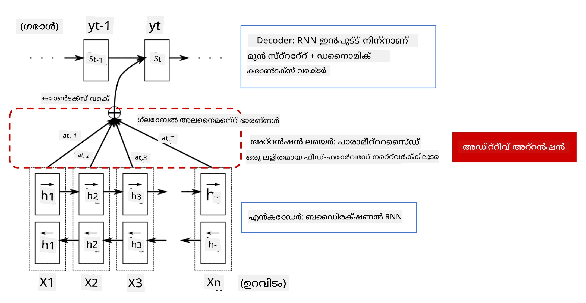
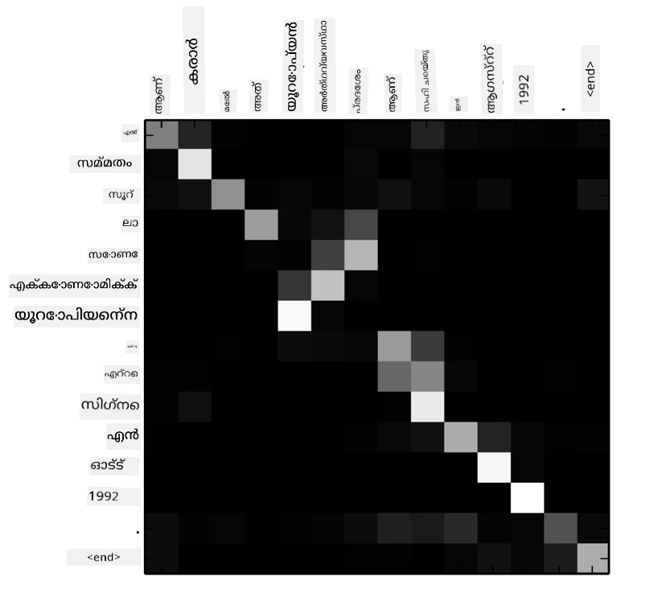
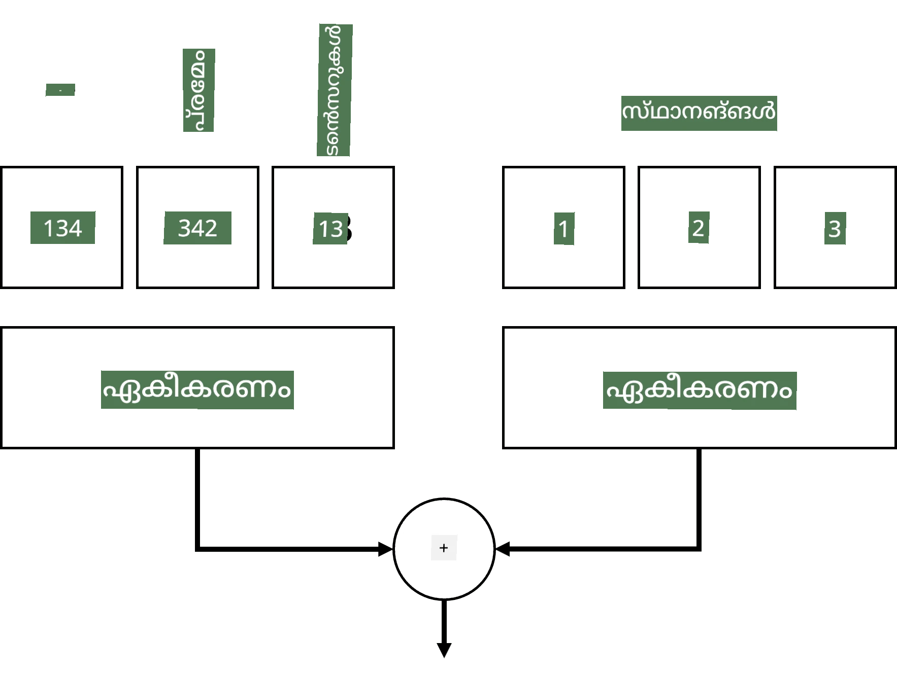
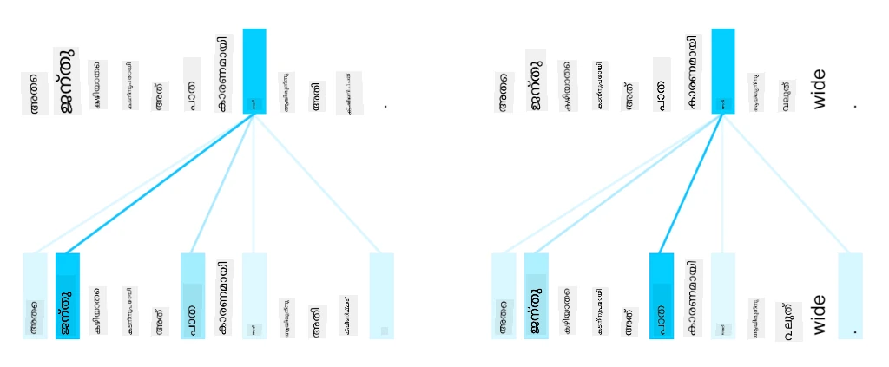
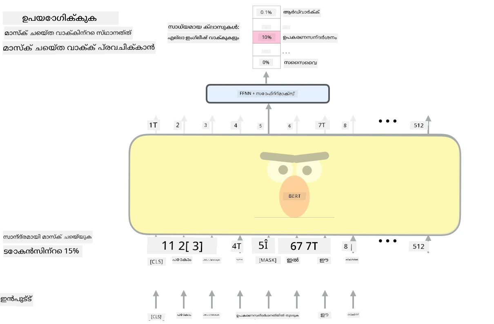

# ശ്രദ്ധാ യന്ത്രങ്ങളും ട്രാൻസ്ഫോർമറുകളും

## [പ്രീ-ലെക്ചർ ക്വിസ്](https://ff-quizzes.netlify.app/en/ai/quiz/35)

NLP മേഖലയിലെ ഏറ്റവും പ്രധാനപ്പെട്ട പ്രശ്നങ്ങളിൽ ഒന്നാണ് **മെഷീൻ ട്രാൻസ്ലേഷൻ**, ഗൂഗിൾ ട്രാൻസ്ലേറ്റ് പോലുള്ള ഉപകരണങ്ങളുടെ അടിസ്ഥാനമായ ഒരു അനിവാര്യമായ ജോലി. ഈ ഭാഗത്തിൽ, മെഷീൻ ട്രാൻസ്ലേഷനിൽ അല്ലെങ്കിൽ പൊതുവായി ഏതെങ്കിലും *sequence-to-sequence* ജോലിയിൽ (അത് **sentence transduction** എന്നും വിളിക്കുന്നു) ശ്രദ്ധ കേന്ദ്രീകരിക്കും.

RNN-കളിൽ, sequence-to-sequence രണ്ട് റിക്കറന്റ് നെറ്റ്വർക്കുകൾ ഉപയോഗിച്ച് നടപ്പിലാക്കുന്നു, അവയിൽ ഒരു നെറ്റ്വർക്ക്, **എൻകോഡർ**, ഇൻപുട്ട് സീക്വൻസിനെ ഒരു ഹിഡൻ സ്റ്റേറ്റിലേക്ക് ചുരുക്കുന്നു, മറ്റൊരു നെറ്റ്വർക്ക്, **ഡീകോഡർ**, ഈ ഹിഡൻ സ്റ്റേറ്റ് ഒരു വിവർത്തന ഫലമായി തുറക്കുന്നു. ഈ സമീപനത്തിൽ ചില പ്രശ്നങ്ങളുണ്ട്:

* എൻകോഡർ നെറ്റ്വർക്ക് അവസാന സ്റ്റേറ്റ് ഒരു വാചകത്തിന്റെ തുടക്കം ഓർക്കാൻ ബുദ്ധിമുട്ട് അനുഭവപ്പെടുന്നു, അതിനാൽ ദീർഘവാചകങ്ങൾക്ക് മോഡലിന്റെ ഗുണമേന്മ കുറയുന്നു
* ഒരു സീക്വൻസിലെ എല്ലാ വാക്കുകൾക്കും ഫലത്തിൽ ഒരുപോലെ സ്വാധീനം ഉണ്ടാകുന്നു. എന്നാൽ യാഥാർത്ഥ്യത്തിൽ, ഇൻപുട്ടിലെ ചില വാക്കുകൾ തുടർച്ചയായ ഔട്ട്പുട്ടുകളിൽ മറ്റുള്ളവയെക്കാൾ കൂടുതൽ സ്വാധീനം ചെലുത്താറുണ്ട്.

**ശ്രദ്ധാ യന്ത്രങ്ങൾ** RNN-ന്റെ ഓരോ ഔട്ട്പുട്ട് പ്രവചനത്തിലും ഓരോ ഇൻപുട്ട് വെക്ടറിന്റെ സാന്ദർഭിക സ്വാധീനം തൂക്കത്തോടെ നൽകാനുള്ള മാർഗമാണ്. ഇത് നടപ്പിലാക്കുന്നത് ഇൻപുട്ട് RNN-ന്റെ ഇടനില സ്റ്റേറ്റുകളും ഔട്ട്പുട്ട് RNN-ന്റെ ഇടനില സ്റ്റേറ്റുകളും തമ്മിൽ ഷോർട്ട്കട്ടുകൾ സൃഷ്ടിച്ച് ആണ്. ഈ രീതിയിൽ, ഔട്ട്പുട്ട് ചിഹ്നം yt സൃഷ്ടിക്കുമ്പോൾ, എല്ലാ ഇൻപുട്ട് ഹിഡൻ സ്റ്റേറ്റുകളും hi വ്യത്യസ്ത തൂക്കം കോഫിഷ്യന്റുകളായ &alpha;t,i ഉപയോഗിച്ച് പരിഗണിക്കും.

> [Bahdanau et al., 2015](https://arxiv.org/pdf/1409.0473.pdf) ലെ അഡിറ്റീവ് ശ്രദ്ധാ യന്ത്രം ഉൾപ്പെടുത്തിയ എൻകോഡർ-ഡീകോഡർ മോഡൽ, [ഈ ബ്ലോഗ് പോസ്റ്റ്](https://lilianweng.github.io/lil-log/2018/06/24/attention-attention.html) നിന്നുള്ള ഉദ്ധരണം

ശ്രദ്ധാ മാട്രിക്സ് {&alpha;i,j} ഒരു ഔട്ട്പുട്ട് വാക്കിന്റെ സൃഷ്ടിയിൽ ചില ഇൻപുട്ട് വാക്കുകൾ എത്രമാത്രം പങ്കുവഹിക്കുന്നുവെന്ന് പ്രതിനിധീകരിക്കും. താഴെ ഒരു ഉദാഹരണ മാട്രിക്സ് കാണിക്കുന്നു:

> [Bahdanau et al., 2015](https://arxiv.org/pdf/1409.0473.pdf) (ചിത്രം 3)

ശ്രദ്ധാ യന്ത്രങ്ങൾ NLP-യിലെ നിലവിലെ അല്ലെങ്കിൽ അടുത്തകാലത്തെ ഏറ്റവും മികച്ച നിലവാരത്തിന് വലിയ പങ്ക് വഹിക്കുന്നു. എന്നാൽ ശ്രദ്ധ ചേർക്കുന്നത് മോഡൽ പാരാമീറ്ററുകളുടെ എണ്ണം വളരെ വർദ്ധിപ്പിക്കുന്നു, ഇത് RNN-കളിൽ സ്കെയിലിംഗ് പ്രശ്നങ്ങൾ സൃഷ്ടിച്ചു. RNN-കളുടെ സ്കെയിലിംഗിന്റെ പ്രധാന തടസ്സം മോഡലുകളുടെ റിക്കറന്റ് സ്വഭാവം കാരണം ട്രെയിനിംഗ് ബാച്ച് ചെയ്യാനും പാരലലൈസ് ചെയ്യാനും ബുദ്ധിമുട്ട് ഉണ്ടാകുകയാണ്. RNN-യിൽ ഒരു സീക്വൻസിലെ ഓരോ ഘടകവും ക്രമത്തിൽ പ്രോസസ്സ് ചെയ്യേണ്ടതുണ്ടെന്നത് പാരലലൈസേഷൻ എളുപ്പമല്ല.

> [Google Blog](https://research.googleblog.com/2016/09/a-neural-network-for-machine.html) നിന്നുള്ള ചിത്രം

ശ്രദ്ധാ യന്ത്രങ്ങളുടെ സ്വീകരണവും ഈ തടസ്സവും ചേർന്ന് ഇന്ന് നാം അറിയുന്ന BERT മുതൽ Open-GPT3 വരെ ഉള്ള സ്റ്റേറ്റ് ഓഫ് ദി ആർട്ട് ട്രാൻസ്ഫോർമർ മോഡലുകളുടെ സൃഷ്ടിക്ക് വഴിതെളിച്ചു.

## ട്രാൻസ്ഫോർമർ മോഡലുകൾ

ട്രാൻസ്ഫോർമറുകളുടെ പ്രധാന ആശയങ്ങളിൽ ഒന്നാണ് RNN-കളുടെ ക്രമാനുസൃത സ്വഭാവം ഒഴിവാക്കി ട്രെയിനിംഗിനിടെ പാരലലൈസബിൾ ആയ മോഡൽ സൃഷ്ടിക്കുക. ഇത് രണ്ട് ആശയങ്ങൾ നടപ്പിലാക്കിയാണ് സാധിക്കുന്നത്:

* പൊസിഷണൽ എൻകോഡിംഗ്
* RNN-കളുടെ (അല്ലെങ്കിൽ CNN-കളുടെ) പകരം പാറ്റേണുകൾ പിടിക്കാൻ സെൽഫ്-അറ്റൻഷൻ മെക്കാനിസം ഉപയോഗിക്കൽ (അതിനാൽ ട്രാൻസ്ഫോർമറുകൾ പരിചയപ്പെടുത്തുന്ന പേപ്പർ *[Attention is all you need](https://arxiv.org/abs/1706.03762)* എന്നാണ് വിളിക്കുന്നത്)

### പൊസിഷണൽ എൻകോഡിംഗ്/എംബെഡിംഗ്

പൊസിഷണൽ എൻകോഡിംഗിന്റെ ആശയം ഇപ്രകാരം ആണ്:  
1. RNN-കൾ ഉപയോഗിക്കുമ്പോൾ, ടോക്കണുകളുടെ സാപേക്ഷ സ്ഥാനം ഘട്ടങ്ങളുടെ എണ്ണം കൊണ്ട് പ്രതിനിധീകരിക്കപ്പെടുന്നു, അതിനാൽ അത് വ്യക്തമായി പ്രതിനിധീകരിക്കേണ്ടതില്ല.  
2. എന്നാൽ ശ്രദ്ധയിലേക്ക് മാറുമ്പോൾ, സീക്വൻസിലെ ടോക്കണുകളുടെ സാപേക്ഷ സ്ഥാനങ്ങൾ അറിയേണ്ടതുണ്ട്.  
3. പൊസിഷണൽ എൻകോഡിംഗ് നേടാൻ, ടോക്കണുകളുടെ സീക്വൻസിന് കൂടെ ടോക്കൺ സ്ഥാനങ്ങളുടെ സീക്വൻസും (0,1, ...) ചേർക്കുന്നു.  
4. പിന്നീട് ടോക്കൺ സ്ഥാനത്തെ ടോക്കൺ എംബെഡിംഗ് വെക്ടറുമായി മിശ്രിതമാക്കുന്നു. സ്ഥാനത്തെ (പൂർണ്ണസംഖ്യ) വെക്ടറാക്കി മാറ്റാൻ വിവിധ സമീപനങ്ങൾ ഉപയോഗിക്കാം:

* ടോക്കൺ എംബെഡിംഗിനോട് സമാനമായ ട്രെയിനബിൾ എംബെഡിംഗ്. ഇതാണ് ഇവിടെ പരിഗണിക്കുന്നത്. ടോക്കണുകൾക്കും അവരുടെ സ്ഥാനങ്ങൾക്കും എംബെഡിംഗ് ലെയറുകൾ പ്രയോഗിച്ച് ഒരേ ഡൈമെൻഷനിലുള്ള എംബെഡിംഗ് വെക്ടറുകൾ ലഭിച്ച് അവ ചേർക്കുന്നു.
* ഒറിജിനൽ പേപ്പറിൽ നിർദ്ദേശിച്ച സ്ഥിരം പൊസിഷൻ എൻകോഡിംഗ് ഫംഗ്ഷൻ.

> എഴുത്തുകാരന്റെ ചിത്രം

പൊസിഷണൽ എംബെഡിംഗ് ഉപയോഗിച്ച് ലഭിക്കുന്ന ഫലം ഒരു സീക്വൻസിലെ ടോക്കണും അതിന്റെ സ്ഥാനം രണ്ടും എംബെഡ് ചെയ്യുന്നു.

### മൾട്ടി-ഹെഡ് സെൽഫ്-അറ്റൻഷൻ

അടുത്തത്, സീക്വൻസിനുള്ളിൽ ചില പാറ്റേണുകൾ പിടിക്കേണ്ടതാണ്. ഇതിന് ട്രാൻസ്ഫോർമറുകൾ **സെൽഫ്-അറ്റൻഷൻ** മെക്കാനിസം ഉപയോഗിക്കുന്നു, അതായത് ഇൻപുട്ടും ഔട്ട്പുട്ടും ഒരേ സീക്വൻസായാണ് ശ്രദ്ധ പ്രയോഗിക്കുന്നത്. സെൽഫ്-അറ്റൻഷൻ ഉപയോഗിച്ച് വാചകത്തിലെ **സന്ദർഭം** പരിഗണിക്കാനും വാക്കുകൾ തമ്മിലുള്ള ബന്ധം കാണാനും കഴിയും. ഉദാഹരണത്തിന്, *it* പോലുള്ള കോറഫറൻസുകൾ ഏത് വാക്കുകളെ സൂചിപ്പിക്കുന്നു എന്ന് കാണാനും, കൂടാതെ സന്ദർഭം പരിഗണിക്കാനും ഇത് സഹായിക്കുന്നു:

> [Google Blog](https://research.googleblog.com/2017/08/transformer-novel-neural-network.html) നിന്നുള്ള ചിത്രം

ട്രാൻസ്ഫോർമറുകളിൽ, **മൾട്ടി-ഹെഡ് അറ്റൻഷൻ** ഉപയോഗിക്കുന്നു, ഇത് നെറ്റ്വർക്കിന് വിവിധ തരം ആശ്രിതത്വങ്ങൾ പിടിക്കാൻ കഴിവ് നൽകുന്നു, ഉദാ: ദീർഘകാലവും ചെറുകാലവും വാക്കുകളുടെ ബന്ധങ്ങൾ, കോറഫറൻസ് മുതലായവ.

[TensorFlow Notebook](TransformersTF.ipynb) ട്രാൻസ്ഫോർമർ ലെയറുകളുടെ നടപ്പാക്കലിനെക്കുറിച്ച് കൂടുതൽ വിശദാംശങ്ങൾ ഉൾക്കൊള്ളുന്നു.

### എൻകോഡർ-ഡീകോഡർ ശ്രദ്ധ

ട്രാൻസ്ഫോർമറുകളിൽ, ശ്രദ്ധ രണ്ട് സ്ഥലങ്ങളിൽ ഉപയോഗിക്കുന്നു:

* ഇൻപുട്ട് ടെക്സ്റ്റിലെ പാറ്റേണുകൾ പിടിക്കാൻ സെൽഫ്-അറ്റൻഷൻ ഉപയോഗിച്ച്
* സീക്വൻസ് വിവർത്തനം നടത്താൻ - എൻകോഡറും ഡീകോഡറും തമ്മിലുള്ള ശ്രദ്ധ ലെയർ.

എൻകോഡർ-ഡീകോഡർ ശ്രദ്ധ RNN-കളിൽ ഉപയോഗിക്കുന്ന ശ്രദ്ധാ യന്ത്രത്തോട് വളരെ സമാനമാണ്, ഈ ഭാഗത്തിന്റെ തുടക്കത്തിൽ വിവരിച്ചതുപോലെ. ഈ അനിമേറ്റഡ് ഡയഗ്രാം എൻകോഡർ-ഡീകോഡർ ശ്രദ്ധയുടെ പങ്ക് വിശദീകരിക്കുന്നു.

ഓരോ ഇൻപുട്ട് സ്ഥാനം സ്വതന്ത്രമായി ഓരോ ഔട്ട്പുട്ട് സ്ഥാനത്തേക്കും മാപ്പ് ചെയ്യപ്പെടുന്നതിനാൽ, ട്രാൻസ്ഫോർമറുകൾ RNN-കളേക്കാൾ മികച്ച പാരലലൈസേഷൻ സാധ്യമാക്കുന്നു, ഇത് വലിയതും കൂടുതൽ പ്രകടനശേഷിയുള്ള ഭാഷാ മോഡലുകൾ സൃഷ്ടിക്കാൻ സഹായിക്കുന്നു. ഓരോ അറ്റൻഷൻ ഹെഡും വാക്കുകൾ തമ്മിലുള്ള വ്യത്യസ്ത ബന്ധങ്ങൾ പഠിക്കാൻ ഉപയോഗിക്കാം, ഇത് NLP ജോലികൾ മെച്ചപ്പെടുത്തുന്നു.

## BERT

**BERT** (Bidirectional Encoder Representations from Transformers) വളരെ വലിയ 12 ലെയർ *BERT-base* ഉം 24 ലെയർ *BERT-large* ഉം ഉള്ള മൾട്ടി-ലെയർ ട്രാൻസ്ഫോർമർ നെറ്റ്വർക്ക് ആണ്. മോഡൽ ആദ്യം വലിയ ടെക്സ്റ്റ് കോർപ്പസിൽ (വിക്കിപീഡിയ + പുസ്തകങ്ങൾ) അൺസൂപ്പർവൈസ്ഡ് ട്രെയിനിംഗിലൂടെ (വാചകത്തിലെ മറച്ചുവച്ച വാക്കുകൾ പ്രവചിച്ച്) പ്രീ-ട്രെയിൻ ചെയ്യപ്പെടുന്നു. പ്രീ-ട്രെയിനിംഗിൽ മോഡൽ ഭാഷാ ബോധം ഗഹനമായി ഉൾക്കൊള്ളുന്നു, പിന്നീട് ഫൈൻ ട്യൂണിങ്ങ് വഴി മറ്റ് ഡാറ്റാസെറ്റുകളുമായി ഉപയോഗിക്കാം. ഈ പ്രക്രിയ **ട്രാൻസ്ഫർ ലേണിംഗ്** എന്ന് വിളിക്കുന്നു.

> ചിത്രം [മൂലം](http://jalammar.github.io/illustrated-bert/)

## ✍️ അഭ്യാസങ്ങൾ: ട്രാൻസ്ഫോർമറുകൾ

താഴെ കൊടുത്തിരിക്കുന്ന നോട്ട്‌ബുക്കുകളിൽ നിങ്ങളുടെ പഠനം തുടരുക:

* [PyTorch-ൽ ട്രാൻസ്ഫോർമറുകൾ](TransformersPyTorch.ipynb)
* [TensorFlow-ൽ ട്രാൻസ്ഫോർമറുകൾ](TransformersTF.ipynb)

## സമാപനം

ഈ പാഠത്തിൽ നിങ്ങൾ ട്രാൻസ്ഫോർമറുകളും ശ്രദ്ധാ യന്ത്രങ്ങളും പഠിച്ചു, NLP ടൂൾബോക്സിലെ അനിവാര്യ ഉപകരണങ്ങൾ. BERT, DistilBERT, BigBird, OpenGPT3 തുടങ്ങിയ നിരവധി ട്രാൻസ്ഫോർമർ ആർക്കിടെക്ചറുകളുടെ വ്യത്യാസങ്ങൾ ഉണ്ട്, അവ ഫൈൻ ട്യൂൺ ചെയ്യാവുന്നതാണ്. [HuggingFace പാക്കേജ്](https://github.com/huggingface/) PyTorch, TensorFlow എന്നിവയിൽ ഈ ആർക്കിടെക്ചറികൾ പരിശീലിപ്പിക്കാൻ റിപോസിറ്ററികൾ നൽകുന്നു.

## 🚀 ചലഞ്ച്

## [പോസ്റ്റ്-ലെക്ചർ ക്വിസ്](https://ff-quizzes.netlify.app/en/ai/quiz/36)

## അവലോകനം & സ്വയം പഠനം

* [ബ്ലോഗ് പോസ്റ്റ്](https://mchromiak.github.io/articles/2017/Sep/12/Transformer-Attention-is-all-you-need/), ക്ലാസിക്കൽ [Attention is all you need](https://arxiv.org/abs/1706.03762) പേപ്പർ ട്രാൻസ്ഫോർമറുകൾ വിശദീകരിക്കുന്നു.
* [ട്രാൻസ്ഫോർമറുകൾ വിശദീകരിക്കുന്ന ബ്ലോഗ് പോസ്റ്റുകളുടെ ഒരു പരമ്പര](https://towardsdatascience.com/transformers-explained-visually-part-1-overview-of-functionality-95a6dd460452), ആർക്കിടെക്ചർ വിശദമായി വിശദീകരിക്കുന്നു.

## [അസൈൻമെന്റ്](assignment.md)

---

<!-- CO-OP TRANSLATOR DISCLAIMER START -->
**അസൂയാ**:  
ഈ രേഖ AI വിവർത്തന സേവനം [Co-op Translator](https://github.com/Azure/co-op-translator) ഉപയോഗിച്ച് വിവർത്തനം ചെയ്തതാണ്. നാം കൃത്യതയ്ക്ക് ശ്രമിച്ചിട്ടുണ്ടെങ്കിലും, സ്വയം പ്രവർത്തിക്കുന്ന വിവർത്തനങ്ങളിൽ പിശകുകൾ അല്ലെങ്കിൽ തെറ്റുകൾ ഉണ്ടാകാമെന്ന് ദയവായി ശ്രദ്ധിക്കുക. അതിന്റെ മാതൃഭാഷയിലുള്ള യഥാർത്ഥ രേഖയാണ് പ്രാമാണികമായ ഉറവിടം എന്ന് പരിഗണിക്കേണ്ടതാണ്. നിർണായകമായ വിവരങ്ങൾക്ക്, പ്രൊഫഷണൽ മനുഷ്യ വിവർത്തനം ശുപാർശ ചെയ്യപ്പെടുന്നു. ഈ വിവർത്തനം ഉപയോഗിക്കുന്നതിൽ നിന്നുണ്ടാകുന്ന ഏതെങ്കിലും തെറ്റിദ്ധാരണകൾക്കോ തെറ്റായ വ്യാഖ്യാനങ്ങൾക്കോ ഞങ്ങൾ ഉത്തരവാദികളല്ല.
<!-- CO-OP TRANSLATOR DISCLAIMER END -->