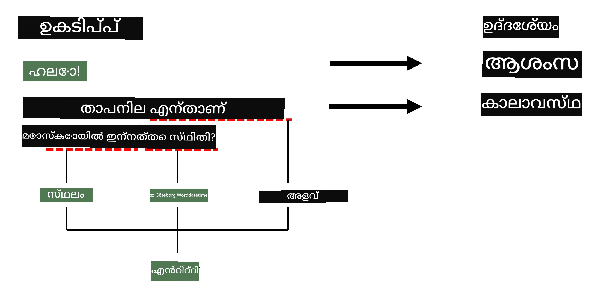
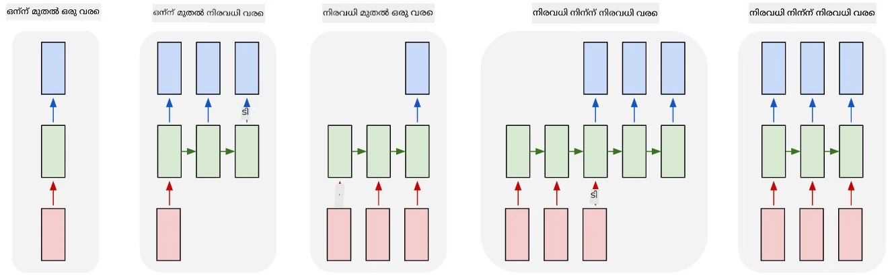

# നെയിംഡ് എന്റിറ്റി റെക്കഗ്നിഷൻ

ഇതുവരെ, നാം പ്രധാനമായും ഒരു NLP ടാസ്കായ ക്ലാസിഫിക്കേഷനിൽ ശ്രദ്ധ കേന്ദ്രീകരിച്ചിരുന്നു. എന്നാൽ, ന്യൂറൽ നെറ്റ്വർക്കുകൾ ഉപയോഗിച്ച് പൂർത്തിയാക്കാവുന്ന മറ്റ് NLP ടാസ്കുകളും ഉണ്ട്. അവയിൽ ഒന്നാണ് **[നെയിംഡ് എന്റിറ്റി റെക്കഗ്നിഷൻ](https://wikipedia.org/wiki/Named-entity_recognition)** (NER), ഇത് ടെക്സ്റ്റിനുള്ളിൽ പ്രത്യേക എന്റിറ്റികൾ തിരിച്ചറിയുന്നതുമായി ബന്ധപ്പെട്ടതാണ്, ഉദാഹരണത്തിന് സ്ഥലങ്ങൾ, വ്യക്തി പേരുകൾ, തീയതി-സമയം ഇടവേളകൾ, രാസ സൂത്രവാക്യങ്ങൾ തുടങ്ങിയവ.

## [പ്രീ-ലെക്ചർ ക്വിസ്](https://ff-quizzes.netlify.app/en/ai/quiz/37)

## NER ഉപയോഗിക്കുന്ന ഉദാഹരണം

നിങ്ങൾക്ക് ആമസോൺ അലക്സാ അല്ലെങ്കിൽ ഗൂഗിൾ അസിസ്റ്റന്റ് പോലുള്ള ഒരു നാച്ചുറൽ ലാംഗ്വേജ് ചാറ്റ് ബോട്ട് വികസിപ്പിക്കണമെന്ന് കരുതുക. ബുദ്ധിമുട്ടുള്ള ചാറ്റ് ബോട്ടുകൾ പ്രവർത്തിക്കുന്നത് ഉപയോക്താവ് എന്ത് ആഗ്രഹിക്കുന്നു എന്ന് *അർത്ഥമാക്കുന്നതിലൂടെ* ആണ്, ഇൻപുട്ട് വാക്യത്തിൽ ടെക്സ്റ്റ് ക്ലാസിഫിക്കേഷൻ നടത്തിയാണ് ഇത് സാധ്യമാകുന്നത്. ഈ ക്ലാസിഫിക്കേഷന്റെ ഫലം **ഇന്റന്റ്** എന്നറിയപ്പെടുന്നു, ഇത് ചാറ്റ് ബോട്ട് എന്ത് ചെയ്യണമെന്ന് നിർണ്ണയിക്കുന്നു.

> ചിത്രകാരൻ: ലേഖകൻ

എങ്കിലും, ഉപയോക്താവ് വാചകത്തിന്റെ ഭാഗമായ ചില പാരാമീറ്ററുകൾ നൽകാം. ഉദാഹരണത്തിന്, കാലാവസ്ഥ ചോദിക്കുമ്പോൾ, അവൾ ഒരു സ്ഥലം അല്ലെങ്കിൽ തീയതി വ്യക്തമാക്കാം. ബോട്ട് ആ എന്റിറ്റികൾ മനസ്സിലാക്കി, പ്രവർത്തനം നടത്തുന്നതിന് മുമ്പ് പാരാമീറ്റർ സ്ലോട്ടുകൾ പൂരിപ്പിക്കണം. ഇതാണ് NERയുടെ പ്രധാന പങ്ക്.

> ✅ മറ്റൊരു ഉദാഹരണം [ശാസ്ത്രീയ മെഡിക്കൽ പേപ്പറുകൾ വിശകലനം ചെയ്യൽ](https://soshnikov.com/science/analyzing-medical-papers-with-azure-and-text-analytics-for-health/) ആണ്. പ്രധാനമായി നോക്കേണ്ടത് പ്രത്യേക മെഡിക്കൽ പദങ്ങൾ, രോഗങ്ങൾ, മെഡിക്കൽ സബ്സ്റ്റാൻസുകൾ എന്നിവയാണ്. കുറച്ച് രോഗങ്ങൾ സബ്‌സ്റ്റ്രിംഗ് സെർച്ച് ഉപയോഗിച്ച് കണ്ടെത്താനാകാമെങ്കിലും, രാസ സംയുക്തങ്ങൾ, മരുന്ന് പേരുകൾ പോലുള്ള കൂടുതൽ സങ്കീർണ്ണ എന്റിറ്റികൾക്ക് കൂടുതൽ സങ്കീർണ്ണമായ സമീപനം ആവശ്യമാണ്.

## NER ടോക്കൺ ക്ലാസിഫിക്കേഷനായി

NER മോഡലുകൾ അടിസ്ഥാനത്തിൽ **ടോക്കൺ ക്ലാസിഫിക്കേഷൻ മോഡലുകളാണ്**, കാരണം ഓരോ ഇൻപുട്ട് ടോക്കണിനും അത് ഒരു എന്റിറ്റിയിലാണോ അല്ലയോ എന്ന് തീരുമാനിക്കണം, എങ്കിൽ ഏത് എന്റിറ്റി ക്ലാസിലാണെന്ന് നിർണ്ണയിക്കണം.

താഴെ കാണുന്ന പേപ്പർ തലക്കെട്ട് പരിഗണിക്കൂ:

**ട്രൈകസ്പിഡ് വാൽവ് റീഗർജിറ്റേഷൻ**യും **ലിഥിയം കാർബണേറ്റ്** **ടോക്സിസിറ്റി**യും ഒരു പുതുതായി ജനിച്ച ശിശുവിൽ.

ഇവിടെ എന്റിറ്റികൾ:

* ട്രൈകസ്പിഡ് വാൽവ് റീഗർജിറ്റേഷൻ ഒരു രോഗമാണ് (`DIS`)
* ലിഥിയം കാർബണേറ്റ് ഒരു രാസ പദാർത്ഥമാണ് (`CHEM`)
* ടോക്സിസിറ്റി ഒരു രോഗവുമാണ് (`DIS`)

ഒരു എന്റിറ്റി പല ടോക്കണുകളിലായി വ്യാപിച്ചിരിക്കാം. ഈ സാഹചര്യത്തിൽ, രണ്ട് തുടർച്ചയായ എന്റിറ്റികൾ തമ്മിൽ വ്യത്യാസപ്പെടുത്തേണ്ടതുണ്ട്. അതിനാൽ, ഓരോ എന്റിറ്റിക്കും രണ്ട് ക്ലാസുകൾ ഉപയോഗിക്കുന്നത് സാധാരണമാണ് - ഒരു ടോക്കൺ എന്റിറ്റിയുടെ ആദ്യ ടോക്കൺ ആണെന്ന് സൂചിപ്പിക്കുന്നതിന് (അധികം ഉപയോഗിക്കുന്നത് `B-` പ്രിഫിക്സ്, **b**eginning), മറ്റൊന്ന് എന്റിറ്റിയുടെ തുടർച്ച ( `I-`, **i**nner ടോക്കൺ). എല്ലാ മറ്റ് ടോക്കണുകൾക്കായി `O` ക്ലാസ് ഉപയോഗിക്കുന്നു. ഇത്തരത്തിലുള്ള ടോക്കൺ ടാഗിംഗ് [BIO ടാഗിംഗ്](https://en.wikipedia.org/wiki/Inside%E2%80%93outside%E2%80%93beginning_(tagging)) (അഥവാ IOB) എന്ന് വിളിക്കുന്നു. ടാഗ് ചെയ്താൽ, നമ്മുടെ തലക്കെട്ട് ഇങ്ങനെ കാണപ്പെടും:

ടോക്കൺ | ടാഗ്
------|-----
Tricuspid | B-DIS
valve | I-DIS
regurgitation | I-DIS
and | O
lithium | B-CHEM
carbonate | I-CHEM
toxicity | B-DIS
in | O
a | O
newborn | O
infant | O
. | O

ടോക്കണുകളും ക്ലാസുകളും തമ്മിൽ ഒന്ന് ഒന്ന് പൊരുത്തപ്പെടുത്തേണ്ടതിനാൽ, ഈ ചിത്രത്തിൽ നിന്ന് ഒരു വലതുവശത്തെ **many-to-many** ന്യൂറൽ നെറ്റ്വർക്ക് മോഡൽ പരിശീലിപ്പിക്കാം:

> *ചിത്രം [ഈ ബ്ലോഗ് പോസ്റ്റ്](http://karpathy.github.io/2015/05/21/rnn-effectiveness/) ൽ നിന്നുള്ളതാണ്, ലേഖകൻ [Andrej Karpathy](http://karpathy.github.io/). NER ടോക്കൺ ക്ലാസിഫിക്കേഷൻ മോഡലുകൾ ഈ ചിത്രത്തിലെ വലതുവശത്തെ നെറ്റ്വർക്ക് ആർക്കിടെക്ചറിനോട് പൊരുത്തപ്പെടുന്നു.*

## NER മോഡലുകൾ പരിശീലിപ്പിക്കൽ

NER മോഡൽ അടിസ്ഥാനത്തിൽ ടോക്കൺ ക്ലാസിഫിക്കേഷൻ മോഡലായതിനാൽ, നാം ഇതിനായി പരിചിതമായ RNNകൾ ഉപയോഗിക്കാം. ഈ സാഹചര്യത്തിൽ, ഓരോ റികറന്റ് നെറ്റ്വർക്ക് ബ്ലോക്കും ടോക്കൺ ഐഡി നൽകും. താഴെ കാണുന്ന ഉദാഹരണ നോട്ട്‌ബുക്ക് LSTM ഉപയോഗിച്ച് ടോക്കൺ ക്ലാസിഫിക്കേഷൻ എങ്ങനെ പരിശീലിപ്പിക്കാമെന്ന് കാണിക്കുന്നു.

## ✍️ ഉദാഹരണ നോട്ട്‌ബുക്കുകൾ: NER

താഴെ കാണുന്ന നോട്ട്‌ബുക്കിൽ നിങ്ങളുടെ പഠനം തുടരുക:

* [TensorFlow ഉപയോഗിച്ച് NER](NER-TF.ipynb)

## സംഗ്രഹം

NER മോഡൽ ഒരു **ടോക്കൺ ക്ലാസിഫിക്കേഷൻ മോഡലാണ്**, അതായത് ടോക്കൺ ക്ലാസിഫിക്കേഷൻ നടത്താൻ ഇത് ഉപയോഗിക്കാം. ഇത് NLPയിൽ വളരെ സാധാരണമായ ഒരു ടാസ്കാണ്, ടെക്സ്റ്റിനുള്ളിൽ പ്രത്യേക എന്റിറ്റികൾ തിരിച്ചറിയാൻ സഹായിക്കുന്നു, ഉദാഹരണത്തിന് സ്ഥലങ്ങൾ, പേരുകൾ, തീയതികൾ തുടങ്ങിയവ.

## 🚀 ചലഞ്ച്

താഴെ നൽകിയിരിക്കുന്ന അസൈൻമെന്റ് പൂർത്തിയാക്കി മെഡിക്കൽ പദങ്ങൾക്കുള്ള നെയിംഡ് എന്റിറ്റി റെക്കഗ്നിഷൻ മോഡൽ പരിശീലിപ്പിക്കുക, പിന്നീട് അത് വ്യത്യസ്ത ഡാറ്റാസെറ്റിൽ പരീക്ഷിക്കുക.

## [പോസ്റ്റ്-ലെക്ചർ ക്വിസ്](https://ff-quizzes.netlify.app/en/ai/quiz/38)

## അവലോകനം & സ്വയം പഠനം

[The Unreasonable Effectiveness of Recurrent Neural Networks](http://karpathy.github.io/2015/05/21/rnn-effectiveness/) എന്ന ബ്ലോഗ് വായിച്ച്, ആ ലേഖനത്തിലെ Further Reading വിഭാഗം പിന്തുടർന്ന് നിങ്ങളുടെ അറിവ് കൂടുതൽ ആഴത്തിൽ വികസിപ്പിക്കുക.

## [അസൈൻമെന്റ്](lab/README.md)

ഈ പാഠത്തിനുള്ള അസൈൻമെന്റിൽ, നിങ്ങൾ ഒരു മെഡിക്കൽ എന്റിറ്റി റെക്കഗ്നിഷൻ മോഡൽ പരിശീലിപ്പിക്കേണ്ടതാണ്. ഈ പാഠത്തിൽ വിവരിച്ച പോലെ LSTM മോഡൽ പരിശീലിപ്പിച്ച് തുടങ്ങാം, തുടർന്ന് BERT ട്രാൻസ്ഫോർമർ മോഡൽ ഉപയോഗിക്കാം. എല്ലാ വിശദാംശങ്ങൾക്കായി [നിർദ്ദേശങ്ങൾ](lab/README.md) വായിക്കുക.

---

<!-- CO-OP TRANSLATOR DISCLAIMER START -->
**അസൂയാപത്രം**:  
ഈ രേഖ AI വിവർത്തന സേവനം [Co-op Translator](https://github.com/Azure/co-op-translator) ഉപയോഗിച്ച് വിവർത്തനം ചെയ്തതാണ്. നാം കൃത്യതയ്ക്ക് ശ്രമിച്ചിട്ടുണ്ടെങ്കിലും, യന്ത്രം ചെയ്ത വിവർത്തനങ്ങളിൽ പിശകുകൾ അല്ലെങ്കിൽ തെറ്റുകൾ ഉണ്ടാകാമെന്ന് ദയവായി ശ്രദ്ധിക്കുക. അതിന്റെ മാതൃഭാഷയിലുള്ള യഥാർത്ഥ രേഖയാണ് പ്രാമാണികമായ ഉറവിടം എന്ന് കരുതേണ്ടതാണ്. നിർണായകമായ വിവരങ്ങൾക്ക്, പ്രൊഫഷണൽ മനുഷ്യ വിവർത്തനം ശുപാർശ ചെയ്യപ്പെടുന്നു. ഈ വിവർത്തനം ഉപയോഗിക്കുന്നതിൽ നിന്നുണ്ടാകുന്ന ഏതെങ്കിലും തെറ്റിദ്ധാരണകൾക്കോ വ്യാഖ്യാനക്കേടുകൾക്കോ ഞങ്ങൾ ഉത്തരവാദികളല്ല.
<!-- CO-OP TRANSLATOR DISCLAIMER END -->