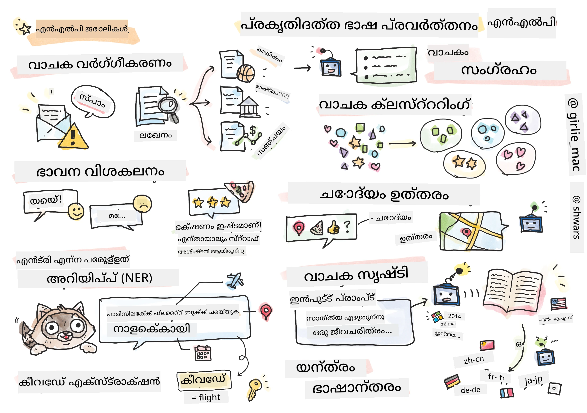

# സ്വാഭാവിക ഭാഷാ പ്രോസസ്സിംഗ്



ഈ ഭാഗത്തിൽ, നാം **സ്വാഭാവിക ഭാഷാ പ്രോസസ്സിംഗ് (NLP)** സംബന്ധിച്ച ടാസ്കുകൾ കൈകാര്യം ചെയ്യാൻ ന്യൂറൽ നെറ്റ്‌വർക്കുകൾ ഉപയോഗിക്കുന്നതിൽ ശ്രദ്ധ കേന്ദ്രീകരിക്കും. കമ്പ്യൂട്ടറുകൾക്ക് പരിഹരിക്കാൻ കഴിയേണ്ട നിരവധി NLP പ്രശ്നങ്ങൾ ഉണ്ട്:

* **ടെക്സ്റ്റ് ക്ലാസിഫിക്കേഷൻ** എന്നത് ടെക്സ്റ്റ് സീക്വൻസുകളുമായി ബന്ധപ്പെട്ട ഒരു സാധാരണ ക്ലാസിഫിക്കേഷൻ പ്രശ്നമാണ്. ഉദാഹരണങ്ങൾ: ഇമെയിൽ സന്ദേശങ്ങളെ സ്പാം അല്ലെങ്കിൽ നോൺ-സ്പാം ആയി വേർതിരിക്കുക, അല്ലെങ്കിൽ ലേഖനങ്ങളെ സ്പോർട്, ബിസിനസ്, രാഷ്ട്രീയ തുടങ്ങിയ വിഭാഗങ്ങളായി വർഗ്ഗീകരിക്കുക. ചാറ്റ് ബോട്ടുകൾ വികസിപ്പിക്കുമ്പോൾ, ഉപയോക്താവ് പറയാൻ ഉദ്ദേശിച്ച കാര്യം മനസിലാക്കേണ്ടതുണ്ടാകാം — ഈ സാഹചര്യത്തിൽ നാം **ഇന്റന്റ് ക്ലാസിഫിക്കേഷൻ** കൈകാര്യം ചെയ്യുകയാണ്. പലപ്പോഴും, ഇന്റന്റ് ക്ലാസിഫിക്കേഷനിൽ നിരവധി വിഭാഗങ്ങൾ കൈകാര്യം ചെയ്യേണ്ടി വരും.
* **സെന്റിമെന്റ് അനാലിസിസ്** ഒരു സാധാരണ റെഗ്രഷൻ പ്രശ്നമാണ്, ഇവിടെ ഒരു വാചകത്തിന്റെ അർത്ഥം എത്രത്തോളം പോസിറ്റീവ് അല്ലെങ്കിൽ നെഗറ്റീവ് ആണെന്ന് സൂചിപ്പിക്കുന്ന ഒരു സംഖ്യ (സെന്റിമെന്റ്) നമുക്ക് നൽകേണ്ടതുണ്ട്. സെന്റിമെന്റ് അനാലിസിസിന്റെ കൂടുതൽ പുരോഗമിച്ച രൂപമാണ് **അസ്പെക്ട്-ബേസ്ഡ് സെന്റിമെന്റ് അനാലിസിസ്** (ABSA), ഇവിടെ മുഴുവൻ വാചകത്തിന് പകരം അതിന്റെ വ്യത്യസ്ത ഭാഗങ്ങൾ (അസ്പെക്ടുകൾ) അനുസരിച്ച് സെന്റിമെന്റ് നൽകുന്നു, ഉദാ: *ഈ റസ്റ്റോറന്റിൽ, എനിക്ക് ഭക്ഷണം ഇഷ്ടമായി, പക്ഷേ അന്തരീക്ഷം ഭയങ്കരമായിരുന്നു*.
* **നെയിംഡ് എന്റിറ്റി റെക്കഗ്നിഷൻ** (NER) എന്നത് ടെക്സ്റ്റിൽ നിന്നുള്ള പ്രത്യേക എന്റിറ്റികൾ കണ്ടെത്താനുള്ള പ്രശ്നമാണ്. ഉദാഹരണത്തിന്, *ഞാൻ നാളെ പാരിസിലേക്ക് പറക്കണം* എന്ന വാചകത്തിൽ *നാളെ* എന്നത് DATE (തീയതി) എന്നെ സൂചിപ്പിക്കുന്നു, *പാരിസ്* LOCATION (സ്ഥലം) ആണ്.
* **കീവേഡ് എക്സ്ട്രാക്ഷൻ** NER പോലെയാണ്, പക്ഷേ നമുക്ക് പ്രത്യേക എന്റിറ്റി തരം മുൻപരിചയം ഇല്ലാതെ വാചകത്തിന്റെ അർത്ഥത്തിന് പ്രധാനപ്പെട്ട വാക്കുകൾ സ്വയം കണ്ടെത്തേണ്ടതുണ്ട്.
* **ടെക്സ്റ്റ് ക്ലസ്റ്ററിംഗ്** സമാനമായ വാചകങ്ങൾ കൂട്ടമായി ഗ്രൂപ്പ് ചെയ്യാൻ ഉപകാരപ്പെടും, ഉദാഹരണത്തിന്, ടെക്നിക്കൽ സപ്പോർട്ട് സംഭാഷണങ്ങളിൽ സമാനമായ അഭ്യർത്ഥനകൾ.
* **ക്വഷൻ ആൻസറിംഗ്** ഒരു മോഡലിന് ഒരു പ്രത്യേക ചോദ്യത്തിന് ഉത്തരം നൽകാനുള്ള കഴിവാണ്. മോഡൽ ഒരു ടെക്സ്റ്റ് പാസേജ്, ഒരു ചോദ്യവും ഇൻപുട്ടായി സ്വീകരിച്ച്, ചോദ്യത്തിന് ഉത്തരം ഉള്ള ടെക്സ്റ്റിലെ സ്ഥലം കണ്ടെത്തണം (അല്ലെങ്കിൽ ചിലപ്പോൾ ഉത്തരം സ്വയം സൃഷ്ടിക്കണം).
* **ടെക്സ്റ്റ് ജനറേഷൻ** ഒരു മോഡലിന് പുതിയ ടെക്സ്റ്റ് സൃഷ്ടിക്കാനുള്ള കഴിവാണ്. ഇത് ഒരു ക്ലാസിഫിക്കേഷൻ ടാസ്കായി കണക്കാക്കാം, ഒരു *ടെക്സ്റ്റ് പ്രോംപ്റ്റ്* അടിസ്ഥാനമാക്കി അടുത്ത അക്ഷരം/വാക്ക് പ്രവചിക്കുന്നത്. GPT-3 പോലുള്ള പുരോഗമിച്ച ടെക്സ്റ്റ് ജനറേഷൻ മോഡലുകൾ [prompt programming](https://towardsdatascience.com/software-3-0-how-prompting-will-change-the-rules-of-the-game-a982fbfe1e0) അല്ലെങ്കിൽ [prompt engineering](https://medium.com/swlh/openai-gpt-3-and-prompt-engineering-dcdc2c5fcd29) എന്ന സാങ്കേതിക വിദ്യ ഉപയോഗിച്ച് മറ്റ് NLP ടാസ്കുകളും പരിഹരിക്കാൻ കഴിയും.
* **ടെക്സ്റ്റ് സംഗ്രഹണം** കമ്പ്യൂട്ടർ ഒരു നീണ്ട ടെക്സ്റ്റ് "വായിച്ച്" അതിന്റെ പ്രധാനപ്പെട്ട ഭാഗങ്ങൾ കുറച്ച് വാചകങ്ങളായി സംഗ്രഹിക്കുന്ന സാങ്കേതിക വിദ്യയാണ്.
* **മെഷീൻ ട്രാൻസ്ലേഷൻ** ഒരു ഭാഷയിൽ ടെക്സ്റ്റ് മനസിലാക്കലും മറ്റൊരു ഭാഷയിൽ ടെക്സ്റ്റ് സൃഷ്ടിക്കലും ചേർന്ന ഒരു പ്രക്രിയയായി കാണാം.

ആദ്യകാലത്ത്, NLP ടാസ്കുകൾ പ്രധാനമായും വ്യാകരണങ്ങൾ പോലുള്ള പരമ്പരാഗത രീതികൾ ഉപയോഗിച്ച് പരിഹരിക്കപ്പെട്ടിരുന്നു. ഉദാഹരണത്തിന്, മെഷീൻ ട്രാൻസ്ലേഷനിൽ പാഴ്സറുകൾ ഉപയോഗിച്ച് പ്രാരംഭ വാചകം സിന്റാക്സ് ട്രീയിലേക്ക് മാറ്റി, പിന്നീട് വാചകത്തിന്റെ അർത്ഥം പ്രതിനിധീകരിക്കുന്ന ഉയർന്ന തലത്തിലുള്ള സെമാന്റിക് ഘടനകൾ കണ്ടെത്തി, ആ അർത്ഥവും ലക്ഷ്യഭാഷയുടെ വ്യാകരണവും അടിസ്ഥാനമാക്കി ഫലം സൃഷ്ടിച്ചിരുന്നു. ഇന്നത്തെ കാലത്ത്, പല NLP ടാസ്കുകളും ന്യൂറൽ നെറ്റ്‌വർക്കുകൾ ഉപയോഗിച്ച് കൂടുതൽ ഫലപ്രദമായി പരിഹരിക്കപ്പെടുന്നു.

> പല ക്ലാസിക്കൽ NLP രീതികളും [Natural Language Processing Toolkit (NLTK)](https://www.nltk.org) പൈതൺ ലൈബ്രറിയിൽ നടപ്പിലാക്കിയിട്ടുണ്ട്. വിവിധ NLP ടാസ്കുകൾ NLTK ഉപയോഗിച്ച് എങ്ങനെ പരിഹരിക്കാമെന്ന് വിശദീകരിക്കുന്ന മികച്ച [NLTK ബുക്ക്](https://www.nltk.org/book/) ഓൺലൈനിൽ ലഭ്യമാണ്.

നമ്മുടെ കോഴ്സിൽ, നാം പ്രധാനമായും NLP-ക്കായി ന്യൂറൽ നെറ്റ്‌വർക്കുകൾ ഉപയോഗിക്കുന്നതിൽ ശ്രദ്ധ കേന്ദ്രീകരിക്കും, ആവശ്യമായിടത്ത് NLTK ഉപയോഗിക്കും.

നാം ഇതിനകം ടാബുലാർ ഡാറ്റയും ചിത്രങ്ങളും കൈകാര്യം ചെയ്യാൻ ന്യൂറൽ നെറ്റ്‌വർക്കുകൾ ഉപയോഗിക്കുന്നതിനെക്കുറിച്ച് പഠിച്ചിട്ടുണ്ട്. ആ ഡാറ്റാ തരം들과 ടെക്സ്റ്റ് തമ്മിലുള്ള പ്രധാന വ്യത്യാസം, ടെക്സ്റ്റ് ഒരു വ്യത്യസ്ത നീളമുള്ള സീക്വൻസാണ്, എന്നാൽ ചിത്രങ്ങളുടെ ഇൻപുട്ട് വലുപ്പം മുൻകൂട്ടി അറിയപ്പെടുന്നു. കോൺവല്യൂഷണൽ നെറ്റ്‌വർക്കുകൾ ഇൻപുട്ടിൽ നിന്നുള്ള പാറ്റേണുകൾ കണ്ടെത്താൻ കഴിയും, പക്ഷേ ടെക്സ്റ്റിലെ പാറ്റേണുകൾ കൂടുതൽ സങ്കീർണ്ണമാണ്. ഉദാ: നിഷേധം വിഷയം മുതൽ അകലെ പല വാക്കുകൾക്കായി വേർതിരിക്കപ്പെട്ടാലും (ഉദാ: *I do not like oranges* vs. *I do not like those big colorful tasty oranges*), അത് ഒരേ പാറ്റേണായി വ്യാഖ്യാനിക്കണം. അതിനാൽ, ഭാഷ കൈകാര്യം ചെയ്യാൻ നാം പുതിയ ന്യൂറൽ നെറ്റ്‌വർക്ക് തരംകൾ, ഉദാ: *റികറന്റ് നെറ്റ്‌വർക്കുകൾ* (RNN)യും *ട്രാൻസ്ഫോർമറുകളും* പരിചയപ്പെടുത്തേണ്ടതുണ്ട്.

## ലൈബ്രറികൾ ഇൻസ്റ്റാൾ ചെയ്യുക

നിങ്ങൾ ഈ കോഴ്സ് റൺ ചെയ്യാൻ ലോക്കൽ പൈതൺ ഇൻസ്റ്റലേഷൻ ഉപയോഗിക്കുന്നുവെങ്കിൽ, താഴെ കാണുന്ന കമാൻഡുകൾ ഉപയോഗിച്ച് NLP-ക്കായി ആവശ്യമായ എല്ലാ ലൈബ്രറികളും ഇൻസ്റ്റാൾ ചെയ്യേണ്ടതുണ്ടാകും:

**PyTorch-ക്കായി**
```bash
pip install -r requirements-torch.txt
```
**TensorFlow-ക്കായി**
```bash
pip install -r requirements-tf.txt
```

> TensorFlow ഉപയോഗിച്ച് NLP പരീക്ഷിക്കാൻ [Microsoft Learn](https://docs.microsoft.com/learn/modules/intro-natural-language-processing-tensorflow/?WT.mc_id=academic-77998-cacaste) സന്ദർശിക്കാം

## GPU മുന്നറിയിപ്പ്

ഈ ഭാഗത്തിൽ, ചില ഉദാഹരണങ്ങളിൽ നാം വളരെ വലിയ മോഡലുകൾ പരിശീലിപ്പിക്കും.
* **GPU-സഹായമുള്ള കമ്പ്യൂട്ടർ ഉപയോഗിക്കുക**: വലിയ മോഡലുകളുമായി ജോലി ചെയ്യുമ്പോൾ കാത്തിരിപ്പു കുറയ്ക്കാൻ GPU-സഹായമുള്ള കമ്പ്യൂട്ടറിൽ നിങ്ങളുടെ നോട്ട്‌ബുക്കുകൾ പ്രവർത്തിപ്പിക്കുന്നത് ഉചിതമാണ്.
* **GPU മെമ്മറി പരിമിതികൾ**: വലിയ മോഡലുകൾ പരിശീലിപ്പിക്കുമ്പോൾ GPU മെമ്മറി തീരാൻ സാധ്യതയുണ്ട്.
* **GPU മെമ്മറി ഉപയോഗം**: പരിശീലന സമയത്ത് GPU മെമ്മറി ഉപയോഗം മിനിബാച്ച് വലുപ്പം പോലുള്ള പല ഘടകങ്ങളിൽ ആശ്രയിച്ചിരിക്കും.
* **മിനിബാച്ച് വലുപ്പം കുറയ്ക്കുക**: GPU മെമ്മറി പ്രശ്നങ്ങൾ നേരിടുമ്പോൾ, കോഡിൽ മിനിബാച്ച് വലുപ്പം കുറയ്ക്കുന്നത് പരിഹാരമായി പരിഗണിക്കാം.
* **TensorFlow GPU മെമ്മറി റിലീസ്**: പഴയ TensorFlow പതിപ്പുകൾ ഒരേ പൈതൺ കർണലിൽ പല മോഡലുകളും പരിശീലിപ്പിക്കുമ്പോൾ GPU മെമ്മറി ശരിയായി റിലീസ് ചെയ്യാതെ പോകാം. GPU മെമ്മറി ഉപയോഗം കാര്യക്ഷമമായി നിയന്ത്രിക്കാൻ TensorFlow-നെ ആവശ്യത്തിന് മാത്രമേ GPU മെമ്മറി അനുവദിക്കൂവാൻ ക്രമീകരിക്കാം.
* **കോഡ് ഉൾപ്പെടുത്തൽ**: TensorFlow GPU മെമ്മറി ആവശ്യത്തിന് മാത്രമേ വർദ്ധിപ്പിക്കൂവാൻ താഴെ കാണുന്ന കോഡ് നിങ്ങളുടെ നോട്ട്‌ബുക്കുകളിൽ ഉൾപ്പെടുത്തുക:

```python
physical_devices = tf.config.list_physical_devices('GPU') 
if len(physical_devices)>0:
    tf.config.experimental.set_memory_growth(physical_devices[0], True) 
```

ക്ലാസിക്കൽ മെഷീൻ ലേണിംഗ് ദൃഷ്ടികോണത്തിൽ നിന്ന് NLP പഠിക്കാൻ താൽപര്യമുണ്ടെങ്കിൽ, [ഈ പാഠമാല](https://github.com/microsoft/ML-For-Beginners/tree/main/6-NLP) സന്ദർശിക്കുക

## ഈ ഭാഗത്തിൽ
ഈ ഭാഗത്തിൽ നാം പഠിക്കേണ്ടത്:

* [ടെക്സ്റ്റ് ടെൻസറുകളായി പ്രതിനിധീകരിക്കൽ](13-TextRep/README.md)
* [വാക്ക് എംബെഡ്ഡിംഗുകൾ](14-Emdeddings/README.md)
* [ഭാഷാ മോഡലിംഗ്](15-LanguageModeling/README.md)
* [റികറന്റ് ന്യൂറൽ നെറ്റ്‌വർക്കുകൾ](16-RNN/README.md)
* [ജനറേറ്റീവ് നെറ്റ്‌വർക്കുകൾ](17-GenerativeNetworks/README.md)
* [ട്രാൻസ്ഫോർമറുകൾ](18-Transformers/README.md)

---

<!-- CO-OP TRANSLATOR DISCLAIMER START -->
**അസൂയാ**:  
ഈ രേഖ AI വിവർത്തന സേവനം [Co-op Translator](https://github.com/Azure/co-op-translator) ഉപയോഗിച്ച് വിവർത്തനം ചെയ്തതാണ്. നാം കൃത്യതയ്ക്ക് ശ്രമിച്ചിട്ടുണ്ടെങ്കിലും, സ്വയം പ്രവർത്തിക്കുന്ന വിവർത്തനങ്ങളിൽ പിശകുകൾ അല്ലെങ്കിൽ തെറ്റുകൾ ഉണ്ടാകാമെന്ന് ദയവായി ശ്രദ്ധിക്കുക. അതിന്റെ മാതൃഭാഷയിലുള്ള യഥാർത്ഥ രേഖ അധികാരപരമായ ഉറവിടമായി കണക്കാക്കണം. നിർണായക വിവരങ്ങൾക്ക്, പ്രൊഫഷണൽ മനുഷ്യ വിവർത്തനം ശുപാർശ ചെയ്യപ്പെടുന്നു. ഈ വിവർത്തനത്തിന്റെ ഉപയോഗത്തിൽ നിന്നുണ്ടാകുന്ന ഏതെങ്കിലും തെറ്റിദ്ധാരണകൾക്കോ തെറ്റായ വ്യാഖ്യാനങ്ങൾക്കോ ഞങ്ങൾ ഉത്തരവാദികളല്ല.
<!-- CO-OP TRANSLATOR DISCLAIMER END -->