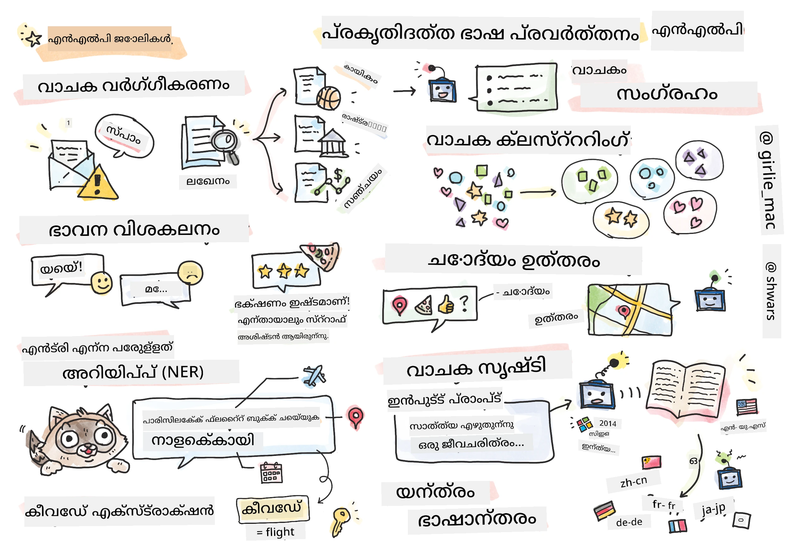

# സ്വാഭാവിക ഭാഷ പ്രോസസ്സ് (Natural Language Processing)



ഈ വിഭാഗത്തിൽ, നാം **സ്വാഭാവിക ഭാഷ പ്രോസസ്സിംഗ് (NLP)** קש്ചങ്ങൾ കൈകാര്യം ചെയ്യുന്നതിന് ന്യൂറൽ നെറ്റ്‌വർക്കുകൾ ഉപയോഗിക്കുന്നത് ശ്രദ്ധിക്കാം. കമ്പ്യൂട്ടറുകളെ നമുക്ക് പല NLP പ്രശ്നങ്ങൾ പരിഹരിക്കാൻ ആഗ്രഹിക്കുന്നു:

* **ടെക്സ്റ്റ് ക്ലാസിഫിക്കേഷൻ** എന്നത് ടെക്സ്റ്റ് സീകവൻസുകളുമായി ബന്ധപ്പെട്ട ഒരു സാധാരണ ക്ലാസിഫിക്കേഷൻ പ്രശ്നമാണ്. ഉദാഹരണങ്ങൾക്ക് ഇമെയിൽ സന്ദേശങ്ങളെ സ്പാം vs. നോ-സ്പാം ആയി തിരിച്ചറിയുക, അല്ലെങ്കിൽ ലേഖനങ്ങളെ സ്പോർട്ട്, ബിസിനസ്, പോളിറ്റിക്സ് തുടങ്ങിയ വിഭാഗങ്ങളാക്കി സെഗ്മെന്റ് ചെയ്യുക. ചാറ്റ്ബോട്ടുകൾ വികസിപ്പിക്കുമ്പോൾ, ഒരു ഉപയോക്താവ് എന്ത് പറയാൻ ആഗ്രഹിച്ചിട്ടുണ്ടെന്ന് മനസിലാക്കേണ്ടതായി വരും -- ഈ സാഹചര്യത്തിൽ നാം **ഇന്റന്റ് ക്ലാസിഫിക്കേഷൻ** കൈകാര്യം ചെയ്യുന്നു. പലപ്പോഴും, ഇന്റന്റ് ക്ലാസിഫിക്കേഷനിൽ നമുക്ക് നിരവധി വിഭാഗങ്ങൾ കൈകാര്യം ചെയ്യേണ്ടി വരും.
* **സെന്റിമെന്റ് അനാലിസിസ്** എന്നത് ഒരു സാധാരണ റിഗ്രഷൻ പ്രശ്നമാണ്, ഇവിടെ നമുക്ക് ഒരു സംവേദനത്തിന് എന്താണത്രെ പോസിറ്റീവ് / നെഗറ്റീവ് അർത്ഥമുള്ളെന്ന് സൂചിപ്പിക്കുന്ന സംഖ്യ (സെന്റിമെന്റ്) നൽകിയിരിക്കുന്നു. സെന്റിമെന്റ് അനാലിസിസിന്റെ കൂടുതൽ പുരോഗമനമായ പതിപ്പ് **അസ്പെക്റ്റ്-ബേസ്ഡ് സെന്റിമെന്റ് അനാലിസിസ്** (ABSA) ആണ്, ഇവിടെ നമുക്ക് സെന്റിമെന്റ് മുഴുവൻ വാക്യത്തിനല്ല, വാക്യത്തിലെ വ്യത്യസ്ത ഭാഗങ്ങൾക്കു (അസ്പെക്റ്റുകൾ) തന്നെ നൽകേണ്ടിവരുന്നു, ഉദാ. *ഈ റെസ്റ്റോറന്റിൽ എനിക്ക് ഭക്ഷണം ഇഷ്ടപ്പെട്ടെങ്കിലും അന്തരീക്ഷം ഭയങ്കരമായിരുന്നു*.
* **നെയിംഡ് എന്റിറ്റി റികഗ്നിഷൻ** (NER) എന്നത് ടെക്സ്റ്റിൽ നിന്നും ചില പ്രത്യേക എന്റിറ്റികൾ കണ്ടെത്തുക എന്ന പ്രശ്നമാണ്. ഉദാഹരണത്തിന്, *ഞാൻ നാളെ പാരിസിലേക്ക് പറക്കണം* എന്ന വാചകത്തിൽ *നാളെ* DATE-നെയാണ് സൂചിപ്പിക്കുന്നത്, കൂടാതെ *പാരിസ്* ഒരു LOCATION ആണ്.  
* **കീവേഡ് എക്സ്ട്രാക്ഷൻ** NER-നെ പോലെയാണ്, എന്നാൽ നമുക്ക് നിർദ്ദിഷ്ട എന്റിറ്റി ടൈപ്പുകൾക്ക് പ്രീരക്ഷലക്ഷ്യമായി പരിശീലനം ലഭ്യമാക്കാതെ തന്നെ വാക്യത്തിന്റെ അർത്ഥത്തിന് പ്രധാനപ്പെട്ട വാക്കുകൾ സ്വയം തിരിച്ചെടുക്കേണ്ടിവരുന്നതാണ്.
* **ടെക്സ്റ്റ് ക്ലസ്റ്ററിംഗ്** സാധാരണയായി സമാനമായ വാക്യങ്ങളെ കൂട്ടത്തിൽ കൂട്ടാനായി ഉപയോഗിക്കുന്നു, ഉദാഹരണത്തിന് സാങ്കേതിക പിന്തുണ സംഭാഷണങ്ങളിൽ സമാനമായ അഭ്യർത്ഥനകൾ.
* **ചോദ്യം-ഉത്തരം** എന്ന് പറയുന്നത് ഒരു മോഡലിനു ഒരു പ്രത്യേക ചോദ്യത്തിന് ഉത്തരം നൽകാനുള്ള കഴിവ് ആണ്. മോഡൽ ഒരു ടെക്സ്റ്റ് ഭാഗവും ഒരു ചോദ്യവും ഇൻപുട്ട് ആയി സ്വീകരിച്ച്, ചോദ്യത്തിനു ഉത്തരം ഉണ്ടാകുന്ന ടെക്സ്റ്റിൽ സ്ഥലം കണ്ടെത്തണം (അല്ലെങ്കിൽ ചിലപ്പോൾ ഉത്തരം തന്നെ സൃഷ്ടിക്കണം).
* **ടെക്സ്റ്റ് ജനറേഷൻ** എന്നത് ഒരു മോഡൽ പുതിയ ടെക്സ്റ്റ് സൃഷ്ടിക്കുന്ന കഴിവാണ്. ഇത് ഒരു ക്ലാസിഫിക്കേഷൻ ടാസ്കായി പരിഗണിക്കാം, എന്തെന്നാൽ ചില *ടെക്സ്റ്റ് പ്രോംപ്* അടിസ്ഥാനമാക്കി അടുത്ത അക്ഷരത്തെ/വാക്കിനെ പ്രവചിക്കുന്നത്. ജിപിടി-3 പോലുള്ള ആധുനിക ടെക്സ്റ്റ് ജനറേഷൻ മോഡലുകൾ [prompt programming](https://towardsdatascience.com/software-3-0-how-prompting-will-change-the-rules-of-the-game-a982fbfe1e0) അല്ലെങ്കിൽ [prompt engineering](https://medium.com/swlh/openai-gpt-3-and-prompt-engineering-dcdc2c5fcd29) എന്ന സാങ്കേതികവിദ്യകൾ ഉപയോഗിച്ച് ക്ലാസിഫിക്കേഷൻ പോലുള്ള മറ്റു NLP ടാസ്കുകളും പരിഹരിക്കാൻ കഴിവുണ്ട്.
* **ടെക്സ്റ്റ് സംഗ്രഹീകരണം** എന്നത് കമ്പ്യൂട്ടർ ഒരു നീണ്ട് കടുത്ത ടെക്സ്റ്റ് "വായിച്ച്" അത് കുറച്ചുപേരെ വാക്യങ്ങളായി ചുരുക്കിക്കൊടുക്കുന്ന സാങ്കേതികവിദ്യയാണ്.
* **മെഷീൻ വിവർത്തനം** എന്ന് പറയുന്നത് ഒരു ഭാഷയിൽ ടെക്സ്റ്റ് മനസ്സിലാക്കലും മറ്റൊരു ഭാഷയിൽ ടെക്സ്റ്റ് സൃഷ്ടിക്കലും ചേരുന്ന പ്രശ്നമായി കാണാം.

ആദ്യം, അധികം NLP ടാസ്കുകൾ പരമ്പരാഗത രീതികളായ വ്യാകരണങ്ങൾ ഉപയോഗിച്ച് പരിഹരിച്ചിരുന്നു. ഉദാഹരണത്തിന്, മെഷീൻ വിവർത്തനത്തിൽ ആരംഭത്തെ വാക്യം സിന്റാക്സ് ട്രീയെ മാറ്റാൻ പാർസറുകൾ ഉപയോഗിച്ചു, തുടർന്ന് വാക്യത്തിന്റെ അർത്ഥം പ്രതിനിധാനം ചെയ്യാൻ ഉയർന്ന തലത്തിലുള്ളസെമാന്റിക് ഘടകങ്ങൾ എടുക്കപ്പെട്ടു, പിന്നീട് ഈ അർത്ഥവും ലക്ഷ്യഭാഷയുടെ വ്യാകരണവും അടിസ്ഥാനമാക്കി ഫലം സൃഷ്ടിച്ചു. ഇക്കാലത്ത്, പല NLP ടാസ്കുകളും ന്യൂറൽ നെറ്റ്‌വർക്കുകൾ ഉപയോഗിച്ച് കൂടുതൽ ഫലപ്രദമായി പരിഹരിക്കപ്പെടുന്നു.

> അനേകം ക്ലാസിക്കൽ NLP രീതികൾ [Natural Language Processing Toolkit (NLTK)](https://www.nltk.org) പൈത്തൺ ലൈബ്രറിയിൽ നടപ്പിലാക്കപ്പെട്ടിരിക്കുന്നു. വിവിധ NLP ടാസ്കുകൾ NLTK ഉപയോഗിച്ച് എങ്ങനെ പരിഹരിക്കാമെന്ന് പൂർണ്ണമായും വിശദീകരിക്കുന്ന [NLTK പുസ്തകം](https://www.nltk.org/book/) ഓൺലൈനിൽ ലഭ്യമാണ്.

നമ്മുടെ കോഴ്സിൽ, നാം പ്രധാനമായും NLP-ക്ക് ന്യൂറൽ നെറ്റ്‌വർക്കുകൾ ഉപയോഗിക്കുന്നതിൽ ശ്രദ്ധിക്കും, ആവശ്യമായിടത്ത് NLTK-യും ഉപയോഗിക്കും.

നാം ഇതിനകം തന്നെ ടാബുലർ ഡാറ്റയും ചിത്രങ്ങളുമായുള്ള പ്രശ്നങ്ങൾ പരിഹരിക്കാൻ ന്യൂറൽ നെറ്റ്‌വർക്കുകൾ ഉപയോഗിക്കുന്നതിനെക്കുറിച്ച് പഠിച്ചിട്ടുണ്ട്. ആ ഡാറ്റാ തരംകാളും ടെക്സ്റ്റിന്റെ പ്രധാന വ്യത്യാസം അത് സൂചിപ്പിക്കുന്നത് ടെക്സ്റ്റ് വ്യത്യസ്ത നീളമുള്ള ശ്രേണി ആയിരിക്കുകയാണ്, ചിത്രങ്ങളിൽ മുൻകൂട്ടി ഇൻ‌പുട്ട് വലിപ്പം അറിയാവുന്നതാണ്. കോൺവല്യൂഷണൽ നെറ്റ്‌വർക്കുകൾ ഇൻപുട്ടിൽ നിന്നുള്ള പാറ്റേണുകൾ കണ്ടെത്താൻ കഴിയുന്നിട്ടും, ടെക്സ്റ്റിന്റെ പാറ്റേണുകൾ കൂടുതൽ സങ്കീർണ്ണമാണ്. ഉദാ., നിങ്ങൾക്ക് നിഷേധം സബ്ജക്റ്റിൽ നിന്ന് വേർതിരിച്ചിട്ടുണ്ടാകാവുന്നതും വിശാലമായി പല വാക്കുകളേക്കൂടി നീണ്ടു പോകുന്നതിനാലും (ഉദാ., *എനിക്ക് ഓറഞ്ചുകൾ ഇഷ്ടമല്ല*, vs. *എനിക്ക് ആ വലിയ, നിറം നിറഞ്ഞ, രുചികരമായ ഓറഞ്ചുകൾ ഇഷ്ടമല്ല*) അത് എങ്കിലും ഒന്നായി വ്യാഖ്യാനിക്കണം. അതിനാൽ, ഭാഷ കൈകാര്യം ചെയ്യാൻ നമുക്ക് പുതിയ ന്യൂറൽ നെറ്റ്‌വർക് തരം, ഉദാഹരണത്തിന് *റികറന്റ് നെറ്റ്‌വർക്കുകൾ* വരുത്തേണ്ടിവരും, കൂടാതെ *ട്രാൻസ്ഫോർമറുകൾ*.

## ലൈബ്രറികൾ ഇൻസ്റ്റാൾ ചെയ്യുക

നിങ്ങൾ ഈ കോഴ്സ് പ്രവർത്തിപ്പിക്കാൻ നിങ്ങളുടെ ലൊക്കൽ പൈത്തൺ ഇൻസ്റ്റലേഷൻ ഉപയോഗിക്കുന്നുവെങ്കിൽ, താഴെയുള്ള കമാൻഡുകൾ ഉപയോഗിച്ച് NLP-ക്ക് ആവശ്യമായ എല്ലാ ലൈബ്രറികളും ഇൻസ്റ്റാൾ ചെയ്യേണ്ടതാകാം:

**പൈടോർച്ചിനായി**
```bash
pip install -r requirements-pytorch.txt
```
**ടെൻസർഫ്ലോയ്ക്ക്**
```bash
pip install -r requirements-tf.txt
```

> [Microsoft Learn](https://docs.microsoft.com/learn/modules/intro-natural-language-processing-tensorflow/?WT.mc_id=academic-77998-cacaste)ൽ ടെൻസർഫ്ലോ ഉപയോഗിച്ച് NLP പരീക്ഷിക്കാം

## GPU മുന്നറിയിപ്പ്

ഈ വിഭാഗത്തിൽ ചില ഉദാഹരണങ്ങളിൽ നാം വളരെ വലിയ മോഡലുകൾ പരിശീലിപ്പിക്കും.
* **GPU-സംയോജിത കമ്പ്യൂട്ടർ ഉപയോഗിക്കുക**: വലിയ മോഡലുകളോടൊപ്പം പ്രവർത്തിക്കുമ്പോൾ കാത്തിരിപ്പ് സമയം കുറയ്ക്കാൻ GPU-സംയോജിത കമ്പ്യൂട്ടറിൽ നിങ്ങളുടെ നോട്ട്ബുക്കുകൾ പ്രവർത്തിപ്പിക്കുന്നത് ശുപാർശ ചെയ്യപ്പെടുന്നു.
* **GPU ഓർമ്മാ പരിമിതികൾ**: വലിയ മോഡലുകൾ പരിശീലിപ്പിക്കുമ്പോൾ GPU ഓർമ്മ കാണാൻ കഴിയുന്ന പ്രശ്നങ്ങൾ ഉണ്ടാകാം.
* **GPU ഓർമ്മ ഉപയോഗം**: പരിശീലന സമയത്ത് ഉപയോഗിക്കുന്ന GPU ഓർമ്മയുടെ അളവ് മിനിബാച്ച് വലിപ്പം പോലുള്ള നിരവധി ഘടകങ്ങളിൽ ആശ്രയിച്ചിരിക്കുന്നു.
* **മിനിബാച്ച് വലിപ്പം കുറഞ്ഞു**: GPU ഓർമ്മ പ്രശ്നങ്ങൾ അനുഭവപ്പെട്ടാൽ, നിങ്ങളുടെ കോഡിൽ മിനിബാച്ച് വലിപ്പം കുറയ്ക്കുക.
* **ടെൻസർഫ്ലോ GPU ഓർമ്മ റിലീസ്**: പഴയ പതിപ്പുകളുടെ ടെൻസർഫ്ലോ പൈത്തൺ കർണലിൽ ഒരേ സമയത്ത് നിരവധി മോഡലുകൾ പരിശീലിപ്പിക്കുമ്പോൾ GPU ഓർമ്മ ശരിയായി വിടുന്നില്ല. GPU ഓർമ്മ ഉപയോഗം കാര്യക്ഷമമായി നിയന്ത്രിക്കാൻ, ആവശ്യപ്പെടുമ്പോൾ മാത്രമേ GPU ഓർമ്മ അലോക്കേറ്റ് ചെയ്യുന്നതായി ടെൻസർഫ്ലോ ക്രമീകരിക്കാം.
* **കോഡ് ഉൾക്കൊള്ളിക്കൽ**: ടെൻസർഫ്ലോ GPU ഓർമ്മ അലോക്കേഷൻ വെറും ആവശ്യത്തിനു മാത്രമേ വർദ്ധിപ്പിക്കൂ എന്ന് ക്രമീകരിക്കുന്നതിന്, നിങ്ങളുടെ നോട്ട്ബുക്കുകളിൽ താഴെയുള്ള കോഡ് ഉൾപ്പെടുത്തുക:

```python
physical_devices = tf.config.list_physical_devices('GPU') 
if len(physical_devices)>0:
    tf.config.experimental.set_memory_growth(physical_devices[0], True) 
```

ക്ലാസിക്കൽ ML വീക്ഷണത്തിൽ നിന്നുള്ള NLP പഠിക്കാൻ ആഗ്രഹിക്കുന്നവർക്ക് [ഇവിടെ ചില പാഠങ്ങൾ](https://github.com/microsoft/ML-For-Beginners/tree/main/6-NLP) സന്ദർശിക്കുക

## ഈ വിഭാഗത്തിൽ
ഈ വിഭാഗത്തിൽ നാം പഠിക്കാനിരിക്കുന്നത്:

* [ടെക്സ്റ്റ് ടെൻസറുകളായി പ്രതിപാദിക്കൽ](13-TextRep/README.md)
* [വാക്ക് എംബെഡ്ഡിംഗ്സ്](14-Embeddings/README.md)
* [ഭാഷാ മോഡലിംഗ്](15-LanguageModeling/README.md)
* [റികറന്റ് ന്യൂറൽ നെറ്റ്വർക്‌സ്](16-RNN/README.md)
* [ജനറേറ്റീവ് നെറ്റ്‌വർക്കുകൾ](17-GenerativeNetworks/README.md)
* [ട്രാൻസ്ഫോർമറുകൾ](18-Transformers/README.md)

---

<!-- CO-OP TRANSLATOR DISCLAIMER START -->
**അറിയിപ്പ്**:
ഈ രേഖ AI പരിഭാഷാ സേവനം [Co-op Translator](https://github.com/Azure/co-op-translator) ഉപയോഗിച്ച് പരിഭാഷപ്പെടുത്തിയതാണ്. ഞങ്ങൾ കൃത്യതയ്ക്കായി ശ്രമിക്കുന്നുവെങ്കിലും, ഓട്ടോമേറ്റഡ് പരിഭാഷകളിൽ പിഴവുകൾ അല്ലെങ്കിൽ തെറ്റായ വിവരങ്ങൾ ഉണ്ടാകാൻ സാധ്യതയുണ്ട്. അതിന്റെ സ്വാഭാവിക ഭാഷയിലുള്ള അസൽ രേഖയാണ് പ്രാമാണികമായ ഉറവിടമായി പരിഗണിക്കേണ്ടത്. നിർണായകമായ വിവരങ്ങൾക്ക്, പ്രൊഫഷണൽ മനുഷ്യ പരിഭാഷ ശുപാർശ ചെയ്യുന്നു. ഈ പരിഭാഷ ഉപയോഗിച്ച് ഉണ്ടാകുന്ന തെറ്റിദ്ധാരണകൾ അല്ലെങ്കിൽ തെറ്റായ വ്യാഖ്യാനങ്ങൾക്കായി ഞങ്ങൾ ഉത്തരവാദികളല്ല.
<!-- CO-OP TRANSLATOR DISCLAIMER END -->