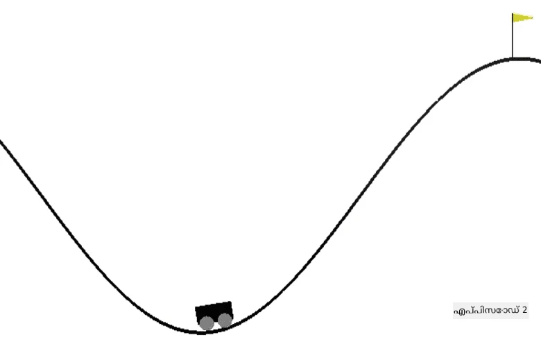

# മൗണ്ടൻ കാർ രക്ഷപ്പെടാൻ പരിശീലനം

[AI for Beginners Curriculum](https://github.com/microsoft/ai-for-beginners) ലെ ലാബ് അസൈൻമെന്റ്.

## ടാസ്‌ക്

OpenAI പരിസ്ഥിതിയിൽ [Mountain Car](https://www.gymlibrary.ml/environments/classic_control/mountain_car/) നിയന്ത്രിക്കാൻ RL ഏജന്റിനെ പരിശീലിപ്പിക്കുക.

## പരിസ്ഥിതി

Mountain Car പരിസ്ഥിതി ഒരു താഴ്വരയിൽ കുടുങ്ങിയ കാർ ഉൾക്കൊള്ളുന്നു. താഴ്വരയിൽ നിന്ന് ചാടിക്കയറുകയും പതാകയിലേക്ക് എത്തുകയും ചെയ്യുക നിങ്ങളുടെ ലക്ഷ്യമാണ്. നിങ്ങൾക്ക് ഇടത്തേക്ക് വേഗത കൂട്ടുക, വലത്തേക്ക് വേഗത കൂട്ടുക, അല്ലെങ്കിൽ ഒന്നും ചെയ്യാതിരിക്കുക എന്നിങ്ങനെ പ്രവർത്തനങ്ങൾ ചെയ്യാം. കാർ x-അക്ഷം അനുസരിച്ച് സ്ഥാനം, വേഗത എന്നിവ നിങ്ങൾക്ക് നിരീക്ഷിക്കാം.

## സ്റ്റാർട്ടിംഗ് നോട്ട്‌ബുക്ക്

ലാബ് ആരംഭിക്കാൻ [MountainCar.ipynb](MountainCar.ipynb) തുറക്കുക

## പഠനഫലം

ഈ ലാബ് വഴി നിങ്ങൾക്ക് മനസ്സിലാകണം RL ആൽഗോരിതങ്ങൾ പുതിയ പരിസ്ഥിതിയിലേക്ക് സ്വീകരിക്കുന്നത് സാധാരണയായി എളുപ്പമാണ്, കാരണം OpenAI Gym എല്ലാ പരിസ്ഥിതികൾക്കും ഒരേ ഇന്റർഫേസ് നൽകുന്നു, ആൽഗോരിതങ്ങൾ പരിസ്ഥിതിയുടെ സ്വഭാവത്തിൽ വലിയ ആശ്രയം ഇല്ലാതെ പ്രവർത്തിക്കുന്നു. Python കോഡ് ഇങ്ങനെ പുനർഘടിപ്പിക്കാം, RL ആൽഗോരിതത്തിന് ഏതൊരു പരിസ്ഥിതിയും പാരാമീറ്ററായി നൽകാൻ കഴിയുന്ന വിധം.

---

<!-- CO-OP TRANSLATOR DISCLAIMER START -->
**അസൂയാ**:  
ഈ രേഖ AI വിവർത്തന സേവനം [Co-op Translator](https://github.com/Azure/co-op-translator) ഉപയോഗിച്ച് വിവർത്തനം ചെയ്തതാണ്. നാം കൃത്യതയ്ക്ക് ശ്രമിച്ചെങ്കിലും, സ്വയം പ്രവർത്തിക്കുന്ന വിവർത്തനങ്ങളിൽ പിശകുകൾ അല്ലെങ്കിൽ തെറ്റുകൾ ഉണ്ടാകാമെന്ന് ദയവായി ശ്രദ്ധിക്കുക. അതിന്റെ മാതൃഭാഷയിലുള്ള യഥാർത്ഥ രേഖയാണ് പ്രാമാണികമായ ഉറവിടം എന്ന് പരിഗണിക്കേണ്ടതാണ്. നിർണായകമായ വിവരങ്ങൾക്ക്, പ്രൊഫഷണൽ മനുഷ്യ വിവർത്തനം ശുപാർശ ചെയ്യപ്പെടുന്നു. ഈ വിവർത്തനത്തിന്റെ ഉപയോഗത്തിൽ നിന്നുണ്ടാകുന്ന ഏതെങ്കിലും തെറ്റിദ്ധാരണകൾക്കോ തെറ്റായ വ്യാഖ്യാനങ്ങൾക്കോ ഞങ്ങൾ ഉത്തരവാദികളല്ല.
<!-- CO-OP TRANSLATOR DISCLAIMER END -->