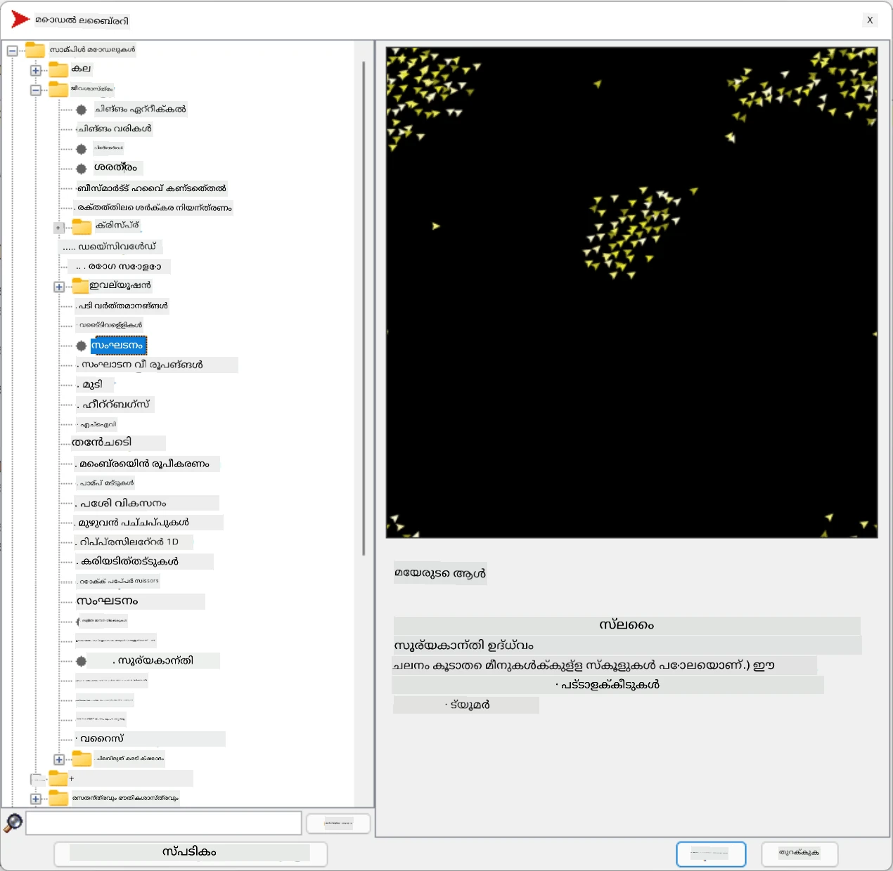
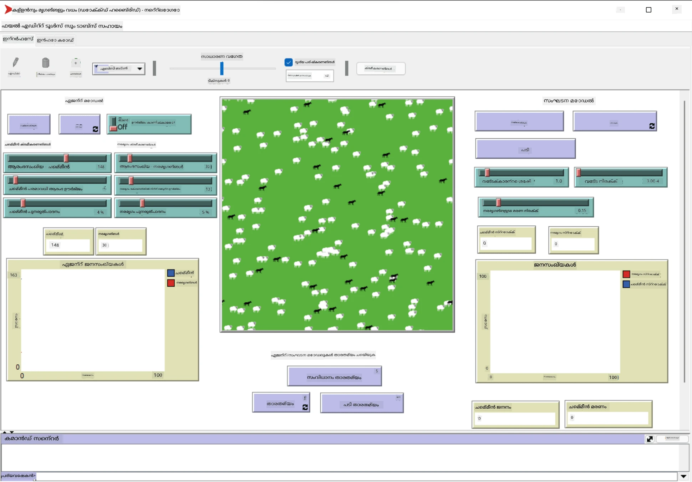

# മൾട്ടി-ഏജന്റ് സിസ്റ്റങ്ങൾ

ബുദ്ധിമുട്ട് നേടാനുള്ള ഒരു സാധ്യതയുള്ള മാർഗ്ഗം **എമർജന്റ്** (അഥവാ **സിനർജറ്റിക്**) സമീപനമാണ്, ഇത് അടിസ്ഥാനമാക്കുന്നത് പലതരം ലളിതമായ ഏജന്റുകളുടെ സംയുക്ത പെരുമാറ്റം സമ്പൂർണ്ണമായും കൂടുതൽ സങ്കീർണ്ണമായ (അഥവാ ബുദ്ധിമുട്ടുള്ള) സിസ്റ്റത്തിന്റെ പെരുമാറ്റമായി മാറാൻ കഴിയും എന്ന സത്യത്തിൽ. സിദ്ധാന്തപരമായി, ഇത് [കോളക്റ്റീവ് ഇന്റലിജൻസ്](https://en.wikipedia.org/wiki/Collective_intelligence), [എമർജന്റിസം](https://en.wikipedia.org/wiki/Global_brain) എന്നിവയുടെ സിദ്ധാന്തങ്ങളിലാണ് അടിസ്ഥാനമാക്കിയിരിക്കുന്നത്, കൂടാതെ [എവല്യൂഷണറി സൈബർനെറ്റിക്സ്](https://en.wikipedia.org/wiki/Global_brain) എന്നത് താഴ്ന്ന തലത്തിലുള്ള സിസ്റ്റങ്ങൾ ശരിയായി സംയോജിപ്പിക്കുമ്പോൾ ഉയർന്ന തലത്തിലുള്ള സിസ്റ്റങ്ങൾ ചില അധിക മൂല്യം നേടുന്നു എന്ന് പറയുന്നു (ഇത് *മെറ്റാസിസ്റ്റം ട്രാൻസിഷൻ സിദ്ധാന്തം* എന്നറിയപ്പെടുന്നു).

## [പ്രീ-ലെക്ചർ ക്വിസ്](https://ff-quizzes.netlify.app/en/ai/quiz/45)

**മൾട്ടി-ഏജന്റ് സിസ്റ്റങ്ങൾ** എന്ന ദിശ 1990-കളിൽ ഇന്റർനെറ്റിന്റെയും വിതരണ സിസ്റ്റങ്ങളുടെയും വളർച്ചയ്ക്ക് പ്രതികരണമായി AI-യിൽ ഉദയം കണ്ടു. ക്ലാസിക്കൽ AI പാഠപുസ്തകങ്ങളിൽ ഒന്നായ [Artificial Intelligence: A Modern Approach](https://en.wikipedia.org/wiki/Artificial_Intelligence:_A_Modern_Approach) മൾട്ടി-ഏജന്റ് സിസ്റ്റങ്ങളുടെ കാഴ്ചപ്പാടിൽ നിന്നുള്ള ക്ലാസിക്കൽ AI-യെ പ്രധാനം ചെയ്യുന്നു.

മൾട്ടി-ഏജന്റ് സമീപനത്തിന്റെ കേന്ദ്ര ആശയം **ഏജന്റ്** എന്നതാണ് - ഒരു സജീവമായ ഘടകം, അത് ഒരു **പരിസ്ഥിതിയിൽ** ജീവിക്കുന്നു, അത് അവബോധിക്കുകയും പ്രവർത്തിക്കുകയും ചെയ്യുന്നു. ഇത് വളരെ വ്യാപകമായ നിർവചനമാണ്, ഏജന്റുകളുടെ പല തരങ്ങളും വർഗ്ഗീകരണങ്ങളും ഉണ്ടാകാം:

* അവയുടെ തർക്കശേഷി അനുസരിച്ച്:
   - **റിയാക്ടീവ്** ഏജന്റുകൾ സാധാരണയായി ലളിതമായ അഭ്യർത്ഥന-പ്രതികരണ രീതിയിലുള്ള പെരുമാറ്റം കാണിക്കുന്നു
   - **ഡെലിബറേറ്റീവ്** ഏജന്റുകൾ ചില തർക്കശേഷി അല്ലെങ്കിൽ പദ്ധതിയിടൽ കഴിവുകൾ ഉപയോഗിക്കുന്നു
* ഏജന്റ് കോഡ് എവിടെ പ്രവർത്തിക്കുന്നു എന്ന അനുസരിച്ച്:
   - **സ്റ്റാറ്റിക്** ഏജന്റുകൾ ഒരു നിശ്ചിത നെറ്റ്‌വർക്ക് നോഡിൽ പ്രവർത്തിക്കുന്നു
   - **മൊബൈൽ** ഏജന്റുകൾ അവരുടെ കോഡ് നെറ്റ്‌വർക്ക് നോഡുകൾക്കിടയിൽ മാറ്റി കൊണ്ടുപോകാൻ കഴിയും
* അവയുടെ പെരുമാറ്റം അനുസരിച്ച്:
   - **പാസ്സീവ് ഏജന്റുകൾ** പ്രത്യേക ലക്ഷ്യങ്ങളില്ല. ഇവ പുറം പ്രേരണകളെ പ്രതികരിക്കും, എന്നാൽ സ്വയം പ്രവർത്തനങ്ങൾ ആരംഭിക്കില്ല.
   - **ആക്ടീവ് ഏജന്റുകൾ** ചില ലക്ഷ്യങ്ങൾ പിന്തുടരുന്നു
   - **കോഗ്നിറ്റീവ് ഏജന്റുകൾ** സങ്കീർണ്ണമായ പദ്ധതിയിടലും തർക്കശേഷിയും ഉൾക്കൊള്ളുന്നു

ഇന്നത്തെ കാലത്ത് മൾട്ടി-ഏജന്റ് സിസ്റ്റങ്ങൾ പല മേഖലകളിൽ ഉപയോഗിക്കുന്നു:

* ഗെയിമുകളിൽ, പല നോൺ-പ്ലെയർ കഥാപാത്രങ്ങളും ചില AI ഉപയോഗിച്ച് ബുദ്ധിമുട്ടുള്ള ഏജന്റുകളായി കണക്കാക്കാം
* വീഡിയോ നിർമ്മാണത്തിൽ, ജനക്കൂട്ടങ്ങൾ ഉൾപ്പെടുന്ന സങ്കീർണ്ണമായ 3D സീനുകൾ റെൻഡർ ചെയ്യാൻ സാധാരണയായി മൾട്ടി-ഏജന്റ് സിമുലേഷൻ ഉപയോഗിക്കുന്നു
* സിസ്റ്റം മോഡലിംഗിൽ, സങ്കീർണ്ണമായ മോഡലിന്റെ പെരുമാറ്റം സിമുലേറ്റ് ചെയ്യാൻ മൾട്ടി-ഏജന്റ് സമീപനം ഉപയോഗിക്കുന്നു. ഉദാഹരണത്തിന്, COVID-19 രോഗം ലോകമാകെ വ്യാപിക്കുന്നതിന്റെ പ്രവചനത്തിന് മൾട്ടി-ഏജന്റ് സമീപനം വിജയകരമായി ഉപയോഗിച്ചിട്ടുണ്ട്. സമാനമായ സമീപനം നഗരത്തിലെ ട്രാഫിക് മോഡലിംഗിനും ഉപയോഗിക്കാം, ട്രാഫിക് നിയമങ്ങളിൽ മാറ്റം വന്നാൽ എങ്ങനെ പ്രതികരിക്കും എന്ന് കാണാൻ.
* സങ്കീർണ്ണമായ ഓട്ടോമേഷൻ സിസ്റ്റങ്ങളിൽ, ഓരോ ഉപകരണവും സ്വതന്ത്ര ഏജന്റായി പ്രവർത്തിക്കാം, ഇത് മുഴുവൻ സിസ്റ്റം കൂടുതൽ ലളിതവും ദൃഢവുമാക്കുന്നു.

മൾട്ടി-ഏജന്റ് സിസ്റ്റങ്ങളിൽ കൂടുതൽ ആഴത്തിൽ പോകാതെ, **മൾട്ടി-ഏജന്റ് മോഡലിംഗ്** എന്ന ഒരു ഉദാഹരണം പരിഗണിക്കാം.

## നെറ്റ്‌ലോഗോ

[NetLogo](https://ccl.northwestern.edu/netlogo/) ഒരു മൾട്ടി-ഏജന്റ് മോഡലിംഗ് പരിസ്ഥിതിയാണ്, ഇത് [Logo](https://en.wikipedia.org/wiki/Logo_(programming_language)) പ്രോഗ്രാമിംഗ് ഭാഷയുടെ മാറ്റം വരുത്തിയ പതിപ്പിൽ അടിസ്ഥാനമാക്കിയതാണ്. ഈ ഭാഷ കുട്ടികൾക്ക് പ്രോഗ്രാമിംഗ് ആശയങ്ങൾ പഠിപ്പിക്കാൻ വികസിപ്പിച്ചതാണ്, ഇത് **turtle** എന്ന ഏജന്റിനെ നിയന്ത്രിക്കാൻ അനുവദിക്കുന്നു, അത് നീങ്ങുകയും പിന്നിൽ ഒരു പാത വിടുകയും ചെയ്യുന്നു. ഇത് സങ്കീർണ്ണമായ ജ്യാമിതീയ ആകൃതികൾ സൃഷ്ടിക്കാൻ സഹായിക്കുന്നു, ഏജന്റിന്റെ പെരുമാറ്റം ദൃശ്യമായി മനസ്സിലാക്കാൻ ഇത് വളരെ സഹായകരമാണ്.

നെറ്റ്‌ലോഗോയിൽ, `create-turtles` കമാൻഡ് ഉപയോഗിച്ച് നിരവധി turtles സൃഷ്ടിക്കാം. പിന്നീട് എല്ലാ turtles-ഉം ചില പ്രവർത്തനങ്ങൾ ചെയ്യാൻ നിർദ്ദേശിക്കാം (താഴെ ഉദാഹരണത്തിൽ - 10 പോയിന്റ് മുന്നോട്ട്):

```
create-turtles 10
ask turtles [
  forward 10
]
```


എല്ലാ turtles-ഉം ഒരേ കാര്യം ചെയ്യുന്നത് രസകരമല്ല, അതിനാൽ നാം `ask` ഉപയോഗിച്ച് turtles-ന്റെ ഗ്രൂപ്പുകളെ, ഉദാഹരണത്തിന് ഒരു പ്രത്യേക പോയിന്റിന്റെ സമീപത്തുള്ളവരെ, നിർദ്ദേശിക്കാം. `breed [cats cat]` കമാൻഡ് ഉപയോഗിച്ച് വ്യത്യസ്ത *breeds* ഉള്ള turtles സൃഷ്ടിക്കാം. ഇവിടെ `cat` ഒരു breed നാമമാണ്, ഒറ്റപ്പേരും ബഹുവചനവും വ്യക്തമാക്കേണ്ടത് വിവിധ കമാൻഡുകൾ വ്യത്യസ്ത രൂപങ്ങൾ ഉപയോഗിക്കുന്നതിനാലാണ്.

> ✅ നെറ്റ്‌ലോഗോ ഭാഷ പഠിക്കാൻ നാം കൂടുതൽ സമയം ചെലവഴിക്കില്ല - കൂടുതൽ അറിയാൻ ആഗ്രഹിക്കുന്നവർക്ക് അത്ഭുതകരമായ [Beginner's Interactive NetLogo Dictionary](https://ccl.northwestern.edu/netlogo/bind/) സന്ദർശിക്കാം.

നിങ്ങൾക്ക് [ഡൗൺലോഡ്](https://ccl.northwestern.edu/netlogo/download.shtml) ചെയ്ത് നെറ്റ്‌ലോഗോ ഇൻസ്റ്റാൾ ചെയ്ത് പരീക്ഷിക്കാം.

### മോഡലുകളുടെ ലൈബ്രറി

നെറ്റ്‌ലോഗോയുടെ മികച്ച പ്രത്യേകത ഇതിൽ പ്രവർത്തനക്ഷമമായ മോഡലുകളുടെ ലൈബ്രറി ഉള്ളതാണ്. **File → Models Library** എന്ന വഴി പോകുക, അവിടെ നിരവധി മോഡൽ വിഭാഗങ്ങൾ തിരഞ്ഞെടുക്കാം.



> മോഡൽ ലൈബ്രറിയുടെ സ്ക്രീൻഷോട്ട് - Dmitry Soshnikov

നിങ്ങൾ ഒരു മോഡൽ തുറക്കാം, ഉദാഹരണത്തിന് **Biology → Flocking**.

### പ്രധാന സിദ്ധാന്തങ്ങൾ

മോഡൽ തുറന്ന ശേഷം, നിങ്ങൾ പ്രധാന നെറ്റ്‌ലോഗോ സ്ക്രീനിലേക്ക് എത്തും. ഇവിടെ finite resources (പുല്ല്) ഉള്ള ഒരു വുൾഫ്-ഷീപ്പ് ജനസംഖ്യയെ വിവരിക്കുന്ന ഒരു മാതൃകയാണ്.



> സ്ക്രീൻഷോട്ട് - Dmitry Soshnikov

ഈ സ്ക്രീനിൽ നിങ്ങൾക്ക് കാണാം:

* **ഇന്റർഫേസ്** വിഭാഗം, ഇതിൽ:
  - എല്ലാ ഏജന്റുകളും ജീവിക്കുന്ന പ്രധാന ഫീൽഡ്
  - ബട്ടണുകൾ, സ്ലൈഡറുകൾ തുടങ്ങിയ നിയന്ത്രണങ്ങൾ
  - സിമുലേഷന്റെ പാരാമീറ്ററുകൾ പ്രദർശിപ്പിക്കാൻ ഉപയോഗിക്കുന്ന ഗ്രാഫുകൾ
* **കോഡ്** ടാബ്, ഇവിടെ നിങ്ങൾക്ക് നെറ്റ്‌ലോഗോ പ്രോഗ്രാം ടൈപ്പ് ചെയ്യാം

പലപ്പോഴും, ഇന്റർഫേസിൽ ഒരു **Setup** ബട്ടൺ ഉണ്ടാകും, ഇത് സിമുലേഷൻ നില ആരംഭിക്കും, കൂടാതെ **Go** ബട്ടൺ പ്രവർത്തനം ആരംഭിക്കും. ഇവ കോഡിലെ അനുയോജ്യമായ ഹാൻഡ്ലറുകൾ വഴി കൈകാര്യം ചെയ്യപ്പെടുന്നു:

```
to go [
...
]
```


നെറ്റ്‌ലോഗോയുടെ ലോകം താഴെ പറയുന്ന ഘടകങ്ങളാൽ നിർമ്മിതമാണ്:

* **ഏജന്റുകൾ** (turtles) ഫീൽഡിൽ ചലിക്കുന്നവയും പ്രവർത്തിക്കുന്നവയും. `ask turtles [...]` സിന്താക്സ് ഉപയോഗിച്ച് ഏജന്റുകളെ നിയന്ത്രിക്കാം, ബ്രാക്കറ്റിനുള്ളിലെ കോഡ് എല്ലാ ഏജന്റുകളും *turtle mode*-ൽ പ്രവർത്തിക്കും.
* **പാച്ചുകൾ** ഫീൽഡിലെ ചതുരാകൃതിയിലുള്ള പ്രദേശങ്ങൾ, ഏജന്റുകൾ അവിടെ ജീവിക്കുന്നു. ഒരേ പാച്ചിലുള്ള ഏജന്റുകളെ കാണാനോ പാച്ചിന്റെ നിറം, മറ്റ് ഗുണങ്ങൾ മാറ്റാനോ കഴിയും. `ask patches` ഉപയോഗിച്ച് പാച്ചുകൾക്ക് നിർദ്ദേശിക്കാം.
* **ഓബ്സർവർ** ലോകത്തെ നിയന്ത്രിക്കുന്ന ഏക ഏജന്റാണ്. എല്ലാ ബട്ടൺ ഹാൻഡ്ലറുകളും *observer mode*-ൽ പ്രവർത്തിക്കുന്നു.

> ✅ മൾട്ടി-ഏജന്റ് പരിസ്ഥിതിയുടെ സുന്ദര്യം ഇതാണ്: turtle mode-ലോ patch mode-ലോ പ്രവർത്തിക്കുന്ന കോഡ് എല്ലാ ഏജന്റുകളും സമാന്തരമായി ഒരേസമയം പ്രവർത്തിക്കുന്നു. അതിനാൽ ചെറിയ കോഡ് എഴുതിയും വ്യക്തിഗത ഏജന്റിന്റെ പെരുമാറ്റം പ്രോഗ്രാം ചെയ്തും, സിമുലേഷൻ സിസ്റ്റത്തിന്റെ സങ്കീർണ്ണമായ പെരുമാറ്റം സൃഷ്ടിക്കാം.

### ഫ്ലോക്കിംഗ്

മൾട്ടി-ഏജന്റ് പെരുമാറ്റത്തിന്റെ ഉദാഹരണമായി **[Flocking](https://en.wikipedia.org/wiki/Flocking_(behavior))** പരിഗണിക്കാം. ഫ്ലോക്കിംഗ് പക്ഷികളുടെ കൂട്ടം പറക്കുന്ന രീതിയോട് വളരെ സമാനമാണ്. അവ പറക്കുന്നപ്പോൾ അവർ ഒരു കൂട്ടായ്മാ ആൽഗോരിതം പിന്തുടരുന്നുവെന്ന് തോന്നാം, അല്ലെങ്കിൽ അവർക്ക് ഒരു തരത്തിലുള്ള *കോളക്റ്റീവ് ഇന്റലിജൻസ്* ഉണ്ടെന്ന് തോന്നാം. എന്നാൽ ഈ സങ്കീർണ്ണമായ പെരുമാറ്റം ഓരോ വ്യക്തിഗത ഏജന്റും (ഇവിടെ *പക്ഷി*) അടുത്തുള്ള ഏജന്റുകളെ കുറച്ച് ദൂരത്തിൽ മാത്രം നിരീക്ഷിച്ച് താഴെ പറയുന്ന മൂന്ന് ലളിതമായ നിയമങ്ങൾ പാലിക്കുമ്പോഴാണ് ഉണ്ടാകുന്നത്:

* **അലൈൻമെന്റ്** - സമീപമുള്ള ഏജന്റുകളുടെ ശരാശരി ദിശയിലേക്ക് തിരിയുക
* **കോഹീഷൻ** - സമീപവാസികളുടെ ശരാശരി സ്ഥാനത്തേക്ക് തിരിയാൻ ശ്രമിക്കുക (*ദീർഘദൂര ആകർഷണം*)
* **സെപ്പറേഷൻ** - മറ്റുള്ള പക്ഷികളോട് വളരെ അടുത്ത് വന്നാൽ അകലെ പോകാൻ ശ്രമിക്കുക (*സങ്കീർണ്ണ ദൂര തള്ളൽ*)

ഫ്ലോക്കിംഗ് ഉദാഹരണം പ്രവർത്തിപ്പിച്ച് പെരുമാറ്റം നിരീക്ഷിക്കാം. *സെപ്പറേഷൻ* അളവ്, *വ്യൂയിംഗ് റേഞ്ച്* (ഒരു പക്ഷി എത്ര ദൂരം കാണാൻ കഴിയും) പോലുള്ള പാരാമീറ്ററുകൾ ക്രമീകരിക്കാം. വ്യൂയിംഗ് റേഞ്ച് 0 ആക്കിയാൽ എല്ലാ പക്ഷികളും കാഴ്ച നഷ്ടപ്പെടുകയും ഫ്ലോക്കിംഗ് നിർത്തുകയും ചെയ്യും. സെപ്പറേഷൻ 0 ആക്കിയാൽ എല്ലാ പക്ഷികളും ഒരു നേരിയ വരിയിലായി ചേരും.

> ✅ **കോഡ്** ടാബിലേക്ക് മാറി ഫ്ലോക്കിംഗിന്റെ മൂന്ന് നിയമങ്ങൾ (അലൈൻമെന്റ്, കോഹീഷൻ, സെപ്പറേഷൻ) എവിടെ നടപ്പിലാക്കിയിട്ടുള്ളതെന്ന് നോക്കൂ. നാം കാണുന്നത് മാത്രം ഏജന്റുകളെ പരിഗണിക്കുന്നതാണെന്ന് ശ്രദ്ധിക്കുക.

### മറ്റ് കാണേണ്ട മോഡലുകൾ

കൂടുതൽ പരീക്ഷിക്കാവുന്ന ചില രസകരമായ മോഡലുകൾ:

* **Art → Fireworks** - ഒരു ഫയർവർക്കിന്റെ പെരുമാറ്റം വ്യക്തിഗത തീ പാളികളുടെ കൂട്ടായ്മയായി കാണിക്കുന്നു
* **Social Science → Traffic Basic** & **Social Science → Traffic Grid** - 1D, 2D ഗ്രിഡിൽ ട്രാഫിക് മോഡലുകൾ, ട്രാഫിക് ലൈറ്റുകളോടോ ഇല്ലാതെയോ. ഓരോ കാർക്കും താഴെ പറയുന്ന നിയമങ്ങൾ പാലിക്കുന്നു:
   - മുന്നിലുള്ള സ്ഥലം ശൂന്യമെങ്കിൽ വേഗം കൂട്ടുക (ഒരു പരമാവധി വേഗം വരെ)
   - മുന്നിൽ തടസം കാണുമ്പോൾ ബ്രേക്ക് ചെയ്യുക (ഡ്രൈവർ എത്ര ദൂരം കാണാൻ കഴിയും എന്നത് ക്രമീകരിക്കാം)
* **Social Science → Party** - ഒരു പാർട്ടി സമയത്ത് ആളുകൾ എങ്ങനെ കൂട്ടം ചേരുന്നു എന്ന് കാണിക്കുന്നു. ഗ്രൂപ്പിന്റെ സന്തോഷം എത്ര വേഗം വർദ്ധിക്കുന്നു എന്നതിന് അനുയോജ്യമായ പാരാമീറ്ററുകൾ കണ്ടെത്താം.

ഈ ഉദാഹരണങ്ങളിൽ നിന്ന് കാണുന്നത്, മൾട്ടി-ഏജന്റ് സിമുലേഷനുകൾ ഒരേ അല്ലെങ്കിൽ സമാനമായ തർക്കശേഷി പിന്തുടരുന്ന വ്യക്തികളുടെ സങ്കീർണ്ണമായ സിസ്റ്റത്തിന്റെ പെരുമാറ്റം മനസ്സിലാക്കാൻ വളരെ സഹായകരമാണ്. ഇത് കമ്പ്യൂട്ടർ ഗെയിമുകളിലെ [NPCs](https://en.wikipedia.org/wiki/NPC) പോലുള്ള വെർച്വൽ ഏജന്റുകളെ നിയന്ത്രിക്കാൻ, 3D ആനിമേറ്റഡ് ലോകങ്ങളിലെ ഏജന്റുകളെ നിയന്ത്രിക്കാൻ ഉപയോഗിക്കാം.

## ഡെലിബറേറ്റീവ് ഏജന്റുകൾ

മുകളിൽ വിവരിച്ച ഏജന്റുകൾ വളരെ ലളിതമാണ്, പരിസ്ഥിതിയിലെ മാറ്റങ്ങൾക്ക് ഒരു ആൽഗോരിതം ഉപയോഗിച്ച് പ്രതികരിക്കുന്നു. ഇവ **റിയാക്ടീവ് ഏജന്റുകൾ** ആണ്. എന്നാൽ ചിലപ്പോൾ ഏജന്റുകൾ തർക്കശേഷിയും പദ്ധതിയിടലും നടത്തുന്നു, അപ്പോൾ അവ **ഡെലിബറേറ്റീവ്** എന്ന് വിളിക്കുന്നു.

ഒരു സാധാരണ ഉദാഹരണം, ഒരു വ്യക്തിഗത ഏജന്റ് മനുഷ്യനിൽ നിന്ന് അവധിക്കാല യാത്ര ബുക്ക് ചെയ്യാൻ നിർദ്ദേശം ലഭിക്കുന്നത്. ഇന്റർനെറ്റിൽ ജീവിക്കുന്ന നിരവധി ഏജന്റുകൾ സഹായിക്കാം. അവ വിമാനങ്ങൾ ലഭ്യമാണോ, ഹോട്ടൽ വിലകൾ വ്യത്യസ്ത തീയതികളിൽ എങ്ങനെ ഉണ്ട് എന്ന് പരിശോധിച്ച് മികച്ച വിലക്ക് ചർച്ച ചെയ്യണം. യാത്രാ പദ്ധതി പൂർത്തിയാക്കി ഉടമ സ്ഥിരീകരിച്ചാൽ ബുക്കിംഗ് നടത്താം.

അതിനായി, ഏജന്റുകൾക്ക് **സംവാദം** നടത്തേണ്ടതുണ്ട്. വിജയകരമായ സംവാദത്തിന് അവയ്ക്ക് ആവശ്യമാണ്:

* **ജ്ഞാനം കൈമാറാനുള്ള ചില സ്റ്റാൻഡേർഡ് ഭാഷകൾ**, ഉദാഹരണത്തിന് [Knowledge Interchange Format](https://en.wikipedia.org/wiki/Knowledge_Interchange_Format) (KIF) & [Knowledge Query and Manipulation Language](https://en.wikipedia.org/wiki/Knowledge_Query_and_Manipulation_Language) (KQML). ഈ ഭാഷകൾ [Speech Act theory](https://en.wikipedia.org/wiki/Speech_act) അടിസ്ഥാനമാക്കി രൂപകൽപ്പന ചെയ്തതാണ്.
* **നേട്ടത്തിനുള്ള പ്രോട്ടോകോളുകൾ**, വ്യത്യസ്ത **ഓക്ഷൻ തരം** അടിസ്ഥാനമാക്കി ഉൾക്കൊള്ളണം.
* ഒരേ ആശയങ്ങൾ സൂചിപ്പിക്കാൻ ഉപയോഗിക്കുന്ന **സാധാരണ ഓന്റോളജി**.
* വ്യത്യസ്ത ഏജന്റുകൾ എന്ത് ചെയ്യാൻ കഴിയും എന്ന് കണ്ടെത്താനുള്ള മാർഗ്ഗം, ഓന്റോളജി അടിസ്ഥാനമാക്കി.

ഡെലിബറേറ്റീവ് ഏജന്റുകൾ റിയാക്ടീവ് ഏജന്റുകളേക്കാൾ വളരെ സങ്കീർണ്ണമാണ്, കാരണം അവർ പരിസ്ഥിതിയിലെ മാറ്റങ്ങൾക്ക് മാത്രമല്ല പ്രതികരിക്കേണ്ടത്, പ്രവർത്തനങ്ങൾ **ആരംഭിക്കാനും** കഴിയും. ഡെലിബറേറ്റീവ് ഏജന്റുകൾക്കുള്ള നിർദ്ദേശിച്ച ആർക്കിടെക്ചറുകളിൽ ഒന്ന് Belief-Desire-Intention (BDI) മോഡലാണ്:

* **Beliefs** - ഏജന്റിന്റെ പരിസ്ഥിതിയെക്കുറിച്ചുള്ള അറിവുകളുടെ സമാഹാരം. ഇത് ഒരു നോളജ് ബേസ് അല്ലെങ്കിൽ നിയമങ്ങളുടെ സമാഹാരമായി ഘടിപ്പിക്കാം, ഏജന്റ് പ്രത്യേക സാഹചര്യങ്ങളിൽ പ്രയോഗിക്കാം.
* **Desires** - ഏജന്റ് ചെയ്യാൻ ആഗ്രഹിക്കുന്ന കാര്യങ്ങൾ, അതായത് ലക്ഷ്യങ്ങൾ. ഉദാഹരണത്തിന്, മുകളിൽ പറഞ്ഞ വ്യക്തിഗത അസിസ്റ്റന്റിന്റെ ലക്ഷ്യം ടൂർ ബുക്ക് ചെയ്യുക, ഹോട്ടൽ ഏജന്റിന്റെ ലക്ഷ്യം ലാഭം പരമാവധി ആക്കുക.
* **Intentions** - ലക്ഷ്യങ്ങൾ നേടാൻ ഏജന്റ് പദ്ധതിയിടുന്ന പ്രത്യേക പ്രവർത്തനങ്ങൾ. പ്രവർത്തനങ്ങൾ സാധാരണയായി പരിസ്ഥിതിയിൽ മാറ്റം വരുത്തുകയും മറ്റ് ഏജന്റുകളുമായി സംവദിക്കുകയും ചെയ്യും.

മൾട്ടി-ഏജന്റ് സിസ്റ്റങ്ങൾ നിർമ്മിക്കാൻ ചില പ്ലാറ്റ്ഫോമുകൾ ലഭ്യമാണ്, ഉദാഹരണത്തിന് [JADE](https://jade.tilab.com/). [ഈ പേപ്പർ](https://arxiv.org/ftp/arxiv/papers/2007/2007.08961.pdf) മൾട്ടി-ഏജന്റ് പ്ലാറ്റ്ഫോമുകളുടെ അവലോകനവും മൾട്ടി-ഏജന്റ് സിസ്റ്റങ്ങളുടെ ചരിത്രവും വിവിധ ഉപയോഗ സാഹചര്യങ്ങളും ഉൾക്കൊള്ളുന്നു.

## സമാപനം

മൾട്ടി-ഏജന്റ് സിസ്റ്റങ്ങൾ വ്യത്യസ്ത രൂപങ്ങളിൽ ഉണ്ടാകാം, പല മേഖലകളിലും ഉപയോഗിക്കാം. അവ എല്ലാം വ്യക്തിഗത ഏജന്റിന്റെ ലളിതമായ പെരുമാറ്റത്തിൽ കേന്ദ്രീകരിച്ച്, **സിനർജറ്റിക് ഫലഫലമായി** സമ്പൂർണ്ണ സിസ്റ്റത്തിന്റെ കൂടുതൽ സങ്കീർണ്ണമായ പെരുമാറ്റം സൃഷ്ടിക്കുന്നു.

## 🚀 ചലഞ്ച്

ഈ പാഠം യാഥാർത്ഥ്യത്തിലേക്ക് കൊണ്ടുപോയി ഒരു പ്രശ്നം പരിഹരിക്കാൻ കഴിയുന്ന മൾട്ടി-ഏജന്റ് സിസ്റ്റം ആശയവിനിമയം ചെയ്യുക. ഉദാഹരണത്തിന്, ഒരു സ്കൂൾ ബസ് റൂട്ടിനെ എങ്ങനെ മെച്ചപ്പെടുത്താൻ മൾട്ടി-ഏജന്റ് സിസ്റ്റം സഹായിക്കുമെന്നു

---

<!-- CO-OP TRANSLATOR DISCLAIMER START -->
**അസൂയാ**:  
ഈ രേഖ AI വിവർത്തന സേവനം [Co-op Translator](https://github.com/Azure/co-op-translator) ഉപയോഗിച്ച് വിവർത്തനം ചെയ്തതാണ്. നാം കൃത്യതയ്ക്ക് ശ്രമിച്ചിട്ടുണ്ടെങ്കിലും, സ്വയം പ്രവർത്തിക്കുന്ന വിവർത്തനങ്ങളിൽ പിശകുകൾ അല്ലെങ്കിൽ തെറ്റുകൾ ഉണ്ടാകാമെന്ന് ദയവായി ശ്രദ്ധിക്കുക. അതിന്റെ മാതൃഭാഷയിലുള്ള യഥാർത്ഥ രേഖയാണ് പ്രാമാണികമായ ഉറവിടം എന്ന് പരിഗണിക്കേണ്ടതാണ്. നിർണായകമായ വിവരങ്ങൾക്ക്, പ്രൊഫഷണൽ മനുഷ്യ വിവർത്തനം ശുപാർശ ചെയ്യപ്പെടുന്നു. ഈ വിവർത്തനം ഉപയോഗിക്കുന്നതിൽ നിന്നുണ്ടാകുന്ന ഏതെങ്കിലും തെറ്റിദ്ധാരണകൾക്കോ തെറ്റായ വ്യാഖ്യാനങ്ങൾക്കോ ഞങ്ങൾ ഉത്തരവാദികളല്ല.
<!-- CO-OP TRANSLATOR DISCLAIMER END -->