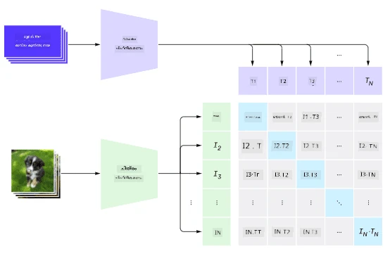
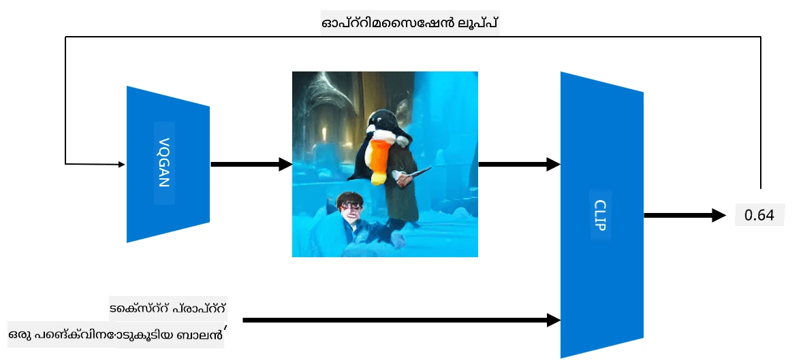

# മൾട്ടി-മോഡൽ നെറ്റ്വർക്കുകൾ

NLP ടാസ്കുകൾ പരിഹരിക്കുന്നതിന് ട്രാൻസ്ഫോർമർ മോഡലുകളുടെ വിജയം കഴിഞ്ഞ്, സമാനമായ ആർക്കിടെക്ചറുകൾ കമ്പ്യൂട്ടർ വിചൻ ടാസ്കുകൾക്കും പ്രയോഗിക്കപ്പെട്ടു. കാഴ്ചയും സ്വാഭാവിക ഭാഷാ കഴിവുകളും *കേർത്ത്* മോഡലുകൾ നിർമ്മിക്കാനുള്ള താൽപര്യം വർധിക്കുകയാണ്. OpenAI നടത്തിയ ഒരു ശ്രമമാണ് CLIP, DALL.E എന്ന പേരിൽ അറിയപ്പെടുന്നത്.

## കോൺട്രാസ്റ്റീവ് ഇമേജ് പ്രീ-ട്രെയിനിംഗ് (CLIP)

CLIP-ന്റെ പ്രധാന ആശയം ഒരു ടെക്സ്റ്റ് പ്രോംപ്റ്റും ഒരു ചിത്രവും താരതമ്യം ചെയ്ത് ചിത്രം പ്രോംപ്റ്റിനോട് എത്രത്തോളം പൊരുത്തപ്പെടുന്നു എന്ന് നിർണ്ണയിക്കാനാകുക എന്നതാണ്.

> *ഈ ചിത്രം [ഈ ബ്ലോഗ് പോസ്റ്റിൽ നിന്നാണ്](https://openai.com/blog/clip/)*

മോഡൽ ഇന്റർനെറ്റിൽ നിന്നുള്ള ചിത്രങ്ങളും അവയുടെ ക്യാപ്ഷനുകളും ഉപയോഗിച്ച് പരിശീലിപ്പിക്കുന്നു. ഓരോ ബാച്ചിലും N (ചിത്രം, ടെക്സ്റ്റ്) ജോഡികൾ എടുത്ത് അവ I1,..., IN / T1, ..., TN എന്ന വെക്ടർ പ്രതിനിധാനങ്ങളായി മാറ്റുന്നു. ആ പ്രതിനിധാനങ്ങൾ തമ്മിൽ പൊരുത്തപ്പെടുത്തുന്നു. ഒരു ജോഡിക്കുള്ള (ഉദാ. Ii , Ti) വെക്ടറുകൾക്കിടയിലെ കോസൈൻ സമാനത പരമാവധി ആക്കുകയും മറ്റു ജോഡികളുടെ കോസൈൻ സമാനത കുറയ്ക്കുകയും ചെയ്യുന്നതാണ് ലോസ് ഫംഗ്ഷൻ. അതുകൊണ്ടാണ് ഈ സമീപനം **കോൺട്രാസ്റ്റീവ്** എന്ന് വിളിക്കുന്നത്.

CLIP മോഡൽ/ലൈബ്രറി [OpenAI GitHub](https://github.com/openai/CLIP) ൽ ലഭ്യമാണ്. ഈ സമീപനം [ഈ ബ്ലോഗ് പോസ്റ്റിൽ](https://openai.com/blog/clip/) വിശദീകരിച്ചിരിക്കുന്നു, കൂടുതൽ വിശദമായി [ഈ പേപ്പറിൽ](https://arxiv.org/pdf/2103.00020.pdf) കാണാം.

ഈ മോഡൽ പ്രീ-ട്രെയിൻ ചെയ്ത ശേഷം, ചിത്രങ്ങളുടെ ഒരു ബാച്ചും ടെക്സ്റ്റ് പ്രോംപ്റ്റുകളുടെ ഒരു ബാച്ചും നൽകുമ്പോൾ, പ്രോബബിലിറ്റികളുള്ള ടെൻസർ ലഭിക്കും. CLIP പല ടാസ്കുകൾക്കും ഉപയോഗിക്കാം:

**ചിത്ര വർഗ്ഗീകരണം**

ഉദാഹരണത്തിന്, പൂച്ചകൾ, നായകൾ, മനുഷ്യർ എന്നിങ്ങനെ ചിത്രങ്ങൾ വർഗ്ഗീകരിക്കേണ്ടതുണ്ടെങ്കിൽ, മോഡലിന് ഒരു ചിത്രം നൽകുകയും, "*ഒരു പൂച്ചയുടെ ചിത്രം*", "*ഒരു നായയുടെ ചിത്രം*", "*ഒരു മനുഷ്യന്റെ ചിത്രം*" എന്നിങ്ങനെ ടെക്സ്റ്റ് പ്രോംപ്റ്റുകൾ നൽകുകയും ചെയ്യാം. 3 പ്രോബബിലിറ്റികളുള്ള വെക്ടറിൽ ഏറ്റവും ഉയർന്ന മൂല്യമുള്ള ഇൻഡക്സ് തിരഞ്ഞെടുക്കുക മതി.

> *ഈ ചിത്രം [ഈ ബ്ലോഗ് പോസ്റ്റിൽ നിന്നാണ്](https://openai.com/blog/clip/)*

**ടെക്സ്റ്റ് അടിസ്ഥാനമാക്കിയുള്ള ചിത്രം തിരയൽ**

ഇതിന്റെ മറുവശം, ചിത്രങ്ങളുടെ ഒരു ശേഖരം ഉണ്ടെങ്കിൽ, ആ ശേഖരം മോഡലിന് നൽകുകയും, ഒരു ടെക്സ്റ്റ് പ്രോംപ്റ്റ് നൽകുകയും ചെയ്താൽ, ആ പ്രോംപ്റ്റിനോട് ഏറ്റവും സാമ്യമുള്ള ചിത്രം ലഭിക്കും.

## ✍️ ഉദാഹരണം: [ചിത്ര വർഗ്ഗീകരണത്തിനും ചിത്രം തിരയലിനും CLIP ഉപയോഗിക്കൽ](Clip.ipynb)

CLIP പ്രവർത്തനത്തിൽ കാണാൻ [Clip.ipynb](Clip.ipynb) നോട്ട്‌ബുക്ക് തുറക്കുക.

## VQGAN+ CLIP ഉപയോഗിച്ച് ചിത്രം സൃഷ്ടിക്കൽ

CLIP ടെക്സ്റ്റ് പ്രോംപ്റ്റിൽ നിന്നുള്ള **ചിത്ര സൃഷ്ടിക്കലിനും** ഉപയോഗിക്കാം. ഇതിന്, ഒരു **ജനറേറ്റർ മോഡൽ** വേണം, അത് ചില വെക്ടർ ഇൻപുട്ട് അടിസ്ഥാനമാക്കി ചിത്രങ്ങൾ സൃഷ്ടിക്കാനാകും. അത്തരത്തിലുള്ള മോഡലുകളിൽ ഒന്ന് [VQGAN](https://compvis.github.io/taming-transformers/) (വെക്ടർ-ക്വാണ്ടൈസ്ഡ് GAN) ആണ്.

VQGAN-നെ സാധാരണ [GAN](../../4-ComputerVision/10-GANs/README.md) മോഡലുകളിൽ നിന്ന് വ്യത്യസ്തമാക്കുന്ന പ്രധാന ആശയങ്ങൾ:
* ഓട്ടോറെഗ്രസീവ് ട്രാൻസ്ഫോർമർ ആർക്കിടെക്ചർ ഉപയോഗിച്ച് ചിത്രത്തെ രൂപപ്പെടുത്തുന്ന സമ്പൂർണമായ കാഴ്ചാ ഭാഗങ്ങളുടെ സീക്വൻസ് സൃഷ്ടിക്കൽ. ആ കാഴ്ചാ ഭാഗങ്ങൾ [CNN](../../4-ComputerVision/07-ConvNets/README.md) ഉപയോഗിച്ച് പഠിപ്പിക്കുന്നു.
* ചിത്രത്തിന്റെ ഭാഗങ്ങൾ "യഥാർത്ഥമാണോ" "കൃത്രിമമാണോ" എന്ന് കണ്ടെത്തുന്ന സബ്-ഇമേജ് ഡിസ്ക്രിമിനേറ്റർ ഉപയോഗിക്കൽ (പരമ്പരാഗത GAN-ലെ "എല്ലാം അല്ലെങ്കിൽ ഒന്നുമില്ല" സമീപനത്തിന് പകരം).

VQGAN-നെ കുറിച്ച് കൂടുതൽ അറിയാൻ [Taming Transformers](https://compvis.github.io/taming-transformers/) വെബ്‌സൈറ്റ് സന്ദർശിക്കുക.

VQGAN-നും പരമ്പരാഗത GAN-നും ഇടയിലെ പ്രധാന വ്യത്യാസം, GAN ഏതെങ്കിലും ഇൻപുട്ട് വെക്ടറിൽ നിന്ന് നല്ല ചിത്രം സൃഷ്ടിക്കാമെങ്കിലും, VQGAN സൃഷ്ടിക്കുന്ന ചിത്രം സുസംയോജിതമല്ലായിരിക്കാം. അതിനാൽ, ചിത്രം സൃഷ്ടിക്കൽ പ്രക്രിയ കൂടുതൽ മാർഗ്ഗനിർദ്ദേശം ആവശ്യമാണ്, അത് CLIP ഉപയോഗിച്ച് സാധ്യമാക്കാം.

ഒരു ടെക്സ്റ്റ് പ്രോംപ്റ്റിനോട് പൊരുത്തമുള്ള ചിത്രം സൃഷ്ടിക്കാൻ, ആദ്യം ഒരു യാദൃച്ഛിക എൻകോഡിംഗ് വെക്ടർ എടുത്ത് VQGAN വഴി ചിത്രം സൃഷ്ടിക്കുന്നു. തുടർന്ന് CLIP ഉപയോഗിച്ച് ചിത്രം പ്രോംപ്റ്റിനോട് എത്രത്തോളം പൊരുത്തപ്പെടുന്നു എന്ന് കാണിക്കുന്ന ലോസ് ഫംഗ്ഷൻ നിർമ്മിക്കുന്നു. ഈ ലോസ് കുറയ്ക്കാൻ ബാക്ക് പ്രൊപ്പഗേഷൻ ഉപയോഗിച്ച് ഇൻപുട്ട് വെക്ടർ പാരാമീറ്ററുകൾ ക്രമീകരിക്കുന്നു.

VQGAN+CLIP നടപ്പിലാക്കുന്ന മികച്ച ലൈബ്രറിയാണ് [Pixray](http://github.com/pixray/pixray)

 |   | 
----|----|----
*ഒരു പുസ്തകമുള്ള സാഹിത്യ അധ്യാപകനായ യുവ പുരുഷന്റെ ക്ലോസ്അപ്പ് വാട്ടർകോളർ പോർട്രെയിറ്റ്* എന്ന പ്രോംപ്റ്റിൽ നിന്നുള്ള ചിത്രം | *ഒരു കമ്പ്യൂട്ടർ ഉള്ള യുവ വനിതാ കമ്പ്യൂട്ടർ സയൻസ് അധ്യാപകന്റെ ക്ലോസ്അപ്പ് ഓയിൽ പോർട്രെയിറ്റ്* എന്ന പ്രോംപ്റ്റിൽ നിന്നുള്ള ചിത്രം | *ബ്ലാക്ക്ബോർഡിന് മുന്നിലുള്ള പ്രായമായ പുരുഷ ഗണിത അധ്യാപകന്റെ ക്ലോസ്അപ്പ് ഓയിൽ പോർട്രെയിറ്റ്* എന്ന പ്രോംപ്റ്റിൽ നിന്നുള്ള ചിത്രം

> ചിത്രങ്ങൾ **Artificial Teachers** ശേഖരത്തിൽ നിന്നുള്ളവ, [Dmitry Soshnikov](http://soshnikov.com) 

## DALL-E
### [DALL-E 1](https://openai.com/research/dall-e)
DALL-E GPT-3-ന്റെ ഒരു പതിപ്പാണ്, പ്രോംപ്റ്റുകളിൽ നിന്നുള്ള ചിത്രങ്ങൾ സൃഷ്ടിക്കാൻ പരിശീലിപ്പിച്ചിരിക്കുന്നു. ഇതിന് 12 ബില്യൺ പാരാമീറ്ററുകൾ ഉണ്ട്.

CLIP-നോട് വ്യത്യസ്തമായി, DALL-E ടെക്സ്റ്റും ചിത്രവും ഒരേ ടോക്കൺ സ്ട്രീമിൽ സ്വീകരിക്കുന്നു. അതിനാൽ, പല പ്രോംപ്റ്റുകളിൽ നിന്നുമുള്ള ചിത്രങ്ങൾ ടെക്സ്റ്റ് അടിസ്ഥാനമാക്കി സൃഷ്ടിക്കാം.

### [DALL-E 2](https://openai.com/dall-e-2)
DALL.E 1-നും 2-നും ഇടയിലെ പ്രധാന വ്യത്യാസം, 2-ാം പതിപ്പ് കൂടുതൽ യാഥാർത്ഥ്യസമൃദ്ധമായ ചിത്രങ്ങളും കലാസൃഷ്ടികളും സൃഷ്ടിക്കുന്നു എന്നതാണ്.

DALL-E ഉപയോഗിച്ച് സൃഷ്ടിച്ച ചിത്രങ്ങളുടെ ഉദാഹരണങ്ങൾ:
 |   | 
----|----|----
*ഒരു പുസ്തകമുള്ള സാഹിത്യ അധ്യാപകനായ യുവ പുരുഷന്റെ ക്ലോസ്അപ്പ് വാട്ടർകോളർ പോർട്രെയിറ്റ്* എന്ന പ്രോംപ്റ്റിൽ നിന്നുള്ള ചിത്രം | *ഒരു കമ്പ്യൂട്ടർ ഉള്ള യുവ വനിതാ കമ്പ്യൂട്ടർ സയൻസ് അധ്യാപകന്റെ ക്ലോസ്അപ്പ് ഓയിൽ പോർട്രെയിറ്റ്* എന്ന പ്രോംപ്റ്റിൽ നിന്നുള്ള ചിത്രം | *ബ്ലാക്ക്ബോർഡിന് മുന്നിലുള്ള പ്രായമായ പുരുഷ ഗണിത അധ്യാപകന്റെ ക്ലോസ്അപ്പ് ഓയിൽ പോർട്രെയിറ്റ്* എന്ന പ്രോംപ്റ്റിൽ നിന്നുള്ള ചിത്രം

## റഫറൻസുകൾ

* VQGAN പേപ്പർ: [Taming Transformers for High-Resolution Image Synthesis](https://compvis.github.io/taming-transformers/paper/paper.pdf)
* CLIP പേപ്പർ: [Learning Transferable Visual Models From Natural Language Supervision](https://arxiv.org/pdf/2103.00020.pdf)

---

<!-- CO-OP TRANSLATOR DISCLAIMER START -->
**അസൂയാ**:  
ഈ രേഖ AI വിവർത്തന സേവനം [Co-op Translator](https://github.com/Azure/co-op-translator) ഉപയോഗിച്ച് വിവർത്തനം ചെയ്തതാണ്. നാം കൃത്യതയ്ക്ക് ശ്രമിച്ചെങ്കിലും, യന്ത്രം ചെയ്ത വിവർത്തനങ്ങളിൽ പിശകുകൾ അല്ലെങ്കിൽ തെറ്റുകൾ ഉണ്ടാകാമെന്ന് ദയവായി ശ്രദ്ധിക്കുക. അതിന്റെ മാതൃഭാഷയിലുള്ള യഥാർത്ഥ രേഖ പ്രാമാണികമായ ഉറവിടമായി കണക്കാക്കണം. നിർണായക വിവരങ്ങൾക്ക്, പ്രൊഫഷണൽ മനുഷ്യ വിവർത്തനം ശുപാർശ ചെയ്യപ്പെടുന്നു. ഈ വിവർത്തനം ഉപയോഗിക്കുന്നതിൽ നിന്നുണ്ടാകുന്ന ഏതെങ്കിലും തെറ്റിദ്ധാരണകൾക്കോ വ്യാഖ്യാനക്കേടുകൾക്കോ ഞങ്ങൾ ഉത്തരവാദികളല്ല.
<!-- CO-OP TRANSLATOR DISCLAIMER END -->