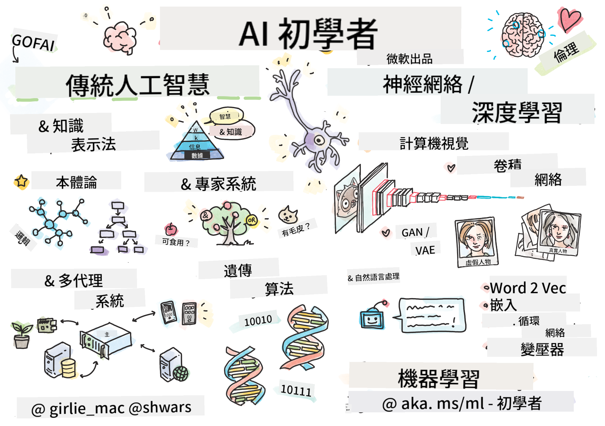

<!--
CO_OP_TRANSLATOR_METADATA:
{
  "original_hash": "0dc6311637b811abb415a936669d7e76",
  "translation_date": "2026-01-05T14:48:45+00:00",
  "source_file": "README.md",
  "language_code": "mo"
}
-->
[](https://github.com/microsoft/AI-For-Beginners/blob/main/LICENSE)
[](https://GitHub.com/microsoft/AI-For-Beginners/graphs/contributors/)
[](https://GitHub.com/microsoft/AI-For-Beginners/issues/)
[](https://GitHub.com/microsoft/AI-For-Beginners/pulls/)
[](http://makeapullrequest.com)

[](https://GitHub.com/microsoft/AI-For-Beginners/watchers/)
[](https://GitHub.com/microsoft/AI-For-Beginners/network/)
[](https://GitHub.com/microsoft/AI-For-Beginners/stargazers/)
[](https://mybinder.org/v2/gh/microsoft/ai-for-beginners/HEAD)
[](https://gitter.im/Microsoft/ai-for-beginners?utm_source=badge&utm_medium=badge&utm_campaign=pr-badge)

[](https://discord.gg/nTYy5BXMWG)

# 初學者人工智能課程

||
|:---:|
| 初學者人工智能 - _速寫筆記由 [@girlie_mac](https://twitter.com/girlie_mac) 提供_ |

探索**人工智能** (AI) 的世界，透過我們為期12週、共24堂課的課程！課程包含實務課程、小測驗及實驗室實作。此課程適合初學者，涵蓋 TensorFlow、PyTorch 等工具，以及 AI 倫理議題。

### 🌐 多語言支援

#### 透過 GitHub Action 支援（自動且持續更新）

<!-- CO-OP TRANSLATOR LANGUAGES TABLE START -->
[阿拉伯文](../ar/README.md) | [孟加拉文](../bn/README.md) | [保加利亞文](../bg/README.md) | [緬甸文 (Myanmar)](../my/README.md) | [中文 (簡體)](../zh/README.md) | [中文 (繁體，香港)](../hk/README.md) | [中文 (繁體，澳門)](./README.md) | [中文 (繁體，台灣)](../tw/README.md) | [克羅埃西亞文](../hr/README.md) | [捷克文](../cs/README.md) | [丹麥文](../da/README.md) | [荷蘭文](../nl/README.md) | [愛沙尼亞文](../et/README.md) | [芬蘭文](../fi/README.md) | [法文](../fr/README.md) | [德文](../de/README.md) | [希臘文](../el/README.md) | [希伯來文](../he/README.md) | [印地文](../hi/README.md) | [匈牙利文](../hu/README.md) | [印尼文](../id/README.md) | [意大利文](../it/README.md) | [日文](../ja/README.md) | [卡納達文](../kn/README.md) | [韓文](../ko/README.md) | [立陶宛文](../lt/README.md) | [馬來文](../ms/README.md) | [馬拉雅拉姆文](../ml/README.md) | [馬拉地文](../mr/README.md) | [尼泊爾文](../ne/README.md) | [奈及利亞洋泾浜英語](../pcm/README.md) | [挪威文](../no/README.md) | [波斯文 (法爾西語)](../fa/README.md) | [波蘭文](../pl/README.md) | [葡萄牙文 (巴西)](../br/README.md) | [葡萄牙文 (葡萄牙)](../pt/README.md) | [旁遮普文 (Gurmukhi)](../pa/README.md) | [羅馬尼亞文](../ro/README.md) | [俄文](../ru/README.md) | [塞爾維亞文 (西里爾字母)](../sr/README.md) | [斯洛伐克文](../sk/README.md) | [斯洛文尼亞文](../sl/README.md) | [西班牙文](../es/README.md) | [斯瓦希里文](../sw/README.md) | [瑞典文](../sv/README.md) | [他加祿文 (菲律賓語)](../tl/README.md) | [泰米爾文](../ta/README.md) | [泰盧固文](../te/README.md) | [泰文](../th/README.md) | [土耳其文](../tr/README.md) | [烏克蘭文](../uk/README.md) | [烏爾都文](../ur/README.md) | [越南文](../vi/README.md)

> **想要本地複製？**

> 本倉庫包含超過50種語言翻譯，會大幅增加下載大小。若想複製不包含翻譯的版本，請使用稀疏檢出：
> ```bash
> git clone --filter=blob:none --sparse https://github.com/microsoft/AI-For-Beginners.git
> cd AI-For-Beginners
> git sparse-checkout set --no-cone '/*' '!translations' '!translated_images'
> ```
> 這樣您就能用更快的速度下載並完成課程內容。
<!-- CO-OP TRANSLATOR LANGUAGES TABLE END -->

**如果您希望支援更多翻譯語言，請參考[這裡](https://github.com/Azure/co-op-translator/blob/main/getting_started/supported-languages.md)**

## 加入社群
[](https://discord.gg/nTYy5BXMWG)

## 您將學到什麼

**[課程心智圖](http://soshnikov.com/courses/ai-for-beginners/mindmap.html)**

本課程將教授：

* 不同人工智能的方法，包括「老派」的符號方法，結合**知識表徵**及推理（[GOFAI](https://en.wikipedia.org/wiki/Symbolic_artificial_intelligence)）。
* 神經網絡與深度學習，是現代 AI 的核心。我們會使用兩個當紅框架的程式碼示範這些重要概念——[TensorFlow](http://Tensorflow.org) 和 [PyTorch](http://pytorch.org)。
* 針對圖片與文字的**神經架構**。我們會涵蓋近代模型，但可能未達最新研究水準。
* 較不常用的 AI 方法，例如**遺傳算法**與**多代理系統**。

本課程不包含：

> [在 Microsoft Learn 上查看此課程所有額外資源](https://learn.microsoft.com/en-us/collections/7w28iy2xrqzdj0?WT.mc_id=academic-77998-bethanycheum)

* 商業中**AI 的應用案例**。建議可參考 Microsoft Learn 上的 [企業用戶 AI 入門](https://docs.microsoft.com/learn/paths/introduction-ai-for-business-users/?WT.mc_id=academic-77998-bethanycheum) 學習路徑，或與 [INSEAD](https://www.insead.edu/) 合作開發的 [AI 商業學校](https://www.microsoft.com/ai/ai-business-school/?WT.mc_id=academic-77998-bethanycheum)。
* **經典機器學習**，請參閱我們的 [初學者機器學習課程](http://github.com/Microsoft/ML-for-Beginners)。
* 使用 **[認知服務](https://azure.microsoft.com/services/cognitive-services/?WT.mc_id=academic-77998-bethanycheum)** 架構的實務 AI 應用。我們建議從 Microsoft Learn 的[視覺](https://docs.microsoft.com/learn/paths/create-computer-vision-solutions-azure-cognitive-services/?WT.mc_id=academic-77998-bethanycheum)、[自然語言處理](https://docs.microsoft.com/learn/paths/explore-natural-language-processing/?WT.mc_id=academic-77998-bethanycheum)、**[Azure OpenAI 服務的生成式 AI](https://learn.microsoft.com/en-us/training/paths/develop-ai-solutions-azure-openai/?WT.mc_id=academic-77998-bethanycheum)**等模組開始學習。
* 特定機器學習**雲端框架**，如 [Azure Machine Learning](https://azure.microsoft.com/services/machine-learning/?WT.mc_id=academic-77998-bethanycheum)、[Microsoft Fabric](https://learn.microsoft.com/en-us/training/paths/get-started-fabric/?WT.mc_id=academic-77998-bethanycheum) 或 [Azure Databricks](https://docs.microsoft.com/learn/paths/data-engineer-azure-databricks?WT.mc_id=academic-77998-bethanycheum)。可參考 [使用 Azure ML 服務建立與操作機器學習解決方案](https://docs.microsoft.com/learn/paths/build-ai-solutions-with-azure-ml-service/?WT.mc_id=academic-77998-bethanycheum) 與 [使用 Azure Databricks 建立與操作機器學習解決方案](https://docs.microsoft.com/learn/paths/build-operate-machine-learning-solutions-azure-databricks/?WT.mc_id=academic-77998-bethanycheum)。
* **對話式 AI** 與 **聊天機器人**。有獨立的 [建立對話式 AI 解決方案](https://docs.microsoft.com/learn/paths/create-conversational-ai-solutions/?WT.mc_id=academic-77998-bethanycheum) 學習路徑，您也可參考[此部落格](https://soshnikov.com/azure/hello-bot-conversational-ai-on-microsoft-platform/)獲得更多資訊。
* 深度學習背後的**高深數學**。建議閱讀 Ian Goodfellow、Yoshua Bengio 及 Aaron Courville 著作的[深度學習](https://www.amazon.com/Deep-Learning-Adaptive-Computation-Machine/dp/0262035618)，並可線上查閱 [https://www.deeplearningbook.org/](https://www.deeplearningbook.org/)。

若想輕鬆入門 _雲端 AI_ 主題，您可參考 Microsoft Learn 的 [Azure 人工智能快速入門](https://docs.microsoft.com/learn/paths/get-started-with-artificial-intelligence-on-azure/?WT.mc_id=academic-77998-bethanycheum) 學習路徑。

# 課程內容

|     |                                                                 課程連結                                                                   |                                           PyTorch/Keras/TensorFlow                                          | 實驗室                                                            |
| :-: | :------------------------------------------------------------------------------------------------------------------------------------------: | :---------------------------------------------------------------------------------------------: | ------------------------------------------------------------------------------ |
| 0  |                                 [課程設定](./lessons/0-course-setup/setup.md)                                 |                      [設定您的開發環境](./lessons/0-course-setup/how-to-run.md)                       |   |
| I  |                [**AI 簡介**](./lessons/1-Intro/README.md)       | | |
| 01  |       [人工智能介紹及歷史](./lessons/1-Intro/README.md)       |           -                            | -  |
| II |              **符號 AI**              |
| 02  |       [知識表徵與專家系統](./lessons/2-Symbolic/README.md)       |            [專家系統](./lessons/2-Symbolic/Animals.ipynb) /  [本體論](./lessons/2-Symbolic/FamilyOntology.ipynb) /[概念圖](./lessons/2-Symbolic/MSConceptGraph.ipynb)                             |  |
| III |                        [**神經網絡導論**](./lessons/3-NeuralNetworks/README.md) |||
| 03  |                [感知機](./lessons/3-NeuralNetworks/03-Perceptron/README.md)                 |                       [筆記本](./lessons/3-NeuralNetworks/03-Perceptron/Perceptron.ipynb)                      | [實驗室](./lessons/3-NeuralNetworks/03-Perceptron/lab/README.md) |
| 04  |                   [多層感知機及建立自家框架](./lessons/3-NeuralNetworks/04-OwnFramework/README.md)                   |        [筆記本](./lessons/3-NeuralNetworks/04-OwnFramework/OwnFramework.ipynb)        | [實驗室](./lessons/3-NeuralNetworks/04-OwnFramework/lab/README.md) |
| 05  |            [框架簡介（PyTorch/TensorFlow）及過擬合](./lessons/3-NeuralNetworks/05-Frameworks/README.md)             |           [PyTorch](./lessons/3-NeuralNetworks/05-Frameworks/IntroPyTorch.ipynb) / [Keras](./lessons/3-NeuralNetworks/05-Frameworks/IntroKeras.ipynb) / [TensorFlow](./lessons/3-NeuralNetworks/05-Frameworks/IntroKerasTF.ipynb)             | [實驗室](./lessons/3-NeuralNetworks/05-Frameworks/lab/README.md) |
| IV  |            [**電腦視覺**](./lessons/4-ComputerVision/README.md)             | [PyTorch](https://docs.microsoft.com/learn/modules/intro-computer-vision-pytorch/?WT.mc_id=academic-77998-cacaste) / [TensorFlow](https://docs.microsoft.com/learn/modules/intro-computer-vision-TensorFlow/?WT.mc_id=academic-77998-cacaste)| [在 Microsoft Azure 探索電腦視覺](https://learn.microsoft.com/en-us/collections/7w28iy2xrqzdj0?WT.mc_id=academic-77998-bethanycheum) |
| 06  |            [電腦視覺簡介。OpenCV](./lessons/4-ComputerVision/06-IntroCV/README.md)             |           [筆記本](./lessons/4-ComputerVision/06-IntroCV/OpenCV.ipynb)         | [實驗室](./lessons/4-ComputerVision/06-IntroCV/lab/README.md) |
| 07  |            [卷積神經網絡](./lessons/4-ComputerVision/07-ConvNets/README.md) &  [CNN 架構](./lessons/4-ComputerVision/07-ConvNets/CNN_Architectures.md)             |           [PyTorch](./lessons/4-ComputerVision/07-ConvNets/ConvNetsPyTorch.ipynb) /[TensorFlow](./lessons/4-ComputerVision/07-ConvNets/ConvNetsTF.ipynb)             | [實驗室](./lessons/4-ComputerVision/07-ConvNets/lab/README.md) |
| 08  |            [預訓練網絡及遷移學習](./lessons/4-ComputerVision/08-TransferLearning/README.md) 和 [訓練技巧](./lessons/4-ComputerVision/08-TransferLearning/TrainingTricks.md)             |           [PyTorch](./lessons/4-ComputerVision/08-TransferLearning/TransferLearningPyTorch.ipynb) / [TensorFlow](./lessons/3-NeuralNetworks/05-Frameworks/IntroKerasTF.ipynb)             | [實驗室](./lessons/4-ComputerVision/08-TransferLearning/lab/README.md) |
| 09  |            [自動編碼器與變分自動編碼器](./lessons/4-ComputerVision/09-Autoencoders/README.md)             |           [PyTorch](./lessons/4-ComputerVision/09-Autoencoders/AutoEncodersPyTorch.ipynb) / [TensorFlow](./lessons/4-ComputerVision/09-Autoencoders/AutoencodersTF.ipynb)             |  |
| 10  |            [生成對抗網絡與藝術風格轉換](./lessons/4-ComputerVision/10-GANs/README.md)             |           [PyTorch](./lessons/4-ComputerVision/10-GANs/GANPyTorch.ipynb) / [TensorFlow](./lessons/4-ComputerVision/10-GANs/GANTF.ipynb)             |  |
| 11  |            [物體偵測](./lessons/4-ComputerVision/11-ObjectDetection/README.md)             |         [TensorFlow](./lessons/4-ComputerVision/11-ObjectDetection/ObjectDetection.ipynb)             | [實驗室](./lessons/4-ComputerVision/11-ObjectDetection/lab/README.md) |
| 12  |            [語義分割。U-Net](./lessons/4-ComputerVision/12-Segmentation/README.md)             |           [PyTorch](./lessons/4-ComputerVision/12-Segmentation/SemanticSegmentationPytorch.ipynb) / [TensorFlow](./lessons/4-ComputerVision/12-Segmentation/SemanticSegmentationTF.ipynb)             |  |
| V  |            [**自然語言處理**](./lessons/5-NLP/README.md)             | [PyTorch](https://docs.microsoft.com/learn/modules/intro-natural-language-processing-pytorch/?WT.mc_id=academic-77998-cacaste) /[TensorFlow](https://docs.microsoft.com/learn/modules/intro-natural-language-processing-TensorFlow/?WT.mc_id=academic-77998-cacaste) | [在 Microsoft Azure 探索自然語言處理](https://learn.microsoft.com/en-us/collections/7w28iy2xrqzdj0?WT.mc_id=academic-77998-bethanycheum)|
| 13  |            [文本表示法。詞袋模型/TF-IDF](./lessons/5-NLP/13-TextRep/README.md)             |           [PyTorch](https://github.com/microsoft/AI-For-Beginners/blob/main/lessons/5-NLP/13-TextRep/TextRepresentationPyTorch.ipynb) / [TensorFlow](https://github.com/microsoft/AI-For-Beginners/blob/main/lessons/5-NLP/13-TextRep/TextRepresentationTF.ipynb)             | |
| 14  |            [語義詞向量嵌入。Word2Vec 與 GloVe](./lessons/5-NLP/14-Embeddings/README.md)             |           [PyTorch](https://github.com/microsoft/AI-For-Beginners/blob/main/lessons/5-NLP/14-Embeddings/EmbeddingsPyTorch.ipynb) / [TensorFlow](https://github.com/microsoft/AI-For-Beginners/blob/main/lessons/5-NLP/14-Embeddings/EmbeddingsTF.ipynb)             |  |
| 15  |            [語言模型。訓練自己的嵌入](./lessons/5-NLP/15-LanguageModeling/README.md)             |           [PyTorch](https://github.com/microsoft/AI-For-Beginners/blob/main/lessons/5-NLP/15-LanguageModeling/CBoW-PyTorch.ipynb) / [TensorFlow](https://github.com/microsoft/AI-For-Beginners/blob/main/lessons/5-NLP/15-LanguageModeling/CBoW-TF.ipynb)             | [實驗室](./lessons/5-NLP/15-LanguageModeling/lab/README.md) |
| 16  |            [遞歸神經網絡](./lessons/5-NLP/16-RNN/README.md)             |           [PyTorch](https://github.com/microsoft/AI-For-Beginners/blob/main/lessons/5-NLP/16-RNN/RNNPyTorch.ipynb) / [TensorFlow](https://github.com/microsoft/AI-For-Beginners/blob/main/lessons/5-NLP/16-RNN/RNNTF.ipynb)             |  |
| 17  |            [生成遞歸網絡](./lessons/5-NLP/17-GenerativeNetworks/README.md)             |           [PyTorch](https://github.com/microsoft/AI-For-Beginners/blob/main/lessons/5-NLP/17-GenerativeNetworks/GenerativePyTorch.ipynb) / [TensorFlow](https://github.com/microsoft/AI-For-Beginners/blob/main/lessons/5-NLP/17-GenerativeNetworks/GenerativeTF.ipynb)             | [實驗室](./lessons/5-NLP/17-GenerativeNetworks/lab/README.md) |
| 18  |            [變換器。BERT。](./lessons/5-NLP/18-Transformers/README.md)             |           [PyTorch](https://github.com/microsoft/AI-For-Beginners/blob/main/lessons/5-NLP/18-Transformers/TransformersPyTorch.ipynb) /[TensorFlow](https://github.com/microsoft/AI-For-Beginners/blob/main/lessons/5-NLP/18-Transformers/TransformersTF.ipynb)             |  |
| 19  |            [命名實體識別](./lessons/5-NLP/19-NER/README.md)             |           [TensorFlow](https://microsoft.github.io/AI-For-Beginners/lessons/5-NLP/19-NER/NER-TF.ipynb)             | [實驗室](./lessons/5-NLP/19-NER/lab/README.md) |
| 20  |            [大型語言模型、提示編程與少量示例任務](./lessons/5-NLP/20-LangModels/README.md)             |           [PyTorch](https://microsoft.github.io/AI-For-Beginners/lessons/5-NLP/20-LangModels/GPT-PyTorch.ipynb) | |
| VI |            **其他 AI 技術** || |
| 21  |            [基因算法](./lessons/6-Other/21-GeneticAlgorithms/README.md)             |           [筆記本](./lessons/6-Other/21-GeneticAlgorithms/Genetic.ipynb) | |
| 22  |            [深度強化學習](./lessons/6-Other/22-DeepRL/README.md)             |           [PyTorch](./lessons/6-Other/22-DeepRL/CartPole-RL-PyTorch.ipynb) /[TensorFlow](./lessons/6-Other/22-DeepRL/CartPole-RL-TF.ipynb)             | [實驗室](./lessons/6-Other/22-DeepRL/lab/README.md) |
| 23  |            [多智能體系統](./lessons/6-Other/23-MultiagentSystems/README.md)             |  | |
| VII |            **AI 倫理** | | |
| 24  |            [AI 倫理與負責任的 AI](./lessons/7-Ethics/README.md)             |           [Microsoft Learn：負責任的 AI 原則](https://docs.microsoft.com/learn/paths/responsible-ai-business-principles/?WT.mc_id=academic-77998-cacaste) | |
| IX  |            **額外內容** | | |
| 25  |            [多模態網絡、CLIP 與 VQGAN](./lessons/X-Extras/X1-MultiModal/README.md)             |           [筆記本](./lessons/X-Extras/X1-MultiModal/Clip.ipynb)    | |

## 每堂課包含

* 預習材料
* 可執行的 Jupyter 筆記本，通常針對某種框架（**PyTorch** 或 **TensorFlow**）。可執行筆記本也包含大量理論內容，因此要理解主題，需要至少完成其中一個版本（PyTorch 或 TensorFlow）。
* 部份主題有**實驗室**，讓你有機會將所學知識應用到特定問題。
* 有些章節包含連結至[**Microsoft Learn**](https://learn.microsoft.com/en-us/collections/7w28iy2xrqzdj0?WT.mc_id=academic-77998-bethanycheum)相關主題的模組。

## 開始學習

### 🎯 對 AI 完全新手？從這裡開始！

如果你對 AI 完全陌生，想要快速實操範例，請查看我們的[**新手友好範例**](./examples/README.md)！內容包括：

- 🌟 **Hello AI World** - 你的第一個 AI 程式（模式識別）
- 🧠 **簡單神經網絡** - 從零建構一個神經網絡  
- 🖼️ **影像分類器** - 詳細註釋的影像分類器
- 💬 **文字情感分析** - 分析正面/負面文字

這些範例旨在幫助您了解 AI 概念，然後再深入完整課程。

### 📚 完整課程設置

- 我們建立了一個[設置課程](./lessons/0-course-setup/setup.md) 來幫助您設置開發環境。 - 對於教育者，我們也為您準備了一個[課程設置課程](./lessons/0-course-setup/for-teachers.md)！
- 如何在 VSCode 或 Codepace 中[執行程式碼](./lessons/0-course-setup/how-to-run.md)

請按以下步驟操作：

分叉倉庫：點擊本頁面右上角的「Fork」按鈕。

克隆倉庫：`git clone https://github.com/microsoft/AI-For-Beginners.git`

別忘了給這個倉庫加星（🌟），以便日後更容易找到。

## 認識其他學習者

加入我們的[官方 AI Discord 伺服器](https://aka.ms/genai-discord?WT.mc_id=academic-105485-bethanycheum)，與其他參加此課程的學習者交流聯繫並獲得支援。

如果您在建置過程中有產品反饋或疑問，請造訪我們的[Azure AI Foundry 開發人員論壇](https://aka.ms/foundry/forum)

## 測驗

> **關於測驗的說明**：所有測驗均包含在 etc\quiz-app 裡的 Quiz-app 資料夾，或可[線上此處](https://ff-quizzes.netlify.app/)查看。它們與課程中串連，測驗應用程式可在本地端執行或部署至 Azure；請遵循 `quiz-app` 資料夾中的指示。測驗正逐步在地化中。

## 需要協助

您有建議或發現拼字或程式碼錯誤嗎？請提出議題或建立拉取請求。

## 特別感謝

* **✍️ 主要作者：** [Dmitry Soshnikov](http://soshnikov.com), PhD
* **🔥 編輯：** [Jen Looper](https://twitter.com/jenlooper), PhD
* **🎨 筆記插畫家：** [Tomomi Imura](https://twitter.com/girlie_mac)
* **✅ 測驗創作者：** [Lateefah Bello](https://github.com/CinnamonXI), [MLSA](https://studentambassadors.microsoft.com/)
* **🙏 核心貢獻者：** [Evgenii Pishchik](https://github.com/Pe4enIks)

## 其他課程

我們團隊還製作了其他課程！快來看看：

<!-- CO-OP TRANSLATOR OTHER COURSES START -->
### LangChain
[](https://aka.ms/langchain4j-for-beginners)
[](https://aka.ms/langchainjs-for-beginners?WT.mc_id=m365-94501-dwahlin)

---

### Azure / Edge / MCP / Agents
[](https://github.com/microsoft/AZD-for-beginners?WT.mc_id=academic-105485-koreyst)
[](https://github.com/microsoft/edgeai-for-beginners?WT.mc_id=academic-105485-koreyst)
[](https://github.com/microsoft/mcp-for-beginners?WT.mc_id=academic-105485-koreyst)
[](https://github.com/microsoft/ai-agents-for-beginners?WT.mc_id=academic-105485-koreyst)

---
 
### 生成式 AI 系列
[](https://github.com/microsoft/generative-ai-for-beginners?WT.mc_id=academic-105485-koreyst)
[-9333EA?style=for-the-badge&labelColor=E5E7EB&color=9333EA)](https://github.com/microsoft/Generative-AI-for-beginners-dotnet?WT.mc_id=academic-105485-koreyst)
[-C084FC?style=for-the-badge&labelColor=E5E7EB&color=C084FC)](https://github.com/microsoft/generative-ai-for-beginners-java?WT.mc_id=academic-105485-koreyst)
[-E879F9?style=for-the-badge&labelColor=E5E7EB&color=E879F9)](https://github.com/microsoft/generative-ai-with-javascript?WT.mc_id=academic-105485-koreyst)

---
 
### 核心學習
[](https://aka.ms/ml-beginners?WT.mc_id=academic-105485-koreyst)
[](https://aka.ms/datascience-beginners?WT.mc_id=academic-105485-koreyst)
[](https://aka.ms/ai-beginners?WT.mc_id=academic-105485-koreyst)
[](https://github.com/microsoft/Security-101?WT.mc_id=academic-96948-sayoung)
[](https://aka.ms/webdev-beginners?WT.mc_id=academic-105485-koreyst)
[](https://aka.ms/iot-beginners?WT.mc_id=academic-105485-koreyst)
[](https://github.com/microsoft/xr-development-for-beginners?WT.mc_id=academic-105485-koreyst)

---
 
### Copilot 系列
[](https://aka.ms/GitHubCopilotAI?WT.mc_id=academic-105485-koreyst)
[](https://github.com/microsoft/mastering-github-copilot-for-dotnet-csharp-developers?WT.mc_id=academic-105485-koreyst)
[](https://github.com/microsoft/CopilotAdventures?WT.mc_id=academic-105485-koreyst)
<!-- CO-OP TRANSLATOR OTHER COURSES END -->

## 尋求協助

如果您卡關或對建置 AI 應用程式有任何疑問，歡迎加入與 MCP 有關的討論，與其他學友和經驗豐富的開發者交流。這是一個支持性的社群，歡迎提問且知識自由分享。

[](https://discord.gg/nTYy5BXMWG)

如果您在建置過程中有產品反饋或錯誤，請造訪：

[](https://aka.ms/foundry/forum)

---

<!-- CO-OP TRANSLATOR DISCLAIMER START -->
**免責聲明**：
本文件乃使用人工智能翻譯服務 [Co-op Translator](https://github.com/Azure/co-op-translator) 翻譯而成。雖然我們致力於確保準確性，惟請注意自動翻譯可能包含錯誤或不準確之處。原始文件的母語版本應視為權威來源。如涉及重要資訊，建議採用專業人工翻譯。對於因使用本翻譯而引致的任何誤解或曲解，我們概不負責。
<!-- CO-OP TRANSLATOR DISCLAIMER END -->