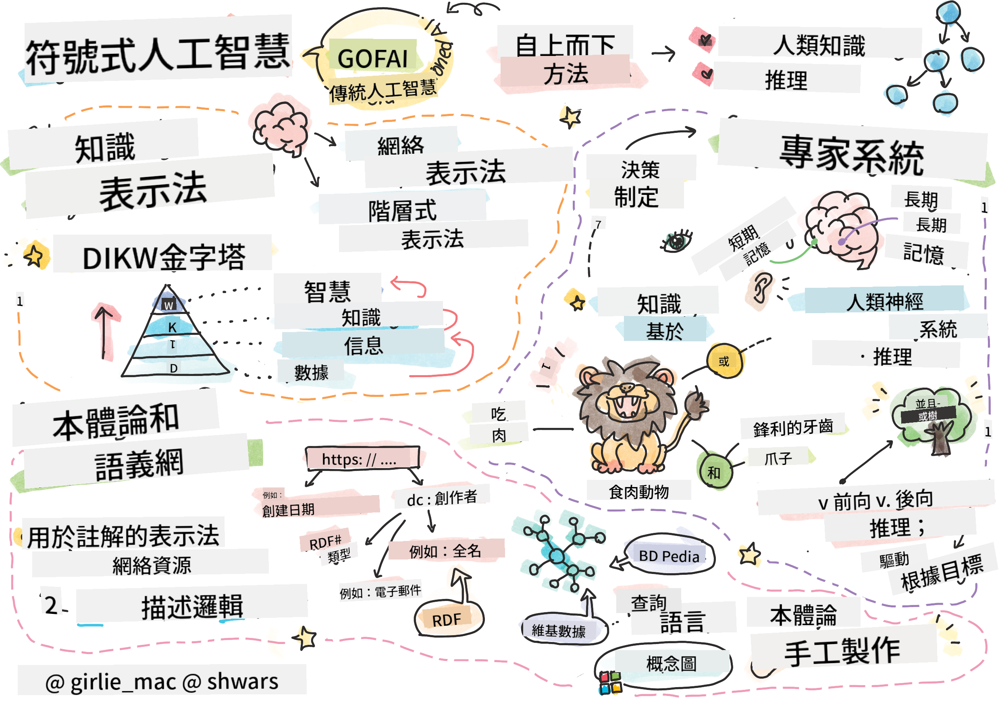
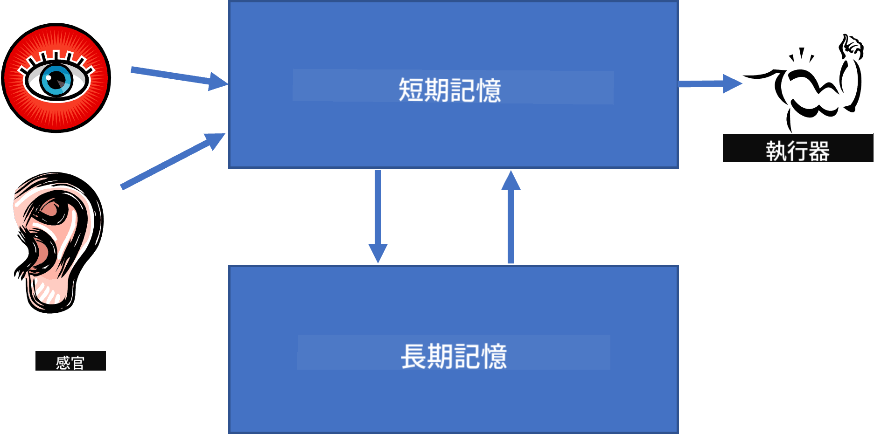

<!--
CO_OP_TRANSLATOR_METADATA:
{
  "original_hash": "7d097f7fda9166ead615e4c34552381b",
  "translation_date": "2025-09-23T08:09:09+00:00",
  "source_file": "lessons/2-Symbolic/README.md",
  "language_code": "mo"
}
-->
# 知識表示與專家系統



> Sketchnote by [Tomomi Imura](https://twitter.com/girlie_mac)

人工智慧的追求基於對知識的探索，目的是讓機器能像人類一樣理解世界。但該如何實現呢？

## [課前測驗](https://ff-quizzes.netlify.app/en/ai/quiz/3)

在人工智慧的早期，採用自上而下的方法來創建智能系統（在上一課中討論過）非常流行。這種方法的核心思想是將人類的知識提取成機器可讀的形式，然後用它來自動解決問題。這種方法基於兩個重要概念：

* 知識表示
* 推理

## 知識表示

象徵式 AI 的一個重要概念是**知識**。需要將知識與*信息*或*數據*區分開。例如，人們可以說書籍包含知識，因為可以通過學習書籍成為專家。然而，書籍實際上包含的是*數據*，而通過閱讀書籍並將這些數據整合到我們的世界模型中，我們將數據轉化為知識。

> ✅ **知識**是存在於我們頭腦中的東西，代表我們對世界的理解。它是通過主動的**學習**過程獲得的，這個過程將我們接收到的信息片段整合到我們的世界模型中。

通常，我們不會嚴格定義知識，而是通過 [DIKW 金字塔](https://en.wikipedia.org/wiki/DIKW_pyramid)將其與其他相關概念對齊。金字塔包含以下概念：

* **數據**是以物理媒介表示的東西，例如書面文字或口頭語言。數據獨立於人類存在，可以在人與人之間傳遞。
* **信息**是我們在頭腦中對數據的解釋。例如，當我們聽到“電腦”這個詞時，我們對它有一定的理解。
* **知識**是信息被整合到我們的世界模型中。例如，一旦我們學會了什麼是電腦，我們就開始對它的工作原理、價格以及用途有一些想法。這些相互關聯的概念網絡構成了我們的知識。
* **智慧**是我們對世界理解的更高層次，代表著*元知識*，例如關於如何以及何時使用知識的概念。


*圖片 [來自維基百科](https://commons.wikimedia.org/w/index.php?curid=37705247)，作者 Longlivetheux - 自製作品，CC BY-SA 4.0*

因此，**知識表示**的問題是找到某種有效的方法，將知識以數據的形式表示在計算機中，使其能夠自動使用。這可以看作是一個光譜：


> 圖片由 [Dmitry Soshnikov](http://soshnikov.com) 提供

* 在左側，有非常簡單的知識表示類型，可以被計算機有效使用。最簡單的是算法式表示，當知識以計算機程序的形式表示時。然而，這並不是表示知識的最佳方式，因為它不靈活。我們頭腦中的知識通常是非算法式的。
* 在右側，有像自然文本這樣的表示方式。它是最強大的，但無法用於自動推理。

> ✅ 花一分鐘思考你如何在頭腦中表示知識並將其轉化為筆記。是否有某種格式能幫助你更好地記憶？

## 計算機知識表示的分類

我們可以將不同的計算機知識表示方法分為以下幾類：

* **網絡表示**基於我們頭腦中有一個相互關聯的概念網絡。我們可以嘗試在計算機中以圖的形式重現這些網絡——即所謂的**語義網絡**。

1. **對象-屬性-值三元組**或**屬性-值對**。由於圖可以在計算機中表示為節點和邊的列表，我們可以用三元組的列表來表示語義網絡，包含對象、屬性和值。例如，我們可以建立以下關於程式語言的三元組：

對象 | 屬性 | 值
-----|------|-----
Python | 是 | 無類型語言
Python | 發明者 | Guido van Rossum
Python | 區塊語法 | 縮排
無類型語言 | 沒有 | 類型定義

> ✅ 思考如何使用三元組來表示其他類型的知識。

2. **層次表示**強調我們通常在頭腦中創建對象的層次結構。例如，我們知道金絲雀是一種鳥類，所有鳥類都有翅膀。我們還知道金絲雀通常是什麼顏色，以及它們的飛行速度。

   - **框架表示**基於將每個對象或對象類表示為一個**框架**，框架包含**槽**。槽可以有可能的默認值、值限制或存儲的程序，這些程序可以被調用以獲得槽的值。所有框架形成一個層次結構，類似於面向對象程式語言中的對象層次結構。
   - **場景**是表示可以隨時間展開的複雜情境的特殊框架。

**Python**

槽 | 值 | 默認值 | 範圍
---|----|--------|-----
名稱 | Python | | 
是 | 無類型語言 | | 
變數命名方式 | | 駝峰式命名 | 
程式長度 | | | 5-5000 行
區塊語法 | 縮排 | | 

3. **程序表示**基於用一系列動作表示知識，當某些條件發生時可以執行。
   - 產生規則是 if-then 語句，允許我們得出結論。例如，醫生可以有一條規則說**如果**患者有高燒**或**血液檢測中 C 反應蛋白水平高**那麼**他有炎症。一旦我們遇到其中一個條件，我們就可以得出關於炎症的結論，然後在進一步推理中使用它。
   - 算法可以被認為是另一種程序表示形式，儘管它們幾乎從未直接用於基於知識的系統。

4. **邏輯**最初由亞里士多德提出，作為表示普遍人類知識的一種方式。
   - 謂詞邏輯作為數學理論過於豐富而無法計算，因此通常使用它的一些子集，例如 Prolog 中使用的 Horn 子句。
   - 描述邏輯是一系列邏輯系統，用於表示和推理分佈式知識表示中的對象層次結構，例如*語義網*。

## 專家系統

象徵式 AI 的早期成功之一是所謂的**專家系統**——設計用於在某些有限問題領域中充當專家的計算機系統。它們基於從一位或多位人類專家提取的**知識庫**，並包含一個在其上執行推理的**推理引擎**。

 | 
----------------------------------|----------------------------------------
人類神經系統的簡化結構          | 基於知識的系統的架構

專家系統的構建類似於人類的推理系統，該系統包含**短期記憶**和**長期記憶**。同樣，在基於知識的系統中，我們區分以下組件：

* **問題記憶**：包含當前正在解決的問題的知識，例如患者的體溫或血壓、是否有炎症等。這些知識也被稱為**靜態知識**，因為它包含了我們目前對問題的了解的快照——即所謂的*問題狀態*。
* **知識庫**：表示關於問題領域的長期知識。它是從人類專家手動提取的，並且不會因諮詢而改變。由於它使我們能夠從一個問題狀態導航到另一個問題狀態，它也被稱為**動態知識**。
* **推理引擎**：負責協調在問題狀態空間中的搜索過程，必要時向用戶提問。它還負責找到適用於每個狀態的正確規則。

例如，讓我們考慮以下基於動物物理特徵的專家系統：


> 圖片由 [Dmitry Soshnikov](http://soshnikov.com) 提供

此圖表稱為**AND-OR 樹**，它是生產規則集的圖形表示。在提取專家知識的初期，繪製樹是有用的。要在計算機中表示知識，使用規則會更方便：

```
IF the animal eats meat
OR (animal has sharp teeth
    AND animal has claws
    AND animal has forward-looking eyes
) 
THEN the animal is a carnivore
```

你會注意到規則左側的每個條件和動作本質上都是對象-屬性-值（OAV）三元組。**工作記憶**包含與當前正在解決的問題相對應的 OAV 三元組集。**規則引擎**尋找條件滿足的規則並應用它們，將另一個三元組添加到工作記憶中。

> ✅ 嘗試畫出你喜歡的主題的 AND-OR 樹！

### 前向推理與後向推理

上述過程稱為**前向推理**。它從工作記憶中可用的初始數據開始，然後執行以下推理循環：

1. 如果目標屬性存在於工作記憶中——停止並給出結果
2. 查找所有條件目前滿足的規則——獲得**衝突集**規則。
3. 執行**衝突解決**——選擇一條將在此步驟中執行的規則。可能有不同的衝突解決策略：
   - 選擇知識庫中第一個適用的規則
   - 隨機選擇一條規則
   - 選擇*更具體*的規則，即滿足“左側”（LHS）中最多條件的規則
4. 應用選定的規則並將新知識片段插入問題狀態
5. 從第 1 步重複。

然而，在某些情況下，我們可能希望從對問題的空白知識開始，並提出問題以幫助我們得出結論。例如，在進行醫學診斷時，我們通常不會在開始診斷患者之前提前進行所有醫學分析。我們更希望在需要做出決定時進行分析。

此過程可以使用**後向推理**建模。它由**目標**驅動——即我們尋找的屬性值：

1. 選擇所有可以給出目標值的規則（即目標在 RHS（右側））——衝突集
1. 如果沒有針對此屬性的規則，或者有規則表明我們應該向用戶詢問該值——詢問該值，否則：
1. 使用衝突解決策略選擇一條規則作為*假設*——我們將嘗試證明它
1. 對規則 LHS 中的所有屬性重複此過程，嘗試將它們作為目標證明
1. 如果過程在任何時候失敗——在第 3 步使用另一條規則。

> ✅ 在哪些情況下前向推理更合適？後向推理又適用於哪些情況？

### 專家系統的實現

專家系統可以使用不同的工具來實現：

* 直接使用某些高級程式語言進行編程。這不是最好的方法，因為基於知識的系統的主要優勢是知識與推理分離，並且問題領域的專家應該能夠在不理解推理過程細節的情況下編寫規則。
* 使用**專家系統外殼**，即專門設計用於使用某種知識表示語言填充知識的系統。

## ✍️ 練習：動物推理

請參閱 [Animals.ipynb](https://github.com/microsoft/AI-For-Beginners/blob/main/lessons/2-Symbolic/Animals.ipynb)，了解實現前向和後向推理專家系統的示例。

> **注意**：此示例相對簡單，只能提供專家系統的基本概念。一旦你開始創建這樣的系統，只有當規則數量達到一定程度（大約 200+）時，你才會注意到一些*智能*行為。在某些時候，規則變得過於複雜，無法全部記住，此時你可能會開始思考系統為什麼做出某些決定。然而，基於知識的系統的一個重要特徵是你始終可以*解釋*每個決定是如何做出的。

## 本體論與語義網

20 世紀末，有一項倡議使用知識表示來標註互聯網資源，以便能夠找到符合非常特定查詢的資源。這一運動被稱為**語義網**，並依賴於以下幾個概念：

- 基於**[描述邏輯](https://en.wikipedia.org/wiki/Description_logic)**（DL）的特殊知識表示。它類似於框架知識表示，因為它構建了一個具有屬性的對象層次結構，但它具有正式的邏輯語義和推理。描述邏輯有一整個家族，它們在表達能力和推理的算法複雜性之間取得平衡。
- 分佈式知識表示，其中所有概念都由全局 URI 標識符表示，使得能夠創建跨越互聯網的知識層次結構。
- 一系列基於 XML 的知識描述語言：RDF（資源描述框架）、RDFS（RDF Schema）、OWL（本體網絡語言）。

語義網的一個核心概念是 **本體**。它指的是使用某種形式化知識表示對問題領域進行明確的規範。最簡單的本體可能僅僅是問題領域中的對象層次結構，但更複雜的本體會包含可用於推理的規則。

在語義網中，所有表示都基於三元組。每個對象和每個關係都由 URI 唯一標識。例如，如果我們想表達這個 AI 課程是由 Dmitry Soshnikov 在 2022 年 1 月 1 日開發的——以下是我們可以使用的三元組：


```
http://github.com/microsoft/ai-for-beginners http://www.example.com/terms/creation-date “Jan 13, 2007”
http://github.com/microsoft/ai-for-beginners http://purl.org/dc/elements/1.1/creator http://soshnikov.com
```

> ✅ 這裡 `http://www.example.com/terms/creation-date` 和 `http://purl.org/dc/elements/1.1/creator` 是一些公認且通用的 URI，用於表達 *創建者* 和 *創建日期* 的概念。

在更複雜的情況下，如果我們想定義一個創建者列表，我們可以使用 RDF 中定義的一些數據結構。


> 上述圖表由 [Dmitry Soshnikov](http://soshnikov.com) 提供

語義網的發展因搜索引擎和自然語言處理技術的成功而有所放緩，這些技術能夠從文本中提取結構化數據。然而，在某些領域仍然有重要的努力來維護本體和知識庫。以下是幾個值得注意的項目：

* [WikiData](https://wikidata.org/) 是與 Wikipedia 相關的機器可讀知識庫集合。大部分數據是從 Wikipedia 的 *InfoBoxes*（頁面內的結構化內容）中挖掘出來的。你可以使用 SPARQL（一種語義網專用的查詢語言）來[查詢](https://query.wikidata.org/) WikiData。以下是一個示例查詢，顯示人類中最常見的眼睛顏色：

```sparql
#defaultView:BubbleChart
SELECT ?eyeColorLabel (COUNT(?human) AS ?count)
WHERE
{
  ?human wdt:P31 wd:Q5.       # human instance-of homo sapiens
  ?human wdt:P1340 ?eyeColor. # human eye-color ?eyeColor
  SERVICE wikibase:label { bd:serviceParam wikibase:language "en". }
}
GROUP BY ?eyeColorLabel
```

* [DBpedia](https://www.dbpedia.org/) 是另一個類似於 WikiData 的努力。

> ✅ 如果你想嘗試構建自己的本體，或打開現有的本體，有一個很棒的可視化本體編輯器叫 [Protégé](https://protege.stanford.edu/)。你可以下載它，或者在線使用。


*Web Protégé 編輯器打開了 Romanov 家族本體。截圖由 Dmitry Soshnikov 提供*

## ✍️ 練習：家族本體

請參考 [FamilyOntology.ipynb](https://github.com/Ezana135/AI-For-Beginners/blob/main/lessons/2-Symbolic/FamilyOntology.ipynb)，了解如何使用語義網技術推理家族關係。我們將使用常見的 GEDCOM 格式表示的家族樹和家族關係的本體，為給定的一組個體構建所有家族關係的圖。

## 微軟概念圖

在大多數情況下，本體是由人工仔細創建的。然而，也可以從非結構化數據中**挖掘**本體，例如從自然語言文本中。

微軟研究院曾進行過這樣的嘗試，並創建了 [Microsoft Concept Graph](https://blogs.microsoft.com/ai/microsoft-researchers-release-graph-that-helps-machines-conceptualize/?WT.mc_id=academic-77998-cacaste)。

這是一個使用 `is-a` 繼承關係將實體分組的大型集合。它可以回答像「什麼是微軟？」這樣的問題——答案可能是「一家公司，概率為 0.87；一個品牌，概率為 0.75」。

該圖可以通過 REST API 獲取，也可以作為一個大型可下載的文本文件，其中列出了所有實體對。

## ✍️ 練習：概念圖

試試 [MSConceptGraph.ipynb](https://github.com/microsoft/AI-For-Beginners/blob/main/lessons/2-Symbolic/MSConceptGraph.ipynb) 筆記本，看看我們如何使用 Microsoft Concept Graph 將新聞文章分組到幾個類別中。

## 結論

如今，AI 通常被認為是 *機器學習* 或 *神經網絡* 的同義詞。然而，人類也表現出明確的推理能力，這是目前神經網絡無法處理的。在實際項目中，明確的推理仍然被用來執行需要解釋或能夠以可控方式修改系統行為的任務。

## 🚀 挑戰

在與本課程相關的家族本體筆記本中，有機會嘗試其他家族關係。試著發現家族樹中人物之間的新聯繫。

## [課後測驗](https://ff-quizzes.netlify.app/en/ai/quiz/4)

## 回顧與自學

在互聯網上進行一些研究，探索人類試圖量化和編碼知識的領域。了解布魯姆的教育目標分類法，回顧歷史，看看人類如何試圖理解世界。研究林奈斯如何創建生物分類法，以及觀察德米特里·門捷列夫如何描述和分組化學元素。你還能找到哪些有趣的例子？

**作業**: [構建本體](assignment.md)

---

