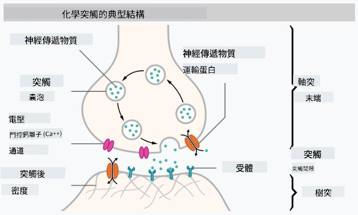

<!--
CO_OP_TRANSLATOR_METADATA:
{
  "original_hash": "1c6b8c7c1778a35fc1139b7f2aecb7b3",
  "translation_date": "2025-08-26T10:22:11+00:00",
  "source_file": "lessons/3-NeuralNetworks/README.md",
  "language_code": "mo"
}
-->
# 神經網路簡介

如我們在介紹中所討論的，實現智能的一種方法是訓練一個**電腦模型**或一個**人工大腦**。自20世紀中期以來，研究人員嘗試了各種數學模型，直到最近，這一方向取得了巨大的成功。這些模仿大腦的數學模型被稱為**神經網路**。

> 有時神經網路被稱為*人工神經網路*（Artificial Neural Networks, ANNs），以表明我們討論的是模型，而非真實的神經網路。

## 機器學習

神經網路屬於一個更大的學科，稱為**機器學習**，其目標是利用數據訓練能夠解決問題的電腦模型。機器學習是人工智能的重要組成部分，但我們在這份課程中不會涵蓋傳統的機器學習。

> 請參考我們的獨立課程 **[機器學習入門](http://github.com/microsoft/ml-for-beginners)**，以了解更多關於傳統機器學習的內容。

在機器學習中，我們假設擁有一些範例數據集 **X**，以及對應的輸出值 **Y**。範例通常是由**特徵**組成的N維向量，而輸出則被稱為**標籤**。

我們將探討兩種最常見的機器學習問題：

* **分類**：我們需要將輸入對象分類到兩個或多個類別中。
* **回歸**：我們需要為每個輸入樣本預測一個數值。

> 當以張量表示輸入和輸出時，輸入數據集是一個大小為 M×N 的矩陣，其中 M 是樣本數，N 是特徵數。輸出標籤 Y 是大小為 M 的向量。

在這份課程中，我們將專注於神經網路模型。

## 神經元的模型

從生物學中我們知道，大腦由神經細胞組成，每個神經細胞有多個“輸入”（軸突）和一個輸出（樹突）。軸突和樹突可以傳導電信號，而軸突與樹突之間的連接可以表現出不同程度的導電性（由神經遞質控制）。

 | 
----|----
真實神經元 *（[圖片](https://en.wikipedia.org/wiki/Synapse#/media/File:SynapseSchematic_lines.svg) 來自維基百科）* | 人工神經元 *（圖片由作者提供）*

因此，神經元的最簡單數學模型包含若干輸入 X1, ..., XN 和一個輸出 Y，以及一系列權重 W1, ..., WN。輸出計算公式為：

其中 f 是某種非線性的**激活函數**。

> 最早的神經元模型在 Warren McCullock 和 Walter Pitts 於1943年發表的經典論文 [A logical calculus of the ideas immanent in nervous activity](https://www.cs.cmu.edu/~./epxing/Class/10715/reading/McCulloch.and.Pitts.pdf) 中被描述。Donald Hebb 在他的著作《[行為的組織：一種神經心理學理論](https://books.google.com/books?id=VNetYrB8EBoC)》中提出了訓練這些網路的方法。

## 本節內容

在本節中，我們將學習以下內容：
* [感知器](03-Perceptron/README.md)：最早的二分類神經網路模型之一
* [多層網路](04-OwnFramework/README.md) 及其配套筆記本 [如何構建我們自己的框架](../../../../lessons/3-NeuralNetworks/04-OwnFramework/OwnFramework.ipynb)
* [神經網路框架](05-Frameworks/README.md)，包括以下筆記本：[PyTorch](../../../../lessons/3-NeuralNetworks/05-Frameworks/IntroPyTorch.ipynb) 和 [Keras/Tensorflow](../../../../lessons/3-NeuralNetworks/05-Frameworks/IntroKerasTF.ipynb)
* [過擬合](../../../../lessons/3-NeuralNetworks/05-Frameworks)

**免責聲明**：  
本文檔已使用 AI 翻譯服務 [Co-op Translator](https://github.com/Azure/co-op-translator) 進行翻譯。我們致力於提供準確的翻譯，但請注意，自動翻譯可能包含錯誤或不準確之處。應以原始語言的文件作為權威來源。對於關鍵信息，建議尋求專業人工翻譯。我們對因使用此翻譯而引起的任何誤解或錯誤解讀概不負責。