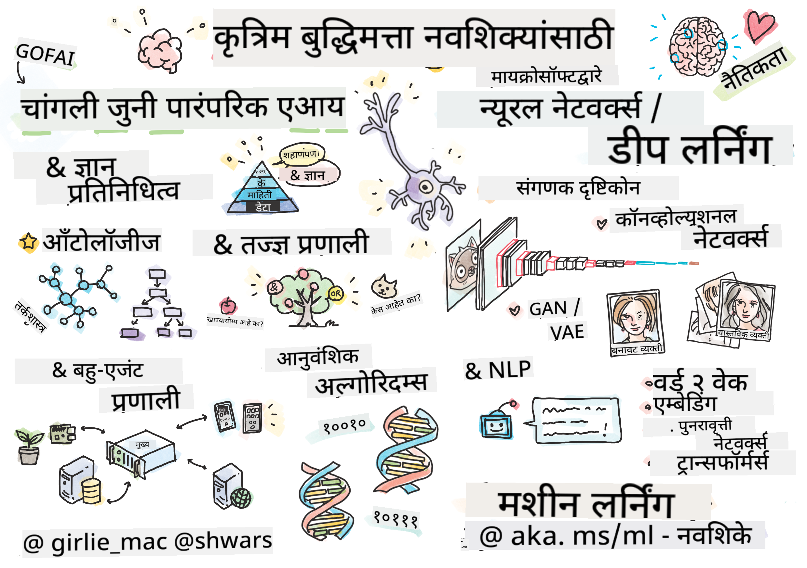

<!--
CO_OP_TRANSLATOR_METADATA:
{
  "original_hash": "0dc6311637b811abb415a936669d7e76",
  "translation_date": "2026-01-05T15:06:43+00:00",
  "source_file": "README.md",
  "language_code": "mr"
}
-->
[](https://github.com/microsoft/AI-For-Beginners/blob/main/LICENSE)
[](https://GitHub.com/microsoft/AI-For-Beginners/graphs/contributors/)
[](https://GitHub.com/microsoft/AI-For-Beginners/issues/)
[](https://GitHub.com/microsoft/AI-For-Beginners/pulls/)
[](http://makeapullrequest.com)

[](https://GitHub.com/microsoft/AI-For-Beginners/watchers/)
[](https://GitHub.com/microsoft/AI-For-Beginners/network/)
[](https://GitHub.com/microsoft/AI-For-Beginners/stargazers/)
[](https://mybinder.org/v2/gh/microsoft/ai-for-beginners/HEAD)
[](https://gitter.im/Microsoft/ai-for-beginners?utm_source=badge&utm_medium=badge&utm_campaign=pr-badge)

[](https://discord.gg/nTYy5BXMWG)

# नवशिक्यांसाठी कृत्रिम बुद्धिमत्ता - एक अभ्यासक्रम

||
|:---:|
| नवशिक्यांसाठी कृत्रिम बुद्धिमत्ता - _स्केचनोट [@girlie_mac](https://twitter.com/girlie_mac) कडून_ |

आमच्या १२ आठवड्यांच्या, २४ धडा असलेल्या अभ्यासक्रमासह **कृत्रिम बुद्धिमत्ता** (AI) चा अभ्यास करा! यामध्ये व्यावहारिक धडे, क्विझ आणि लॅब आहेत. हा अभ्यासक्रम नवशिक्यांसाठी अनुकूल आहे आणि त्यात TensorFlow आणि PyTorch सारखी साधने तसेच AI मधील नैतिकता या विषयांचाही समावेश आहे.

### 🌐 बहुभाषिक समर्थन

#### GitHub Action द्वारे समर्थित (स्वतः चालणारे आणि नेहमी अद्ययावत)

<!-- CO-OP TRANSLATOR LANGUAGES TABLE START -->
[अरेबिक](../ar/README.md) | [बंगाली](../bn/README.md) | [बल्गेरियन](../bg/README.md) | [म्यानमार (बर्मीस)](../my/README.md) | [चिनी (सोपे)](../zh/README.md) | [चिनी (परंपरागत, हॉंग कॉंग)](../hk/README.md) | [चिनी (परंपरागत, मकाऊ)](../mo/README.md) | [चिनी (परंपरागत, तैवान)](../tw/README.md) | [क्रोएशियन](../hr/README.md) | [झेक](../cs/README.md) | [डॅनिश](../da/README.md) | [डच](../nl/README.md) | [एस्टोनियन](../et/README.md) | [फिन्निश](../fi/README.md) | [फ्रेंच](../fr/README.md) | [जर्मन](../de/README.md) | [ग्रीक](../el/README.md) | [हिब्रू](../he/README.md) | [हिंदी](../hi/README.md) | [हंगेरियन](../hu/README.md) | [इंडोनेशियन](../id/README.md) | [इटालियन](../it/README.md) | [जपानी](../ja/README.md) | [कन्नडा](../kn/README.md) | [कोरियन](../ko/README.md) | [लिथुआनियन](../lt/README.md) | [मलय](../ms/README.md) | [मलयाळम](../ml/README.md) | [मराठी](./README.md) | [नेपाली](../ne/README.md) | [नायजेरियन पिडगिन](../pcm/README.md) | [नॉर्वेजियन](../no/README.md) | [फारसी (पर्शियन)](../fa/README.md) | [पोलिश](../pl/README.md) | [पोर्तुगीज (ब्राझील)](../br/README.md) | [पोर्तुगीज (पोर्तुगाल)](../pt/README.md) | [पंजाबी (गुरमुखी)](../pa/README.md) | [रोमानियन](../ro/README.md) | [रशियन](../ru/README.md) | [सर्बियन (सिरिलिक)](../sr/README.md) | [स्लोव्हाक](../sk/README.md) | [स्लोव्हेनियन](../sl/README.md) | [स्पॅनिश](../es/README.md) | [स्वाहिली](../sw/README.md) | [स्वीडिश](../sv/README.md) | [टागालॉग (फिलिपिनो)](../tl/README.md) | [तमिळ](../ta/README.md) | [तेलुगू](../te/README.md) | [थाई](../th/README.md) | [तुर्की](../tr/README.md) | [उक्रेनियन](../uk/README.md) | [उर्दू](../ur/README.md) | [व्हिएतनामी](../vi/README.md)

> **स्थानिकरित्या क्लोन करायला प्राधान्य देता?**

> या रिपॉझिटरीमध्ये ५०+ भाषांमध्ये अनुवादांचा समावेश आहे ज्यामुळे डाउनलोड आकार मोठा होतो. अनुवादांशिवाय क्लोन करण्यासाठी sparse checkout वापरा:
> ```bash
> git clone --filter=blob:none --sparse https://github.com/microsoft/AI-For-Beginners.git
> cd AI-For-Beginners
> git sparse-checkout set --no-cone '/*' '!translations' '!translated_images'
> ```
> यामुळे आपल्याला अभ्यासक्रम पूर्ण करण्यासाठी आवश्यक सर्व काही मिळेल आणि डाउनलोड जास्त जलद होईल.
<!-- CO-OP TRANSLATOR LANGUAGES TABLE END -->

**जर आपणास अतिरिक्त भाषांमध्ये अनुवाद हवा असल्यास, ते [इथे](https://github.com/Azure/co-op-translator/blob/main/getting_started/supported-languages.md) दिलेले आहेत**

## समुदायात सहभागी व्हा
[](https://discord.gg/nTYy5BXMWG)

## आपण काय शिकाल

**[अभ्यासक्रमाचा माईंडमॅप](http://soshnikov.com/courses/ai-for-beginners/mindmap.html)**

या अभ्यासक्रमात, आपण शिकाल:

* कृत्रिम बुद्धिमत्तेचे वेगवेगळे दृष्टिकोन, ज्यात "चांगल्या जुन्या" सांकेतिक दृष्टिकोनासह **ज्ञानाचे सादरीकरण** आणि तर्कशास्त्र ([GOFAI](https://en.wikipedia.org/wiki/Symbolic_artificial_intelligence)) समाविष्ट आहे.
* **न्यूरल नेटवर्क्स** आणि **डीप लर्निंग**, जे आधुनिक AI च्या मूलभूत घटक आहेत. आपण या महत्त्वाच्या विषयांचे संकल्पना दोन प्रसिध्द फ्रेमवर्क्स मध्ये कोड वापरून समजावून सांगू - [TensorFlow](http://Tensorflow.org) आणि [PyTorch](http://pytorch.org).
* प्रतिमा आणि मजकूरावर काम करण्यासाठी **न्यूरल आर्किटेक्चर्स**. आम्ही अलीकडील मॉडेल्सकडे लक्ष देऊ, पण सध्याच्या अत्याधुनिकीवर काहीसा अपूर्ण असू शकतो.
* कमी लोकप्रिय AI दृष्टिकोन, जसे की **जेनिटिक अल्गोरिदम्स** आणि **मल्टि-एजंट सिस्टीम्स**.

या अभ्यासक्रमात आपण जे समाविष्ट करणार नाही:

> [या अभ्यासक्रमासाठीच्या सर्व अतिरिक्त स्रोतांसाठी आमच्या Microsoft Learn संग्रहामध्ये पहा](https://learn.microsoft.com/en-us/collections/7w28iy2xrqzdj0?WT.mc_id=academic-77998-bethanycheum)

* **AI in Business** च्या बिझनेस केस. आपण Microsoft Learn वरील [Introduction to AI for business users](https://docs.microsoft.com/learn/paths/introduction-ai-for-business-users/?WT.mc_id=academic-77998-bethanycheum) हा शिकण्याचा मार्ग किंवा [AI Business School](https://www.microsoft.com/ai/ai-business-school/?WT.mc_id=academic-77998-bethanycheum), जो [INSEAD](https://www.insead.edu/) सहकार्याने विकसित झाला आहे, घेण्याचा विचार करू शकता.
* **क्लासिक मशीन लर्निंग**, जे आमच्या [Machine Learning for Beginners Curriculum](http://github.com/Microsoft/ML-for-Beginners) मध्ये चांगल्या प्रकारे वर्णन केलेले आहे.
* व्यावहारिक AI अनुप्रयोग जे **[Cognitive Services](https://azure.microsoft.com/services/cognitive-services/?WT.mc_id=academic-77998-bethanycheum)** वापरून तयार केलेले आहेत. यासाठी, आम्ही Microsoft Learn चे पुढील मॉड्यूल वापरण्याची शिफारस करतो: [दृष्टी](https://docs.microsoft.com/learn/paths/create-computer-vision-solutions-azure-cognitive-services/?WT.mc_id=academic-77998-bethanycheum), [नैसर्गिक भाषा प्रक्रिया](https://docs.microsoft.com/learn/paths/explore-natural-language-processing/?WT.mc_id=academic-77998-bethanycheum), **[Azure OpenAI सेवा सह जनरेटिव्ह AI](https://learn.microsoft.com/en-us/training/paths/develop-ai-solutions-azure-openai/?WT.mc_id=academic-77998-bethanycheum)** आणि इतर.
* विशिष्ट ML **क्लाऊड फ्रेमवर्क्स**, जसे की [Azure Machine Learning](https://azure.microsoft.com/services/machine-learning/?WT.mc_id=academic-77998-bethanycheum), [Microsoft Fabric](https://learn.microsoft.com/en-us/training/paths/get-started-fabric/?WT.mc_id=academic-77998-bethanycheum), किंवा [Azure Databricks](https://docs.microsoft.com/learn/paths/data-engineer-azure-databricks?WT.mc_id=academic-77998-bethanycheum). [Build and operate machine learning solutions with Azure Machine Learning](https://docs.microsoft.com/learn/paths/build-ai-solutions-with-azure-ml-service/?WT.mc_id=academic-77998-bethanycheum) आणि [Build and Operate Machine Learning Solutions with Azure Databricks](https://docs.microsoft.com/learn/paths/build-operate-machine-learning-solutions-azure-databricks/?WT.mc_id=academic-77998-bethanycheum) शिकण्याचे मार्ग वापरण्यावर विचार करा.
* **संवादी AI** आणि **चॅट बॉट्स**. एक वेगळा [Create conversational AI solutions](https://docs.microsoft.com/learn/paths/create-conversational-ai-solutions/?WT.mc_id=academic-77998-bethanycheum) शिकण्याचा मार्ग आहे, आणि अधिक तपशीलांसाठी आपण [हा ब्लॉग पोस्ट](https://soshnikov.com/azure/hello-bot-conversational-ai-on-microsoft-platform/) देखील पहू शकता.
* डीप लर्निंगच्या मागील **सखोल गणित**. यासाठी, आम्ही Ian Goodfellow, Yoshua Bengio आणि Aaron Courville यांनी लिहिलेला [Deep Learning](https://www.amazon.com/Deep-Learning-Adaptive-Computation-Machine/dp/0262035618) किताब आणि [https://www.deeplearningbook.org/](https://www.deeplearningbook.org/) या वेबसाइटची शिफारस करू.

_क्लाउडमधील AI_ विषयांमध्ये सौम्य ओळखीकरिता आपण [Get started with artificial intelligence on Azure](https://docs.microsoft.com/learn/paths/get-started-with-artificial-intelligence-on-azure/?WT.mc_id=academic-77998-bethanycheum) शिकण्याचा मार्ग घेऊ शकता.

# सामग्री

|     |                                                                 धड्याचा दुवा                                                                  |                                           PyTorch/Keras/TensorFlow                                          | लॅब                                                            |
| :-: | :------------------------------------------------------------------------------------------------------------------------------------------: | :---------------------------------------------------------------------------------------------: | ------------------------------------------------------------------------------ |
| 0  |                                 [कोर्स सेटअप](./lessons/0-course-setup/setup.md)                                 |                      [आपले विकास वातावरण सेट करा](./lessons/0-course-setup/how-to-run.md)                       |   |
| I  |               [**AI ची ओळख**](./lessons/1-Intro/README.md)      | | |
| 01  |       [AI चे परिचय आणि इतिहास](./lessons/1-Intro/README.md)       |           -                            | -  |
| II |              **सांकेतिक AI**              |
| 02  |       [ज्ञान सादरीकरण आणि तज्ञ प्रणाली](./lessons/2-Symbolic/README.md)       |            [तज्ञ प्रणाली](./lessons/2-Symbolic/Animals.ipynb) /  [ओन्टोलॉजी](./lessons/2-Symbolic/FamilyOntology.ipynb) /[संकल्पना ग्राफ](./lessons/2-Symbolic/MSConceptGraph.ipynb)                             |  |
| III |                        [**न्यूरल नेटवर्कची ओळख**](./lessons/3-NeuralNetworks/README.md) |||
| 03  |                [पर्सेप्ट्रॉन](./lessons/3-NeuralNetworks/03-Perceptron/README.md)                 |                       [नोटबुक](./lessons/3-NeuralNetworks/03-Perceptron/Perceptron.ipynb)                      | [प्रयोगशाळा](./lessons/3-NeuralNetworks/03-Perceptron/lab/README.md) |
| 04  |                   [मल्टी-लेयर्ड पर्सेप्ट्रॉन आणि आपल्या स्वतःच्या फ्रेमवर्कची निर्मिती](./lessons/3-NeuralNetworks/04-OwnFramework/README.md)                   |        [नोटबुक](./lessons/3-NeuralNetworks/04-OwnFramework/OwnFramework.ipynb)        | [प्रयोगशाळा](./lessons/3-NeuralNetworks/04-OwnFramework/lab/README.md) |
| 05  |            [फ्रेमवर्क्सची ओळख (PyTorch/TensorFlow) आणि ओव्हरफिटिंग](./lessons/3-NeuralNetworks/05-Frameworks/README.md)             |           [PyTorch](./lessons/3-NeuralNetworks/05-Frameworks/IntroPyTorch.ipynb) / [Keras](./lessons/3-NeuralNetworks/05-Frameworks/IntroKeras.ipynb) / [TensorFlow](./lessons/3-NeuralNetworks/05-Frameworks/IntroKerasTF.ipynb)             | [प्रयोगशाळा](./lessons/3-NeuralNetworks/05-Frameworks/lab/README.md) |
| IV  |            [**कंप्यूटर व्हिजन**](./lessons/4-ComputerVision/README.md)             | [PyTorch](https://docs.microsoft.com/learn/modules/intro-computer-vision-pytorch/?WT.mc_id=academic-77998-cacaste) / [TensorFlow](https://docs.microsoft.com/learn/modules/intro-computer-vision-TensorFlow/?WT.mc_id=academic-77998-cacaste)| [मायक्रोसॉफ्ट अजूरवर कंप्यूटर व्हिजन एक्सप्लोर करा](https://learn.microsoft.com/en-us/collections/7w28iy2xrqzdj0?WT.mc_id=academic-77998-bethanycheum) |
| 06  |            [कंप्यूटर व्हिजनची ओळख. OpenCV](./lessons/4-ComputerVision/06-IntroCV/README.md)             |           [नोटबुक](./lessons/4-ComputerVision/06-IntroCV/OpenCV.ipynb)         | [प्रयोगशाळा](./lessons/4-ComputerVision/06-IntroCV/lab/README.md) |
| 07  |            [कन्व्होल्यूशनल न्यूरल नेटवर्क्स](./lessons/4-ComputerVision/07-ConvNets/README.md) &  [CNN आर्किटेक्चर्स](./lessons/4-ComputerVision/07-ConvNets/CNN_Architectures.md)             |           [PyTorch](./lessons/4-ComputerVision/07-ConvNets/ConvNetsPyTorch.ipynb) /[TensorFlow](./lessons/4-ComputerVision/07-ConvNets/ConvNetsTF.ipynb)             | [प्रयोगशाळा](./lessons/4-ComputerVision/07-ConvNets/lab/README.md) |
| 08  |            [पूर्व-प्रशिक्षित नेटवर्क्स आणि ट्रान्सफर लर्निंग](./lessons/4-ComputerVision/08-TransferLearning/README.md) आणि [प्रशिक्षण तंत्रे](./lessons/4-ComputerVision/08-TransferLearning/TrainingTricks.md)             |           [PyTorch](./lessons/4-ComputerVision/08-TransferLearning/TransferLearningPyTorch.ipynb) / [TensorFlow](./lessons/3-NeuralNetworks/05-Frameworks/IntroKerasTF.ipynb)             | [प्रयोगशाळा](./lessons/4-ComputerVision/08-TransferLearning/lab/README.md) |
| 09  |            [ऑटोएन्कोडर्स आणि VAEs](./lessons/4-ComputerVision/09-Autoencoders/README.md)             |           [PyTorch](./lessons/4-ComputerVision/09-Autoencoders/AutoEncodersPyTorch.ipynb) / [TensorFlow](./lessons/4-ComputerVision/09-Autoencoders/AutoencodersTF.ipynb)             |  |
| 10  |            [जनरेटिव्ह अॅडव्हर्सेरियल नेटवर्क्स आणि आर्टिस्टिक स्टाइल ट्रान्सफर](./lessons/4-ComputerVision/10-GANs/README.md)             |           [PyTorch](./lessons/4-ComputerVision/10-GANs/GANPyTorch.ipynb) / [TensorFlow](./lessons/4-ComputerVision/10-GANs/GANTF.ipynb)             |  |
| 11  |            [ऑब्जेक्ट डिटेक्शन](./lessons/4-ComputerVision/11-ObjectDetection/README.md)             |         [TensorFlow](./lessons/4-ComputerVision/11-ObjectDetection/ObjectDetection.ipynb)             | [प्रयोगशाळा](./lessons/4-ComputerVision/11-ObjectDetection/lab/README.md) |
| 12  |            [सिमँटिक सेगमेंटेशन. U-Net](./lessons/4-ComputerVision/12-Segmentation/README.md)             |           [PyTorch](./lessons/4-ComputerVision/12-Segmentation/SemanticSegmentationPytorch.ipynb) / [TensorFlow](./lessons/4-ComputerVision/12-Segmentation/SemanticSegmentationTF.ipynb)             |  |
| V  |            [**नॅचरल लँग्वेज प्रोसेसिंग**](./lessons/5-NLP/README.md)             | [PyTorch](https://docs.microsoft.com/learn/modules/intro-natural-language-processing-pytorch/?WT.mc_id=academic-77998-cacaste) /[TensorFlow](https://docs.microsoft.com/learn/modules/intro-natural-language-processing-TensorFlow/?WT.mc_id=academic-77998-cacaste) | [मायक्रोसॉफ्ट अजूरवर नॅचरल लँग्वेज प्रोसेसिंग एक्सप्लोर करा](https://learn.microsoft.com/en-us/collections/7w28iy2xrqzdj0?WT.mc_id=academic-77998-bethanycheum)|
| 13  |            [टेक्स्ट रिप्रेझेंटेशन. बो/TF-IDF](./lessons/5-NLP/13-TextRep/README.md)             |           [PyTorch](https://github.com/microsoft/AI-For-Beginners/blob/main/lessons/5-NLP/13-TextRep/TextRepresentationPyTorch.ipynb) / [TensorFlow](https://github.com/microsoft/AI-For-Beginners/blob/main/lessons/5-NLP/13-TextRep/TextRepresentationTF.ipynb)             | |
| 14  |            [सिमँटिक वर्ड एम्बेडिंग्ज. Word2Vec आणि GloVe](./lessons/5-NLP/14-Embeddings/README.md)             |           [PyTorch](https://github.com/microsoft/AI-For-Beginners/blob/main/lessons/5-NLP/14-Embeddings/EmbeddingsPyTorch.ipynb) / [TensorFlow](https://github.com/microsoft/AI-For-Beginners/blob/main/lessons/5-NLP/14-Embeddings/EmbeddingsTF.ipynb)             |  |
| 15  |            [लँग्वेज मॉडेलिंग. तुमचे स्वतःचे एम्बेडिंग्ज प्रशिक्षण](./lessons/5-NLP/15-LanguageModeling/README.md)             |           [PyTorch](https://github.com/microsoft/AI-For-Beginners/blob/main/lessons/5-NLP/15-LanguageModeling/CBoW-PyTorch.ipynb) / [TensorFlow](https://github.com/microsoft/AI-For-Beginners/blob/main/lessons/5-NLP/15-LanguageModeling/CBoW-TF.ipynb)             | [प्रयोगशाळा](./lessons/5-NLP/15-LanguageModeling/lab/README.md) |
| 16  |            [रिकरंट न्यूरल नेटवर्क्स](./lessons/5-NLP/16-RNN/README.md)             |           [PyTorch](https://github.com/microsoft/AI-For-Beginners/blob/main/lessons/5-NLP/16-RNN/RNNPyTorch.ipynb) / [TensorFlow](https://github.com/microsoft/AI-For-Beginners/blob/main/lessons/5-NLP/16-RNN/RNNTF.ipynb)             |  |
| 17  |            [जनरेटिव्ह रिक्ररंट नेटवर्क्स](./lessons/5-NLP/17-GenerativeNetworks/README.md)             |           [PyTorch](https://github.com/microsoft/AI-For-Beginners/blob/main/lessons/5-NLP/17-GenerativeNetworks/GenerativePyTorch.ipynb) / [TensorFlow](https://github.com/microsoft/AI-For-Beginners/blob/main/lessons/5-NLP/17-GenerativeNetworks/GenerativeTF.ipynb)             | [प्रयोगशाळा](./lessons/5-NLP/17-GenerativeNetworks/lab/README.md) |
| 18  |            [ट्रान्सफॉर्मर्स. BERT.](./lessons/5-NLP/18-Transformers/README.md)             |           [PyTorch](https://github.com/microsoft/AI-For-Beginners/blob/main/lessons/5-NLP/18-Transformers/TransformersPyTorch.ipynb) /[TensorFlow](https://github.com/microsoft/AI-For-Beginners/blob/main/lessons/5-NLP/18-Transformers/TransformersTF.ipynb)             |  |
| 19  |            [नामित घटक ओळख](./lessons/5-NLP/19-NER/README.md)             |           [TensorFlow](https://microsoft.github.io/AI-For-Beginners/lessons/5-NLP/19-NER/NER-TF.ipynb)             | [प्रयोगशाळा](./lessons/5-NLP/19-NER/lab/README.md) |
| 20  |            [मोठे लँग्वेज मॉडेल्स, प्रॉम्प्ट प्रोग्रामिंग आणि फ्यू-शॉट टास्क्स](./lessons/5-NLP/20-LangModels/README.md)             |           [PyTorch](https://microsoft.github.io/AI-For-Beginners/lessons/5-NLP/20-LangModels/GPT-PyTorch.ipynb) | |
| VI |            **इतर AI तंत्रज्ञान** || |
| 21  |            [जैविक अल्गोरिदम्स](./lessons/6-Other/21-GeneticAlgorithms/README.md)             |           [नोटबुक](./lessons/6-Other/21-GeneticAlgorithms/Genetic.ipynb) | |
| 22  |            [डीप रिइन्फोर्समेंट लर्निंग](./lessons/6-Other/22-DeepRL/README.md)             |           [PyTorch](./lessons/6-Other/22-DeepRL/CartPole-RL-PyTorch.ipynb) /[TensorFlow](./lessons/6-Other/22-DeepRL/CartPole-RL-TF.ipynb)             | [प्रयोगशाळा](./lessons/6-Other/22-DeepRL/lab/README.md) |
| 23  |            [मल्टी-एजंट सिस्टम्स](./lessons/6-Other/23-MultiagentSystems/README.md)             |  | |
| VII |            **AI नैतिकता** | | |
| 24  |            [AI नैतिकता आणि जबाबदार AI](./lessons/7-Ethics/README.md)             |           [Microsoft Learn: जबाबदार AI तत्त्वे](https://docs.microsoft.com/learn/paths/responsible-ai-business-principles/?WT.mc_id=academic-77998-cacaste) | |
| IX  |            **अतिरिक्त** | | |
| 25  |            [मल्टी-मॉडाल नेटवर्क्स, CLIP आणि VQGAN](./lessons/X-Extras/X1-MultiModal/README.md)             |           [नोटबुक](./lessons/X-Extras/X1-MultiModal/Clip.ipynb)    | |

## प्रत्येक धड्यात काय असते

* पूर्ववाचन साहित्य
* अंमलात आणता येणारे जुुपिटर नोटबुक्स, जे सहसा फ्रेमवर्कसाठी खास असतात (**PyTorch** किंवा **TensorFlow**). अंमलात आणता येणाऱ्या नोटबुकमध्ये भरपूर सैद्धांतिक साहित्य देखील असते, त्यामुळे विषय समजून घेण्यासाठी तुम्हाला कमीतकमी एक आवृत्ती पाहणे आवश्यक आहे (PyTorch किंवा TensorFlow पैकी कोणतीही).
* काही विषयांसाठी उपलब्ध **प्रयोगशाळा**, ज्यात तुम्हाला तुम्ही शिकलेले साहित्य एखाद्या विशिष्ट समस्येमध्ये वापरून पाहण्याची संधी दिली जाते.
* काही विभागांमध्ये संबंधित विषयांचा समावेश करणाऱ्या [**MS Learn**](https://learn.microsoft.com/en-us/collections/7w28iy2xrqzdj0?WT.mc_id=academic-77998-bethanycheum) मॉड्युल्ससाठी दुवे असतात.

## सुरू करताना

### 🎯 AI मध्ये नवीन आहात? येथे सुरू करा!

जर तुम्ही AI मध्ये पूर्णपणे नवीन असाल आणि पटकन, व्यवहार्य उदाहरणे पाहू इच्छित असाल, तर आमचे [**सोपे उदाहरणे**](./examples/README.md) पाहा! त्यामध्ये समाविष्ट आहे:

- 🌟 **हॅलो AI वर्ल्ड** - तुमचा पहिला AI प्रोग्राम (पॅटर्न ओळख)
- 🧠 **साधे न्यूरल नेटवर्क** - न्यूरल नेटवर्क शून्यातून तयार करा  
- 🖼️ **इमेज क्लासिफायर** - तपशीलवार टिप्पण्यांसह प्रतिमा वर्गीकरण
- 💬 **टेक्स्ट सेन्टिमेंट** - सकारात्मक/नकारात्मक मजकूराचे विश्लेषण करा

हे उदाहरणे तुम्हाला पूर्ण अभ्यासक्रमात डोकावण्यापूर्वी AI संकल्पना समजून घेण्यास मदत करण्यासाठी डिझाइन केली आहेत.

### 📚 पूर्ण अभ्यासक्रम सेटअप

- आम्ही तुमच्या विकास पर्यावरणाची सेटअप करण्यात मदत करण्यासाठी [सेटअप लेसन](./lessons/0-course-setup/setup.md) तयार केली आहे. - शिक्षकांसाठी, आम्ही तुमच्यासाठी एक [अभ्यासक्रम सेटअप लेसन](./lessons/0-course-setup/for-teachers.md) देखील तयार केली आहे!
- कसे [VSCode किंवा Codepace मध्ये कोड चालवायचा](./lessons/0-course-setup/how-to-run.md)

हे पावले अनुसरा:

रिपॉझिटरी फोर्क करा: या पानाच्या वरच्या उजव्या कोपऱ्यातील "Fork" बटणावर क्लिक करा.

रिपॉझिटरी क्लोन करा: `git clone https://github.com/microsoft/AI-For-Beginners.git`

नंतर आरामात शोधण्यासाठी या रेपोला स्टार (🌟) देण्यास विसरू नका.

## इतर शिक्षार्थ्यांना भेटा

हा अभ्यासक्रम घेणाऱ्या इतर शिकणाऱ्यांशी भेटा आणि नेटवर्किंग करा आमच्या [अधिकृत AI डिस्कॉर्ड सर्व्हर](https://aka.ms/genai-discord?WT.mc_id=academic-105485-bethanycheum) मध्ये सहभागी होऊन आणि समर्थन मिळवा.

जर तुम्हाला उत्पादनाबद्दल अभिप्राय किंवा प्रश्न असतील तर आमच्या [Azure AI Foundry Developer Forum](https://aka.ms/foundry/forum) येथे भेट द्या.

## क्विझेस

> **क्विझेसबद्दल एक टीप**: सर्व क्विझेस `etc\quiz-app` मधील Quiz-app फोल्डरमध्ये आहेत, किंवा [ऑनलाइन येथे](https://ff-quizzes.netlify.app/) उपलब्ध आहेत. त्या शिकवणींमध्ये लिंक केल्या आहेत, क्विझ अॅप स्थानिकपणे चालवता येतो किंवा Azure वर तैनात करता येतो; `quiz-app` फोल्डरमधील सूचना पाळा. त्या हळूहळू स्थानिकिकृत केल्या जात आहेत.

## मदत हवी आहे

तुमच्याकडे सुचना आहेत का किंवा स्पेलिंग किंवा कोड त्रुटी सापडल्या का? समस्या नोंदवा किंवा पुल रिक्वेस्ट तयार करा.

## विशेष आभार

* **✍️ मुख्य लेखक:** [Dmitry Soshnikov](http://soshnikov.com), PhD
* **🔥 संपादक:** [Jen Looper](https://twitter.com/jenlooper), PhD
* **🎨 स्केचनोट चित्रकार:** [Tomomi Imura](https://twitter.com/girlie_mac)
* **✅ क्विझ निर्माता:** [Lateefah Bello](https://github.com/CinnamonXI), [MLSA](https://studentambassadors.microsoft.com/)
* **🙏 मुख्य योगदानकर्ते:** [Evgenii Pishchik](https://github.com/Pe4enIks)

## इतर अभ्यासक्रम

आमची टीम इतर अभ्यासक्रम तयार करते! पाहा:

<!-- CO-OP TRANSLATOR OTHER COURSES START -->
### LangChain
[](https://aka.ms/langchain4j-for-beginners)
[](https://aka.ms/langchainjs-for-beginners?WT.mc_id=m365-94501-dwahlin)

---

### Azure / Edge / MCP / Agents
[](https://github.com/microsoft/AZD-for-beginners?WT.mc_id=academic-105485-koreyst)
[](https://github.com/microsoft/edgeai-for-beginners?WT.mc_id=academic-105485-koreyst)
[](https://github.com/microsoft/mcp-for-beginners?WT.mc_id=academic-105485-koreyst)
[](https://github.com/microsoft/ai-agents-for-beginners?WT.mc_id=academic-105485-koreyst)

---
 
### Generative AI Series
[](https://github.com/microsoft/generative-ai-for-beginners?WT.mc_id=academic-105485-koreyst)
[-9333EA?style=for-the-badge&labelColor=E5E7EB&color=9333EA)](https://github.com/microsoft/Generative-AI-for-beginners-dotnet?WT.mc_id=academic-105485-koreyst)
[-C084FC?style=for-the-badge&labelColor=E5E7EB&color=C084FC)](https://github.com/microsoft/generative-ai-for-beginners-java?WT.mc_id=academic-105485-koreyst)
[-E879F9?style=for-the-badge&labelColor=E5E7EB&color=E879F9)](https://github.com/microsoft/generative-ai-with-javascript?WT.mc_id=academic-105485-koreyst)

---
 
### Core Learning
[](https://aka.ms/ml-beginners?WT.mc_id=academic-105485-koreyst)
[](https://aka.ms/datascience-beginners?WT.mc_id=academic-105485-koreyst)
[](https://aka.ms/ai-beginners?WT.mc_id=academic-105485-koreyst)
[](https://github.com/microsoft/Security-101?WT.mc_id=academic-96948-sayoung)
[](https://aka.ms/webdev-beginners?WT.mc_id=academic-105485-koreyst)
[](https://aka.ms/iot-beginners?WT.mc_id=academic-105485-koreyst)
[](https://github.com/microsoft/xr-development-for-beginners?WT.mc_id=academic-105485-koreyst)

---
 
### Copilot Series
[](https://aka.ms/GitHubCopilotAI?WT.mc_id=academic-105485-koreyst)
[](https://github.com/microsoft/mastering-github-copilot-for-dotnet-csharp-developers?WT.mc_id=academic-105485-koreyst)
[](https://github.com/microsoft/CopilotAdventures?WT.mc_id=academic-105485-koreyst)
<!-- CO-OP TRANSLATOR OTHER COURSES END -->

## मदत कशी घ्यावी

जर तुम्हाला अडकले किंवा AI अ‍ॅप्स तयार करण्याबाबत कोणतेही प्रश्न असतील, तर सहअभ्यासक आणि अनुभवी विकासकांसोबत MCP बद्दल चर्चा करण्यासाठी या. हे एक सहायक समुदाय आहे जिथे प्रश्न विचारले जाऊ शकतात आणि ज्ञान मोकळेपणाने सामायिक केले जाते.

[](https://discord.gg/nTYy5BXMWG)

जर उत्पादनाबद्दल अभिप्राय किंवा त्रुटी असतील तर येथे भेट द्या:

[](https://aka.ms/foundry/forum)

---

<!-- CO-OP TRANSLATOR DISCLAIMER START -->
**स्वत:ची जबाबदारी**:  
हा दस्तऐवज AI अनुवाद सेवा [Co-op Translator](https://github.com/Azure/co-op-translator) चा वापर करून अनुवादित केला गेला आहे. आम्ही अचूकतेसाठी प्रयत्नशील असलो तरी, कृपया लक्षात घ्या की स्वयंचलित अनुवादांमध्ये चुका किंवा अचूकतेचे त्रुटी असू शकतात. मूळ दस्तऐवज त्याच्या स्थानिक भाषेत अधिकृत स्रोत मानावा. महत्त्वाच्या माहितीकरिता व्यावसायिक मानवी अनुवाद करणे शिफारसीय आहे. या अनुवादाच्या वापरामुळे झालेल्या कोणत्याही गैरसमजुती किंवा चुकीच्या अर्थग्रहणासाठी आम्ही जबाबदार नाही.
<!-- CO-OP TRANSLATOR DISCLAIMER END -->