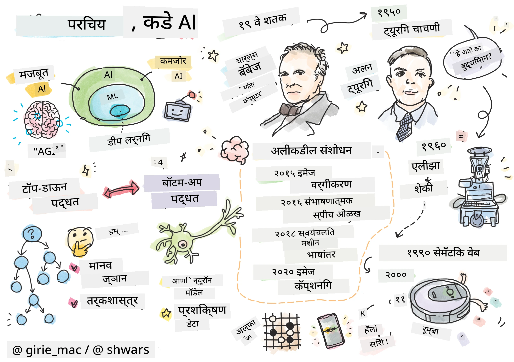
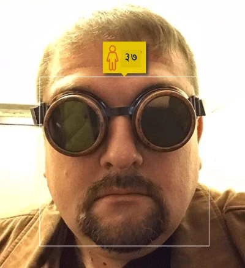
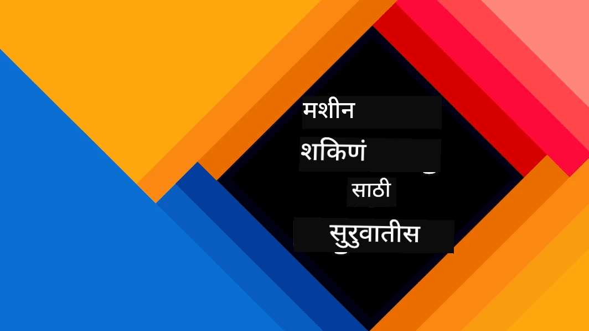
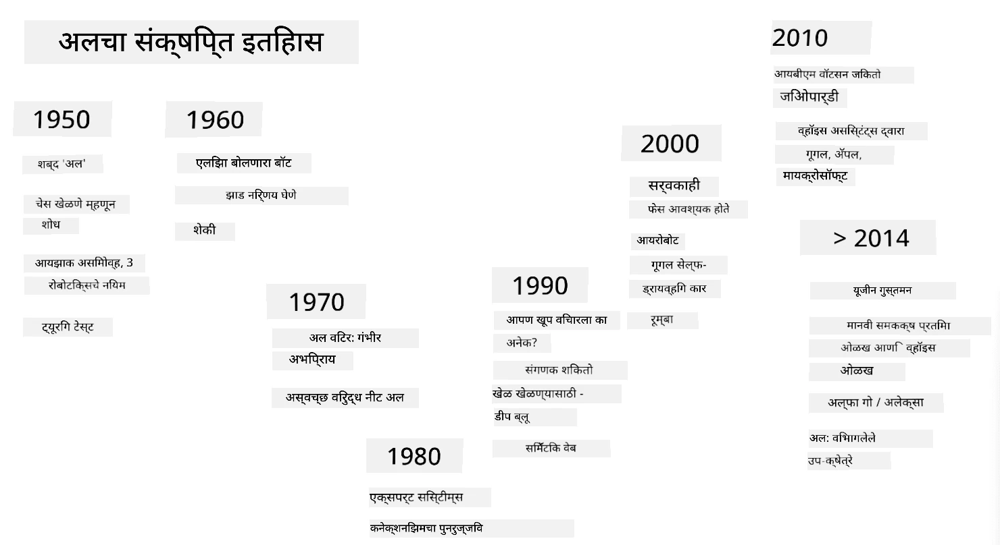

# AI ची ओळख

> स्केच नोट [Tomomi Imura](https://twitter.com/girlie_mac) यांच्याकडून

## [पूर्व-व्याख्यान प्रश्नमंजुषा](https://ff-quizzes.netlify.app/en/ai/quiz/1)

**कृत्रिम बुद्धिमत्ता** ही एक रोमांचक वैज्ञानिक शाखा आहे जी अभ्यास करते की संगणकांना बुद्धिमान वर्तन कसे दाखवता येईल, उदा. ज्या गोष्टी मानव चांगल्या प्रकारे करू शकतो त्या संगणक कशा करू शकतो.

मूळतः, संगणक [चार्ल्स बॅबेज](https://en.wikipedia.org/wiki/Charles_Babbage) यांनी संख्यांवर कार्य करण्यासाठी आणि एक निश्चित प्रक्रिया - अल्गोरिदम अनुसरण करण्यासाठी शोधले होते. आधुनिक संगणक, जरी 19व्या शतकात प्रस्तावित केलेल्या मूळ मॉडेलपेक्षा लक्षणीय अधिक प्रगत असले तरी, नियंत्रित गणनांच्या त्याच कल्पनेचे अनुसरण करतात. त्यामुळे जर आपल्याला एखादे लक्ष्य साध्य करण्यासाठी आवश्यक असलेल्या अचूक चरणांची क्रमवारी माहित असेल तर संगणकाला काहीतरी करण्यासाठी प्रोग्राम करणे शक्य आहे.

> फोटो [Vickie Soshnikova](http://twitter.com/vickievalerie) यांच्याकडून

> ✅ एखाद्या व्यक्तीचा फोटो पाहून त्याचे वय निश्चित करणे हे असे कार्य आहे जे स्पष्टपणे प्रोग्राम केले जाऊ शकत नाही, कारण आपण ते करताना आपल्या डोक्यात एक संख्या कशी येते हे आपल्याला माहित नाही.

---

काही कार्ये अशी असतात जी आपल्याला स्पष्टपणे कसे सोडवायचे हे माहित नसते. एखाद्या व्यक्तीचा फोटो पाहून त्याचे वय ठरवण्याचा विचार करा. आपण ते कसे करायचे ते शिकतो, कारण आपण वेगवेगळ्या वयाच्या लोकांचे अनेक उदाहरणे पाहिले आहेत, परंतु आपण ते कसे करतो हे स्पष्टपणे सांगू शकत नाही, किंवा संगणकाला ते कसे करायचे ते प्रोग्राम करू शकत नाही. हीच ती कार्ये आहेत जी **कृत्रिम बुद्धिमत्ता** (संक्षेपासाठी AI) साठी महत्त्वाची आहेत.

✅ अशा काही कार्यांचा विचार करा जे तुम्ही संगणकावर सोपवू शकता ज्यामुळे AI चा फायदा होईल. वित्त, वैद्यकीय क्षेत्र आणि कला यासारख्या क्षेत्रांचा विचार करा - आज AI मुळे या क्षेत्रांना कसा फायदा होत आहे?

## कमजोर AI वि. मजबूत AI

कमजोर AI | मजबूत AI
---------------------------------------|-------------------------------------
कमजोर AI म्हणजे विशिष्ट कार्य किंवा मर्यादित कार्यांसाठी डिझाइन आणि प्रशिक्षित केलेली AI प्रणाली.|मजबूत AI, किंवा कृत्रिम सामान्य बुद्धिमत्ता (AGI), म्हणजे मानवी-स्तरीय बुद्धिमत्ता आणि समज असलेल्या AI प्रणाली.
या AI प्रणाली सामान्यतः बुद्धिमान नसतात; त्या पूर्वनिर्धारित कार्यात उत्कृष्ट असतात परंतु त्यांना खरी समज किंवा चेतना नसते.|या AI प्रणालींमध्ये मानवी बुद्धिमत्ता असलेल्या कोणत्याही बौद्धिक कार्याचे प्रदर्शन करण्याची क्षमता असते, वेगवेगळ्या क्षेत्रांमध्ये जुळवून घेण्याची क्षमता असते आणि चेतना किंवा आत्म-जाणीव असते.
कमजोर AI चे उदाहरण म्हणजे Siri किंवा Alexa सारखे आभासी सहाय्यक, स्ट्रीमिंग सेवांद्वारे वापरले जाणारे शिफारस अल्गोरिदम आणि विशिष्ट ग्राहक सेवा कार्यांसाठी डिझाइन केलेले चॅटबॉट्स.|मजबूत AI साध्य करणे हे AI संशोधनाचे दीर्घकालीन लक्ष्य आहे आणि यासाठी AI प्रणाली विकसित करणे आवश्यक आहे ज्या विचार करू शकतात, शिकू शकतात, समजू शकतात आणि विविध कार्ये आणि संदर्भांमध्ये जुळवून घेऊ शकतात.
कमजोर AI अत्यंत विशेषीकृत आहे आणि त्याच्या मर्यादित क्षेत्राच्या पलीकडे मानवी-सारख्या संज्ञानात्मक क्षमता किंवा सामान्य समस्या सोडवण्याची क्षमता नाही.|मजबूत AI सध्या एक सैद्धांतिक संकल्पना आहे आणि कोणतीही AI प्रणाली या सामान्य बुद्धिमत्तेच्या पातळीवर पोहोचलेली नाही.

अधिक माहितीसाठी **[Artificial General Intelligence](https://en.wikipedia.org/wiki/Artificial_general_intelligence)** (AGI) पहा.

## बुद्धिमत्तेची व्याख्या आणि ट्युरिंग चाचणी

**[बुद्धिमत्ता](https://en.wikipedia.org/wiki/Intelligence)** या संज्ञेशी संबंधित असताना एक समस्या अशी आहे की या संज्ञेची स्पष्ट व्याख्या नाही. एखाद्याला वाटू शकते की बुद्धिमत्ता **गूढ विचारांशी** किंवा **आत्म-जाणिवेशी** संबंधित आहे, परंतु आपण याची योग्य व्याख्या करू शकत नाही.

> [फोटो](https://unsplash.com/photos/75715CVEJhI) [Amber Kipp](https://unsplash.com/@sadmax) यांच्याकडून Unsplash वरून

*बुद्धिमत्ता* या संज्ञेच्या अस्पष्टतेचे निरीक्षण करण्यासाठी, एक प्रश्न विचारण्याचा प्रयत्न करा: "मांजर बुद्धिमान आहे का?" वेगवेगळ्या लोकांना या प्रश्नाचे वेगवेगळे उत्तर देण्याची प्रवृत्ती असते, कारण ही पुष्टी खरी आहे की नाही हे सिद्ध करण्यासाठी सार्वत्रिकपणे स्वीकारलेली चाचणी नाही. आणि जर तुम्हाला वाटत असेल की आहे - तुमच्या मांजराला IQ चाचणीमध्ये धावण्याचा प्रयत्न करा...

✅ बुद्धिमत्ता कशी परिभाषित करायची याचा विचार करा. एखाद्या कावळ्याला जो भूलभुलैया सोडवून अन्न मिळवू शकतो तो बुद्धिमान आहे का? एखादे मूल बुद्धिमान आहे का?

---

AGI बद्दल बोलताना आपल्याला काही प्रकारे सांगावे लागेल की आपण खरोखरच बुद्धिमान प्रणाली तयार केली आहे का. [Alan Turing](https://en.wikipedia.org/wiki/Alan_Turing) यांनी **[ट्युरिंग चाचणी](https://en.wikipedia.org/wiki/Turing_test)** नावाचा एक मार्ग प्रस्तावित केला, जो बुद्धिमत्तेची व्याख्या म्हणून देखील कार्य करतो. चाचणी दिलेल्या प्रणालीची तुलना अंतर्ज्ञानाने बुद्धिमान असलेल्या गोष्टीशी - वास्तविक मानवाशी करते आणि कारण कोणतीही स्वयंचलित तुलना संगणक प्रोग्रामद्वारे बायपास केली जाऊ शकते, आपण मानवी चौकशीकर्ता वापरतो. त्यामुळे, जर एखाद्या व्यक्तीला मजकूर-आधारित संवादात वास्तविक व्यक्ती आणि संगणक प्रणाली यामध्ये फरक करता आला नाही - तर ती प्रणाली बुद्धिमान मानली जाते.

> [Eugene Goostman](https://en.wikipedia.org/wiki/Eugene_Goostman) नावाचा चॅट-बॉट, जो सेंट पीटर्सबर्गमध्ये विकसित झाला, त्याने 2014 मध्ये ट्युरिंग चाचणी जवळपास पास केली होती. त्याने एक हुशार व्यक्तिमत्व युक्ती वापरली. त्याने सुरुवातीला सांगितले की तो 13 वर्षांचा युक्रेनियन मुलगा आहे, ज्यामुळे ज्ञानाचा अभाव आणि मजकूरातील काही विसंगती स्पष्ट होईल. बॉटने 5 मिनिटांच्या संवादानंतर 30% न्यायाधीशांना ते मानवी असल्याचे पटवून दिले, ही एक मेट्रिक आहे जी ट्युरिंगने विश्वास ठेवला की 2000 पर्यंत मशीन पास करू शकेल. तथापि, हे समजले पाहिजे की याचा अर्थ असा नाही की आपण बुद्धिमान प्रणाली तयार केली आहे, किंवा संगणक प्रणालीने मानवी चौकशीकर्त्याला फसवले आहे - प्रणालीने मानवांना फसवले नाही, तर बॉट निर्मात्यांनी फसवले!

✅ तुम्हाला कधी चॅट बॉटने फसवले आहे का की तुम्ही एखाद्या व्यक्तीशी बोलत आहात असे वाटले? त्याने तुम्हाला कसे पटवले?

## AI साठी वेगवेगळे दृष्टिकोन

जर आपल्याला संगणकाला मानवीसारखे वागवायचे असेल, तर आपल्याला संगणकात आपली विचार करण्याची पद्धत कशी मॉडेल करायची हे काहीतरी करावे लागेल. परिणामी, आपल्याला मानव बुद्धिमान बनवणाऱ्या गोष्टी समजून घेण्याचा प्रयत्न करावा लागेल.

> मशीनमध्ये बुद्धिमत्ता प्रोग्राम करण्यासाठी, आपले स्वतःचे निर्णय घेण्याचे कार्य कसे चालते हे समजून घेणे आवश्यक आहे. जर तुम्ही थोडे आत्मपरीक्षण केले तर तुम्हाला लक्षात येईल की काही प्रक्रिया उपसचेतनपणे घडतात – उदा. आपण मांजर आणि कुत्र्याला विचार न करता वेगळे करू शकतो - तर काही इतर प्रक्रिया तर्कसंगत विचारांमध्ये समाविष्ट असतात.

या समस्येचे दोन संभाव्य दृष्टिकोन आहेत:

वरून-खाली दृष्टिकोन (प्रतीकात्मक तर्कसंगतता) | खाली-वर दृष्टिकोन (न्यूरल नेटवर्क)
---------------------------------------|-------------------------------------
वरून-खाली दृष्टिकोन एखाद्या व्यक्तीने समस्या सोडवण्यासाठी तर्कसंगततेचा वापर कसा करतो याचे मॉडेल तयार करते. यात मानवीकडून **ज्ञान** काढणे आणि संगणक-पठनीय स्वरूपात सादर करणे समाविष्ट आहे. आपल्याला संगणकात **तर्कसंगतता** मॉडेल करण्याचा मार्ग विकसित करणे देखील आवश्यक आहे. | खाली-वर दृष्टिकोन मानवी मेंदूची रचना मॉडेल करतो, ज्यामध्ये **न्यूरॉन्स** नावाच्या साध्या घटकांची मोठी संख्या असते. प्रत्येक न्यूरॉन त्याच्या इनपुट्सचा भारित सरासरीसारखा कार्य करतो आणि आम्ही **प्रशिक्षण डेटा** प्रदान करून उपयुक्त समस्या सोडवण्यासाठी न्यूरॉन्सच्या नेटवर्कला प्रशिक्षित करू शकतो.

बुद्धिमत्तेसाठी काही इतर संभाव्य दृष्टिकोन देखील आहेत:

* **उत्पन्न**, **सिनर्जेटिक** किंवा **मल्टी-एजंट दृष्टिकोन** हे मोठ्या संख्येने साध्या एजंट्सच्या परस्परसंवादाद्वारे जटिल बुद्धिमान वर्तन प्राप्त केले जाऊ शकते यावर आधारित आहेत. [Evolutionary Cybernetics](https://en.wikipedia.org/wiki/Global_brain#Evolutionary_cybernetics) नुसार, बुद्धिमत्ता *मेटासिस्टम ट्रांझिशन* प्रक्रियेत अधिक साध्या, प्रतिक्रियात्मक वर्तनातून *उत्पन्न* होऊ शकते.

* **Evolutionary दृष्टिकोन**, किंवा **Genetic Algorithm** ही उत्क्रांतीच्या तत्त्वांवर आधारित एक ऑप्टिमायझेशन प्रक्रिया आहे.

आम्ही नंतर अभ्यासक्रमात त्या दृष्टिकोनांचा विचार करू, परंतु सध्या आम्ही दोन मुख्य दिशांवर लक्ष केंद्रित करू: वरून-खाली आणि खाली-वर.

### वरून-खाली दृष्टिकोन

**वरून-खाली दृष्टिकोनात**, आपण आपल्या तर्कसंगततेचे मॉडेल तयार करण्याचा प्रयत्न करतो. कारण आपण तर्कसंगततेच्या वेळी आपल्या विचारांचे अनुसरण करू शकतो, आपण या प्रक्रियेला औपचारिक स्वरूप देण्याचा प्रयत्न करू शकतो आणि संगणकात प्रोग्राम करू शकतो. याला **प्रतीकात्मक तर्कसंगतता** म्हणतात.

लोकांच्या डोक्यात काही नियम असतात जे त्यांच्या निर्णय घेण्याच्या प्रक्रियांचे मार्गदर्शन करतात. उदाहरणार्थ, जेव्हा डॉक्टर रुग्णाचे निदान करत असतो, तेव्हा त्याला कदाचित लक्षात येईल की व्यक्तीला ताप आहे, आणि त्यामुळे शरीरात काही जळजळ होत असावी. विशिष्ट समस्येवर नियमांचा मोठा संच लागू करून डॉक्टर अंतिम निदानावर पोहोचू शकतो.

या दृष्टिकोनावर **ज्ञान सादरीकरण** आणि **तर्कसंगतता** यावर मोठ्या प्रमाणात अवलंबून असते. मानवी तज्ज्ञाकडून ज्ञान काढणे हे सर्वात कठीण भाग असू शकते, कारण अनेक प्रकरणांमध्ये डॉक्टरला नेमके माहित नसते की तो किंवा ती विशिष्ट निदान का करत आहे. कधीकधी समाधान स्पष्ट विचार न करता त्याच्या किंवा तिच्या डोक्यात येते. काही कार्ये, जसे की फोटोमधून व्यक्तीचे वय ठरवणे, ज्ञान हाताळण्यावर अजिबात कमी करता येत नाही.

### खाली-वर दृष्टिकोन

पर्यायाने, आपण आपल्या मेंदूमधील सर्वात सोप्या घटकांचे मॉडेल तयार करण्याचा प्रयत्न करू शकतो – न्यूरॉन. आपण संगणकात तथाकथित **कृत्रिम न्यूरल नेटवर्क** तयार करू शकतो आणि नंतर त्याला उदाहरणे देऊन समस्या सोडवण्यासाठी शिकवण्याचा प्रयत्न करू शकतो. ही प्रक्रिया नवजात मुलाला निरीक्षण करून त्याच्या किंवा तिच्या सभोवतालच्या गोष्टींबद्दल शिकण्यासारखी आहे.

✅ मुलं कशी शिकतात यावर थोडा शोध करा. मुलाच्या मेंदूचे मूलभूत घटक काय आहेत?

> | ML बद्दल काय?         |      |
> |--------------|-----------|
> | संगणकाला काही डेटा आधारित समस्या सोडवण्यासाठी शिकवण्यावर आधारित कृत्रिम बुद्धिमत्तेचा भाग **मशीन लर्निंग** म्हणून ओळखला जातो. आम्ही या अभ्यासक्रमात पारंपरिक मशीन लर्निंगचा विचार करणार नाही - आम्ही तुम्हाला स्वतंत्र [Machine Learning for Beginners](http://aka.ms/ml-beginners) अभ्यासक्रमाकडे संदर्भित करतो. |       |

## AI चा थोडक्यात इतिहास

कृत्रिम बुद्धिमत्ता ही एक शाखा म्हणून विसाव्या शतकाच्या मध्यात सुरू झाली. सुरुवातीला, प्रतीकात्मक तर्कसंगतता हा एक प्रचलित दृष्टिकोन होता आणि यामुळे काही महत्त्वाच्या यशस्वीतेसाठी, जसे की तज्ज्ञ प्रणाली - मर्यादित समस्या क्षेत्रांमध्ये तज्ज्ञ म्हणून कार्य करण्यास सक्षम संगणक प्रोग्राम्स. तथापि, लवकरच हे स्पष्ट झाले की अशा दृष्टिकोनाचा चांगला विस्तार होत नाही. तज्ज्ञाकडून ज्ञान काढणे, संगणकात सादर करणे आणि त्या ज्ञानाच्या अचूकतेची खात्री करणे हे एक अत्यंत जटिल कार्य आहे आणि अनेक प्रकरणांमध्ये व्यावहारिकदृष्ट्या खूप महाग आहे. यामुळे 1970 च्या दशकात तथाकथित [AI Winter](https://en.wikipedia.org/wiki/AI_winter) आले.

> प्रतिमा [Dmitry Soshnikov](http://soshnikov.com) यांच्याकडून

जसे वेळ गेला, संगणकीय संसाधने स्वस्त झाली आणि अधिक डेटा उपलब्ध झाला, त्यामुळे न्यूरल नेटवर्क दृष्टिकोनांनी संगणकीय दृष्टी किंवा भाषेची समज यासारख्या अनेक क्षेत्रांमध्ये मानवी प्राण्यांशी स्पर्धा करण्यामध्ये उत्कृष्ट कामगिरी दाखवायला सुरुवात केली. गेल्या दशकात, कृत्रिम बुद्धिमत्ता हा शब्द प्रामुख्याने न्यूरल नेटवर्क्सचा पर्याय म्हणून वापरला जातो, कारण आपण ऐकतो त्या AI च्या यशस्वीतेपैकी बहुतेक त्यावर आधारित आहेत.

आपण पाहू शकतो की दृष्टिकोन कसे बदलले, उदाहरणार्थ, बुद्धिबळ खेळणारा संगणक प्रोग्राम तयार करताना:

* सुरुवातीचे बुद्धिबळ प्रोग्राम शोधावर आधारित होते – प्रोग्रामने दिलेल्या संख्येच्या पुढील चालीसाठी विरोधकाच्या संभाव्य चालींचा अंदाज घेण्याचा स्पष्ट प्रयत्न केला आणि काही चालींमध्ये प्राप्त होऊ शकणाऱ्या सर्वोत्तम स्थितीवर आधारित एक आदर्श चाल निवडली. यामुळे तथाकथित [alpha-beta pruning](https://en.wikipedia.org/wiki/Alpha%E2%80%93beta_pruning) शोध अल्गोरिदमचा विकास झाला.
* शोध धोरणे खेळाच्या शेवटी चांगले कार्य करतात, जिथे शोध जागा मर्यादित असते आणि संभाव्य चालींची संख्या कमी असते. तथापि, खेळाच्या सुरुवातीला, शोध जागा खूप मोठी असते आणि मानवी खेळाडूंमधील विद्यमान सामन्यांमधून शिकून अल्गोरिदम सुधारित केला जाऊ शकतो. त्यानंतरच्या प्रयोगांमध्ये तथाकथित [case-based reasoning](https://en.wikipedia.org/wiki/Case-based_reasoning) वापरले गेले, जिथे प्रोग्रामने खेळातील वर्तमान स्थितीशी खूप समान असलेल्या ज्ञानाच्या आधारातील प्रकरणे शोधली.
* मानवी खेळाडूंवर विजय मिळवणारे आधुनिक प्रोग्राम्स न्यूरल नेटवर्क्स आणि [reinforcement learning](https://en.wikipedia.org/wiki/Reinforcement_learning) वर आधारित आहेत, जिथे प्रोग्राम्स स्वतःशी खेळून आणि त्यांच्या स्वतःच्या चुका शिकून खेळायला शिकतात – जसे मानवी प्राणी बुद्धिबळ खेळायला शिकतात. तथापि, संगणक प्रोग्राम खूप कमी वेळात अनेक खेळ खेळू शकतो आणि त्यामुळे खूप वेगाने शिकू शकतो.

✅ AI ने खेळलेले इतर खेळांवर थोडा शोध करा.

त्याचप्रमाणे, "बोलणारे प्रोग्राम्स" (जे ट्युरिंग चाचणी पास करू शकतात) तयार करण्याच्या दृष्टिकोनात बदल कसा झाला हे आपण पाहू शकतो:

*
> चित्र: Dmitry Soshnikov, [फोटो](https://unsplash.com/photos/r8LmVbUKgns) Marina Abrosimova द्वारे [Marina Abrosimova](https://unsplash.com/@abrosimova_marina_foto), Unsplash

## अलीकडील AI संशोधन

2010 च्या सुमारास मोठ्या सार्वजनिक डेटासेट्स उपलब्ध होऊ लागल्यावर न्यूरल नेटवर्क संशोधनात मोठी वाढ झाली. [ImageNet](https://en.wikipedia.org/wiki/ImageNet) नावाचा सुमारे 14 दशलक्ष अॅनोटेटेड प्रतिमांचा मोठा संग्रह तयार झाला, ज्यामुळे [ImageNet Large Scale Visual Recognition Challenge](https://image-net.org/challenges/LSVRC/) ची सुरुवात झाली.

> चित्र: [Dmitry Soshnikov](http://soshnikov.com)

2012 मध्ये, प्रतिमेचे वर्गीकरण करण्यासाठी प्रथम [Convolutional Neural Networks](../4-ComputerVision/07-ConvNets/README.md) वापरण्यात आले, ज्यामुळे वर्गीकरणातील त्रुटींचा दर लक्षणीयरीत्या कमी झाला (सुमारे 30% वरून 16.4% पर्यंत). 2015 मध्ये, Microsoft Research च्या ResNet आर्किटेक्चरने [मानवी-स्तरीय अचूकता प्राप्त केली](https://doi.org/10.1109/ICCV.2015.123).

त्यानंतर, न्यूरल नेटवर्क्सने अनेक कार्यांमध्ये अत्यंत यशस्वी वर्तन दाखवले:

---

वर्ष | मानवी समानता प्राप्त
-----|--------
2015 | [प्रतिमा वर्गीकरण](https://doi.org/10.1109/ICCV.2015.123)
2016 | [संवादी भाषण ओळख](https://arxiv.org/abs/1610.05256)
2018 | [स्वयंचलित मशीन अनुवाद](https://arxiv.org/abs/1803.05567) (चिनी-ते-इंग्रजी)
2020 | [प्रतिमा कॅप्शनिंग](https://arxiv.org/abs/2009.13682)

गेल्या काही वर्षांत, BERT आणि GPT-3 सारख्या मोठ्या भाषा मॉडेल्ससह मोठे यश पाहिले आहे. हे प्रामुख्याने यामुळे घडले की सामान्य मजकूर डेटा मोठ्या प्रमाणात उपलब्ध आहे, ज्यामुळे आम्हाला मॉडेल्स तयार करण्याची परवानगी मिळते जे मजकूरांची रचना आणि अर्थ कॅप्चर करतात, त्यांना सामान्य मजकूर संग्रहांवर प्री-ट्रेन करतात आणि नंतर विशिष्ट कार्यांसाठी त्या मॉडेल्सला विशेष बनवतात. आम्ही या कोर्समध्ये पुढे [नॅचरल लँग्वेज प्रोसेसिंग](../5-NLP/README.md) बद्दल अधिक शिकू.

## 🚀 आव्हान

इंटरनेटवर फेरफटका मारा आणि तुमच्या मते AI सर्वात प्रभावीपणे कुठे वापरले जाते ते ठरवा. ते मॅपिंग अॅपमध्ये आहे का, किंवा काही भाषण-ते-मजकूर सेवा किंवा व्हिडिओ गेममध्ये? प्रणाली कशी तयार केली गेली याचा शोध घ्या.

## [पाठानंतरचा क्विझ](https://ff-quizzes.netlify.app/en/ai/quiz/2)

## पुनरावलोकन आणि स्व-अभ्यास

[या धड्याचा](https://github.com/microsoft/ML-For-Beginners/tree/main/1-Introduction/2-history-of-ML) अभ्यास करून AI आणि ML चा इतिहास पुनरावलोकन करा. त्या धड्याच्या शीर्षस्थानी असलेल्या स्केच नोटमधून किंवा या धड्याच्या स्केच नोटमधून एक घटक घ्या आणि त्याच्या उत्क्रांतीला सूचित करणाऱ्या सांस्कृतिक संदर्भाचा अधिक सखोल अभ्यास करा.

**असाइनमेंट**: [गेम जॅम](assignment.md)

---

<!-- CO-OP TRANSLATOR DISCLAIMER START -->
**अस्वीकरण**:  
हा दस्तऐवज AI भाषांतर सेवा [Co-op Translator](https://github.com/Azure/co-op-translator) वापरून भाषांतरित करण्यात आला आहे. आम्ही अचूकतेसाठी प्रयत्नशील असलो तरी, कृपयास लक्षात ठेवा की स्वयंचलित भाषांतरे त्रुटी किंवा अचूकतेच्या अभावाने युक्त असू शकतात. मूळ भाषेतील दस्तऐवज हा अधिकृत स्रोत मानला जावा. महत्त्वाच्या माहितीसाठी, व्यावसायिक मानवी भाषांतराची शिफारस केली जाते. या भाषांतराचा वापर करून उद्भवलेल्या कोणत्याही गैरसमज किंवा चुकीच्या अर्थासाठी आम्ही जबाबदार राहणार नाही.
<!-- CO-OP TRANSLATOR DISCLAIMER END -->