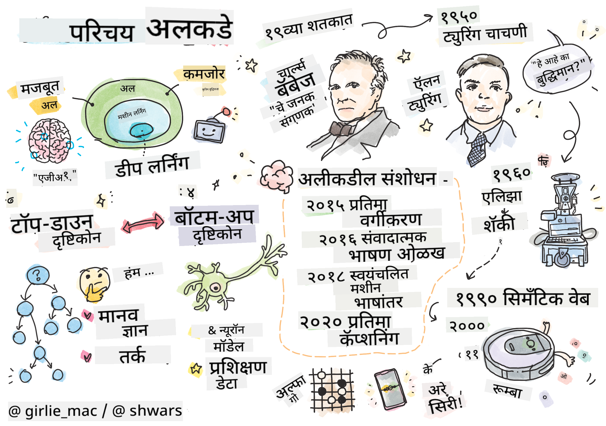

<!--
CO_OP_TRANSLATOR_METADATA:
{
  "original_hash": "5d1cbc67a9690adb5b33adf297794087",
  "translation_date": "2025-08-26T08:56:20+00:00",
  "source_file": "lessons/1-Intro/README.md",
  "language_code": "mr"
}
-->
# AI ची ओळख

> स्केच नोट [Tomomi Imura](https://twitter.com/girlie_mac) यांच्याकडून

## [पूर्व-व्याख्यान प्रश्नमंजुषा](https://red-field-0a6ddfd03.1.azurestaticapps.net/quiz/101)

**कृत्रिम बुद्धिमत्ता** ही एक रोमांचक वैज्ञानिक शाखा आहे जी संगणकांना बुद्धिमान वर्तन दाखविण्यासाठी कसे तयार करता येईल याचा अभ्यास करते, जसे की माणसांना सहज करता येणाऱ्या गोष्टी.

मुळात, संगणकांची निर्मिती [चार्ल्स बॅबेज](https://en.wikipedia.org/wiki/Charles_Babbage) यांनी विशिष्ट पद्धतीने - म्हणजेच अल्गोरिदमच्या आधारे - संख्यांवर प्रक्रिया करण्यासाठी केली होती. आधुनिक संगणक, जरी 19व्या शतकातील मूळ मॉडेलपेक्षा खूप प्रगत असले तरी, अजूनही नियंत्रित गणनांच्या त्याच कल्पनेचे अनुसरण करतात. त्यामुळे, जर आपल्याला एखादे कार्य साध्य करण्यासाठी आवश्यक असलेल्या अचूक पायऱ्यांची मालिका माहित असेल, तर संगणकाला ते कार्य करण्यासाठी प्रोग्राम करता येते.

> फोटो [Vickie Soshnikova](http://twitter.com/vickievalerie) यांच्याकडून

> ✅ एखाद्या व्यक्तीच्या छायाचित्रावरून त्याचे वय निश्चित करणे हे असे कार्य आहे जे स्पष्टपणे प्रोग्राम केले जाऊ शकत नाही, कारण आपण ते कसे करतो हे आपल्याला माहित नसते.

---

काही कार्ये अशी असतात जी सोडवायची पद्धत आपल्याला स्पष्टपणे माहित नसते. उदाहरणार्थ, एखाद्या व्यक्तीच्या छायाचित्रावरून त्याचे वय निश्चित करणे. आपण हे कसे करतो हे स्पष्टपणे सांगू शकत नाही, परंतु आपण अनेक वयोगटातील लोकांचे उदाहरण पाहून ते शिकतो. संगणकाला हे कार्य प्रोग्राम करणे शक्य नाही. हीच ती कार्ये आहेत ज्यामध्ये **कृत्रिम बुद्धिमत्ता** (AI) रस घेते.

✅ अशा काही कार्यांचा विचार करा जे संगणकावर सोपवले जाऊ शकतात आणि ज्यामुळे AI चा फायदा होईल. वित्त, वैद्यकीय क्षेत्र आणि कला यांसारख्या क्षेत्रांमध्ये AI चा आज कसा फायदा होत आहे?

## कमजोर AI विरुद्ध मजबूत AI

कमजोर AI | मजबूत AI
---------------------------------------|-------------------------------------
कमजोर AI म्हणजे विशिष्ट कार्य किंवा मर्यादित कार्यांसाठी डिझाइन आणि प्रशिक्षित केलेली AI प्रणाली. | मजबूत AI, किंवा कृत्रिम सामान्य बुद्धिमत्ता (AGI), म्हणजे मानवी-स्तरीय बुद्धिमत्ता आणि समज असलेली AI प्रणाली.
या AI प्रणाली सामान्यतः बुद्धिमान नसतात; त्या पूर्वनिर्धारित कार्यात उत्कृष्ट असतात परंतु त्यांना खऱ्या अर्थाने समज किंवा जाणीव नसते. | या AI प्रणालींमध्ये मानवी बुद्धिमत्तेप्रमाणे कोणतेही बौद्धिक कार्य करण्याची, वेगवेगळ्या क्षेत्रांमध्ये जुळवून घेण्याची आणि जाणीव किंवा आत्म-जाणीव असण्याची क्षमता असते.
कमजोर AI चे उदाहरण म्हणजे Siri किंवा Alexa सारखे आभासी सहाय्यक, स्ट्रीमिंग सेवांद्वारे वापरले जाणारे शिफारस अल्गोरिदम, आणि विशिष्ट ग्राहक सेवा कार्यांसाठी डिझाइन केलेले चॅटबॉट्स. | मजबूत AI साध्य करणे हे AI संशोधनाचे दीर्घकालीन उद्दिष्ट आहे आणि यासाठी अशा AI प्रणालींच्या विकासाची आवश्यकता आहे ज्या विविध कार्ये आणि संदर्भांमध्ये तर्क, शिकणे, समजणे आणि जुळवून घेऊ शकतात.
कमजोर AI अत्यंत विशिष्ट असते आणि त्यात मानवी-प्रमाणे संज्ञानात्मक क्षमता किंवा मर्यादित क्षेत्राच्या पलीकडे सामान्य समस्या सोडवण्याची क्षमता नसते. | मजबूत AI सध्या एक सैद्धांतिक संकल्पना आहे आणि कोणतीही AI प्रणाली या सामान्य बुद्धिमत्तेच्या पातळीवर पोहोचलेली नाही.

अधिक माहितीसाठी **[Artificial General Intelligence](https://en.wikipedia.org/wiki/Artificial_general_intelligence)** (AGI) पहा.

## बुद्धिमत्तेची व्याख्या आणि ट्यूरिंग चाचणी

**[बुद्धिमत्ता](https://en.wikipedia.org/wiki/Intelligence)** या संज्ञेशी संबंधित एक समस्या म्हणजे या संज्ञेची स्पष्ट व्याख्या नाही. काहीजण म्हणू शकतात की बुद्धिमत्ता **सार्वत्रिक विचारांशी** किंवा **स्वतःच्या जाणीवेशी** संबंधित आहे, परंतु आपण याची योग्य व्याख्या करू शकत नाही.

> [फोटो](https://unsplash.com/photos/75715CVEJhI) [Amber Kipp](https://unsplash.com/@sadmax) यांच्याकडून Unsplash वरून

*बुद्धिमत्ता* या संज्ञेच्या अस्पष्टतेचे उदाहरण पाहण्यासाठी, "मांजर बुद्धिमान आहे का?" या प्रश्नाचे उत्तर द्या. वेगवेगळ्या लोकांकडून वेगवेगळी उत्तरे मिळू शकतात, कारण हे सत्य आहे की नाही हे सिद्ध करण्यासाठी कोणतीही सार्वत्रिक चाचणी नाही. आणि जर तुम्हाला वाटत असेल की आहे - तर तुमच्या मांजराला IQ चाचणी देऊन पहा...

✅ एक मिनिट विचार करा की तुम्ही बुद्धिमत्तेची व्याख्या कशी करता. एक कावळा जो भुलभुलैयातून मार्ग काढून अन्न मिळवतो तो बुद्धिमान आहे का? एक मूल बुद्धिमान आहे का?

---

AGI बद्दल बोलताना, आपल्याला काहीतरी खरोखर बुद्धिमान प्रणाली तयार केली आहे की नाही हे सांगण्याचा काही मार्ग असणे आवश्यक आहे. [अलन ट्यूरिंग](https://en.wikipedia.org/wiki/Alan_Turing) यांनी **[ट्यूरिंग चाचणी](https://en.wikipedia.org/wiki/Turing_test)** नावाचा एक मार्ग सुचवला, जो बुद्धिमत्तेची व्याख्या म्हणूनही काम करतो. चाचणी दिलेल्या प्रणालीची तुलना काहीतरी मूळ बुद्धिमान गोष्टीशी - म्हणजेच खऱ्या माणसाशी करते. कारण कोणतीही स्वयंचलित तुलना संगणक प्रोग्रामद्वारे बायपास केली जाऊ शकते, म्हणून आपण मानवी परीक्षकाचा वापर करतो. जर एखाद्या व्यक्तीला मजकूर-आधारित संवादात खऱ्या व्यक्ती आणि संगणक प्रणाली यामध्ये फरक करता आला नाही, तर ती प्रणाली बुद्धिमान मानली जाते.

> [Eugene Goostman](https://en.wikipedia.org/wiki/Eugene_Goostman) नावाच्या एका चॅटबॉटने, जो सेंट पीटर्सबर्गमध्ये विकसित करण्यात आला, 2014 मध्ये ट्यूरिंग चाचणी जवळपास पास केली. त्याने स्वतःला 13 वर्षांचा युक्रेनियन मुलगा असल्याचे सांगितले, ज्यामुळे ज्ञानाच्या अभावाचे आणि मजकूरातील विसंगतींचे स्पष्टीकरण मिळाले. या बॉटने 30% परीक्षकांना 5 मिनिटांच्या संवादानंतर तो माणूस असल्याचे पटवून दिले, ही एक अशी मेट्रिक आहे जी ट्यूरिंगने 2000 पर्यंत संगणक प्रणालीने साध्य करावी अशी अपेक्षा केली होती. तथापि, याचा अर्थ असा नाही की आपण बुद्धिमान प्रणाली तयार केली आहे किंवा संगणक प्रणालीने मानवी परीक्षकाला फसवले आहे - प्रणालीने माणसांना फसवले नाही, तर बॉट निर्मात्यांनी फसवले!

✅ तुम्हाला कधी चॅटबॉटने माणसाशी बोलत असल्याचा भास झाला आहे का? त्याने तुम्हाला कसे पटवले?

## AI कडे जाण्याचे वेगवेगळे दृष्टिकोन

जर आपल्याला संगणकाला माणसासारखे वागवायचे असेल, तर आपल्याला संगणकामध्ये आपल्या विचार करण्याच्या पद्धतीचे काहीसे मॉडेल तयार करावे लागेल. परिणामी, आपल्याला हे समजून घेण्याचा प्रयत्न करावा लागेल की माणूस बुद्धिमान कसा बनतो.

> मशीनमध्ये बुद्धिमत्ता प्रोग्राम करण्यासाठी, आपल्याला आपल्या स्वतःच्या निर्णय घेण्याच्या प्रक्रियेचे कार्य कसे चालते हे समजून घ्यावे लागेल. जर तुम्ही स्वतःचा थोडा विचार केला, तर तुम्हाला लक्षात येईल की काही प्रक्रिया उपसचेतनपणे घडतात – उदा. आपण मांजर आणि कुत्र्याला विचार न करता वेगळे करू शकतो - तर काही इतर प्रक्रिया तर्कावर आधारित असतात.

या समस्येचे दोन संभाव्य दृष्टिकोन आहेत:

टॉप-डाउन दृष्टिकोन (प्रतीकात्मक तर्क) | बॉटम-अप दृष्टिकोन (न्यूरल नेटवर्क्स)
---------------------------------------|-------------------------------------
टॉप-डाउन दृष्टिकोन समस्येचे निराकरण करण्यासाठी व्यक्ती कसा विचार करतो याचे मॉडेल तयार करतो. यामध्ये मानवीकडून **ज्ञान** काढणे आणि ते संगणक-वाचनीय स्वरूपात सादर करणे समाविष्ट आहे. आपल्याला संगणकामध्ये **तर्क** मॉडेल करण्याचा मार्ग देखील विकसित करावा लागेल. | बॉटम-अप दृष्टिकोन मानवी मेंदूच्या संरचनेचे मॉडेल तयार करतो, ज्यामध्ये **न्यूरॉन्स** नावाच्या साध्या घटकांचा समावेश असतो. प्रत्येक न्यूरॉन त्याच्या इनपुट्सचा भारित सरासरीसारखा कार्य करतो आणि आम्ही **प्रशिक्षण डेटा** प्रदान करून न्यूरॉन्सच्या नेटवर्कला उपयुक्त समस्या सोडवण्यासाठी प्रशिक्षित करू शकतो.

बुद्धिमत्तेसाठी इतर काही दृष्टिकोन देखील आहेत:

* **उत्पन्न**, **सिनर्जेटिक** किंवा **मल्टी-एजंट दृष्टिकोन** यावर आधारित आहे की अनेक साध्या घटकांच्या परस्परसंवादामुळे जटिल बुद्धिमान वर्तन प्राप्त होऊ शकते. [Evolutionary Cybernetics](https://en.wikipedia.org/wiki/Global_brain#Evolutionary_cybernetics) नुसार, बुद्धिमत्ता अधिक साध्या, प्रतिक्रियात्मक वर्तनातून *मेटासिस्टम ट्रांझिशन* प्रक्रियेतून *उत्पन्न* होऊ शकते.

* **उत्क्रांतीवादी दृष्टिकोन**, किंवा **जेनेटिक अल्गोरिदम** हा उत्क्रांतीच्या तत्त्वांवर आधारित एक ऑप्टिमायझेशन प्रक्रिया आहे.

या दृष्टिकोनांचा आपण नंतर अभ्यास करू, परंतु सध्या आपण दोन मुख्य दिशांवर लक्ष केंद्रित करू: टॉप-डाउन आणि बॉटम-अप.

### टॉप-डाउन दृष्टिकोन

**टॉप-डाउन दृष्टिकोनात**, आपण आपल्या तर्कशक्तीचे मॉडेल तयार करण्याचा प्रयत्न करतो. कारण आपण तर्क करताना आपल्या विचारांचे अनुसरण करू शकतो, त्यामुळे आपण या प्रक्रियेचे औपचारिककरण करून ते संगणकामध्ये प्रोग्राम करण्याचा प्रयत्न करू शकतो. याला **प्रतीकात्मक तर्क** म्हणतात.

लोकांच्या डोक्यात काही नियम असतात जे त्यांच्या निर्णय प्रक्रियांचे मार्गदर्शन करतात. उदाहरणार्थ, जेव्हा डॉक्टर एखाद्या रुग्णाचे निदान करत असतो, तेव्हा त्याला कदाचित लक्षात येते की व्यक्तीला ताप आहे, त्यामुळे शरीरात काहीतरी जळजळ होत असावी. विशिष्ट समस्येवर मोठ्या प्रमाणात नियम लागू करून डॉक्टर अंतिम निदान करू शकतो.

हा दृष्टिकोन **ज्ञान सादरीकरण** आणि **तर्क** यावर खूप अवलंबून असतो. मानवी तज्ज्ञाकडून ज्ञान काढणे हे सर्वात कठीण भाग असू शकते, कारण डॉक्टर बर्‍याच प्रकरणांमध्ये त्याला किंवा तिला विशिष्ट निदान का सुचते हे अचूकपणे माहित नसते. कधी कधी उत्तर त्याच्या किंवा तिच्या डोक्यात स्पष्ट विचार न करता येते. काही कार्ये, जसे की छायाचित्रावरून व्यक्तीचे वय निश्चित करणे, ज्ञान हाताळण्यावर आधारित असू शकत नाहीत.

### बॉटम-अप दृष्टिकोन

याउलट, आपण आपल्या मेंदूमधील सर्वात सोप्या घटकांचे – न्यूरॉनचे मॉडेल तयार करण्याचा प्रयत्न करू शकतो. आपण संगणकामध्ये **कृत्रिम न्यूरल नेटवर्क** तयार करू शकतो आणि नंतर त्याला उदाहरणे देऊन समस्या सोडवण्यासाठी शिकवू शकतो. ही प्रक्रिया नवजात बाळ त्याच्या सभोवतालच्या गोष्टींचे निरीक्षण करून शिकतो यासारखी आहे.

✅ बाळ कसे शिकतात यावर थोडे संशोधन करा. बाळाच्या मेंदूचे मूलभूत घटक कोणते आहेत?

> | ML बद्दल काय?         |      |
> |--------------|-----------|
> | कृत्रिम बुद्धिमत्तेचा तो भाग जो काही डेटाच्या आधारे समस्या सोडवण्यासाठी संगणक शिकतो त्याला **मशीन लर्निंग** म्हणतात. या अभ्यासक्रमात आपण पारंपरिक मशीन लर्निंगचा विचार करणार नाही - यासाठी आम्ही तुम्हाला स्वतंत्र [Machine Learning for Beginners](http://aka.ms/ml-beginners) अभ्यासक्रमाकडे पाठवतो. |       |

## AI चा संक्षिप्त इतिहास

कृत्रिम बुद्धिमत्तेची सुरुवात विसाव्या शतकाच्या मध्यात एक क्षेत्र म्हणून झाली. सुरुवातीला, प्रतीकात्मक तर्क हा एक प्रचलित दृष्टिकोन होता, आणि यामुळे काही महत्त्वाच्या यशांना चालना मिळाली, जसे की तज्ज्ञ प्रणाली – मर्यादित समस्या क्षेत्रांमध्ये तज्ज्ञ म्हणून कार्य करू शकणारे संगणक प्रोग्राम. तथापि, लवकरच हे स्पष्ट झाले की असा दृष्टिकोन चांगल्या प्रकारे स्केल होत नाही. तज्ज्ञाकडून ज्ञान काढणे, ते संगणकामध्ये सादर करणे आणि त्या ज्ञानाच्या आधारावर अचूकता राखणे ही एक अत्यंत जटिल आणि अनेक प्रकरणांमध्ये अव्यवहार्य प्रक्रिया आहे. यामुळे 1970 च्या दशकात तथाकथित [AI हिवाळा](https://en.wikipedia.org/wiki/AI_winter) आला.

> प्रतिमा [Dmitry Soshnikov](http://soshnikov.com) यांच्याकडून

जसा काळ गेला, संगणकीय संसाधने स्वस्त झाली आणि अधिक डेटा उपलब्ध झाला, त्यामुळे न्यूरल नेटवर्क दृष्टिकोनांनी संगणकीय दृष्टिकोन किंवा भाषेच्या समजुतीसारख्या अनेक क्षेत्रांमध्ये मानवी क्षमतेशी स्पर्धा करताना उत्कृष्ट कामगिरी दाखवली. गेल्या दशकात, कृत्रिम बुद्धिमत्ता हा शब्द प्रामुख्याने न्यूरल नेटवर्क्सचा समानार्थी म्हणून वापरला जातो, कारण आपण ऐकतो ती बहुतेक AI यशे त्यांच्यावर आधारित आहेत.

आपण पाहू शकतो की दृष्टिकोन कसे बदलले, उदाहरणार्थ, बुद्धिबळ खेळणारा संगणक प्रोग्राम तयार करताना:

* सुरुवातीचे बुद्धिबळ प्रोग्राम शोधावर आधारित होते – प्रोग्रामने दिलेल्या संख्येच्या पुढील चालींसाठी प्रतिस्पर्ध्याच्या संभाव्य चालींचा अंदाज घेण्याचा स्पष्ट प्रयत्न केला आणि काही चालींमध्ये साध्य करता येणाऱ्या सर्वोत्तम स्थितीच्या आधारे एक इष्टतम चाल निवडली. यामुळे तथाकथित [अल्फा-बेटा प्रूनिंग](https://en.wikipedia.org/wiki/Alpha%E2%80%93beta_pruning) शोध अल्गोरिदमचा विकास झाला.
* शोध धोरणे खेळाच्या शेवटी चांगले कार्य करतात, जिथे शोध जागा मर्यादित संख्येने चालींनी मर्यादित असते. तथापि, खेळाच्या सुरुवातीला, शोध जागा खूप मोठी असते आणि मानवी खेळाडूंमधील विद्यमान सामन्यांमधून शिकून अल्गोरिदम सुधारित केला जाऊ शकतो. त्यानंतरच्या प्रयोगांमध्ये तथाकथित [केस-आधारित तर्क](https://en.wikipedia.org/wiki/Case-based_reasoning) वापरला गेला, जिथे प्रोग्रामने ज्ञानाच्या आधारावर सध्याच्या स्थितीशी खूपच समान असलेल्या प्रकरणांचा शोध घेतला.
* मानवी खेळाडूंवर विजय मिळवणारे आधुनिक प्रोग्राम न्यूरल नेटवर्क्स आणि [रिइन्फोर्समेंट लर्निंग](https://en.wikipedia.org/wiki/Reinforcement_learning) वर आधारित आहेत, जिथे प्रोग्राम स्वतःशीच दीर्घकाळ खेळून आणि स्वतःच्या चुका शिकून खेळायला शिकतात – जसे की माणसे बुद्धिबळ खेळायला शिकतात. तथापि, संगणक प्रोग्राम खूप कमी वेळात खूप जास्त खेळ खेळू शकतो आणि त्यामुळे खूप जलद शिकतो.

✅ AI ने खेळलेले इतर खेळ यावर थोडे संशोधन करा.

त्याचप्रमाणे, "बोलणारे प्रोग्राम" (जे ट्यूरिंग चाचणी पास करू शकतात) तयार करण्याच्या दृष्टिकोनात बदल कसा झाला हे आपण पाहू शकतो:

* या प्रकारच्या सुरुवातीच्या प्रोग्राम्स, जसे की [Eliza](https://en.wikipedia.org/wiki/ELIZA), खूप सोप्या व्याकरणाच्या नियमांवर आणि इनपुट वाक्याचे प्रश्नात पुनर्रचना करण्यावर आधारित होते.
* आधुनिक सहाय्यक, जसे की Cortana, Siri किंवा Google Assistant हे सर्व हायब्रिड प्रणाली आहेत ज्या भाषणाला मजकूरात रूपांतरित करण्यासाठी आणि आपला हेतू ओळखण्यासाठी

> चित्र: दिमित्री सोश्निकोव्ह, [फोटो](https://unsplash.com/photos/r8LmVbUKgns) मारिना अब्रोसिमोव्हा यांनी Unsplash वर घेतलेले [Marina Abrosimova](https://unsplash.com/@abrosimova_marina_foto)

## अलीकडील AI संशोधन

न्यूरल नेटवर्क संशोधनामध्ये अलीकडील मोठी वाढ सुमारे 2010 च्या सुमारास सुरू झाली, जेव्हा मोठ्या सार्वजनिक डेटासेट्स उपलब्ध होऊ लागल्या. [ImageNet](https://en.wikipedia.org/wiki/ImageNet) नावाच्या सुमारे 14 दशलक्ष अॅनोटेटेड प्रतिमांचा मोठा संग्रह, ज्यामुळे [ImageNet Large Scale Visual Recognition Challenge](https://image-net.org/challenges/LSVRC/) ची सुरुवात झाली.

> चित्र: [दिमित्री सोश्निकोव्ह](http://soshnikov.com)

2012 मध्ये, प्रतिमेचे वर्गीकरण करण्यासाठी प्रथम [Convolutional Neural Networks](../4-ComputerVision/07-ConvNets/README.md) वापरण्यात आले, ज्यामुळे वर्गीकरणातील त्रुटींच्या प्रमाणात लक्षणीय घट झाली (सुमारे 30% वरून 16.4% पर्यंत). 2015 मध्ये, Microsoft Research च्या ResNet आर्किटेक्चरने [मानवी-स्तरीय अचूकता प्राप्त केली](https://doi.org/10.1109/ICCV.2015.123).

त्यानंतर, न्यूरल नेटवर्क्सने अनेक कार्यांमध्ये अत्यंत यशस्वी वर्तन दाखवले:

---

वर्ष | मानवी समानता प्राप्त
-----|--------
2015 | [प्रतिमा वर्गीकरण](https://doi.org/10.1109/ICCV.2015.123)
2016 | [संवादी भाषण ओळख](https://arxiv.org/abs/1610.05256)
2018 | [स्वयंचलित मशीन अनुवाद](https://arxiv.org/abs/1803.05567) (चिनी ते इंग्रजी)
2020 | [प्रतिमा कॅप्शनिंग](https://arxiv.org/abs/2009.13682)

गेल्या काही वर्षांत, BERT आणि GPT-3 सारख्या मोठ्या भाषा मॉडेल्ससह मोठ्या यशाचा अनुभव घेतला आहे. हे मुख्यतः यामुळे घडले की सामान्य मजकूर डेटा मोठ्या प्रमाणात उपलब्ध आहे, ज्यामुळे मॉडेल्सना मजकूराची रचना आणि अर्थ समजून घेण्यासाठी प्रशिक्षण देता येते, त्यांना सामान्य मजकूर संग्रहांवर प्री-ट्रेन करता येते आणि नंतर विशिष्ट कार्यांसाठी त्या मॉडेल्सला विशेष बनवता येते. आपण या कोर्समध्ये नंतर [नैसर्गिक भाषा प्रक्रिया](../5-NLP/README.md) याबद्दल अधिक शिकू.

## 🚀 आव्हान

इंटरनेटवर फेरफटका मारा आणि तुमच्या मते AI सर्वात प्रभावीपणे कुठे वापरले जाते ते ठरवा. ते मॅपिंग अॅपमध्ये आहे का, काही भाषण-ते-मजकूर सेवा आहे का किंवा व्हिडिओ गेममध्ये आहे का? प्रणाली कशी तयार केली गेली याचा शोध घ्या.

## [पोस्ट-लेक्चर क्विझ](https://red-field-0a6ddfd03.1.azurestaticapps.net/quiz/201)

## पुनरावलोकन आणि स्व-अभ्यास

AI आणि ML चा इतिहास [या धड्याचा](https://github.com/microsoft/ML-For-Beginners/tree/main/1-Introduction/2-history-of-ML) अभ्यास करून पुनरावलोकन करा. त्या धड्याच्या शीर्षस्थानी असलेल्या स्केच नोटमधून किंवा या धड्याच्या एखाद्या घटकाचा अभ्यास करा आणि त्याच्या उत्क्रांतीला सूचित करणाऱ्या सांस्कृतिक संदर्भाचा अधिक सखोल अभ्यास करा.

**असाइनमेंट**: [गेम जॅम](assignment.md)

**अस्वीकृती**:  
हा दस्तऐवज AI भाषांतर सेवा [Co-op Translator](https://github.com/Azure/co-op-translator) वापरून भाषांतरित करण्यात आला आहे. आम्ही अचूकतेसाठी प्रयत्नशील असलो तरी कृपया लक्षात ठेवा की स्वयंचलित भाषांतरे त्रुटी किंवा अचूकतेच्या अभावाने युक्त असू शकतात. मूळ भाषेतील दस्तऐवज हा अधिकृत स्रोत मानला जावा. महत्त्वाच्या माहितीसाठी, व्यावसायिक मानवी भाषांतराची शिफारस केली जाते. या भाषांतराचा वापर करून उद्भवलेल्या कोणत्याही गैरसमज किंवा चुकीच्या अर्थासाठी आम्ही जबाबदार राहणार नाही.