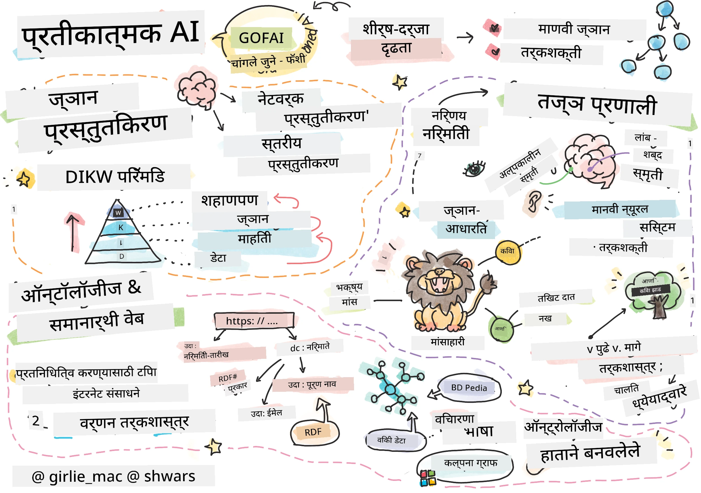
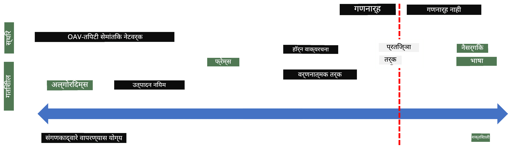
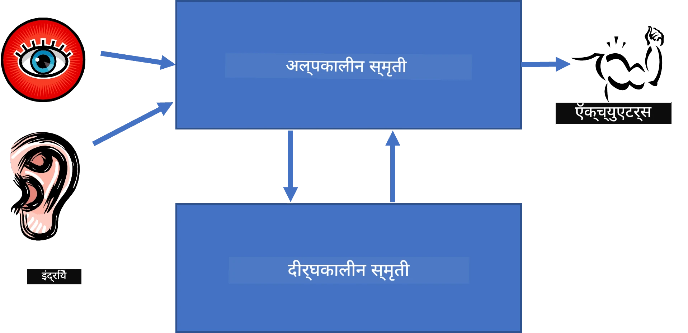
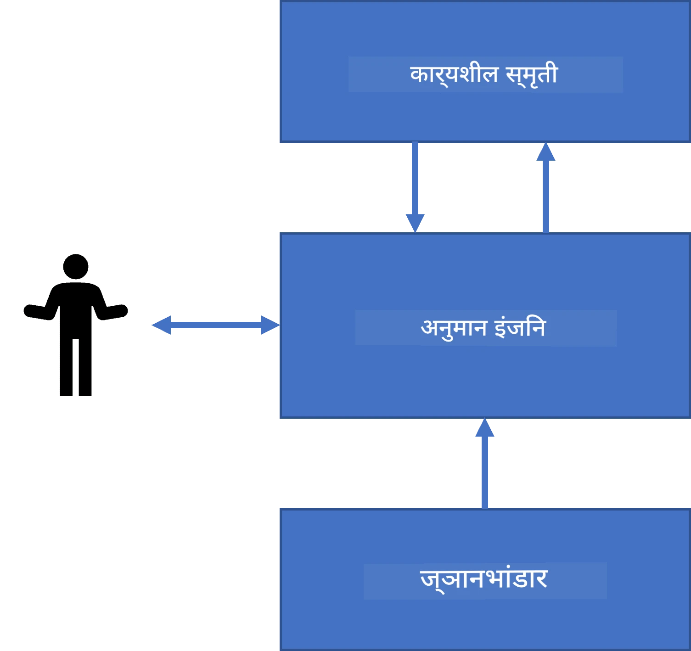
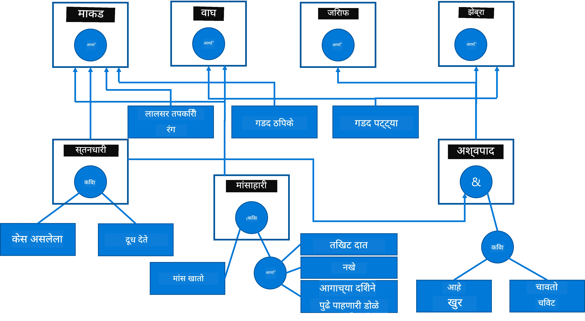
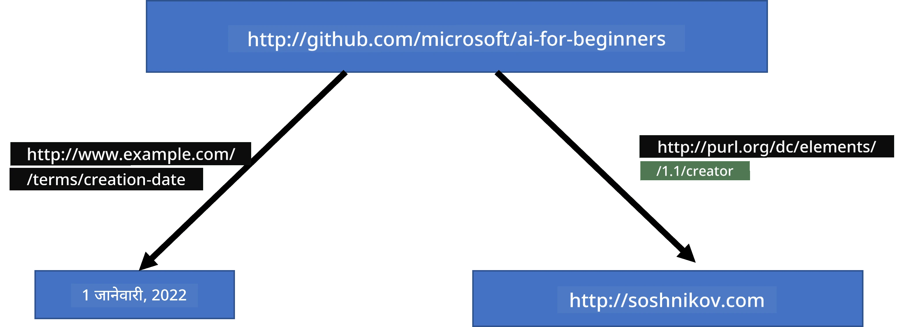
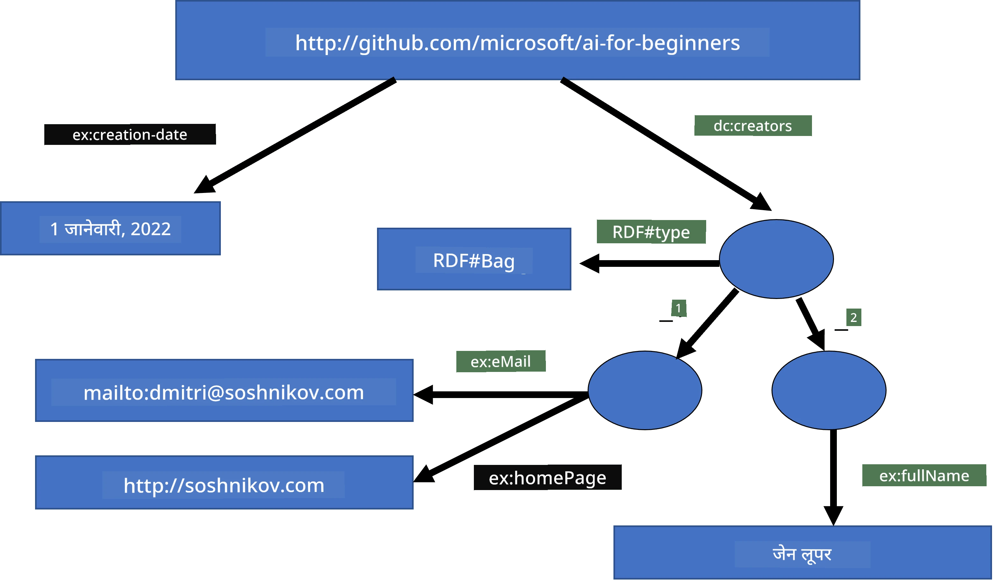
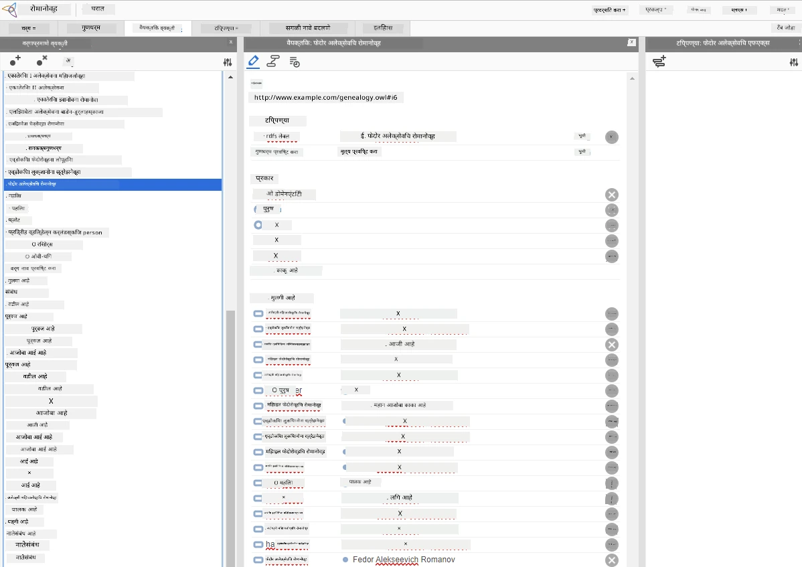

# ज्ञान सादरीकरण आणि तज्ज्ञ प्रणाली



> स्केचनोट [Tomomi Imura](https://twitter.com/girlie_mac) यांच्या कडून

कृत्रिम बुद्धिमत्तेचा शोध हा ज्ञान शोधण्यावर आधारित आहे, ज्यामुळे जग समजून घेणे मानवांप्रमाणे शक्य होते. पण हे कसे करता येईल?

## [पूर्व-व्याख्यान क्विझ](https://ff-quizzes.netlify.app/en/ai/quiz/3)

AI च्या सुरुवातीच्या काळात, बुद्धिमान प्रणाली तयार करण्यासाठी टॉप-डाउन पद्धत (मागील धड्यातील चर्चेप्रमाणे) लोकप्रिय होती. कल्पना अशी होती की लोकांकडून ज्ञान काही मशीन-समजण्याजोग्या स्वरूपात काढावे, आणि नंतर त्याचा वापर स्वयंचलितपणे समस्या सोडवण्यासाठी करावा. ही पद्धत दोन मोठ्या कल्पनांवर आधारित होती:

* ज्ञान सादरीकरण
* तर्कशक्ती

## ज्ञान सादरीकरण

Symbolic AI मध्ये एक महत्वाचा संकल्पना म्हणजे **ज्ञान**. ज्ञान व *माहिती* किंवा *डेटा* यातील फरक ओळखणे महत्त्वाचे आहे. उदाहरणार्थ, आपण म्हणू शकतो की पुस्तके ज्ञान ठेवतात कारण पुस्तके अभ्यासून आपण तज्ज्ञ बनू शकतो. मात्र, जे पुस्तके ठेवतात ते प्रत्यक्षात *डेटा* म्हणतात, आणि पुस्तके वाचून आणि हा डेटा आपल्या जग मॉडेलमध्ये समाकलित करून आपण हा डेटा ज्ञानात रूपांतरित करतो.

> ✅ **ज्ञान** म्हणजे आपल्या डोक्यात असणारी अशी गोष्ट जी आपल्या जगाच्या समजुतीचे प्रतिनिधित्व करते. ते सक्रिय **शिकण्याच्या** प्रक्रियेद्वारे मिळते, ज्यात आपण प्राप्त केलेली माहितीच्या तुकड्यांना आपल्या जागरूक जगाच्या मॉडेलमध्ये समाकलित करतो.

बहुतेक वेळा, आम्ही ज्ञानाची अचूक व्याख्या करत नाही, पण त्याला [DIKW पिरॅमिड](https://en.wikipedia.org/wiki/DIKW_pyramid) वापरून इतर संबंधित संकल्पनांशी जुळवून घेतो. त्यात खालील संकल्पना आहेत:

* **डेटा** ही भौतिक माध्यमांमध्ये सादर केलेली गोष्ट आहे, जसे लिहिलेला मजकूर किंवा बोललेले शब्द. डेटा मानवांपासून स्वतंत्र अस्तित्वात असतो आणि लोकांमध्ये देवाणघेवाण होऊ शकतो.
* **माहिती** म्हणजे आपण डोक्यात डेटा कसा समजतो. उदाहरणार्थ, आपण *कंप्युटर* हा शब्द ऐकल्यावर त्याची काही समज मिळते.
* **ज्ञान** म्हणजे माहिती जी आपल्या जग मॉडेलमध्ये समाकलित होते. उदाहरणार्थ, एकदा आपल्याला समजले की कंप्युटर काय आहे, आपण त्याच्या कार्यप्रणाली, किमती आणि उपयोगाबाबत काही कल्पना तयार करतो. या परस्पर जोडलेल्या संकल्पनांचा जाळं म्हणजे आपले ज्ञान.
* **शहाणपणा** ही आपल्या जगाच्या समजुतीची अजून एक पातळी आहे, आणि ती *मेटा-ज्ञान* दर्शवते, उदा. ज्ञान कधी आणि कसे वापरले पाहिजे याचा काही अर्थ.


*प्रतिमा [विकिपीडिया](https://commons.wikimedia.org/w/index.php?curid=37705247) मधून, Longlivetheux - स्वतःचे काम, CC BY-SA 4.0*

म्हणून, **ज्ञान सादरीकरण** ची समस्या म्हणजे ज्ञान कॉम्प्युटरच्या आत डेटा स्वरूपात प्रभावीपणे सादर करण्याचा काही मार्ग शोधणे, ज्यामुळे ते स्वयंचलितपणे वापरता येईल. हा एक स्पेक्ट्रम म्हणून पाहिला जाऊ शकतो:



> प्रतिमा [Dmitry Soshnikov](http://soshnikov.com) यांनी दिलेली

* डावीकडे अतिशय सोपे ज्ञान सादरीकरण प्रकार असतात जे कॉम्प्युटरने प्रभावीपणे वापरले जाऊ शकतात. सर्वात सोपा प्रकार म्हणजे अल्गोरिद्मिक, जेथे ज्ञान कॉम्प्युटर प्रोग्रामने सादर केले जाते. मात्र, हे ज्ञान सादर करण्याचा सर्वोत्तम मार्ग नाही, कारण ते लवचिक नाही. आपल्या डोक्यातील ज्ञान अनेकदा अल्गोरिद्मिक नसते.
* उजवीकडे नैसर्गिक मजकूर सारखे सादरीकरणे आहेत. हे सर्वाधिक शक्तिशाली आहे, परंतु स्वयंचलित तर्कासाठी वापरता येत नाही.

> ✅ एक मिनिट विचार करा की आपण आपले ज्ञान डोक्यात कसे सादर करता आणि ते नोट्समध्ये कसे रूपांतरित करता. आपल्या लक्षात ठेवण्यास कसा प्रकार चांगला मदत करतो?

## कॉम्प्युटर ज्ञान सादरीकरणांचे वर्गीकरण

आपण वेगवेगळ्या कॉम्प्युटर ज्ञान सादरीकरण पद्धती खालील प्रकारांमध्ये वर्गीकरण करू शकतो:

* **नेटवर्क सादरीकरणे** ही तथ्यांवर आधारित आहेत की आपल्या डोक्यात एक परस्परसंबंधित संकल्पनांचा जाळं असतो. त्याच नेटवर्कना कॉम्प्युटरमध्ये ग्राफ म्हणून पुनरुत्पादित करण्याचा प्रयत्न करू शकतो - ज्याला **सेमान्टिक नेटवर्क** म्हणतात.

1. **ऑब्जेक्ट-अॅट्रिब्युट-व्हॅल्यू तुकडे** किंवा **अॅट्रिब्युट-व्हॅल्यू जोड्या**. ग्राफ कॉम्प्युटरमध्ये नोड्स आणि एजेसच्या यादी म्हणून सादर केला जाऊ शकतो, म्हणून आम्ही ऑब्जेक्ट, अॅट्रिब्युट आणि व्हॅल्यू असलेल्या तुकड्यांच्या यादीने सेमान्टिक नेटवर्क सादर करू शकतो. उदाहरणार्थ, खालील तुकडे प्रोग्रॅमिंग भाषांविषयी तयार केली आहेत:

ऑब्जेक्ट | अॅट्रिब्युट | व्हॅल्यू
-------|-----------|------
Python | आहे | Untyped-Language
Python | तयार-कऱ्णारा | Guido van Rossum
Python | ब्लॉक-सिंटॅक्स | इन्डेंटेशन
Untyped-Language | नाही आहे | प्रकार व्याख्या

> ✅ विचार करा की तुकडे कसे इतर प्रकारचे ज्ञान सादर करण्यासाठी वापरले जाऊ शकतात.

2. **हायअरार्किकल सादरीकरणे** यावर भर देतात की आपण अनेकदा डोक्यात ऑब्जेक्ट्सचा पदानुक्रम तयार करतो. उदाहरणार्थ, आपण जाणतो की कॅनरी हा पक्षी आहे, आणि सर्व पक्ष्यांना पंख असतात. आपल्याला कॅनरीचा रंग आणि त्याचा उड्डाण वेग काय असतो हेही माहिती आहे.

   - **फ्रेम सादरीकरण** प्रत्येक ऑब्जेक्ट किंवा ऑब्जेक्ट्सच्या वर्गाला **फ्रेम** म्हणून सादर करण्यावर आधारित आहे ज्यात **स्लॉट्स** असतात. स्लॉट्सना शक्य तितक्या डीफॉल्ट मूल्ये, मूल्य प्रतिबंध किंवा स्टोर्ड प्रक्रियेचे कॉल करून मिळवले जाणारे मूल्य असू शकते. सर्व फ्रेम्स ऑब्जेक्ट-ओरिएंटेड प्रोग्रॅमिंग भाषांतील ऑब्जेक्ट पदानुक्रमाद्वारे एक पदानुक्रम तयार करतात.
   - **परिदृश्ये** विशेष प्रकारचे फ्रेम्स आहेत जे वेळेनुसार विकसित होणाऱ्या गुंतागुंतीच्या परिस्थिती सादर करतात.

**Python**

स्लॉट | मूल्य | डीफॉल्ट मूल्य | श्रेणी |
-----|-------|---------------|----------|
नाव | Python | | |
आहे | Untyped-Language | | |
व्हेरिएबल केस | | CamelCase | |
प्रोग्रॅम लांबी | | | 5-5000 ओळ्या |
ब्लॉक सिंटॅक्स | इन्डेंट | | |

3. **प्रक्रियात्मक सादरीकरणे** ज्ञान अशा कृतींच्या यादीने सादर करतात ज्या विशेष परिस्थितीत कार्यान्वित केल्या जातात.
   - उत्पादन नियम म्हणजे if-then विधान जे निष्कर्ष काढण्यास मदत करतात. उदाहरणार्थ, डॉक्टरकडे असा नियम असू शकतो की **जर** रुग्णाला ज्वार आहे **किंवा** रक्त तपासणीत C-reactive प्रथिनाचे प्रमाण जास्त आहे **तर** त्याला सूज आहे. या अटीपैकी एक पूर्ण झाली की आपण सूज याबाबत निष्कर्ष काढू शकतो आणि पुढील तर्कशक्तीसाठी त्याचा वापर करू शकतो.
   - अल्गोरिदम्स प्रक्रियात्मक सादरीकरणाचा आणखी एक प्रकार मानले जातात, जरी त्यांचा ज्ञान-आधारित प्रणालींमध्ये थेट वापर जवळजवळ कधीच नसतो.

4. **तर्कशास्त्र** मूळतः अरिस्टॉटलने सार्वत्रिक मानवी ज्ञान सादर करण्यासाठी प्रस्तावित केले.
   - प्रदिक्ट लॉजिक एक गणितीय सैद्धांतिक प्रणाली आहे जी संगणनायोग्य नसल्यामुळे त्याचा काही उपसेट वापरला जातो, जसे की प्रोलॉगमधील हॉर्न क्लॉजेस.
   - वर्णनात्मक तर्कशास्त्र (Descriptive Logic) हे लोकिक प्रणालींचे कौटुंबिक आहे जे ऑब्जेक्ट पदानुक्रम आणि म्हणून *सेमान्टिक वेब* सारख्या वितरित ज्ञान सादरीकरणासाठी वापरले जाते.

## तज्ज्ञ प्रणाली

Symbolic AI चा एक प्रारंभिक यश म्हणजे **तज्ज्ञ प्रणाली** - संगणक प्रणाली जी काही मर्यादित समस्या क्षेत्रात तज्ज्ञ म्हणून काम करण्यासाठी तयार केली गेली होती. त्या मानवी तज्ज्ञांकडून घेतलेले **ज्ञान आधार** वापरत होत्या आणि त्यामध्ये काही तर्कशक्ती करणारी **अश्रित यंत्रणा** असायची.

 | 
---------------------------------------------|------------------------------------------------
मानवी न्यूरल सिस्टमची साधी रूपरेषा | ज्ञान-आधारित प्रणालीची वास्तुकला

तज्ज्ञ प्रणाली मानवी तर्कशक्ती प्रणालीप्रमाणे तयार केली जातात, ज्यात **अल्पकालीन स्मृती** आणि **दीर्घकालीन स्मृती** असते. त्याचप्रमाणे, ज्ञान-आधारित प्रणालीमध्ये खालील घटक ओळखतो:

* **समस्या स्मृती**: सध्या सोडवण्यात येणाऱ्या समस्येबद्दलचे ज्ञान ठेवते, उदा. रुग्णाचा तापमान किंवा रक्तदाब, त्याला सूज आहे की नाही, वगैरे. हे ज्ञान **स्थिर ज्ञान** म्हटले जाते कारण यात सध्या आपल्याला माहित असलेल्या समस्येची स्थिती - म्हणजे *समस्या स्थिती* - असते.
* **ज्ञान आधार**: विशिष्ट समस्या क्षेत्राबद्दलचे दीर्घकालीन ज्ञान सादर करतो. हे मानवी तज्ज्ञांकडून मॅन्युअली काढले जाते, आणि सल्लामसलतीमधून बदलत नाही. कारण हे एक समस्या स्थितीपासून दुसऱ्या स्थितीकडे नेण्यास अनुमती देते, ते **गतीशील ज्ञान** देखील म्हणतात.
* **तर्कशक्ती यंत्रणा**: समस्या स्थिती क्षेत्रात शोधण्याच्या संपूर्ण प्रक्रियेचे नियोजन करते, आवश्यक असल्यास वापरकर्त्याकडून प्रश्न विचारते. ती प्रत्येक स्थितीवर लागू होणारे योग्य नियम शोधण्याची जबाबदारी सांभाळते.

उदाहरणार्थ, खालील वनस्पतींच्या शारीरिक वैशिष्ट्यांवरून प्राणी ओळखण्याची तज्ज्ञ प्रणाली पाहू:



> प्रतिमा [Dmitry Soshnikov](http://soshnikov.com) यांनी दिलेली

हा आकडा **AND-OR झाड** म्हणतात, आणि तो उत्पादन नियमांच्या संचाचे ग्राफिकल सादरीकरण आहे. नेहमी तज्ज्ञांकडून ज्ञान काढताना झाड काढणे उपयुक्त असते. ज्ञान कंप्यूटरमध्ये सादर करण्यासाठी नियमांचा वापर करणे सोयीचे असते:

```
IF the animal eats meat
OR (animal has sharp teeth
    AND animal has claws
    AND animal has forward-looking eyes
) 
THEN the animal is a carnivore
```

आपण नोंद घ्याल की नियमाच्या डाव्या बाजूच्या प्रत्येक अटी आणि क्रिया मूलतः ऑब्जेक्ट-अॅट्रिब्युट-व्हॅल्यू (OAV) तुकडे आहेत. **कार्य स्मृती** मध्ये सध्या सोडवण्यात येणाऱ्या समस्येशी संबंधित OAV तुकड्यांचा संच असतो. **नियम यंत्रणा** त्या नियमांसाठी शोध करते ज्यांची अट पूर्ण होते आणि ती लागू करते, कार्य स्मृतीत आणखी एक तुकडा जोडते.

> ✅ तुमच्या आवडत्या विषयावर स्वतःचे AND-OR झाड तयार करा!

### पुढील आणि मागील तर्कशक्ती

वरील प्रक्रियेला **पुढील तर्कशक्ती** म्हणतात. ती कार्य स्मृतीमध्ये उपलब्ध असलेल्या प्रारंभीच्या डेटाने सुरू होते, आणि नंतर खालील तर्कशक्तीची फेरफटका करते:

1. जर लक्ष्य अॅट्रिब्युट कार्य स्मृतीत असेल तर थांबा आणि निकाल द्या
2. सर्व नियम शोधा ज्यांची अट सध्या पूर्ण झाली आहे - **विरोध संच** प्राप्त करा.
3. **विरोध निवारण** करा - एका नियमाची निवड करा जो या टप्प्यात कार्यान्वित केला जाईल. विरोध निवारणासाठी वेगवेगळ्या धोरणे असू शकतात:
   - ज्ञान आधारातील पहिला लागू होणारा नियम निवडा
   - यादृच्छिक नियम निवडा
   - *अधिक विशिष्ट* नियम निवडा, म्हणजेच "डाव्या बाजू" (LHS) मधील जास्तीत जास्त अटी पूर्ण करणारा
4. निवडलेला नियम लागू करा आणि समस्येच्या स्थितीत नवीन ज्ञान घाला
5. चरण 1 पासून पुन्हा करा.

परंतु, काही प्रकरणांत आपल्याला समस्येबद्दल शून्य ज्ञानाने सुरुवात करायची असते आणि निष्कर्षाकडे जायला मदत करणारे प्रश्न विचारायचे असतात. उदाहरणार्थ, वैद्यकीय निदान करताना, रुग्णाचे निदान करण्याआधी सर्व वैद्यकीय तपासण्या करत नाही. निर्णय घेण्याच्या क्षणी तपासण्या करायच्या असतात.

ही प्रक्रिया **मागील तर्कशक्ती** वापरून मॉडेल केली जाऊ शकते. ती **लक्ष्याने** प्रेरित असते - शोधायच्या असलेल्या अॅट्रिब्युट मूल्याने:

1. सर्व नियम निवडा जे लक्ष्याचे मूल्य देऊ शकतात (म्हणजे उजव्या बाजू ("right-hand-side") वर लक्ष्य असलेले) - विरोध संच
2. जर या अॅट्रिब्युटसाठी नियम नसतील किंवा कोणता तरी नियम असेल की वापरकर्त्याकडून मूल्य विचारावे - विचार करा, अन्यथा:
3. विरोध निवारण धोरण वापरून एक नियम निवडा ज्या आपण *कल्पना* म्हणून वापरू - आपण तो सिद्ध करू पाहू
4. नियमाच्या डाव्या बाजूतील सर्व अॅट्रिब्युटसाठी ही प्रक्रिया पुनरावृत्ती करा, त्यांना लक्ष्य म्हणून सिद्ध करण्याचा प्रयत्न करा
5. कुठल्याही टप्प्यावर प्रक्रिया अयशस्वी झाली तर 3 टप्प्यातलाही दुसरा नियम वापरा.

> ✅ पुढील तर्कशक्ती कोणत्या परिस्थितीत अधिक योग्य आहे? मागील तर्कशक्ती कशी?

### तज्ज्ञ प्रणालीची अंमलबजावणी

तज्ज्ञ प्रणाली विविध साधनांचा वापर करून तयार करू शकतो:

* काही उच्चस्तरीय प्रोग्रॅमिंग भाषेत थेट त्यांची प्रोग्रॅमिंग करणे. हे सर्वोत्तम कल्पना नाही कारण ज्ञान-आधारित प्रणालीची मुख्य फायदा म्हणजे ज्ञान तर्कशक्तीपासून वेगळे केलेले असते, आणि संभाव्य तज्ज्ञ नियम लिहू शकेल, ज्याला तर्कशक्ती प्रक्रियेचे तपशील समजू नये.
* **तज्ज्ञ प्रणाली शेल** वापरणे, म्हणजे असे सिस्टम जे ज्ञान सादरीकरण भाषेचा वापर करून ज्ञानाने भरले जातात.

## ✍️ सराव: प्राणी तर्कशक्ती

आगामी [Animals.ipynb](https://github.com/microsoft/AI-For-Beginners/blob/main/lessons/2-Symbolic/Animals.ipynb) मध्ये पुढील आणि मागील तर्कशक्ती वापरून तज्ज्ञ प्रणाली कशी अंमलात आणायची याचे उदाहरण पाहा.

> **टीप**: हे उदाहरण सोपे आहे आणि फक्त तज्ज्ञ प्रणाली कशी असते याची कल्पना देते. अशी प्रणाली तयार करायला सुरुवात केल्यावर, नियमांची संख्या सुमारे 200+ पोहोचली की तुम्हाला त्यातून काही *बुद्धिमान* वर्तन दिसू लागेल. काही काळापासून, नियम इतके जटिल होतात की ते लक्षात ठेवणे शक्य नाही, आणि तुम्हाला कधी तरी अशी प्रणाली निर्णय का घेत आहे याचा विचार करायला लागेल. तथापि, ज्ञान-आधारित प्रणालीची महत्त्वाची वैशिष्ट्ये म्हणजे तुम्ही नेहमीच कोणताही निर्णय कसा घेतला गेला याचे *स्पष्टीकरण* करू शकता.

## ऑंटोलॉजी आणि सेमान्टिक वेब

२० व्या शतकामध्ये knowledge representation वापरून इंटरनेट स्रोतांना अ‍ॅनोटेट करण्याचा उपक्रम झाला, ज्यामुळे जास्त विशिष्ट प्रश्नांसाठी स्रोत शोधणे शक्य झाले. या चळवळीला **सेमान्टिक वेब** म्हणतात, आणि त्यामध्ये काही संकल्पना वापरल्या होत्या:

- **[वर्णनात्मक तर्कशास्त्र](https://en.wikipedia.org/wiki/Description_logic)** (DL) वर आधारित एक विशेष ज्ञान सादरीकरण. हे फ्रेम ज्ञान सादरीकरणासारखे आहे कारण ते ऑब्जेक्ट्सचा एक पदानुक्रम तयार करते ज्यात गुणधर्म असतात, पण त्याला औपचारिक तर्कशास्त्रीय अर्थ व तर्कशक्ती आहे. DL चा एक संपूर्ण कुटुंब आहे जे अभिव्यक्तीक्षमता आणि एल्गोरिदमिक तर्कशक्तीच्या गुंतागुंतीचा समतोल साधतो.
- वितरित ज्ञान सादरीकरण, जिथे सर्व संकल्पना जागतिक URI ओळखणाऱ्याने सादर केल्या जातात, ज्यामुळे इंटरनेटवर पसरलेल्या ज्ञान पदानुक्रमांची निर्मिती शक्य होते.
- ज्ञान वर्णनासाठी XML-आधारित भाषांची एक कुटुंब: RDF (Resource Description Framework), RDFS (RDF Schema), OWL (Ontology Web Language).

स्मॅंटिक वेबमधील एक मूलभूत संकल्पना म्हणजे **ऑन्टॉलॉजी**. हे काही औपचारिक ज्ञान प्रतिनिधित्व वापरून एखाद्या समस्या क्षेत्राचे स्पष्ट स्पष्टीकरण सूचित करते. सोपी ऑन्टॉलॉजी फक्त एखाद्या समस्या क्षेत्रातील वस्तूंची एक श्रेणी असू शकते, परंतु अधिक गुंतागुंतीच्या ऑन्टॉलॉजींमध्ये नियमांचा समावेश असेल जे अनुमानासाठी वापरले जाऊ शकतात.

स्मॅंटिक वेबमध्ये, सर्व प्रतिनिधित्व त्रिपुटांवर आधारित असतात. प्रत्येक वस्तू आणि प्रत्येक नाते यांना युनिक URI ने ओळखले जाते. उदाहरणार्थ, जर आपण हे नमूद करू इच्छित असू की हा AI अभ्यासक्रम डिमिट्री सॉश्निकोव्ह यांनी 1 जानेवारी 2022 रोजी विकसित केला आहे - तर आपण वापरू शकता असे त्रिपुटे:



```
http://github.com/microsoft/ai-for-beginners http://www.example.com/terms/creation-date “Jan 1, 2022”
http://github.com/microsoft/ai-for-beginners http://purl.org/dc/elements/1.1/creator http://soshnikov.com
```

> ✅ येथे `http://www.example.com/terms/creation-date` आणि `http://purl.org/dc/elements/1.1/creator` हे *सर्जक* आणि *निर्मिती तारीख* या संकल्पना व्यक्त करण्यासाठी काही परिचित आणि सार्वत्रिकरीत्या स्वीकारलेले URI आहेत.

अधिक गुंतागुंतीच्या बाबतीत, जर आपल्याला सर्जकांची यादी परिभाषित करायची असेल, तर आपण RDF मध्ये व्याख्यायित काही डेटा संरचना वापरू शकतो.



> माथली आकृती डिमिट्री सॉश्निकोव्ह यांनी तयार केली आहे (http://soshnikov.com)

स्मॅंटिक वेब बांधण्याचा प्रगती काहीशी मंदावत गेली कारण शोध इंजिन्स आणि नॅचरल लँग्वेज प्रोसेसिंग तंत्रज्ञानांनी मजकुरातून संरचित डेटा काढणे शक्य केले. तथापि, काही क्षेत्रांमध्ये ऑन्टॉलॉजी आणि ज्ञानसंग्रह राखण्यासाठी अजूनही महत्त्वपूर्ण प्रयत्न चालू आहेत. काही उल्लेखनीय प्रकल्प:

* [WikiData](https://wikidata.org/) ही विकिपीडिया संबंधित मशीन-वाचनीय ज्ञानसंग्रहांची एक मालिका आहे. अधिकांश डेटा विकिपीडिया *इन्फोबॉक्सेस* मधून गोळा केलेला असतो, जो विकिपीडिया पानांतील संरचित माहितीचा तुकडा आहे. तुम्ही SPARQL, स्मॅंटिक वेबसाठी एक विशेष क्वेरी भाषा, वापरून [विकिडेटा क्वेरी](https://query.wikidata.org/) करू शकता. येथे मानवी लोकांमध्ये सर्वाधिक लोकप्रिय डोळ्यांच्या रंगांचा नमुना क्वेरी दिला आहे:

```sparql
#defaultView:BubbleChart
SELECT ?eyeColorLabel (COUNT(?human) AS ?count)
WHERE
{
  ?human wdt:P31 wd:Q5.       # human instance-of homo sapiens
  ?human wdt:P1340 ?eyeColor. # human eye-color ?eyeColor
  SERVICE wikibase:label { bd:serviceParam wikibase:language "en". }
}
GROUP BY ?eyeColorLabel
```

* [DBpedia](https://www.dbpedia.org/) हा विकिडेटा सारख्या प्रयत्नांपैकी एक आहे.

> ✅ जर तुम्ही तुमच्याच ऑन्टॉलॉजी बांधण्याचा किंवा अस्तित्वात असलेल्या ऑन्टॉलॉजी उघडण्याचा प्रयोग करू इच्छित असाल, तर एक उत्कृष्ट दृष्टीमय ऑन्टॉलॉजी संपादक आहे ज्याला [Protégé](https://protege.stanford.edu/) म्हणतात. ते डाउनलोड करा किंवा ऑनलाइन वापरा.



*Web Protégé संपादक डिमिट्री सॉश्निकोव्ह यांच्या रुमानोव कुटुंब ऑन्टॉलॉजीसह उघडलेले. स्क्रीनशॉट डिमिट्री सॉश्निकोव्ह यांचे.*

## ✍️ सराव: एक कुटुंब ऑन्टॉलॉजी

कुटुंब संबंधांवर विचार करण्यासाठी स्मॅंटिक वेब तंत्रांचा वापर कसा करायचा याचा एक उदाहरण पाहण्यासाठी [FamilyOntology.ipynb](https://github.com/Ezana135/AI-For-Beginners/blob/main/lessons/2-Symbolic/FamilyOntology.ipynb) पहा. आपण सर्वसामान्य GEDCOM स्वरूपात सादर केलेले एक कुटुंब वृक्ष आणि कुटुंब संबंधांची ऑन्टॉलॉजी घेऊन दिलेल्या व्यक्तींच्या समूहासाठी सर्व कुटुंब संबंधांची एक ग्राफ तयार करू.

## मायक्रोसॉफ्ट संकल्पना ग्राफ

अधिकांश प्रकरणांमध्ये, ऑन्टॉलॉजी काळजीपूर्वक हाताने तयार केल्या जातात. परंतु, हे ही शक्य आहे की **असंगठित डेटा** जसे की नैसर्गिक भाषा मजकूरातून ऑन्टॉलॉजी **मायन** करणे.

अशा प्रयत्नाचा उपयोग मायक्रोसॉफ्ट रिसर्चने केला आणि त्याचा निकाल म्हणून [Microsoft Concept Graph](https://blogs.microsoft.com/ai/microsoft-researchers-release-graph-that-helps-machines-conceptualize/?WT.mc_id=academic-77998-cacaste) तयार केला.

हे एक मोठे संग्रह आहे ज्यात संस्थांचा `is-a` वारसाहक्काच्या नात्याने गटबद्ध केला जातो. हे "मायक्रोसॉफ्ट काय आहे?" या प्रश्नाचे उत्तर देऊ शकते - उत्तर असे काहीतरी आहे की "0.87 शक्यतेने एक कंपनी आहे, आणि 0.75 शक्यतेने एक ब्रँड आहे".

ग्राफ REST API किंवा मोठ्या टेक्स्ट फाईल म्हणून उपलब्ध आहे ज्यात सर्व संस्था जोड्यांची यादी असते.

## ✍️ सराव: एक संकल्पना ग्राफ

[MSConceptGraph.ipynb](https://github.com/microsoft/AI-For-Beginners/blob/main/lessons/2-Symbolic/MSConceptGraph.ipynb) नोटबुक वापरून पाहा, ज्या मध्ये आपण कसे मायक्रोसॉफ्ट संकल्पना ग्राफ वापरून बातम्यांच्या लेखांना विविध श्रेण्यांमध्ये वर्गीकृत करू शकतो ते दाखवले आहे.

## निष्कर्ष

आजकाल, AI ला बर्‍याच वेळा *मशीन लर्निंग* किंवा *न्यूरल नेटवर्क्स* यांचा पर्याय मानले जाते. तथापि, माणूसही स्पष्ट तार्किक विचार करतो, जो सध्या न्यूरल नेटवर्क्सद्वारे हाताळला जात नाही. वास्तविक जगातील प्रकल्पांमध्ये, स्पष्ट तार्किक विचार त्या कामांसाठी वापरला जातो जे स्पष्टीकरणे आवश्यक असतात किंवा प्रणालीच्या वर्तनात नियंत्रित पद्धतीने बदल करण्यास सक्षम असणे आवश्यक असते.

## 🚀 आव्हान

या धड्याशी संबंधित कुटुंब ऑन्टॉलॉजी नोटबुकमध्ये, तुम्हाला इतर कुटुंब संबंधांसह प्रयोग करण्याची संधी आहे. कुटुंब वृक्षातील लोकांमध्ये नवीन संबंध शोधण्याचा प्रयत्न करा.

## [धड्यानंतर क्विझ](https://ff-quizzes.netlify.app/en/ai/quiz/4)

## पुनरावलोकन आणि स्वअध्ययन

जागतिक इंटरनेटवर संशोधन करा आणि शोधा की माणसांनी ज्ञानाचं मापन आणि कोडिफिकेशन कुठल्या क्षेत्रात कसे केले आहे. ब्लूम्स टॅक्सोनॉमी पहा, आणि इतिहासात परत जा वाचा की माणसांनी त्यांच्या जगाचा अर्थ लावण्यासाठी कसा प्रयत्न केला. लिनियस यांनी जीवसृष्टीची टॅक्सोनॉमी कशी तयार केली याचा अभ्यास करा, आणि डिमिट्री मेंडेलिव्ह यांनी रासायनिक घटकांचे वर्णन व वर्गीकरण कसे केले ते पाहा. आणखी कोणती मनोरंजक उदाहरणे तुम्हाला सापडतात?

**असाइनमेंट**: [एक ऑन्टॉलॉजी तयार करा](assignment.md)

---

<!-- CO-OP TRANSLATOR DISCLAIMER START -->
**अस्वीकरण**:
हा दस्तऐवज AI भाषांतर सेवा [Co-op Translator](https://github.com/Azure/co-op-translator) चा वापर करून भाषांतरित केला गेला आहे. आम्ही अचूकतेसाठी प्रयत्न करतो, तरी कृपया लक्षात ठेवा की स्वयंचलित भाषांतरांमध्ये चुका किंवा अचूकतेचा अभाव असू शकतो. मूळ दस्तऐवज त्याच्या मूळ भाषेत अधिकृत स्रोत मानला पाहिजे. महत्वाची माहिती असल्यास, व्यावसायिक मानवी भाषांतर करण्याचा सल्ला दिला जातो. या भाषांतराच्या वापरामुळे झालेल्या कोणत्याही गैरसमजुती किंवा गैरव्याख्यांसाठी आम्ही जबाबदार नाही.
<!-- CO-OP TRANSLATOR DISCLAIMER END -->