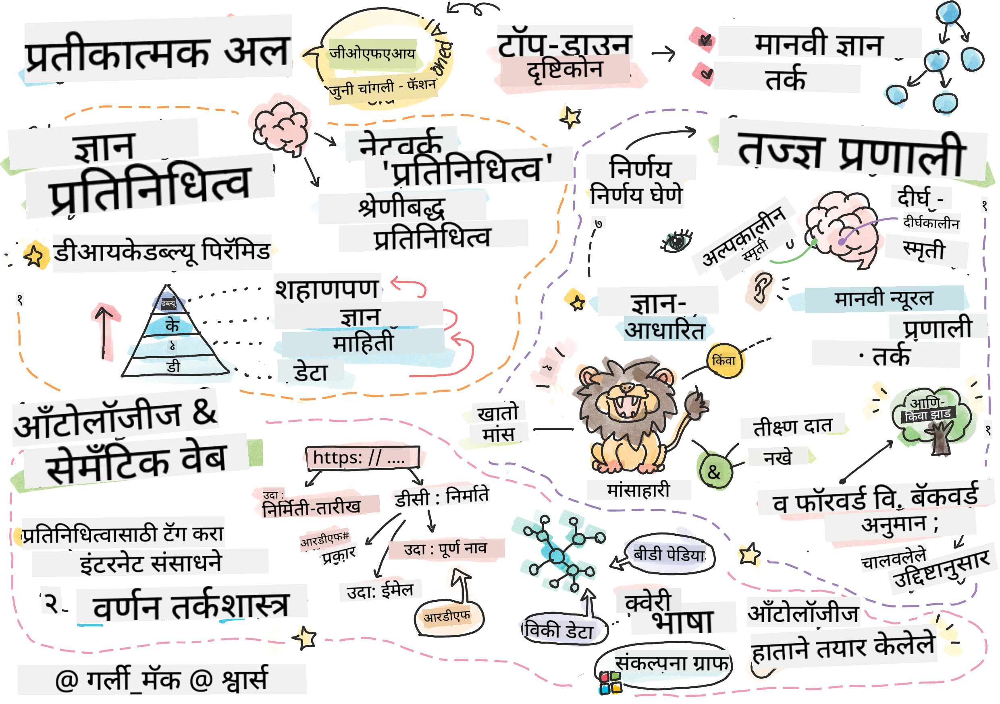
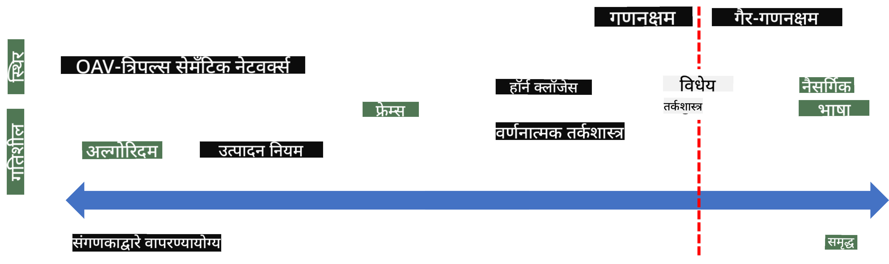
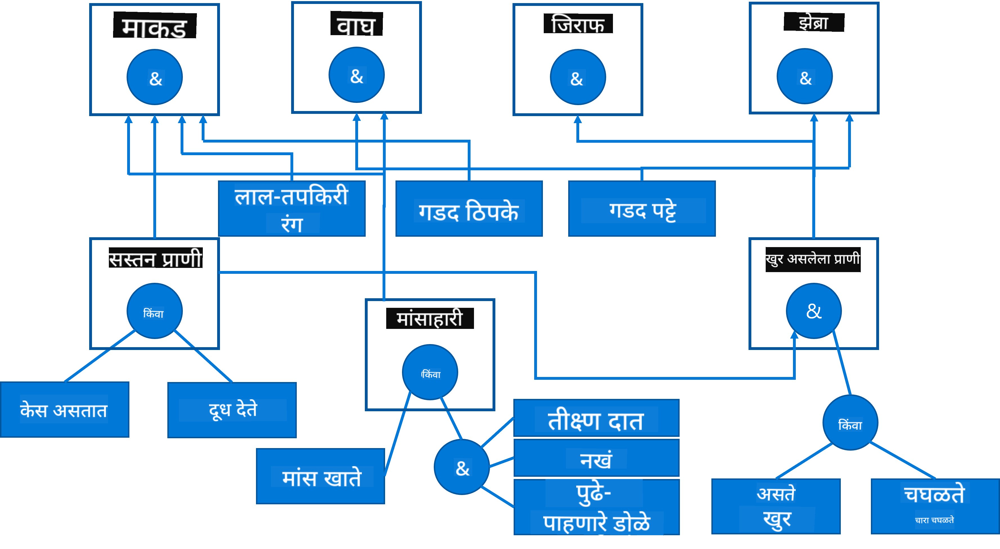

<!--
CO_OP_TRANSLATOR_METADATA:
{
  "original_hash": "7d097f7fda9166ead615e4c34552381b",
  "translation_date": "2025-09-23T07:07:47+00:00",
  "source_file": "lessons/2-Symbolic/README.md",
  "language_code": "mr"
}
-->
# ज्ञानाचे प्रतिनिधित्व आणि तज्ज्ञ प्रणाली



> [Tomomi Imura](https://twitter.com/girlie_mac) यांचे स्केच नोट

कृत्रिम बुद्धिमत्तेचा शोध हा ज्ञान शोधण्यावर आधारित आहे, ज्यामुळे मानव जसा जगाचा अर्थ लावतो तसा संगणकही लावू शकेल. पण हे कसे साध्य करायचे?

## [पूर्व-व्याख्यान प्रश्नमंजुषा](https://ff-quizzes.netlify.app/en/ai/quiz/3)

AI च्या सुरुवातीच्या काळात, बुद्धिमान प्रणाली तयार करण्यासाठी टॉप-डाउन दृष्टिकोन (मागील धड्यात चर्चा केली) लोकप्रिय होता. कल्पना अशी होती की लोकांकडून ज्ञान काढून ते मशीन-वाचनीय स्वरूपात रूपांतरित करावे आणि नंतर त्याचा वापर करून स्वयंचलितपणे समस्या सोडवाव्या. या दृष्टिकोनावर दोन मोठ्या कल्पनांवर आधारित होते:

* ज्ञानाचे प्रतिनिधित्व
* तर्कशक्ती

## ज्ञानाचे प्रतिनिधित्व

Symbolic AI मधील एक महत्त्वाची संकल्पना म्हणजे **ज्ञान**. *माहिती* किंवा *डेटा* यापासून ज्ञान वेगळे कसे आहे हे समजून घेणे महत्त्वाचे आहे. उदाहरणार्थ, एखाद्याला असे म्हणता येईल की पुस्तके ज्ञानाने भरलेली असतात, कारण पुस्तके अभ्यास करून एखादी व्यक्ती तज्ज्ञ बनू शकते. परंतु, पुस्तके जे काही ठेवतात ते प्रत्यक्षात *डेटा* म्हणतात, आणि पुस्तके वाचून आणि हा डेटा आपल्या जगाच्या मॉडेलमध्ये समाकलित करून आपण हा डेटा ज्ञानामध्ये रूपांतरित करतो.

> ✅ **ज्ञान** हे आपल्या डोक्यात असते आणि जगाबद्दलची आपली समज दर्शवते. हे सक्रिय **शिकण्याच्या** प्रक्रियेद्वारे प्राप्त होते, जे आपल्याला मिळालेल्या माहितीच्या तुकड्यांना आपल्या जगाच्या सक्रिय मॉडेलमध्ये समाकलित करते.

बहुतेक वेळा, आपण ज्ञानाचे कठोरपणे परिभाषित करत नाही, परंतु [DIKW Pyramid](https://en.wikipedia.org/wiki/DIKW_pyramid) चा वापर करून त्याला संबंधित संकल्पनांशी संरेखित करतो. यात खालील संकल्पना समाविष्ट आहेत:

* **डेटा** हे भौतिक माध्यमात सादर केलेले काहीतरी आहे, जसे की लिहिलेला मजकूर किंवा बोललेले शब्द. डेटा मानवांपासून स्वतंत्रपणे अस्तित्वात असतो आणि लोकांमध्ये हस्तांतरित केला जाऊ शकतो.
* **माहिती** म्हणजे आपण आपल्या डोक्यात डेटा कसा समजतो. उदाहरणार्थ, जेव्हा आपण *संगणक* हा शब्द ऐकतो, तेव्हा आपल्याला त्याबद्दल काही समज असते.
* **ज्ञान** म्हणजे माहिती आपल्या जगाच्या मॉडेलमध्ये समाकलित केली जाते. उदाहरणार्थ, एकदा आपण संगणक काय आहे हे शिकल्यावर, आपल्याला त्याचे कार्य कसे होते, त्याची किंमत किती आहे आणि त्याचा उपयोग कशासाठी होतो याबद्दल काही कल्पना येते. परस्पर संबंधित संकल्पनांचे हे जाळे आपले ज्ञान तयार करते.
* **शहाणपणा** हे आपल्या जगाच्या समजण्याचे आणखी एक स्तर आहे, आणि ते *मेटा-ज्ञान* दर्शवते, उदा. ज्ञान कसे आणि कधी वापरावे याबद्दल काही कल्पना.


*Image [Wikipedia वरून](https://commons.wikimedia.org/w/index.php?curid=37705247), By Longlivetheux - Own work, CC BY-SA 4.0*

म्हणून, **ज्ञानाचे प्रतिनिधित्व** करण्याची समस्या म्हणजे संगणकाच्या आत डेटा स्वरूपात ज्ञानाचे प्रतिनिधित्व करण्याचा काही प्रभावी मार्ग शोधणे, जेणेकरून ते स्वयंचलितपणे वापरता येईल. याकडे एक स्पेक्ट्रम म्हणून पाहिले जाऊ शकते:



> Image by [Dmitry Soshnikov](http://soshnikov.com)

* डाव्या बाजूला, ज्ञानाचे अतिशय सोपे प्रकार आहेत जे संगणकाद्वारे प्रभावीपणे वापरले जाऊ शकतात. सर्वात सोपा प्रकार म्हणजे अल्गोरिदमिक, जेव्हा ज्ञान संगणक प्रोग्रामद्वारे सादर केले जाते. तथापि, हे ज्ञान सादर करण्याचा सर्वोत्तम मार्ग नाही, कारण ते लवचिक नाही. आपल्या डोक्यातील ज्ञान अनेकदा अल्गोरिदमिक नसते.
* उजव्या बाजूला, नैसर्गिक मजकूरासारख्या सादरीकरणे आहेत. ते सर्वात शक्तिशाली आहे, परंतु स्वयंचलित तर्कासाठी वापरता येत नाही.

> ✅ एक मिनिट विचार करा की तुम्ही तुमच्या डोक्यात ज्ञान कसे सादर करता आणि ते नोट्समध्ये रूपांतरित करता. तुमच्यासाठी स्मरणशक्ती सुधारण्यासाठी कोणते विशिष्ट स्वरूप चांगले कार्य करते?

## संगणक ज्ञान प्रतिनिधित्व वर्गीकरण

आम्ही संगणक ज्ञान प्रतिनिधित्व पद्धती खालील श्रेणींमध्ये वर्गीकृत करू शकतो:

* **नेटवर्क प्रतिनिधित्व** हे आपल्या डोक्यात परस्पर संबंधित संकल्पनांचे नेटवर्क असल्याच्या तथ्यावर आधारित आहे. आम्ही संगणकाच्या आत ग्राफ म्हणून समान नेटवर्क पुनरुत्पादित करण्याचा प्रयत्न करू शकतो - ज्याला **सामान्य नेटवर्क** म्हणतात.

1. **ऑब्जेक्ट-अट्रिब्युट-वॅल्यू ट्रिपलेट्स** किंवा **अट्रिब्युट-वॅल्यू पेअर्स**. ग्राफ संगणकाच्या आत नोड्स आणि एजेसच्या यादी म्हणून सादर केला जाऊ शकतो, म्हणून आम्ही ऑब्जेक्ट्स, अट्रिब्युट्स आणि व्हॅल्यूज असलेल्या ट्रिपलेट्सच्या यादीद्वारे सामान्य नेटवर्क सादर करू शकतो. उदाहरणार्थ, आम्ही प्रोग्रामिंग भाषांबद्दल खालील ट्रिपलेट्स तयार करतो:

Object | Attribute | Value
-------|-----------|------
Python | is | Untyped-Language
Python | invented-by | Guido van Rossum
Python | block-syntax | indentation
Untyped-Language | doesn't have | type definitions

> ✅ विचार करा की ट्रिपलेट्स इतर प्रकारचे ज्ञान सादर करण्यासाठी कसे वापरले जाऊ शकतात.

2. **हायरार्किकल प्रतिनिधित्व** हे दर्शवते की आपण आपल्या डोक्यात वस्तूंची श्रेणी तयार करतो. उदाहरणार्थ, आपल्याला माहित आहे की कॅनरी हा पक्षी आहे, आणि सर्व पक्ष्यांना पंख असतात. आपल्याला कॅनरीचा रंग कसा असतो, त्यांचा उड्डाणाचा वेग काय असतो याबद्दल काही कल्पना असते.

   - **फ्रेम प्रतिनिधित्व** हे प्रत्येक वस्तू किंवा वस्तूंच्या वर्गाचे **फ्रेम** म्हणून प्रतिनिधित्व करण्यावर आधारित आहे ज्यामध्ये **स्लॉट्स** असतात. स्लॉट्समध्ये संभाव्य डीफॉल्ट मूल्ये, मूल्य निर्बंध किंवा साठवलेली प्रक्रिया असते जी स्लॉटचे मूल्य मिळवण्यासाठी कॉल केली जाऊ शकते. सर्व फ्रेम्स ऑब्जेक्ट-ओरिएंटेड प्रोग्रामिंग भाषांमधील ऑब्जेक्ट हायरार्कीप्रमाणे हायरार्की तयार करतात.
   - **परिदृश्ये** ही फ्रेम्सचा एक विशेष प्रकार आहे जी वेळोवेळी उलगडणाऱ्या जटिल परिस्थितीचे प्रतिनिधित्व करते.

**Python**

Slot | Value | Default value | Interval |
-----|-------|---------------|----------|
Name | Python | | |
Is-A | Untyped-Language | | |
Variable Case | | CamelCase | |
Program Length | | | 5-5000 lines |
Block Syntax | Indent | | |

3. **प्रोसीजरल प्रतिनिधित्व** हे अशा क्रियांच्या यादीद्वारे ज्ञान सादर करण्यावर आधारित आहे ज्या विशिष्ट परिस्थिती उद्भवल्यावर अंमलात आणल्या जाऊ शकतात.
   - उत्पादन नियम हे if-then स्टेटमेंट्स आहेत जे आपल्याला निष्कर्ष काढण्यास अनुमती देतात. उदाहरणार्थ, डॉक्टरकडे असा नियम असू शकतो की **जर** रुग्णाला उच्च तापमान **किंवा** रक्त चाचणीत C-reactive प्रोटीनचे उच्च स्तर असतील **तर** त्याला जळजळ आहे. एकदा आपण परिस्थितींपैकी एकाला सामोरे गेलो की, आपण जळजळबद्दल निष्कर्ष काढू शकतो आणि नंतर त्याचा वापर पुढील तर्कासाठी करू शकतो.
   - अल्गोरिदम्स हे प्रोसीजरल प्रतिनिधित्वाचा आणखी एक प्रकार मानले जाऊ शकते, जरी ते ज्ञान-आधारित प्रणालींमध्ये थेट वापरले जात नाहीत.

4. **तर्कशास्त्र** हे मूळतः अॅरिस्टॉटलने सार्वत्रिक मानवी ज्ञान सादर करण्याच्या मार्ग म्हणून प्रस्तावित केले होते.
   - Predicate Logic ही एक गणितीय सिद्धांत आहे जी संगणनक्षम नसते, म्हणून सामान्यतः त्याचा काही उपसंच वापरला जातो, जसे की Prolog मध्ये वापरलेले Horn clauses.
   - Descriptive Logic ही तर्कशास्त्र प्रणालींची कुटुंब आहे जी वस्तूंच्या हायरार्कीज आणि वितरित ज्ञान प्रतिनिधित्व जसे *सामान्य वेब* सादर करण्यासाठी आणि तर्क करण्यासाठी वापरली जाते.

## तज्ज्ञ प्रणाली

Symbolic AI च्या सुरुवातीच्या यशांपैकी एक म्हणजे **तज्ज्ञ प्रणाली** - संगणक प्रणाली जी मर्यादित समस्या क्षेत्रात तज्ज्ञ म्हणून कार्य करण्यासाठी डिझाइन केली गेली होती. त्या **ज्ञान बेस** वर आधारित होत्या, जे एका किंवा अधिक मानवी तज्ज्ञांकडून काढले गेले होते, आणि त्यामध्ये **तर्क इंजिन** होते जे त्यावर काही तर्कशक्ती अंमलात आणत होते.

 | 
---------------------------------------------|------------------------------------------------
मानवी न्यूरल प्रणालीची साधी रचना | ज्ञान-आधारित प्रणालीची आर्किटेक्चर

तज्ज्ञ प्रणाली मानवी तर्क प्रणालीसारखी तयार केली जाते, ज्यामध्ये **अल्पकालीन स्मृती** आणि **दीर्घकालीन स्मृती** असते. त्याचप्रमाणे, ज्ञान-आधारित प्रणालींमध्ये खालील घटक वेगळे केले जातात:

* **समस्या स्मृती**: सध्या सोडवली जात असलेल्या समस्येबद्दलचे ज्ञान ठेवते, उदा. रुग्णाचे तापमान किंवा रक्तदाब, त्याला जळजळ आहे की नाही इ. हे ज्ञान **स्थिर ज्ञान** म्हणून ओळखले जाते, कारण ते सध्या आपल्याला माहित असलेल्या समस्येचे स्नॅपशॉट ठेवते - ज्याला *समस्या स्थिती* म्हणतात.
* **ज्ञान बेस**: समस्या क्षेत्राबद्दल दीर्घकालीन ज्ञान सादर करते. हे मानवी तज्ज्ञांकडून मॅन्युअली काढले जाते आणि सल्लामसलत दरम्यान बदलत नाही. कारण ते आपल्याला एका समस्या स्थितीतून दुसऱ्या स्थितीत नेव्हिगेट करण्यास अनुमती देते, म्हणून याला **डायनॅमिक ज्ञान** असेही म्हणतात.
* **तर्क इंजिन**: समस्या स्थिती जागेत शोध प्रक्रिया समन्वयित करते, आवश्यक असल्यास वापरकर्त्याला प्रश्न विचारते. हे प्रत्येक स्थितीसाठी योग्य नियम शोधण्यास जबाबदार आहे.

उदाहरण म्हणून, खालील तज्ज्ञ प्रणाली विचार करूया जी प्राण्याचे शारीरिक वैशिष्ट्यांवर आधारित निर्धारण करते:



> Image by [Dmitry Soshnikov](http://soshnikov.com)

हा आकृती **AND-OR tree** म्हणून ओळखला जातो, आणि तो उत्पादन नियमांच्या संचाचे ग्राफिकल प्रतिनिधित्व आहे. तज्ज्ञाकडून ज्ञान काढण्याच्या सुरुवातीला झाड काढणे उपयुक्त आहे. संगणकाच्या आत ज्ञान सादर करण्यासाठी नियमांचा वापर करणे अधिक सोयीचे आहे:

```
IF the animal eats meat
OR (animal has sharp teeth
    AND animal has claws
    AND animal has forward-looking eyes
) 
THEN the animal is a carnivore
```

आपण लक्षात घेऊ शकता की नियमाच्या डाव्या बाजूला असलेली प्रत्येक अट आणि क्रिया ही वस्तू-अट्रिब्युट-मूल्य (OAV) ट्रिपलेट्स आहेत. **वर्किंग मेमरी** सध्या सोडवली जात असलेल्या समस्येशी संबंधित OAV ट्रिपलेट्सचा संच ठेवते. **नियम इंजिन** अशा नियमांचा शोध घेतो ज्यासाठी अट पूर्ण होते आणि त्यांना लागू करते, कार्यरत मेमरीमध्ये आणखी एक ट्रिपलेट जोडते.

> ✅ तुम्हाला आवडणाऱ्या विषयावर तुमचे स्वतःचे AND-OR tree तयार करा!

### फॉरवर्ड वि. बॅकवर्ड तर्क

वर वर्णन केलेली प्रक्रिया **फॉरवर्ड तर्क** म्हणून ओळखली जाते. ती कार्यरत मेमरीमध्ये उपलब्ध असलेल्या समस्येबद्दल काही प्रारंभिक डेटा घेऊन सुरू होते आणि नंतर खालील तर्क लूप अंमलात आणते:

1. जर लक्ष्य अट कार्यरत मेमरीमध्ये उपस्थित असेल - थांबा आणि निकाल द्या
2. सध्या पूर्ण झालेल्या अटी असलेल्या सर्व नियमांचा शोध घ्या - **संघर्ष संच** प्राप्त करा.
3. **संघर्ष निराकरण** करा - या चरणावर अंमलात आणला जाणारा एक नियम निवडा. वेगवेगळ्या संघर्ष निराकरण रणनीती असू शकतात:
   - ज्ञान बेसमधील लागू होणारा पहिला नियम निवडा
   - यादृच्छिक नियम निवडा
   - *अधिक विशिष्ट* नियम निवडा, म्हणजे डाव्या बाजूला (LHS) सर्वाधिक अटी पूर्ण करणारा नियम
4. निवडलेला नियम लागू करा आणि समस्या स्थितीत नवीन ज्ञानाचा तुकडा घाला
5. चरण 1 पासून पुन्हा सुरू करा.

तथापि, काही प्रकरणांमध्ये आपण समस्येबद्दल रिक्त ज्ञानासह सुरुवात करू शकतो आणि निष्कर्षावर पोहोचण्यास मदत करणारे प्रश्न विचारू शकतो. उदाहरणार्थ, वैद्यकीय निदान करताना, रुग्णाचे निदान करण्यापूर्वी सर्व वैद्यकीय विश्लेषण आधीच अंमलात आणत नाही. त्याऐवजी, निर्णय घेण्याची गरज असताना विश्लेषण करणे अधिक योग्य ठरते.

ही प्रक्रिया **बॅकवर्ड तर्क** वापरून मॉडेल केली जाऊ शकते. ती **लक्ष्य** चालवते - आपण शोधत असलेले अट मूल्य:

1. लक्ष्याचे मूल्य देऊ शकणारे सर्व नियम निवडा (उदा. लक्ष्य उजव्या बाजूला (RHS) असलेल्या नियमांसह) - संघर्ष संच
1. जर या अटसाठी कोणतेही नियम नसतील, किंवा वापरकर्त्याने मूल्य विचारावे असे सांगणारा नियम असेल - विचार करा, अन्यथा:
1. संघर्ष निराकरण रणनीती वापरून एक नियम निवडा जो आपण *गृहीत* म्हणून वापरू - आम्ही त्याचा पुरावा देण्याचा प्रयत्न करू
1. नियमाच्या डाव्या बाजूला असलेल्या सर्व अटींसाठी प्रक्रिया पुनरावृत्ती करा, त्यांना लक्ष्य म्हणून सिद्ध करण्याचा प्रयत्न करा
1. जर कोणत्याही टप्प्यावर प्रक्रिया अयशस्वी झाली - चरण 3 वर दुसरा नियम वापरा.

> ✅ कोणत्या परिस्थितीत फॉरवर्ड तर्क अधिक योग्य आहे? बॅकवर्ड तर्क कधी वापरावा?

### तज्ज्ञ प्रणाली अंमलात आणणे

तज्ज्ञ प्रणाली वेगवेगळ्या साधनांचा वापर करून अंमलात आणली जाऊ शकते:

* काही उच्च-स्तरीय प्रोग्रामिंग भाषेत थेट प्रोग्रामिंग करणे. ही सर्वोत्तम कल्पना नाही, कारण ज्ञान-आधारित प्रणालीचा मुख्य फायदा म्हणजे ज्ञान तर्कशक्तीपासून वेगळे आहे, आणि संभाव्यतः समस्या क्षेत्रातील तज्ज्ञाने तर्क प्रक्रियेच्या तपशीलांशिवाय नियम लिहिणे शक्य असावे.
* **तज्ज्ञ प्रणाली शेल** वापरणे, म्हणजे ज्ञान प्रतिनिधित्व भाषेचा वापर करून ज्ञानाने भरले जाण्यासाठी विशेषतः डिझाइन केलेली प्रणाली.

## ✍️ व्यायाम: प्राणी तर्क

[Animals.ipynb](https://github.com/microsoft/AI-For-Beginners/blob/main/lessons/2-Symbolic/Animals.ipynb) पहा, ज्यामध्ये फॉरवर्ड आणि बॅकवर्ड तर्क तज्ज्ञ प्रणाली अंमलात आणण्याचे उदाहरण दिले आहे.

> **टीप**: हे उदाहरण तुलनेने सोपे आहे आणि तज्ज्ञ प्रणाली कशी दिसते याची कल्पना देते. एकदा तुम्ही अशी प्रणाली तयार करण्यास सुरुवात केली की, तुम्हाला त्यामध्ये काही *बुद्धिमान* वर्तन दिसेल तेव्हा तुम्ही सुमारे 200+ नियमांपर्यंत पोहोचाल. एका टप्प्यावर, नियम इतके जटिल होतात की सर्व नियम लक्षात ठेवणे कठीण होते, आणि अशा वेळी तुम्हाला आश्चर्य वाटू शकते की प्रणाली विशिष्ट निर्णय का घेत आहे. तथापि, ज्ञान-आधारित प्रणालीचे महत्त्वाचे वैशिष्ट्य म्हणजे तुम्ही नेहमी *स्पष्टीकरण* देऊ शकता की कोणताही निर्णय कसा घेतला गेला.

## ऑंटोलॉजी आणि सामान्य वेब

20व्या शतकाच्या शेवटी इंटरनेट संसाधनांचे वर्णन करण्यासाठी ज्ञान प्रतिनिधित्व वापरण्याची एक पुढाकार होती, जेणेकरून विशिष्ट क्वेरींशी संबंधित संसाधने शोधणे शक
- XML आधारित भाषांची एक कुटुंब: RDF (Resource Description Framework), RDFS (RDF Schema), OWL (Ontology Web Language).

सिमॅंटिक वेबमधील एक मुख्य संकल्पना म्हणजे **Ontology**. याचा अर्थ काही औपचारिक ज्ञान प्रतिनिधित्व वापरून समस्या क्षेत्राची स्पष्ट तपशीलवार माहिती. सर्वात सोपी Ontology फक्त समस्या क्षेत्रातील वस्तूंची श्रेणी असू शकते, परंतु अधिक जटिल Ontologies मध्ये निष्कर्ष काढण्यासाठी वापरता येणारे नियम समाविष्ट असतात.

सिमॅंटिक वेबमध्ये, सर्व प्रतिनिधित्व त्रिकुटांवर आधारित असतात. प्रत्येक वस्तू आणि प्रत्येक संबंध URI द्वारे अद्वितीयपणे ओळखले जातात. उदाहरणार्थ, जर आपण असे सांगायचे असेल की हे AI Curriculum Dmitry Soshnikov यांनी 1 जानेवारी 2022 रोजी विकसित केले आहे - येथे आपण वापरू शकणारे त्रिकुट आहेत:


```
http://github.com/microsoft/ai-for-beginners http://www.example.com/terms/creation-date “Jan 13, 2007”
http://github.com/microsoft/ai-for-beginners http://purl.org/dc/elements/1.1/creator http://soshnikov.com
```

> ✅ येथे `http://www.example.com/terms/creation-date` आणि `http://purl.org/dc/elements/1.1/creator` हे *creator* आणि *creation date* या संकल्पनांना व्यक्त करण्यासाठी काही सुप्रसिद्ध आणि सार्वत्रिकपणे स्वीकारलेले URI आहेत.

अधिक जटिल प्रकरणात, जर आपल्याला निर्मात्यांची यादी परिभाषित करायची असेल, तर आपण RDF मध्ये परिभाषित केलेल्या काही डेटा संरचना वापरू शकतो.


> वरील आकृत्या [Dmitry Soshnikov](http://soshnikov.com) यांनी तयार केल्या आहेत.

सिमॅंटिक वेब तयार करण्याची प्रगती शोध इंजिन आणि नैसर्गिक भाषा प्रक्रिया तंत्रांच्या यशामुळे काही प्रमाणात मंदावली, ज्यामुळे मजकुरातून संरचित डेटा काढणे शक्य झाले. तथापि, काही क्षेत्रांमध्ये Ontologies आणि ज्ञान बेस टिकवून ठेवण्यासाठी अजूनही महत्त्वपूर्ण प्रयत्न केले जात आहेत. काही उल्लेखनीय प्रकल्प:

* [WikiData](https://wikidata.org/) हे Wikipedia शी संबंधित मशीन वाचण्यायोग्य ज्ञान बेसचे संग्रह आहे. बहुतेक डेटा Wikipedia *InfoBoxes* मधून, म्हणजेच Wikipedia पृष्ठांतील संरचित सामग्रीच्या तुकड्यांमधून काढला जातो. तुम्ही [SPARQL](https://query.wikidata.org/) वापरून WikiData क्वेरी करू शकता, जो सिमॅंटिक वेबसाठी एक विशेष क्वेरी भाषा आहे. येथे एक नमुना क्वेरी आहे जी मानवांमध्ये सर्वात लोकप्रिय डोळ्यांच्या रंगांचे प्रदर्शन करते:

```sparql
#defaultView:BubbleChart
SELECT ?eyeColorLabel (COUNT(?human) AS ?count)
WHERE
{
  ?human wdt:P31 wd:Q5.       # human instance-of homo sapiens
  ?human wdt:P1340 ?eyeColor. # human eye-color ?eyeColor
  SERVICE wikibase:label { bd:serviceParam wikibase:language "en". }
}
GROUP BY ?eyeColorLabel
```

* [DBpedia](https://www.dbpedia.org/) हा WikiData सारखाच आणखी एक प्रयत्न आहे.

> ✅ जर तुम्हाला स्वतःचे Ontologies तयार करण्याचा किंवा विद्यमान Ontologies उघडण्याचा प्रयोग करायचा असेल, तर [Protégé](https://protege.stanford.edu/) नावाचा एक उत्कृष्ट व्हिज्युअल Ontology संपादक आहे. ते डाउनलोड करा किंवा ऑनलाइन वापरा.


*Web Protégé संपादक Romanov Family Ontology सह उघडलेला. Dmitry Soshnikov यांनी घेतलेला स्क्रीनशॉट*

## ✍️ व्यायाम: एक कुटुंब Ontology

[FamilyOntology.ipynb](https://github.com/Ezana135/AI-For-Beginners/blob/main/lessons/2-Symbolic/FamilyOntology.ipynb) पहा, ज्यामध्ये सिमॅंटिक वेब तंत्रांचा वापर करून कुटुंबातील नातेसंबंधांबद्दल विचार करण्याचे उदाहरण दिले आहे. आपण सामान्य GEDCOM स्वरूपात प्रतिनिधित्व केलेल्या कुटुंबाच्या झाडाचा आणि कुटुंबातील नातेसंबंधांची Ontology घेऊन दिलेल्या व्यक्तींच्या संचासाठी सर्व कुटुंब नातेसंबंधांचा ग्राफ तयार करू.

## Microsoft Concept Graph

बहुतेक प्रकरणांमध्ये, Ontologies काळजीपूर्वक हाताने तयार केल्या जातात. तथापि, नैसर्गिक भाषा मजकुरासारख्या असंरचित डेटामधून Ontologies **माइन** करणे देखील शक्य आहे.

Microsoft Research ने केलेल्या अशाच एका प्रयत्नातून [Microsoft Concept Graph](https://blogs.microsoft.com/ai/microsoft-researchers-release-graph-that-helps-machines-conceptualize/?WT.mc_id=academic-77998-cacaste) तयार झाले.

हे `is-a` वारसा संबंध वापरून गटबद्ध केलेल्या घटकांचा मोठा संग्रह आहे. हे "Microsoft म्हणजे काय?" यासारख्या प्रश्नांची उत्तरे देण्यास अनुमती देते - उत्तर असे काहीतरी असेल: "एक कंपनी 0.87 संभाव्यतेसह, आणि एक ब्रँड 0.75 संभाव्यतेसह".

Graph REST API म्हणून किंवा सर्व घटक जोड्या सूचीबद्ध करणाऱ्या मोठ्या डाउनलोड करण्यायोग्य मजकूर फाइल म्हणून उपलब्ध आहे.

## ✍️ व्यायाम: एक Concept Graph

[MSConceptGraph.ipynb](https://github.com/microsoft/AI-For-Beginners/blob/main/lessons/2-Symbolic/MSConceptGraph.ipynb) नोटबुक वापरून पहा, ज्यामध्ये Microsoft Concept Graph वापरून बातम्यांच्या लेखांना विविध श्रेणींमध्ये गटबद्ध कसे करता येईल हे दाखवले आहे.

## निष्कर्ष

आजकाल, AI ला अनेकदा *Machine Learning* किंवा *Neural Networks* चे समानार्थी मानले जाते. तथापि, मानव देखील स्पष्ट विचार प्रदर्शित करतो, जे सध्या Neural Networks द्वारे हाताळले जात नाही. वास्तविक जगातील प्रकल्पांमध्ये, स्पष्ट विचार अजूनही अशा कार्यांसाठी वापरला जातो ज्यासाठी स्पष्टीकरण आवश्यक असते, किंवा प्रणालीच्या वर्तनात नियंत्रित पद्धतीने बदल करण्याची क्षमता असते.

## 🚀 आव्हान

या धड्याशी संबंधित Family Ontology नोटबुकमध्ये, कुटुंबाच्या झाडातील इतर नातेसंबंधांसह प्रयोग करण्याची संधी आहे. कुटुंबाच्या झाडातील लोकांमधील नवीन संबंध शोधण्याचा प्रयत्न करा.

## [Post-lecture quiz](https://ff-quizzes.netlify.app/en/ai/quiz/4)

## पुनरावलोकन आणि स्व-अभ्यास

इंटरनेटवर संशोधन करा आणि अशा क्षेत्रांचा शोध घ्या जिथे मानवांनी ज्ञानाचे प्रमाण आणि कोडिफिकेशन करण्याचा प्रयत्न केला आहे. Bloom's Taxonomy बद्दल माहिती मिळवा आणि इतिहासात जाऊन मानवांनी त्यांच्या जगाचा अर्थ लावण्याचा प्रयत्न कसा केला हे जाणून घ्या. Linnaeus ने जीवसृष्टींची वर्गवारी तयार करण्यासाठी केलेले कार्य आणि Dmitri Mendeleev ने रासायनिक घटकांचे वर्णन आणि गटबद्ध करण्याचा मार्ग कसा तयार केला हे पाहा. तुम्हाला आणखी कोणते मनोरंजक उदाहरणे सापडतात?

**असाइनमेंट**: [Build an Ontology](assignment.md)

---

