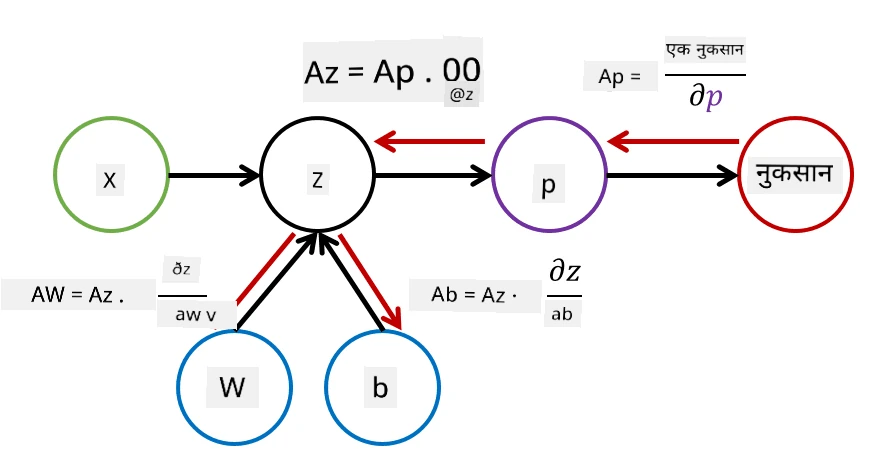

# न्यूरल नेटवर्क्सची ओळख. मल्टी-लेयर्ड परसेप्ट्रॉन

मागील विभागात, तुम्ही सर्वात सोपा न्यूरल नेटवर्क मॉडेल - एक-स्तरीय परसेप्ट्रॉन, एक रेषीय दोन-वर्ग वर्गीकरण मॉडेल, याबद्दल शिकले.

या विभागात आपण या मॉडेलला अधिक लवचीक फ्रेमवर्कमध्ये विस्तारित करू, ज्यामुळे आपल्याला खालील गोष्टी करता येतील:

* **मल्टी-क्लास वर्गीकरण** दोन-वर्ग वर्गीकरणाच्या व्यतिरिक्त
* **रेग्रेशन समस्या** सोडवणे वर्गीकरणाच्या व्यतिरिक्त
* रेषीय पद्धतीने विभाजित न होणारे वर्ग वेगळे करणे

तसेच, आपण Python मध्ये आपले स्वतःचे मॉड्युलर फ्रेमवर्क विकसित करू, ज्यामुळे आपल्याला विविध न्यूरल नेटवर्क आर्किटेक्चर तयार करता येतील.

## [पूर्व-व्याख्यान क्विझ](https://ff-quizzes.netlify.app/en/ai/quiz/7)

## मशीन लर्निंगचे औपचारिककरण

मशीन लर्निंग समस्येचे औपचारिककरण करून सुरुवात करूया. समजा आपल्याकडे प्रशिक्षण डेटासेट **X** आणि त्याचे लेबल्स **Y** आहेत, आणि आपल्याला एक मॉडेल *f* तयार करायचे आहे जे सर्वात अचूक अंदाज करेल. अंदाजांची गुणवत्ता **Loss function** &lagran; ने मोजली जाते. खालील लॉस फंक्शन्स सामान्यतः वापरल्या जातात:

* रिग्रेशन समस्येसाठी, जिथे आपल्याला एक संख्या अंदाज करायची आहे, आपण **absolute error** &sum;i|f(x(i))-y(i)| किंवा **squared error** &sum;i(f(x(i))-y(i))2 वापरू शकतो.
* वर्गीकरणासाठी, आपण **0-1 loss** (जे मूलतः मॉडेलची **accuracy** आहे) किंवा **logistic loss** वापरतो.

एक-स्तरीय परसेप्ट्रॉनसाठी, फंक्शन *f* एक रेषीय फंक्शन म्हणून परिभाषित केले गेले होते *f(x)=wx+b* (इथे *w* हे वजन मॅट्रिक्स आहे, *x* हे इनपुट वैशिष्ट्यांचे वेक्टर आहे, आणि *b* बायस वेक्टर आहे). विविध न्यूरल नेटवर्क आर्किटेक्चरसाठी, ही फंक्शन अधिक जटिल स्वरूप घेऊ शकते.

> वर्गीकरणाच्या बाबतीत, संबंधित वर्गांचे संभाव्यतेचे नेटवर्क आउटपुट मिळवणे अनेकदा आवश्यक असते. यादृच्छिक संख्यांना संभाव्यतेमध्ये रूपांतरित करण्यासाठी (उदा. आउटपुट सामान्यीकरणासाठी), आपण **softmax** फंक्शन &sigma; वापरतो, आणि फंक्शन *f* बनते *f(x)=&sigma;(wx+b)*

वरील *f* च्या परिभाषेत, *w* आणि *b* यांना **parameters** &theta;=⟨*w,b*⟩ म्हणतात. दिलेल्या डेटासेट ⟨**X**,**Y**⟩ वर आधारित, आपण संपूर्ण डेटासेटवरील एकूण त्रुटी &theta; च्या फंक्शन म्हणून मोजू शकतो.

> ✅ **न्यूरल नेटवर्क प्रशिक्षणाचा उद्देश म्हणजे &theta; पॅरामीटर्स बदलून त्रुटी कमी करणे**

## ग्रेडियंट डिसेंट ऑप्टिमायझेशन

फंक्शन ऑप्टिमायझेशनसाठी एक प्रसिद्ध पद्धत म्हणजे **gradient descent**. कल्पना अशी आहे की आपण लॉस फंक्शनचा डेरिव्हेटिव्ह (मल्टी-डायमेन्शनल केससाठी **gradient** म्हणतात) पॅरामीटर्सच्या संदर्भात मोजू शकतो, आणि पॅरामीटर्स अशा प्रकारे बदलू शकतो की त्रुटी कमी होईल. हे पुढीलप्रमाणे औपचारिक केले जाऊ शकते:

* पॅरामीटर्स काही यादृच्छिक मूल्यांनी प्रारंभ करा w(0), b(0)
* खालील चरण अनेक वेळा पुन्हा करा:
    - w(i+1) = w(i)-&eta;&part;&lagran;/&part;w
    - b(i+1) = b(i)-&eta;&part;&lagran;/&part;b

प्रशिक्षणादरम्यान, ऑप्टिमायझेशन चरण संपूर्ण डेटासेट विचारात घेऊन गणना केली पाहिजे (लॉस सर्व प्रशिक्षण नमुन्यांमधून एकत्रितपणे मोजला जातो हे लक्षात ठेवा). परंतु, प्रत्यक्षात आपण डेटासेटचे छोटे भाग घेतो ज्याला **minibatches** म्हणतात, आणि डेटाच्या उपसंचावर आधारित ग्रेडियंट्सची गणना करतो. कारण प्रत्येक वेळी उपसंच यादृच्छिकपणे घेतला जातो, अशा पद्धतीला **stochastic gradient descent** (SGD) म्हणतात.

## मल्टी-लेयर्ड परसेप्ट्रॉन आणि बॅकप्रोपागेशन

एक-स्तरीय नेटवर्क, जसे आपण वर पाहिले, रेषीय पद्धतीने विभाजित वर्ग वर्गीकृत करण्यास सक्षम आहे. अधिक समृद्ध मॉडेल तयार करण्यासाठी, आपण नेटवर्कच्या अनेक स्तरांना एकत्र करू शकतो. गणितीयदृष्ट्या याचा अर्थ असा होईल की फंक्शन *f* अधिक जटिल स्वरूप घेईल आणि अनेक चरणांमध्ये गणना केली जाईल:
* z1=w1x+b1
* z2=w2&alpha;(z1)+b2
* f = &sigma;(z2)

इथे, &alpha; ही **non-linear activation function** आहे, &sigma; ही softmax फंक्शन आहे, आणि पॅरामीटर्स &theta;=<*w1,b1,w2,b2*> आहेत.

ग्रेडियंट डिसेंट अल्गोरिदम तसाच राहील, परंतु ग्रेडियंट्सची गणना करणे अधिक कठीण होईल. चेन डिफरेंशिएशन नियम दिल्यास, आपण डेरिव्हेटिव्ह्जची गणना खालीलप्रमाणे करू शकतो:

* &part;&lagran;/&part;w2 = (&part;&lagran;/&part;&sigma;)(&part;&sigma;/&part;z2)(&part;z2/&part;w2)
* &part;&lagran;/&part;w1 = (&part;&lagran;/&part;&sigma;)(&part;&sigma;/&part;z2)(&part;z2/&part;&alpha;)(&part;&alpha;/&part;z1)(&part;z1/&part;w1)

> ✅ लॉस फंक्शनच्या पॅरामीटर्सच्या संदर्भात डेरिव्हेटिव्ह्जची गणना करण्यासाठी चेन डिफरेंशिएशन नियम वापरला जातो.

लक्षात घ्या की या सर्व अभिव्यक्तींचा डाव्या बाजूचा भाग समान आहे, आणि त्यामुळे आपण लॉस फंक्शनपासून सुरुवात करून "मागे" संगणकीय ग्राफद्वारे डेरिव्हेटिव्ह्ज प्रभावीपणे गणना करू शकतो. त्यामुळे मल्टी-लेयर्ड परसेप्ट्रॉन प्रशिक्षणाची पद्धत **backpropagation**, किंवा 'backprop' म्हणून ओळखली जाते.

> TODO: प्रतिमेचा संदर्भ

> ✅ आपण बॅकप्रोपचा अधिक तपशीलवार अभ्यास आपल्या नोटबुक उदाहरणात करू.

## निष्कर्ष

या धड्यात, आपण आपले स्वतःचे न्यूरल नेटवर्क लायब्ररी तयार केले आहे, आणि आपण ते साध्या दोन-आयामी वर्गीकरण कार्यासाठी वापरले आहे.

## 🚀 आव्हान

सोबतच्या नोटबुकमध्ये, तुम्ही मल्टी-लेयर्ड परसेप्ट्रॉन तयार करण्यासाठी आणि प्रशिक्षणासाठी स्वतःचे फ्रेमवर्क अंमलात आणाल. तुम्हाला आधुनिक न्यूरल नेटवर्क्स कसे कार्य करतात हे तपशीलवार पाहता येईल.

[OwnFramework](OwnFramework.ipynb) नोटबुककडे जा आणि त्यावर काम करा.

## [व्याख्यानानंतरचा क्विझ](https://ff-quizzes.netlify.app/en/ai/quiz/8)

## पुनरावलोकन आणि स्व-अभ्यास

बॅकप्रोपागेशन हा AI आणि ML मध्ये वापरला जाणारा सामान्य अल्गोरिदम आहे, [अधिक तपशीलवार](https://wikipedia.org/wiki/Backpropagation) अभ्यास करण्यासारखा आहे.

## [असाइनमेंट](lab/README.md)

या प्रयोगशाळेत, तुम्हाला या धड्यात तयार केलेल्या फ्रेमवर्कचा वापर करून MNIST हस्तलिखित अंक वर्गीकरण सोडवायचे आहे.

* [सूचना](lab/README.md)
* [नोटबुक](lab/MyFW_MNIST.ipynb)

---

