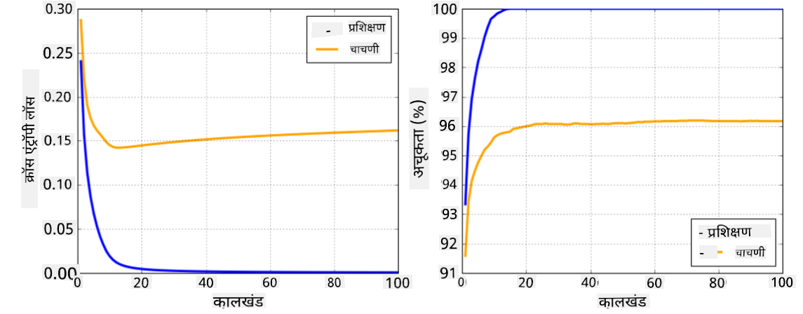

<!--
CO_OP_TRANSLATOR_METADATA:
{
  "original_hash": "2b544f20b796402507fb05a0df893323",
  "translation_date": "2025-08-26T10:32:23+00:00",
  "source_file": "lessons/3-NeuralNetworks/05-Frameworks/README.md",
  "language_code": "mr"
}
-->
# न्यूरल नेटवर्क फ्रेमवर्क्स

आम्ही आधीच शिकले आहे की, न्यूरल नेटवर्क्स प्रभावीपणे प्रशिक्षण देण्यासाठी आपल्याला दोन गोष्टी कराव्या लागतात:

* टेन्सर्सवर ऑपरेट करणे, उदा. गुणाकार, बेरीज, आणि काही फंक्शन्स जसे की सिग्मॉइड किंवा सॉफ्टमॅक्सची गणना करणे
* सर्व अभिव्यक्तींचे ग्रेडियंट्स गणना करणे, जेणेकरून ग्रेडियंट डिसेंट ऑप्टिमायझेशन करता येईल

## [पूर्व-व्याख्यान क्विझ](https://red-field-0a6ddfd03.1.azurestaticapps.net/quiz/105)

`numpy` लायब्ररी पहिल्या भागासाठी उपयुक्त असली तरी, ग्रेडियंट्स गणना करण्यासाठी आपल्याला काही यंत्रणा आवश्यक आहे. [आमच्या फ्रेमवर्कमध्ये](../../../../../lessons/3-NeuralNetworks/04-OwnFramework/OwnFramework.ipynb) जे आम्ही मागील विभागात विकसित केले आहे, आम्हाला `backward` पद्धतीमध्ये सर्व डेरिव्हेटिव्ह फंक्शन्स मॅन्युअली प्रोग्राम करावे लागले, जे बॅकप्रोपागेशन करते. आदर्शतः, फ्रेमवर्कने आपल्याला *कोणत्याही अभिव्यक्तीचे* ग्रेडियंट्स गणना करण्याची संधी द्यायला हवी.

आणखी एक महत्त्वाची गोष्ट म्हणजे GPU किंवा इतर विशेषीकृत गणना युनिट्स, जसे की [TPU](https://en.wikipedia.org/wiki/Tensor_Processing_Unit) वर गणना करण्याची क्षमता असणे. डीप न्यूरल नेटवर्क प्रशिक्षणासाठी *खूप* गणना आवश्यक असते, आणि GPU वर त्या गणनांना पॅरललाइज करणे खूप महत्त्वाचे आहे.

> ✅ 'पॅरललाइज' म्हणजे गणनांना अनेक उपकरणांवर वितरित करणे.

सध्या, दोन सर्वात लोकप्रिय न्यूरल फ्रेमवर्क्स आहेत: [TensorFlow](http://TensorFlow.org) आणि [PyTorch](https://pytorch.org/). दोन्ही CPU आणि GPU वर टेन्सर्ससह ऑपरेट करण्यासाठी लो-लेव्हल API प्रदान करतात. लो-लेव्हल API व्यतिरिक्त, उच्च-स्तरीय API देखील आहे, ज्याला [Keras](https://keras.io/) आणि [PyTorch Lightning](https://pytorchlightning.ai/) म्हणतात.

Low-Level API | [TensorFlow](http://TensorFlow.org) | [PyTorch](https://pytorch.org/)
--------------|-------------------------------------|--------------------------------
High-level API| [Keras](https://keras.io/) | [PyTorch Lightning](https://pytorchlightning.ai/)

**लो-लेव्हल APIs** दोन्ही फ्रेमवर्क्समध्ये तथाकथित **कंप्युटेशनल ग्राफ्स** तयार करण्याची क्षमता असते. हा ग्राफ दिलेल्या इनपुट पॅरामीटर्ससह आउटपुट (सामान्यतः लॉस फंक्शन) कसे गणना करायचे हे परिभाषित करतो आणि GPU वर गणना करण्यासाठी पुश केला जाऊ शकतो, जर तो उपलब्ध असेल. या ग्राफचे डिफरेंशिएशन करण्यासाठी आणि ग्रेडियंट्स गणना करण्यासाठी फंक्शन्स असतात, जे नंतर मॉडेल पॅरामीटर्स ऑप्टिमाइझ करण्यासाठी वापरले जाऊ शकतात.

**हाय-लेव्हल APIs** न्यूरल नेटवर्क्सला **लेयर्सच्या अनुक्रम** म्हणून विचार करतात आणि बहुतेक न्यूरल नेटवर्क्स तयार करणे खूप सोपे करतात. मॉडेल प्रशिक्षण सामान्यतः डेटा तयार करणे आणि नंतर `fit` फंक्शन कॉल करणे आवश्यक असते.

हाय-लेव्हल API आपल्याला सामान्य न्यूरल नेटवर्क्स खूप वेगाने तयार करण्याची परवानगी देते, अनेक तपशीलांबद्दल चिंता न करता. त्याच वेळी, लो-लेव्हल API प्रशिक्षण प्रक्रियेवर अधिक नियंत्रण देते, आणि म्हणूनच ते संशोधनात मोठ्या प्रमाणावर वापरले जाते, जेव्हा आपण नवीन न्यूरल नेटवर्क आर्किटेक्चरशी व्यवहार करत असतो.

हे समजून घेणे देखील महत्त्वाचे आहे की आपण दोन्ही APIs एकत्र वापरू शकतो, उदा. आपण लो-लेव्हल API वापरून आपले स्वतःचे नेटवर्क लेयर आर्किटेक्चर विकसित करू शकतो आणि नंतर ते मोठ्या नेटवर्कमध्ये वापरू शकतो जे हाय-लेव्हल API वापरून तयार केले आणि प्रशिक्षित केले जाते. किंवा आपण हाय-लेव्हल API वापरून लेयर्सच्या अनुक्रमात नेटवर्क परिभाषित करू शकतो आणि नंतर आपला स्वतःचा लो-लेव्हल प्रशिक्षण लूप वापरून ऑप्टिमायझेशन करू शकतो. दोन्ही APIs समान मूलभूत संकल्पना वापरतात आणि ते एकत्र चांगले काम करण्यासाठी डिझाइन केलेले आहेत.

## शिक्षण

या कोर्समध्ये, आम्ही बहुतेक सामग्री PyTorch आणि TensorFlow साठी ऑफर करतो. आपण आपले पसंतीचे फ्रेमवर्क निवडू शकता आणि फक्त संबंधित नोटबुक्समधून जाऊ शकता. जर आपल्याला कोणते फ्रेमवर्क निवडायचे याची खात्री नसेल, तर **PyTorch vs. TensorFlow** बद्दल इंटरनेटवरील काही चर्चा वाचा. आपण दोन्ही फ्रेमवर्क्सकडे पाहून चांगले समजून घेऊ शकता.

जिथे शक्य असेल तिथे, सोपेपणासाठी आम्ही हाय-लेव्हल APIs वापरू. तथापि, आम्हाला विश्वास आहे की न्यूरल नेटवर्क्स कसे कार्य करतात हे मूलभूत पातळीवरून समजून घेणे महत्त्वाचे आहे, म्हणून सुरुवातीला आम्ही लो-लेव्हल API आणि टेन्सर्ससह काम करून सुरुवात करतो. तथापि, जर आपल्याला वेगाने सुरुवात करायची असेल आणि या तपशीलांवर वेळ घालवायचा नसेल, तर आपण ते वगळू शकता आणि थेट हाय-लेव्हल API नोटबुक्समध्ये जाऊ शकता.

## ✍️ सराव: फ्रेमवर्क्स

पुढील नोटबुक्समध्ये आपले शिक्षण सुरू ठेवा:

Low-Level API | [TensorFlow+Keras Notebook](../../../../../lessons/3-NeuralNetworks/05-Frameworks/IntroKerasTF.ipynb) | [PyTorch](../../../../../lessons/3-NeuralNetworks/05-Frameworks/IntroPyTorch.ipynb)
--------------|-------------------------------------|--------------------------------
High-level API| [Keras](../../../../../lessons/3-NeuralNetworks/05-Frameworks/IntroKeras.ipynb) | *PyTorch Lightning*

फ्रेमवर्क्समध्ये प्राविण्य मिळवल्यानंतर, ओव्हरफिटिंगची संकल्पना पुन्हा समजून घेऊया.

# ओव्हरफिटिंग

ओव्हरफिटिंग ही मशीन लर्निंगमधील एक अत्यंत महत्त्वाची संकल्पना आहे, आणि ती योग्य प्रकारे समजून घेणे खूप महत्त्वाचे आहे!

पाच डॉट्स (ग्राफवर `x` ने दर्शविलेले) अंदाज करण्याच्या खालील समस्येचा विचार करा:

 | 
-------------------------|--------------------------
**रेखीय मॉडेल, 2 पॅरामीटर्स** | **नॉन-रेखीय मॉडेल, 7 पॅरामीटर्स**
प्रशिक्षण त्रुटी = 5.3 | प्रशिक्षण त्रुटी = 0
व्हॅलिडेशन त्रुटी = 5.1 | व्हॅलिडेशन त्रुटी = 20

* डावीकडे, आपल्याला चांगली सरळ रेषा अंदाज दिसतो. कारण पॅरामीटर्सची संख्या योग्य आहे, मॉडेल पॉइंट वितरणामागील कल्पना योग्य प्रकारे समजते.
* उजवीकडे, मॉडेल खूप शक्तिशाली आहे. कारण आपल्याकडे फक्त 5 पॉइंट्स आहेत आणि मॉडेलमध्ये 7 पॅरामीटर्स आहेत, ते अशा प्रकारे समायोजित करू शकते की सर्व पॉइंट्समधून जाऊ शकते, ज्यामुळे प्रशिक्षण त्रुटी 0 होते. तथापि, यामुळे मॉडेलला डेटामागील योग्य पॅटर्न समजण्यापासून रोखले जाते, त्यामुळे व्हॅलिडेशन त्रुटी खूप जास्त आहे.

मॉडेलची समृद्धता (पॅरामीटर्सची संख्या) आणि प्रशिक्षण नमुन्यांची संख्या यामध्ये योग्य संतुलन साधणे खूप महत्त्वाचे आहे.

## ओव्हरफिटिंग का होते

  * प्रशिक्षण डेटा पुरेसा नसणे
  * मॉडेल खूप शक्तिशाली असणे
  * इनपुट डेटामध्ये खूप जास्त आवाज असणे

## ओव्हरफिटिंग कसे ओळखावे

वरील ग्राफवरून आपण पाहू शकतो की, ओव्हरफिटिंग खूप कमी प्रशिक्षण त्रुटी आणि खूप जास्त व्हॅलिडेशन त्रुटीने ओळखले जाऊ शकते. सामान्यतः प्रशिक्षणादरम्यान आपण पाहतो की प्रशिक्षण आणि व्हॅलिडेशन त्रुटी कमी होऊ लागतात, आणि नंतर काही वेळाने व्हॅलिडेशन त्रुटी कमी होणे थांबते आणि वाढू लागते. हे ओव्हरफिटिंगचे चिन्ह असेल, आणि आपण या टप्प्यावर प्रशिक्षण थांबवावे (किंवा किमान मॉडेलचे स्नॅपशॉट घ्यावे) याचा संकेत असेल.

## ओव्हरफिटिंग कसे टाळावे

जर आपल्याला दिसत असेल की ओव्हरफिटिंग होत आहे, तर आपण खालीलपैकी एक करू शकता:

 * प्रशिक्षण डेटाची मात्रा वाढवा
 * मॉडेलची जटिलता कमी करा
 * काही [रेग्युलरायझेशन तंत्र](../../4-ComputerVision/08-TransferLearning/TrainingTricks.md) वापरा, जसे की [ड्रॉपआउट](../../4-ComputerVision/08-TransferLearning/TrainingTricks.md#Dropout), ज्याचा आपण नंतर विचार करू.

## ओव्हरफिटिंग आणि बायस-व्हेरियन्स ट्रेडऑफ

ओव्हरफिटिंग हा आकडेवारीतील [बायस-व्हेरियन्स ट्रेडऑफ](https://en.wikipedia.org/wiki/Bias%E2%80%93variance_tradeoff) नावाच्या अधिक सामान्य समस्येचा एक प्रकार आहे. जर आपण आपल्या मॉडेलमधील त्रुटीचे संभाव्य स्रोत विचारात घेतले, तर आपल्याला दोन प्रकारच्या त्रुटी दिसतात:

* **बायस त्रुटी** आमच्या अल्गोरिदमला प्रशिक्षण डेटामधील संबंध योग्य प्रकारे कॅप्चर करण्यात अक्षम असल्यामुळे होतात. हे आमचे मॉडेल पुरेसे शक्तिशाली नसल्यामुळे होऊ शकते (**अंडरफिटिंग**).
* **व्हेरियन्स त्रुटी**, जे मॉडेल इनपुट डेटामधील आवाजाचा अंदाज घेत आहे, त्याऐवजी अर्थपूर्ण संबंध (**ओव्हरफिटिंग**) कॅप्चर करत आहे.

प्रशिक्षणादरम्यान, बायस त्रुटी कमी होते (कारण आमचे मॉडेल डेटा अंदाज घेण्यास शिकते), आणि व्हेरियन्स त्रुटी वाढते. ओव्हरफिटिंग टाळण्यासाठी प्रशिक्षण थांबवणे - मॅन्युअली (जेव्हा आम्ही ओव्हरफिटिंग ओळखतो) किंवा स्वयंचलितपणे (रेग्युलरायझेशनचा परिचय करून) - महत्त्वाचे आहे.

## निष्कर्ष

या धड्यात, आपण दोन सर्वात लोकप्रिय AI फ्रेमवर्क्स, TensorFlow आणि PyTorch साठी विविध APIs मधील फरक शिकला. याशिवाय, आपण एक अत्यंत महत्त्वाचा विषय, ओव्हरफिटिंग, याबद्दल शिकला.

## 🚀 आव्हान

संबंधित नोटबुक्समध्ये, आपल्याला 'कार्य' तळाशी सापडतील; नोटबुक्समधून काम करा आणि कार्ये पूर्ण करा.

## [व्याख्यानानंतरचा क्विझ](https://red-field-0a6ddfd03.1.azurestaticapps.net/quiz/205)

## पुनरावलोकन आणि स्व-अभ्यास

खालील विषयांवर काही संशोधन करा:

- TensorFlow
- PyTorch
- ओव्हरफिटिंग

खालील प्रश्न स्वतःला विचारा:

- TensorFlow आणि PyTorch यामध्ये काय फरक आहे?
- ओव्हरफिटिंग आणि अंडरफिटिंग यामध्ये काय फरक आहे?

## [असाइनमेंट](lab/README.md)

या लॅबमध्ये, आपल्याला PyTorch किंवा TensorFlow वापरून सिंगल- आणि मल्टी-लेयर्ड पूर्णपणे कनेक्टेड नेटवर्क्ससह दोन वर्गीकरण समस्या सोडवण्यास सांगितले आहे.

* [सूचना](lab/README.md)
* [नोटबुक](../../../../../lessons/3-NeuralNetworks/05-Frameworks/lab/LabFrameworks.ipynb)

**अस्वीकरण**:  
हा दस्तऐवज AI भाषांतर सेवा [Co-op Translator](https://github.com/Azure/co-op-translator) वापरून भाषांतरित करण्यात आला आहे. आम्ही अचूकतेसाठी प्रयत्नशील असलो तरी, कृपया लक्षात ठेवा की स्वयंचलित भाषांतरांमध्ये त्रुटी किंवा अचूकतेचा अभाव असू शकतो. मूळ भाषेतील दस्तऐवज हा अधिकृत स्रोत मानला जावा. महत्त्वाच्या माहितीसाठी, व्यावसायिक मानवी भाषांतराची शिफारस केली जाते. या भाषांतराचा वापर करून उद्भवलेल्या कोणत्याही गैरसमज किंवा चुकीच्या अर्थासाठी आम्ही जबाबदार राहणार नाही.