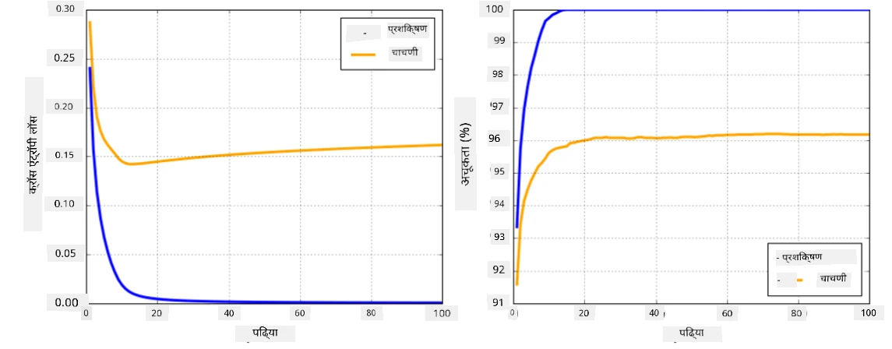

# न्यूरल नेटवर्क फ्रेमवर्क्स

आम्ही आधीच शिकलो आहोत की, न्यूरल नेटवर्क्स कार्यक्षमतेने प्रशिक्षण देण्यासाठी आपल्याला दोन गोष्टी कराव्या लागतात:

* टेन्सर्सवर ऑपरेट करणे, जसे की गुणाकार, बेरीज करणे, आणि काही फंक्शन्स जसे की सिग्मॉइड किंवा सॉफ्टमॅक्सची गणना करणे.
* सर्व एक्सप्रेशन्सचे ग्रेडियंट्स काढणे, जेणेकरून ग्रेडियंट डिसेंट ऑप्टिमायझेशन करता येईल.

## [पूर्व-व्याख्यान क्विझ](https://ff-quizzes.netlify.app/en/ai/quiz/9)

`numpy` लायब्ररी पहिल्या भागासाठी उपयुक्त असली तरी, आपल्याला ग्रेडियंट्स काढण्यासाठी काहीतरी यंत्रणा आवश्यक आहे. [आमच्या फ्रेमवर्कमध्ये](../04-OwnFramework/OwnFramework.ipynb) जे आम्ही मागील विभागात विकसित केले, त्यामध्ये `backward` पद्धतीत सर्व डेरिव्हेटिव्ह फंक्शन्स मॅन्युअली प्रोग्राम करावे लागले, जे बॅकप्रोपेगेशन करते. आदर्शपणे, फ्रेमवर्कने आपल्याला *कोणत्याही एक्सप्रेशनचे* ग्रेडियंट्स काढण्याची संधी द्यायला हवी.

आणखी एक महत्त्वाची गोष्ट म्हणजे GPU किंवा इतर कोणत्याही विशेषीकृत संगणकीय युनिट्सवर गणना करण्याची क्षमता असणे, जसे की [TPU](https://en.wikipedia.org/wiki/Tensor_Processing_Unit). डीप न्यूरल नेटवर्क प्रशिक्षणासाठी *खूप* गणना आवश्यक असते, आणि GPU वर त्या गणनांना पॅरललाइज करणे खूप महत्त्वाचे आहे.

> ✅ 'पॅरललाइज' हा शब्द गणनांना अनेक डिव्हाइसेसवर वितरित करण्याचा अर्थ दर्शवतो.

सध्या, दोन सर्वात लोकप्रिय न्यूरल फ्रेमवर्क्स आहेत: [TensorFlow](http://TensorFlow.org) आणि [PyTorch](https://pytorch.org/). दोन्ही CPU आणि GPU वर टेन्सर्ससह ऑपरेट करण्यासाठी लो-लेव्हल API प्रदान करतात. लो-लेव्हल API व्यतिरिक्त, उच्च-स्तरीय API देखील आहे, ज्याला अनुक्रमे [Keras](https://keras.io/) आणि [PyTorch Lightning](https://pytorchlightning.ai/) म्हणतात.

लो-लेव्हल API | [TensorFlow](http://TensorFlow.org) | [PyTorch](https://pytorch.org/)
--------------|-------------------------------------|--------------------------------
उच्च-स्तरीय API| [Keras](https://keras.io/) | [PyTorch Lightning](https://pytorchlightning.ai/)

**लो-लेव्हल API** दोन्ही फ्रेमवर्क्समध्ये तथाकथित **कंप्युटेशनल ग्राफ्स** तयार करण्याची परवानगी देतात. हा ग्राफ दिलेल्या इनपुट पॅरामिटर्ससह आउटपुट (सामान्यतः लॉस फंक्शन) कसे काढायचे हे परिभाषित करतो, आणि GPU वर गणनेसाठी ढकलला जाऊ शकतो, जर तो उपलब्ध असेल. या कंप्युटेशनल ग्राफचे डिफरेंशिएशन करण्यासाठी आणि ग्रेडियंट्स काढण्यासाठी फंक्शन्स आहेत, जे नंतर मॉडेल पॅरामिटर्स ऑप्टिमाइझ करण्यासाठी वापरले जाऊ शकतात.

**उच्च-स्तरीय API** न्यूरल नेटवर्क्सला **लेअर्सच्या अनुक्रम** म्हणून विचार करतात, आणि बहुतेक न्यूरल नेटवर्क्स तयार करणे खूप सोपे करतात. मॉडेल प्रशिक्षणासाठी सामान्यतः डेटा तयार करणे आणि नंतर `fit` फंक्शन कॉल करणे आवश्यक असते.

उच्च-स्तरीय API आपल्याला सामान्य न्यूरल नेटवर्क्स खूप लवकर तयार करण्याची परवानगी देते, ज्यामुळे अनेक तपशीलांबद्दल काळजी करण्याची गरज नाही. त्याच वेळी, लो-लेव्हल API प्रशिक्षण प्रक्रियेवर अधिक नियंत्रण देते, आणि म्हणूनच ते संशोधनात खूप वापरले जाते, जेव्हा आपण नवीन न्यूरल नेटवर्क आर्किटेक्चर्ससह व्यवहार करत असता.

हे समजून घेणे देखील महत्त्वाचे आहे की आपण दोन्ही API एकत्र वापरू शकता, जसे की आपण लो-लेव्हल API वापरून आपले स्वतःचे नेटवर्क लेयर आर्किटेक्चर विकसित करू शकता, आणि नंतर उच्च-स्तरीय API वापरून तयार केलेल्या मोठ्या नेटवर्कमध्ये ते वापरू शकता. किंवा आपण उच्च-स्तरीय API वापरून लेअर्सच्या अनुक्रमासह नेटवर्क परिभाषित करू शकता, आणि नंतर आपला स्वतःचा लो-लेव्हल प्रशिक्षण लूप वापरून ऑप्टिमायझेशन करू शकता. दोन्ही API समान मूलभूत संकल्पनांचा वापर करतात, आणि ते एकत्र चांगले कार्य करण्यासाठी डिझाइन केलेले आहेत.

## शिकणे

या कोर्समध्ये, आम्ही बहुतेक सामग्री PyTorch आणि TensorFlow साठी प्रदान करतो. आपण आपले प्राधान्य फ्रेमवर्क निवडू शकता आणि फक्त संबंधित नोटबुक्समधून जाऊ शकता. जर आपण कोणते फ्रेमवर्क निवडायचे याबद्दल निश्चित नसाल, तर **PyTorch vs. TensorFlow** याबद्दल इंटरनेटवरील काही चर्चा वाचा. आपण दोन्ही फ्रेमवर्क्सचा अभ्यास करून त्यांची चांगली समज मिळवू शकता.

जिथे शक्य आहे, तिथे सोपेपणासाठी उच्च-स्तरीय API वापरू. तथापि, आम्हाला विश्वास आहे की न्यूरल नेटवर्क्स कसे कार्य करतात हे मूलभूत पातळीवरून समजून घेणे महत्त्वाचे आहे, म्हणून सुरुवातीला आम्ही लो-लेव्हल API आणि टेन्सर्ससह काम करून सुरुवात करू. तथापि, जर आपण वेगाने सुरुवात करू इच्छित असाल आणि या तपशीलांवर जास्त वेळ घालवू इच्छित नसाल, तर आपण ते वगळू शकता आणि थेट उच्च-स्तरीय API नोटबुक्समध्ये जाऊ शकता.

## ✍️ सराव: फ्रेमवर्क्स

पुढील नोटबुक्समध्ये आपले शिक्षण सुरू ठेवा:

लो-लेव्हल API | [TensorFlow+Keras Notebook](IntroKerasTF.ipynb) | [PyTorch](IntroPyTorch.ipynb)
--------------|-------------------------------------|--------------------------------
उच्च-स्तरीय API| [Keras](IntroKeras.ipynb) | *PyTorch Lightning*

फ्रेमवर्क्समध्ये प्रवीण झाल्यानंतर, ओव्हरफिटिंगच्या संकल्पनेचा आढावा घेऊया.

# ओव्हरफिटिंग

ओव्हरफिटिंग ही मशीन लर्निंगमधील एक अत्यंत महत्त्वाची संकल्पना आहे, आणि ती योग्य प्रकारे समजून घेणे खूप महत्त्वाचे आहे!

खालीलप्रमाणे 5 डॉट्स (ग्राफ्सवर `x` ने दर्शविलेले) अंदाज लावण्याच्या समस्येचा विचार करा:

 | 
-------------------------|--------------------------
**रेखीय मॉडेल, 2 पॅरामिटर्स** | **नॉन-रेखीय मॉडेल, 7 पॅरामिटर्स**
प्रशिक्षण त्रुटी = 5.3 | प्रशिक्षण त्रुटी = 0
व्हॅलिडेशन त्रुटी = 5.1 | व्हॅलिडेशन त्रुटी = 20

* डावीकडे, आपल्याला चांगले सरळ रेषेचे अंदाज दिसतो. कारण पॅरामिटर्सची संख्या योग्य आहे, मॉडेलला पॉइंट वितरणामागील कल्पना योग्य प्रकारे समजते.
* उजवीकडे, मॉडेल खूप शक्तिशाली आहे. कारण आपल्याकडे फक्त 5 पॉइंट्स आहेत आणि मॉडेलमध्ये 7 पॅरामिटर्स आहेत, त्यामुळे ते अशा प्रकारे समायोजित करू शकते की सर्व पॉइंट्समधून जाईल, ज्यामुळे प्रशिक्षण त्रुटी 0 होते. तथापि, यामुळे मॉडेलला डेटामागील योग्य पॅटर्न समजण्यास अडथळा येतो, त्यामुळे व्हॅलिडेशन त्रुटी खूप जास्त असते.

मॉडेलच्या समृद्धतेचा (पॅरामिटर्सची संख्या) आणि प्रशिक्षण नमुन्यांच्या संख्येचा योग्य तोल साधणे खूप महत्त्वाचे आहे.

## ओव्हरफिटिंग का होते

  * प्रशिक्षण डेटाची कमतरता
  * खूप शक्तिशाली मॉडेल
  * इनपुट डेटामध्ये खूप जास्त गोंधळ

## ओव्हरफिटिंग कसे ओळखावे

वरील ग्राफवरून आपण पाहू शकतो की, ओव्हरफिटिंग खूप कमी प्रशिक्षण त्रुटी आणि जास्त व्हॅलिडेशन त्रुटीने ओळखले जाऊ शकते. सामान्यतः प्रशिक्षणादरम्यान आपण पाहतो की प्रशिक्षण आणि व्हॅलिडेशन त्रुटी कमी होऊ लागतात, आणि नंतर काही टप्प्यावर व्हॅलिडेशन त्रुटी कमी होणे थांबवते आणि वाढू लागते. हे ओव्हरफिटिंगचे चिन्ह असेल, आणि यावेळी प्रशिक्षण थांबवावे (किंवा किमान मॉडेलचा स्नॅपशॉट घ्यावा) याचा संकेत असेल.

## ओव्हरफिटिंग कसे टाळावे

जर आपल्याला दिसले की ओव्हरफिटिंग होत आहे, तर आपण खालीलपैकी एक करू शकता:

 * प्रशिक्षण डेटाची मात्रा वाढवा
 * मॉडेलची जटिलता कमी करा
 * काही [रेग्युलरायझेशन तंत्र](../../4-ComputerVision/08-TransferLearning/TrainingTricks.md) वापरा, जसे की [ड्रॉपआउट](../../4-ComputerVision/08-TransferLearning/TrainingTricks.md#Dropout), ज्याचा आपण नंतर विचार करू.

## ओव्हरफिटिंग आणि बायस-व्हेरियन्स ट्रेडऑफ

ओव्हरफिटिंग हा प्रत्यक्षात आकडेवारीतील [बायस-व्हेरियन्स ट्रेडऑफ](https://en.wikipedia.org/wiki/Bias%E2%80%93variance_tradeoff) नावाच्या अधिक सामान्य समस्येचा एक प्रकार आहे. जर आपण आपल्या मॉडेलमधील त्रुटींच्या संभाव्य स्रोतांचा विचार केला, तर आपल्याला दोन प्रकारच्या त्रुटी दिसतील:

* **बायस त्रुटी** आपल्या अल्गोरिदमला प्रशिक्षण डेटामधील संबंध योग्य प्रकारे कॅप्चर करण्यात अक्षम असल्यामुळे होतात. हे आपल्या मॉडेल पुरेसे शक्तिशाली नसल्यामुळे होऊ शकते (**अंडरफिटिंग**).
* **व्हेरियन्स त्रुटी**, ज्या इनपुट डेटामधील गोंधळाचा अंदाज लावण्यामुळे होतात, त्याऐवजी अर्थपूर्ण संबंध (**ओव्हरफिटिंग**) कॅप्चर करण्याऐवजी.

प्रशिक्षणादरम्यान, बायस त्रुटी कमी होते (कारण आपले मॉडेल डेटा अंदाज लावायला शिकते), आणि व्हेरियन्स त्रुटी वाढते. ओव्हरफिटिंग टाळण्यासाठी प्रशिक्षण थांबवणे महत्त्वाचे आहे - मॅन्युअली (जेव्हा आपण ओव्हरफिटिंग ओळखतो) किंवा स्वयंचलितपणे (रेग्युलरायझेशनचा परिचय करून).

## निष्कर्ष

या धड्यात, आपण दोन सर्वात लोकप्रिय AI फ्रेमवर्क्स, TensorFlow आणि PyTorch साठी विविध API मधील फरकांबद्दल शिकलात. याशिवाय, आपण ओव्हरफिटिंग या अत्यंत महत्त्वाच्या विषयाबद्दल शिकलात.

## 🚀 आव्हान

सहकारी नोटबुक्समध्ये, 'टास्क्स' तळाशी दिलेले आहेत; नोटबुक्समधून जा आणि टास्क पूर्ण करा.

## [व्याख्यानानंतरचा क्विझ](https://ff-quizzes.netlify.app/en/ai/quiz/10)

## पुनरावलोकन आणि स्व-अभ्यास

खालील विषयांवर काही संशोधन करा:

- TensorFlow
- PyTorch
- ओव्हरफिटिंग

स्वतःला खालील प्रश्न विचारा:

- TensorFlow आणि PyTorch यामध्ये काय फरक आहे?
- ओव्हरफिटिंग आणि अंडरफिटिंग यामध्ये काय फरक आहे?

## [असाइनमेंट](lab/README.md)

या लॅबमध्ये, आपल्याला PyTorch किंवा TensorFlow वापरून सिंगल- आणि मल्टी-लेयर्ड फुली-कनेक्टेड नेटवर्क्ससह दोन वर्गीकरण समस्या सोडवायच्या आहेत.

* [सूचना](lab/README.md)
* [नोटबुक](lab/LabFrameworks.ipynb)

---

