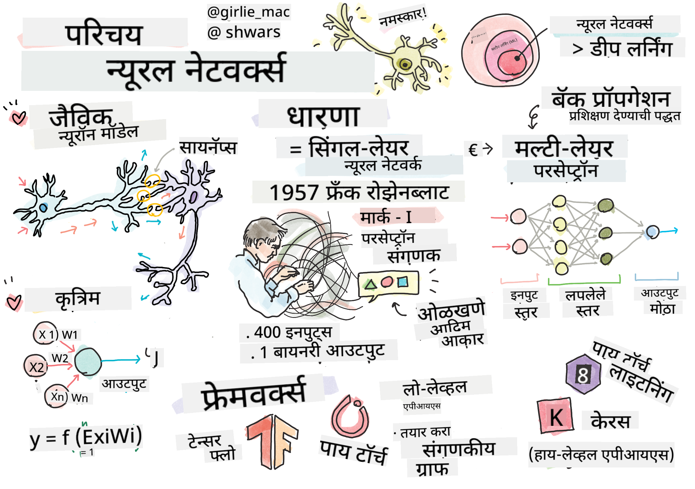

<!--
CO_OP_TRANSLATOR_METADATA:
{
  "original_hash": "1c6b8c7c1778a35fc1139b7f2aecb7b3",
  "translation_date": "2025-08-26T10:22:45+00:00",
  "source_file": "lessons/3-NeuralNetworks/README.md",
  "language_code": "mr"
}
-->
# न्यूरल नेटवर्क्सची ओळख

जसे आपण प्रस्तावनेत चर्चा केली, बुद्धिमत्ता साध्य करण्याच्या मार्गांपैकी एक म्हणजे **कंप्युटर मॉडेल** किंवा **कृत्रिम मेंदू** तयार करणे. विसाव्या शतकाच्या मध्यापासून संशोधकांनी विविध गणितीय मॉडेल्सचा प्रयत्न केला, आणि अलीकडच्या वर्षांत हा दृष्टिकोन अत्यंत यशस्वी ठरला. मेंदूच्या अशा गणितीय मॉडेल्सना **न्यूरल नेटवर्क्स** म्हणतात.

> कधी कधी न्यूरल नेटवर्क्सना *कृत्रिम न्यूरल नेटवर्क्स* (Artificial Neural Networks), ANNs असेही म्हणतात, जेणेकरून आपण खऱ्या न्यूरॉन्सच्या नेटवर्क्सबद्दल नव्हे तर मॉडेल्सबद्दल बोलत आहोत हे स्पष्ट होईल.

## मशीन लर्निंग

न्यूरल नेटवर्क्स ही **मशीन लर्निंग** नावाच्या मोठ्या शाखेचा एक भाग आहे, ज्याचा उद्देश डेटाचा वापर करून समस्यांचे निराकरण करणारी संगणकीय मॉडेल्स तयार करणे आहे. मशीन लर्निंग हा कृत्रिम बुद्धिमत्तेचा एक महत्त्वाचा भाग आहे, परंतु या अभ्यासक्रमात आपण पारंपरिक मशीन लर्निंग कव्हर करणार नाही.

> पारंपरिक मशीन लर्निंगबद्दल अधिक जाणून घेण्यासाठी आमचा स्वतंत्र **[मशीन लर्निंग फॉर बिगिनर्स](http://github.com/microsoft/ml-for-beginners)** अभ्यासक्रम पहा.

मशीन लर्निंगमध्ये, आपण गृहीत धरतो की आपल्याकडे काही उदाहरणांचा डेटासेट **X** आणि त्यास अनुरूप आउटपुट मूल्ये **Y** आहेत. उदाहरणे ही सहसा **वैशिष्ट्ये** असलेल्या N-आयामी वेक्टर असतात, आणि आउटपुट्सना **लेबल्स** म्हणतात.

आपण मशीन लर्निंगमधील दोन सर्वसामान्य समस्या विचारात घेऊ:

* **वर्गीकरण (Classification)**, जिथे आपल्याला इनपुट ऑब्जेक्टला दोन किंवा अधिक वर्गांमध्ये वर्गीकृत करायचे आहे.
* **प्रत्यावर्तन (Regression)**, जिथे आपल्याला प्रत्येक इनपुट नमुन्यासाठी एक संख्यात्मक मूल्य भाकीत करायचे आहे.

> जेव्हा इनपुट्स आणि आउटपुट्सना टेन्सर्स म्हणून दर्शवले जाते, तेव्हा इनपुट डेटासेट M×N आकाराच्या मॅट्रिक्समध्ये असते, जिथे M म्हणजे नमुन्यांची संख्या आणि N म्हणजे वैशिष्ट्यांची संख्या. आउटपुट लेबल्स Y हा M आकाराचा वेक्टर असतो.

या अभ्यासक्रमात, आपण केवळ न्यूरल नेटवर्क मॉडेल्सवर लक्ष केंद्रित करू.

## न्यूरॉनचे मॉडेल

जीवशास्त्रातून आपल्याला माहित आहे की आपला मेंदू न्यूरल पेशींनी बनलेला आहे, ज्यामध्ये प्रत्येक पेशीला अनेक "इनपुट्स" (अॅक्सॉन्स) आणि एक आउटपुट (डेंड्राइट) असतो. अॅक्सॉन्स आणि डेंड्राइट्स विद्युत संकेत वाहून नेऊ शकतात, आणि अॅक्सॉन्स व डेंड्राइट्समधील जोडणी वेगवेगळ्या प्रवाहक्षमतेचे प्रदर्शन करू शकते (न्यूरोमेडिएटर्सद्वारे नियंत्रित).

 | 
----|----
खरा न्यूरॉन *([Wikipedia](https://en.wikipedia.org/wiki/Synapse#/media/File:SynapseSchematic_lines.svg) मधील प्रतिमा)* | कृत्रिम न्यूरॉन *(लेखकाने तयार केलेली प्रतिमा)*

त्यामुळे, न्यूरॉनचे सर्वात सोपे गणितीय मॉडेल अनेक इनपुट्स X1, ..., XN आणि एक आउटपुट Y, तसेच W1, ..., WN नावाच्या वजनांच्या मालिकेचा समावेश करते. आउटपुटची गणना खालीलप्रमाणे केली जाते:

जिथे f ही काही नॉन-लिनिअर **सक्रियता फंक्शन** आहे.

> न्यूरॉनचे सुरुवातीचे मॉडेल्स वॉरेन मॅककुलॉक आणि वॉल्टर पिट्स यांनी 1943 मध्ये लिहिलेल्या [A logical calculus of the ideas immanent in nervous activity](https://www.cs.cmu.edu/~./epxing/Class/10715/reading/McCulloch.and.Pitts.pdf) या क्लासिकल पेपरमध्ये वर्णन केले होते. डोनाल्ड हेब यांनी त्यांच्या "[The Organization of Behavior: A Neuropsychological Theory](https://books.google.com/books?id=VNetYrB8EBoC)" या पुस्तकात या नेटवर्क्सना प्रशिक्षण देण्याचा मार्ग सुचवला.

## या विभागात

या विभागात आपण शिकू:
* [परसेप्ट्रॉन](03-Perceptron/README.md), दोन-वर्ग वर्गीकरणासाठी सर्वात जुने न्यूरल नेटवर्क मॉडेल्सपैकी एक
* [मल्टि-लेयर्ड नेटवर्क्स](04-OwnFramework/README.md) आणि त्यासोबतचा नोटबुक [आपले स्वतःचे फ्रेमवर्क तयार करणे](../../../../lessons/3-NeuralNetworks/04-OwnFramework/OwnFramework.ipynb)
* [न्यूरल नेटवर्क फ्रेमवर्क्स](05-Frameworks/README.md), यासह नोटबुक्स: [PyTorch](../../../../lessons/3-NeuralNetworks/05-Frameworks/IntroPyTorch.ipynb) आणि [Keras/Tensorflow](../../../../lessons/3-NeuralNetworks/05-Frameworks/IntroKerasTF.ipynb)
* [ओव्हरफिटिंग](../../../../lessons/3-NeuralNetworks/05-Frameworks)

**अस्वीकरण**:  
हा दस्तऐवज AI भाषांतर सेवा [Co-op Translator](https://github.com/Azure/co-op-translator) चा वापर करून भाषांतरित करण्यात आला आहे. आम्ही अचूकतेसाठी प्रयत्नशील असलो तरी, कृपया लक्षात घ्या की स्वयंचलित भाषांतरांमध्ये त्रुटी किंवा अचूकतेचा अभाव असू शकतो. मूळ भाषेतील मूळ दस्तऐवज हा अधिकृत स्रोत मानला जावा. महत्त्वाच्या माहितीसाठी व्यावसायिक मानवी भाषांतराची शिफारस केली जाते. या भाषांतराचा वापर केल्यामुळे उद्भवणाऱ्या कोणत्याही गैरसमज किंवा चुकीच्या अर्थासाठी आम्ही जबाबदार राहणार नाही.