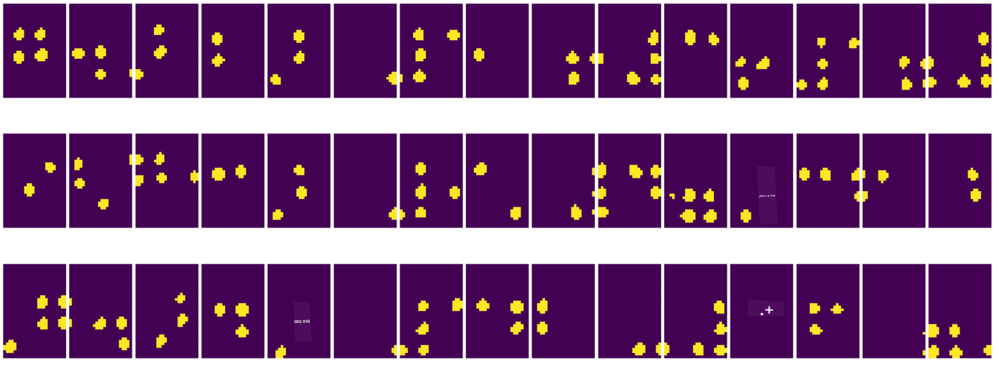

<!--
CO_OP_TRANSLATOR_METADATA:
{
  "original_hash": "4bedc8e702db17260cfe824d58b6cfd4",
  "translation_date": "2025-08-26T09:37:32+00:00",
  "source_file": "lessons/4-ComputerVision/06-IntroCV/README.md",
  "language_code": "mr"
}
-->
# संगणकीय दृष्टिकोनाची ओळख

[संगणकीय दृष्टिकोन](https://wikipedia.org/wiki/Computer_vision) हा एक शास्त्रशाखा आहे ज्याचा उद्देश संगणकांना डिजिटल प्रतिमांचे उच्च-स्तरीय आकलन मिळवून देणे आहे. ही व्याख्या खूप व्यापक आहे, कारण *आकलन* याचा अर्थ अनेक गोष्टींमध्ये होऊ शकतो, जसे की प्रतिमेत एखादी वस्तू शोधणे (**वस्तू शोधणे**), काय घडत आहे हे समजणे (**घटना शोधणे**), प्रतिमेचे वर्णन मजकुरात करणे, किंवा दृश्याचे 3D पुनर्रचना करणे. मानवी प्रतिमांशी संबंधित काही विशेष कार्ये देखील आहेत: वय आणि भावना अंदाज, चेहरा शोधणे आणि ओळखणे, आणि 3D पोझ अंदाज, इत्यादी.

## [पूर्व-व्याख्यान प्रश्नमंजुषा](https://ff-quizzes.netlify.app/en/ai/quiz/11)

संगणकीय दृष्टिकोनातील सर्वात सोप्या कार्यांपैकी एक म्हणजे **प्रतिमा वर्गीकरण**.

संगणकीय दृष्टिकोनाला अनेकदा AI चा एक भाग मानले जाते. आजकाल, संगणकीय दृष्टिकोनातील बहुतेक कार्ये न्यूरल नेटवर्क्सचा वापर करून सोडवली जातात. या विभागात, संगणकीय दृष्टिकोनासाठी वापरल्या जाणाऱ्या [कन्व्होल्यूशनल न्यूरल नेटवर्क्स](../07-ConvNets/README.md) बद्दल अधिक जाणून घेऊ.

तथापि, प्रतिमा न्यूरल नेटवर्कला पाठवण्यापूर्वी, अनेकदा प्रतिमेची गुणवत्ता सुधारण्यासाठी काही अल्गोरिदमिक तंत्रांचा वापर करणे उपयुक्त ठरते.

प्रतिमा प्रक्रिया करण्यासाठी अनेक Python लायब्ररी उपलब्ध आहेत:

* **[imageio](https://imageio.readthedocs.io/en/stable/)** विविध प्रतिमा स्वरूप वाचण्यासाठी/लिहिण्यासाठी वापरले जाऊ शकते. हे ffmpeg ला देखील समर्थन देते, जे व्हिडिओ फ्रेम्सना प्रतिमांमध्ये रूपांतरित करण्यासाठी उपयुक्त साधन आहे.
* **[Pillow](https://pillow.readthedocs.io/en/stable/index.html)** (PIL म्हणूनही ओळखले जाते) अधिक शक्तिशाली आहे आणि प्रतिमेचे रूपांतर, रंगसंगती समायोजन, इत्यादीसारख्या प्रतिमा हाताळणीला समर्थन देते.
* **[OpenCV](https://opencv.org/)** ही C++ मध्ये लिहिलेली एक शक्तिशाली प्रतिमा प्रक्रिया लायब्ररी आहे, जी प्रतिमा प्रक्रियेसाठी *डी फॅक्टो* मानक बनली आहे. याला Python इंटरफेस देखील आहे.
* **[dlib](http://dlib.net/)** ही C++ लायब्ररी आहे जी अनेक मशीन लर्निंग अल्गोरिदम अंमलात आणते, ज्यामध्ये काही संगणकीय दृष्टिकोन अल्गोरिदम देखील समाविष्ट आहेत. याला Python इंटरफेस आहे आणि चेहरा व चेहऱ्याच्या वैशिष्ट्यांचा शोध घेण्यासारख्या आव्हानात्मक कार्यांसाठी वापरले जाऊ शकते.

## OpenCV

[OpenCV](https://opencv.org/) ला प्रतिमा प्रक्रियेसाठी *डी फॅक्टो* मानक मानले जाते. यात C++ मध्ये अंमलात आणलेले अनेक उपयुक्त अल्गोरिदम आहेत. तुम्ही OpenCV ला Python मधून देखील कॉल करू शकता.

OpenCV शिकण्यासाठी एक चांगले ठिकाण म्हणजे [हे Learn OpenCV कोर्स](https://learnopencv.com/getting-started-with-opencv/). आमच्या अभ्यासक्रमात, आमचे उद्दिष्ट OpenCV शिकणे नाही, तर तुम्हाला काही उदाहरणे दाखवणे आहे की ते कधी आणि कसे वापरले जाऊ शकते.

### प्रतिमा लोड करणे

Python मध्ये प्रतिमा सोयीस्करपणे NumPy ऍरेद्वारे दर्शविल्या जाऊ शकतात. उदाहरणार्थ, 320x200 पिक्सेल आकाराच्या ग्रेस्केल प्रतिमा 200x320 ऍरेमध्ये संग्रहित केल्या जातील, आणि त्याच परिमाणाच्या रंगीत प्रतिमांचे स्वरूप 200x320x3 असेल (3 रंग चॅनेलसाठी). प्रतिमा लोड करण्यासाठी, तुम्ही खालील कोड वापरू शकता:

```python
import cv2
import matplotlib.pyplot as plt

im = cv2.imread('image.jpeg')
plt.imshow(im)
```

परंपरेने, OpenCV रंगीत प्रतिमांसाठी BGR (ब्लू-ग्रीन-रेड) एन्कोडिंग वापरते, तर Python मधील इतर साधने अधिक पारंपरिक RGB (रेड-ग्रीन-ब्लू) वापरतात. प्रतिमा योग्य दिसण्यासाठी, तुम्हाला ती RGB रंग जागेत रूपांतरित करणे आवश्यक आहे, NumPy ऍरेमधील परिमाणे अदलाबदल करून किंवा OpenCV फंक्शन कॉल करून:

```python
im = cv2.cvtColor(im,cv2.COLOR_BGR2RGB)
```

`cvtColor` फंक्शनचा वापर इतर रंग जागा रूपांतरणांसाठी देखील केला जाऊ शकतो, जसे की प्रतिमेला ग्रेस्केलमध्ये किंवा HSV (ह्यू-सॅच्युरेशन-वॅल्यू) रंग जागेत रूपांतरित करणे.

तुम्ही OpenCV चा वापर करून व्हिडिओ फ्रेम-बाय-फ्रेम देखील लोड करू शकता - याचे उदाहरण [OpenCV Notebook](../../../../../lessons/4-ComputerVision/06-IntroCV/OpenCV.ipynb) मध्ये दिले आहे.

### प्रतिमा प्रक्रिया

प्रतिमा न्यूरल नेटवर्कला पाठवण्यापूर्वी, तुम्हाला काही पूर्व-प्रक्रिया चरण लागू करायचे असतील. OpenCV अनेक गोष्टी करू शकते, जसे की:

* `im = cv2.resize(im, (320,200),interpolation=cv2.INTER_LANCZOS)` वापरून प्रतिमेचे **आकार बदलणे**  
* `im = cv2.medianBlur(im,3)` किंवा `im = cv2.GaussianBlur(im, (3,3), 0)` वापरून प्रतिमेचे **ब्लरिंग**  
* प्रतिमेचा **तेजस्विता आणि कॉन्ट्रास्ट** बदलणे, जे [या Stackoverflow नोट](https://stackoverflow.com/questions/39308030/how-do-i-increase-the-contrast-of-an-image-in-python-opencv) मध्ये वर्णन केल्याप्रमाणे NumPy ऍरे मॅनिप्युलेशनद्वारे केले जाऊ शकते.  
* [थ्रेशोल्डिंग](https://docs.opencv.org/4.x/d7/d4d/tutorial_py_thresholding.html) वापरणे, `cv2.threshold`/`cv2.adaptiveThreshold` फंक्शन्स कॉल करून, जे तेजस्विता किंवा कॉन्ट्रास्ट समायोजनापेक्षा अधिक उपयुक्त ठरते.  
* प्रतिमेवर विविध [रूपांतरणे](https://docs.opencv.org/4.5.5/da/d6e/tutorial_py_geometric_transformations.html) लागू करणे:  
    - **[अफाइन रूपांतरणे](https://docs.opencv.org/4.5.5/d4/d61/tutorial_warp_affine.html)**, जेव्हा तुम्हाला प्रतिमेतील तीन बिंदूंच्या स्त्रोत आणि गंतव्य स्थान माहित असते आणि तुम्हाला रोटेशन, आकार बदलणे आणि तिरकस करणे एकत्र करायचे असते. अफाइन रूपांतरणे समांतर रेषा समांतर ठेवतात.  
    - **[परिप्रेक्ष्य रूपांतरणे](https://medium.com/analytics-vidhya/opencv-perspective-transformation-9edffefb2143)**, जेव्हा तुम्हाला प्रतिमेतील चार बिंदूंच्या स्त्रोत आणि गंतव्य स्थान माहित असते. उदाहरणार्थ, जर तुम्ही स्मार्टफोन कॅमेराद्वारे कोणत्यातरी कोनातून आयताकृती दस्तऐवजाचे चित्र घेतले, आणि तुम्हाला दस्तऐवजाचे आयताकृती प्रतिमाच हवी असेल.  
* **[ऑप्टिकल फ्लो](https://docs.opencv.org/4.5.5/d4/dee/tutorial_optical_flow.html)** वापरून प्रतिमेमध्ये हालचाल समजून घेणे.  

## संगणकीय दृष्टिकोनाचा वापर करण्याची उदाहरणे

आमच्या [OpenCV Notebook](../../../../../lessons/4-ComputerVision/06-IntroCV/OpenCV.ipynb) मध्ये, आम्ही संगणकीय दृष्टिकोनाचा वापर करून विशिष्ट कार्ये कशी केली जाऊ शकतात याची काही उदाहरणे दिली आहेत:

* **ब्रेल पुस्तकाच्या छायाचित्राची पूर्व-प्रक्रिया करणे**. आम्ही थ्रेशोल्डिंग, वैशिष्ट्य शोधणे, परिप्रेक्ष्य रूपांतरण आणि NumPy मॅनिप्युलेशनचा वापर करून ब्रेल चिन्हे वेगळी कशी करता येतील यावर लक्ष केंद्रित करतो, जेणेकरून ती पुढे न्यूरल नेटवर्कद्वारे वर्गीकृत केली जाऊ शकतील.

 |  |   
----|-----|-----

> प्रतिमा [OpenCV.ipynb](../../../../../lessons/4-ComputerVision/06-IntroCV/OpenCV.ipynb) मधून

* **फ्रेम फरक वापरून व्हिडिओमध्ये हालचाल शोधणे**. जर कॅमेरा स्थिर असेल, तर कॅमेरा फीडमधील फ्रेम्स एकमेकांसारख्या असाव्यात. फ्रेम्स ऍरे म्हणून दर्शविल्या जात असल्याने, दोन सलग फ्रेम्ससाठी ऍरे वजा केल्याने पिक्सेल फरक मिळतो, जो स्थिर फ्रेम्ससाठी कमी असतो, आणि प्रतिमेमध्ये लक्षणीय हालचाल झाल्यास जास्त होतो.


> प्रतिमा [OpenCV.ipynb](../../../../../lessons/4-ComputerVision/06-IntroCV/OpenCV.ipynb) मधून

* **ऑप्टिकल फ्लो वापरून हालचाल शोधणे**. [ऑप्टिकल फ्लो](https://docs.opencv.org/3.4/d4/dee/tutorial_optical_flow.html) आम्हाला व्हिडिओ फ्रेम्सवरील वैयक्तिक पिक्सेल कसे हलतात हे समजून घेण्यास अनुमती देते. ऑप्टिकल फ्लोचे दोन प्रकार आहेत:

   - **डेंस ऑप्टिकल फ्लो** प्रत्येक पिक्सेलसाठी तो कुठे हलतो याचा वेक्टर फील्ड तयार करतो.  
   - **स्पार्स ऑप्टिकल फ्लो** प्रतिमेतील काही ठळक वैशिष्ट्ये (उदा. कडा) घेऊन, फ्रेम-टू-फ्रेम त्यांचा मार्ग तयार करतो.  


> प्रतिमा [OpenCV.ipynb](../../../../../lessons/4-ComputerVision/06-IntroCV/OpenCV.ipynb) मधून

## ✍️ उदाहरण नोटबुक्स: OpenCV [OpenCV अॅक्शनमध्ये वापरून पहा](../../../../../lessons/4-ComputerVision/06-IntroCV/OpenCV.ipynb)

चला [OpenCV Notebook](../../../../../lessons/4-ComputerVision/06-IntroCV/OpenCV.ipynb) एक्सप्लोर करून OpenCV सह काही प्रयोग करूया.

## निष्कर्ष

कधी कधी, हालचाल शोधणे किंवा बोटांच्या टोकांचा शोध घेणे यासारखी तुलनेने क्लिष्ट कार्ये केवळ संगणकीय दृष्टिकोनाने सोडवली जाऊ शकतात. त्यामुळे, संगणकीय दृष्टिकोनाच्या मूलभूत तंत्रांची आणि OpenCV सारख्या लायब्ररी काय करू शकतात याची माहिती असणे खूप उपयुक्त आहे.

## 🚀 आव्हान

AI शोमधील [हा व्हिडिओ](https://docs.microsoft.com/shows/ai-show/ai-show--2021-opencv-ai-competition--grand-prize-winners--cortic-tigers--episode-32?WT.mc_id=academic-77998-cacaste) पाहा, ज्यामध्ये Cortic Tigers प्रकल्पाबद्दल आणि त्यांनी संगणकीय दृष्टिकोन कार्ये लोकांसाठी सुलभ करण्यासाठी रोबोटद्वारे ब्लॉक-आधारित उपाय कसा तयार केला याबद्दल जाणून घ्या. या क्षेत्रात नवीन शिकणाऱ्यांना मदत करणाऱ्या अशा इतर प्रकल्पांवर संशोधन करा.

## [व्याख्यानानंतरची प्रश्नमंजुषा](https://ff-quizzes.netlify.app/en/ai/quiz/12)

## पुनरावलोकन आणि स्व-अभ्यास

ऑप्टिकल फ्लोबद्दल अधिक वाचा [या उत्कृष्ट ट्युटोरियलमध्ये](https://learnopencv.com/optical-flow-in-opencv/).

## [असाइनमेंट](lab/README.md)

या प्रयोगशाळेत, तुम्ही साध्या हालचालींसह एक व्हिडिओ घ्याल, आणि तुमचे उद्दिष्ट ऑप्टिकल फ्लो वापरून वर/खाली/डावीकडे/उजवीकडे हालचाली काढणे असेल.


**अस्वीकरण**:  
हा दस्तऐवज AI भाषांतर सेवा [Co-op Translator](https://github.com/Azure/co-op-translator) चा वापर करून भाषांतरित करण्यात आला आहे. आम्ही अचूकतेसाठी प्रयत्नशील असलो तरी, कृपया लक्षात घ्या की स्वयंचलित भाषांतरांमध्ये त्रुटी किंवा अचूकतेचा अभाव असू शकतो. मूळ भाषेतील मूळ दस्तऐवज हा अधिकृत स्रोत मानला जावा. महत्त्वाच्या माहितीसाठी व्यावसायिक मानवी भाषांतराची शिफारस केली जाते. या भाषांतराचा वापर केल्यामुळे उद्भवणाऱ्या कोणत्याही गैरसमज किंवा चुकीच्या अर्थासाठी आम्ही जबाबदार राहणार नाही.