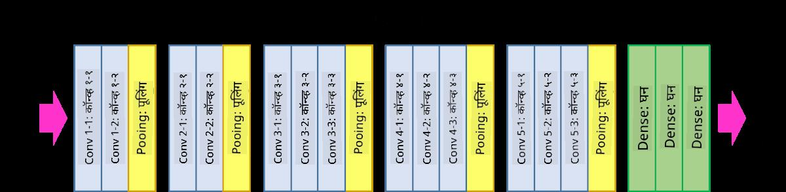
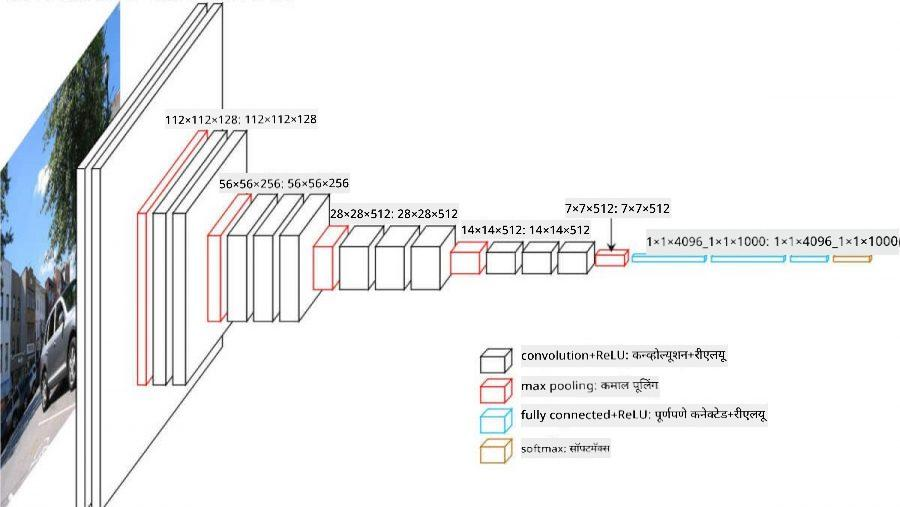

<!--
CO_OP_TRANSLATOR_METADATA:
{
  "original_hash": "2f7b97b375358cb51a1e098df306bf73",
  "translation_date": "2025-08-26T09:31:40+00:00",
  "source_file": "lessons/4-ComputerVision/07-ConvNets/CNN_Architectures.md",
  "language_code": "mr"
}
-->
# प्रसिद्ध CNN आर्किटेक्चर्स

### VGG-16

VGG-16 हा एक नेटवर्क आहे ज्याने 2014 मध्ये ImageNet टॉप-5 वर्गीकरणात 92.7% अचूकता मिळवली. यामध्ये खालील स्तर रचना आहे:

जसे तुम्ही पाहू शकता, VGG पारंपरिक पिरॅमिड आर्किटेक्चरचे अनुसरण करते, जे कॉनव्होल्यूशन-पूलिंग स्तरांचा क्रम आहे.

> [Researchgate](https://www.researchgate.net/figure/Vgg16-model-structure-To-get-the-VGG-NIN-model-we-replace-the-2-nd-4-th-6-th-7-th_fig2_335194493) मधील प्रतिमा

### ResNet

ResNet ही मॉडेल्सची एक श्रेणी आहे जी Microsoft Research ने 2015 मध्ये प्रस्तावित केली. ResNet चा मुख्य विचार **रेसिड्युअल ब्लॉक्स** वापरण्याचा आहे:

> [या पेपर](https://arxiv.org/pdf/1512.03385.pdf) मधील प्रतिमा

ओळख पास-थ्रू वापरण्याचे कारण म्हणजे आपला स्तर **मागील स्तराच्या निकाल आणि रेसिड्युअल ब्लॉकच्या आउटपुटमधील फरक** अंदाज करतो - म्हणूनच नाव *रेसिड्युअल*. हे ब्लॉक्स प्रशिक्षणासाठी खूप सोपे आहेत, आणि अशा शेकडो ब्लॉक्ससह नेटवर्क तयार करता येते (सर्वात सामान्य प्रकार म्हणजे ResNet-52, ResNet-101 आणि ResNet-152).

तुम्ही या नेटवर्कला डेटासेटच्या जटिलतेनुसार समायोजित करण्यास सक्षम असल्याचे देखील विचार करू शकता. सुरुवातीला, जेव्हा तुम्ही नेटवर्क प्रशिक्षण सुरू करता, तेव्हा वजनाचे मूल्य लहान असते, आणि बहुतेक सिग्नल पास-थ्रू ओळख स्तरांमधून जातो. प्रशिक्षण जसजसे पुढे जाते आणि वजन मोठे होते, तसतसे नेटवर्क पॅरामीटर्सचे महत्त्व वाढते, आणि नेटवर्क आवश्यक अभिव्यक्ती शक्ती समायोजित करते जेणेकरून प्रशिक्षण प्रतिमा योग्यरित्या वर्गीकृत करता येतील.

### Google Inception

Google Inception आर्किटेक्चर या कल्पनेला पुढे नेते आणि प्रत्येक नेटवर्क स्तराला अनेक वेगवेगळ्या मार्गांच्या संयोजनाने तयार करते:

> [Researchgate](https://www.researchgate.net/figure/Inception-module-with-dimension-reductions-left-and-schema-for-Inception-ResNet-v1_fig2_355547454) मधील प्रतिमा

येथे, 1x1 कॉनव्होल्यूशन्सची भूमिका अधोरेखित करणे आवश्यक आहे, कारण सुरुवातीला त्याचा अर्थ लागत नाही. 1x1 फिल्टरसह प्रतिमेवर का चालवावे लागेल? परंतु, तुम्हाला लक्षात ठेवावे लागेल की कॉनव्होल्यूशन फिल्टर्स अनेक खोली चॅनेल्ससह कार्य करतात (मूळतः - RGB रंग, नंतरच्या स्तरांमध्ये - वेगवेगळ्या फिल्टर्ससाठी चॅनेल्स), आणि 1x1 कॉनव्होल्यूशन वेगवेगळ्या ट्रेन करण्यायोग्य वजनांचा वापर करून इनपुट चॅनेल्स एकत्र मिसळण्यासाठी वापरले जाते. याकडे चॅनेल डायमेंशनवर डाउनसॅम्पलिंग (पूलिंग) म्हणून देखील पाहिले जाऊ शकते.

यावर [एक चांगला ब्लॉग पोस्ट](https://medium.com/analytics-vidhya/talented-mr-1x1-comprehensive-look-at-1x1-convolution-in-deep-learning-f6b355825578) आहे, आणि [मूळ पेपर](https://arxiv.org/pdf/1312.4400.pdf).

### MobileNet

MobileNet ही कमी आकाराची मॉडेल्सची श्रेणी आहे, जी मोबाइल डिव्हाइससाठी योग्य आहे. जर तुमच्याकडे संसाधने कमी असतील आणि थोडी अचूकता गमावण्याची तयारी असेल तर त्यांचा वापर करा. यामागील मुख्य कल्पना म्हणजे **डेप्थवाइज सेपरेबल कॉनव्होल्यूशन**, ज्यामुळे कॉनव्होल्यूशन फिल्टर्सचे प्रतिनिधित्व स्पॅशियल कॉनव्होल्यूशन्स आणि खोली चॅनेल्सवर 1x1 कॉनव्होल्यूशनच्या संयोजनाने करता येते. यामुळे पॅरामीटर्सची संख्या लक्षणीयरीत्या कमी होते, ज्यामुळे नेटवर्क आकाराने लहान होते आणि कमी डेटासह प्रशिक्षण देणे सोपे होते.

MobileNet वर [एक चांगला ब्लॉग पोस्ट](https://medium.com/analytics-vidhya/image-classification-with-mobilenet-cc6fbb2cd470) येथे आहे.

## निष्कर्ष

या युनिटमध्ये, तुम्ही संगणक दृष्टी न्यूरल नेटवर्क्समागील मुख्य संकल्पना शिकल्या - कॉनव्होल्यूशन नेटवर्क्स. प्रतिमा वर्गीकरण, ऑब्जेक्ट डिटेक्शन, आणि प्रतिमा निर्मिती नेटवर्क्स चालवणाऱ्या वास्तविक जीवनातील आर्किटेक्चर्स सर्व CNNs वर आधारित आहेत, फक्त अधिक स्तरांसह आणि काही अतिरिक्त प्रशिक्षण युक्त्या.

## 🚀 आव्हान

सोबतच्या नोटबुक्समध्ये, अधिक अचूकता मिळवण्याबद्दल तळाशी काही टिपा आहेत. काही प्रयोग करा आणि पाहा की तुम्ही अधिक अचूकता मिळवू शकता का.

## [पाठानंतरचा क्विझ](https://red-field-0a6ddfd03.1.azurestaticapps.net/quiz/207)

## पुनरावलोकन आणि स्व-अभ्यास

जरी CNNs प्रामुख्याने संगणक दृष्टी कार्यांसाठी वापरले जातात, तरी ते निश्चित आकाराचे नमुने काढण्यासाठी सामान्यतः चांगले असतात. उदाहरणार्थ, जर आपण आवाजांशी व्यवहार करत असू, तर आम्हाला ऑडिओ सिग्नलमध्ये काही विशिष्ट नमुने शोधण्यासाठी CNNs वापरायचे असू शकते - अशा परिस्थितीत फिल्टर्स 1-डायमेंशनल असतील (आणि हे CNN 1D-CNN म्हणून ओळखले जाईल). तसेच, कधीकधी 3D-CNN बहु-आयामी जागेत वैशिष्ट्ये काढण्यासाठी वापरले जाते, जसे की व्हिडिओवर काही विशिष्ट घटना घडणे - CNN वेळोवेळी बदलणाऱ्या वैशिष्ट्यांचे विशिष्ट नमुने कॅप्चर करू शकते. CNNs द्वारे केले जाऊ शकणाऱ्या इतर कार्यांबद्दल पुनरावलोकन आणि स्व-अभ्यास करा.

## [असाइनमेंट](lab/README.md)

या लॅबमध्ये, तुम्हाला वेगवेगळ्या मांजरी आणि कुत्र्यांच्या जाती वर्गीकृत करण्याचे काम दिले आहे. या प्रतिमा MNIST डेटासेटपेक्षा अधिक जटिल आहेत आणि उच्च परिमाणांच्या आहेत, आणि 10 पेक्षा जास्त वर्ग आहेत.

**अस्वीकरण**:  
हा दस्तऐवज AI भाषांतर सेवा [Co-op Translator](https://github.com/Azure/co-op-translator) चा वापर करून भाषांतरित करण्यात आला आहे. आम्ही अचूकतेसाठी प्रयत्नशील असलो तरी, कृपया लक्षात घ्या की स्वयंचलित भाषांतरांमध्ये त्रुटी किंवा अचूकतेचा अभाव असू शकतो. मूळ भाषेतील मूळ दस्तऐवज हा अधिकृत स्रोत मानला जावा. महत्त्वाच्या माहितीसाठी व्यावसायिक मानवी भाषांतराची शिफारस केली जाते. या भाषांतराचा वापर केल्यामुळे उद्भवणाऱ्या कोणत्याही गैरसमज किंवा चुकीच्या अर्थासाठी आम्ही जबाबदार राहणार नाही.