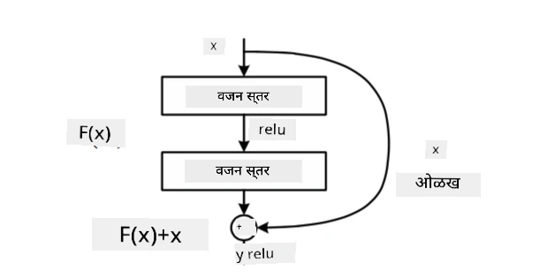
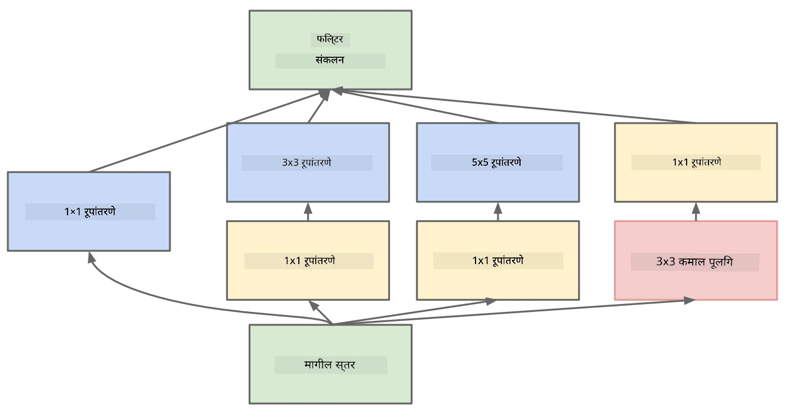

# प्रसिद्ध CNN आर्किटेक्चर्स

### VGG-16

VGG-16 हा एक नेटवर्क आहे ज्याने 2014 मध्ये ImageNet टॉप-5 वर्गीकरणात 92.7% अचूकता मिळवली. यामध्ये खालील स्तर रचना आहे:

जसे तुम्ही पाहू शकता, VGG पारंपरिक पिरॅमिड आर्किटेक्चरचे अनुसरण करते, जे कन्व्होल्यूशन-पूलिंग स्तरांचा क्रम आहे.

> प्रतिमा [Researchgate](https://www.researchgate.net/figure/Vgg16-model-structure-To-get-the-VGG-NIN-model-we-replace-the-2-nd-4-th-6-th-7-th_fig2_335194493) वरून घेतलेली आहे.

### ResNet

ResNet हे मॉडेल्सचे कुटुंब आहे, जे Microsoft Research ने 2015 मध्ये प्रस्तावित केले. ResNet चा मुख्य विचार म्हणजे **रेसिड्युअल ब्लॉक्स** वापरणे:

> प्रतिमा [या पेपरमधून](https://arxiv.org/pdf/1512.03385.pdf)

ओळख पास-थ्रू वापरण्याचे कारण म्हणजे आपल्या स्तराला **मागील स्तराच्या परिणाम आणि रेसिड्युअल ब्लॉकच्या आउटपुटमधील फरक** भाकीत करण्यास सक्षम करणे - म्हणून याला *रेसिड्युअल* असे नाव दिले आहे. हे ब्लॉक्स प्रशिक्षणासाठी खूप सोपे आहेत, आणि अशा ब्लॉक्सच्या शेकडो स्तरांसह नेटवर्क तयार करता येते (सर्वात सामान्य प्रकार म्हणजे ResNet-52, ResNet-101 आणि ResNet-152).

तुम्ही या नेटवर्कला डेटासेटच्या जटिलतेनुसार स्वतःला समायोजित करणारे म्हणून देखील विचार करू शकता. सुरुवातीला, जेव्हा तुम्ही नेटवर्कचे प्रशिक्षण सुरू करता, तेव्हा वेट्सचे मूल्य लहान असते, आणि बहुतेक सिग्नल पास-थ्रू ओळख स्तरांमधून जातो. जसजसे प्रशिक्षण प्रगती करत जाते आणि वेट्स मोठे होतात, तसतसे नेटवर्क पॅरामीटर्सचे महत्त्व वाढते, आणि नेटवर्क स्वतःला आवश्यक अभिव्यक्ती शक्ती समायोजित करते जेणेकरून प्रशिक्षण प्रतिमा योग्यरित्या वर्गीकृत करता येतील.

### Google Inception

Google Inception आर्किटेक्चरने या कल्पनेला आणखी एक पाऊल पुढे नेले आहे आणि प्रत्येक नेटवर्क स्तराला अनेक वेगवेगळ्या मार्गांच्या संयोजनाने तयार केले आहे:

> प्रतिमा [Researchgate](https://www.researchgate.net/figure/Inception-module-with-dimension-reductions-left-and-schema-for-Inception-ResNet-v1_fig2_355547454) वरून घेतलेली आहे.

येथे, 1x1 कन्व्होल्यूशन्सच्या भूमिकेवर भर देणे आवश्यक आहे, कारण सुरुवातीला ते अर्थपूर्ण वाटत नाहीत. 1x1 फिल्टरसह प्रतिमेवर का चालवावे? मात्र, तुम्हाला लक्षात ठेवावे लागेल की कन्व्होल्यूशन फिल्टर्स अनेक खोली चॅनेल्ससह देखील कार्य करतात (मूळतः - RGB रंग, नंतरच्या स्तरांमध्ये - वेगवेगळ्या फिल्टर्ससाठी चॅनेल्स), आणि 1x1 कन्व्होल्यूशन इनपुट चॅनेल्सना वेगवेगळ्या ट्रेन करण्यायोग्य वेट्ससह एकत्र मिसळण्यासाठी वापरले जाते. याला चॅनेल डायमेंशनवर डाउनसॅम्पलिंग (पूलिंग) म्हणूनही पाहिले जाऊ शकते.

येथे [1x1 कन्व्होल्यूशनवर एक चांगला ब्लॉग पोस्ट](https://medium.com/analytics-vidhya/talented-mr-1x1-comprehensive-look-at-1x1-convolution-in-deep-learning-f6b355825578) आहे, आणि [मूळ पेपर](https://arxiv.org/pdf/1312.4400.pdf) देखील.

### MobileNet

MobileNet हे कमी आकाराचे मॉडेल्सचे कुटुंब आहे, जे मोबाइल डिव्हाइससाठी योग्य आहे. जर तुमच्याकडे संसाधने कमी असतील आणि तुम्ही थोडी अचूकता गमावण्यास तयार असाल, तर त्यांचा वापर करा. यामागील मुख्य कल्पना म्हणजे **डेप्थवाइज सेपरेबल कन्व्होल्यूशन**, ज्यामुळे कन्व्होल्यूशन फिल्टर्सना स्पेशियल कन्व्होल्यूशन्स आणि डेप्थ चॅनेल्सवरील 1x1 कन्व्होल्यूशनच्या संयोजनाने दर्शवता येते. यामुळे पॅरामीटर्सची संख्या लक्षणीयरीत्या कमी होते, ज्यामुळे नेटवर्कचा आकार लहान होतो, आणि कमी डेटासह प्रशिक्षण देणे सोपे होते.

येथे [MobileNet वर एक चांगला ब्लॉग पोस्ट](https://medium.com/analytics-vidhya/image-classification-with-mobilenet-cc6fbb2cd470) आहे.

## निष्कर्ष

या युनिटमध्ये, तुम्ही संगणकीय दृष्टिकोनातील न्यूरल नेटवर्क्समागील मुख्य संकल्पना शिकल्या - कन्व्होल्यूशन नेटवर्क्स. प्रत्यक्ष जीवनातील आर्किटेक्चर्स जे प्रतिमा वर्गीकरण, ऑब्जेक्ट डिटेक्शन, आणि अगदी प्रतिमा निर्मिती नेटवर्क्सला सामर्थ्य देतात, ते सर्व CNNs वर आधारित आहेत, फक्त अधिक स्तरांसह आणि काही अतिरिक्त प्रशिक्षण तंत्रांसह.

## 🚀 आव्हान

सोबतच्या नोटबुक्समध्ये, अधिक अचूकता मिळवण्याबद्दल तळाशी काही टिपा दिल्या आहेत. काही प्रयोग करा आणि पाहा की तुम्ही अधिक अचूकता साध्य करू शकता का.

## [पाठ-पश्चात क्विझ](https://ff-quizzes.netlify.app/en/ai/quiz/14)

## पुनरावलोकन आणि स्व-अभ्यास

जरी CNNs प्रामुख्याने संगणकीय दृष्टिकोनातील कार्यांसाठी वापरले जात असले तरी, ते निश्चित आकाराचे पॅटर्न काढण्यासाठी सामान्यतः चांगले असतात. उदाहरणार्थ, जर आपण ध्वनींसह व्यवहार करत असू, तर आम्हाला ऑडिओ सिग्नलमध्ये काही विशिष्ट पॅटर्न शोधण्यासाठी CNNs वापरायचे असू शकते - अशा परिस्थितीत फिल्टर्स 1-डायमेंशनल असतील (आणि या CNN ला 1D-CNN म्हणतात). तसेच, कधीकधी 3D-CNN बहु-डायमेंशनल स्पेसमध्ये वैशिष्ट्ये काढण्यासाठी वापरले जाते, जसे की व्हिडिओमध्ये घडणाऱ्या विशिष्ट घटना - CNN वेळोवेळी बदलणाऱ्या वैशिष्ट्यांच्या विशिष्ट पॅटर्न्स कॅप्चर करू शकते. CNNs सह इतर कोणती कार्ये केली जाऊ शकतात याबद्दल पुनरावलोकन आणि स्व-अभ्यास करा.

## [असाइनमेंट](lab/README.md)

या लॅबमध्ये, तुम्हाला वेगवेगळ्या मांजर आणि कुत्र्यांच्या प्रजाती वर्गीकृत करण्याचे काम दिले आहे. या प्रतिमा MNIST डेटासेटपेक्षा अधिक जटिल आणि उच्च परिमाणांच्या आहेत, आणि 10 हून अधिक वर्ग आहेत.

---

