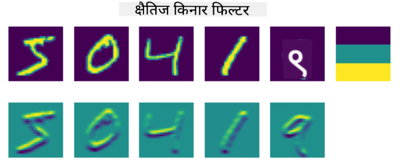
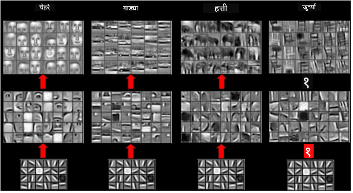

<!--
CO_OP_TRANSLATOR_METADATA:
{
  "original_hash": "088837b42b7d99198bf62db8a42411e0",
  "translation_date": "2025-08-26T09:28:18+00:00",
  "source_file": "lessons/4-ComputerVision/07-ConvNets/README.md",
  "language_code": "mr"
}
-->
# कॉनव्होल्यूशनल न्यूरल नेटवर्क्स

आपण यापूर्वी पाहिले आहे की न्यूरल नेटवर्क्स प्रतिमांशी चांगल्या प्रकारे व्यवहार करू शकतात, आणि अगदी एक-लेयर परसेप्ट्रॉन देखील MNIST डेटासेटमधील हस्तलिखित अंकांना वाजवी अचूकतेने ओळखू शकतो. तथापि, MNIST डेटासेट खूपच विशेष आहे, आणि सर्व अंक प्रतिमेमध्ये केंद्रित केलेले आहेत, ज्यामुळे कार्य सोपे होते.

## [पूर्व-व्याख्यान प्रश्नमंजुषा](https://ff-quizzes.netlify.app/en/ai/quiz/13)

वास्तविक जीवनात, आम्हाला प्रतिमेमध्ये वस्तूंचे अचूक स्थान लक्षात न घेता त्यांना ओळखता यावे अशी अपेक्षा असते. संगणकीय दृष्टिकोन सामान्य वर्गीकरणापेक्षा वेगळा आहे, कारण जेव्हा आपण प्रतिमेमध्ये विशिष्ट वस्तू शोधण्याचा प्रयत्न करतो, तेव्हा आपण प्रतिमेमध्ये काही विशिष्ट **पॅटर्न्स** आणि त्यांच्या संयोजनांचा शोध घेत असतो. उदाहरणार्थ, मांजरीचा शोध घेताना, आपण प्रथम आडव्या रेषा शोधू शकतो, ज्या मिशा तयार करू शकतात, आणि नंतर मिशांच्या विशिष्ट संयोजनामुळे आपल्याला कळते की ती प्रतिमा मांजरीची आहे. विशिष्ट पॅटर्न्सची सापेक्ष स्थिती आणि उपस्थिती महत्त्वाची आहे, प्रतिमेमध्ये त्यांचे अचूक स्थान नाही.

पॅटर्न्स काढण्यासाठी, आपण **कॉनव्होल्यूशनल फिल्टर्स** या संकल्पनेचा वापर करू. तुम्हाला माहीतच आहे की, प्रतिमा 2D-मॅट्रिक्स किंवा रंग खोलीसह 3D-टेंसरद्वारे दर्शविली जाते. फिल्टर लागू करणे म्हणजे आपण तुलनेने लहान **फिल्टर कर्नल** मॅट्रिक्स घेतो, आणि मूळ प्रतिमेतील प्रत्येक पिक्सेलसाठी शेजारील बिंदूंसह भारित सरासरीची गणना करतो. आपण याकडे असे पाहू शकतो की जणू एक लहान विंडो संपूर्ण प्रतिमेवर सरकत आहे, आणि फिल्टर कर्नल मॅट्रिक्समधील वजनांनुसार सर्व पिक्सेल्सची सरासरी काढत आहे.

 | 
----|----

> प्रतिमा: दिमित्री सॉश्निकोव्ह

उदाहरणार्थ, जर आपण MNIST अंकांवर 3x3 उभ्या कडांचा आणि आडव्या कडांचा फिल्टर लागू केला, तर आपण मूळ प्रतिमेमध्ये जिथे उभ्या आणि आडव्या कडा आहेत तिथे हायलाइट्स (उदा. उच्च मूल्ये) मिळवू शकतो. त्यामुळे हे दोन फिल्टर्स "कडांचा शोध घेण्यासाठी" वापरले जाऊ शकतात. त्याचप्रमाणे, इतर कमी-स्तरीय पॅटर्न्स शोधण्यासाठी वेगवेगळे फिल्टर्स डिझाइन केले जाऊ शकतात:

> [ल्यूंग-मालिक फिल्टर बँकेचे चित्र](https://www.robots.ox.ac.uk/~vgg/research/texclass/filters.html)

तथापि, जरी आपण काही पॅटर्न्स काढण्यासाठी फिल्टर्स मॅन्युअली डिझाइन करू शकतो, तरीही आपण नेटवर्क अशा प्रकारे डिझाइन करू शकतो की ते पॅटर्न्स आपोआप शिकेल. हीच CNN च्या मागील मुख्य कल्पनांपैकी एक आहे.

## CNN च्या मुख्य कल्पना

CNN कसे कार्य करते यामागील महत्त्वाच्या कल्पना पुढीलप्रमाणे आहेत:

* कॉनव्होल्यूशनल फिल्टर्स पॅटर्न्स काढू शकतात
* आपण नेटवर्क अशा प्रकारे डिझाइन करू शकतो की फिल्टर्स आपोआप प्रशिक्षित होतील
* आपण मूळ प्रतिमेपुरतेच मर्यादित न राहता उच्च-स्तरीय वैशिष्ट्यांमध्ये पॅटर्न्स शोधण्यासाठी देखील याच दृष्टिकोनाचा वापर करू शकतो. त्यामुळे CNN वैशिष्ट्ये काढण्याचे कार्य वैशिष्ट्यांच्या श्रेणीमध्ये होते, जे कमी-स्तरीय पिक्सेल संयोजनांपासून सुरू होते आणि प्रतिमेच्या भागांच्या उच्च-स्तरीय संयोजनांपर्यंत पोहोचते.

> प्रतिमा: [हिस्लॉप-लिंच यांच्या पेपरमधून](https://www.semanticscholar.org/paper/Computer-vision-based-pedestrian-trajectory-Hislop-Lynch/26e6f74853fc9bbb7487b06dc2cf095d36c9021d), त्यांच्या [संशोधनावर आधारित](https://dl.acm.org/doi/abs/10.1145/1553374.1553453)

## ✍️ सराव: कॉनव्होल्यूशनल न्यूरल नेटवर्क्स

चला कॉनव्होल्यूशनल न्यूरल नेटवर्क्स कसे कार्य करतात आणि आपण प्रशिक्षित होणारे फिल्टर्स कसे साध्य करू शकतो हे समजून घेण्यासाठी संबंधित नोटबुक्सवर काम करूया:

* [कॉनव्होल्यूशनल न्यूरल नेटवर्क्स - PyTorch](../../../../../lessons/4-ComputerVision/07-ConvNets/ConvNetsPyTorch.ipynb)
* [कॉनव्होल्यूशनल न्यूरल नेटवर्क्स - TensorFlow](../../../../../lessons/4-ComputerVision/07-ConvNets/ConvNetsTF.ipynb)

## पिरॅमिड आर्किटेक्चर

प्रतिमा प्रक्रिया करण्यासाठी वापरल्या जाणाऱ्या बहुतेक CNNs तथाकथित पिरॅमिड आर्किटेक्चरचे अनुसरण करतात. मूळ प्रतिमांवर लागू केलेल्या पहिल्या कॉनव्होल्यूशनल लेयरमध्ये सामान्यतः तुलनेने कमी फिल्टर्स (8-16) असतात, जे भिन्न पिक्सेल संयोजनांशी संबंधित असतात, जसे की आडव्या/उभ्या रेषा किंवा स्ट्रोक्स. पुढील स्तरावर, आपण नेटवर्कचे स्थानिक परिमाण कमी करतो आणि फिल्टर्सची संख्या वाढवतो, जे साध्या वैशिष्ट्यांच्या अधिक संभाव्य संयोजनांशी संबंधित असते. प्रत्येक स्तरासह, अंतिम वर्गीकरणाकडे जाताना प्रतिमेची स्थानिक परिमाणे कमी होतात, आणि फिल्टर्सची संख्या वाढते.

उदाहरण म्हणून, VGG-16 च्या आर्किटेक्चरकडे पाहूया, ज्याने 2014 मध्ये ImageNet च्या टॉप-5 वर्गीकरणात 92.7% अचूकता साध्य केली:

> प्रतिमा: [रिसर्चगेट](https://www.researchgate.net/figure/Vgg16-model-structure-To-get-the-VGG-NIN-model-we-replace-the-2-nd-4-th-6-th-7-th_fig2_335194493)

## सर्वात प्रसिद्ध CNN आर्किटेक्चर्स

[सर्वात प्रसिद्ध CNN आर्किटेक्चर्सबद्दल तुमचा अभ्यास सुरू ठेवा](CNN_Architectures.md)

**अस्वीकरण**:  
हा दस्तऐवज AI भाषांतर सेवा [Co-op Translator](https://github.com/Azure/co-op-translator) चा वापर करून भाषांतरित करण्यात आला आहे. आम्ही अचूकतेसाठी प्रयत्नशील असलो तरी, कृपया लक्षात घ्या की स्वयंचलित भाषांतरांमध्ये त्रुटी किंवा अचूकतेचा अभाव असू शकतो. मूळ भाषेतील दस्तऐवज हा अधिकृत स्रोत मानला जावा. महत्त्वाच्या माहितीसाठी, व्यावसायिक मानवी भाषांतराची शिफारस केली जाते. या भाषांतराचा वापर केल्यामुळे उद्भवणाऱ्या कोणत्याही गैरसमज किंवा चुकीच्या अर्थासाठी आम्ही जबाबदार राहणार नाही.