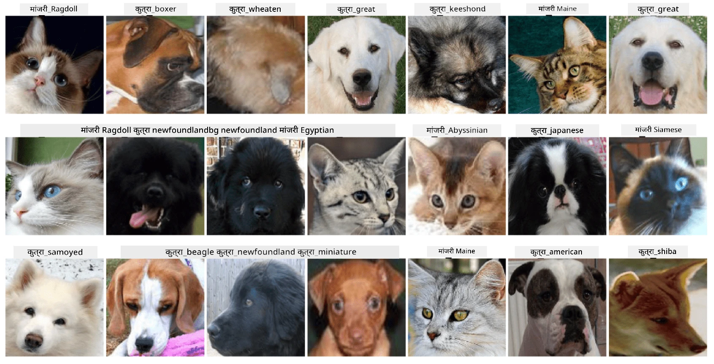

# पाळीव प्राण्यांच्या चेहऱ्यांचे वर्गीकरण

[AI for Beginners Curriculum](https://github.com/microsoft/ai-for-beginners) मधील प्रयोगशाळा असाइनमेंट.

## कार्य

कल्पना करा की तुम्हाला पाळीव प्राण्यांच्या नर्सरीसाठी एक अॅप्लिकेशन विकसित करायचे आहे जे सर्व पाळीव प्राण्यांचे वर्गीकरण करेल. अशा अॅप्लिकेशनची एक उत्तम वैशिष्ट्य म्हणजे छायाचित्रावरून प्राण्याची जात आपोआप शोधणे. हे न्यूरल नेटवर्क्स वापरून यशस्वीपणे करता येते.

तुम्हाला **Pet Faces** डेटासेट वापरून मांजरी आणि कुत्र्यांच्या विविध जाती वर्गीकृत करण्यासाठी एक कॉनव्होल्यूशनल न्यूरल नेटवर्क प्रशिक्षण द्यायचे आहे.

## डेटासेट

आम्ही [Oxford-IIIT Pet Dataset](https://www.robots.ox.ac.uk/~vgg/data/pets/) वापरणार आहोत, ज्यामध्ये 37 वेगवेगळ्या जातींच्या कुत्र्यांच्या आणि मांजरींच्या प्रतिमा आहेत.



डेटासेट डाउनलोड करण्यासाठी, हा कोड स्निपेट वापरा:

```python
!wget https://thor.robots.ox.ac.uk/~vgg/data/pets/images.tar.gz
!tar xfz images.tar.gz
!rm images.tar.gz
```

**टीप:** Oxford-IIIT Pet Dataset प्रतिमा फाइल नावानुसार आयोजित केल्या आहेत (उदा., `Abyssinian_1.jpg`, `Bengal_2.jpg`). वर्गीकरण सुलभ करण्यासाठी या प्रतिमा जाती-विशिष्ट उपनिर्देशिकांमध्ये आयोजित करण्यासाठी नोटबुकमध्ये कोड समाविष्ट आहे.

## प्रारंभिक नोटबुक

[PetFaces.ipynb](PetFaces.ipynb) उघडून प्रयोगशाळा सुरू करा.

## महत्त्वाचे मुद्दे

तुम्ही प्रतिमेचे वर्गीकरण शून्यापासून सोडवले आहे, जे तुलनेने जटिल समस्या आहे! वर्ग खूप होते, तरीही तुम्ही वाजवी अचूकता मिळवली! टॉप-k अचूकता मोजणे देखील महत्त्वाचे आहे, कारण काही वर्ग गोंधळात टाकणारे असू शकतात जे मानवांसाठीही स्पष्टपणे वेगळे नाहीत.

---

**अस्वीकरण**:  
हा दस्तऐवज AI भाषांतर सेवा [Co-op Translator](https://github.com/Azure/co-op-translator) चा वापर करून भाषांतरित करण्यात आला आहे. आम्ही अचूकतेसाठी प्रयत्नशील असलो तरी कृपया लक्षात ठेवा की स्वयंचलित भाषांतरे त्रुटी किंवा अचूकतेच्या अभावाने युक्त असू शकतात. मूळ भाषेतील दस्तऐवज हा अधिकृत स्रोत मानला जावा. महत्त्वाच्या माहितीसाठी व्यावसायिक मानवी भाषांतराची शिफारस केली जाते. या भाषांतराचा वापर करून उद्भवलेल्या कोणत्याही गैरसमज किंवा चुकीच्या अर्थासाठी आम्ही जबाबदार राहणार नाही.